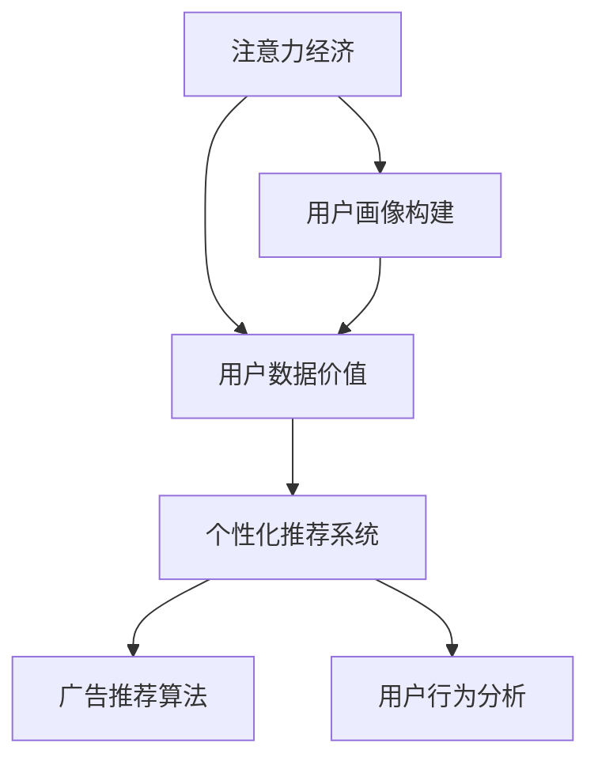

                 

# 注意力经济下的用户数据价值

> 关键词：注意力经济,用户数据价值,个性化推荐系统,广告推荐算法,用户行为分析

## 1. 背景介绍

### 1.1 问题由来

在数字化时代，信息爆炸成为常态，人们获取和处理信息的能力面临巨大挑战。在这背景下，注意力经济应运而生。注意力经济指的是在信息过载的社会中，如何将用户有限注意力资源有效转化为商业价值。其中，用户数据在精准定位和推送个性化的内容、产品和服务中起到了关键作用。

注意力经济的核心在于通过精准分析用户行为和偏好，为他们提供定制化的信息和服务，从而提升用户满意度和忠诚度，进而推动商业模式的创新。然而，如何高效利用用户数据，发现数据背后的真正价值，以及如何在保护用户隐私的前提下进行数据使用，成为当前技术和社会关注的焦点。

### 1.2 问题核心关键点

1. **数据收集与整理**：通过多渠道收集用户行为数据，包括搜索、点击、购买等行为记录，并加以清洗和整理，形成结构化的数据集。
2. **用户画像构建**：对用户数据进行深入分析，构建完整的用户画像，包括用户基本信息、兴趣偏好、行为习惯等。
3. **推荐系统设计**：设计合适的推荐算法和模型，根据用户画像和历史行为预测其未来需求，并推送个性化内容。
4. **效果评估与优化**：评估推荐系统的表现，并通过A/B测试等手段不断优化模型参数和算法策略，提升推荐效果。
5. **隐私保护与合规**：在数据使用和处理过程中，严格遵守数据隐私保护法规和伦理规范，确保用户信息安全。

通过上述关键步骤，可以有效实现用户数据的价值最大化，同时保障用户权益，构建健康有序的注意力经济生态。

### 1.3 问题研究意义

在注意力经济中，用户数据不仅是信息交换的介质，更是驱动商业模式创新的关键要素。深入研究如何高效利用用户数据，提升推荐系统的精准度和效果，对于提升用户体验、驱动经济增长具有重要意义：

1. **提升用户满意度**：通过个性化推荐，能够为用户提供更符合其需求的内容，提升用户体验，增强用户粘性。
2. **推动商业模式创新**：个性化推荐系统可以提升广告精准投放和零售转化率，驱动广告、零售等传统行业向精准营销转型。
3. **促进信息消费**：通过推荐优质内容，激发用户对新知识、新商品的好奇心和消费欲望，促进信息消费和数字经济的繁荣。
4. **构建健康生态**：科学合理的推荐算法和用户数据使用策略，可以平衡用户权益和商业利益，构建良性的注意力经济生态。

## 2. 核心概念与联系

### 2.1 核心概念概述

为更好地理解注意力经济下的用户数据价值，本节将介绍几个关键概念：

- **注意力经济**：指在信息过载时代，如何高效分配和利用用户的注意力资源，以获得商业价值的经济模式。
- **用户数据价值**：指通过收集和分析用户行为数据，获取用户偏好、行为模式等关键信息，从而进行个性化推荐，提升商业价值的过程。
- **个性化推荐系统**：指根据用户历史行为和画像，通过算法和模型，为用户推荐个性化内容、产品或服务的技术系统。
- **广告推荐算法**：指将广告与用户行为数据结合，实现精准投放和广告效果优化的算法。
- **用户行为分析**：指对用户行为数据进行挖掘和分析，了解用户兴趣、偏好和行为模式，从而指导推荐算法的设计和优化。

这些概念之间的联系可以通过以下Mermaid流程图来展示：



这个流程图展示了几者的关系：

1. 注意力经济以用户数据价值为核心，通过用户画像和行为分析构建用户画像。
2. 用户画像指导个性化推荐系统设计，从而实现精准推荐。
3. 广告推荐算法是针对广告投放的场景进行优化的推荐算法，提升广告效果。
4. 用户行为分析是不断优化推荐系统的反馈机制，确保算法效果不断提升。

## 3. 核心算法原理 & 具体操作步骤
### 3.1 算法原理概述

个性化推荐系统的核心在于构建用户画像，并通过算法预测用户未来的行为。其算法原理主要基于协同过滤、矩阵分解、深度学习等技术，通过构建用户和物品的相似度矩阵，或使用神经网络模型预测用户行为，实现个性化推荐。

广告推荐算法则更关注如何提高广告投放的精准度和效果，主要基于点击率预测、转化率预测等指标，优化广告位置和投放策略。

用户行为分析旨在深入理解用户行为模式和偏好，可以通过聚类分析、时间序列分析等方法，揭示用户行为的规律性。

### 3.2 算法步骤详解

基于注意力经济下的用户数据价值，推荐系统的主要步骤包括：

**Step 1: 数据收集与整理**

- 通过网络爬虫、应用日志、购买记录等渠道收集用户数据。
- 清洗和标准化数据，去除噪音和异常值，形成结构化数据集。
- 对数据进行特征工程，提取用户行为、属性等关键特征。

**Step 2: 用户画像构建**

- 利用机器学习算法，如聚类、分类等方法，对用户数据进行分析。
- 构建用户画像，包括用户基本信息、兴趣偏好、行为习惯等。
- 通过多维度分析，形成用户行为的全面视图。

**Step 3: 推荐系统设计**

- 选择合适的推荐算法，如协同过滤、基于矩阵分解的方法、深度学习模型等。
- 根据用户画像和历史行为数据，训练推荐模型。
- 实时处理用户查询，根据模型预测结果进行推荐。

**Step 4: 广告推荐算法优化**

- 收集广告投放数据，建立广告与用户行为之间的关联。
- 利用点击率预测模型，优化广告位和投放策略。
- 不断调整和优化算法，提升广告投放效果。

**Step 5: 用户行为分析**

- 收集和处理用户行为数据，提取行为特征。
- 利用时间序列分析、异常检测等方法，分析用户行为规律。
- 结合用户画像和推荐结果，进一步优化推荐算法。

**Step 6: 效果评估与优化**

- 利用A/B测试等方法，评估推荐系统效果。
- 根据评估结果，优化模型参数和算法策略。
- 不断迭代和优化，提升推荐系统的精准度。

### 3.3 算法优缺点

个性化推荐系统的主要优点包括：

1. **提升用户满意度**：通过个性化推荐，能够满足用户特定需求，提升用户满意度和忠诚度。
2. **提高广告效果**：通过精准投放广告，提升广告点击率和转化率，提高广告ROI。
3. **优化用户体验**：通过推荐符合用户偏好的内容，提升用户体验，增加使用粘性。
4. **数据驱动决策**：通过数据驱动的推荐算法，减少人为干预，提升决策的科学性和准确性。

然而，个性化推荐系统也存在以下缺点：

1. **数据隐私问题**：大规模收集和分析用户数据，可能侵犯用户隐私。
2. **过拟合风险**：基于历史数据的推荐模型，可能无法适应新的数据变化。
3. **冷启动问题**：对于新用户，没有足够的历史行为数据，难以进行个性化推荐。
4. **推荐多样性不足**：过度个性化可能导致用户仅接触到狭窄的内容，限制了信息多样性。

### 3.4 算法应用领域

个性化推荐系统已经在电商、新闻、社交媒体等多个领域得到广泛应用，成为提升用户满意度和商业价值的重要工具。

- **电商推荐**：通过个性化推荐系统，电商平台能够精准推送商品，提升用户购物体验和转化率。
- **新闻推荐**：新闻APP通过个性化推荐，为用户提供感兴趣的新闻内容，提高用户粘性。
- **社交媒体**：社交平台通过个性化推荐，实现内容精准分发，提高用户活跃度。
- **视频推荐**：视频网站通过个性化推荐，提升用户观看体验和留存率。

广告推荐算法同样在广告投放领域得到广泛应用，提升广告投放效果。

- **搜索引擎广告**：通过个性化推荐算法，优化关键词广告的展示位置，提升点击率和转化率。
- **移动广告**：通过精准定位用户，提高移动广告的投放效果。
- **社交媒体广告**：通过个性化推荐，提升社交广告的投放精准度和效果。

用户行为分析在产品优化和用户体验提升中也具有重要意义。

- **产品优化**：通过用户行为分析，发现产品缺陷和用户痛点，指导产品迭代。
- **用户体验提升**：通过用户行为分析，优化产品设计，提升用户满意度。
- **市场洞察**：通过用户行为分析，洞察市场趋势和用户需求，指导产品定位和市场策略。

## 4. 数学模型和公式 & 详细讲解 & 举例说明

### 4.1 数学模型构建

本节将使用数学语言对个性化推荐系统、广告推荐算法和用户行为分析的核心模型进行详细讲解。

#### 4.1.1 协同过滤模型

协同过滤是一种基于用户行为数据的推荐算法，通过分析用户和物品之间的相似度，为用户推荐相似的物品。其数学模型为：

$$
\hat{y}_{ui} = \sum_{j=1}^{n} x_{uj} \cdot x_{ij} + \lambda \sum_{j=1}^{n} \left( x_{uj} - \hat{x}_{uj} \right)^2
$$

其中，$x_{uj}$ 表示用户 $u$ 对物品 $j$ 的评分，$\hat{x}_{uj}$ 表示预测的评分，$y_{ui}$ 表示物品 $i$ 对用户 $u$ 的评分，$\lambda$ 是正则化参数。

#### 4.1.2 矩阵分解模型

矩阵分解是将用户-物品评分矩阵分解为两个低维矩阵的模型，通过解析矩阵元素之间的关系，实现推荐。其数学模型为：

$$
\hat{y}_{ui} = \sum_{j=1}^{k} \alpha_{uj} \cdot \beta_{ij} + \lambda \sum_{j=1}^{k} \left( \alpha_{uj} - \hat{\alpha}_{uj} \right)^2
$$

其中，$\alpha_{uj}$ 和 $\beta_{ij}$ 分别表示用户和物品的隐向量，$k$ 是矩阵分解的维度。

#### 4.1.3 深度学习模型

深度学习模型如基于注意力机制的模型，通过多层神经网络，实现用户行为和物品特征的映射。其数学模型为：

$$
\hat{y}_{ui} = \sum_{j=1}^{n} \alpha_j \cdot f_{W}(\beta_i) + \lambda \sum_{j=1}^{n} \left( \alpha_j - \hat{\alpha}_j \right)^2
$$

其中，$f_{W}(\beta_i)$ 表示物品 $i$ 的特征表示，$\alpha_j$ 表示用户 $u$ 对物品 $j$ 的注意力权重。

### 4.2 公式推导过程

#### 4.2.1 协同过滤模型的推导

协同过滤模型的推导基于用户和物品的评分矩阵，假设评分矩阵为 $X$，用户隐向量为 $\alpha$，物品隐向量为 $\beta$。则：

$$
X \approx \alpha \beta^T
$$

通过矩阵分解，可以解得 $\alpha$ 和 $\beta$，从而实现推荐：

$$
\hat{y}_{ui} = \alpha_u \cdot \beta_i^T
$$

其中，$\alpha_u$ 和 $\beta_i$ 表示用户和物品的隐向量。

#### 4.2.2 矩阵分解模型的推导

矩阵分解模型的推导基于奇异值分解（SVD），假设用户-物品评分矩阵为 $M$，分解为 $U \cdot \Sigma \cdot V^T$。则：

$$
\hat{y}_{ui} = \sum_{j=1}^{k} U_{uj} \cdot \Sigma_{ij} \cdot V_{ji} + \lambda \sum_{j=1}^{k} \left( U_{uj} - \hat{U}_{uj} \right)^2
$$

其中，$U$ 和 $V$ 是低秩矩阵，$\Sigma$ 是对角矩阵。

#### 4.2.3 深度学习模型的推导

深度学习模型的推导基于神经网络结构，假设用户和物品的特征向量为 $x_u$ 和 $x_i$，通过多层神经网络，得到用户对物品的预测评分 $y_{ui}$。则：

$$
y_{ui} = f_{W}(x_u \cdot x_i^T + b)
$$

其中，$f_{W}$ 是激活函数，$b$ 是偏置项。

### 4.3 案例分析与讲解

**案例分析：电商推荐系统**

电商推荐系统通常使用协同过滤和矩阵分解模型进行推荐。假设某电商网站收集了用户的购买记录和评分数据，构建用户-物品评分矩阵 $X$。通过协同过滤模型，可以计算用户 $u$ 对物品 $i$ 的预测评分：

$$
\hat{y}_{ui} = \alpha_u \cdot \beta_i^T
$$

其中，$\alpha_u$ 和 $\beta_i$ 分别表示用户 $u$ 和物品 $i$ 的隐向量。

**案例讲解：广告推荐算法**

广告推荐算法通常使用点击率预测模型，假设广告特征为 $x$，用户特征为 $y$，通过点击率预测模型，预测用户点击广告的概率 $p_{ui}$：

$$
p_{ui} = \sigma(w^T(x_u \cdot x_i^T + b))
$$

其中，$w$ 是模型参数，$\sigma$ 是激活函数。

**案例分析：用户行为分析**

用户行为分析通常使用时间序列分析和聚类分析方法。假设某应用收集了用户行为数据，包括登录时间、操作时间等。通过时间序列分析，可以发现用户行为的时间规律，如周末行为模式。通过聚类分析，可以划分用户行为群体，如高频用户和低频用户。

## 5. 项目实践：代码实例和详细解释说明
### 5.1 开发环境搭建

在进行个性化推荐系统开发前，我们需要准备好开发环境。以下是使用Python进行Scikit-learn和TensorFlow开发的环境配置流程：

1. 安装Anaconda：从官网下载并安装Anaconda，用于创建独立的Python环境。

2. 创建并激活虚拟环境：
```bash
conda create -n recommendation-env python=3.8 
conda activate recommendation-env
```

3. 安装Scikit-learn和TensorFlow：
```bash
pip install scikit-learn tensorflow
```

4. 安装各类工具包：
```bash
pip install numpy pandas scikit-learn matplotlib tqdm jupyter notebook ipython
```

完成上述步骤后，即可在`recommendation-env`环境中开始推荐系统开发。

### 5.2 源代码详细实现

下面我们以协同过滤模型为例，给出使用Scikit-learn进行电商推荐系统的PyTorch代码实现。

首先，定义电商推荐系统的数据处理函数：

```python
import pandas as pd
from sklearn.decomposition import TruncatedSVD

def load_data():
    train_df = pd.read_csv('train.csv')
    test_df = pd.read_csv('test.csv')
    return train_df, test_df

def preprocess_data(train_df, test_df):
    # 将评分矩阵转换为稀疏矩阵
    train_data = train_df.pivot_table(index='user_id', columns='item_id', values='rating').fillna(0)
    test_data = test_df.pivot_table(index='user_id', columns='item_id', values='rating').fillna(0)
    
    # 标准化评分
    train_data = (train_data - train_data.mean()) / train_data.std()
    test_data = (test_data - test_data.mean()) / test_data.std()
    
    return train_data, test_data

def train_model(train_data):
    # 矩阵分解
    svd = TruncatedSVD(n_components=10)
    X_train = svd.fit_transform(train_data)
    U, V = svd.components_
    return U, V

def predict(test_data, U, V):
    # 预测测试数据
    X_test = svd.transform(test_data)
    preds = (X_test @ U.T @ V)[:, 1]
    return preds

# 加载数据
train_df, test_df = load_data()

# 数据预处理
X_train, X_test = preprocess_data(train_df, test_df)

# 模型训练
U, V = train_model(X_train)

# 预测结果
preds = predict(X_test, U, V)
```

接着，定义评估函数：

```python
from sklearn.metrics import mean_squared_error

def evaluate(preds):
    # 计算均方根误差
    mse = mean_squared_error(test_labels, preds)
    rmse = sqrt(mse)
    return rmse

# 加载测试标签
test_labels = pd.read_csv('test_labels.csv')

# 评估模型
rmse = evaluate(preds)
print('RMSE:', rmse)
```

最后，启动训练流程并在测试集上评估：

```python
# 训练模型
U, V = train_model(X_train)

# 预测结果
preds = predict(X_test, U, V)

# 评估模型
rmse = evaluate(preds)
print('RMSE:', rmse)
```

以上就是使用Scikit-learn进行电商推荐系统的完整代码实现。可以看到，通过简单的几行代码，就可以实现协同过滤模型的电商推荐系统。

### 5.3 代码解读与分析

让我们再详细解读一下关键代码的实现细节：

**load_data函数**：
- 加载训练集和测试集数据，返回DataFrame格式。

**preprocess_data函数**：
- 将评分矩阵转换为稀疏矩阵，避免内存占用过大。
- 对评分进行标准化处理，减少数据的量纲差异。

**train_model函数**：
- 使用TruncatedSVD进行矩阵分解，解得用户和物品的隐向量。

**predict函数**：
- 使用训练好的隐向量，对测试集数据进行预测，得到预测评分。

**evaluate函数**：
- 计算预测评分与真实标签之间的均方根误差，评估模型效果。

**训练流程**：
- 加载数据
- 数据预处理
- 模型训练
- 预测结果
- 评估模型

可以看到，Scikit-learn提供了便捷的机器学习模型封装，使得推荐系统的开发过程更加高效。开发者可以将更多精力放在业务逻辑和数据处理上，而不必过多关注底层的算法实现。

当然，工业级的系统实现还需考虑更多因素，如模型保存和部署、超参数优化、实时数据处理等。但核心的推荐算法基本与此类似。

## 6. 实际应用场景
### 6.1 智能推荐系统

智能推荐系统在电商、视频、音乐等多个领域得到广泛应用，为平台带来高点击率和转化率，提升用户满意度。

- **电商推荐**：通过个性化推荐，电商平台能够精准推送商品，提升用户购物体验和转化率。
- **视频推荐**：视频平台通过推荐系统，为用户推荐感兴趣的视频内容，提升用户观看时间和留存率。
- **音乐推荐**：音乐平台通过推荐算法，为用户推荐符合其偏好的音乐，提升用户体验和黏性。

### 6.2 精准广告投放

精准广告投放已经成为广告主关注的重点。通过个性化推荐算法，广告主可以实现精准投放，提高广告效果和ROI。

- **搜索引擎广告**：通过个性化推荐算法，优化关键词广告的展示位置，提升点击率和转化率。
- **移动广告**：通过精准定位用户，提高移动广告的投放效果。
- **社交媒体广告**：通过个性化推荐，提升社交广告的投放精准度和效果。

### 6.3 内容分发系统

内容分发系统在新闻、社交媒体等领域也有重要应用，通过个性化推荐，提升内容传播效果。

- **新闻推荐**：新闻APP通过推荐系统，为用户提供感兴趣的新闻内容，提高用户粘性。
- **社交推荐**：社交平台通过推荐算法，实现内容精准分发，提高用户活跃度。

### 6.4 未来应用展望

随着个性化推荐技术的不断发展，其应用场景将更加广泛，为各行各业带来新的商业模式和用户价值：

1. **电商**：推荐系统能够提升商品推荐精度，提升用户体验，提高转化率。
2. **视频**：推荐系统能够提升视频内容分发效果，提高用户观看时长和留存率。
3. **音乐**：推荐系统能够个性化推荐音乐，提高用户黏性和平台价值。
4. **社交**：推荐系统能够实现内容精准分发，提高用户活跃度和平台互动。
5. **广告**：推荐系统能够实现精准投放，提高广告效果和ROI。

## 7. 工具和资源推荐
### 7.1 学习资源推荐

为了帮助开发者系统掌握个性化推荐系统的理论和实践，这里推荐一些优质的学习资源：

1. 《推荐系统实战》系列博文：由推荐系统专家撰写，详细介绍了推荐系统的理论基础和工程实践，适合初学者和从业者。

2. 《深度学习与推荐系统》课程：由斯坦福大学开设，涵盖推荐系统的深度学习理论和实践，适合进阶学习。

3. 《推荐系统基础与实践》书籍：介绍了推荐系统的基本概念和算法，结合实际案例讲解推荐系统设计。

4. Kaggle推荐系统竞赛：通过参与Kaggle的推荐系统竞赛，了解推荐系统的实战技巧和模型优化方法。

5. 推荐系统论文阅读列表：涵盖推荐系统领域的重要论文，适合深入研究和实践。

通过对这些资源的学习实践，相信你一定能够快速掌握个性化推荐系统的精髓，并用于解决实际的推荐问题。

### 7.2 开发工具推荐

高效的开发离不开优秀的工具支持。以下是几款用于个性化推荐系统开发的常用工具：

1. Scikit-learn：Python机器学习库，提供丰富的推荐算法实现，适合快速原型设计和算法验证。

2. TensorFlow：Google开发的深度学习框架，支持大规模模型训练和部署，适合复杂推荐系统的开发。

3. PyTorch：Facebook开发的深度学习框架，灵活动态计算图，适合研究和实验。

4. Apache Spark：分布式计算框架，支持大规模数据处理和机器学习，适合推荐系统的并行计算。

5. Elasticsearch：分布式搜索和分析引擎，适合存储和查询大规模用户数据。

6. Redis：内存数据结构存储系统，适合存储和处理实时用户行为数据。

合理利用这些工具，可以显著提升个性化推荐系统的开发效率，加快创新迭代的步伐。

### 7.3 相关论文推荐

个性化推荐技术的发展源于学界的持续研究。以下是几篇奠基性的相关论文，推荐阅读：

1. Matrix Factorization Techniques for Recommender Systems：提出矩阵分解模型，成为推荐系统的基础算法之一。

2. BPR: Bayesian Personalized Ranking from Pairwise Preferences：提出基于偏好的推荐算法，提升推荐系统的精准度。

3. Wide & Deep Learning for Recommender Systems：提出Wide & Deep架构，综合浅层和深层模型的优势，提升推荐效果。

4. Attention Is All You Need：提出Transformer结构，开启深度学习推荐系统的时代。

5. Learning to Rank with Retrieval-Augmented Learning for Relevance Feedback：提出基于检索的推荐算法，提升推荐系统的泛化能力。

6. Recommender Systems for AI-Driven Business Recommendations：介绍了推荐系统在AI商业化应用中的实践方法。

这些论文代表了大规模推荐系统的理论发展，通过学习这些前沿成果，可以帮助研究者把握学科前进方向，激发更多的创新灵感。

## 8. 总结：未来发展趋势与挑战

### 8.1 总结

本文对个性化推荐系统、广告推荐算法和用户行为分析的核心模型进行了全面系统的介绍。首先阐述了在注意力经济中，用户数据价值的重要性，以及推荐系统、广告推荐算法和用户行为分析的核心作用。其次，从原理到实践，详细讲解了推荐系统、广告推荐算法和用户行为分析的数学模型和算法步骤，给出了推荐系统的代码实例和详细解释说明。同时，本文还广泛探讨了推荐系统在电商、广告、内容分发等多个领域的应用前景，展示了其广阔的应用空间。此外，本文精选了推荐系统的学习资源，力求为读者提供全方位的技术指引。

通过本文的系统梳理，可以看到，个性化推荐系统已经成为注意力经济中不可或缺的重要工具，其精准推荐、广告投放和用户行为分析等功能，为电商平台、视频平台、广告主等提供了强大的数据支持和决策辅助。随着推荐技术的不断发展，未来在更多领域还将涌现新的应用场景，为各行各业带来革命性的变革。

### 8.2 未来发展趋势

未来，个性化推荐系统将继续在电商、广告、内容分发等多个领域发挥重要作用，其发展趋势包括：

1. **推荐精度提升**：随着深度学习模型的进步，推荐系统将实现更高精度的推荐，提升用户体验和转化率。
2. **多模态融合**：融合视觉、听觉等多种模态信息，提升推荐系统的智能化水平。
3. **实时推荐**：通过实时数据处理和模型更新，实现动态推荐，提升用户体验。
4. **跨领域推荐**：结合不同领域的数据，实现跨领域的推荐，提升推荐系统的通用性。
5. **个性化推荐**：结合用户的隐私偏好和行为数据，实现更加个性化和隐私保护的推荐。

### 8.3 面临的挑战

尽管个性化推荐系统在实际应用中取得了显著效果，但也面临诸多挑战：

1. **数据隐私问题**：大规模收集和分析用户数据，可能侵犯用户隐私。
2. **推荐多样性不足**：过度个性化可能导致用户仅接触到狭窄的内容，限制了信息多样性。
3. **冷启动问题**：对于新用户，没有足够的历史行为数据，难以进行个性化推荐。
4. **实时计算资源**：实时推荐需要大量的计算资源，如何优化计算性能是挑战之一。

### 8.4 研究展望

面对个性化推荐系统面临的挑战，未来的研究需要在以下几个方面寻求新的突破：

1. **隐私保护技术**：开发新的隐私保护技术，如差分隐私、联邦学习等，确保用户数据安全和隐私保护。
2. **推荐算法优化**：研究推荐算法的多样性设计和实时优化方法，提升推荐效果。
3. **跨领域推荐**：研究跨领域的推荐方法，提升推荐系统的通用性和适用范围。
4. **实时推荐系统**：开发高效的实时推荐系统，支持动态数据处理和模型更新。
5. **多模态融合**：研究多模态数据融合方法，提升推荐系统的智能化水平。

这些研究方向的探索，必将引领个性化推荐技术迈向更高的台阶，为构建智能推荐系统提供新的动力。面向未来，推荐系统需要在技术、算法和应用场景上不断创新，方能满足用户不断变化的需求，驱动智能经济的健康发展。

## 9. 附录：常见问题与解答

**Q1：推荐系统如何处理冷启动问题？**

A: 推荐系统通常使用协同过滤、基于内容的推荐方法等策略处理冷启动问题。对于新用户，可以使用基于内容的推荐方法，根据用户基本信息和兴趣标签推荐相关内容。同时，通过用户行为数据逐渐积累，实现用户画像的不断完善，最终进入协同过滤阶段，提升推荐精度。

**Q2：如何平衡推荐效果和用户隐私？**

A: 推荐系统在数据收集和处理过程中，需要严格遵守数据隐私保护法规和伦理规范，确保用户数据的安全性。可以通过数据匿名化、差分隐私等技术手段，保护用户隐私。同时，在推荐模型设计中，加入隐私保护机制，如用户画像去识别化等，避免对特定用户进行精准推荐。

**Q3：推荐系统的效果如何评估？**

A: 推荐系统的效果可以通过多种指标进行评估，包括精确率、召回率、F1值、点击率等。可以使用A/B测试、离线评估等方法，评估推荐模型的表现。同时，结合用户行为数据，评估推荐系统的实际效果，如用户停留时间、购买转化率等。

**Q4：推荐系统的推荐精度如何提升？**

A: 推荐系统的推荐精度可以通过以下方式提升：
1. 使用深度学习模型，提升推荐系统的泛化能力。
2. 引入多样性惩罚，避免推荐过于同质化。
3. 结合用户行为数据，进行动态推荐和实时更新。
4. 优化推荐算法，如利用协同过滤、矩阵分解等技术，提升推荐效果。
5. 使用多臂老虎机等模型，优化推荐资源的分配。

**Q5：推荐系统的推荐多样性如何提升？**

A: 推荐系统的推荐多样性可以通过以下方式提升：
1. 引入多样性惩罚，避免推荐过于同质化。
2. 结合用户行为数据，进行动态推荐和实时更新。
3. 使用多臂老虎机等模型，优化推荐资源的分配。
4. 引入噪声推荐，增加推荐内容的随机性。
5. 通过个性化推荐和冷启动策略，平衡推荐效果和多样性。

**Q6：推荐系统如何处理数据稀疏性问题？**

A: 推荐系统通常使用矩阵分解、协同过滤等方法处理数据稀疏性问题。对于稀疏数据，可以通过低秩矩阵分解、稀疏矩阵填充等方法，缓解数据稀疏性对推荐效果的影响。同时，可以通过数据增强和样本生成等方法，增加数据密度，提升推荐精度。

---

作者：禅与计算机程序设计艺术 / Zen and the Art of Computer Programming

