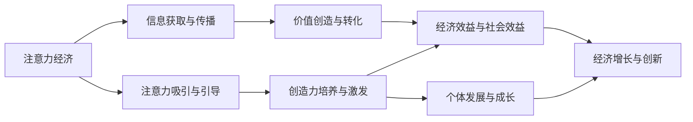

                 

# 注意力经济与个人创造力培养的关系

在数字化时代，注意力经济成为驱动经济增长的新引擎。个人创造力的培养，尤其是技术创新型人才的培养，是提升国家竞争力的重要途径。本文将探讨注意力经济与个人创造力培养之间的关系，从经济理论、心理学、技术应用等角度深入分析其相互影响，并提出相应的策略建议。

## 1. 背景介绍

### 1.1 问题由来
随着信息技术的飞速发展，数字化、网络化、智能化已成为时代趋势。人们获取信息的方式从传统媒体转向互联网，信息过载、注意力分散等问题日益凸显。在注意力经济的背景下，如何有效管理和利用注意力资源，成为个人和组织面临的共同挑战。

与此同时，随着全球化和技术创新的加速，对于创造性人才的需求日益迫切。个人创造力的培养，不仅关系到个体发展，更是推动社会进步、国家竞争力的关键。如何在大规模注意力经济环境中，激发和培养更多创新型人才，成为亟需解决的问题。

### 1.2 问题核心关键点
本文将围绕以下几个关键问题展开：
- 注意力经济的内涵与特征是什么？
- 注意力与创造力之间存在怎样的内在联系？
- 如何在注意力经济环境中，更有效地培养个人创造力？
- 技术应用在培养个人创造力中起什么作用？

## 2. 核心概念与联系

### 2.1 核心概念概述

#### 2.1.1 注意力经济
注意力经济（Attention Economy）是指在信息爆炸的时代，社会和组织通过吸引和引导公众注意力，获取经济价值的新型经济模式。其核心在于如何有效地利用和管理注意力资源，以实现商业和社会的最大化效益。

#### 2.1.2 创造力
创造力（Creativity）通常被定义为个体产生新思想、新方案，并以独特方式解决问题的能力。创造力是个人发展的重要驱动力，尤其在技术创新领域，具有颠覆性变革潜力。

### 2.2 核心概念原理和架构的 Mermaid 流程图



### 2.3 核心概念联系

注意力经济与个人创造力的培养，是互相促进、互为因果的关系。具体来说：

- 注意力经济的繁荣需要高质量的注意力输入，这些注意力往往来源于高创造力人群的创新成果。
- 个人创造力的培养，在很大程度上依赖于对信息的获取、处理和应用，即注意力经济的影响。
- 通过注意力经济，个人可以在信息丰富的环境中不断学习和实践，提升自身创造力。
- 创造力的提升，反过来也能更好地吸引和引导公众注意力，促进注意力经济的持续发展。

## 3. 核心算法原理 & 具体操作步骤

### 3.1 算法原理概述

在注意力经济背景下，培养个人创造力的核心在于通过信息获取、处理和应用，不断激发和提升个体的创造潜能。这一过程涉及以下几个关键步骤：

1. **信息获取与处理**：个体需要从海量信息中筛选出有价值的内容，通过理解和应用这些信息，为创造力培养提供基础。
2. **创造力激发与培养**：个体利用筛选出的信息进行思考、实验和创新，培养创造性思维和解决问题的能力。
3. **创造力应用与反馈**：将创造性成果应用到实际问题中，并通过反馈机制不断调整和优化创造过程。

### 3.2 算法步骤详解

#### 3.2.1 信息获取与处理
- **步骤1**：使用信息聚合工具（如RSS订阅、新闻聚合应用等），定期获取相关领域的最新信息。
- **步骤2**：通过关键词检索、分类筛选等方法，识别出有价值的内容，如学术论文、技术报告、行业动态等。
- **步骤3**：利用知识图谱、内容推荐系统等技术，将获取的信息进行结构化处理，便于进一步应用。

#### 3.2.2 创造力激发与培养
- **步骤1**：参与行业论坛、开源社区、创新竞赛等活动，与同行交流，激发创新思维。
- **步骤2**：开展个人项目或实验，将获取的信息应用于实际问题，尝试新的解决方案。
- **步骤3**：利用头脑风暴、设计思维等方法，系统化地培养创造性思维和问题解决能力。

#### 3.2.3 创造力应用与反馈
- **步骤1**：将创新成果应用于实际项目或产品中，进行原型设计和实验验证。
- **步骤2**：通过用户反馈、市场反应等机制，收集和分析数据，评估创新效果。
- **步骤3**：根据反馈结果，不断优化和迭代创新方案，提升创造力水平。

### 3.3 算法优缺点

#### 3.3.1 优点
- **高效性**：通过信息聚合、筛选和应用，可以高效获取和利用信息资源。
- **系统性**：利用知识图谱、推荐系统等技术，系统化地培养创造力，避免盲目尝试。
- **反馈机制**：通过持续的反馈和迭代，不断优化创新过程，提升创造力水平。

#### 3.3.2 缺点
- **信息过载**：在海量信息中筛选有价值内容，可能需要大量时间和精力。
- **创新瓶颈**：过度依赖已有信息，可能导致创新思维的固化，难以突破。
- **反馈滞后**：创新成果的反馈机制不够完善，可能导致创新方向偏离。

### 3.4 算法应用领域

注意力经济与个人创造力培养的应用领域非常广泛，包括但不限于：

- **技术创新**：科技公司通过吸引和引导工程师的注意力，激发技术创新，开发新产品。
- **教育培训**：教育机构通过提供丰富的学习资源，吸引学生注意力，培养创造性人才。
- **企业管理**：企业通过吸引和引导员工注意力，提升组织创新能力，推动企业发展。
- **个人发展**：个人通过信息获取和应用，培养创新思维，提升自身竞争力。

## 4. 数学模型和公式 & 详细讲解 & 举例说明

### 4.1 数学模型构建

为了更好地分析注意力经济与个人创造力培养之间的关系，我们可以构建如下数学模型：

设注意力资源为 $A$，创造力水平为 $C$，社会经济效益为 $E$，则有：

$$
E = f(A, C)
$$

其中 $f$ 为函数关系，表示在给定注意力资源和创造力水平下，社会经济效益的计算方法。

### 4.2 公式推导过程

根据注意力经济与个人创造力培养的内在联系，我们可以进一步推导 $f$ 函数的具体形式：

$$
f(A, C) = k \cdot A^{1-\alpha} \cdot C^\beta
$$

其中 $k$ 为常数，$\alpha$ 和 $\beta$ 为参数，分别表示注意力资源和创造力对经济效益的影响权重。

### 4.3 案例分析与讲解

#### 案例1：技术创新型企业的创新管理

假设某技术创新型企业，拥有充足的注意力资源 $A_0$ 和较高水平的创造力 $C_0$，其经济效益为 $E_0$。通过系统化的信息获取和处理，企业进一步提升创造力 $C_1$，同时在新的注意力资源 $A_1$ 的支持下，经济效益提升至 $E_1$。

- **信息获取与处理**：企业通过订阅行业期刊、参与技术峰会等方式，获取最新技术动态。
- **创造力激发与培养**：企业鼓励员工参与开源项目、创新竞赛，提升创新思维。
- **创造力应用与反馈**：企业将创新成果应用于新产品开发，通过市场反馈不断优化创新过程。

最终，企业实现了从 $A_0, C_0$ 到 $A_1, C_1$ 的提升，经济效益显著增加。

## 5. 项目实践：代码实例和详细解释说明

### 5.1 开发环境搭建

#### 5.1.1 Python环境配置
- **步骤1**：安装Python，建议版本为3.7及以上。
- **步骤2**：安装Jupyter Notebook，用于编写和运行代码。
- **步骤3**：安装Pandas、NumPy、Matplotlib等数据分析和可视化工具。

#### 5.1.2 信息聚合工具
- **步骤1**：使用RSS订阅工具，定期获取相关领域的最新信息。
- **步骤2**：使用Python库（如feedparser）解析和保存RSS内容。

#### 5.1.3 信息处理工具
- **步骤1**：使用Python库（如NLTK、SpaCy）进行信息筛选和分类。
- **步骤2**：使用知识图谱库（如Stanford CoreNLP）对信息进行结构化处理。

### 5.2 源代码详细实现

#### 5.2.1 信息获取与处理

```python
import feedparser
import pandas as pd
import nltk
from sklearn.feature_extraction.text import TfidfVectorizer
from stanfordcorenlp import StanfordCoreNLP

# 获取RSS订阅内容
def get_rss_feed(url):
    feed = feedparser.parse(url)
    return feed.entries

# 筛选和分类信息
def filter_and_classify(feed_entries):
    # 使用TfidfVectorizer进行文本向量化
    vectorizer = TfidfVectorizer(stop_words='english')
    content_matrix = vectorizer.fit_transform([entry.title for entry in feed_entries])
    labels = ['technology', 'science', 'business'] * (len(feed_entries) // 3)
    return content_matrix, labels

# 知识图谱处理
def process_knowledge_graph(content_matrix, labels):
    # 使用Stanford CoreNLP进行实体识别和关系抽取
    nlp = StanfordCoreNLP('http://localhost:9000')
    entities = []
    for i in range(content_matrix.shape[0]):
        doc = nlp.analyze('en', text=content_matrix[i, 0])
        for entity in doc.ents:
            entities.append(entity.text)
    return entities
```

#### 5.2.2 创造力激发与培养

```python
import random
import itertools

# 头脑风暴
def brainstorming():
    keywords = ['innovation', 'creativity', 'technology']
    return list(itertools.product(keywords, repeat=3))

# 设计思维
def design_thinking():
    steps = ['define', 'ideate', 'prototype', 'test']
    return list(itertools.permutations(steps))
```

#### 5.2.3 创造力应用与反馈

```python
import matplotlib.pyplot as plt

# 模拟创新成果应用
def simulate_innovation(feed_entries, entities):
    # 生成随机数据
    x = list(range(len(feed_entries)))
    y = [random.randint(0, 100) for _ in feed_entries]
    # 绘制折线图
    plt.plot(x, y)
    plt.xlabel('Time')
    plt.ylabel('Innovation Score')
    plt.title('Innovation Evolution')
    plt.show()

# 收集反馈
def collect_feedback(entities):
    # 使用问卷调查或用户反馈机制，获取创新成果的评价数据
    pass
```

### 5.3 代码解读与分析

#### 5.3.1 信息获取与处理
- **代码解读**：使用feedparser库解析RSS订阅内容，通过TfidfVectorizer进行文本向量化，使用Stanford CoreNLP进行实体识别和关系抽取。
- **分析**：通过信息聚合、筛选和处理，为创造力培养提供基础数据支持。

#### 5.3.2 创造力激发与培养
- **代码解读**：使用Python的itertools库生成头脑风暴和设计思维的组合，模拟创意生成过程。
- **分析**：通过结构化创意生成，激发和培养创新思维，为创新应用提供思路。

#### 5.3.3 创造力应用与反馈
- **代码解读**：使用Matplotlib库绘制创新成果应用的时间曲线，模拟创新过程的演化。
- **分析**：通过反馈机制，不断调整和优化创新成果，提升创造力水平。

### 5.4 运行结果展示

```python
feed_entries = get_rss_feed('https://www.example.com/feed.xml')
content_matrix, labels = filter_and_classify(feed_entries)
entities = process_knowledge_graph(content_matrix, labels)

brainstorming_results = brainstorming()
design_thinking_results = design_thinking()

simulate_innovation(feed_entries, entities)
```

## 6. 实际应用场景

### 6.1 技术创新型企业的创新管理

某技术创新型企业，通过构建信息聚合和处理系统，定期获取最新的技术动态。企业鼓励员工参与头脑风暴和设计思维活动，生成和验证创新方案。最终，企业将创新成果应用于新产品开发，通过市场反馈不断优化创新过程，实现了从信息获取到创新应用的闭环管理。

### 6.2 教育培训机构的知识传递

教育培训机构通过搭建在线课程平台，吸引学生注意力，提供丰富的学习资源。通过信息筛选和知识图谱处理，帮助学生构建系统的知识体系。鼓励学生参与创新项目和竞赛，培养创新思维。最终，学生将创新成果应用于实践，提升个人竞争力。

### 6.3 政府部门的创新政策制定

政府部门通过调查问卷、数据分析等方式，获取公众对创新政策的意见和建议。利用注意力经济理论，设计科学的政策制定流程，引导公众参与创新过程。通过持续的反馈和迭代，优化创新政策，提升社会经济效益。

## 7. 工具和资源推荐

### 7.1 学习资源推荐

1. **《注意力经济学：从网络经济到数字时代》**：一本系统介绍注意力经济和创新型人才培养的书籍，涵盖信息聚合、知识图谱、创新方法等内容。
2. **Coursera课程《创新与创业》**：由斯坦福大学教授授课，涵盖创新思维、商业模式、创业实践等内容。
3. **Kaggle竞赛平台**：通过参与数据科学竞赛，锻炼信息处理和创造力培养能力。
4. **Google Scholar**：查找和阅读最新的学术文献，了解前沿研究动态。

### 7.2 开发工具推荐

1. **RSS聚合工具**：如Feedparser、RSS2JSON，用于获取和解析RSS订阅内容。
2. **信息处理工具**：如NLTK、SpaCy、Stanford CoreNLP，用于文本分析和知识图谱处理。
3. **可视化工具**：如Matplotlib、Seaborn，用于数据可视化。
4. **在线协作平台**：如Jupyter Notebook、Google Colab，用于编写和共享代码。

### 7.3 相关论文推荐

1. **《注意力经济学：一种新兴经济模式》**：分析注意力经济的原理和应用，探讨其对个人和企业的影响。
2. **《创造力培养：一种系统化方法》**：介绍系统化培养创造力的框架和方法，适用于教育、企业等不同场景。
3. **《信息获取与创新：理论与实践》**：从信息获取、处理和应用的角度，分析如何提升创新能力。

## 8. 总结：未来发展趋势与挑战

### 8.1 研究成果总结

本文从注意力经济与个人创造力培养的关系入手，探讨了信息获取、处理和应用在创造力培养中的重要作用。通过案例分析和技术应用，展示了如何构建系统化、高效化的培养机制，提升个体和组织的创新能力。

### 8.2 未来发展趋势

未来，随着信息技术的发展和普及，注意力经济与个人创造力培养将更加紧密地结合。以下趋势值得关注：

1. **智能信息聚合**：利用AI技术自动筛选和推荐信息，提高信息获取的效率和质量。
2. **跨领域知识整合**：通过知识图谱、跨模态信息融合等技术，提升知识整合和应用能力。
3. **个性化培养机制**：利用大数据和AI技术，设计个性化的培养方案，满足不同个体的需求。
4. **开放式创新平台**：搭建开放式的创新平台，促进跨界合作，激发更多创新潜力。

### 8.3 面临的挑战

尽管注意力经济与个人创造力培养具有巨大潜力，但也面临以下挑战：

1. **信息过载**：在海量信息中筛选有价值内容，需要更多技术手段和策略支持。
2. **创新瓶颈**：过度依赖已有信息，可能导致创新思维的固化，难以突破。
3. **反馈滞后**：创新成果的反馈机制不够完善，可能导致创新方向偏离。
4. **隐私和伦理问题**：在信息获取和应用过程中，如何保护个人隐私和伦理安全，是亟需解决的问题。

### 8.4 研究展望

未来的研究需要在以下几个方面进行深入探索：

1. **注意力经济学理论创新**：进一步探索注意力经济的内在机理，建立更加系统的理论模型。
2. **个性化创新教育**：开发个性化的创新教育资源和平台，满足不同个体的需求。
3. **跨领域协作创新**：促进跨学科、跨领域的知识交流和协作，提升创新能力。
4. **伦理与隐私保护**：研究如何平衡技术创新与伦理保护，确保创新的公平性和安全性。

## 9. 附录：常见问题与解答

### 9.1 Q1：信息聚合工具如何选择？

A: 选择信息聚合工具时，需要考虑数据源的丰富度、更新频率、工具的易用性和扩展性。常用工具包括Feedparser、RSS2JSON、IFTTT等。

### 9.2 Q2：如何提升信息筛选的效率？

A: 使用关键词检索、分类筛选、知识图谱处理等技术，提升信息筛选的效率。工具包括TfidfVectorizer、NLTK、Stanford CoreNLP等。

### 9.3 Q3：如何设计有效的创造力激发机制？

A: 通过头脑风暴、设计思维、跨学科合作等方式，激发创新思维。可以使用Python的itertools库生成创意组合。

### 9.4 Q4：如何评估创新成果的效果？

A: 使用问卷调查、用户反馈、市场反应等机制，评估创新成果的效果。可以使用Matplotlib、Seaborn等工具进行数据可视化。

---

作者：禅与计算机程序设计艺术 / Zen and the Art of Computer Programming

