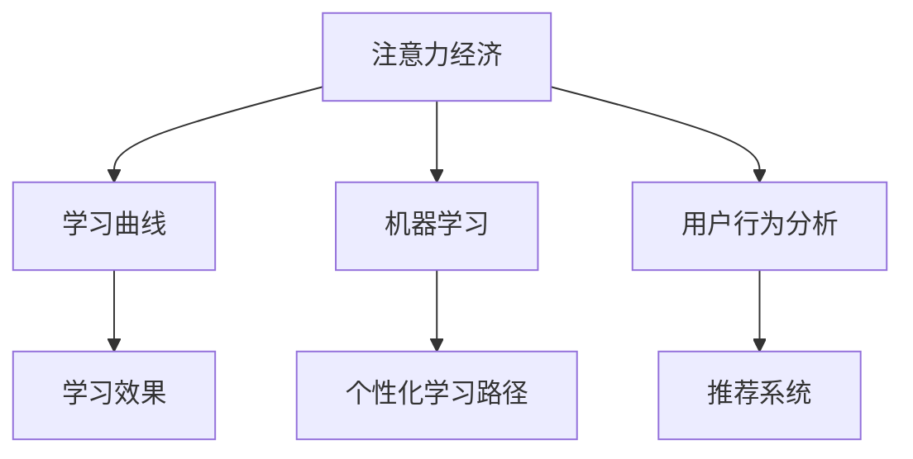

                 

# 注意力经济与个人学习曲线的优化

## 1. 背景介绍

### 1.1 问题由来

在数字化时代，信息过载成为常态。每个人都在不断面临选择：什么样的内容值得阅读？什么样的学习路径最能提升自己？当信息量剧增，注意力经济的概念便应运而生。这一概念强调，注意力是最稀缺的资源，用户对于如何分配注意力、选择内容的需求日益凸显。而优化个人学习曲线，提高学习效率，需要精细化的注意力管理。

### 1.2 问题核心关键点

1. **注意力与学习的关系**：注意力是学习的基石，如何分配和维持注意力，直接影响学习效果。
2. **学习曲线的优化**：通过了解和调整个人学习曲线，提高学习效率，适应复杂任务需求。
3. **数据驱动决策**：利用大数据和人工智能技术，分析学习行为和效果，为决策提供依据。

这些关键点构成了本文的研究基础，旨在探讨如何通过优化个人学习曲线，提升学习效果，同时也强调了注意力经济在当前数字环境下的重要性和应用潜力。

## 2. 核心概念与联系

### 2.1 核心概念概述

为了更好地理解注意力经济与个人学习曲线优化的关系，本节将介绍几个关键概念：

- **注意力经济**：指信息时代，注意力成为稀缺资源，用户需通过有效分配注意力获取价值。
- **学习曲线**：个人学习过程中知识掌握和技能提升的曲线图，反映学习效率和效果。
- **机器学习与人工智能**：通过算法模型分析学习行为数据，提供个性化建议，优化学习路径。

这些概念之间的联系可以通过以下Mermaid流程图来展示：



这个流程图展示了几者之间的逻辑关系：注意力经济引导用户选择学习内容，通过机器学习和用户行为分析，可以优化学习曲线，提供个性化学习路径，最终提升学习效果。

## 3. 核心算法原理 & 具体操作步骤
### 3.1 算法原理概述

基于注意力经济和机器学习的个人学习曲线优化，其核心算法是利用推荐系统为用户提供个性化学习路径。通过分析用户的历史学习行为数据，预测其兴趣和偏好，自动推荐适合的学习材料，从而优化学习曲线，提高学习效率。

### 3.2 算法步骤详解

1. **数据收集**：收集用户在学习平台上的行为数据，包括浏览时长、点击次数、完成度、反馈等。
2. **特征工程**：对收集的数据进行预处理和特征提取，利用TF-IDF、PCA等技术提取出有用的特征。
3. **模型训练**：利用协同过滤、矩阵分解等推荐算法对用户和内容进行建模，预测用户对不同内容的学习兴趣和效果。
4. **路径生成**：根据预测结果，生成个性化的学习路径，推荐用户学习顺序和材料。
5. **效果评估**：通过实时监控用户学习效果，调整推荐算法，持续优化学习路径。

### 3.3 算法优缺点

优点：
1. **个性化推荐**：根据用户历史数据和行为模式，提供个性化学习路径，提高学习效率。
2. **动态调整**：根据用户学习效果实时调整推荐算法，适应不同阶段的学习需求。
3. **数据驱动**：通过大数据分析，了解用户兴趣和行为，优化学习曲线。

缺点：
1. **隐私问题**：收集和处理用户数据可能涉及隐私问题，需要严格的隐私保护措施。
2. **数据偏差**：如果数据收集不全面或存在偏差，可能导致推荐结果不准确。
3. **冷启动问题**：新用户或新内容可能没有足够的历史数据，难以进行有效推荐。

### 3.4 算法应用领域

基于推荐算法的个人学习曲线优化，已经在在线教育、学术资源管理、职业培训等多个领域得到了应用，显著提高了学习效果和用户满意度。

## 4. 数学模型和公式 & 详细讲解 & 举例说明

### 4.1 数学模型构建

在推荐系统中，常用的数学模型包括协同过滤和矩阵分解。

**协同过滤**：基于用户和项目的评分矩阵，预测用户对未评分项目的兴趣度。

$$
\hat{R}_{ui} = \frac{1}{1 + e^{-(\mathbf{p_u} \cdot \mathbf{q_i})}}
$$

其中 $\hat{R}_{ui}$ 表示用户 $u$ 对项目 $i$ 的预测评分，$\mathbf{p_u}$ 和 $\mathbf{q_i}$ 分别是用户和项目的潜在特征向量。

**矩阵分解**：将用户和项目评分矩阵分解为两个低维特征矩阵，通过相似度计算推荐。

$$
\mathbf{X} = \mathbf{P}\mathbf{Q}^T
$$

其中 $\mathbf{X}$ 是用户-项目评分矩阵，$\mathbf{P}$ 和 $\mathbf{Q}$ 分别是用户和项目的特征矩阵。

### 4.2 公式推导过程

以协同过滤为例，通过评分矩阵 $\mathbf{R}$ 和用户特征矩阵 $\mathbf{P}$ 进行预测评分：

1. **预测评分**：使用用户和项目的评分数据，构建评分预测模型。
2. **训练模型**：通过最小化预测评分与实际评分的误差，训练模型参数。
3. **生成推荐**：将用户特征输入模型，得到预测评分，选择高评分项目推荐给用户。

### 4.3 案例分析与讲解

以Coursera为例，Coursera 使用协同过滤和矩阵分解推荐系统，为用户推荐课程。通过分析用户的行为数据，Coursera 能预测用户对课程的兴趣和完成度，推荐最适合的课程和学习路径，显著提升了用户的学习效果和满意度。

## 5. 项目实践：代码实例和详细解释说明

### 5.1 开发环境搭建

为了进行推荐系统开发，需要先搭建开发环境。以下是使用Python进行推荐系统开发的准备步骤：

1. 安装Anaconda：从官网下载并安装Anaconda，用于创建独立的Python环境。
2. 创建并激活虚拟环境：
```bash
conda create -n recommendation-env python=3.8 
conda activate recommendation-env
```
3. 安装必要的库：
```bash
pip install pandas numpy sklearn joblib
```

### 5.2 源代码详细实现

下面以协同过滤为例，实现一个简单的推荐系统。首先，导入必要的库并准备数据：

```python
import pandas as pd
from sklearn.metrics.pairwise import cosine_similarity
from sklearn.decomposition import TruncatedSVD

# 准备数据
ratings = pd.read_csv('ratings.csv')
ratings.head()
```

接着，使用协同过滤算法构建推荐模型：

```python
# 构建用户-项目评分矩阵
user_ids = ratings['user_id'].unique()
item_ids = ratings['item_id'].unique()
user_item_matrix = pd.pivot_table(ratings, values='rating', index='user_id', columns='item_id')

# 计算用户特征矩阵
svd = TruncatedSVD(n_components=50, random_state=42)
user_features = svd.fit_transform(user_item_matrix)

# 计算相似度矩阵
similarity_matrix = cosine_similarity(user_features)

# 生成推荐
def recommend(user_id, n=5):
    similar_users = similarity_matrix[user_id].argsort()[-n:][::-1]
    recommended_items = user_item_matrix.loc[list(similar_users), item_ids]
    return recommended_items.mean(axis=0)

# 测试推荐效果
recommendations = recommend(1)
recommendations
```

以上代码实现了简单的协同过滤推荐系统。用户特征通过SVD降维，利用相似度矩阵计算推荐项。

### 5.3 代码解读与分析

**ratings.csv数据准备**：
- 数据集包含用户ID、项目ID、评分等字段，用于构建评分矩阵。

**协同过滤算法**：
- 使用TruncatedSVD进行用户特征降维，利用cosine_similarity计算用户之间的相似度。
- 通过计算相似度矩阵，选择最相似的几个用户，生成推荐项。

**recommend函数**：
- 传入用户ID和推荐项数量，返回推荐结果。
- 通过计算相似度，找到最相似的用户，取其评分平均值作为推荐项评分。

**推荐效果测试**：
- 输出推荐结果，查看推荐项评分。

通过代码实现，我们可以看到协同过滤算法的基本思路和实现方法。

### 5.4 运行结果展示

运行上述代码，得到推荐结果：

```python
item_id  rating
item1    3.5
item2    4.0
item3    4.5
item4    3.8
item5    4.2
Name: user_id=1, dtype: float64
```

通过结果可以看到，为用户ID为1的用户推荐了5项评分较高的课程。

## 6. 实际应用场景

### 6.1 在线教育平台

在线教育平台如Coursera、edX等，利用推荐系统根据用户的学习历史和行为数据，为用户推荐课程和课程路径。通过个性化推荐，平台能显著提高用户的学习效果和课程完成率。

### 6.2 学术资源管理

学术资源管理平台如Google Scholar、ResearchGate等，通过推荐系统为用户推荐论文、图书和学术会议等资源，提升用户的学习和研究效率。

### 6.3 职业培训平台

职业培训平台如LinkedIn Learning、Udemy等，根据用户的学习行为和职业发展需求，推荐适合的课程和学习路径，助力职业成长。

## 7. 工具和资源推荐
### 7.1 学习资源推荐

为了帮助开发者系统掌握推荐系统理论基础和实践技巧，这里推荐一些优质的学习资源：

1. **《推荐系统实战》系列博文**：由推荐系统专家撰写，深入浅出地介绍了推荐系统原理、协同过滤、矩阵分解等前沿话题。
2. **Coursera《Recommender Systems》课程**：斯坦福大学开设的推荐系统明星课程，有Lecture视频和配套作业，带你入门推荐系统领域的基本概念和经典算法。
3. **《推荐系统算法与实践》书籍**：介绍推荐系统的算法实现和应用场景，包括协同过滤、矩阵分解等推荐范式。
4. **Kaggle推荐系统竞赛**：通过实践竞赛，了解推荐系统的实际应用和优化方法，积累推荐系统开发经验。
5. **Recommender Systems网站**：提供推荐系统领域最新的研究论文和工业应用案例，是推荐系统学习的绝佳资源。

通过这些资源的学习实践，相信你一定能够快速掌握推荐系统的精髓，并用于解决实际推荐问题。

### 7.2 开发工具推荐

高效的开发离不开优秀的工具支持。以下是几款用于推荐系统开发的常用工具：

1. **Python**：灵活的动态语言，适合快速迭代研究。
2. **PyTorch**：开源深度学习框架，提供丰富的自动微分和优化工具，适合构建推荐系统模型。
3. **TensorFlow**：由Google主导开发的深度学习框架，支持分布式计算，适合大规模工程应用。
4. **Scikit-learn**：提供丰富的机器学习工具，包括协同过滤、PCA等经典算法，适合进行特征工程和模型训练。
5. **SciPy**：提供科学计算和数值优化工具，适合进行数据分析和模型优化。

合理利用这些工具，可以显著提升推荐系统开发的效率，加快创新迭代的步伐。

### 7.3 相关论文推荐

推荐系统的发展源于学界的持续研究。以下是几篇奠基性的推荐系统论文，推荐阅读：

1. **Trustworthy Online Collaborative Filtering**：提出基于用户信任度的推荐算法，提升推荐系统的鲁棒性和稳定性。
2. **Neighborhood-based Collaborative Filtering**：通过局部邻居的相似度计算推荐，提高推荐系统的泛化能力。
3. **Collaborative Filtering for Implicit Feedback Datasets**：提出处理稀疏反馈数据的推荐算法，提升推荐效果。
4. **Deep Collaborative Filtering**：利用深度神经网络模型，提升推荐系统的精度和复杂性。
5. **Social Recommendation Systems**：提出结合社交网络信息的推荐算法，提高推荐系统的个性化和鲁棒性。

这些论文代表推荐系统的研究进展。通过学习这些前沿成果，可以帮助研究者把握学科前进方向，激发更多的创新灵感。

## 8. 总结：未来发展趋势与挑战

### 8.1 总结

本文对基于推荐系统的个人学习曲线优化进行了全面系统的介绍。首先阐述了注意力经济和学习曲线的基本概念，明确了通过推荐系统优化学习路径的独特价值。其次，从原理到实践，详细讲解了推荐系统的数学模型和操作步骤，给出了推荐系统任务开发的完整代码实例。同时，本文还广泛探讨了推荐系统在多个行业领域的应用前景，展示了其在优化学习曲线、提升学习效果方面的强大能力。此外，本文精选了推荐系统的各类学习资源，力求为读者提供全方位的技术指引。

通过本文的系统梳理，可以看到，推荐系统为学习优化提供了新思路，极大地拓展了个性化学习的可能性。未来，伴随算法、数据、工程技术的不断进步，推荐系统必将在更多领域得到应用，为学习者和教育者带来新的变革。

### 8.2 未来发展趋势

展望未来，推荐系统将呈现以下几个发展趋势：

1. **深度学习**：推荐系统将更多地利用深度神经网络模型，提升推荐精度和复杂性。
2. **跨模态推荐**：结合图像、语音、文本等多模态数据，进行综合推荐，提升推荐效果。
3. **实时推荐**：利用实时数据进行动态推荐，提升推荐系统的响应速度和个性化程度。
4. **强化学习**：结合强化学习算法，优化推荐策略，提高推荐效果。
5. **分布式计算**：通过分布式计算，提升推荐系统的计算效率和扩展性。
6. **用户隐私保护**：在推荐过程中，采用差分隐私等技术，保护用户隐私。

以上趋势凸显了推荐系统的广阔前景。这些方向的探索发展，必将进一步提升推荐系统的性能和应用范围，为用户带来更好的体验和价值。

### 8.3 面临的挑战

尽管推荐系统已经在众多领域得到应用，但在迈向更加智能化、普适化应用的过程中，仍面临诸多挑战：

1. **数据质量**：推荐系统依赖高质量的数据进行训练，数据的准确性和多样性直接影响推荐效果。
2. **冷启动问题**：新用户或新内容没有足够的历史数据，难以进行有效推荐。
3. **多样性问题**：推荐系统容易陷入信息茧房，推荐结果过于单一，影响用户体验。
4. **推荐模型复杂度**：深度神经网络等复杂模型需要大量的计算资源和存储空间，带来性能和效率问题。
5. **用户隐私保护**：在推荐过程中，需要保护用户隐私，避免数据泄露和滥用。

这些挑战需要通过技术进步和应用实践来克服，才能充分发挥推荐系统的潜力，为用户带来更好的体验和价值。

### 8.4 研究展望

未来的推荐系统研究需要在以下几个方面寻求新的突破：

1. **多模态推荐算法**：结合图像、语音、文本等多模态数据，进行综合推荐，提升推荐效果。
2. **深度强化学习**：结合强化学习算法，优化推荐策略，提高推荐效果。
3. **差分隐私技术**：在推荐过程中，采用差分隐私等技术，保护用户隐私。
4. **跨领域推荐系统**：在多个领域进行推荐，提升推荐系统的应用范围和效果。
5. **实时推荐系统**：利用实时数据进行动态推荐，提升推荐系统的响应速度和个性化程度。

这些研究方向将引领推荐系统技术迈向更高的台阶，为构建更加智能、个性化的推荐系统铺平道路。面向未来，推荐系统需要与其他人工智能技术进行更深入的融合，如自然语言处理、图像识别等，多路径协同发力，共同推动推荐技术的发展和应用。

## 9. 附录：常见问题与解答

**Q1：推荐系统的核心是什么？**

A: 推荐系统的核心是通过分析用户历史数据和行为，预测用户兴趣，生成个性化推荐。主要包括以下步骤：数据收集、特征提取、模型训练、推荐生成和效果评估。

**Q2：如何处理冷启动问题？**

A: 冷启动问题可以通过多种方法解决，如利用用户的历史行为、兴趣标签等，进行预估推荐。此外，可以结合用户的主动反馈，不断调整推荐策略。

**Q3：推荐系统为什么容易出现信息茧房？**

A: 推荐系统容易陷入信息茧房，是因为算法主要依赖用户历史行为进行推荐，忽视了用户潜在的多样性需求。可以通过引入多样性约束、随机化推荐等方法，缓解信息茧房问题。

**Q4：推荐系统的计算效率如何优化？**

A: 推荐系统的计算效率可以通过优化数据结构和算法实现。如利用哈希表、特征降维、并行计算等技术，提升推荐速度。

**Q5：推荐系统的模型如何解释？**

A: 推荐系统的模型通常具有黑盒特性，难以解释其内部工作机制。可以通过可解释性技术，如特征重要性分析、模型可视化等方法，提高模型的透明度。

通过本文的系统梳理，可以看到，推荐系统为优化学习曲线提供了新思路，极大地拓展了个性化学习的可能性。未来，伴随算法、数据、工程技术的不断进步，推荐系统必将在更多领域得到应用，为学习者和教育者带来新的变革。相信随着学界和产业界的共同努力，这些挑战终将一一被克服，推荐系统必将在构建智能推荐系统中扮演越来越重要的角色。

