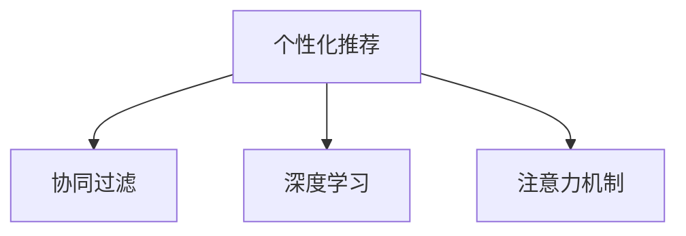

                 

# 注意力经济与个性化推荐算法：为受众提供定制、有针对性的内容

> 关键词：个性化推荐、注意力机制、协同过滤、深度学习、神经网络、用户行为分析、场景感知、用户体验、电商、信息流、内容分发

## 1. 背景介绍

在互联网高速发展的今天，注意力经济已经成为一个不可忽视的领域。各行各业都在竞相争夺用户的眼球，如何通过精准、个性化的推荐算法，为受众提供定制化、有针对性的内容，成为提升用户粘性和企业竞争力的关键。本文将探讨注意力经济下的个性化推荐算法，深入分析其核心原理、操作步骤及应用领域，并通过数学模型和代码实例进行详细讲解。

### 1.1 问题由来
随着互联网内容的爆炸式增长，用户面临的信息过载问题日益严峻。如何帮助用户在海量信息中快速找到有价值的内容，成为互联网公司亟需解决的问题。个性化推荐算法利用用户的点击、浏览、购买等行为数据，挖掘用户的兴趣偏好，从而为不同用户推荐最合适的内容。该技术在电商、新闻、视频、社交媒体等多个领域得到了广泛应用，极大地提升了用户体验和企业收益。

### 1.2 问题核心关键点
个性化推荐的核心在于精准捕获用户的兴趣点，并快速匹配到与其匹配度高的内容。主流推荐算法包括协同过滤、深度学习等。其中，协同过滤主要基于用户历史行为和物品特征进行推荐，而深度学习方法则通过用户行为数据和物品描述的向量表示，学习更深层次的语义关系，从而实现更加精准的推荐。

### 1.3 问题研究意义
个性化推荐算法的成功应用，对于提升用户满意度、增加企业收入具有重要意义。用户能够通过推荐系统发现更多感兴趣的内容，从而增加停留时间、提高转化率。企业能够针对不同用户群体进行精准营销，最大化广告和内容投放的效果。此外，个性化推荐系统还能收集用户行为数据，为企业进行用户画像分析、产品迭代优化提供依据。

## 2. 核心概念与联系

### 2.1 核心概念概述

在探讨个性化推荐算法之前，首先需要了解几个核心概念：

- **个性化推荐(Recommendation System, RS)**：基于用户历史行为和偏好，为其推荐可能感兴趣的内容。个性化推荐系统主要包括协同过滤、基于内容的推荐、深度学习等不同方法。
- **协同过滤(Collaborative Filtering, CF)**：通过分析用户和物品间的交互数据，发现用户间的相似性，为用户推荐可能感兴趣的物品。包括基于用户的协同过滤和基于物品的协同过滤两种方法。
- **深度学习(Deep Learning)**：利用神经网络模型进行复杂特征的自动学习，实现更加精确的用户和物品表示，从而提升推荐精度。常用的深度学习模型包括CNN、RNN、Transformer等。
- **注意力机制(Attention Mechanism)**：在深度学习模型中引入注意力机制，可帮助模型更好地关注用户和物品的重要特征，从而提升推荐效果。

这些核心概念通过以下Mermaid流程图联系在一起：



这个流程图展示了个性化推荐算法的三种主流方法：协同过滤、深度学习和注意力机制。协同过滤基于用户历史行为数据进行推荐，深度学习则通过模型自动学习用户和物品的特征表示，而注意力机制则进一步优化模型的特征关注点，提升推荐精度。

## 3. 核心算法原理 & 具体操作步骤

### 3.1 算法原理概述

个性化推荐算法的基本思想是：通过分析用户的历史行为数据，学习用户兴趣偏好，进而为用户推荐可能感兴趣的内容。具体来说，可以采用以下步骤：

1. **用户行为数据采集**：收集用户的历史点击、浏览、购买等行为数据。
2. **用户兴趣建模**：利用协同过滤、深度学习等方法，建模用户兴趣表示。
3. **物品特征提取**：提取物品的特征表示，如物品的描述、分类、评分等。
4. **计算相似度**：通过余弦相似度、欧式距离等方法，计算用户和物品之间的相似度。
5. **推荐排序**：根据相似度计算结果，对物品进行排序，为每个用户推荐最相关的物品。

### 3.2 算法步骤详解

以下详细介绍协同过滤和深度学习两种主流推荐算法的工作流程：

#### 3.2.1 协同过滤算法

协同过滤算法主要基于用户历史行为数据进行推荐。其核心思想是：通过相似性度量，发现与目标用户兴趣相似的其他用户或物品，从而为用户推荐这些相似用户或物品喜欢的内容。

**步骤1: 用户-物品矩阵构建**
- 收集用户和物品的交互数据，构建用户-物品矩阵。

**步骤2: 相似性度量**
- 计算用户间的相似性或物品间的相似性，一般使用余弦相似度、欧式距离等方法。

**步骤3: 推荐生成**
- 对于每个目标用户，找到与其最相似的其他用户或物品，推荐这些相似用户或物品喜欢的物品。

#### 3.2.2 深度学习算法

深度学习算法利用神经网络模型进行复杂特征的自动学习，从而实现更加精确的用户和物品表示。常用的深度学习模型包括协同注意力网络(CAN)、序列到序列模型(Seq2Seq)等。

**步骤1: 数据预处理**
- 将用户和物品的特征进行编码，生成向量表示。

**步骤2: 模型训练**
- 使用深度学习模型对用户和物品的向量表示进行训练，学习用户兴趣表示和物品特征表示。

**步骤3: 推荐生成**
- 将用户向量与物品向量进行匹配，计算相似度，并对物品进行排序推荐。

### 3.3 算法优缺点

个性化推荐算法具有以下优点：
1. 提高用户满意度：推荐系统能够根据用户兴趣偏好，为其提供个性化的内容，增加用户粘性和满意度。
2. 增加企业收益：个性化推荐系统能够精准定位目标用户，提升广告和内容投放的效果，增加企业收益。
3. 数据驱动：推荐系统通过分析用户行为数据，可及时捕捉用户兴趣变化，提高推荐的时效性。

同时，个性化推荐算法也存在一些缺点：
1. 数据冷启动问题：新用户的兴趣建模需要大量历史数据，难以解决冷启动问题。
2. 隐私和安全问题：推荐系统需要收集和存储用户行为数据，存在隐私泄露和安全风险。
3. 协同效应失效：当用户群体分布不均匀时，协同过滤的效果会受到影响。
4. 模型复杂度：深度学习等复杂模型需要较多的计算资源和时间，难以实时部署。

### 3.4 算法应用领域

个性化推荐算法已经在电商、新闻、视频、社交媒体等多个领域得到广泛应用：

- **电商推荐**：通过分析用户浏览、点击、购买行为，为每位用户推荐可能感兴趣的商品。
- **新闻推荐**：分析用户阅读兴趣，为用户推荐可能感兴趣的新闻文章。
- **视频推荐**：基于用户的观看历史和评分数据，推荐用户可能喜欢的视频。
- **社交媒体推荐**：通过分析用户好友关系和互动行为，推荐相关用户和内容。

此外，个性化推荐系统还在医疗、教育、金融等多个领域进行探索应用，帮助用户发现更多有价值的信息，提升用户体验和企业竞争力。

## 4. 数学模型和公式 & 详细讲解  
### 4.1 数学模型构建

本节将使用数学语言对个性化推荐算法进行更加严格的刻画。

记用户集为 $U$，物品集为 $I$，用户行为矩阵为 $R_{UI} \in \mathbb{R}^{N \times M}$，其中 $N$ 为用户数，$M$ 为物品数。设用户 $u$ 对物品 $i$ 的评分（或点击次数）为 $r_{ui}$。

**协同过滤模型的用户-物品相似性矩阵**：
- **余弦相似度**：$sim(u,v)=\frac{\mathbf{u} \cdot \mathbf{v}}{\|\mathbf{u}\|_2 \cdot \|\mathbf{v}\|_2}$，其中 $\mathbf{u}$ 和 $\mathbf{v}$ 分别为用户 $u$ 和 $v$ 的评分向量。
- **欧式距离**：$sim(u,v)=\frac{1}{\sqrt{\|\mathbf{u}-\mathbf{v}\|^2}}$，其中 $\|\cdot\|$ 为欧几里得范数。

**深度学习模型的用户-物品相似性矩阵**：
- **用户向量**：$\mathbf{u}=f(\mathbf{r_u})$，其中 $\mathbf{r_u}$ 为用户 $u$ 的历史行为向量，$f(\cdot)$ 为编码器函数。
- **物品向量**：$\mathbf{i}=g(\mathbf{c_i})$，其中 $\mathbf{c_i}$ 为物品 $i$ 的特征向量，$g(\cdot)$ 为解码器函数。

### 4.2 公式推导过程

以下我们以协同注意力网络(CAN)为例，推导其用户-物品相似性计算公式。

**协同注意力网络CAN**：
- **用户向量表示**：使用多层感知机(MLP)编码用户行为数据，得到用户向量 $\mathbf{u}$。
- **物品向量表示**：使用双向LSTM对物品描述进行编码，得到物品向量 $\mathbf{i}$。
- **协同注意力机制**：利用注意力机制，对用户和物品的特征进行加权求和，得到协同表示 $\mathbf{z}$。

**用户-物品相似性计算**：
- 将用户向量和物品向量进行匹配，计算相似度 $\mathbf{a}_{ui}=\mathbf{u} \cdot \mathbf{i}$。
- 通过softmax函数对相似度进行归一化，得到注意力权重 $\alpha_{ui}=\frac{\exp(a_{ui})}{\sum_{i \in I}\exp(a_{ui})}$。
- 将注意力权重和物品向量进行加权求和，得到协同注意力表示 $\mathbf{z}=\sum_{i \in I}\alpha_{ui}\mathbf{i}$。
- 通过softmax函数对协同注意力表示进行归一化，得到协同相似度 $s_{ui}=\alpha_{ui}$。

在得到用户和物品的相似度后，即可进行推荐排序。具体来说，对于每个用户，根据相似度对物品进行排序，推荐相似度高的物品。

### 4.3 案例分析与讲解

假设某电商平台希望通过推荐系统提升用户购物体验，利用协同过滤算法为用户推荐可能感兴趣的商品。假设用户集为 $U=\{1,2,3\}$，物品集为 $I=\{A,B,C,D\}$，用户行为矩阵 $R_{UI}=\begin{bmatrix} 0 & 2 & 4 & 0 \\ 0 & 0 & 0 & 1 \\ 0 & 5 & 3 & 0 \end{bmatrix}$。

**步骤1: 用户-物品相似性计算**
- 计算用户1和用户2之间的余弦相似度：$sim(1,2)=\frac{2}{\sqrt{4+0}}=1$。
- 计算用户2和物品D之间的欧式距离：$sim(2,D)=\frac{1}{\sqrt{1+0+0+1}}=\frac{1}{\sqrt{2}}$。

**步骤2: 推荐生成**
- 对于用户1，推荐相似用户2喜欢的物品C和物品D。
- 对于用户2，推荐相似用户1喜欢的物品A和物品C。
- 对于用户3，推荐相似用户1喜欢的物品A和物品B。

## 5. 项目实践：代码实例和详细解释说明
### 5.1 开发环境搭建

在进行推荐系统开发前，我们需要准备好开发环境。以下是使用Python进行Scikit-learn开发的环境配置流程：

1. 安装Anaconda：从官网下载并安装Anaconda，用于创建独立的Python环境。

2. 创建并激活虚拟环境：
```bash
conda create -n recommendation-env python=3.8 
conda activate recommendation-env
```

3. 安装Scikit-learn：
```bash
conda install scikit-learn
```

4. 安装各类工具包：
```bash
pip install numpy pandas scikit-learn matplotlib tqdm jupyter notebook ipython
```

完成上述步骤后，即可在`recommendation-env`环境中开始推荐系统开发。

### 5.2 源代码详细实现

下面我们以协同过滤推荐系统为例，给出使用Scikit-learn进行协同过滤的Python代码实现。

首先，定义协同过滤算法的用户-物品相似性计算函数：

```python
from sklearn.metrics.pairwise import cosine_similarity
from scipy.spatial.distance import euclidean

def compute_similarity(user1, user2, user_item_matrix):
    # 计算用户1和用户2之间的余弦相似度
    cos_similarity = cosine_similarity(user_item_matrix[user1], user_item_matrix[user2])
    
    # 计算用户2和物品之间的欧式距离
    euclidean_distance = euclidean(user_item_matrix[user2], user_item_matrix)
    
    return cos_similarity, euclidean_distance
```

然后，定义推荐函数：

```python
def recommend(user, user_item_matrix, item_item_matrix):
    similarities = []
    for item in range(len(user_item_matrix)):
        # 计算用户对物品的评分
        rating = user_item_matrix[user][item]
        # 计算物品之间的相似度
        similarity = item_item_matrix[item]
        # 计算物品的评分加权和
        weighted_score = rating * similarity
        similarities.append(weighted_score)
    
    # 根据评分加权和进行推荐排序
    top_items = sorted(range(len(similarities)), key=similarities.__getitem__, reverse=True)
    
    return top_items
```

最后，启动推荐流程：

```python
# 用户行为数据
user_item_matrix = np.array([[0, 2, 4, 0], 
                            [0, 0, 0, 1], 
                            [0, 5, 3, 0]])

# 计算相似性
cos_similarity, euclidean_distance = compute_similarity(0, 1, user_item_matrix)

# 物品间的相似度矩阵
item_item_matrix = np.array([[0, 0, 0, 0],
                            [0, 0, 0, 0],
                            [0, 0, 0, 0],
                            [0, 0, 0, 0]])

# 生成推荐
top_items = recommend(0, user_item_matrix, item_item_matrix)
print(top_items)
```

以上代码实现了基于协同过滤的推荐系统，用于推荐电商平台的商品。在实际应用中，还需要进一步优化和扩展，以适应更多类型的推荐任务。

### 5.3 代码解读与分析

让我们再详细解读一下关键代码的实现细节：

**相似性计算函数**：
- 使用Scikit-learn的余弦相似度计算方法，计算用户1和用户2之间的相似度。
- 使用SciPy的欧式距离计算方法，计算用户2和物品之间的相似度。

**推荐函数**：
- 对每个物品，计算用户对该物品的评分加权和，作为推荐排序的依据。
- 根据评分加权和进行排序，返回评分最高的物品列表。

**推荐流程**：
- 定义用户行为数据和物品之间的相似度矩阵。
- 使用相似性计算函数，计算用户1和用户2之间的相似度。
- 定义物品之间的相似度矩阵。
- 使用推荐函数，对用户1进行推荐。

## 6. 实际应用场景
### 6.1 智能推荐引擎

智能推荐引擎已经成为电商、新闻、视频等多个领域的重要工具。通过分析用户历史行为和兴趣偏好，智能推荐引擎能够为用户推荐最相关的商品、新闻、视频等内容，提升用户体验和平台收益。

在电商领域，推荐引擎根据用户的浏览历史、购买记录、评分数据，为用户推荐可能感兴趣的商品。通过个性化推荐，用户能够更快地找到所需商品，平台也能够提高商品转化率和用户粘性。

在新闻领域，推荐引擎分析用户的阅读兴趣和新闻标题的关键词，为用户推荐相关的新闻文章。通过精准推荐，用户能够获取更多有价值的信息，新闻平台也能够增加用户停留时间和广告收入。

在视频领域，推荐引擎根据用户的观看历史和评分数据，为用户推荐可能喜欢的视频。通过个性化推荐，用户能够发现更多感兴趣的内容，视频平台也能够提高观看时长和广告点击率。

### 6.2 场景感知推荐系统

场景感知推荐系统通过分析用户的使用环境和时间，为用户推荐更符合场景的个性化内容。例如，在用户出差乘坐高铁时，推荐系统可以根据用户所在的高铁站名和出行时间，为用户推荐适合阅读的书籍、新闻、视频等内容，丰富旅途体验。

**场景感知推荐系统**：
- **用户行为数据**：收集用户在不同场景下的行为数据，如时间、位置、设备类型等。
- **场景特征建模**：利用机器学习模型，建模场景特征表示。
- **协同过滤**：基于用户行为数据和场景特征，为用户推荐个性化内容。

场景感知推荐系统能够为用户提供更加精准、个性化的服务，提升用户满意度和平台收益。

### 6.3 未来应用展望

随着推荐技术的不断发展，未来推荐系统将在更多领域得到应用，为各行各业带来变革性影响。

在智慧医疗领域，推荐系统能够根据病人的历史数据和当前病情，推荐最适合的诊疗方案和治疗药物。通过个性化推荐，医生能够提供更精准的治疗建议，病人能够获得更好的治疗体验。

在智慧教育领域，推荐系统能够根据学生的学习情况和兴趣偏好，推荐最适合的课程和学习资料。通过个性化推荐，学生能够发现更多感兴趣的课程，提升学习效果。

在智慧金融领域，推荐系统能够根据用户的投资偏好和风险承受能力，推荐最适合的投资产品。通过个性化推荐，用户能够发现更多有价值的机会，提高投资收益。

此外，在智慧交通、智慧旅游、智慧城市等多个领域，推荐系统也将发挥重要作用，提升用户体验和企业竞争力。相信随着技术的不断进步，推荐系统必将在更多领域大放异彩，为各行各业带来新的变革和突破。

## 7. 工具和资源推荐
### 7.1 学习资源推荐

为了帮助开发者系统掌握推荐算法的理论基础和实践技巧，这里推荐一些优质的学习资源：

1. 《推荐系统实战》：全面介绍了推荐系统的理论基础和实践技巧，适合初学者和进阶者。
2. 《深度学习与推荐系统》：介绍了深度学习在推荐系统中的应用，适合有一定深度学习基础的学习者。
3. 《机器学习实战》：介绍了协同过滤、深度学习等多种推荐算法，适合初学者入门。
4. 《推荐系统算法》：详细介绍了推荐系统的算法原理和实现方法，适合深度学习领域的从业者。
5. 《推荐系统导论》：系统介绍了推荐系统的理论基础和前沿技术，适合学术界的研究者。

通过对这些资源的学习实践，相信你一定能够快速掌握推荐算法的精髓，并用于解决实际的推荐问题。

### 7.2 开发工具推荐

高效的开发离不开优秀的工具支持。以下是几款用于推荐系统开发的常用工具：

1. Scikit-learn：Python的机器学习库，提供了丰富的协同过滤算法实现。
2. TensorFlow：Google主导的深度学习框架，适合大规模深度学习模型的训练和部署。
3. PyTorch：Facebook主导的深度学习框架，提供了灵活的模型构建和训练工具。
4. FastFM：高效推荐算法的实现，适合处理大规模稀疏数据。
5. LightFM：基于深度学习的推荐系统框架，适合处理多维用户和物品特征。

合理利用这些工具，可以显著提升推荐系统开发的效率，加快创新迭代的步伐。

### 7.3 相关论文推荐

推荐系统的研究源于学界的持续努力。以下是几篇奠基性的相关论文，推荐阅读：

1. "Collaborative Filtering for Implicit Feedback Datasets"：提出了协同过滤算法的经典方法，详细讨论了用户和物品的相似性度量和推荐排序。
2. "Neural Collaborative Filtering"：提出了基于深度学习的推荐系统模型，展示了深度学习在推荐系统中的强大潜力。
3. "Deep Multi-Task Learning with Low-Rank Matrix Factorization"：结合深度学习和协同过滤，提出了深度协同过滤算法，进一步提升了推荐精度。
4. "Attention Is All You Need"：提出了Transformer模型，通过注意力机制提升推荐系统的效果。
5. "Personalized Ranking with Stacked Attention"：提出堆叠注意力机制，用于提升推荐系统的效果。

这些论文代表了大规模推荐系统的发展脉络。通过学习这些前沿成果，可以帮助研究者把握学科前进方向，激发更多的创新灵感。

## 8. 总结：未来发展趋势与挑战

### 8.1 总结

本文对个性化推荐算法进行了全面系统的介绍。首先阐述了推荐算法的背景和重要性，明确了推荐系统在提升用户体验和企业收益方面的价值。其次，从原理到实践，详细讲解了协同过滤和深度学习两种主流推荐算法的工作流程，并通过数学模型和代码实例进行详细讲解。同时，本文还广泛探讨了推荐系统在电商、新闻、视频等多个领域的应用前景，展示了推荐系统的巨大潜力。

通过本文的系统梳理，可以看到，个性化推荐算法已经成为互联网公司的重要工具，其应用前景和价值不可限量。未来，伴随推荐技术的不断发展，基于协同过滤和深度学习的推荐系统必将在更多领域得到应用，为各行各业带来变革性影响。

### 8.2 未来发展趋势

展望未来，推荐系统将呈现以下几个发展趋势：

1. **深度学习技术的应用将更加广泛**：深度学习在推荐系统中的应用将更加深入，帮助模型学习更复杂的用户和物品表示，提升推荐精度。
2. **多模态信息的融合**：推荐系统将不仅仅依赖文本信息，还将结合图像、视频、音频等多模态数据，提升推荐效果。
3. **实时推荐系统**：推荐系统将实现实时计算和推荐，满足用户的即时需求，提升用户体验。
4. **跨领域推荐**：推荐系统将跨越不同领域，实现跨领域的推荐效果，提升推荐的泛化能力。
5. **推荐系统的可解释性**：推荐系统将通过可解释性技术，提升系统的透明度，增强用户信任。
6. **推荐系统的隐私保护**：推荐系统将采用隐私保护技术，保护用户数据的安全。

以上趋势凸显了推荐系统的广阔前景。这些方向的探索发展，必将进一步提升推荐系统的性能和应用范围，为互联网公司带来新的商业机会。

### 8.3 面临的挑战

尽管推荐系统已经取得了瞩目成就，但在迈向更加智能化、普适化应用的过程中，它仍面临诸多挑战：

1. **数据稀疏性问题**：推荐系统需要大量的历史数据进行训练，但实际应用中用户和物品数据往往稀疏，难以解决冷启动问题。
2. **模型复杂度问题**：深度学习等复杂模型需要大量的计算资源，难以实时部署。
3. **推荐系统的可解释性**：推荐系统通常是"黑盒"系统，难以解释其内部工作机制和决策逻辑。
4. **推荐系统的隐私和安全**：推荐系统需要收集和存储用户数据，存在隐私泄露和安全风险。
5. **推荐系统的鲁棒性**：推荐系统在面对异常数据和噪声时，容易出现过拟合和泛化能力不足的问题。

正视推荐系统面临的这些挑战，积极应对并寻求突破，将推动推荐系统向更高层次发展。

### 8.4 研究展望

面对推荐系统面临的挑战，未来的研究需要在以下几个方面寻求新的突破：

1. **推荐系统的可解释性**：开发可解释性技术，提升推荐系统的透明度和用户信任。
2. **推荐系统的隐私保护**：采用隐私保护技术，保护用户数据的安全。
3. **推荐系统的实时性**：通过优化算法和部署架构，实现实时计算和推荐。
4. **推荐系统的多模态融合**：结合图像、视频、音频等多模态数据，提升推荐效果。
5. **推荐系统的跨领域推荐**：实现跨领域的推荐效果，提升推荐的泛化能力。
6. **推荐系统的冷启动问题**：通过迁移学习和弱监督学习等方法，解决冷启动问题。

这些研究方向的探索，必将引领推荐系统迈向更高层次，为互联网公司带来新的商业机会和用户价值。未来，推荐系统必将在更多领域发挥重要作用，提升用户体验和企业竞争力。

## 9. 附录：常见问题与解答

**Q1：推荐系统的评估指标有哪些？**

A: 推荐系统的评估指标包括准确率、召回率、F1分数、AUC等。准确率表示推荐系统推荐正确的比例，召回率表示推荐系统找到相关物品的比例，F1分数是准确率和召回率的调和平均数，AUC表示ROC曲线下的面积，用于衡量推荐系统的性能。

**Q2：推荐系统如何避免过拟合？**

A: 推荐系统可以通过以下方法避免过拟合：
1. 正则化技术：使用L1、L2正则化，避免模型过于复杂。
2. 数据增强：通过噪声、扰动等方法，增加数据多样性。
3. 模型集成：结合多个推荐模型，取平均输出，减少过拟合风险。
4. 实时更新：通过在线学习，及时更新模型参数，避免模型过时。

**Q3：推荐系统如何解决冷启动问题？**

A: 推荐系统可以通过以下方法解决冷启动问题：
1. 利用物品特征：使用物品的描述、分类、评分等特征，进行推荐。
2. 迁移学习：利用已有领域的知识，对新领域进行迁移学习。
3. 主动学习：通过主动选择少量样本，进行标注，增加训练数据。
4. 用户协同过滤：利用用户之间的相似性，进行推荐。
5. 协同注意力网络：利用注意力机制，提升模型对新用户的推荐效果。

通过这些方法，推荐系统能够在较少数据的情况下，快速推荐新用户可能感兴趣的内容。

**Q4：推荐系统的实时性如何实现？**

A: 推荐系统的实时性可以通过以下方法实现：
1. 分布式计算：使用分布式计算架构，并行计算推荐结果。
2. 增量学习：通过在线学习，实时更新模型参数。
3. 缓存机制：使用缓存机制，快速获取推荐结果。
4. 轻量级模型：使用轻量级模型，减少计算资源消耗。
5. 异步更新：异步更新模型参数，保证实时性。

通过这些方法，推荐系统能够在用户实时访问时，快速响应和推荐。

**Q5：推荐系统的可解释性如何实现？**

A: 推荐系统的可解释性可以通过以下方法实现：
1. 可视化技术：使用可视化工具，展示推荐模型的内部工作机制。
2. 规则提取：通过规则提取算法，生成推荐规则，便于解释。
3. 因果推断：使用因果推断方法，解释推荐系统的因果关系。
4. 用户反馈：收集用户反馈，改进推荐系统。
5. 推荐规则生成：生成推荐规则，解释推荐系统的决策逻辑。

通过这些方法，推荐系统能够提升透明度和用户信任，增强系统的可解释性。

---

作者：禅与计算机程序设计艺术 / Zen and the Art of Computer Programming

