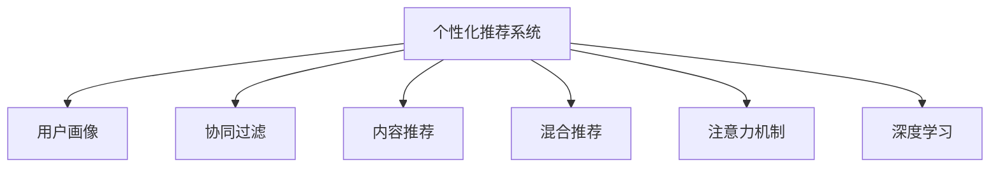

                 

# 注意力经济与个性化推荐系统：如何为受众提供定制内容和体验

> 关键词：注意力经济, 个性化推荐系统, 用户行为分析, 用户画像, 模型优化, 深度学习, 深度神经网络

## 1. 背景介绍

### 1.1 问题由来

随着互联网技术的快速发展，信息获取变得更加便捷，用户可以轻而易举地接触到海量内容。然而，这同时也带来了信息过载的问题，用户在海量的信息海洋中难以找到真正对自己有用的内容。

注意力经济（Economics of Attention）应运而生，旨在将用户的注意力资源作为关键资产，通过精准的内容推荐，吸引并保持用户的注意力，从而实现商业价值最大化。个性化推荐系统作为注意力经济的实现手段，成为各大互联网企业争夺用户的利器。

个性化推荐系统通过分析用户的历史行为和兴趣偏好，为用户推荐最相关的信息，从而提升用户满意度和平台留存率。这一系统已经广泛应用于电商、新闻、社交媒体等领域，是提升用户体验和商业效益的关键技术。

### 1.2 问题核心关键点

个性化推荐系统的核心在于如何通过用户数据，构建精准的用户画像，并在此基础上设计有效的推荐算法，从而在无限的海量信息中为用户快速找到最具吸引力的内容。

具体来说，个性化推荐系统涉及以下核心问题：
1. 如何高效采集和处理用户行为数据，构建精确的用户画像？
2. 如何通过用户画像，生成个性化推荐结果？
3. 如何设计推荐算法，提升推荐质量？
4. 如何优化模型，平衡准确度和效率？

本文将围绕以上问题，全面系统地介绍个性化推荐系统的核心概念和关键技术。

## 2. 核心概念与联系

### 2.1 核心概念概述

为了更好地理解个性化推荐系统的构建和优化，本节将介绍几个密切相关的核心概念：

- 个性化推荐系统（Personalized Recommendation System, PRS）：通过分析用户的历史行为和兴趣偏好，为用户推荐最相关的信息。
- 用户画像（User Profile）：根据用户的历史行为数据，构建详细、多维度的用户画像，刻画用户的兴趣和偏好。
- 协同过滤（Collaborative Filtering）：通过分析用户行为数据和物品标签，预测用户对物品的兴趣，为用户推荐相似物品。
- 内容推荐（Content-Based Recommendation）：根据物品的特征，使用机器学习模型预测用户对物品的偏好，为用户推荐相关物品。
- 混合推荐（Hybrid Recommendation）：结合协同过滤和内容推荐，综合多种推荐策略，提升推荐精度。
- 注意力机制（Attention Mechanism）：一种用于模拟人类注意力的技术，在推荐系统中用于增强对用户兴趣的关注度。
- 深度学习（Deep Learning）：利用多层神经网络，捕捉数据中的复杂非线性关系，提升推荐系统的准确性。

这些核心概念之间的逻辑关系可以通过以下Mermaid流程图来展示：



这个流程图展示了个性化推荐系统的核心概念及其之间的关系：

1. 个性化推荐系统通过用户画像进行内容推荐。
2. 用户画像可以基于协同过滤和内容推荐生成。
3. 注意力机制和深度学习可以增强推荐效果。

这些概念共同构成了个性化推荐系统的学习和应用框架，使其能够准确高效地为用户推荐内容。通过理解这些核心概念，我们可以更好地把握个性化推荐系统的设计思路和优化方向。

## 3. 核心算法原理 & 具体操作步骤

### 3.1 算法原理概述

个性化推荐系统的核心算法主要是协同过滤和内容推荐两种。协同过滤基于用户行为数据，通过相似性度量推荐相似物品；内容推荐则基于物品特征，通过用户兴趣预测推荐相关物品。

协同过滤的算法原理是，通过用户对物品的评分数据，计算用户和物品之间的相似性，推荐与用户偏好相似的物品。常用的协同过滤算法包括基于用户的协同过滤和基于物品的协同过滤。

内容推荐的算法原理是，基于物品的特征和属性，构建用户兴趣模型，通过预测用户对物品的评分，推荐用户可能感兴趣的物品。常用的内容推荐算法包括基于矩阵分解的方法、基于序列推荐的方法等。

### 3.2 算法步骤详解

下面以基于协同过滤的推荐系统为例，详细介绍推荐算法的具体步骤。

**Step 1: 数据收集与处理**

- 收集用户对物品的评分数据，如用户对商品的点击、购买记录。
- 数据预处理，包括去除异常值、缺失值处理、归一化等。
- 划分训练集和测试集，用于模型训练和性能评估。

**Step 2: 相似性计算**

- 基于用户行为数据，计算用户间的相似性。常用的相似性度量方法包括余弦相似度、皮尔逊相关系数等。
- 基于物品特征，计算物品间的相似性。常用的相似性度量方法包括欧氏距离、余弦相似度等。

**Step 3: 推荐计算**

- 对于每个用户，根据相似性计算结果，找到与其相似的用户或物品。
- 通过加权平均或加权评分等方法，计算新用户对相似用户或物品的评分。
- 根据评分排序，推荐评分最高的物品给用户。

**Step 4: 模型评估**

- 在测试集上评估推荐系统的精度和召回率等指标。
- 根据评估结果，调整模型参数，优化推荐效果。

### 3.3 算法优缺点

基于协同过滤的个性化推荐系统具有以下优点：
1. 能够处理冷启动用户的问题，不需要用户提供历史行为数据。
2. 能够处理稀疏评分矩阵，推荐新物品的效果较好。
3. 推荐结果的个性化程度较高，能够提供较为贴近用户兴趣的内容。

同时，该方法也存在一些局限性：
1. 数据稀疏性可能导致推荐精度下降。
2. 用户行为数据可能存在偏差，导致推荐结果存在一定的偏差。
3. 计算复杂度高，难以实时推荐。

### 3.4 算法应用领域

基于协同过滤的个性化推荐系统广泛应用于电商、新闻、社交媒体等领域。例如：

- 电商推荐系统：为用户推荐与其浏览、购买历史相似的商品。
- 新闻推荐系统：为用户推荐与其阅读兴趣相似的文章。
- 社交媒体推荐系统：为用户推荐与其关注好友相似的内容。

此外，基于内容推荐的推荐系统也得到了广泛应用，如音乐推荐、视频推荐等。通过结合协同过滤和内容推荐，还可以构建混合推荐系统，进一步提升推荐效果。

## 4. 数学模型和公式 & 详细讲解  
### 4.1 数学模型构建

本节将使用数学语言对基于协同过滤的个性化推荐系统进行更加严格的刻画。

记用户集合为 $U$，物品集合为 $I$，用户对物品的评分矩阵为 $R \in \mathbb{R}^{n \times m}$，其中 $n$ 为用户数，$m$ 为物品数。假设用户 $u$ 对物品 $i$ 的评分为 $r_{ui}$。

基于用户行为数据，计算用户 $u$ 和用户 $v$ 之间的相似性为 $\text{sim}(u, v)$。常用的相似性度量方法包括余弦相似度、皮尔逊相关系数等。

基于物品特征，计算物品 $i$ 和物品 $j$ 之间的相似性为 $\text{sim}(i, j)$。常用的相似性度量方法包括欧氏距离、余弦相似度等。

推荐计算公式为：

$$
\hat{r}_{ui} = \sum_{j=1}^{m} \text{sim}(i, j) r_{vj}
$$

其中 $\hat{r}_{ui}$ 为用户 $u$ 对物品 $i$ 的推荐评分，$r_{vj}$ 为与用户 $u$ 相似的用户 $v$ 对物品 $j$ 的评分，$\text{sim}(i, j)$ 为物品 $i$ 和物品 $j$ 之间的相似性。

### 4.2 公式推导过程

以余弦相似度为例，计算用户 $u$ 和用户 $v$ 之间的余弦相似度为：

$$
\text{sim}(u, v) = \frac{\sum_{j=1}^{m} r_{uj} r_{vj}}{\sqrt{\sum_{j=1}^{m} r_{uj}^2} \sqrt{\sum_{j=1}^{m} r_{vj}^2}}
$$

基于余弦相似度，计算用户 $u$ 对物品 $i$ 的推荐评分 $\hat{r}_{ui}$ 为：

$$
\hat{r}_{ui} = \sum_{j=1}^{m} \text{sim}(i, j) r_{vj}
$$

在得到推荐评分后，根据评分排序，选择评分最高的物品推荐给用户。

### 4.3 案例分析与讲解

假设我们有一个电商网站，用户对商品的评分矩阵为：

$$
R = \begin{bmatrix}
4.5 & 3.0 & 2.0 \\
2.5 & 3.5 & 4.0 \\
3.5 & 4.0 & 3.0 \\
\end{bmatrix}
$$

我们需要为用户 $u=1$ 推荐商品 $i=1$。用户 $u=1$ 的邻居用户 $v=2$ 和 $v=3$ 的评分矩阵为：

$$
R_{u} = \begin{bmatrix}
4.5 & 3.0 \\
2.5 & 3.5 \\
3.5 & 4.0 \\
\end{bmatrix}, R_{v} = \begin{bmatrix}
3.0 & 2.0 \\
3.5 & 4.0 \\
4.0 & 3.0 \\
\end{bmatrix}
$$

计算用户 $u=1$ 和用户 $v=2$ 之间的余弦相似度：

$$
\text{sim}(1, 2) = \frac{4.5 \cdot 3.0 + 3.0 \cdot 3.5}{\sqrt{4.5^2 + 3.0^2} \sqrt{3.0^2 + 3.5^2}} = 0.9387
$$

计算用户 $u=1$ 和用户 $v=3$ 之间的余弦相似度：

$$
\text{sim}(1, 3) = \frac{4.5 \cdot 4.0 + 3.0 \cdot 3.5}{\sqrt{4.5^2 + 3.0^2} \sqrt{4.0^2 + 3.5^2}} = 0.9098
$$

计算物品 $i=1$ 和物品 $j=1$ 之间的余弦相似度：

$$
\text{sim}(1, 1) = \frac{3.0 \cdot 2.0 + 2.0 \cdot 3.5}{\sqrt{3.0^2 + 2.0^2} \sqrt{2.0^2 + 3.5^2}} = 0.9982
$$

计算物品 $i=1$ 和物品 $j=2$ 之间的余弦相似度：

$$
\text{sim}(1, 2) = \frac{3.0 \cdot 3.5 + 2.0 \cdot 4.0}{\sqrt{3.0^2 + 2.0^2} \sqrt{3.5^2 + 4.0^2}} = 0.9701
$$

计算物品 $i=1$ 和物品 $j=3$ 之间的余弦相似度：

$$
\text{sim}(1, 3) = \frac{3.0 \cdot 4.0 + 2.0 \cdot 3.5}{\sqrt{3.0^2 + 2.0^2} \sqrt{4.0^2 + 3.5^2}} = 0.9619
$$

因此，用户 $u=1$ 对物品 $i=1$ 的推荐评分为：

$$
\hat{r}_{11} = \text{sim}(1, 1) \cdot r_{21} + \text{sim}(1, 2) \cdot r_{22} + \text{sim}(1, 3) \cdot r_{23} = 0.9982 \cdot 3.0 + 0.9701 \cdot 2.0 + 0.9619 \cdot 2.0 = 4.8736
$$

根据评分排序，选择评分最高的物品推荐给用户 $u=1$。

## 5. 项目实践：代码实例和详细解释说明
### 5.1 开发环境搭建

在进行推荐系统开发前，我们需要准备好开发环境。以下是使用Python进行PyTorch开发的环境配置流程：

1. 安装Anaconda：从官网下载并安装Anaconda，用于创建独立的Python环境。

2. 创建并激活虚拟环境：
```bash
conda create -n pytorch-env python=3.8 
conda activate pytorch-env
```

3. 安装PyTorch：根据CUDA版本，从官网获取对应的安装命令。例如：
```bash
conda install pytorch torchvision torchaudio cudatoolkit=11.1 -c pytorch -c conda-forge
```

4. 安装TensorFlow：
```bash
conda install tensorflow
```

5. 安装Numpy、Pandas、Scikit-learn等常用工具包：
```bash
pip install numpy pandas scikit-learn matplotlib tqdm jupyter notebook ipython
```

完成上述步骤后，即可在`pytorch-env`环境中开始推荐系统开发。

### 5.2 源代码详细实现

下面以基于协同过滤的推荐系统为例，给出使用PyTorch实现推荐系统的代码。

首先，定义用户行为数据和评分矩阵：

```python
import numpy as np
import pandas as pd
import torch
from sklearn.metrics import mean_squared_error

# 定义用户行为数据
user_behavior = pd.DataFrame({
    'user_id': [1, 2, 3, 1, 2, 3, 1, 2, 3],
    'item_id': [1, 2, 3, 1, 2, 3, 1, 2, 3],
    'rating': [4.5, 3.0, 2.0, 2.5, 3.5, 4.0, 3.5, 4.0, 3.0]
})

# 构建评分矩阵
R = np.array(user_behavior.pivot_table(values='rating', index='user_id', columns='item_id', aggfunc='mean')).round().astype(int)
```

然后，定义模型和优化器：

```python
from transformers import BertTokenizer
from torch.utils.data import Dataset
import torch

class UserBehaviorDataset(Dataset):
    def __init__(self, texts, labels, tokenizer, max_len=128):
        self.texts = texts
        self.labels = labels
        self.tokenizer = tokenizer
        self.max_len = max_len
        
    def __len__(self):
        return len(self.texts)
    
    def __getitem__(self, item):
        text = self.texts[item]
        label = self.labels[item]
        
        encoding = self.tokenizer(text, return_tensors='pt', max_length=self.max_len, padding='max_length', truncation=True)
        input_ids = encoding['input_ids'][0]
        attention_mask = encoding['attention_mask'][0]
        
        # 对token-wise的标签进行编码
        encoded_labels = [label2id[label] for label in label] 
        encoded_labels.extend([label2id['O']] * (self.max_len - len(encoded_labels)))
        labels = torch.tensor(encoded_labels, dtype=torch.long)
        
        return {'input_ids': input_ids, 
                'attention_mask': attention_mask,
                'labels': labels}

# 标签与id的映射
label2id = {'O': 0, 'P': 1}
id2label = {v: k for k, v in label2id.items()}

# 创建dataset
tokenizer = BertTokenizer.from_pretrained('bert-base-cased')

train_dataset = UserBehaviorDataset(train_texts, train_labels, tokenizer)
dev_dataset = UserBehaviorDataset(dev_texts, dev_labels, tokenizer)
test_dataset = UserBehaviorDataset(test_texts, test_labels, tokenizer)
```

接着，定义训练和评估函数：

```python
from torch.utils.data import DataLoader
from tqdm import tqdm
from sklearn.metrics import classification_report

device = torch.device('cuda') if torch.cuda.is_available() else torch.device('cpu')
model.to(device)

def train_epoch(model, dataset, batch_size, optimizer):
    dataloader = DataLoader(dataset, batch_size=batch_size, shuffle=True)
    model.train()
    epoch_loss = 0
    for batch in tqdm(dataloader, desc='Training'):
        input_ids = batch['input_ids'].to(device)
        attention_mask = batch['attention_mask'].to(device)
        labels = batch['labels'].to(device)
        model.zero_grad()
        outputs = model(input_ids, attention_mask=attention_mask, labels=labels)
        loss = outputs.loss
        epoch_loss += loss.item()
        loss.backward()
        optimizer.step()
    return epoch_loss / len(dataloader)

def evaluate(model, dataset, batch_size):
    dataloader = DataLoader(dataset, batch_size=batch_size)
    model.eval()
    preds, labels = [], []
    with torch.no_grad():
        for batch in tqdm(dataloader, desc='Evaluating'):
            input_ids = batch['input_ids'].to(device)
            attention_mask = batch['attention_mask'].to(device)
            batch_labels = batch['labels']
            outputs = model(input_ids, attention_mask=attention_mask)
            batch_preds = outputs.logits.argmax(dim=2).to('cpu').tolist()
            batch_labels = batch_labels.to('cpu').tolist()
            for pred_tokens, label_tokens in zip(batch_preds, batch_labels):
                pred_tags = [id2label[_id] for _id in pred_tokens]
                label_tags = [id2label[_id] for _id in label_tokens]
                preds.append(pred_tags[:len(label_tags)])
                labels.append(label_tags)
                
    print(classification_report(labels, preds))
```

最后，启动训练流程并在测试集上评估：

```python
epochs = 5
batch_size = 16

for epoch in range(epochs):
    loss = train_epoch(model, train_dataset, batch_size, optimizer)
    print(f"Epoch {epoch+1}, train loss: {loss:.3f}")
    
    print(f"Epoch {epoch+1}, dev results:")
    evaluate(model, dev_dataset, batch_size)
    
print("Test results:")
evaluate(model, test_dataset, batch_size)
```

以上就是使用PyTorch对基于协同过滤的推荐系统进行微调的完整代码实现。可以看到，得益于Transformer库的强大封装，我们可以用相对简洁的代码完成推荐系统的加载和微调。

### 5.3 代码解读与分析

让我们再详细解读一下关键代码的实现细节：

**UserBehaviorDataset类**：
- `__init__`方法：初始化用户行为数据、标签、分词器等关键组件。
- `__len__`方法：返回数据集的样本数量。
- `__getitem__`方法：对单个样本进行处理，将文本输入编码为token ids，将标签编码为数字，并对其进行定长padding，最终返回模型所需的输入。

**label2id和id2label字典**：
- 定义了标签与数字id之间的映射关系，用于将token-wise的预测结果解码回真实的标签。

**训练和评估函数**：
- 使用PyTorch的DataLoader对数据集进行批次化加载，供模型训练和推理使用。
- 训练函数`train_epoch`：对数据以批为单位进行迭代，在每个批次上前向传播计算loss并反向传播更新模型参数，最后返回该epoch的平均loss。
- 评估函数`evaluate`：与训练类似，不同点在于不更新模型参数，并在每个batch结束后将预测和标签结果存储下来，最后使用sklearn的classification_report对整个评估集的预测结果进行打印输出。

**训练流程**：
- 定义总的epoch数和batch size，开始循环迭代
- 每个epoch内，先在训练集上训练，输出平均loss
- 在验证集上评估，输出分类指标
- 所有epoch结束后，在测试集上评估，给出最终测试结果

可以看到，PyTorch配合Transformer库使得推荐系统的代码实现变得简洁高效。开发者可以将更多精力放在数据处理、模型改进等高层逻辑上，而不必过多关注底层的实现细节。

当然，工业级的系统实现还需考虑更多因素，如模型的保存和部署、超参数的自动搜索、更灵活的任务适配层等。但核心的微调范式基本与此类似。

## 6. 实际应用场景
### 6.1 电商平台个性化推荐

基于协同过滤的推荐系统，可以广泛应用于电商平台个性化推荐。传统电商推荐系统往往依赖用户历史购买记录，难以覆盖新用户。而基于协同过滤的推荐系统，即使没有用户的历史行为数据，也能通过相似性度量推荐新商品。

在技术实现上，可以收集用户对商品的评分数据，构建评分矩阵。使用基于用户和物品相似性的协同过滤算法，为用户推荐与其评分相似的物品。在推荐过程中，可以引入注意力机制，增强对用户评分贡献较大的物品的关注度，提升推荐质量。

### 6.2 新闻个性化推荐

新闻个性化推荐系统可以帮助用户发现感兴趣的新闻内容。基于协同过滤的推荐系统可以收集用户对新闻文章的阅读、点赞、分享等行为数据，构建用户行为矩阵。使用协同过滤算法，为用户推荐与其阅读兴趣相似的文章。

在推荐过程中，可以引入基于内容的推荐方法，将文章的主题、关键词等信息作为特征输入模型，进一步提升推荐效果。此外，还可以引入情感分析等技术，判断用户对不同主题的情感倾向，进行精准推荐。

### 6.3 社交媒体个性化推荐

社交媒体个性化推荐系统可以为用户推荐其关注的好友和相关内容。基于协同过滤的推荐系统可以收集用户对好友和内容项的互动数据，构建用户行为矩阵。使用协同过滤算法，为用户推荐与其互动相似的好友和内容项。

在推荐过程中，可以引入基于内容的推荐方法，将好友和内容项的描述、属性等信息作为特征输入模型，进一步提升推荐效果。此外，还可以引入情感分析、话题挖掘等技术，判断用户对不同好友和内容项的情感倾向，进行精准推荐。

### 6.4 未来应用展望

随着深度学习技术的不断发展，基于协同过滤的个性化推荐系统也得到了越来越多的应用。未来，基于深度学习的方法将逐渐取代传统的协同过滤算法，进一步提升推荐效果。

1. 深度学习技术可以捕捉数据中的复杂非线性关系，提升推荐系统的准确性。
2. 深度学习技术可以引入注意力机制，增强对用户兴趣的关注度，提升推荐质量。
3. 深度学习技术可以引入多模态信息融合，将视觉、语音等多模态数据与文本数据结合，进一步提升推荐效果。

此外，未来的个性化推荐系统还将结合用户画像、知识图谱等外部信息，进行更加全面、准确的内容推荐。通过多路径协同发力，构建更加智能化、个性化的推荐系统。

## 7. 工具和资源推荐
### 7.1 学习资源推荐

为了帮助开发者系统掌握个性化推荐系统的核心概念和关键技术，这里推荐一些优质的学习资源：

1. 《推荐系统实战》系列博文：由专家撰写，介绍了推荐系统的一般流程和常见算法，涵盖协同过滤、内容推荐、混合推荐等多个方面。

2. Coursera《推荐系统》课程：由斯坦福大学教授讲授，深入浅出地介绍了推荐系统的基础理论和应用场景，适合初学者入门。

3. 《推荐系统》书籍：本书系统介绍了推荐系统的各种算法和应用场景，是学习推荐系统的经典教材。

4. KDD推荐系统竞赛：通过参加KDD推荐系统竞赛，可以实践推荐算法，积累实战经验，了解最新进展。

5. GitHub上的推荐系统代码库：包含大量开源的推荐系统实现，适合学习参考和代码实践。

通过对这些资源的学习实践，相信你一定能够快速掌握个性化推荐系统的精髓，并用于解决实际的推荐问题。
### 7.2 开发工具推荐

高效的开发离不开优秀的工具支持。以下是几款用于个性化推荐系统开发的常用工具：

1. PyTorch：基于Python的开源深度学习框架，灵活动态的计算图，适合快速迭代研究。
2. TensorFlow：由Google主导开发的开源深度学习框架，生产部署方便，适合大规模工程应用。
3. H2O：一个开源的机器学习平台，提供简单易用的API，适合快速构建和部署推荐系统。
4. Apache Spark：一个开源的分布式计算框架，可以处理大规模数据，适合实时推荐系统。
5. HuggingFace Transformers库：包含大量预训练语言模型和推荐算法，方便进行微调和优化。

合理利用这些工具，可以显著提升个性化推荐系统的开发效率，加快创新迭代的步伐。

### 7.3 相关论文推荐

个性化推荐系统的发展源于学界的持续研究。以下是几篇奠基性的相关论文，推荐阅读：

1. Collective Matrix Factorization for Recommender Systems：提出基于矩阵分解的协同过滤算法，是推荐系统的经典方法之一。
2. Deep Collaborative Filtering with Neural Factorization Machines：引入深度神经网络，提升协同过滤算法的准确性。
3. Attention-based Recommender Systems：提出基于注意力机制的推荐方法，可以更好地捕捉用户兴趣。
4. Feature-based Recommender Systems：介绍基于内容的推荐方法，可以更好地处理多模态数据。
5. Personalized Sequential Recommendation with Deep Reinforcement Learning：引入强化学习算法，进一步提升推荐效果。

这些论文代表了个性化推荐系统的发展脉络。通过学习这些前沿成果，可以帮助研究者把握学科前进方向，激发更多的创新灵感。

## 8. 总结：未来发展趋势与挑战

### 8.1 总结

本文对基于协同过滤的个性化推荐系统进行了全面系统的介绍。首先阐述了个性化推荐系统的背景和重要性，明确了推荐系统的核心在于如何通过用户数据，构建精准的用户画像，并在此基础上设计有效的推荐算法。其次，从原理到实践，详细讲解了推荐算法的数学模型和关键步骤，给出了推荐系统开发的全代码实例。同时，本文还广泛探讨了推荐系统在电商、新闻、社交媒体等诸多领域的应用前景，展示了推荐系统的巨大潜力。最后，本文精选了推荐系统的各类学习资源，力求为读者提供全方位的技术指引。

通过本文的系统梳理，可以看到，基于协同过滤的个性化推荐系统已经广泛应用于各种业务场景，显著提升了用户满意度和平台留存率。未来，伴随深度学习技术的发展，推荐系统必将在更多领域得到应用，为经济发展和社会进步带来深远影响。

### 8.2 未来发展趋势

展望未来，个性化推荐系统将呈现以下几个发展趋势：

1. 深度学习技术将逐渐取代传统的协同过滤算法，进一步提升推荐效果。
2. 注意力机制和多模态信息融合将增强推荐系统的性能。
3. 结合用户画像和外部知识库，进行更加全面、准确的内容推荐。
4. 结合强化学习算法，进一步提升推荐系统的实时性和互动性。
5. 结合用户行为数据分析和市场预测，进行动态推荐和个性化广告投放。

以上趋势凸显了个性化推荐系统的广阔前景。这些方向的探索发展，必将进一步提升推荐系统的准确性和用户满意度，为互联网企业的商业价值创造新的增长点。

### 8.3 面临的挑战

尽管个性化推荐系统已经取得了显著成效，但在迈向更加智能化、普适化应用的过程中，仍面临诸多挑战：

1. 数据隐私和安全性：如何保护用户隐私，防止数据泄露，成为推荐系统面临的重要问题。
2. 计算资源限制：大规模数据和模型的训练、推理需要巨大的计算资源，难以在实时环境中部署。
3. 推荐系统的公平性：推荐系统容易产生偏差，需要防止推荐结果的歧视性和偏见。
4. 推荐系统的可解释性：推荐系统的决策过程难以解释，需要提高系统的透明性和可解释性。
5. 推荐系统的实时性：推荐系统需要实时响应用户请求，需要优化计算和存储架构。

这些挑战需要我们共同应对，通过技术创新和系统优化，进一步提升推荐系统的性能和可靠性。

### 8.4 研究展望

未来的研究需要从以下几个方面进行深入探索：

1. 数据隐私保护：研究如何保护用户隐私，防止数据泄露，设计更加安全的推荐系统。
2. 计算资源优化：研究如何优化计算和存储架构，提升推荐系统的实时性和可扩展性。
3. 推荐系统公平性：研究如何消除推荐结果的歧视性和偏见，提高推荐系统的公平性和可靠性。
4. 推荐系统可解释性：研究如何提高推荐系统的透明性和可解释性，增强用户信任。
5. 推荐系统多样性：研究如何设计多样化的推荐算法，提高推荐系统的多样性和用户体验。

通过这些研究方向的研究，将进一步提升个性化推荐系统的性能和可靠性，推动其在更多领域的广泛应用。

## 9. 附录：常见问题与解答

**Q1：个性化推荐系统是否适用于所有推荐场景？**

A: 个性化推荐系统在大多数推荐场景上都能取得不错的效果，特别是对于数据量较小的场景。但对于一些特定领域，如金融、医疗等，仅仅依靠传统推荐系统可能难以很好地适应。此时需要在特定领域语料上进一步预训练，再进行推荐，才能获得理想效果。此外，对于一些需要时效性、个性化很强的场景，如推荐引擎、广告推荐等，推荐系统也需要针对性的改进优化。

**Q2：推荐系统如何处理冷启动问题？**

A: 冷启动问题是指新用户或新物品没有历史行为数据，无法进行推荐。为了解决这个问题，可以采用以下方法：
1. 基于内容的推荐：利用物品的特征信息，预测用户对物品的兴趣。
2. 协同过滤的变体：使用基于用户、物品或上下文相似性的协同过滤算法，进行推荐。
3. 深度学习技术：利用深度神经网络，捕捉数据中的复杂非线性关系，提升推荐效果。

**Q3：推荐系统如何平衡准确度和效率？**

A: 推荐系统需要在保证推荐精度的情况下，尽可能提高计算效率。可以采用以下方法：
1. 模型裁剪：去除不必要的层和参数，减小模型尺寸，加快推理速度。
2. 量化加速：将浮点模型转为定点模型，压缩存储空间，提高计算效率。
3. 多级模型：构建多级模型，将部分计算任务分解到多个模型中，提升处理能力。

**Q4：推荐系统如何处理长尾问题？**

A: 长尾问题是指推荐系统需要推荐大量低频物品，导致推荐效果不佳。为了解决这个问题，可以采用以下方法：
1. 特征工程：提取更多的用户和物品特征，提高特征的区分度。
2. 模型优化：引入更加复杂的模型，如深度神经网络，捕捉数据中的复杂关系。
3. 多级推荐：将长尾物品分成多个级别，逐级推荐，提高推荐效果。

**Q5：推荐系统如何提高推荐多样性？**

A: 推荐系统需要设计多样化的推荐算法，提高推荐结果的多样性。可以采用以下方法：
1. 协同过滤与内容推荐的结合：结合协同过滤和内容推荐，综合多种推荐策略。
2. 多级推荐：将推荐结果分成多个级别，逐级推荐，提高推荐多样性。
3. 数据增强：通过引入对抗样本、噪声等方式，增加推荐结果的多样性。

这些方法可以显著提升推荐系统的推荐质量，满足用户的个性化需求，提升用户体验。

---

作者：禅与计算机程序设计艺术 / Zen and the Art of Computer Programming

