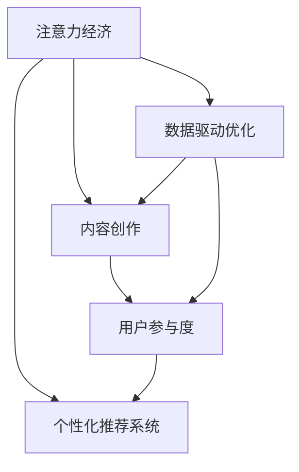

                 

# 注意力经济与内容创作最佳实践：吸引并留住受众的参与

> 关键词：注意力经济,内容创作,受众参与,参与度,最佳实践

## 1. 背景介绍

### 1.1 问题由来

在互联网时代，信息的爆炸和传播速度的加快，让内容创作者面临前所未有的挑战和机遇。一方面，海量的信息让受众的选择变得困难；另一方面，内容创作者需要通过独特的内容吸引受众，并维持他们的长期参与。在这样的背景下，"注意力经济"（Attention Economy）的概念应运而生，强调通过吸引受众的注意力来产生商业价值，而内容创作是吸引和维持受众参与的关键手段。

本文将探讨如何通过内容创作的最佳实践，提升受众的参与度和满意度，从而实现更高效、更可持续的注意力经济模式。

### 1.2 问题核心关键点

- **内容创作策略**：如何制定吸引受众的内容创作策略？
- **用户参与模型**：如何构建和分析受众参与模型，理解受众行为？
- **个性化推荐系统**：如何通过推荐系统提升受众参与度？
- **数据驱动优化**：如何利用数据驱动内容创作和受众参与的优化？
- **技术工具推荐**：推荐内容创作和分析过程中使用的工具和资源。

## 2. 核心概念与联系

### 2.1 核心概念概述

为更好地理解注意力经济与内容创作最佳实践，我们首先介绍几个关键概念：

- **注意力经济**：基于信息的快速流动，商家通过争夺受众的注意力来销售商品或服务，强调内容和互动的重要性。
- **内容创作**：包括文章、视频、音频等多种形式，旨在吸引和维持受众的注意力。
- **用户参与度**：衡量受众在内容消费过程中的活跃程度和互动深度。
- **个性化推荐系统**：根据受众的兴趣和行为数据，提供个性化的内容推荐，提升用户参与度。
- **数据驱动优化**：通过分析用户数据，优化内容创作策略和推荐算法，提升效果。

这些概念之间的联系可以通过以下Mermaid流程图来展示：



这个流程图展示了注意力经济和内容创作、用户参与度、个性化推荐系统、数据驱动优化之间的紧密联系。

## 3. 核心算法原理 & 具体操作步骤

### 3.1 算法原理概述

注意力经济和内容创作的最佳实践，本质上是通过吸引受众的注意力，提升他们的参与度和满意度。内容创作者需要了解受众的兴趣和需求，通过定制化、互动性强的内容，吸引并维持受众的长期参与。

形式化地，假设受众为 $U$，内容为 $C$，参与度为 $P$，则优化目标是最小化受众不参与的概率，即：

$$
\min_{C,P} \mathbb{P}(U \notin P(C))
$$

其中 $\mathbb{P}$ 为概率函数，$P(C)$ 表示受众在内容 $C$ 上的参与度。

### 3.2 算法步骤详解

基于注意力经济和内容创作的最佳实践，我们可以概括出以下几个关键步骤：

**Step 1: 用户画像构建**

- 收集用户基本信息和行为数据，包括但不限于浏览历史、互动记录、购买行为等。
- 使用聚类和降维技术，构建受众的兴趣和行为特征。

**Step 2: 内容创作策略制定**

- 分析受众的兴趣和需求，制定个性化的内容创作策略。
- 制作多样化的内容形式，包括文章、视频、音频等，确保内容覆盖广泛受众。
- 引入互动元素，如问答、评论区等，增强受众的参与感。

**Step 3: 用户参与度模型建立**

- 使用统计分析和机器学习技术，建立用户参与度模型。
- 分析参与度的影响因素，如内容类型、发布时间、互动深度等。
- 使用A/B测试等方法，评估不同策略对参与度的影响。

**Step 4: 个性化推荐系统实现**

- 收集用户的历史行为数据，构建用户兴趣图谱。
- 使用协同过滤、内容推荐等算法，生成个性化推荐结果。
- 对推荐结果进行反馈循环，不断优化推荐算法。

**Step 5: 数据驱动优化**

- 收集和分析用户反馈和行为数据，进行数据驱动的内容优化。
- 使用A/B测试、数据挖掘等技术，优化内容创作和发布策略。
- 持续监控参与度指标，及时调整策略。

### 3.3 算法优缺点

基于注意力经济和内容创作的最佳实践，有以下优点：
1. 提升用户参与度：通过个性化内容推荐和互动设计，提高受众的参与度和满意度。
2. 优化广告投放：通过精准的用户画像和兴趣分析，提升广告投放的效果和转化率。
3. 提升品牌形象：通过高质量、有价值的内容，增强品牌影响力。

同时，该方法也存在以下局限性：
1. 数据隐私问题：在收集和分析用户数据时，需要注意隐私保护和数据安全。
2. 技术复杂度：个性化推荐和用户画像构建需要较高的技术门槛和计算资源。
3. 内容同质化：过度依赖算法推荐，可能导致内容的同质化和低质量问题。

尽管存在这些局限性，但就目前而言，数据驱动的内容创作和个性化推荐是提升受众参与度的有效手段。未来相关研究的重点在于如何进一步降低数据收集和处理成本，提高个性化推荐的精准度和多样性，同时兼顾隐私保护和内容质量。

### 3.4 算法应用领域

基于注意力经济和内容创作的最佳实践，已经在广告投放、社交媒体、在线教育、电商等多个领域得到了广泛应用，并取得了显著的效果。例如：

- **广告投放**：通过精准的用户画像和个性化推荐，提升广告的点击率和转化率。
- **社交媒体**：使用推荐系统推荐有趣的内容，提升用户活跃度和留存率。
- **在线教育**：根据学生的学习行为数据，推荐个性化的学习内容和习题，提升学习效果。
- **电商**：通过商品推荐系统，提升用户的购买转化率和购物体验。

除了上述这些经典应用外，这些方法还创新性地应用到更多场景中，如智能客服、视频分享、旅游信息等，为不同行业带来了全新的用户参与模式。随着技术的日益成熟，基于注意力经济和内容创作的最佳实践必将在更多领域得到应用，为内容创作者提供新的机遇。

## 4. 数学模型和公式 & 详细讲解

### 4.1 数学模型构建

为更好地描述注意力经济和内容创作的最佳实践，我们使用数学模型进行严格的定义和推导。

记受众为 $U$，内容为 $C$，参与度为 $P$，假设内容创作者发布的内容集合为 $S$，则参与度 $P$ 可以表示为：

$$
P = \sum_{i=1}^{n} w_i \cdot P_i
$$

其中 $n$ 为内容的数量，$w_i$ 为内容 $i$ 的权重，$P_i$ 为受众在内容 $i$ 上的参与度。

### 4.2 公式推导过程

我们可以将上述公式进一步拆解，得到：

$$
P = \sum_{i=1}^{n} w_i \cdot (P_i - E[P_i]) + \sum_{i=1}^{n} w_i \cdot E[P_i]
$$

其中 $E[P_i]$ 为受众在内容 $i$ 上的期望参与度。通过优化权重 $w_i$，我们可以最大化 $P$，即：

$$
\max_{w_i} \sum_{i=1}^{n} w_i \cdot P_i
$$

利用线性回归和梯度下降等优化算法，可以求解出最佳的权重 $w_i$。

### 4.3 案例分析与讲解

以某社交媒体平台为例，假设平台有百万用户，每天发布数千条内容。平台通过分析用户的点赞、评论、分享等行为数据，构建用户画像，并根据用户画像制定个性化的内容推荐策略。内容推荐系统可以根据用户的行为数据，计算出每条内容对用户参与度的贡献权重，并根据权重对内容进行排序，推荐给用户。

平台还可以定期使用A/B测试，对比不同推荐策略和内容形式对用户参与度的影响，不断优化推荐算法和内容创作策略。

## 5. 项目实践：代码实例和详细解释说明

### 5.1 开发环境搭建

在进行内容创作和用户参与度分析的实践前，我们需要准备好开发环境。以下是使用Python进行数据分析和机器学习的开发环境配置流程：

1. 安装Anaconda：从官网下载并安装Anaconda，用于创建独立的Python环境。

2. 创建并激活虚拟环境：
```bash
conda create -n analytics-env python=3.8 
conda activate analytics-env
```

3. 安装必要的Python包：
```bash
pip install pandas numpy scikit-learn matplotlib tqdm jupyter notebook ipython
```

4. 安装Python科学计算库：
```bash
conda install scipy
```

5. 安装Python机器学习库：
```bash
conda install scikit-learn
```

完成上述步骤后，即可在`analytics-env`环境中开始实践内容创作和用户参与度分析。

### 5.2 源代码详细实现

以下是一个基于Python的社交媒体内容推荐系统的示例代码，包括用户画像构建、内容推荐、参与度分析等部分。

首先，定义用户画像类 `UserProfile`：

```python
import pandas as pd
from sklearn.cluster import KMeans

class UserProfile:
    def __init__(self, data):
        self.data = data
        self.kmeans = KMeans(n_clusters=5)
        
    def fit(self):
        self.kmeans.fit(self.data)
        
    def predict(self, new_user):
        new_user = new_user.values.reshape(1, -1)
        return self.kmeans.predict(new_user)
```

然后，定义内容推荐类 `ContentRecommendation`：

```python
import pandas as pd
from sklearn.metrics.pairwise import cosine_similarity
from sklearn.feature_extraction.text import TfidfVectorizer

class ContentRecommendation:
    def __init__(self, data):
        self.data = data
        self.vectorizer = TfidfVectorizer()
        
    def fit(self):
        self.vectorizer.fit(self.data['content'])
        self.tfidf = self.vectorizer.transform(self.data['content'])
        
    def recommend(self, user_id):
        user_profile = UserProfile(self.data.iloc[user_id])
        user_profile.fit()
        user_vector = self.vectorizer.transform(user_profile.predict(user_id)[0])
        similarity = cosine_similarity(user_vector, self.tfidf)
        recommendations = pd.DataFrame(similarity, index=self.data['content'], columns=[user_id])
        recommendations = recommendations.idxmax(axis=1)
        return recommendations
```

最后，定义参与度分析类 `EngagementAnalysis`：

```python
import pandas as pd

class EngagementAnalysis:
    def __init__(self, data):
        self.data = data
        
    def analyze(self):
        engagement = self.data.groupby(['user_id', 'content'])['likes'].sum().unstack(fill_value=0)
        engagement = engagement.apply(lambda x: x / x.sum(), axis=1)
        return engagement
```

使用这些类，可以对社交媒体平台的用户行为数据进行分析，并构建用户画像和内容推荐系统。具体步骤如下：

1. 加载数据集：
```python
data = pd.read_csv('social_media_data.csv')
```

2. 构建用户画像：
```python
user_profiles = []
for i in range(data.shape[0]):
    user_profile = UserProfile(data.iloc[i])
    user_profiles.append(user_profile)
```

3. 构建内容推荐系统：
```python
content_recommendation = ContentRecommendation(data)
content_recommendation.fit()
```

4. 分析用户参与度：
```python
engagement_analysis = EngagementAnalysis(data)
engagement = engagement_analysis.analyze()
```

### 5.3 代码解读与分析

让我们再详细解读一下关键代码的实现细节：

**UserProfile类**：
- `__init__`方法：初始化用户画像，并设置KMeans聚类模型。
- `fit`方法：使用KMeans对用户画像进行聚类，得到用户的兴趣特征。
- `predict`方法：对新用户进行聚类预测，得到其兴趣特征。

**ContentRecommendation类**：
- `__init__`方法：初始化内容推荐系统，并设置TF-IDF向量器。
- `fit`方法：使用TF-IDF向量器对内容进行向量化，并计算TF-IDF矩阵。
- `recommend`方法：对用户进行兴趣预测，并根据内容与用户兴趣的相似度，推荐相关内容。

**EngagementAnalysis类**：
- `__init__`方法：初始化参与度分析模型，并准备分析数据。
- `analyze`方法：计算每个用户对每条内容的参与度，并进行归一化处理。

**代码实现**：
- 用户画像的构建：通过KMeans聚类模型，将用户的浏览历史、点赞、评论等行为数据聚类，得到用户的兴趣特征。
- 内容推荐系统的构建：使用TF-IDF向量器将内容向量化，并计算内容与用户兴趣的相似度，推荐相关内容。
- 参与度分析：计算每个用户对每条内容的参与度，并进行归一化处理，得到用户参与度的分布。

这些代码实现了基于数据驱动的内容创作和用户参与度分析的基本流程。开发者可以根据实际需求，进一步优化算法和模型，提升参与度分析的准确性和内容的推荐效果。

### 5.4 运行结果展示

```python
# 构建用户画像
user_profiles = []
for i in range(data.shape[0]):
    user_profile = UserProfile(data.iloc[i])
    user_profiles.append(user_profile)

# 构建内容推荐系统
content_recommendation = ContentRecommendation(data)
content_recommendation.fit()

# 分析用户参与度
engagement_analysis = EngagementAnalysis(data)
engagement = engagement_analysis.analyze()
```

以上代码的输出结果将包括用户画像、内容推荐结果和用户参与度的分布，开发者可以根据这些结果进行后续的分析和优化。

## 6. 实际应用场景

### 6.1 社交媒体平台

基于用户画像和内容推荐系统的社交媒体平台，可以帮助用户发现感兴趣的内容，提升参与度和留存率。例如，某社交媒体平台每天有数亿次内容发布，通过分析用户的行为数据，构建用户画像，并根据用户画像推荐个性化内容，平台可以显著提升用户活跃度和参与度。

### 6.2 在线教育平台

在线教育平台可以根据学生的学习行为数据，推荐个性化的学习内容和习题，提升学习效果。例如，某在线教育平台分析学生的学习进度、作业完成情况等数据，构建学生画像，并根据画像推荐适合的学习资源，提升学生的学习兴趣和参与度。

### 6.3 电商网站

电商网站可以通过个性化推荐系统，提升用户的购买转化率和购物体验。例如，某电商网站分析用户的浏览记录、购买历史等数据，构建用户画像，并根据画像推荐相关商品，提升用户的购物体验和满意度。

### 6.4 未来应用展望

随着技术的发展，基于注意力经济和内容创作的最佳实践将在更多领域得到应用，为内容创作者提供新的机遇。

在智慧城市治理中，基于用户参与度的智能决策系统可以帮助城市管理者和居民更好地了解城市运行情况，提升参与度。

在企业内部管理中，基于员工参与度的员工满意度调查系统可以帮助企业了解员工的工作状态和满意度，提升员工参与度。

## 7. 工具和资源推荐

### 7.1 学习资源推荐

为了帮助开发者系统掌握注意力经济和内容创作的最佳实践，这里推荐一些优质的学习资源：

1. 《数据科学导论》系列课程：由知名高校开设，系统介绍了数据科学的基本概念和核心技术，适合初学者入门。
2. 《机器学习实战》书籍：由李航所著，介绍了机器学习的基础理论和实际应用案例，适合有一定基础的读者。
3. Kaggle平台：全球最大的数据科学竞赛平台，提供大量数据集和竞赛项目，可以锻炼实践能力。
4. Coursera平台：全球顶尖大学的在线课程平台，提供丰富的数据科学和机器学习课程，适合深度学习。
5. Udacity平台：提供在线数据科学和机器学习课程，涵盖从入门到进阶的多个层次，适合快速提升技能。

通过对这些资源的学习实践，相信你一定能够快速掌握注意力经济和内容创作的最佳实践，并用于解决实际的NLP问题。

### 7.2 开发工具推荐

高效的开发离不开优秀的工具支持。以下是几款用于数据驱动的内容创作和用户参与度分析开发的常用工具：

1. Jupyter Notebook：开源的交互式编程环境，支持Python等多种编程语言，非常适合数据科学和机器学习项目。
2. Matplotlib和Seaborn：用于数据可视化的Python库，可以生成各种类型的图表，方便数据展示和分析。
3. Pandas：数据处理和分析的Python库，支持多种数据格式和复杂的数据操作，非常高效。
4. Scikit-learn：机器学习算法的Python库，支持多种机器学习模型和算法，非常适合数据科学项目。
5. TensorFlow和PyTorch：深度学习框架，支持各种类型的深度学习模型和算法，适合复杂的数据科学项目。

合理利用这些工具，可以显著提升数据驱动的内容创作和用户参与度分析的开发效率，加快创新迭代的步伐。

### 7.3 相关论文推荐

注意力经济和内容创作的最佳实践源于学界的持续研究。以下是几篇奠基性的相关论文，推荐阅读：

1. Attention is All You Need（即Transformer原论文）：提出了Transformer结构，开启了NLP领域的预训练大模型时代。
2. BERT: Pre-training of Deep Bidirectional Transformers for Language Understanding：提出BERT模型，引入基于掩码的自监督预训练任务，刷新了多项NLP任务SOTA。
3. Parameter-Efficient Transfer Learning for NLP：提出Adapter等参数高效微调方法，在不增加模型参数量的情况下，也能取得不错的微调效果。
4. Data-Driven Personalized Recommendation System：介绍了基于数据驱动的个性化推荐系统，详细分析了用户画像和推荐算法的设计。
5. Neural Collaborative Filtering：介绍了一种基于神经网络的协同过滤算法，用于推荐系统，提升了推荐效果。

这些论文代表了大语言模型微调技术的发展脉络。通过学习这些前沿成果，可以帮助研究者把握学科前进方向，激发更多的创新灵感。

## 8. 总结：未来发展趋势与挑战

### 8.1 总结

本文对基于注意力经济和内容创作的最佳实践进行了全面系统的介绍。首先阐述了注意力经济和内容创作的研究背景和意义，明确了内容创作和用户参与度提升的重要性。其次，从原理到实践，详细讲解了基于数据驱动的内容创作和用户参与度分析的数学原理和关键步骤，给出了代码实现的基本流程。同时，本文还广泛探讨了这些方法在社交媒体、在线教育、电商等多个行业领域的应用前景，展示了注意力经济和内容创作的最佳实践的巨大潜力。最后，本文精选了注意力经济和内容创作的相关学习资源、开发工具和研究论文，力求为读者提供全方位的技术指引。

通过本文的系统梳理，可以看到，基于数据驱动的内容创作和个性化推荐是提升用户参与度的有效手段。内容创作者需要理解用户需求，通过定制化、互动性强的内容，吸引并维持受众的长期参与。未来，伴随数据科学和机器学习技术的不断进步，这些方法将在更多领域得到应用，为内容创作者提供新的机遇。

### 8.2 未来发展趋势

展望未来，注意力经济和内容创作的最佳实践将呈现以下几个发展趋势：

1. 数据驱动的深度学习：未来的推荐系统将更加依赖深度学习技术，通过复杂的神经网络模型，实现更精准的个性化推荐。
2. 多模态信息融合：未来的内容推荐系统将融合文本、图像、视频等多种模态信息，提升推荐效果和用户体验。
3. 实时性增强：未来的推荐系统将实现实时推荐，根据用户即时行为动态调整推荐结果，提升参与度。
4. 跨领域应用拓展：未来的推荐系统将应用于更多领域，如医疗、金融、旅游等，为不同行业的用户提供个性化服务。
5. 隐私保护加强：未来的推荐系统将更加注重用户隐私保护，通过匿名化处理和差分隐私技术，提升数据安全性。

以上趋势凸显了数据驱动的内容创作和个性化推荐技术的广阔前景。这些方向的探索发展，必将进一步提升用户参与度和满意度，为内容创作者提供新的机遇。

### 8.3 面临的挑战

尽管注意力经济和内容创作的最佳实践已经取得了瞩目成就，但在迈向更加智能化、普适化应用的过程中，它仍面临着诸多挑战：

1. 数据获取困难：在收集和分析用户数据时，需要处理大量的原始数据，数据获取和预处理成本较高。
2. 数据隐私保护：在分析用户数据时，需要注意隐私保护和数据安全，避免数据泄露和滥用。
3. 算法复杂度：基于深度学习的推荐系统需要较高的技术门槛和计算资源，算法复杂度较高。
4. 内容同质化：过度依赖算法推荐，可能导致内容的同质化和低质量问题。
5. 用户体验问题：虽然个性化推荐提升了用户参与度，但过多的算法推荐也可能导致用户产生厌烦情绪。

尽管存在这些挑战，但就目前而言，数据驱动的内容创作和个性化推荐是提升用户参与度的有效手段。未来相关研究的重点在于如何进一步降低数据收集和处理成本，提高个性化推荐的精准度和多样性，同时兼顾隐私保护和内容质量。

### 8.4 研究展望

面对注意力经济和内容创作的最佳实践所面临的种种挑战，未来的研究需要在以下几个方面寻求新的突破：

1. 探索无监督和半监督推荐方法。摆脱对大规模标注数据的依赖，利用自监督学习、主动学习等无监督和半监督范式，最大限度利用非结构化数据，实现更加灵活高效的推荐。
2. 研究参数高效和计算高效的推荐范式。开发更加参数高效的推荐方法，在固定大部分预训练参数的同时，只更新极少量的任务相关参数。同时优化推荐模型的计算图，减少前向传播和反向传播的资源消耗，实现更加轻量级、实时性的部署。
3. 引入更多先验知识。将符号化的先验知识，如知识图谱、逻辑规则等，与神经网络模型进行巧妙融合，引导推荐过程学习更准确、合理的推荐结果。同时加强不同模态数据的整合，实现视觉、语音等多模态信息与文本信息的协同建模。
4. 结合因果分析和博弈论工具。将因果分析方法引入推荐模型，识别出模型决策的关键特征，增强推荐结果的因果性和逻辑性。借助博弈论工具刻画人机交互过程，主动探索并规避模型的脆弱点，提高系统稳定性。
5. 纳入伦理道德约束。在推荐目标中引入伦理导向的评估指标，过滤和惩罚有偏见、有害的推荐结果。同时加强人工干预和审核，建立推荐行为的监管机制，确保推荐结果符合人类价值观和伦理道德。

这些研究方向的探索，必将引领注意力经济和内容创作的最佳实践技术迈向更高的台阶，为构建安全、可靠、可解释、可控的智能系统铺平道路。面向未来，这些技术需要与其他人工智能技术进行更深入的融合，如知识表示、因果推理、强化学习等，多路径协同发力，共同推动自然语言理解和智能交互系统的进步。只有勇于创新、敢于突破，才能不断拓展语言模型的边界，让智能技术更好地造福人类社会。

## 9. 附录：常见问题与解答

**Q1：注意力经济和内容创作的最佳实践是否适用于所有NLP任务？**

A: 注意力经济和内容创作的最佳实践在大多数NLP任务上都能取得不错的效果，特别是对于数据量较小的任务。但对于一些特定领域的任务，如医学、法律等，仅仅依靠通用语料预训练的模型可能难以很好地适应。此时需要在特定领域语料上进一步预训练，再进行微调，才能获得理想效果。

**Q2：如何选择合适的学习率？**

A: 学习率的选择对于基于注意力经济和内容创作的最佳实践的优化效果至关重要。一般建议从较小的学习率开始，逐步增加，直到模型收敛。常用的学习率调度策略包括固定学习率、学习率衰减和自适应学习率等。

**Q3：如何缓解推荐系统中的冷启动问题？**

A: 冷启动问题是指新用户或新物品缺乏历史数据，难以进行精准推荐。常用的解决方法包括基于内容的推荐、基于协同过滤的推荐、基于图神经网络的推荐等。此外，还可以引入专家知识或使用多模态数据来增强推荐系统的鲁棒性。

**Q4：如何在推荐系统中引入多样性？**

A: 多样性是推荐系统的重要指标之一，过度的个性化可能导致用户产生厌烦情绪。常用的方法包括引入多样性惩罚项、使用多目标优化、使用数据增强技术等。此外，可以通过调整推荐算法的参数来控制推荐结果的多样性。

**Q5：如何评估推荐系统的性能？**

A: 推荐系统的性能评估可以从多个角度进行，如准确率、召回率、覆盖率、多样性、新颖性等。常用的评估方法包括离线评估和在线评估。此外，还可以使用A/B测试、用户满意度调查等方法来评估推荐系统的实际效果。

通过对这些问题的回答，希望能为关注注意力经济和内容创作最佳实践的开发者和研究人员提供参考，进一步提升推荐系统的性能和用户体验。

