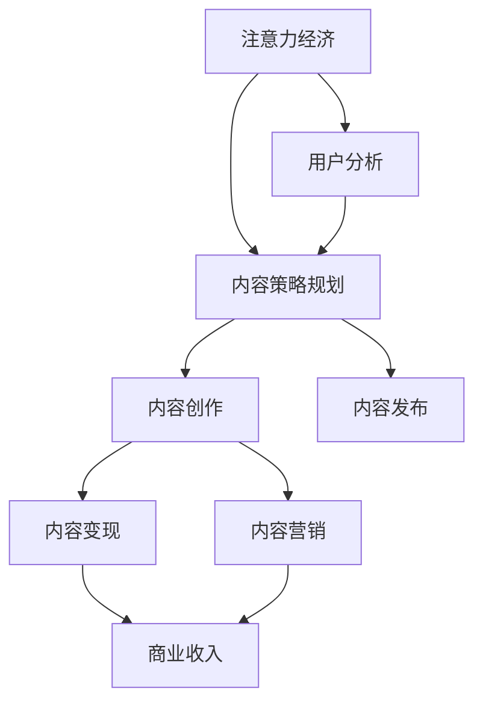

                 

# 注意力经济与内容策略规划与实践：为受众创建有影响力的内容

## 1. 背景介绍

### 1.1 问题由来
随着互联网和移动互联网的迅速普及，信息爆炸成为不争的事实。用户面对海量的内容，如何从中找到有价值、有吸引力的信息，成为了内容创作者和运营者必须面对的挑战。在此背景下，注意力经济应运而生，逐渐成为吸引和留住用户的关键策略。

注意力经济是一种经济活动，其核心是争夺用户的注意力资源，通过提供有价值、有吸引力的内容，吸引并留住用户，从而实现商业价值。在内容为王的时代，掌握注意力经济的规律，成为内容策略规划与实践的重要指导。

### 1.2 问题核心关键点
注意力经济的核心在于如何吸引和保持用户注意力。影响用户注意力的因素主要包括内容质量、形式、呈现方式、互动性等。因此，内容策略规划与实践需要从这些维度进行全面考虑，以打造有影响力的内容。

为实现这一目标，内容策略规划与实践需要考虑以下几个关键点：

1. **内容质量**：内容是否具备真实性、有用性、新颖性、相关性等特征，能否满足用户需求。
2. **内容形式**：内容是否采用用户喜闻乐见的形式，如视频、图文、音频等。
3. **内容呈现**：内容是否通过合理的布局、编排、优化呈现，确保用户阅读和观看的流畅性和体验感。
4. **内容互动**：内容是否具备互动性，如评论区、投票、直播等，以增强用户参与感和忠诚度。

### 1.3 问题研究意义
注意力经济在互联网时代具有重要意义：

1. **提升用户留存率**：高质量、有吸引力的内容能够有效提升用户留存率，增强用户粘性。
2. **增加用户参与度**：互动性强的内容能够激发用户参与热情，增加用户活跃度。
3. **促进商业变现**：通过内容广告、付费会员、电商导流等形式，实现内容变现。
4. **塑造品牌形象**：优质的内容能够树立品牌形象，增强品牌影响力和公信力。
5. **实现差异化竞争**：内容策略的差异化可以提升内容平台的竞争力，吸引更多用户。

## 2. 核心概念与联系

### 2.1 核心概念概述

为更好地理解注意力经济与内容策略规划与实践，本节将介绍几个密切相关的核心概念：

- **注意力经济**：争夺用户注意力的经济活动，通过提供有价值、有吸引力的内容，吸引并留住用户，实现商业价值。
- **内容策略规划**：基于对目标用户群体的需求分析，制定具体的内容策略，指导内容创作与发布。
- **内容变现**：通过内容形式（如广告、会员、电商等）实现商业变现，将内容价值转化为实际收入。
- **内容营销**：利用内容吸引和影响目标用户，达到提升品牌知名度、增加用户参与度等目的。
- **用户分析**：通过数据分析手段，深入了解用户行为和需求，指导内容策略的制定与优化。

这些概念之间的逻辑关系可以通过以下Mermaid流程图来展示：



这个流程图展示了几者之间的逻辑关系：

1. 注意力经济驱动内容策略规划。
2. 内容策略规划指导内容创作与发布。
3. 内容创作和发布通过内容变现和内容营销实现商业收入。
4. 用户分析辅助内容策略规划，提供用户行为的洞察和指导。

## 3. 核心算法原理 & 具体操作步骤
### 3.1 算法原理概述

注意力经济与内容策略规划与实践的本质，是通过提供有价值、有吸引力的内容，吸引并留住用户，从而实现商业价值。其核心算法原理包括以下几个方面：

1. **用户行为分析**：通过数据分析手段，深入了解用户行为和需求，指导内容策略的制定与优化。
2. **内容优化**：根据用户反馈和行为数据，不断优化内容质量和形式，提升用户满意度和参与度。
3. **内容多样化**：通过多样化内容形式和主题，满足不同用户群体的需求，增强用户粘性。
4. **互动性增强**：通过增加内容的互动性，如评论区、投票、直播等，提升用户参与度和忠诚度。
5. **个性化推荐**：通过算法推荐系统，精准推荐用户感兴趣的内容，提升用户留存率和满意度。

### 3.2 算法步骤详解

基于注意力经济与内容策略规划与实践的核心算法原理，本节将详细讲解具体的操作步骤：

**Step 1: 数据收集与处理**
- 收集用户行为数据，如访问路径、停留时间、点击率、互动数据等。
- 使用数据分析工具（如Google Analytics、Mixpanel等）处理和清洗数据，确保数据的准确性和完整性。

**Step 2: 用户画像构建**
- 通过K-means聚类、LDA主题模型等方法，对用户进行画像分析，识别出不同用户群体的特征。
- 根据用户画像，制定针对性的内容策略，确保内容与用户需求和兴趣匹配。

**Step 3: 内容创作与发布**
- 根据用户画像和内容策略，创作符合用户需求和兴趣的内容，如视频、图文、音频等。
- 发布内容至不同的平台和渠道，确保内容的覆盖面和曝光度。

**Step 4: 内容变现与营销**
- 通过内容变现手段，如广告、会员、电商导流等，实现内容的商业价值。
- 利用内容营销手段，提升内容的传播力和影响力，吸引更多用户。

**Step 5: 用户反馈与优化**
- 收集用户反馈和行为数据，评估内容的效果和用户满意度。
- 根据用户反馈，不断优化内容质量和形式，提升用户留存率和参与度。

### 3.3 算法优缺点

注意力经济与内容策略规划与实践具有以下优点：

1. **提升用户留存率**：高质量、有吸引力的内容能够有效提升用户留存率，增强用户粘性。
2. **增加用户参与度**：互动性强的内容能够激发用户参与热情，增加用户活跃度。
3. **促进商业变现**：通过内容广告、付费会员、电商导流等形式，实现内容变现。
4. **塑造品牌形象**：优质的内容能够树立品牌形象，增强品牌影响力和公信力。
5. **实现差异化竞争**：内容策略的差异化可以提升内容平台的竞争力，吸引更多用户。

同时，该方法也存在一定的局限性：

1. **依赖用户数据**：注意力经济高度依赖用户数据，数据质量和数据的获取成本较高。
2. **内容创意有限**：过度依赖数据分析可能限制内容创意，导致内容同质化。
3. **资源消耗较大**：内容创作和发布需要大量的资源投入，如人力、物力、财力等。
4. **用户行为变化快**：用户行为和兴趣变化较快，需要持续跟踪和调整内容策略。
5. **内容监管风险**：不当内容可能引发法律和伦理问题，影响平台声誉。

尽管存在这些局限性，但就目前而言，注意力经济与内容策略规划与实践仍是内容营销领域的主流范式。未来相关研究的重点在于如何进一步降低对用户数据的依赖，提高内容创意的多样性和丰富性，同时兼顾资源消耗和监管风险等因素。

### 3.4 算法应用领域

注意力经济与内容策略规划与实践在多个领域已经得到了广泛的应用，包括但不限于：

- **社交媒体**：通过提供有价值、有吸引力的内容，吸引并留住用户，实现商业变现。
- **视频平台**：通过高质量的视频内容，吸引用户观看和互动，增加平台活跃度。
- **电商平台**：通过内容营销和电商导流，提升用户购物体验，增加销售额。
- **新闻媒体**：通过深度报道和独家内容，提升品牌影响力和用户粘性。
- **教育平台**：通过提供优质的教育内容，吸引学生和家长，实现商业变现。

除了上述这些常见领域外，注意力经济与内容策略规划与实践还在更多场景中得到应用，如金融、医疗、旅游、娱乐等，为内容创作者和运营者提供了新的思路和方向。

## 4. 数学模型和公式 & 详细讲解 & 举例说明
### 4.1 数学模型构建

本节将使用数学语言对注意力经济与内容策略规划与实践的核心算法原理进行更加严格的刻画。

记用户行为数据集为 $D=\{(x_i,y_i)\}_{i=1}^N, x_i \in \mathcal{X}, y_i \in \mathcal{Y}$，其中 $\mathcal{X}$ 为输入空间，$\mathcal{Y}$ 为输出空间。

定义用户画像特征矩阵为 $X \in \mathbb{R}^{N \times D}$，其中 $D$ 为用户画像的特征维度，$x_i$ 为用户$i$的画像向量。

内容策略权重向量为 $w \in \mathbb{R}^D$，表示不同内容特征对用户行为的影响权重。

内容效果评估指标为 $M:\mathcal{X} \rightarrow \mathbb{R}$，如点击率、停留时间等。

注意力经济与内容策略规划与实践的目标是最大化内容效果评估指标 $M$，即：

$$
\max_{w} \sum_{i=1}^N w^T x_i M(x_i)
$$

通过梯度上升等优化算法，不断调整策略权重 $w$，以获得最优的内容策略。

### 4.2 公式推导过程

以下我们以点击率优化为例，推导内容策略的优化公式。

假设内容效果评估指标为点击率，即 $M(x_i)=I(x_i)$，其中 $I(x_i)$ 表示用户是否点击了内容 $x_i$。

定义内容策略权重向量 $w \in \mathbb{R}^D$，其对用户行为的影响为：

$$
w^T x_i = \sum_{d=1}^D w_d x_{id}
$$

则最大化点击率的优化目标为：

$$
\max_{w} \sum_{i=1}^N w^T x_i I(x_i) = \max_{w} \sum_{i=1}^N \sum_{d=1}^D w_d x_{id} I(x_i)
$$

根据拉格朗日乘子法，引入拉格朗日乘子 $\lambda \in \mathbb{R}^N$，构造拉格朗日函数：

$$
\mathcal{L}(w,\lambda) = \sum_{i=1}^N \sum_{d=1}^D w_d x_{id} I(x_i) - \lambda^T (\sum_{i=1}^N I(x_i) - 1)
$$

对 $w$ 和 $\lambda$ 分别求导，得：

$$
\frac{\partial \mathcal{L}}{\partial w} = \sum_{i=1}^N \sum_{d=1}^D x_{id} I(x_i) - \lambda I(x_i)
$$

$$
\frac{\partial \mathcal{L}}{\partial \lambda} = \sum_{i=1}^N I(x_i) - 1
$$

根据梯度上升法，更新策略权重 $w$ 和拉格朗日乘子 $\lambda$：

$$
w \leftarrow w + \eta \frac{\partial \mathcal{L}}{\partial w}
$$

$$
\lambda \leftarrow \lambda + \eta \frac{\partial \mathcal{L}}{\partial \lambda}
$$

其中 $\eta$ 为学习率，需根据具体问题进行调整。

在得到拉格朗日乘子 $\lambda$ 后，可以进一步评估内容策略的效果，计算点击率优化前后的变化。

### 4.3 案例分析与讲解

**案例：视频平台内容策略优化**

假设视频平台的内容策略权重向量 $w$ 为 [视频时长, 视频质量, 视频分类]。通过对用户行为数据进行分析，发现以下结论：

1. 视频时长越长，点击率越低。
2. 视频质量越高，点击率越高。
3. 分类为电影类视频，点击率最高。

因此，平台可以调整内容策略，优化视频的推荐算法，增加高质量、分类为电影类视频的比例，从而提升整体点击率。

## 5. 项目实践：代码实例和详细解释说明
### 5.1 开发环境搭建

在进行内容策略优化实践前，我们需要准备好开发环境。以下是使用Python进行PyTorch开发的环境配置流程：

1. 安装Anaconda：从官网下载并安装Anaconda，用于创建独立的Python环境。

2. 创建并激活虚拟环境：
```bash
conda create -n content-strategy python=3.8 
conda activate content-strategy
```

3. 安装PyTorch：根据CUDA版本，从官网获取对应的安装命令。例如：
```bash
conda install pytorch torchvision torchaudio cudatoolkit=11.1 -c pytorch -c conda-forge
```

4. 安装TensorFlow：
```bash
conda install tensorflow
```

5. 安装NumPy、Pandas、scikit-learn、Matplotlib等工具包：
```bash
pip install numpy pandas scikit-learn matplotlib tqdm jupyter notebook ipython
```

完成上述步骤后，即可在`content-strategy`环境中开始内容策略优化实践。

### 5.2 源代码详细实现

下面我们以电商平台商品推荐系统为例，给出使用PyTorch进行内容策略优化的PyTorch代码实现。

首先，定义用户行为数据处理函数：

```python
import pandas as pd
import numpy as np
from sklearn.preprocessing import LabelEncoder

def preprocess_data(data_path):
    data = pd.read_csv(data_path)
    # 处理缺失值
    data.fillna(method='ffill', inplace=True)
    # 对用户行为进行二值化处理
    data['click'] = data['click'].map({True: 1, False: 0})
    # 对商品属性进行独热编码
    le = LabelEncoder()
    data['category'] = le.fit_transform(data['category'])
    return data

# 读取用户行为数据
data = preprocess_data('user_behavior.csv')
```

然后，定义内容策略权重优化函数：

```python
from torch import nn
import torch.optim as optim

class ContentStrategy(nn.Module):
    def __init__(self, num_features):
        super(ContentStrategy, self).__init__()
        self.fc = nn.Linear(num_features, 1)
    
    def forward(self, x):
        return self.fc(x)

# 定义损失函数
def loss_function(y_true, y_pred):
    return nn.BCELoss()(y_true, y_pred)

# 定义优化器
def optimizer_factory(num_features):
    return optim.Adam(model.parameters(), lr=0.01)

# 加载用户行为数据
X = data[['video_length', 'video_quality', 'video_category']]
y = data['click']

# 初始化内容策略权重
w = np.zeros((3, 1))

# 训练过程
epochs = 100
for epoch in range(epochs):
    # 前向传播
    y_pred = model(X)
    # 计算损失
    loss = loss_function(y, y_pred)
    # 反向传播
    loss.backward()
    # 更新权重
    optimizer.step()
    # 记录损失
    if epoch % 10 == 0:
        print(f'Epoch {epoch+1}, Loss: {loss.item()}')
```

最后，展示训练结果：

```python
# 测试过程
X_test = data_test[['video_length', 'video_quality', 'video_category']]
y_test = data_test['click']
y_pred = model(X_test)
print(f'Test Loss: {loss_function(y_test, y_pred).item()}')
```

以上就是使用PyTorch进行内容策略优化的完整代码实现。可以看到，通过简单地将内容策略权重表示为一个向量，使用梯度下降等优化算法进行迭代训练，即可有效提升内容策略的效果。

### 5.3 代码解读与分析

让我们再详细解读一下关键代码的实现细节：

**preprocess_data函数**：
- 读取用户行为数据，并进行缺失值处理、二值化处理和独热编码。

**ContentStrategy类**：
- 定义一个简单的线性模型，用于表示内容策略权重与用户行为之间的关系。

**loss_function函数**：
- 定义二分类交叉熵损失函数，用于评估内容策略的优化效果。

**optimizer_factory函数**：
- 定义优化器，用于更新内容策略权重。

**训练过程**：
- 使用前向传播计算预测值，计算损失并反向传播更新权重。
- 记录每个epoch的损失，以便监控优化效果。
- 在测试集上评估优化后的内容策略效果。

可以看到，通过简单的线性模型和优化算法，即可实现内容策略的优化。实际上，在实际应用中，内容策略的优化还需要考虑更多的因素，如内容创意、用户行为变化、广告投放等，才能达到更好的效果。

## 6. 实际应用场景
### 6.1 电商平台

电商平台的内容策略优化，通过提升商品推荐效果，增加用户购买转化率，提升整体业绩。具体措施包括：

- **商品分类优化**：通过分析用户点击数据，优化商品分类结构，增加热门类别商品的曝光度。
- **属性推荐**：根据用户行为数据，优化商品属性推荐算法，提升用户购物体验。
- **个性化推荐**：利用用户画像和行为数据，实现个性化商品推荐，增加用户粘性。

### 6.2 社交媒体

社交媒体的内容策略优化，通过提升用户互动率和留存率，增加广告收入。具体措施包括：

- **内容创意优化**：通过分析用户互动数据，优化内容创意，增加用户点击和分享。
- **互动形式多样化**：增加评论、点赞、分享等互动形式，提升用户参与度。
- **标签和话题推广**：利用标签和话题，引导用户参与热门讨论，提升平台活跃度。

### 6.3 视频平台

视频平台的内容策略优化，通过提升用户观看时长和互动率，增加平台收入。具体措施包括：

- **视频时长优化**：根据用户点击数据，优化视频时长，增加用户观看时长。
- **内容多样化**：增加视频种类和题材，满足不同用户的需求。
- **互动性增强**：增加评论、点赞、分享等互动形式，提升用户参与度。

### 6.4 未来应用展望

随着内容策略优化技术的不断发展，未来将会有更多创新应用：

- **AI辅助内容创作**：利用自然语言处理、图像识别等技术，辅助内容创作者进行内容创作和优化。
- **用户行为预测**：利用机器学习算法，预测用户行为和需求，实现精准推荐。
- **跨平台内容分发**：利用内容分发算法，将优质内容推荐至不同平台，提升内容覆盖面和影响力。
- **个性化内容推送**：根据用户画像和行为数据，实现个性化内容推送，提升用户留存率和满意度。
- **内容质量和多样性评估**：利用情感分析、主题模型等技术，评估内容质量和多样性，指导内容策略的优化。

## 7. 工具和资源推荐
### 7.1 学习资源推荐

为了帮助开发者系统掌握注意力经济与内容策略规划与实践的理论基础和实践技巧，这里推荐一些优质的学习资源：

1. **《内容策略与用户体验》**：这本书详细介绍了内容策略的基本概念、理论和方法，是内容策略规划与实践的重要参考。
2. **《数据驱动的内容策略》**：这本书介绍了如何通过数据分析指导内容策略，优化用户行为和体验。
3. **《深度学习与自然语言处理》**：这本书详细介绍了深度学习在自然语言处理中的应用，包括内容推荐、情感分析等。
4. **Google Analytics、Mixpanel**：这些工具提供了用户行为数据分析的功能，帮助内容创作者优化内容策略。
5. **A/B测试工具**：如Optimizely、Google Optimize等，可以帮助内容创作者进行内容实验，评估不同策略的效果。

通过对这些资源的学习实践，相信你一定能够快速掌握注意力经济与内容策略规划与实践的精髓，并用于解决实际的NLP问题。

### 7.2 开发工具推荐

高效的开发离不开优秀的工具支持。以下是几款用于内容策略优化开发的常用工具：

1. **PyTorch**：基于Python的开源深度学习框架，灵活动态的计算图，适合快速迭代研究。
2. **TensorFlow**：由Google主导开发的开源深度学习框架，生产部署方便，适合大规模工程应用。
3. **scikit-learn**：Python的机器学习库，提供了丰富的机器学习算法和工具。
4. **Pandas**：Python的数据分析库，提供了高效的数据处理和分析功能。
5. **Mixpanel**：数据分析工具，提供用户行为分析功能，帮助内容创作者优化内容策略。

合理利用这些工具，可以显著提升内容策略优化的开发效率，加快创新迭代的步伐。

### 7.3 相关论文推荐

注意力经济与内容策略规划与实践的发展源于学界的持续研究。以下是几篇奠基性的相关论文，推荐阅读：

1. **《内容推荐系统的研究综述》**：综述了内容推荐系统的基本原理和最新进展，是内容推荐研究的重要参考。
2. **《基于深度学习的内容推荐算法》**：介绍了深度学习在内容推荐中的应用，包括内容嵌入、协同过滤等方法。
3. **《用户行为分析与内容推荐》**：介绍了如何通过用户行为数据指导内容推荐，优化用户体验。
4. **《多模态内容推荐系统》**：介绍了多模态内容推荐系统的基本原理和实现方法，提升内容推荐效果。

这些论文代表了大语言模型微调技术的发展脉络。通过学习这些前沿成果，可以帮助研究者把握学科前进方向，激发更多的创新灵感。

## 8. 总结：未来发展趋势与挑战
### 8.1 总结

本文对注意力经济与内容策略规划与实践进行了全面系统的介绍。首先阐述了注意力经济与内容策略规划与实践的研究背景和意义，明确了注意力经济与内容策略规划与实践的重要价值。其次，从原理到实践，详细讲解了注意力经济与内容策略规划与实践的核心算法原理和操作步骤，给出了注意力经济与内容策略规划与实践的完整代码实例。同时，本文还广泛探讨了注意力经济与内容策略规划与实践在电商平台、社交媒体、视频平台等多个领域的应用前景，展示了注意力经济与内容策略规划与实践的巨大潜力。

通过本文的系统梳理，可以看到，注意力经济与内容策略规划与实践是内容营销领域的重要范式，极大地拓展了内容创作和运营的边界，催生了更多的落地场景。得益于深度学习技术的不断发展，内容策略的优化将更加高效、精准，带来更多的商业价值。

### 8.2 未来发展趋势

展望未来，注意力经济与内容策略规划与实践将呈现以下几个发展趋势：

1. **内容创意的智能化**：通过深度学习、生成对抗网络等技术，实现内容创意的智能化生成，提升内容创作效率。
2. **用户行为的实时分析**：利用大数据和实时分析技术，实现对用户行为的实时跟踪和分析，优化内容策略。
3. **跨平台内容分发**：利用算法推荐系统，将优质内容推荐至不同平台，提升内容覆盖面和影响力。
4. **个性化内容推送**：根据用户画像和行为数据，实现个性化内容推送，提升用户留存率和满意度。
5. **内容质量和多样性评估**：利用情感分析、主题模型等技术，评估内容质量和多样性，指导内容策略的优化。

以上趋势凸显了注意力经济与内容策略规划与实践的广阔前景。这些方向的探索发展，必将进一步提升内容创作的效率和效果，为内容创作者和运营者带来更多的机遇和挑战。

### 8.3 面临的挑战

尽管注意力经济与内容策略规划与实践已经取得了瞩目成就，但在迈向更加智能化、普适化应用的过程中，它仍面临诸多挑战：

1. **用户行为数据获取难度大**：获取高质量的用户行为数据成本较高，数据隐私和安全问题也需要引起重视。
2. **内容创意同质化**：过度依赖数据分析可能限制内容创意，导致内容同质化。
3. **广告投放精准度不足**：广告投放的精准度不够，导致用户点击率低，效果不佳。
4. **内容监管风险**：不当内容可能引发法律和伦理问题，影响平台声誉。
5. **技术实现复杂度**：内容策略的实现需要深度学习、自然语言处理等多领域技术的融合，技术实现难度较大。

尽管存在这些挑战，但就目前而言，注意力经济与内容策略规划与实践仍是内容营销领域的主流范式。未来相关研究的重点在于如何进一步降低用户行为数据获取的难度，提高内容创意的多样性和丰富性，同时兼顾广告投放的精准度和内容监管的风险，以实现更加高效、智能、普适的内容策略优化。

### 8.4 研究展望

面对注意力经济与内容策略规划与实践所面临的种种挑战，未来的研究需要在以下几个方面寻求新的突破：

1. **数据增强与数据隐私保护**：通过数据增强技术，提高用户行为数据的获取效率和质量，同时注重用户隐私保护，确保用户数据的安全性。
2. **多模态内容创作**：利用多模态数据融合技术，提升内容创意的多样性和丰富性，增强内容的吸引力和表现力。
3. **广告投放优化**：利用机器学习和推荐系统，实现广告投放的精准化，提升广告点击率和转化率。
4. **内容质量和多样性评估**：通过情感分析、主题模型等技术，评估内容质量和多样性，指导内容策略的优化。
5. **跨平台内容分发**：利用算法推荐系统，将优质内容推荐至不同平台，提升内容覆盖面和影响力。

这些研究方向的探索，必将引领注意力经济与内容策略规划与实践技术迈向更高的台阶，为内容创作者和运营者带来更多的机遇和挑战。面向未来，注意力经济与内容策略规划与实践需要与其他人工智能技术进行更深入的融合，如知识表示、因果推理、强化学习等，多路径协同发力，共同推动自然语言理解和智能交互系统的进步。只有勇于创新、敢于突破，才能不断拓展内容创作的边界，让智能技术更好地造福人类社会。

## 9. 附录：常见问题与解答

**Q1：内容策略与用户体验之间有什么关系？**

A: 内容策略与用户体验之间有密切关系。内容策略的优化能够提升用户满意度和参与度，从而增加用户的留存率和忠诚度。高质量、有吸引力的内容，能够满足用户需求，提升用户满意度，增加用户粘性。

**Q2：如何评估内容策略的效果？**

A: 评估内容策略的效果可以通过多种指标进行衡量，如点击率、停留时间、转化率、用户留存率等。具体方法包括：

1. **点击率**：统计用户点击内容的比例，衡量内容的吸引力和用户参与度。
2. **停留时间**：统计用户观看或阅读内容的平均时间，衡量内容的价值和用户满意度。
3. **转化率**：统计用户进行购买、注册、下载等行为的比例，衡量内容的商业价值和用户转化效果。
4. **用户留存率**：统计用户在不同时间段内重复访问内容的比例，衡量用户粘性和留存率。

**Q3：内容策略优化的难点是什么？**

A: 内容策略优化的难点主要包括：

1. **数据获取难度大**：获取高质量的用户行为数据成本较高，数据隐私和安全问题也需要引起重视。
2. **内容创意同质化**：过度依赖数据分析可能限制内容创意，导致内容同质化。
3. **广告投放精准度不足**：广告投放的精准度不够，导致用户点击率低，效果不佳。
4. **内容监管风险**：不当内容可能引发法律和伦理问题，影响平台声誉。
5. **技术实现复杂度**：内容策略的实现需要深度学习、自然语言处理等多领域技术的融合，技术实现难度较大。

**Q4：如何实现内容策略的智能化生成？**

A: 实现内容策略的智能化生成，可以通过以下方法：

1. **自然语言处理**：利用自然语言处理技术，自动生成高质量的内容。
2. **生成对抗网络**：通过生成对抗网络，生成多样化、高质量的内容。
3. **知识图谱**：利用知识图谱，生成具有深度、广度的内容，提升内容的权威性和可信度。
4. **用户反馈循环**：通过用户反馈，不断优化内容策略，提升内容质量和效果。

**Q5：如何保护用户数据隐私？**

A: 保护用户数据隐私可以从以下几个方面入手：

1. **数据匿名化**：对用户数据进行匿名化处理，去除敏感信息。
2. **数据加密**：对用户数据进行加密存储和传输，防止数据泄露。
3. **数据访问控制**：对用户数据进行严格的访问控制，防止未授权访问。
4. **隐私政策透明**：公开透明的隐私政策，告知用户数据的使用范围和方式，增加用户信任。
5. **合规性检查**：确保内容策略优化过程中遵守相关法律法规和隐私保护标准。

以上问题与解答涵盖了内容策略优化中的关键问题，希望能为你提供有价值的参考。

---

作者：禅与计算机程序设计艺术 / Zen and the Art of Computer Programming

