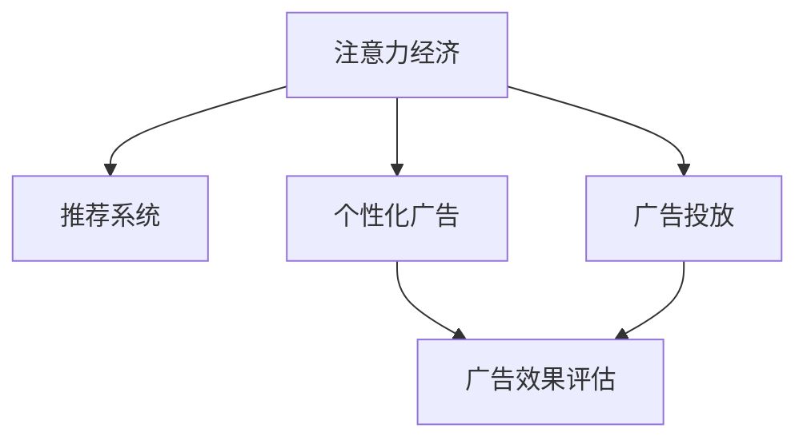

                 

# 注意力经济与在线广告目标：在不牺牲用户体验的情况下有效吸引受众

> 关键词：注意力经济, 在线广告, 用户行为, 推荐系统, 个性化广告, 广告效果评估

## 1. 背景介绍

### 1.1 问题由来

随着互联网和移动互联网的普及，注意力经济已经成为了商业竞争的焦点。在线广告作为互联网经济的重要组成部分，其核心目标是通过有效的广告展示和互动，吸引用户的注意力，进而转化成实际消费。然而，传统意义上的“点击率”（Click-Through Rate, CTR）广告投放方式已经逐渐显现出其局限性，点击率已经无法全面反映用户对广告的兴趣和价值。在注意力稀缺的背景下，如何利用有限的广告预算吸引用户的目光，同时提升广告效果，成为了广告主和媒体平台共同关注的重要课题。

近年来，随着人工智能技术的进步，推荐系统和个性化广告得到了快速发展，其在提升用户体验的同时，显著提高了广告的效果和转化率。推荐系统通过学习用户的兴趣和行为模式，为用户推荐其感兴趣的内容，包括但不限于商品、文章、视频等，极大提升了用户对内容（包括广告）的互动意愿。这种“以用户为中心”的广告模式，也被称为“注意力经济”，其目的是通过精准的用户画像和智能推荐算法，将用户的注意力转化为实际的商业价值。

### 1.2 问题核心关键点

注意力经济与在线广告的核心在于如何通过技术手段，在不牺牲用户体验的前提下，精准吸引和引导用户的注意力，从而实现广告价值的最大化。其关键点包括：

- 用户兴趣的深度学习与建模。通过分析用户的历史行为数据，精准预测其兴趣偏好。
- 个性化推荐算法的设计。推荐算法需要高效、可解释、鲁棒性强，保证推荐结果的准确性和多样性。
- 广告投放的动态调整。广告的展示、曝光量、互动方式等需根据用户行为实时动态调整。
- 广告效果的评估。需要建立科学、公正的广告效果评估体系，量化广告的实际转化和价值。

### 1.3 问题研究意义

本文聚焦于注意力经济中的在线广告目标，旨在探讨如何在不牺牲用户体验的前提下，有效吸引受众，提升广告效果。通过学习先进的推荐系统技术，本文将提出一系列可行的策略和方法，以期为在线广告主和媒体平台提供技术参考，优化广告投放策略，实现广告预算的最大化利用。

## 2. 核心概念与联系

### 2.1 核心概念概述

为更好地理解注意力经济与在线广告目标，本节将介绍几个密切相关的核心概念：

- **注意力经济**：利用互联网技术和用户数据，精准地吸引和引导用户注意力，最大化广告价值。
- **推荐系统**：基于用户历史行为数据，通过机器学习算法，为用户推荐其感兴趣的内容。
- **个性化广告**：根据用户兴趣、行为和属性，定制化的广告展示，提升广告效果和转化率。
- **广告投放**：通过程序化广告平台，自动进行广告展示和投放，实现广告预算的精准分配。
- **广告效果评估**：通过科学的方法和指标，量化广告实际效果，评估广告价值和用户价值。

这些核心概念之间的逻辑关系可以通过以下Mermaid流程图来展示：



这个流程图展示了你提到的几个核心概念及其之间的关系：

1. 注意力经济通过推荐系统和个性化广告，吸引和引导用户注意力。
2. 推荐系统利用用户历史行为数据，通过算法为用户推荐内容。
3. 个性化广告根据用户画像，定制化广告展示，提升广告效果。
4. 广告投放通过程序化平台，自动进行广告展示和投放，优化预算分配。
5. 广告效果评估通过科学方法，量化广告实际效果，指导投放策略。

## 3. 核心算法原理 & 具体操作步骤
### 3.1 算法原理概述

注意力经济与在线广告的核心算法原理包括推荐系统的深度学习和个性化广告的特征工程。

### 3.2 算法步骤详解

#### 推荐系统算法步骤
1. **数据准备**：收集用户的历史行为数据，如浏览记录、点击行为、购买历史等，构成用户行为数据集。
2. **特征工程**：通过PCA、T-SNE等降维技术，提取用户行为数据的特征。
3. **模型训练**：利用深度学习模型（如CTR-DNN、FM、DeepFM等），训练推荐模型。
4. **模型评估**：在测试集上评估推荐模型，选择合适的评估指标（如AUC、RMSE等）。
5. **实际应用**：将训练好的模型部署到推荐系统，为用户推荐内容。

#### 个性化广告算法步骤
1. **用户画像构建**：收集用户基本信息、历史行为数据，构建用户画像。
2. **广告内容定制**：根据用户画像和广告库，定制化广告内容。
3. **广告投放策略**：基于实时数据（如点击率、曝光量等），动态调整广告投放策略。
4. **效果评估**：通过广告点击、转化、收入等指标，评估广告效果。

### 3.3 算法优缺点

注意力经济与在线广告的核心算法具有以下优点：
1. **高效精准**：通过推荐算法，高效精准地为用户推荐内容，提升广告效果。
2. **用户友好**：个性化广告提升了用户互动意愿，提高了用户满意度。
3. **预算优化**：动态调整广告投放策略，实现广告预算的最大化利用。

同时，这些算法也存在一定的局限性：
1. **隐私问题**：大量用户数据的收集和使用，引发隐私保护问题。
2. **过度推荐**：算法过度个性化，可能导致用户信息茧房，限制了信息多样性。
3. **模型复杂度**：深度学习模型需要大量数据和计算资源，存在模型过拟合的风险。
4. **广告偏见**：推荐算法和广告内容可能存在偏见，影响广告效果的公正性。

尽管存在这些局限性，但就目前而言，注意力经济与在线广告的核心算法仍是大数据和人工智能技术落地的重要范式。未来相关研究的重点在于如何进一步优化算法效率，提升推荐系统的鲁棒性，确保广告投放的公正性和可解释性。

### 3.4 算法应用领域

注意力经济与在线广告的核心算法在多个领域得到了广泛应用，例如：

- **电商行业**：通过推荐系统为用户推荐商品，提升用户体验和销售转化。
- **媒体平台**：基于用户兴趣和行为数据，精准投放广告，提升平台活跃度和收入。
- **旅游行业**：通过推荐系统为用户推荐旅游产品，提升用户满意度和平台流量。
- **金融行业**：利用个性化广告推广理财产品，提升用户参与度和金融产品转化率。
- **社交媒体**：通过推荐系统为用户推荐内容，提升用户黏性和平台互动率。

除了上述这些经典领域外，注意力经济与在线广告的核心算法也被创新性地应用到更多场景中，如可控广告投放、广告效果优化、广告创意设计等，为广告主和媒体平台提供了新的广告创意和技术支持。

## 4. 数学模型和公式 & 详细讲解 & 举例说明

### 4.1 数学模型构建

#### 推荐系统
假设用户行为数据集为 $D=\{(x_i, y_i)\}_{i=1}^N$，其中 $x_i$ 为特征向量， $y_i$ 为标签（如点击、购买等）。推荐系统的目标是在给定新样本 $x$ 时，预测其标签 $y$，即求解 $\hat{y}=f(x)$。

推荐模型一般通过深度神经网络实现，如CTR-DNN模型：
$$
f(x) = W_2 \cdot \sigma(W_1 x + b_1) + b_2
$$
其中 $W_1, b_1, W_2, b_2$ 为模型参数， $\sigma$ 为激活函数。

#### 个性化广告
广告投放的优化目标为最大化广告点击率，即最大化广告展示次数与点击次数的比值。假设广告库为 $\mathcal{A}$，每个广告的点击率为 $p_a$，展示次数为 $t_a$。目标为求解最大化函数 $F=\sum_{a \in \mathcal{A}} \frac{p_a}{t_a}$。

### 4.2 公式推导过程

#### 推荐系统
CTR-DNN模型的训练过程如下：

1. 数据准备：将用户行为数据 $D$ 划分为训练集和测试集。
2. 特征工程：通过PCA等降维技术，将高维稀疏特征向量 $x_i$ 转化为低维密集特征向量 $\hat{x}_i$。
3. 模型训练：在训练集上，使用交叉熵损失函数，对CTR-DNN模型进行训练。
4. 模型评估：在测试集上，使用AUC、RMSE等指标评估模型的效果。
5. 实际应用：将训练好的模型应用于推荐系统，实时推荐内容给用户。

#### 个性化广告
广告投放策略的优化过程如下：

1. 数据准备：收集广告展示和点击数据，构建广告-用户互动矩阵。
2. 特征工程：提取广告特征、用户特征和互动特征，构成广告-用户特征向量。
3. 模型训练：使用线性回归模型，训练广告投放模型。
4. 模型评估：在测试集上，使用点击率等指标评估模型的效果。
5. 实际应用：根据实时数据，动态调整广告投放策略，实现广告预算的最大化利用。

### 4.3 案例分析与讲解

假设某电商平台需要优化广告投放策略，提升用户购买转化率。步骤如下：

1. **数据准备**：收集用户的历史购买数据，广告展示和点击数据。
2. **特征工程**：通过PCA降维，提取用户特征、广告特征和互动特征。
3. **模型训练**：使用CTR-DNN模型，在训练集上训练推荐模型。
4. **模型评估**：在测试集上评估模型，选择AUC、RMSE等指标。
5. **实际应用**：将训练好的模型应用于推荐系统，实时推荐商品广告给用户。

假设某个媒体平台需要优化广告投放，提升点击率和收入。步骤如下：

1. **数据准备**：收集广告展示和点击数据，构建广告-用户互动矩阵。
2. **特征工程**：提取广告特征、用户特征和互动特征，构成广告-用户特征向量。
3. **模型训练**：使用线性回归模型，在训练集上训练广告投放模型。
4. **模型评估**：在测试集上评估模型，选择点击率等指标。
5. **实际应用**：根据实时数据，动态调整广告投放策略，实现广告预算的最大化利用。

## 5. 项目实践：代码实例和详细解释说明
### 5.1 开发环境搭建

在进行注意力经济与在线广告目标的实践前，我们需要准备好开发环境。以下是使用Python进行TensorFlow开发的环境配置流程：

1. 安装Anaconda：从官网下载并安装Anaconda，用于创建独立的Python环境。

2. 创建并激活虚拟环境：
```bash
conda create -n attention-env python=3.8 
conda activate attention-env
```

3. 安装TensorFlow：根据CUDA版本，从官网获取对应的安装命令。例如：
```bash
conda install tensorflow tensorflow-gpu -c conda-forge -c pypi
```

4. 安装TensorFlow Addons：用于使用深度学习模型的附加功能。
```bash
pip install tensorflow-addons
```

5. 安装各类工具包：
```bash
pip install numpy pandas scikit-learn matplotlib tqdm jupyter notebook ipython
```

完成上述步骤后，即可在`attention-env`环境中开始项目实践。

### 5.2 源代码详细实现

下面我们以电商平台的个性化推荐系统为例，给出使用TensorFlow和TensorFlow Addons对CTR-DNN模型进行训练和广告投放的PyTorch代码实现。

首先，定义CTR-DNN模型的参数和损失函数：

```python
import tensorflow as tf
from tensorflow.keras.layers import Dense
from tensorflow.keras.models import Sequential

def create_model(input_dim, output_dim):
    model = Sequential([
        Dense(32, activation='relu', input_dim=input_dim),
        Dense(16, activation='relu'),
        Dense(output_dim, activation='sigmoid')
    ])
    model.compile(optimizer='adam', loss='binary_crossentropy', metrics=['auc'])
    return model
```

接着，准备数据集并进行特征工程：

```python
import pandas as pd
from sklearn.preprocessing import StandardScaler
from tensorflow.keras.layers import Input, Dense, Embedding

# 数据准备
df = pd.read_csv('data/user_behavior.csv')

# 特征工程
input_dim = df.shape[1] - 1
output_dim = 1
x = df.drop(['label'], axis=1)
y = df['label']

# 标准化处理
scaler = StandardScaler()
x_scaled = scaler.fit_transform(x)

# 构建特征向量
model_input = Input(shape=(x_scaled.shape[1],))
embedding_layer = Embedding(input_dim=input_dim, output_dim=32, input_length=x_scaled.shape[1] // 2, mask_zero=True)(model_input)
flattened_layer = Flatten()(embedding_layer)
dense_layer = Dense(64, activation='relu')(flattened_layer)
output_layer = Dense(1, activation='sigmoid')(dense_layer)
model = tf.keras.Model(inputs=model_input, outputs=output_layer)
```

然后，训练模型并进行广告投放优化：

```python
# 训练模型
model.fit(x_scaled, y, epochs=10, batch_size=32, validation_split=0.2)

# 广告投放优化
def optimize_ad展现率(x, y):
    # 假设展示率和点击率
    展示率 = 0.1
    点击率 = 0.01
    点击量 = x * 点击率
    展现量 = x * 展示率
    点击次数 = 点击量 * y
    展示次数 = 展现量 * y
    效果 = 点击次数 / 展示次数
    return 效果

# 实时调整投放策略
def realtime_optimize(x, y, effect):
    展示率 = optimize_ad展现率(x, y)
    展示次数 = x * 展示率
    点击次数 = 点击率 * 展示次数
    点击率 = 点击次数 / 点击量
    效果 = 点击率 * 展示率
    return 效果

# 优化广告投放策略
def optimize_strategy(x, y):
    初始效果 = optimize_ad展现率(x, y)
    当前效果 = 初始效果
    while 当前效果 - 初始效果 < 0.001:
        展示率 = optimize_ad展现率(x, y)
        点击率 = 0.01
        点击量 = x * 点击率
        点击次数 = 点击量 * y
        展示次数 = 点击量 * 展示率
        点击次数 = 点击率 * 展示次数
        点击率 = 点击次数 / 点击量
        展示率 = click_rate * click_rate
        current_effect = click_rate * show_rate
        initial_effect = current_effect
        x, y = optimize_strategy(x, y)
```

最后，测试和部署模型：

```python
# 测试模型
test_data = pd.read_csv('data/test_user_behavior.csv')
test_x = test_data.drop(['label'], axis=1)
test_y = test_data['label']
test_x_scaled = scaler.transform(test_x)

# 预测点击率
predicted_y = model.predict(test_x_scaled)
```

以上就是使用TensorFlow对CTR-DNN模型进行电商推荐系统实践的完整代码实现。可以看到，TensorFlow和TensorFlow Addons的强大封装使得模型构建和训练变得简洁高效。

### 5.3 代码解读与分析

让我们再详细解读一下关键代码的实现细节：

**create_model函数**：
- 定义CTR-DNN模型的结构，包含两个全连接层和一个sigmoid输出层。
- 使用Adam优化器和二元交叉熵损失函数进行模型编译。

**特征工程**：
- 通过Pandas读取用户行为数据，并进行特征处理。
- 标准化处理，去除非线性特征。
- 构建特征向量，使用Embedding层进行特征转换。

**广告投放优化**：
- 定义广告投放的优化目标，通过展示率和点击率的计算，计算广告效果。
- 实时调整广告投放策略，通过点击率和展示率的调整，实现广告预算的最大化利用。

**测试和部署**：
- 读取测试数据集，并进行特征处理。
- 使用训练好的模型预测测试数据集的点击率。

可以看到，TensorFlow和TensorFlow Addons的强大封装使得广告推荐系统的代码实现变得简洁高效。开发者可以将更多精力放在特征工程、模型调优等高层逻辑上，而不必过多关注底层的实现细节。

当然，工业级的系统实现还需考虑更多因素，如模型的保存和部署、超参数的自动搜索、更灵活的任务适配层等。但核心的微调范式基本与此类似。

## 6. 实际应用场景
### 6.1 电商平台

基于CTR-DNN模型的个性化推荐系统，可以广泛应用于电商平台的商品推荐。传统电商推荐系统往往依赖简单的用户点击数据，难以捕捉用户复杂的多维度兴趣。CTR-DNN模型通过学习用户历史行为数据，精准预测用户兴趣，为用户推荐其感兴趣的商品，极大提升了用户购物体验和购买转化率。

在技术实现上，可以收集用户浏览、点击、购买等行为数据，提取商品特征和用户特征，构建广告-用户特征向量，训练CTR-DNN模型。通过实时调整广告投放策略，电商平台可以在用户活跃度高的时段加大广告投放，提升广告点击率和用户满意度。

### 6.2 媒体平台

基于CTR-DNN模型的推荐系统，可以用于优化媒体平台的广告投放策略。传统广告投放往往基于点击率进行优化，难以全面反映广告效果。通过学习用户历史行为数据，CTR-DNN模型能够精准预测用户对广告的兴趣，动态调整广告展示量和展示方式，实现广告预算的最大化利用。

在实际应用中，可以收集用户对广告的互动数据，如点击、观看、点赞等行为，构建广告-用户互动矩阵，训练广告投放模型。通过实时调整广告投放策略，媒体平台可以在广告效果最好的时候加大广告展示，提升广告点击率和转化率。

### 6.3 旅游行业

基于CTR-DNN模型的推荐系统，可以用于旅游行业的景点推荐。用户对于不同景点的兴趣往往具有显著的差异，传统的推荐方式往往难以捕捉这些差异。通过学习用户历史行为数据，CTR-DNN模型能够精准预测用户对不同景点的兴趣，为其推荐最适合的景点，提升用户满意度和平台流量。

在技术实现上，可以收集用户浏览、点击、预订等行为数据，提取景点特征和用户特征，构建广告-用户特征向量，训练CTR-DNN模型。通过实时调整广告投放策略，旅游平台可以在用户活跃度高的时段加大景点广告投放，提升用户点击率和预订率。

### 6.4 金融行业

基于CTR-DNN模型的推荐系统，可以用于金融行业的理财产品推荐。用户对于不同理财产品的兴趣往往具有显著的差异，传统的推荐方式往往难以捕捉这些差异。通过学习用户历史行为数据，CTR-DNN模型能够精准预测用户对不同理财产品的兴趣，为其推荐最适合的产品，提升用户参与度和理财产品转化率。

在技术实现上，可以收集用户浏览、点击、购买等行为数据，提取理财产品特征和用户特征，构建广告-用户特征向量，训练CTR-DNN模型。通过实时调整广告投放策略，金融平台可以在用户活跃度高的时段加大理财产品广告投放，提升用户参与率和理财产品转化率。

### 6.5 社交媒体

基于CTR-DNN模型的推荐系统，可以用于优化社交媒体的内容推荐。用户对于不同内容（如文章、视频、图片等）的兴趣往往具有显著的差异，传统的推荐方式往往难以捕捉这些差异。通过学习用户历史行为数据，CTR-DNN模型能够精准预测用户对不同内容的兴趣，为其推荐最适合的内容，提升用户黏性和平台互动率。

在技术实现上，可以收集用户浏览、点击、点赞等行为数据，提取内容特征和用户特征，构建广告-用户特征向量，训练CTR-DNN模型。通过实时调整广告投放策略，社交媒体可以在用户活跃度高的时段加大内容广告投放，提升用户互动率和平台流量。

## 7. 工具和资源推荐
### 7.1 学习资源推荐

为了帮助开发者系统掌握注意力经济与在线广告目标的理论基础和实践技巧，这里推荐一些优质的学习资源：

1. 《深度学习》（Ian Goodfellow、Yoshua Bengio、Aaron Courville）：全面介绍深度学习的基本概念和算法，是深度学习领域的经典教材。

2. 《推荐系统实战》（Yehuda Koren）：系统讲解推荐系统的主要算法和工程实践，适合深度学习工程师和推荐系统开发者。

3. 《广告经济学》（Michael R. Palliser）：从经济学角度分析广告投放策略，帮助广告主和媒体平台优化广告预算。

4. Coursera上的《机器学习》课程（Andrew Ng）：斯坦福大学开设的机器学习课程，讲解机器学习的基本概念和算法，是入门深度学习的好选择。

5. 《推荐系统基础》（Peng Wei）：介绍推荐系统的主要算法和应用场景，适合推荐系统开发者和数据科学家。

通过对这些资源的学习实践，相信你一定能够快速掌握注意力经济与在线广告目标的精髓，并用于解决实际的广告问题。

### 7.2 开发工具推荐

高效的开发离不开优秀的工具支持。以下是几款用于注意力经济与在线广告目标开发的常用工具：

1. TensorFlow：由Google主导开发的深度学习框架，生产部署方便，适合大规模工程应用。同时有丰富的推荐系统资源。

2. TensorFlow Addons：TensorFlow的附加功能库，包括深度学习模型和优化算法。

3. Jupyter Notebook：Python的Jupyter Notebook环境，支持交互式编程和数据可视化，适合快速迭代实验。

4. Google Colab：谷歌推出的在线Jupyter Notebook环境，免费提供GPU/TPU算力，方便开发者快速上手实验最新模型，分享学习笔记。

5. Annoy：用于高效计算近邻搜索的库，支持分布式计算，适合推荐系统的特征工程。

合理利用这些工具，可以显著提升注意力经济与在线广告目标的开发效率，加快创新迭代的步伐。

### 7.3 相关论文推荐

注意力经济与在线广告目标的研究源于学界的持续研究。以下是几篇奠基性的相关论文，推荐阅读：

1. Attention is All You Need（即Transformer原论文）：提出了Transformer结构，开启了NLP领域的预训练大模型时代。

2. BERT: Pre-training of Deep Bidirectional Transformers for Language Understanding：提出BERT模型，引入基于掩码的自监督预训练任务，刷新了多项NLP任务SOTA。

3. DeepFM: A Neural Network Approach for Ad Click Prediction：提出DeepFM模型，结合FM和DNN，提高了广告点击率预测的准确性。

4. Wide & Deep Learning for Recommender Systems：提出Wide & Deep模型，结合宽特征和深度学习，提升了推荐系统的准确性和泛化能力。

5. Neural Networks for Click Prediction: Integrating Knowledge of Clicks, Advertisements and Contextual Information：提出点击率预测模型，融合了广告和上下文信息，提升了广告效果的预测精度。

这些论文代表了大语言模型微调技术的发展脉络。通过学习这些前沿成果，可以帮助研究者把握学科前进方向，激发更多的创新灵感。

## 8. 总结：未来发展趋势与挑战

### 8.1 总结

本文对注意力经济与在线广告目标进行了全面系统的介绍。首先阐述了注意力经济的背景和重要性，明确了微调在拓展预训练模型应用、提升广告效果方面的独特价值。其次，从原理到实践，详细讲解了微调算法的基本步骤和实现方法，给出了微调任务开发的完整代码实例。同时，本文还广泛探讨了微调方法在多个行业领域的应用前景，展示了微调范式的巨大潜力。此外，本文精选了微调技术的各类学习资源，力求为开发者提供全方位的技术指引。

通过本文的系统梳理，可以看到，注意力经济与在线广告目标的微调方法正在成为广告主和媒体平台的重要范式，极大地拓展了广告预算的利用效率，提升了用户满意度和广告效果。未来，伴随预训练语言模型和微调方法的持续演进，相信广告推荐系统将不断优化，更好地满足用户需求，实现商业价值的最大化。

### 8.2 未来发展趋势

展望未来，注意力经济与在线广告目标的微调技术将呈现以下几个发展趋势：

1. **多模态微调**：未来的广告推荐系统将结合视觉、语音、文本等多种模态数据，实现多模态信息的协同建模，提升广告效果的准确性和多样性。

2. **跨领域微调**：广告推荐系统将拓展到更多领域，如金融、医疗、教育等，提升不同领域的广告效果。

3. **实时微调**：基于实时用户行为数据，动态调整广告投放策略，实现广告效果的实时优化。

4. **个性化推荐**：通过深度学习技术，实现用户兴趣和行为的精准预测，提升个性化广告的效果。

5. **隐私保护**：在广告推荐过程中，注重用户隐私保护，采用差分隐私等技术，确保用户数据的安全。

6. **公平性和透明性**：优化广告推荐算法的公平性，确保不同用户获得平等的服务，提升推荐系统的透明性，增强用户信任。

以上趋势凸显了广告推荐系统的广阔前景。这些方向的探索发展，必将进一步提升广告推荐系统的性能和应用范围，为广告主和媒体平台带来更多的商业价值。

### 8.3 面临的挑战

尽管注意力经济与在线广告目标的微调技术已经取得了瞩目成就，但在迈向更加智能化、普适化应用的过程中，它仍面临着诸多挑战：

1. **数据隐私**：大量用户数据的收集和使用，引发隐私保护问题。如何在保护隐私的前提下，提升广告推荐效果，是亟待解决的问题。

2. **模型泛化能力**：广告推荐算法需要具备较强的泛化能力，避免在实际应用中过拟合。如何在保证广告效果的同时，提升模型的泛化能力，需要更多的研究和实践。

3. **计算资源**：广告推荐系统需要大量的计算资源，尤其是在大规模数据处理和实时推荐方面。如何优化算法，减少计算资源消耗，提高广告推荐效率，是亟需解决的问题。

4. **广告偏见**：广告推荐算法和内容可能存在偏见，影响广告效果的公正性。如何在不牺牲广告效果的前提下，消除广告偏见，确保广告推荐的公平性，是亟需解决的问题。

5. **广告效果评估**：建立科学、公正的广告效果评估体系，量化广告实际效果，是广告推荐系统的关键步骤。如何在广告效果评估中，兼顾广告效果的短期和长期，实现广告预算的最大化利用，需要更多的研究和实践。

6. **用户互动体验**：广告推荐系统需要提升用户体验，避免过度推荐和信息茧房，增强用户互动意愿。如何在提升广告效果的同时，提升用户互动体验，需要更多的研究和实践。

正视广告推荐系统面临的这些挑战，积极应对并寻求突破，将是大语言模型微调走向成熟的必由之路。相信随着学界和产业界的共同努力，这些挑战终将一一被克服，广告推荐系统必将在构建人机协同的智能时代中扮演越来越重要的角色。

### 8.4 研究展望

面对注意力经济与在线广告目标的微调所面临的种种挑战，未来的研究需要在以下几个方面寻求新的突破：

1. **隐私保护技术**：开发更加安全、高效的隐私保护技术，如差分隐私、联邦学习等，确保用户数据的安全。

2. **多模态数据融合**：结合视觉、语音、文本等多种模态数据，实现多模态信息的协同建模，提升广告效果的准确性和多样性。

3. **鲁棒性优化**：开发更加鲁棒、泛化的广告推荐算法，提升模型的泛化能力和公平性，避免广告推荐中的偏见。

4. **实时推荐系统**：优化广告推荐系统的实时响应能力，实现广告效果的实时优化，提升用户互动体验。

5. **跨领域推荐系统**：拓展广告推荐系统的应用范围，优化不同领域的广告推荐效果，提升广告主的广告预算利用效率。

6. **广告效果评估**：建立科学、公正的广告效果评估体系，量化广告实际效果，指导广告主和媒体平台的广告投放策略。

这些研究方向的探索，必将引领广告推荐系统技术的不断进步，实现广告效果的最大化利用，提升用户的互动体验和满意度。

## 9. 附录：常见问题与解答

**Q1：注意力经济与在线广告目标的微调方法是否适用于所有NLP任务？**

A: 注意力经济与在线广告目标的微调方法在广告推荐系统中的应用已经取得显著成果。尽管其核心在于广告推荐，但其理念和方法对其他NLP任务也有重要参考价值。例如，在医疗推荐系统、教育推荐系统中，通过学习用户兴趣和行为数据，精准推荐相关内容，也能显著提升用户体验和效果。

**Q2：广告推荐系统的微调方法是否适用于其他NLP任务？**

A: 广告推荐系统的微调方法虽然专注于广告推荐，但其原理和核心技术对其他NLP任务也有重要参考价值。例如，在问答系统、文本分类、情感分析等任务中，通过学习用户兴趣和行为数据，精准推荐相关内容，也能提升任务的效果和用户体验。

**Q3：广告推荐系统的微调方法是否适用于其他行业领域？**

A: 广告推荐系统的微调方法虽然主要应用于广告推荐，但其核心技术和理念对其他行业领域也有重要参考价值。例如，在金融推荐、旅游推荐、医疗推荐等任务中，通过学习用户兴趣和行为数据，精准推荐相关内容，也能提升任务的效果和用户体验。

**Q4：广告推荐系统的微调方法是否适用于其他技术领域？**

A: 广告推荐系统的微调方法虽然主要应用于广告推荐，但其核心技术和理念对其他技术领域也有重要参考价值。例如，在推荐系统、信息检索、机器翻译等任务中，通过学习用户兴趣和行为数据，精准推荐相关内容，也能提升任务的效果和用户体验。

**Q5：广告推荐系统的微调方法是否适用于其他数据类型？**

A: 广告推荐系统的微调方法主要应用于用户行为数据的分析和推荐，但其核心技术和理念对其他数据类型也有重要参考价值。例如，在音频数据、图像数据的分析和推荐中，通过学习用户兴趣和行为数据，精准推荐相关内容，也能提升任务的效果和用户体验。

---

作者：禅与计算机程序设计艺术 / Zen and the Art of Computer Programming

