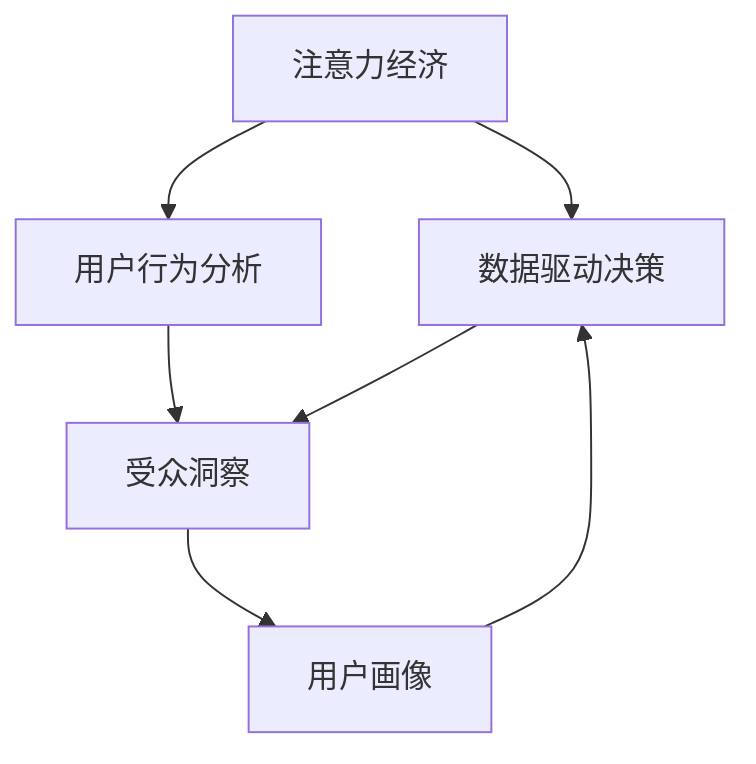

                 

# 注意力经济与数据分析洞见：利用数据理解受众行为

> 关键词：注意力经济, 数据分析, 受众行为, 受众洞察, 用户行为预测

## 1. 背景介绍

### 1.1 问题由来

在数字化时代，数据已成为最重要的经济资源之一。各行各业都面临着如何有效利用数据，洞察受众需求，提升业务效率的挑战。尤其在注意力稀缺、信息爆炸的背景下，如何捕获并利用受众的注意力，成为了数字营销、产品设计、内容创作等领域的核心问题。

所谓“注意力经济”，是指在信息过载的社会中，注意力成为一种稀缺资源。商家、品牌、内容创作者等都希望通过各种方式吸引受众的注意力，从而提高品牌知名度、提升销量、增加用户粘性等。在这一过程中，数据分析和洞见成为关键。

传统的受众洞察主要依赖市场调研、问卷调查、焦点小组等手段，耗时长、成本高，且难以精确反映受众的真实需求和行为。而随着大数据技术的发展，利用机器学习、数据挖掘等方法，可以从海量数据中高效提取有价值的洞见，为决策提供科学依据。

### 1.2 问题核心关键点

本文聚焦于利用数据洞察受众行为的核心问题，旨在回答以下两个关键问题：

1. **如何利用数据更准确地洞察受众行为？**
2. **如何基于洞察制定有效的营销策略和内容策略？**

为此，本文将系统介绍注意力经济中的数据分析方法，详细阐述如何通过数据理解受众需求，并利用洞察制定业务策略，从而提升受众体验和业务效益。

## 2. 核心概念与联系

### 2.1 核心概念概述

为更好地理解注意力经济中的数据分析方法，本节将介绍几个密切相关的核心概念：

- **注意力经济(Attention Economy)**：指在信息过载的社会中，注意力成为一种稀缺资源。商家、品牌、内容创作者等希望通过各种方式吸引受众的注意力，从而提高品牌知名度、提升销量、增加用户粘性等。

- **数据驱动决策(Data-Driven Decision Making)**：指在决策过程中，以数据为基础，通过统计分析、机器学习等方法，提取有价值的洞见，指导决策过程。

- **用户行为分析(User Behavior Analysis)**：指对用户在网络平台上的各种行为数据进行分析，包括浏览、点击、购买、评论等，以理解用户需求和行为模式。

- **受众洞察(Audience Insights)**：通过分析受众行为数据，识别出受众的偏好、需求、痛点等，形成更深入、更全面的受众画像。

- **用户画像(User Persona)**：以受众洞察为基础，构建虚拟的人物角色，用于指导产品设计、内容创作等。

这些核心概念之间的逻辑关系可以通过以下Mermaid流程图来展示：



这个流程图展示了大数据技术在注意力经济中的核心作用：

1. 注意力经济依赖数据驱动决策。
2. 用户行为分析是数据驱动决策的基础。
3. 受众洞察通过分析用户行为数据获得。
4. 用户画像以受众洞察为基础。
5. 数据驱动决策和用户画像指导营销策略和内容策略。

## 3. 核心算法原理 & 具体操作步骤
### 3.1 算法原理概述

基于数据的受众洞察和分析，本质上是一种利用数据挖掘、机器学习等方法，从海量数据中提取有价值的洞见的过程。其核心思想是：通过分析用户在网络平台上的行为数据，发现用户的行为模式、偏好等，从而形成深入的受众洞察，并据此制定有针对性的营销策略和内容策略。

在具体实现中，一般包括以下几个步骤：

1. **数据收集**：收集用户在平台上的各种行为数据，如浏览记录、点击行为、购买记录、评论等。
2. **数据清洗**：对数据进行去重、填充缺失值、处理异常值等预处理，确保数据质量。
3. **特征工程**：从原始数据中提取有用的特征，如用户的浏览时长、购买频率、兴趣标签等。
4. **模型训练**：使用统计分析、机器学习等方法，训练模型以发现数据中的规律和模式。
5. **洞察提取**：基于模型预测结果，提取有价值的洞见，形成受众画像和行为模式。
6. **策略制定**：利用洞察指导业务决策，制定有效的营销和内容策略。

### 3.2 算法步骤详解

接下来，我们将详细介绍注意力经济中数据驱动决策的核心步骤。

**Step 1: 数据收集**
- 收集用户在网络平台上的行为数据，如浏览记录、点击行为、购买记录、评论等。
- 选择合适的数据源，如网站、移动应用、社交媒体等。

**Step 2: 数据清洗**
- 对数据进行去重、填充缺失值、处理异常值等预处理，确保数据质量。
- 去除冗余和无关数据，减少噪声对分析结果的影响。

**Step 3: 特征工程**
- 从原始数据中提取有用的特征，如用户的浏览时长、购买频率、兴趣标签等。
- 使用One-Hot编码、缺失值处理、特征归一化等方法，对数据进行标准化。

**Step 4: 模型训练**
- 选择合适的机器学习模型，如线性回归、决策树、随机森林、神经网络等。
- 使用训练集数据对模型进行训练，调整超参数以优化模型性能。
- 在验证集上评估模型性能，选择最优模型。

**Step 5: 洞察提取**
- 使用训练好的模型对测试集数据进行预测，提取有价值的洞见。
- 形成受众画像和行为模式，如用户兴趣、购买倾向、用户生命周期等。

**Step 6: 策略制定**
- 基于洞察制定有针对性的营销策略和内容策略，如个性化的推荐、定向广告、内容创作等。
- 实时监控策略效果，根据反馈不断调整优化。

### 3.3 算法优缺点

基于数据的受众洞察和分析方法具有以下优点：

- **高效准确**：利用机器学习和数据挖掘技术，可以高效地从大量数据中提取洞见，指导决策过程。
- **实时动态**：通过持续的数据收集和分析，可以实时跟踪用户行为变化，快速调整策略。
- **精细定制**：基于深入的受众洞察，可以制定更加精细、个性化的营销和内容策略，提升用户体验和业务效益。

同时，该方法也存在一些局限性：

- **数据依赖性**：数据分析效果依赖于数据的质量和数量，数据的偏差和噪声可能导致错误的洞见。
- **模型复杂性**：不同的分析任务可能需要不同的模型和算法，模型复杂性较高。
- **隐私风险**：在收集和处理用户数据时，需要严格遵守数据隐私保护法规，防止数据滥用。
- **解释性不足**：复杂模型如深度学习模型，其决策过程通常缺乏可解释性，难以理解和调试。

尽管存在这些局限性，但就目前而言，基于数据的受众洞察和分析方法仍是大数据时代不可或缺的核心技术。未来相关研究的重点在于如何进一步降低数据依赖，提高模型的可解释性和隐私保护水平。

### 3.4 算法应用领域

基于数据的受众洞察和分析方法，已经在多个领域得到了广泛的应用，包括但不限于：

- **电子商务**：通过分析用户浏览、购买、评论等行为数据，优化商品推荐、提升用户体验。
- **社交媒体**：利用用户点赞、分享、评论等行为数据，制定内容策略、提升用户粘性。
- **新闻媒体**：基于用户阅读和互动数据，优化新闻推荐、提升点击率和留存率。
- **旅游行业**：分析用户预订、评论数据，优化旅游推荐、提升用户满意度。
- **金融行业**：利用用户交易、理财行为数据，定制金融产品、提升用户忠诚度。

## 4. 数学模型和公式 & 详细讲解
### 4.1 数学模型构建

本节将使用数学语言对基于数据的受众洞察和分析方法进行更加严格的刻画。

设用户行为数据为 $\mathcal{D} = \{(x_i, y_i)\}_{i=1}^N$，其中 $x_i$ 表示用户行为特征，$y_i$ 表示用户行为标签。假设 $x$ 为 $d$ 维向量，$y$ 为二分类标签。

定义用户行为数据的经验风险为：

$$
\mathcal{L}(h) = \frac{1}{N} \sum_{i=1}^N \ell(h(x_i), y_i)
$$

其中 $\ell$ 为损失函数，如交叉熵损失。

基于数据的受众洞察和分析的核心在于，通过训练模型 $h$，最小化经验风险，从而得到最优的受众洞见。

### 4.2 公式推导过程

以下我们以二分类任务为例，推导逻辑回归模型的预测公式。

假设模型 $h$ 在输入 $x$ 上的预测概率为 $p = h(x) = \sigma(W^T x + b)$，其中 $W$ 为权重矩阵，$b$ 为偏置项，$\sigma$ 为sigmoid函数。

则二分类交叉熵损失函数定义为：

$$
\ell(h(x), y) = -[y\log p + (1-y)\log (1-p)]
$$

将其代入经验风险公式，得：

$$
\mathcal{L}(h) = -\frac{1}{N}\sum_{i=1}^N [y_i\log h(x_i)+(1-y_i)\log(1-h(x_i))]
$$

利用梯度下降算法，模型参数的更新公式为：

$$
W \leftarrow W - \eta \nabla_{W}\mathcal{L}(h)
$$

其中 $\nabla_{W}\mathcal{L}(h)$ 为损失函数对权重矩阵 $W$ 的梯度，可通过链式法则和反向传播算法计算。

在得到损失函数的梯度后，即可带入模型参数更新公式，完成模型的迭代优化。重复上述过程直至收敛，最终得到适应数据集 $\mathcal{D}$ 的最优模型 $h$。

### 4.3 案例分析与讲解

假设我们收集了一组用户浏览网页的行为数据，其中每个样本包含浏览时间、页面访问次数等特征。我们的目标是预测用户是否会购买该网页推荐的产品。

首先，将数据集 $\mathcal{D}$ 划分为训练集、验证集和测试集。然后，选择逻辑回归模型作为分析工具，对训练集进行训练，最小化经验风险。

在训练过程中，选择合适的超参数，如学习率 $\eta$、正则化参数 $\lambda$ 等，并在验证集上评估模型性能，避免过拟合。

训练完成后，使用测试集评估模型的预测效果，提取有价值的洞见。例如，可以发现用户在浏览时长、页面访问次数等方面的行为模式，从而制定针对性的营销策略。

## 5. 项目实践：代码实例和详细解释说明
### 5.1 开发环境搭建

在进行项目实践前，我们需要准备好开发环境。以下是使用Python进行Scikit-Learn开发的环境配置流程：

1. 安装Anaconda：从官网下载并安装Anaconda，用于创建独立的Python环境。

2. 创建并激活虚拟环境：
```bash
conda create -n data-analytics python=3.8 
conda activate data-analytics
```

3. 安装Scikit-Learn：
```bash
conda install scikit-learn
```

4. 安装必要的工具包：
```bash
pip install numpy pandas matplotlib seaborn scikit-learn
```

5. 安装Jupyter Notebook：
```bash
pip install jupyterlab
```

完成上述步骤后，即可在`data-analytics`环境中开始项目实践。

### 5.2 源代码详细实现

下面我们以用户行为数据分析为例，给出使用Scikit-Learn进行数据驱动决策的PyTorch代码实现。

首先，定义数据处理函数：

```python
import pandas as pd
import numpy as np

def load_data(file_path):
    data = pd.read_csv(file_path)
    # 处理缺失值和异常值
    data = data.dropna()
    data = data.drop_duplicates()
    # 将类别型特征转换为数值型
    data['label'] = data['label'].map({'buy': 1, 'not_buy': 0})
    return data
```

然后，定义模型训练函数：

```python
from sklearn.linear_model import LogisticRegression
from sklearn.model_selection import train_test_split

def train_model(X, y, test_size=0.2, random_state=42):
    X_train, X_test, y_train, y_test = train_test_split(X, y, test_size=test_size, random_state=random_state)
    model = LogisticRegression(C=1.0, solver='lbfgs')
    model.fit(X_train, y_train)
    return model, X_test, y_test
```

接着，定义模型评估函数：

```python
def evaluate_model(model, X_test, y_test):
    y_pred = model.predict(X_test)
    print('Accuracy:', np.mean(y_pred == y_test))
```

最后，启动训练流程并在测试集上评估：

```python
data = load_data('user_behavior_data.csv')
model, X_test, y_test = train_model(data.drop(['id'], axis=1), data['label'], test_size=0.2)

evaluate_model(model, X_test, y_test)
```

以上就是使用Scikit-Learn进行用户行为数据分析的完整代码实现。可以看到，利用Scikit-Learn可以很方便地构建逻辑回归模型，并通过交叉验证等方法评估模型性能。

### 5.3 代码解读与分析

让我们再详细解读一下关键代码的实现细节：

**load_data函数**：
- 从CSV文件中加载数据，并进行缺失值处理和异常值过滤。
- 将类别型特征转换为数值型，便于模型训练。

**train_model函数**：
- 使用train_test_split方法将数据集划分为训练集和测试集。
- 选择逻辑回归模型作为分析工具，并使用交叉验证等方法调整超参数。
- 返回训练好的模型和测试集。

**evaluate_model函数**：
- 使用训练好的模型对测试集进行预测。
- 评估模型预测结果的准确度，并输出结果。

**主程序**：
- 加载数据，训练模型，并在测试集上评估模型性能。

可以看到，Scikit-Learn提供的简单易用的API，使得数据驱动决策的实现变得非常简单。开发者只需关注数据处理、模型选择和评估等关键步骤，其他细节由Scikit-Learn自动处理。

当然，工业级的系统实现还需考虑更多因素，如模型的保存和部署、超参数的自动搜索、更灵活的任务适配层等。但核心的数据驱动决策流程基本与此类似。

## 6. 实际应用场景
### 6.1 电商平台个性化推荐

电商平台通过用户行为数据分析，可以提供个性化的商品推荐，提升用户体验和销量。具体而言，可以收集用户浏览、点击、购买等行为数据，分析用户的兴趣和购买倾向，从而推荐最合适的商品。

在技术实现上，可以使用逻辑回归、协同过滤、深度学习等方法，对用户行为数据进行建模，预测用户对不同商品的兴趣，生成个性化推荐列表。

### 6.2 社交媒体内容分发

社交媒体平台利用用户行为数据，可以优化内容分发策略，提升用户粘性和平台活跃度。例如，可以分析用户点赞、评论、分享等行为，识别出热门话题和用户偏好，从而推荐相关内容。

在技术实现上，可以使用协同过滤、标签传播等方法，对用户行为数据进行建模，预测用户对不同内容的兴趣，生成个性化内容推荐列表。

### 6.3 新闻媒体内容推荐

新闻媒体通过用户行为数据分析，可以优化内容推荐策略，提升用户点击率和留存率。例如，可以分析用户阅读和互动数据，识别出用户感兴趣的新闻主题和作者，从而推荐相关新闻。

在技术实现上，可以使用协同过滤、矩阵分解等方法，对用户行为数据进行建模，预测用户对不同新闻的兴趣，生成个性化内容推荐列表。

### 6.4 未来应用展望

随着数据分析技术的不断发展，基于数据的受众洞察和分析方法将进一步拓展其应用范围，为各行各业带来变革性影响。

在智慧医疗领域，基于数据分析的健康管理、疾病预测等应用将提升医疗服务的智能化水平，辅助医生诊疗，加速新药开发进程。

在智能教育领域，数据分析可应用于作业批改、学情分析、知识推荐等方面，因材施教，促进教育公平，提高教学质量。

在智慧城市治理中，数据分析可应用于城市事件监测、舆情分析、应急指挥等环节，提高城市管理的自动化和智能化水平，构建更安全、高效的未来城市。

此外，在企业生产、社会治理、文娱传媒等众多领域，基于数据的受众洞察和分析技术也将不断涌现，为经济社会发展注入新的动力。相信随着技术的日益成熟，数据驱动决策必将在更广阔的应用领域大放异彩。

## 7. 工具和资源推荐
### 7.1 学习资源推荐

为了帮助开发者系统掌握基于数据的受众洞察和分析理论基础和实践技巧，这里推荐一些优质的学习资源：

1. 《机器学习实战》书籍：介绍机器学习的基本概念和常用算法，适合初学者学习。
2. 《Python数据科学手册》书籍：介绍Python在数据科学中的应用，涵盖数据处理、可视化、机器学习等内容。
3. Coursera《机器学习》课程：由斯坦福大学开设的机器学习课程，内容深入浅出，讲解细致。
4. Kaggle数据科学竞赛平台：提供大量真实数据集和竞赛任务，帮助开发者实践数据分析和机器学习技能。
5. Weights & Biases：模型训练的实验跟踪工具，可以记录和可视化模型训练过程中的各项指标，方便对比和调优。

通过对这些资源的学习实践，相信你一定能够快速掌握基于数据的受众洞察和分析的精髓，并用于解决实际的业务问题。
###  7.2 开发工具推荐

高效的开发离不开优秀的工具支持。以下是几款用于数据分析和洞察生成的常用工具：

1. Python：通用编程语言，拥有丰富的数据科学库和分析工具。
2. R语言：专注于统计分析和数据可视化，适合数据分析和机器学习任务。
3. Excel：简单易用的电子表格工具，适合进行简单的数据处理和分析。
4. Tableau：数据可视化工具，支持复杂的数据处理和分析，适合生成直观的洞见。
5. Power BI：微软推出的商业智能工具，支持数据可视化、报表生成、仪表盘等。

合理利用这些工具，可以显著提升数据驱动决策的开发效率，加快创新迭代的步伐。

### 7.3 相关论文推荐

数据分析和洞见技术的发展源于学界的持续研究。以下是几篇奠基性的相关论文，推荐阅读：

1. Google News Recommendation System: Learning to Recommend Articles: Clicks and Read Durations: Google News推荐系统：学习推荐文章点击量和阅读时长
2. Recommendation Systems with Explicit Feedback: A Unified Approach: 带有显式反馈的推荐系统：一种统一的方法
3. Mining of Massive Datasets for Online Communities: Patterns, Trends, and Communities: 挖掘大规模在线社区数据集：模式、趋势和社区
4. Collaborative Filtering for Implicit Feedback Datasets: Algorithmic Challenges and Recent Progress: 基于隐式反馈数据集的协同过滤算法：挑战和近期进展
5. The Human-Autonomy Spectrum: A Survey of Human-Autonomy Interfaces: 人机共生谱系：人机共生界面的综述

这些论文代表了大数据分析技术的发展脉络。通过学习这些前沿成果，可以帮助研究者把握学科前进方向，激发更多的创新灵感。

## 8. 总结：未来发展趋势与挑战

### 8.1 总结

本文对基于数据的受众洞察和分析方法进行了全面系统的介绍。首先阐述了注意力经济中的数据分析方法的研究背景和意义，明确了数据分析在提升业务效率、优化用户体验等方面的核心价值。其次，从原理到实践，详细讲解了数据分析的核心步骤，给出了数据分析任务开发的完整代码实例。同时，本文还广泛探讨了数据分析方法在电子商务、社交媒体、新闻媒体等众多行业领域的应用前景，展示了数据分析技术的广阔前景。

通过本文的系统梳理，可以看到，基于数据的受众洞察和分析方法正在成为大数据时代不可或缺的核心技术，极大地拓展了数据分析应用边界，催生了更多的落地场景。未来，伴随数据分析技术的不断进步，数据驱动决策必将在更广泛的领域得到应用，为各行各业带来变革性影响。

### 8.2 未来发展趋势

展望未来，基于数据的受众洞察和分析技术将呈现以下几个发展趋势：

1. **技术自动化**：数据分析流程将更加自动化和智能化，利用机器学习自动选择模型和调整参数，减少人工干预。
2. **实时分析**：利用流计算、大数据技术，实现对数据流实时分析和洞察生成，支持实时决策和动态调整。
3. **跨领域融合**：数据分析技术将与其他技术如物联网、区块链、人工智能等进行更深层次的融合，提升整体应用效果。
4. **隐私保护**：随着数据隐私保护法规的严格执行，数据分析技术将更加注重隐私保护和数据安全。
5. **跨语言分析**：随着全球化趋势的加深，数据分析技术将更多地应用于多语言数据集，实现跨语言分析和洞察。

以上趋势凸显了基于数据的受众洞察和分析技术的广阔前景。这些方向的探索发展，必将进一步提升数据分析的精度和效率，为各行各业带来更深远的影响。

### 8.3 面临的挑战

尽管基于数据的受众洞察和分析技术已经取得了瞩目成就，但在迈向更加智能化、普适化应用的过程中，它仍面临着诸多挑战：

1. **数据质量瓶颈**：数据分析效果依赖于数据的质量，数据的偏差和噪声可能导致错误的洞见。
2. **模型复杂性**：不同的分析任务可能需要不同的模型和算法，模型复杂性较高。
3. **隐私风险**：在收集和处理用户数据时，需要严格遵守数据隐私保护法规，防止数据滥用。
4. **解释性不足**：复杂模型如深度学习模型，其决策过程通常缺乏可解释性，难以理解和调试。

尽管存在这些挑战，但就目前而言，基于数据的受众洞察和分析方法仍是大数据时代不可或缺的核心技术。未来相关研究的重点在于如何进一步降低数据依赖，提高模型的可解释性和隐私保护水平。

### 8.4 研究展望

面对基于数据的受众洞察和分析技术所面临的种种挑战，未来的研究需要在以下几个方面寻求新的突破：

1. **数据增强技术**：通过数据增强方法，如数据生成、数据合成等，提高数据质量，减少噪声。
2. **模型解释性**：开发可解释性强的模型，如LIME、SHAP等，增强模型决策的可理解性和可解释性。
3. **隐私保护机制**：设计隐私保护机制，如差分隐私、联邦学习等，确保数据隐私和安全。
4. **跨语言分析**：开发跨语言数据分析模型，实现多语言数据的深度分析和洞察。

这些研究方向的探索，必将引领基于数据的受众洞察和分析技术迈向更高的台阶，为构建智能、安全的分析系统铺平道路。面向未来，基于数据的受众洞察和分析技术还需要与其他人工智能技术进行更深入的融合，如知识表示、因果推理、强化学习等，多路径协同发力，共同推动自然语言理解和智能交互系统的进步。只有勇于创新、敢于突破，才能不断拓展数据分析的边界，让数据驱动决策更好地服务于各行各业。

## 9. 附录：常见问题与解答

**Q1：数据分析和洞见技术是否适用于所有行业？**

A: 数据分析和洞见技术在大多数行业领域都有广泛的应用，尤其在互联网、零售、金融等行业表现更加明显。但对于一些特定的行业，如农业、能源、教育等，数据分析技术的应用需要根据行业特点进行定制化设计。

**Q2：如何进行高效的数据预处理？**

A: 高效的数据预处理是数据分析的基础。主要包括以下几个步骤：
1. 数据清洗：去除重复数据、处理缺失值、异常值等。
2. 特征工程：提取有用的特征，如统计特征、文本特征等。
3. 数据标准化：对数据进行归一化、标准化等处理，确保数据质量。
4. 数据增强：通过数据生成、数据合成等方法，提高数据质量。

**Q3：如何选择合适的机器学习模型？**

A: 选择合适的机器学习模型需要考虑以下几个方面：
1. 任务类型：不同的任务可能需要不同的模型，如分类、回归、聚类等。
2. 数据量：数据量越大，越适合使用深度学习模型。
3. 模型复杂度：复杂度高的模型需要更多的计算资源和时间，但效果可能更好。
4. 模型可解释性：复杂模型如深度学习模型，其决策过程通常缺乏可解释性，需要根据实际需求进行选择。

**Q4：如何评估模型的效果？**

A: 评估模型的效果需要考虑以下几个方面：
1. 准确率、召回率、F1值等指标，适用于分类任务。
2. MSE、RMSE等指标，适用于回归任务。
3. NMI、CC等指标，适用于聚类任务。
4. 通过交叉验证、网格搜索等方法，选择最优模型。

**Q5：如何保护用户数据隐私？**

A: 保护用户数据隐私需要从数据收集、存储、处理等多个环节进行控制：
1. 数据匿名化：对数据进行匿名化处理，防止数据泄露。
2. 差分隐私：在数据分析过程中加入噪声，保护用户隐私。
3. 数据加密：对数据进行加密处理，确保数据安全。
4. 访问控制：严格控制数据的访问权限，防止未经授权的数据使用。

这些措施可以综合应用，确保数据隐私保护。

