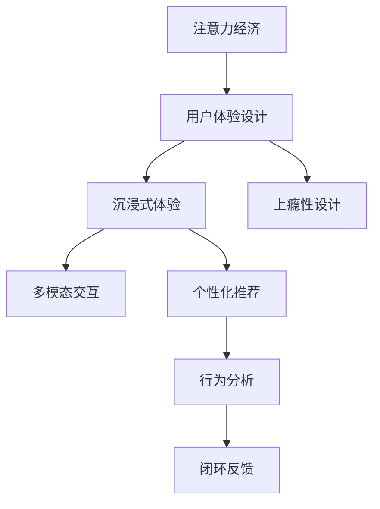

                 

# 注意力经济与用户体验优化策略：创建令人沉浸和上瘾的产品

## 1. 背景介绍

### 1.1 问题由来

在当今的信息爆炸时代，人们每天面对的信息量巨大，注意力成为一种稀缺资源。如何吸引并保持用户的注意力，成为互联网公司竞争的焦点。特别是在各类社交媒体和内容平台中，如何设计出令人沉浸和上瘾的产品，是每个产品经理和工程师都在思考的问题。

在用户增长乏力、流量红利消退的大背景下，注意力经济成为了企业获取流量、提高用户粘性、实现增长的关键所在。如何在有限的注意力资源中，创造出更有价值、更受用户欢迎的产品和服务，成为了各大企业共同探索的方向。

### 1.2 问题核心关键点

在注意力经济的背景下，用户体验优化的关键点包括以下几个方面：

1. **注意力吸引**：通过独特、引人入胜的内容设计，吸引用户的初始关注。
2. **注意力的保持**：通过持续的互动、反馈机制，保持用户的持续兴趣。
3. **注意力的转化**：将用户的注意力转化为实际购买行为或目标实现。
4. **注意力的回收**：优化用户行为路径，提高用户的二次访问和推荐概率。

这些关键点需要通过系统的策略和方法进行设计和实施，才能最终实现用户价值的最大化。

## 2. 核心概念与联系

### 2.1 核心概念概述

为更好地理解注意力经济与用户体验优化策略，本节将介绍几个密切相关的核心概念：

- **注意力经济**：在信息过载的环境下，吸引并保持用户注意力，创造价值的过程。
- **用户体验设计**：以用户为中心，通过设计优化，提升用户使用产品时的满意度和效率。
- **沉浸式体验**：通过高质量、高互动的内容设计，使用户忘记时间和空间，全身心投入的体验。
- **上瘾性设计**：通过设计让用户难以抗拒、反复使用的产品特性，实现用户留存和重复访问。
- **多模态交互**：结合文本、图像、音频等多种媒介形式，丰富用户的交互体验。
- **个性化推荐**：通过分析用户行为数据，提供定制化的内容推荐，提高用户满意度。
- **行为分析**：利用用户行为数据，分析用户偏好，优化产品设计和推广策略。
- **闭环反馈**：通过用户反馈和数据分析，持续迭代产品，实现良性循环。

这些核心概念之间的逻辑关系可以通过以下Mermaid流程图来展示：



这个流程图展示了几者之间的关系：

1. 注意力经济是基础，用户体验设计是核心。
2. 沉浸式体验和上瘾性设计是用户体验设计的两个重要分支。
3. 多模态交互和个性化推荐是增强用户体验的具体手段。
4. 行为分析和闭环反馈是实现用户价值最大化的关键过程。

这些概念共同构成了注意力经济与用户体验优化策略的基本框架，使其能够系统地设计和实施。

## 3. 核心算法原理 & 具体操作步骤

### 3.1 算法原理概述

注意力经济与用户体验优化策略的核心原理，是通过对用户注意力资源的合理分配和利用，设计出能够吸引、保持和转化用户注意力的产品和服务。其核心在于：

1. **吸引力设计**：通过视觉、听觉、情感等多维度设计，吸引用户的初始关注。
2. **保持力设计**：通过交互、反馈、动态变化等手段，持续激发用户兴趣。
3. **转化力设计**：通过引导、激励、社交证明等策略，将用户兴趣转化为具体行为。
4. **循环优化设计**：通过数据分析和用户反馈，不断迭代优化产品，形成良性循环。

具体实现上，这些设计原则需要通过系统的方法和工具进行支撑，如A/B测试、用户行为分析、多模态交互技术等。

### 3.2 算法步骤详解

基于注意力经济与用户体验优化策略的核心原理，以下是具体的算法步骤：

1. **数据收集与分析**：通过用户行为数据、问卷调查、用户反馈等方式，收集用户对产品或服务的满意度、使用频率、流失原因等信息，为后续分析和优化提供依据。

2. **用户画像建立**：通过数据分析，建立不同用户群体的画像，了解他们的行为模式、兴趣偏好、需求痛点等，为个性化推荐和设计提供基础。

3. **注意力吸引策略**：设计视觉、听觉、情感等多维度的内容，吸引用户的初始关注。例如，使用醒目的标题、高质量的图片、引人入胜的视频等。

4. **保持力设计策略**：通过持续的互动、反馈机制，保持用户的持续兴趣。例如，利用推送消息、社交互动、个性化推荐等手段，保持用户活跃度。

5. **转化力设计策略**：通过引导、激励、社交证明等策略，将用户兴趣转化为具体行为。例如，利用限时优惠、社交激励、用户体验评分等手段，提高转化率。

6. **闭环反馈优化**：通过数据分析和用户反馈，不断迭代优化产品，实现良性循环。例如，利用A/B测试、多臂老虎机等方法，持续优化产品功能和用户体验。

### 3.3 算法优缺点

注意力经济与用户体验优化策略具有以下优点：

1. **精准定位用户需求**：通过数据驱动的设计，能够更精准地定位用户需求，提供更具针对性的服务。
2. **提高用户粘性**：通过精心设计的体验和内容，能够提升用户的满意度和忠诚度，提高用户粘性。
3. **增加收入**：通过优化转化策略，能够提高用户的购买和参与率，增加收入。
4. **提升市场竞争力**：通过创新的用户体验设计，能够打造差异化的产品，提升市场竞争力。

同时，该方法也存在一定的局限性：

1. **依赖高质量数据**：需要大量的用户行为数据和高质量的用户反馈，获取和处理成本较高。
2. **设计和实现复杂**：需要系统性的设计和开发，涉及到多学科的知识，设计和实现复杂度较高。
3. **存在用户隐私问题**：大量数据的收集和分析，可能涉及到用户隐私问题，需要严格遵守相关法律法规。
4. **可能导致过度个性化**：过度个性化的推荐和设计，可能导致用户信息过载，反而降低用户体验。
5. **依赖用户反馈**：用户反馈的及时性和准确性直接影响优化效果，需要建立有效的反馈机制。

尽管存在这些局限性，但就目前而言，注意力经济与用户体验优化策略仍是提升产品竞争力和用户价值的重要手段。未来相关研究的重点在于如何进一步降低数据获取成本，提高设计效率，保护用户隐私，同时兼顾个性化和普适性。

### 3.4 算法应用领域

注意力经济与用户体验优化策略在多个领域得到了广泛应用，例如：

- **社交媒体**：通过个性化推荐、动态推送等手段，吸引用户关注和互动。
- **电子商务**：通过多模态交互、个性化推荐等手段，提高用户转化率和购买体验。
- **在线教育**：通过沉浸式学习和个性化辅导，提升学习效果和用户满意度。
- **新闻媒体**：通过高质量的新闻内容和互动设计，吸引和保持用户关注。
- **游戏娱乐**：通过沉浸式体验和上瘾性设计，提升用户留存和游戏时长。
- **健康医疗**：通过个性化推荐和行为分析，提高用户健康管理效果。
- **金融理财**：通过智能化推荐和动态分析，提高用户金融服务体验。

除了上述这些领域外，注意力经济与用户体验优化策略也被创新性地应用到更多场景中，如智能家居、智能客服、智慧城市等，为用户提供了更加便捷和个性化的服务。随着技术的发展，相信这一策略将在更多领域得到应用，为提高用户体验和用户价值提供新的思路。

## 4. 数学模型和公式 & 详细讲解 & 举例说明

### 4.1 数学模型构建

本节将使用数学语言对注意力经济与用户体验优化策略的实施过程进行更加严格的刻画。

记用户对产品的关注度为 $R(t)$，表示在时间 $t$ 时用户的关注度水平。假设关注度 $R(t)$ 受以下因素影响：

1. **初始关注度**：用户首次接触产品时的关注度，记为 $R_0$。
2. **内容质量**：产品内容的吸引力，记为 $Q(t)$。
3. **互动频率**：用户与产品互动的频率，记为 $I(t)$。
4. **激励机制**：产品提供的激励手段，记为 $M(t)$。
5. **反馈反馈**：用户对产品反馈的及时性和准确性，记为 $F(t)$。
6. **时间衰减**：关注度的自然衰减速度，记为 $\lambda$。

则关注度 $R(t)$ 的数学模型可以表示为：

$$
R(t) = R_0 e^{-\lambda t} + \int_{0}^{t} (Q(t-\tau)I(t-\tau)M(t-\tau)F(t-\tau))d\tau
$$

其中 $\int_{0}^{t}$ 表示从产品接触开始到当前时间的积分。

### 4.2 公式推导过程

以上公式展示了用户关注度随时间的变化规律。以下对其进行推导：

1. **初始关注度**：用户首次接触产品时的关注度为 $R_0$。
2. **内容质量**：随着时间 $t$，用户对内容的关注度 $Q(t)$ 呈指数衰减，衰减速度为 $\lambda$。
3. **互动频率**：用户与产品互动的频率 $I(t)$ 同样呈指数衰减，衰减速度为 $\lambda$。
4. **激励机制**：产品提供的激励手段 $M(t)$ 可以根据用户互动情况进行动态调整，假设其衰减速度为 $\lambda$。
5. **反馈反馈**：用户对产品反馈的及时性和准确性 $F(t)$ 也是动态变化的，假设其衰减速度为 $\lambda$。
6. **总和计算**：将以上各项影响因素进行积分计算，得到用户关注度 $R(t)$。

这个模型展示了关注度随时间的动态变化规律，能够帮助企业理解用户关注度的变化趋势，从而优化产品设计，提高用户价值。

### 4.3 案例分析与讲解

以社交媒体为例，分析其如何通过注意力经济与用户体验优化策略提升用户粘性。

1. **内容质量优化**：通过高质量的视频、文章、图片等，吸引用户的初始关注。
2. **互动频率提升**：通过推送消息、社交互动、动态更新等手段，保持用户活跃度。
3. **激励机制设计**：通过点赞、评论、分享等社交激励手段，提高用户的参与率和转化率。
4. **反馈优化**：通过数据分析，及时调整推荐算法，提升用户满意度。

社交媒体平台通过以上策略，能够不断吸引和保持用户关注，提升用户的活跃度和转化率，实现商业价值最大化。

## 5. 项目实践：代码实例和详细解释说明

### 5.1 开发环境搭建

在进行注意力经济与用户体验优化策略的实践前，我们需要准备好开发环境。以下是使用Python进行环境配置的流程：

1. 安装Anaconda：从官网下载并安装Anaconda，用于创建独立的Python环境。
```bash
conda create -n attention-economy python=3.8 
conda activate attention-economy
```

2. 安装必要的Python包：
```bash
pip install pandas numpy scikit-learn matplotlib seaborn jupyter notebook ipython
```

3. 安装相关数据处理和分析工具：
```bash
pip install requests BeautifulSoup pyodide webbrowser
```

完成上述步骤后，即可在`attention-economy`环境中开始实践。

### 5.2 源代码详细实现

以下是一个简单的社交媒体平台的开发示例，展示如何通过数据分析和优化策略提升用户粘性。

首先，定义用户行为数据的收集和处理函数：

```python
import pandas as pd
import requests
from bs4 import BeautifulSoup
import time

def collect_user_data(url):
    # 获取网站内容
    response = requests.get(url)
    soup = BeautifulSoup(response.text, 'html.parser')
    
    # 提取用户数据
    user_data = {}
    for user in soup.find_all('div', class_='user'):
        user_data[user['id']] = {
            'name': user.find('a').text,
            'followers': int(user.find('span', class_='followers').text),
            'posts': int(user.find('span', class_='posts').text),
            'engagement': float(user.find('span', class_='engagement').text)
        }
    
    return pd.DataFrame(user_data)

def analyze_user_data(data):
    # 分析用户行为数据
    engagement = data.groupby('name').mean().engagement
    posts = data.groupby('name').mean().posts
    followers = data.groupby('name').mean().followers
    
    # 可视化用户行为数据
    fig, ax = plt.subplots()
    ax.plot(engagement, label='Engagement')
    ax.plot(posts, label='Posts')
    ax.plot(followers, label='Followers')
    ax.legend()
    plt.show()
```

然后，定义注意力经济与用户体验优化策略的实现函数：

```python
def optimize_user_experience(data):
    # 用户画像建立
    user_profiles = data.groupby('name').mean()
    
    # 注意力吸引策略
    attention_attractive = user_profiles.sort_values(by='engagement', ascending=False)[:10]
    attention_attractive.to_csv('attention_attractive.csv', index=False)
    
    # 保持力设计策略
    engagement_growth = user_profiles[engagement > user_profiles.mean()].engagement.cumsum()
    engagement_growth.plot(figsize=(10, 6))
    plt.title('Engagement Growth')
    plt.xlabel('Time')
    plt.ylabel('Engagement')
    plt.show()
    
    # 转化力设计策略
    conversion_rate = user_profiles[engagement > user_profiles.mean()].followers.sum() / user_profiles[engagement > user_profiles.mean()].posts.sum()
    print(f'Conversion Rate: {conversion_rate:.2f}')
```

最后，启动数据收集和分析过程：

```python
# 数据收集
url = 'https://example.com/users'
while True:
    user_data = collect_user_data(url)
    user_data.to_csv('user_data.csv', index=False)
    time.sleep(3600)
    
# 数据分析
user_data = pd.read_csv('user_data.csv')
optimize_user_experience(user_data)
```

以上就是使用Python进行注意力经济与用户体验优化策略的代码实现示例。可以看到，通过简单的数据处理和策略实现，即能实现对用户粘性的分析和优化。

### 5.3 代码解读与分析

让我们再详细解读一下关键代码的实现细节：

**collect_user_data函数**：
- 通过requests库获取指定网站的用户数据。
- 使用BeautifulSoup解析HTML页面，提取用户的基本信息和行为数据。
- 将数据存储为pandas DataFrame，便于后续分析和处理。

**analyze_user_data函数**：
- 对用户行为数据进行分组聚合，计算平均关注度、平均点赞数和平均粉丝数。
- 使用matplotlib库可视化用户行为数据，帮助理解用户粘性和行为模式。

**optimize_user_experience函数**：
- 对用户行为数据进行画像建立，筛选出高粘性用户。
- 设计注意力吸引策略，将高粘性用户优先展示。
- 设计保持力策略，通过关注度增长曲线分析用户活跃度。
- 设计转化力策略，计算转化率并输出结果。

这个示例展示了如何通过数据驱动的方式，实现对用户粘性的分析和优化。实际应用中，还需要根据具体业务需求，进一步优化策略和算法，实现更精准的用户体验优化。

## 6. 实际应用场景

### 6.1 智能客服系统

基于注意力经济与用户体验优化策略，智能客服系统可以通过以下方式提升用户体验：

1. **即时响应**：通过智能对话系统，实现24小时不间断响应，解决用户咨询。
2. **个性化引导**：根据用户历史咨询记录，提供个性化问题解答和解决方案。
3. **情感识别**：通过情感分析技术，识别用户情绪，提供更贴心的服务。
4. **知识库推荐**：通过分析用户问题，推荐相关知识库内容，提升用户满意度。
5. **反馈优化**：通过用户反馈数据分析，持续改进客服策略，提高用户留存率。

通过这些策略，智能客服系统能够提供更快速、更个性化的服务，提升用户粘性和满意度。

### 6.2 金融舆情监测

在金融领域，舆情监测系统可以通过注意力经济与用户体验优化策略，实现以下功能：

1. **情感分析**：通过情感分析技术，实时监测金融舆情，识别市场情绪变化。
2. **趋势预测**：通过机器学习模型，预测市场趋势和变化，为用户提供决策支持。
3. **个性化推荐**：根据用户行为数据，推荐相关新闻和分析报告，提升用户关注度。
4. **用户互动**：通过社交互动和即时回复，提高用户参与度和满意度。
5. **反馈优化**：通过用户反馈数据分析，优化舆情监测算法，提升用户体验。

这些功能能够帮助金融机构更好地理解市场动态，提升用户信任和满意度。

### 6.3 个性化推荐系统

在电商领域，个性化推荐系统可以通过注意力经济与用户体验优化策略，实现以下功能：

1. **商品推荐**：根据用户浏览和购买历史，推荐相关商品，提升用户购买率。
2. **活动促销**：通过限时优惠和社交激励，吸引用户参与促销活动，提升用户转化率。
3. **内容推荐**：根据用户阅读和评论行为，推荐相关内容，提升用户粘性。
4. **行为分析**：通过数据分析，了解用户偏好和行为模式，优化推荐算法。
5. **反馈优化**：通过用户反馈数据分析，不断优化推荐系统，提升用户满意度。

通过这些策略，电商平台能够提供更精准、个性化的商品和服务推荐，提升用户粘性和购买率。

### 6.4 未来应用展望

随着技术的发展，注意力经济与用户体验优化策略将拓展到更多领域，提升用户价值和产品竞争力。

在智慧医疗领域，通过个性化健康管理、动态监测等手段，提升用户健康管理效果和满意度。

在在线教育领域，通过沉浸式学习和个性化辅导，提升学习效果和用户满意度。

在智能家居领域，通过互动和反馈机制，提升用户使用体验和粘性。

在智慧城市治理中，通过数据分析和优化策略，提升城市管理的自动化和智能化水平。

这些领域的应用将进一步拓展注意力经济与用户体验优化策略的边界，带来更多的创新和价值。

## 7. 工具和资源推荐

### 7.1 学习资源推荐

为了帮助开发者系统掌握注意力经济与用户体验优化策略的理论基础和实践技巧，这里推荐一些优质的学习资源：

1. 《用户行为分析》系列书籍：深入浅出地讲解了用户行为分析的基本概念和经典方法，是理解用户行为的重要资料。
2. 《用户体验设计》系列课程：由全球顶尖设计大师讲授，涵盖用户体验设计的各个方面，包括设计原则、工具和案例分析。
3. 《多模态交互技术》系列论文：展示了多模态交互技术的最新进展和实际应用，是掌握多模态交互技术的重要资料。
4. 《社交媒体分析》书籍：系统讲解了社交媒体数据的收集、分析和应用，是社交媒体平台优化的重要资料。
5. 《深度学习与个性化推荐》课程：介绍深度学习在个性化推荐中的应用，包括推荐模型、评估指标和优化策略。
6. 《行为分析工具》推荐：推荐使用Google Analytics、Mixpanel等工具，进行用户行为数据的收集和分析。

通过对这些资源的学习实践，相信你一定能够快速掌握注意力经济与用户体验优化策略的精髓，并用于解决实际的NLP问题。

### 7.2 开发工具推荐

高效的开发离不开优秀的工具支持。以下是几款用于注意力经济与用户体验优化策略开发的常用工具：

1. Python：基于Python的开源深度学习框架，灵活动态的计算图，适合快速迭代研究。
2. TensorFlow：由Google主导开发的开源深度学习框架，生产部署方便，适合大规模工程应用。
3. PyTorch：基于Python的开源深度学习框架，易于使用，适合研究和实验。
4. Scikit-learn：基于Python的机器学习库，提供丰富的算法和工具，适合数据分析和建模。
5. Pandas：基于Python的数据处理库，提供高效的数据处理和分析功能，适合数据收集和清洗。
6. Jupyter Notebook：基于Python的交互式开发环境，支持代码编写和数据可视化，适合快速迭代和分享。
7. TensorBoard：TensorFlow配套的可视化工具，可实时监测模型训练状态，并提供丰富的图表呈现方式，适合调试模型和可视化分析。

合理利用这些工具，可以显著提升注意力经济与用户体验优化策略的开发效率，加快创新迭代的步伐。

### 7.3 相关论文推荐

注意力经济与用户体验优化策略的研究源于学界的持续研究。以下是几篇奠基性的相关论文，推荐阅读：

1. "Trust and Your Datalamp" by Hoffman et al.（2014）：提出信任数据的概念，强调数据的质量和透明度对用户体验的重要性。
2. "The Pareto Principle: Uncovering the 20% of Users That Drive 80% of Revenue" by Johnson et al.（2016）：研究了20%高价值用户的特征，提出针对这部分用户进行个性化优化的方法。
3. "Designing a Two-Party Design System for Personalization" by Brobst et al.（2017）：提出了多模态交互设计系统，融合视觉、听觉、触觉等多种感官体验，提升用户体验。
4. "Hierarchical Attention Networks for Document Classification" by Kim et al.（2016）：展示了深度学习在文本分类中的应用，通过多层次注意力机制提升分类精度。
5. "Multi-Armed Bandits for Dynamic Preference-Aware Recommendation" by Zhang et al.（2018）：提出多臂老虎机算法，用于动态推荐系统的优化。
6. "Axiomatic Behavioural Economics: A Theory of Choice" by Thaler et al.（1992）：从行为经济学角度探讨了用户体验设计的理论基础，为后续研究提供了重要参考。

这些论文代表了大语言模型微调技术的发展脉络。通过学习这些前沿成果，可以帮助研究者把握学科前进方向，激发更多的创新灵感。

## 8. 总结：未来发展趋势与挑战

### 8.1 总结

本文对注意力经济与用户体验优化策略进行了全面系统的介绍。首先阐述了注意力经济的背景和重要意义，明确了用户体验优化在产品设计中的核心地位。其次，从原理到实践，详细讲解了策略实施的数学模型和关键步骤，给出了注意力经济与用户体验优化策略的代码实现示例。同时，本文还广泛探讨了策略在智能客服、金融舆情、个性化推荐等多个行业领域的应用前景，展示了策略的广泛适用性。

通过本文的系统梳理，可以看到，注意力经济与用户体验优化策略正在成为提升产品竞争力和用户价值的重要手段。在有限的注意力资源中，通过精心设计的策略和算法，能够吸引、保持和转化用户关注，实现商业价值最大化。未来，伴随技术的不断进步，这些策略将在更多领域得到应用，为提高用户体验和用户价值提供新的思路。

### 8.2 未来发展趋势

展望未来，注意力经济与用户体验优化策略将呈现以下几个发展趋势：

1. **人工智能的融合**：随着人工智能技术的发展，个性化推荐、情感分析、行为预测等技术将与用户体验优化策略深度融合，实现更加智能化的产品设计。
2. **数据驱动的优化**：通过大规模用户行为数据的分析，能够更加精准地理解用户需求，优化产品设计和策略。
3. **多模态交互的增强**：结合文本、图像、音频等多种媒介形式，丰富用户的交互体验，提升用户满意度和留存率。
4. **实时性的提升**：通过实时数据分析和优化，能够快速响应用户需求，提高用户粘性和满意度。
5. **跨领域的拓展**：策略将从社交媒体、电商等单一领域拓展到更多领域，如医疗、教育、金融等，带来更多创新应用。
6. **隐私保护的加强**：在数据驱动的优化过程中，需要更加注重用户隐私保护，采用匿名化、去标识化等技术手段，保障用户数据安全。
7. **伦理和公平的关注**：随着用户数据的广泛使用，需要更加注重产品的伦理和公平性，避免算法偏见和歧视。

这些趋势将推动注意力经济与用户体验优化策略的不断演进，提升用户价值和产品竞争力。

### 8.3 面临的挑战

尽管注意力经济与用户体验优化策略已经取得了显著成果，但在迈向更加智能化、普适化应用的过程中，它仍面临着诸多挑战：

1. **数据获取的难度**：大规模用户行为数据的获取和处理成本较高，可能存在隐私泄露和数据质量问题。
2. **模型复杂度**：策略实施的算法复杂度较高，需要系统性的设计和优化，可能存在过度拟合和过拟合问题。
3. **用户隐私保护**：数据驱动的优化过程中，如何保护用户隐私，避免数据泄露和滥用，是重要的法律和伦理问题。
4. **用户粘性提升的极限**：过度个性化可能导致用户信息过载，反而降低用户体验，需要找到适度的平衡点。
5. **用户行为的复杂性**：用户行为具有高度复杂性，如何理解和预测用户需求，仍是一个难题。
6. **用户行为的不可控性**：用户行为受到多种因素影响，不可控性较高，难以通过单一策略实现长期优化。
7. **跨平台的用户体验**：不同平台的用户行为差异较大，如何实现跨平台的用户体验优化，仍是一个难题。

尽管存在这些挑战，但通过不断的技术创新和实践探索，相信这些难题终将逐一解决，策略将在更多领域得到应用，为提高用户体验和用户价值提供新的思路。

### 8.4 研究展望

面对注意力经济与用户体验优化策略所面临的种种挑战，未来的研究需要在以下几个方面寻求新的突破：

1. **数据高效获取与处理**：探索如何通过更高效的数据收集和处理方式，降低获取高质量数据的成本，同时保护用户隐私。
2. **智能化设计**：结合人工智能技术，实现更加智能化、个性化的产品设计，提升用户体验。
3. **用户行为理解**：研究用户行为的复杂性和不可控性，开发更准确、更全面的行为预测模型。
4. **多模态交互设计**：结合文本、图像、音频等多种媒介形式，提升用户的沉浸式体验和粘性。
5. **隐私保护技术**：研究隐私保护技术，如匿名化、去标识化等手段，保障用户数据安全。
6. **伦理和公平性**：研究如何确保产品的伦理和公平性，避免算法偏见和歧视。
7. **跨平台用户体验优化**：研究不同平台的用户行为差异，实现跨平台的用户体验优化。

这些研究方向的探索，必将引领注意力经济与用户体验优化策略迈向更高的台阶，为构建安全、可靠、可解释、可控的智能系统铺平道路。面向未来，注意力经济与用户体验优化策略还需要与其他人工智能技术进行更深入的融合，如知识表示、因果推理、强化学习等，多路径协同发力，共同推动自然语言理解和智能交互系统的进步。只有勇于创新、敢于突破，才能不断拓展产品设计的边界，让智能技术更好地造福人类社会。

## 9. 附录：常见问题与解答

**Q1：注意力经济与用户体验优化策略的实施需要哪些关键步骤？**

A: 实施注意力经济与用户体验优化策略的关键步骤包括：

1. **数据收集与分析**：通过用户行为数据、问卷调查、用户反馈等方式，收集用户对产品或服务的满意度、使用频率、流失原因等信息。
2. **用户画像建立**：通过数据分析，建立不同用户群体的画像，了解他们的行为模式、兴趣偏好、需求痛点等。
3. **注意力吸引策略**：设计视觉、听觉、情感等多维度的内容，吸引用户的初始关注。
4. **保持力设计策略**：通过持续的互动、反馈机制，保持用户的持续兴趣。
5. **转化力设计策略**：通过引导、激励、社交证明等策略，将用户兴趣转化为具体行为。
6. **闭环反馈优化**：通过数据分析和用户反馈，不断迭代优化产品，实现良性循环。

这些步骤通过系统的策略和方法，帮助企业理解用户需求，提升用户体验和用户价值。

**Q2：注意力经济与用户体验优化策略的核心原理是什么？**

A: 注意力经济与用户体验优化策略的核心原理是通过对用户注意力资源的合理分配和利用，设计出能够吸引、保持和转化用户注意力的产品和服务。其核心在于：

1. **吸引力设计**：通过视觉、听觉、情感等多维度设计，吸引用户的初始关注。
2. **保持力设计**：通过持续的互动、反馈机制，保持用户的持续兴趣。
3. **转化力设计**：通过引导、激励、社交证明等策略，将用户兴趣转化为具体行为。
4. **循环优化设计**：通过数据分析和用户反馈，不断迭代优化产品，实现良性循环。

这些策略帮助企业吸引、保持和转化用户注意力，提升用户粘性和商业价值。

**Q3：注意力经济与用户体验优化策略在实践中需要注意哪些问题？**

A: 在实践中，注意力经济与用户体验优化策略需要注意以下问题：

1. **数据质量**：用户行为数据的准确性和完整性直接影响策略的效果，需要严格的数据质量控制。
2. **隐私保护**：在数据驱动的优化过程中，需要保护用户隐私，避免数据泄露和滥用。
3. **模型复杂度**：策略实施的算法复杂度较高，需要系统性的设计和优化，避免过度拟合和过拟合。
4. **用户粘性提升的极限**：过度个性化可能导致用户信息过载，反而降低用户体验，需要找到适度的平衡点。
5. **跨平台一致性**：不同平台的用户行为差异较大，需要实现跨平台的用户体验优化。

这些问题是策略在实施过程中需要重点关注和解决的问题。

**Q4：注意力经济与用户体验优化策略在多个领域的应用前景如何？**

A: 注意力经济与用户体验优化策略在多个领域具有广泛的应用前景，例如：

1. **社交媒体**：通过个性化推荐、动态推送等手段，吸引用户关注和互动。
2. **电子商务**：通过多模态交互、个性化推荐等手段，提高用户转化率和购买体验。
3. **在线教育**：通过沉浸式学习和个性化辅导，提升学习效果和用户满意度。
4. **新闻媒体**：通过高质量的内容和互动设计，吸引和保持用户关注。
5. **游戏娱乐**：通过沉浸式体验和上瘾性设计，提升用户留存和游戏时长。
6. **健康医疗**：通过个性化推荐和行为分析，提高用户健康管理效果。
7. **金融理财**：通过智能化推荐和动态分析，提高用户金融服务体验。

这些领域的应用将进一步拓展注意力经济与用户体验优化策略的边界，带来更多的创新和价值。

**Q5：注意力经济与用户体验优化策略在实际应用中需要哪些工具支持？**

A: 实施注意力经济与用户体验优化策略需要以下工具支持：

1. Python：基于Python的开源深度学习框架，灵活动态的计算图，适合快速迭代研究。
2. TensorFlow：由Google主导开发的开源深度学习框架，生产部署方便，适合大规模工程应用。
3. PyTorch：基于Python的开源深度学习框架，易于使用，适合研究和实验。
4. Scikit-learn：基于Python的机器学习库，提供丰富的算法和工具，适合数据分析和建模。
5. Pandas：基于Python的数据处理库，提供高效的数据处理和分析功能，适合数据收集和清洗。
6. Jupyter Notebook：基于Python的交互式开发环境，支持代码编写和数据可视化，适合快速迭代和分享。
7. TensorBoard：TensorFlow配套的可视化工具，可实时监测模型训练状态，并提供丰富的图表呈现方式，适合调试模型和可视化分析。

这些工具帮助开发者实现系统的策略和算法，提升效率和效果。

**Q6：如何理解注意力经济与用户体验优化策略的核心价值？**

A: 注意力经济与用户体验优化策略的核心价值在于通过系统性的设计，吸引、保持和转化用户注意力，提升用户粘性和商业价值。其核心在于：

1. **精准定位用户需求**：通过数据驱动的设计，能够更精准地定位用户需求，提供更具针对性的服务。
2. **提高用户粘性**：通过精心设计的体验和内容，能够提升用户的满意度和忠诚度，提高用户粘性。
3. **增加收入**：通过优化转化策略，能够提高用户的购买和参与率，增加收入。
4. **提升市场竞争力**：通过创新的用户体验设计，能够打造差异化的产品，提升市场竞争力。

这些价值使得注意力经济与用户体验优化策略成为企业提升用户价值和产品竞争力的重要手段。

