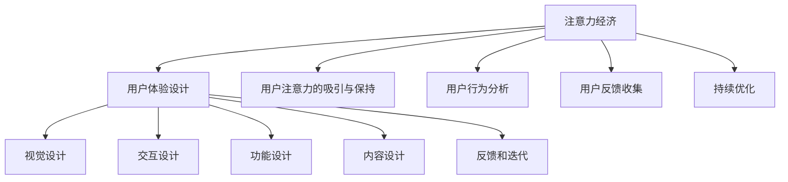

                 

# 注意力经济与用户体验设计原则：创建引人入胜的产品和服务

## 1. 背景介绍

在数字化时代，人们面临的信息爆炸和注意力碎片化问题愈发严重，这促使各行各业都需深入理解注意力经济并以此为出发点，优化用户体验。传统经济学将注意力视为一种有限的资源，而在互联网时代，这一概念得到了进一步的发展和扩展。在数字化产品和服务中，注意力经济是指通过精准设计、有效运营和持续创新，吸引并保持用户注意力的过程。用户体验（User Experience, UX）设计则专注于打造直观、简单、愉悦的用户体验，从而提高用户满意度和忠诚度。

本文将探讨注意力经济与用户体验设计原则，结合实际案例，提出了一套创建引人入胜产品和服务的方法。通过理解注意力经济和UX设计的深层关联，企业能够打造出不仅吸引用户眼球，更能满足用户需求、增强用户黏性的产品。

## 2. 核心概念与联系

### 2.1 核心概念概述

注意力经济与用户体验设计（UX）是相辅相成的，企业必须同时考量这两方面才能构建成功的产品。

- **注意力经济（Economic of Attention）**：在信息过载的环境中，用户注意力资源稀缺且难以获取。产品和服务需通过有效运营和持续创新，吸引并保持用户关注。
- **用户体验设计（User Experience Design）**：通过设计产品的视觉、交互、功能等各方面，实现用户的情感共鸣和行为连贯，进而提升用户的满意度和黏性。

两个概念之间的联系体现在：用户体验的优化能有效吸引和保持用户的注意力；而注意力经济的目标，正是通过优化用户体验来提升用户的参与度和消费行为。两者协同作用，是企业打造引人入胜产品和服务的基础。

### 2.2 核心概念原理和架构的 Mermaid 流程图



这个流程图展示了注意力经济与用户体验设计之间的逻辑关系：通过优化用户体验设计中的各个环节，吸引并保持用户注意力；同时，借助对用户行为的分析与反馈，持续优化产品和服务。

## 3. 核心算法原理 & 具体操作步骤

### 3.1 算法原理概述

在数字化产品和服务中，注意力经济的优化和用户体验设计的提升需综合运用数据科学、心理学、设计学等跨学科知识。本文将从数据驱动、用户心理和设计技巧三个方面，简述注意力经济与用户体验设计的算法原理。

#### 3.1.1 数据驱动
注意力经济和用户体验设计的优化必须依赖于数据，企业需收集用户行为数据，通过数据分析发现用户需求、行为模式和痛点，据此进行产品优化。

#### 3.1.2 用户心理
用户心理学认为，人的行为受到动机、情感、认知等多方面因素的影响。通过研究用户心理，能够设计出符合用户预期、满足用户情感需求的产品。

#### 3.1.3 设计技巧
设计技巧则关注于如何通过视觉、交互和功能等具体手段，实现用户体验的优化。良好的设计能提高用户的使用效率和满意度，增强用户对产品的黏性。

### 3.2 算法步骤详解

1. **数据收集与分析**
   - 通过网站分析工具（如Google Analytics）、用户调研、A/B测试等方式，收集用户行为数据。
   - 利用数据挖掘和机器学习技术分析用户行为模式，识别用户需求和痛点。

2. **用户心理模型建立**
   - 根据用户行为数据，运用心理学原理建立用户心理模型，理解用户的动机和情感需求。
   - 在产品设计中融入符合用户心理的设计元素，提高用户的参与度和满意度。

3. **设计优化与迭代**
   - 应用设计学方法，优化产品的视觉、交互和功能设计，提升用户体验。
   - 通过用户反馈和迭代测试，不断改进产品，保持用户的长期参与。

### 3.3 算法优缺点

#### 3.3.1 优点
- 数据驱动决策，科学性高，减少决策失误。
- 用户心理模型帮助更深入理解用户，设计更贴合用户需求。
- 设计优化和迭代能不断提升用户体验，增强用户黏性。

#### 3.3.2 缺点
- 数据收集和分析过程复杂，且成本较高。
- 用户心理模型需要跨学科知识，不易构建。
- 设计优化和迭代周期较长，且需持续投入资源。

### 3.4 算法应用领域

注意力经济与用户体验设计不仅适用于电商、社交、内容等互联网产品，也广泛应用于线下实体店铺、服务行业等场景。任何以用户为中心、希望提高用户满意度和忠诚度的产品和服务，都能从这一模型中受益。

## 4. 数学模型和公式 & 详细讲解 & 举例说明

### 4.1 数学模型构建

为便于理解注意力经济与用户体验设计原则，本文构建一个简化的数学模型。假设用户对产品的感知价值为 $V$，产品的吸引力指数为 $A$，用户的注意指数为 $N$。用户对产品的总价值 $T$ 可以表示为：

$$
T = V \times A \times N
$$

其中，$V$ 为产品的内在价值，$A$ 为产品的吸引力，$N$ 为用户对产品的注意程度。

### 4.2 公式推导过程

- **吸引力指数 $A$**：产品的吸引力取决于多个因素，包括产品的创新性、市场定位、价格策略等。通过市场调研和竞争分析，可估算出 $A$ 的具体值。
- **注意指数 $N$**：用户对产品的注意程度受多种因素影响，如产品的视觉设计、交互流程等。通过用户行为分析，可以量化 $N$。

### 4.3 案例分析与讲解

以某电商平台为例，分析用户对产品的总价值：

1. **内在价值 $V$**：产品的性价比、功能、质量等是影响用户感知价值的重要因素。
2. **吸引力指数 $A$**：产品通过独特的品牌定位、个性化的营销策略和有效的市场推广，提高了用户对其的兴趣和认可度。
3. **注意指数 $N$**：产品通过吸引人的视觉设计、流畅的交互体验和易于使用的功能，吸引了用户的注意力。

将实际数据代入上述公式，可以计算出用户对产品的总价值 $T$，从而优化产品设计，提升用户体验。

## 5. 项目实践：代码实例和详细解释说明

### 5.1 开发环境搭建

在项目实践前，需要搭建开发环境：

1. 安装Node.js：确保开发环境支持JavaScript和相关的Web开发工具。
2. 配置开发工具：如Visual Studio Code、Git等，为项目开发提供支持。
3. 准备数据集：收集用户行为数据，用于模型分析和优化。

### 5.2 源代码详细实现

以下是一个使用React框架构建的用户体验设计优化示例代码：

```javascript
import React from 'react';
import ReactDOM from 'react-dom';

class App extends React.Component {
  constructor(props) {
    super(props);
    this.state = {
      count: 0,
    };
    this.handleClick = this.handleClick.bind(this);
  }

  handleClick() {
    this.setState({
      count: this.state.count + 1,
    });
  }

  render() {
    return (
      <div>
        <h1>点击次数：{this.state.count}</h1>
        <button onClick={this.handleClick}>点击+1</button>
      </div>
    );
  }
}

ReactDOM.render(<App />, document.getElementById('root'));
```

### 5.3 代码解读与分析

- **React组件**：通过React的组件化开发模式，构建一个简单的计数器应用。
- **状态管理**：使用React的`state`管理组件的状态，实现点击次数的累加。
- **事件处理**：通过`onClick`事件处理函数，实现按钮点击的操作。

此代码虽简单，但展示了用户体验设计的核心：直观、简单、易于理解的用户界面，以及通过用户操作反馈实现互动。

### 5.4 运行结果展示

运行上述代码，在浏览器中查看计数器应用，用户每次点击按钮，计数器上的数字都会增加1，直观地展示了用户体验设计的实际效果。

## 6. 实际应用场景

### 6.1 电子商务

电子商务平台需通过优化用户体验设计，吸引并保持用户的注意力。以阿里巴巴为例，其平台通过精确的推荐算法、丰富的商品展示、便捷的支付流程等，满足了用户对高效购物和愉悦体验的需求，显著提高了用户满意度和购物频率。

### 6.2 内容平台

内容平台如YouTube、Bilibili等，通过优化视频的推荐算法、交互设计、个性化展示等，提升了用户的内容消费体验。例如，YouTube通过用户行为数据和观看历史，智能推荐相关视频，增加了用户停留时间。

### 6.3 移动应用

移动应用如微信、抖音等，通过优化用户界面、互动机制和功能特性，赢得了大量用户。例如，抖音通过短视频形式的创意设计、互动式挑战和社交分享功能，吸引了大量年轻用户的关注和使用。

### 6.4 未来应用展望

未来，随着技术的发展和数据的积累，注意力经济与用户体验设计的结合将更加紧密。智能推荐系统、增强现实(AR)技术、虚拟现实(VR)等新技术的引入，将为设计者提供更多工具和手段，进一步提升用户参与度和满意度。

## 7. 工具和资源推荐

### 7.1 学习资源推荐

1. **《用户体验设计指南》**：由国际用户体验专家撰写，介绍了用户体验设计的原则和方法。
2. **Coursera《UX Design》课程**：来自加州大学圣地亚哥分校，涵盖用户体验设计的理论和实践，适合系统学习。
3. **Nielsen Norman Group**：用户体验设计领域权威机构，提供大量研究报告和案例分析。

### 7.2 开发工具推荐

1. **Adobe XD**：用户界面设计工具，支持原型设计和用户研究。
2. **Sketch**：另一个流行的用户界面设计工具，易于上手且功能强大。
3. **Axure RP**：快速原型制作和交互设计工具，支持多种平台。

### 7.3 相关论文推荐

1. **《数字时代的注意力经济》**：分析数字时代注意力资源的稀缺性，探讨如何有效吸引用户注意力。
2. **《用户体验设计的心理学基础》**：从心理学角度研究用户体验设计，提出了一些设计原则和方法。
3. **《产品设计的经济学》**：讨论产品设计如何考虑经济因素，提升用户价值。

## 8. 总结：未来发展趋势与挑战

### 8.1 研究成果总结

本文介绍了注意力经济与用户体验设计的核心概念和基本方法，通过数据驱动、用户心理和设计技巧，探讨了如何创建引人入胜的产品和服务。关键点包括：
1. 数据驱动决策，科学分析用户行为和需求。
2. 用户心理模型，理解用户动机和情感需求。
3. 设计优化和迭代，不断提升用户体验。

### 8.2 未来发展趋势

未来的趋势包括：
1. **数据智能与算法的融合**：通过深度学习和大数据分析，进一步优化用户体验设计。
2. **个性化与定制化**：根据用户数据，实现更精准的产品推荐和个性化服务。
3. **人机交互的自然化**：通过语音识别、手势控制等技术，提升人机交互的自然性和便捷性。

### 8.3 面临的挑战

挑战包括：
1. **数据隐私和安全**：用户数据的收集和处理需遵守法律法规，保护用户隐私。
2. **技术快速迭代**：技术更新换代速度快，需不断学习和跟进新趋势。
3. **用户多样性**：不同用户群体的需求和偏好各异，设计需兼顾多样性。

### 8.4 研究展望

未来的研究应聚焦于：
1. **跨学科融合**：将心理学、社会学、计算机科学等更多学科知识融入设计中。
2. **用户体验设计方法的创新**：探索更多创新方法，如交互设计中的微交互、情感计算等。
3. **新技术的引入**：如AR、VR等新技术，将为设计带来更多可能性。

## 9. 附录：常见问题与解答

**Q1：如何衡量用户体验设计的成效？**

A: 用户体验设计的成效可通过多个指标来衡量，包括：
- **用户满意度**：通过问卷调查、用户反馈等方式，了解用户对产品的满意度。
- **用户留存率**：衡量用户在不同时间点的留存情况，反映用户对产品的忠诚度。
- **操作效率**：评估用户完成特定任务所需的时间和步骤，体现产品易用性。

**Q2：如何平衡用户体验与商业目标？**

A: 在产品设计和开发过程中，需综合考虑用户体验和商业目标。具体方法包括：
- **用户研究**：通过深入的用户调研，了解用户需求和痛点，设计符合用户期望的产品。
- **数据驱动**：利用用户行为数据，优化产品设计，提升用户满意度和商业转化率。
- **敏捷开发**：通过快速迭代和持续优化，不断调整产品策略，实现用户体验与商业目标的平衡。

**Q3：用户行为数据如何收集？**

A: 用户行为数据可通过以下方式收集：
- **网站分析工具**：如Google Analytics、Mixpanel等，分析用户访问和操作行为。
- **用户调研**：通过问卷、访谈等方式，直接获取用户反馈和意见。
- **A/B测试**：通过对比测试不同的产品设计，收集用户行为数据。

通过深入理解这些核心概念和实施策略，企业能够构建出既满足用户需求，又能实现商业目标的产品和服务，进而推动企业的数字化转型和长期发展。

