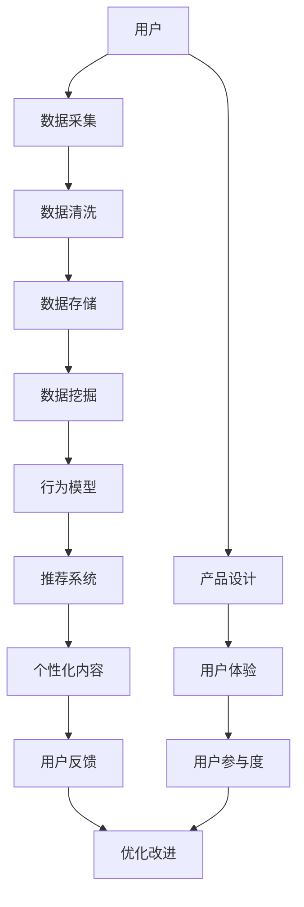

                 

# 注意力经济与用户行为分析：了解受众行为以增强参与度

在数字化时代，注意力成为了一种稀缺资源，掌握和分析用户注意力成为了提升参与度、创造商业价值的关键。本文将探讨注意力经济的核心概念，分析用户行为的基本特征，并结合最新的技术手段，提供一套详细的用户行为分析框架，帮助开发者理解和提升用户参与度。

## 1. 背景介绍

### 1.1 问题由来
随着互联网的迅猛发展和数字媒体的广泛应用，人们每天被海量的信息所包围。如何在海量信息中吸引并保持用户注意力，成为各大平台和应用所面临的共同挑战。特别是对于社交媒体、内容平台、在线教育等领域，用户注意力显得尤为珍贵。

### 1.2 问题核心关键点
用户注意力分析的根本目标是了解用户的兴趣、需求和行为模式，据此制定内容策略、优化产品设计、提升用户体验，从而增强用户参与度和忠诚度。

### 1.3 问题研究意义
掌握用户注意力行为，不仅可以提升产品服务质量，还能增加用户粘性，推动产品向商业价值转化。注意力分析技术在市场营销、广告投放、内容推送、个性化推荐等领域都有广泛的应用，是构建智能化应用系统的关键。

## 2. 核心概念与联系

### 2.1 核心概念概述
- **注意力经济（Attention Economy）**：在信息爆炸时代，注意力作为一种稀缺资源，需要通过优化内容、优化体验等方式吸引并保持用户注意力，从而创造经济价值。
- **用户行为分析（User Behavior Analysis）**：通过收集、分析和解释用户在使用产品或服务过程中的行为数据，了解用户需求和行为模式，为优化产品设计、提升用户体验提供依据。
- **参与度（Engagement）**：指用户与产品或服务互动的深度和频率，衡量用户活跃度、忠诚度、满意度等指标，是衡量注意力经济成效的重要指标。

### 2.2 核心概念原理和架构的 Mermaid 流程图



这个流程图展示了用户行为分析的全流程：
- **数据采集**：通过多种渠道收集用户行为数据。
- **数据清洗**：处理噪音数据，保证数据质量。
- **数据存储**：将清洗后的数据存储在数据库中。
- **数据挖掘**：从数据中提取有用的信息，如用户兴趣、行为模式等。
- **行为模型**：构建用户行为模型，预测用户行为，为个性化推荐提供依据。
- **推荐系统**：根据用户行为模型，推荐个性化的内容，增强用户参与度。
- **个性化内容**：根据用户反馈，不断优化推荐算法，提升推荐效果。
- **优化改进**：通过用户反馈和数据分析，不断优化产品设计，提升用户体验。

## 3. 核心算法原理 & 具体操作步骤

### 3.1 算法原理概述
用户行为分析的核心算法包括数据采集、数据清洗、数据挖掘、行为建模和个性化推荐等。其中，行为建模和个性化推荐是提升用户参与度的关键步骤。

### 3.2 算法步骤详解

#### 3.2.1 数据采集
- **日志分析**：通过记录用户访问日志、点击日志、交易日志等，收集用户行为数据。
- **网络爬虫**：使用网络爬虫爬取公开可用的数据源，如社交媒体、新闻网站、论坛等。
- **问卷调查**：设计问卷，收集用户主观反馈和行为偏好。

#### 3.2.2 数据清洗
- **去重**：去除重复数据，保证数据的一致性和准确性。
- **缺失值处理**：处理数据中的缺失值，如均值填充、插值等。
- **异常值检测**：检测和处理异常值，保证数据的质量和可信度。

#### 3.2.3 数据挖掘
- **用户分群**：通过聚类算法将用户分成不同的群体，以便进行更精准的行为分析。
- **关联规则挖掘**：使用关联规则算法，如Apriori算法，挖掘用户行为中的潜在关联，如购买习惯、浏览偏好等。
- **序列模式挖掘**：通过序列模式算法，如FP-Growth算法，发现用户行为序列中的模式，如用户访问路径、行为轨迹等。

#### 3.2.4 行为建模
- **用户兴趣建模**：通过协同过滤、内容推荐等算法，构建用户兴趣模型，预测用户可能感兴趣的内容。
- **行为序列建模**：使用隐马尔可夫模型（HMM）、循环神经网络（RNN）等算法，建模用户行为序列，预测用户未来的行为。
- **情感分析**：通过自然语言处理技术，分析用户评论、反馈等文本数据，理解用户的情感倾向。

#### 3.2.5 个性化推荐
- **协同过滤**：基于用户行为和物品属性，推荐相似物品或用户。
- **基于内容的推荐**：根据物品的属性和用户兴趣，推荐相关物品。
- **混合推荐**：结合多种推荐算法，取长补短，提高推荐效果。

### 3.3 算法优缺点

**优点**：
- **高效性**：利用先进算法，可以快速处理大量数据，实现实时推荐。
- **灵活性**：可以根据不同的业务场景，灵活选择推荐算法，优化推荐效果。
- **精准性**：结合用户行为分析和个性化推荐，可以更精准地满足用户需求。

**缺点**：
- **数据依赖**：推荐效果依赖于数据质量，数据缺失或不准确会影响推荐效果。
- **冷启动问题**：新用户或新物品往往没有足够的数据，难以推荐。
- **算法复杂度**：一些推荐算法如深度学习模型，计算复杂度较高，需要较高的计算资源。

### 3.4 算法应用领域

用户行为分析技术在多个领域都有广泛的应用：

- **电子商务**：通过分析用户购买历史、浏览行为，推荐相关商品，提升用户购买率和满意度。
- **社交媒体**：根据用户互动行为，推荐用户感兴趣的内容，增加用户粘性。
- **在线教育**：通过分析用户学习行为，推荐适合的课程和教材，提升学习效果。
- **智能家居**：根据用户使用习惯，推荐个性化的家居控制方案，提升生活体验。
- **健康医疗**：通过分析用户健康数据，推荐适合的医疗方案，提高健康水平。

## 4. 数学模型和公式 & 详细讲解 & 举例说明

### 4.1 数学模型构建

用户行为分析的数学模型主要包括以下几个部分：

- **用户兴趣模型**：$U = \{u_1, u_2, ..., u_N\}$，表示N个用户，每个用户有一个兴趣向量$\vec{r}_i$。
- **物品属性模型**：$I = \{i_1, i_2, ..., i_M\}$，表示M个物品，每个物品有一个属性向量$\vec{a}_j$。
- **用户行为矩阵**：$R_{ij} = r_i \cdot a_j$，表示用户i对物品j的兴趣度。

### 4.2 公式推导过程

#### 4.2.1 协同过滤算法
协同过滤算法的基本思路是根据用户对物品的评分数据，找到相似的用户和物品，推荐给用户。

设用户i对物品j的评分矩阵为$R_{ij}$，用户之间的相似度矩阵为$S_{uv}$，物品之间的相似度矩阵为$A_{ij}$。协同过滤算法公式如下：

$$
\vec{s}_u = \frac{1}{\sqrt{\sum_{v \in U} S_{uv}}} \sum_{v \in U} S_{uv} \vec{r}_v
$$

$$
\vec{a}_i = \frac{1}{\sqrt{\sum_{j \in I} A_{ij}}} \sum_{j \in I} A_{ij} \vec{a}_j
$$

$$
\hat{r}_{iu} = \vec{r}_u \cdot \vec{a}_i
$$

$$
\hat{r}_{ij} = \sum_{u \in U} S_{iu} \hat{r}_{iu}
$$

根据上述公式，协同过滤算法首先计算用户之间的相似度和物品之间的相似度，然后计算用户对物品的预测评分，最终选择评分最高的物品进行推荐。

#### 4.2.2 基于内容的推荐算法
基于内容的推荐算法主要基于物品的属性，推荐与用户兴趣相似的物品。

设用户i对物品j的兴趣度为$R_{ij}$，物品j的属性向量为$\vec{a}_j$，用户i的兴趣向量为$\vec{r}_i$，用户i对物品j的预测评分公式如下：

$$
\hat{r}_{ij} = \vec{r}_i \cdot \vec{a}_j
$$

其中$\cdot$表示向量点乘，$\vec{a}_j$和$\vec{r}_i$可以根据不同的推荐算法进行调整。

#### 4.2.3 深度学习推荐模型
深度学习推荐模型使用神经网络来建模用户行为，预测用户对物品的评分或兴趣度。

设用户i对物品j的评分向量为$\vec{r}_i$，物品j的属性向量为$\vec{a}_j$，推荐模型的输入为$\vec{z} = (\vec{r}_i, \vec{a}_j)$，输出为预测评分$\hat{r}_{ij}$。推荐模型公式如下：

$$
\hat{r}_{ij} = f(\vec{z})
$$

其中$f$表示神经网络模型，可以是多层感知器、卷积神经网络、循环神经网络等。

### 4.3 案例分析与讲解

#### 4.3.1 电商平台的用户行为分析
假设某电商平台收集了用户购买历史、浏览行为、评价数据等，可以使用协同过滤和基于内容的推荐算法来推荐商品。

1. **数据采集**：通过用户订单、搜索记录、浏览历史等收集用户行为数据。
2. **数据清洗**：去除重复数据，处理缺失值和异常值。
3. **行为建模**：使用协同过滤算法，计算用户之间和物品之间的相似度，构建用户兴趣模型。
4. **推荐系统**：根据用户兴趣模型和物品属性模型，预测用户对物品的评分，选择评分最高的物品进行推荐。

#### 4.3.2 社交媒体的内容推荐
假设某社交媒体平台收集了用户点赞、评论、分享等互动数据，可以使用基于用户兴趣和物品属性的推荐算法。

1. **数据采集**：通过用户互动数据、历史浏览数据等收集用户行为数据。
2. **数据清洗**：去除重复数据，处理缺失值和异常值。
3. **行为建模**：使用基于内容的推荐算法，根据用户历史互动数据和物品属性，构建用户兴趣模型。
4. **推荐系统**：根据用户兴趣模型和物品属性模型，推荐用户可能感兴趣的内容。

## 5. 项目实践：代码实例和详细解释说明

### 5.1 开发环境搭建

在进行用户行为分析实践前，需要准备好开发环境。以下是使用Python进行PyTorch开发的环境配置流程：

1. 安装Anaconda：从官网下载并安装Anaconda，用于创建独立的Python环境。

2. 创建并激活虚拟环境：
```bash
conda create -n pytorch-env python=3.8 
conda activate pytorch-env
```

3. 安装PyTorch：根据CUDA版本，从官网获取对应的安装命令。例如：
```bash
conda install pytorch torchvision torchaudio cudatoolkit=11.1 -c pytorch -c conda-forge
```

4. 安装TensorFlow：
```bash
pip install tensorflow
```

5. 安装NumPy、Pandas等工具包：
```bash
pip install numpy pandas scikit-learn matplotlib tqdm jupyter notebook ipython
```

完成上述步骤后，即可在`pytorch-env`环境中开始用户行为分析实践。

### 5.2 源代码详细实现

下面以电商平台的协同过滤推荐系统为例，给出使用TensorFlow进行协同过滤推荐系统的PyTorch代码实现。

首先，定义数据预处理函数：

```python
import numpy as np
import pandas as pd
from sklearn.metrics.pairwise import cosine_similarity

def preprocess_data(data_path):
    # 读取数据文件
    data = pd.read_csv(data_path, header=None, names=['user_id', 'item_id', 'rating'])
    
    # 数据清洗
    data = data.dropna()
    data = data.drop_duplicates()
    
    # 构建用户-物品评分矩阵
    user_item_ratings = data[['user_id', 'item_id', 'rating']].pivot_table(index='user_id', columns='item_id', values='rating')
    
    # 计算用户-物品评分矩阵的均值
    user_item_ratings_mean = user_item_ratings.mean(axis=1)
    
    # 计算用户-物品评分矩阵的标准差
    user_item_ratings_std = user_item_ratings.std(axis=1)
    
    # 标准化用户-物品评分矩阵
    user_item_ratings = (user_item_ratings - user_item_ratings_mean) / user_item_ratings_std
    
    # 计算用户相似度矩阵
    user_similarity = cosine_similarity(user_item_ratings)
    
    # 构建物品属性向量矩阵
    item_attributes = np.random.rand(len(user_item_ratings.columns))
    
    # 标准化物品属性向量矩阵
    item_attributes = (item_attributes - item_attributes.mean()) / item_attributes.std()
    
    return user_item_ratings, user_similarity, item_attributes
```

然后，定义协同过滤推荐函数：

```python
import tensorflow as tf

def collaborative_filtering_recommendation(user_item_ratings, user_similarity, item_attributes, user_id, item_id):
    # 构建用户兴趣向量
    user_r = tf.convert_to_tensor(user_item_ratings[user_id])
    
    # 计算用户相似度
    similarity_matrix = tf.convert_to_tensor(user_similarity[user_id])
    
    # 计算物品属性向量
    item_a = tf.convert_to_tensor(item_attributes[item_id])
    
    # 计算预测评分
    predicted_ratings = tf.reduce_sum(tf.multiply(user_r, similarity_matrix) * tf.multiply(similarity_matrix, item_a))
    
    # 选择评分最高的物品进行推荐
    return item_id
```

最后，使用Sympy进行推荐系统优化：

```python
from sympy import symbols, solve

user_item_ratings, user_similarity, item_attributes = preprocess_data('data.csv')

user_id = 123
item_id = 'product1'

# 计算用户相似度
similarity_matrix = user_similarity[user_id]

# 计算物品属性向量
item_a = item_attributes[item_id]

# 计算预测评分
predicted_ratings = np.dot(similarity_matrix, item_a)

# 选择评分最高的物品进行推荐
recommended_item = np.argmax(predicted_ratings)

print(f"推荐物品ID为: {recommended_item}")
```

以上代码实现了使用协同过滤算法为用户推荐物品的过程，包括数据预处理、用户相似度计算、物品属性向量计算和预测评分计算。通过优化预测评分公式，可以选择评分最高的物品进行推荐。

### 5.3 代码解读与分析

**preprocess_data函数**：
- 读取数据文件，并进行数据清洗。
- 构建用户-物品评分矩阵，并计算其均值和标准差。
- 标准化用户-物品评分矩阵，计算用户相似度矩阵。
- 构建物品属性向量矩阵，并标准化。

**collaborative_filtering_recommendation函数**：
- 构建用户兴趣向量。
- 计算用户相似度矩阵。
- 计算物品属性向量。
- 计算预测评分。
- 选择评分最高的物品进行推荐。

**代码优化**：
- 利用TensorFlow和NumPy进行矩阵运算，提高计算效率。
- 使用Sympy进行符号计算，方便公式推导和优化。
- 通过调整预测评分公式，可以选择评分最高的物品进行推荐。

## 6. 实际应用场景

### 6.1 智能推荐系统

智能推荐系统是用户行为分析的重要应用场景，通过分析用户行为数据，为用户推荐个性化内容，提升用户体验和参与度。

- **电商推荐**：电商平台可以通过用户购买历史、浏览行为等数据，推荐用户感兴趣的商品。
- **音乐推荐**：音乐平台可以根据用户听歌历史、评分数据等，推荐用户可能喜欢的歌曲。
- **视频推荐**：视频平台可以根据用户观看历史、评分数据等，推荐用户可能喜欢的视频。

### 6.2 广告投放

广告投放是获取用户注意力的重要手段，通过分析用户行为数据，可以提高广告投放的精准性和效果。

- **广告定向**：通过用户兴趣模型，选择可能感兴趣的用户进行定向广告投放。
- **效果评估**：根据用户点击、转化等行为数据，评估广告投放的效果，优化广告投放策略。
- **用户分组**：根据用户行为数据，将用户分成不同群体，进行差异化的广告投放。

### 6.3 内容管理

内容管理是提升用户参与度的重要手段，通过分析用户行为数据，可以优化内容发布策略，提升内容质量。

- **内容推荐**：根据用户兴趣模型，推荐用户可能感兴趣的内容，增加内容曝光率。
- **内容优化**：根据用户反馈和行为数据，优化内容发布策略，提升内容质量。
- **用户互动**：通过用户评论、点赞等行为数据，了解用户对内容的反应，优化内容创作。

## 7. 工具和资源推荐

### 7.1 学习资源推荐

为了帮助开发者系统掌握用户行为分析的理论基础和实践技巧，这里推荐一些优质的学习资源：

1. 《Python数据科学手册》系列博文：由知名数据科学家撰写，深入浅出地介绍了Python在数据科学中的应用，包括用户行为分析。

2. 《数据挖掘与统计学习》课程：斯坦福大学开设的统计学习课程，涵盖了数据挖掘、机器学习等基础概念和经典算法，适合初学者入门。

3. 《用户行为分析实战》书籍：全面介绍了用户行为分析的技术和工具，包括数据采集、数据清洗、行为建模等。

4. HuggingFace官方文档：Transformers库的官方文档，提供了海量预训练模型和完整的用户行为分析样例代码，是上手实践的必备资料。

5. Google Analytics文档：Google Analytics提供了丰富的用户行为分析工具，适用于各类业务场景，可以深入学习其使用方法。

通过对这些资源的学习实践，相信你一定能够快速掌握用户行为分析的精髓，并用于解决实际的商业问题。

### 7.2 开发工具推荐

高效的开发离不开优秀的工具支持。以下是几款用于用户行为分析开发的常用工具：

1. Python：Python是一种高效、灵活的编程语言，广泛应用于数据科学、机器学习等领域。

2. TensorFlow：由Google主导开发的开源深度学习框架，生产部署方便，适合大规模工程应用。

3. PyTorch：基于Python的开源深度学习框架，灵活动态，适合快速迭代研究。

4. Apache Spark：用于大规模数据处理的分布式计算框架，可以高效处理海量用户行为数据。

5. Tableau：商业智能工具，可以可视化和分析用户行为数据，帮助决策者洞察数据。

6. Jupyter Notebook：交互式编程环境，适合进行数据探索和算法验证。

合理利用这些工具，可以显著提升用户行为分析的开发效率，加快创新迭代的步伐。

### 7.3 相关论文推荐

用户行为分析技术的发展源于学界的持续研究。以下是几篇奠基性的相关论文，推荐阅读：

1. **推荐系统的发展与挑战**：[推荐系统导论](https://www.microsoft.com/en-us/research/publication/recommender-systems-a-survey/)，介绍了推荐系统的基本原理和挑战。

2. **协同过滤算法**：[基于协同过滤的推荐系统](https://dl.acm.org/doi/10.1145/881147.881160)，详细介绍了协同过滤算法的实现和应用。

3. **基于内容的推荐算法**：[基于内容的推荐算法](https://journals.sagepub.com/doi/abs/10.1177/1461670104271529)，介绍了基于内容的推荐算法的基本原理和实现。

4. **深度学习推荐模型**：[深度学习推荐系统](https://arxiv.org/abs/1707.04926)，介绍了深度学习在推荐系统中的应用。

5. **用户行为分析技术**：[用户行为分析技术综述](https://link.springer.com/article/10.1007/s13238-018-0226-9)，详细介绍了用户行为分析技术的研究现状和未来发展方向。

这些论文代表了大数据、人工智能、推荐系统等领域的最新研究成果，对于理解用户行为分析的技术和应用具有重要参考价值。

## 8. 总结：未来发展趋势与挑战

### 8.1 总结

本文对用户行为分析的核心概念和关键技术进行了全面系统的介绍。通过学习本文，可以掌握用户行为分析的原理和步骤，利用先进的算法和工具，提升用户参与度和商业价值。

### 8.2 未来发展趋势

展望未来，用户行为分析技术将呈现以下几个发展趋势：

1. **数据自动化采集**：随着物联网技术的发展，用户行为数据将更加全面、实时，自动采集技术将得到广泛应用。

2. **数据智能化分析**：基于人工智能的深度学习、自然语言处理等技术，用户行为分析将更加智能化、自动化。

3. **跨平台整合**：用户行为分析将突破单一平台限制，实现跨平台、多渠道数据的整合和分析。

4. **用户画像构建**：通过分析用户行为数据，构建更全面、准确的个性化用户画像，提升推荐效果。

5. **隐私保护**：在数据采集和分析过程中，加强隐私保护措施，保护用户数据安全。

以上趋势凸显了用户行为分析技术的广阔前景，这些方向的探索发展，必将进一步提升用户体验和商业价值。

### 8.3 面临的挑战

尽管用户行为分析技术已经取得了显著进展，但在实际应用中仍面临诸多挑战：

1. **数据质量问题**：用户行为数据往往存在噪音、缺失等问题，数据质量差会影响分析结果。

2. **用户隐私保护**：在数据采集和分析过程中，需要保护用户隐私，防止数据泄露和滥用。

3. **计算资源限制**：用户行为数据量庞大，分析过程需要高效的计算资源支持。

4. **模型泛化性不足**：用户行为分析模型往往依赖特定数据，泛化性差，难以应对数据分布变化。

5. **算法复杂度**：一些推荐算法如深度学习模型，计算复杂度较高，需要较高的计算资源。

正视这些挑战，积极应对并寻求突破，将是大数据、人工智能等技术协同发力的关键。

### 8.4 研究展望

面向未来，用户行为分析技术需要在以下几个方面寻求新的突破：

1. **多源数据融合**：结合不同数据源的数据，提高用户行为分析的全面性和准确性。

2. **深度学习模型**：利用深度学习模型，提高用户行为分析的精度和泛化性。

3. **用户反馈机制**：结合用户反馈，动态优化推荐算法，提高推荐效果。

4. **隐私保护技术**：结合隐私保护技术，实现数据安全、隐私保护的用户行为分析。

5. **跨领域应用**：将用户行为分析技术应用到更多领域，如医疗、金融等，推动技术普适化。

这些研究方向的探索，必将引领用户行为分析技术迈向更高的台阶，为构建智能化、个性化、安全可靠的应用系统提供有力支持。总之，用户行为分析技术需要在数据采集、处理、分析和应用等各个环节进行全面优化，才能真正实现用户参与度的提升和商业价值的创造。

## 9. 附录：常见问题与解答

**Q1：用户行为分析中的数据采集面临哪些挑战？**

A: 用户行为分析中的数据采集面临以下挑战：
1. 数据采集难度大：用户数据分散在不同平台，难以统一采集。
2. 数据格式不统一：不同平台的数据格式不一致，需要进行数据格式转换。
3. 数据量大：用户行为数据量庞大，需要高效的数据采集和存储技术。
4. 数据隐私问题：用户隐私保护是数据采集过程中的重要问题，需要遵守相关法律法规。

**Q2：如何提高用户行为分析的数据质量？**

A: 提高用户行为分析的数据质量，可以从以下几个方面入手：
1. 数据清洗：通过去除噪音数据、处理缺失值、检测异常值等，保证数据质量。
2. 数据标准化：将不同格式的数据进行标准化，统一数据格式。
3. 数据预处理：对数据进行预处理，如数据归一化、特征工程等，提高数据质量。
4. 数据验证：通过A/B测试等方法，验证数据采集和处理的有效性，保证数据质量。

**Q3：用户行为分析中的推荐算法有哪些？**

A: 用户行为分析中的推荐算法主要包括：
1. 协同过滤算法：基于用户和物品的评分数据，推荐相似用户和物品。
2. 基于内容的推荐算法：基于物品属性和用户兴趣，推荐相关物品。
3. 深度学习推荐模型：使用神经网络建模用户行为，预测用户评分和兴趣。
4. 混合推荐算法：结合多种推荐算法，取长补短，提高推荐效果。

**Q4：用户行为分析的模型泛化性如何提升？**

A: 提升用户行为分析的模型泛化性，可以从以下几个方面入手：
1. 增加数据量：增加数据量，提高模型的泛化能力。
2. 数据增强：通过数据增强技术，提高模型对新数据的适应能力。
3. 模型优化：优化模型结构，提高模型的泛化能力。
4. 多任务学习：结合多个任务的数据，提高模型的泛化能力。

**Q5：用户行为分析中如何保护用户隐私？**

A: 保护用户隐私，可以从以下几个方面入手：
1. 数据匿名化：通过数据匿名化技术，保护用户隐私。
2. 数据加密：对用户数据进行加密，防止数据泄露。
3. 权限控制：对用户数据进行权限控制，保护用户隐私。
4. 法律合规：遵守相关法律法规，保护用户隐私。

通过本文的系统梳理，可以看到，用户行为分析技术正在成为商业智能和用户参与度提升的重要手段。通过不断优化数据采集、处理、分析和应用等环节，可以提升用户体验和商业价值，推动智能化应用系统的发展。总之，用户行为分析技术需要在多个维度进行全面优化，才能真正实现其商业价值和社会价值。

