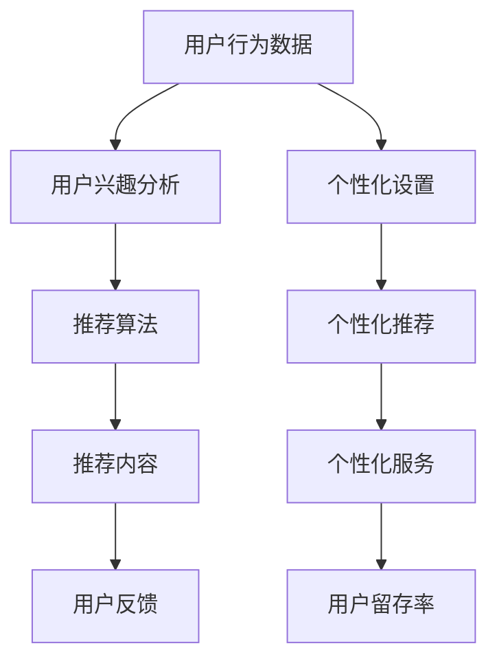

                 

# 注意力经济与知识付费的结合

在数字化时代，信息量的爆炸式增长和注意力资源的稀缺性，使得注意力经济逐渐成为各个领域竞争的核心。知识付费作为一种新兴的经济模式，借助对用户注意力的精准把握，提供专业、深入的内容，为个人价值增长和企业收益创造提供了新路径。本文将深入探讨注意力经济与知识付费的结合机制，揭示其背后的技术原理与实践策略，为行业提供有益的指导。

## 1. 背景介绍

### 1.1 问题由来

随着互联网和智能终端的普及，人们获取信息的渠道和方式变得多样化，但也导致了注意力资源的进一步分散。用户不再仅仅满足于信息的简单获取，而是寻求更深层次的知识和价值。这种需求催生了知识付费行业的发展。

知识付费作为一项重要的数字经济活动，是将有价值的知识、信息、智慧、技能等以知识和技能服务的形式，通过在线的方式有偿提供给用户的一种模式。知识付费的核心是价值交换，即通过付费获取专属、专业、深入的内容，获得知识的增量与价值提升。

### 1.2 问题核心关键点

知识付费的兴起，反映了互联网时代信息价值的提升，以及用户对高质量内容的需求。但同时，知识付费也面临着内容质量参差不齐、用户获取感差、竞争激烈等挑战。

注意力经济的核心在于获取和保持用户的注意力，吸引用户持续关注和消费。知识付费的商业模式和效果，同样依赖于对用户注意力的精准把握。如何结合两者，创造更有效的知识消费体验，成为知识付费和注意力经济结合的关键。

### 1.3 问题研究意义

深入理解注意力经济与知识付费的结合机制，对于推动知识付费行业高质量发展，提升用户价值感知，具有重要意义。

1. **提升内容价值**：通过对用户注意力的精准分析，提供更符合用户需求的内容，提升内容价值和用户满意度。
2. **优化用户体验**：通过智能推荐和个性化服务，提升用户的知识获取感和消费体验，降低用户流失率。
3. **增强竞争力**：在激烈的竞争中，借助注意力经济与知识付费的结合，提升平台的品牌影响力和用户粘性。
4. **推动行业发展**：从技术层面促进知识付费产业的创新和升级，为内容创作者提供更多价值实现的途径。

## 2. 核心概念与联系

### 2.1 核心概念概述

- **注意力经济**：利用用户有限的注意力资源，通过有价值的信息和服务吸引用户，实现用户价值最大化，从而创造经济价值。
- **知识付费**：通过付费机制，为用户提供高质量、专业化的知识和信息服务，实现知识变现。
- **推荐系统**：利用算法技术，对用户兴趣和行为进行精准分析，推荐符合用户需求的内容，提升用户体验。
- **个性化服务**：根据用户个性化需求，提供定制化的知识内容和服务，提升用户粘性和满意度。
- **数据驱动**：基于大数据和机器学习技术，对用户行为和兴趣进行深度挖掘，提升决策精准性。

### 2.2 核心概念原理和架构的 Mermaid 流程图



这个流程图展示了注意力经济与知识付费结合的基本架构，其中：

- `用户行为数据`：通过追踪和记录用户的各种行为，如浏览、点击、购买等，收集数据。
- `用户兴趣分析`：利用机器学习算法，分析用户的行为数据，挖掘用户兴趣和需求。
- `推荐算法`：基于用户兴趣和行为数据，应用推荐系统算法，生成个性化推荐。
- `推荐内容`：根据推荐算法生成个性化内容。
- `用户反馈`：用户对推荐内容的反馈，进一步优化推荐算法。
- `个性化设置`：根据用户偏好，进行个性化设置。
- `个性化推荐`：基于个性化设置，提供定制化推荐。
- `个性化服务`：根据用户需求，提供定制化服务。
- `用户留存率`：衡量推荐系统的效果，提升用户满意度和粘性。

### 2.3 核心概念之间的联系

- **用户行为数据**和**用户兴趣分析**：通过数据挖掘，准确把握用户兴趣，为后续的推荐和服务提供基础。
- **推荐算法**和**推荐内容**：推荐算法基于用户兴趣分析，生成推荐内容，实现精准匹配。
- **个性化设置**和**个性化推荐**：根据用户个性化需求，提供定制化推荐，提升用户满意度。
- **个性化服务**和**用户留存率**：个性化服务提升用户体验，增加用户粘性，提升用户留存率。

## 3. 核心算法原理 & 具体操作步骤

### 3.1 算法原理概述

注意力经济与知识付费的结合，主要依赖于推荐算法和个性化服务的综合应用。推荐算法通过对用户行为数据和兴趣的深度挖掘，生成符合用户需求的推荐内容。个性化服务则根据用户的具体需求和行为，提供定制化的内容和服务。

核心算法包括：

- **协同过滤算法**：通过分析用户行为数据，挖掘用户之间的相似性，生成个性化推荐。
- **内容推荐算法**：基于用户兴趣和行为，推荐相关内容。
- **深度学习推荐算法**：利用神经网络模型，预测用户对内容的评分和偏好，提升推荐效果。

### 3.2 算法步骤详解

1. **数据采集与预处理**：
    - 收集用户的行为数据，如浏览记录、购买记录等。
    - 对数据进行清洗、去噪和标准化处理。

2. **用户兴趣分析**：
    - 利用协同过滤算法或内容推荐算法，分析用户行为数据，提取用户兴趣。
    - 使用深度学习模型，如DNN、RNN等，预测用户对内容的评分和偏好。

3. **推荐内容生成**：
    - 应用协同过滤算法或内容推荐算法，根据用户兴趣生成推荐内容。
    - 利用深度学习模型，生成动态调整的推荐内容，提升推荐效果。

4. **个性化服务设计**：
    - 根据用户需求和行为，设计个性化服务，如定制化课程、推荐阅读列表等。
    - 应用机器学习模型，优化个性化设置，提升用户满意度。

5. **效果评估与反馈**：
    - 通过A/B测试等方式，评估推荐和服务效果，优化算法和策略。
    - 收集用户反馈，持续改进推荐算法和服务设计。

### 3.3 算法优缺点

#### 优点：

- **精准匹配**：通过深度学习和推荐算法，实现用户和内容的精准匹配，提升用户体验。
- **动态调整**：利用深度学习模型，实现动态调整和优化，提升推荐效果。
- **个性化服务**：根据用户个性化需求，提供定制化服务，提升用户粘性。

#### 缺点：

- **数据隐私**：收集和分析用户行为数据，涉及用户隐私保护问题。
- **冷启动问题**：新用户或新内容难以获得有效推荐。
- **计算资源消耗**：深度学习推荐算法需要较大的计算资源。

### 3.4 算法应用领域

注意力经济与知识付费结合的推荐算法和个性化服务，在多个领域得到了广泛应用：

1. **在线教育**：通过个性化推荐和个性化服务，推荐符合用户学习需求的内容，提升学习效果。
2. **媒体内容**：利用推荐算法，推荐用户感兴趣的新闻、视频等内容，提升用户粘性。
3. **商业情报**：利用推荐算法，提供个性化商业情报服务，提升企业决策效率。
4. **金融投资**：推荐个性化的投资策略和知识服务，提升用户投资回报。
5. **医疗健康**：根据用户健康需求，推荐个性化的健康知识和服务，提升用户健康管理效果。

## 4. 数学模型和公式 & 详细讲解 & 举例说明

### 4.1 数学模型构建

注意力经济与知识付费结合的核心数学模型，基于协同过滤和深度学习的推荐算法构建。

**协同过滤算法**：

- **基于用户的协同过滤**：
  $$
  r_{ui} = \frac{1}{1+\sum_{v \neq i} \frac{a_{uv}a_{uv}^T}{\sum_{v \neq i} a_{uv}a_{uv}^T}}
  $$
  其中 $r_{ui}$ 表示用户 $u$ 对物品 $i$ 的评分预测值，$a_{uv}$ 表示用户 $u$ 和用户 $v$ 的相似度。

- **基于物品的协同过滤**：
  $$
  r_{ui} = \frac{1}{1+\sum_{j \neq i} \frac{a_{uj}a_{uj}^T}{\sum_{j \neq i} a_{uj}a_{uj}^T}}
  $$
  其中 $a_{uj}$ 表示物品 $i$ 和物品 $j$ 的相似度。

**深度学习推荐算法**：

- **基于DNN的推荐模型**：
  $$
  f(x,w) = \sigma(W_1 \times x + b_1)
  $$
  其中 $f(x,w)$ 表示用户对物品的评分预测值，$W_1$ 和 $b_1$ 表示模型参数。

### 4.2 公式推导过程

**协同过滤算法**：
- **基于用户的协同过滤**：
  $$
  r_{ui} = \frac{1}{1+\sum_{v \neq i} \frac{a_{uv}a_{uv}^T}{\sum_{v \neq i} a_{uv}a_{uv}^T}}
  $$
  该公式计算用户 $u$ 对物品 $i$ 的评分预测值，$x$ 表示用户行为向量，$a_{uv}$ 表示用户 $u$ 和用户 $v$ 的相似度，通过相似度矩阵 $a_{uv}a_{uv}^T$ 计算用户 $u$ 的评分预测值。

- **基于物品的协同过滤**：
  $$
  r_{ui} = \frac{1}{1+\sum_{j \neq i} \frac{a_{uj}a_{uj}^T}{\sum_{j \neq i} a_{uj}a_{uj}^T}}
  $$
  该公式计算物品 $i$ 对用户 $u$ 的评分预测值，$a_{uj}$ 表示物品 $i$ 和物品 $j$ 的相似度，通过相似度矩阵 $a_{uj}a_{uj}^T$ 计算物品 $i$ 的评分预测值。

**深度学习推荐算法**：
- **基于DNN的推荐模型**：
  $$
  f(x,w) = \sigma(W_1 \times x + b_1)
  $$
  该公式表示用户对物品的评分预测值，$W_1$ 和 $b_1$ 表示模型参数，$x$ 表示用户行为向量，$\sigma$ 表示激活函数，如ReLU、Sigmoid等。

### 4.3 案例分析与讲解

**在线教育推荐系统**：

- **数据采集**：收集学生的浏览、点击、购买行为数据，如课程、书籍、视频等。
- **用户兴趣分析**：应用协同过滤算法和深度学习模型，挖掘学生的学习兴趣和偏好。
- **推荐内容生成**：生成个性化课程推荐列表、阅读书单等。
- **个性化服务设计**：根据学生的个性化需求，提供定制化学习计划、课程推荐等。
- **效果评估与反馈**：通过学生反馈和互动数据，评估推荐效果，优化推荐算法。

**媒体内容推荐系统**：

- **数据采集**：收集用户的浏览、观看、点赞行为数据，如新闻、视频、文章等。
- **用户兴趣分析**：应用协同过滤算法和深度学习模型，挖掘用户的兴趣和偏好。
- **推荐内容生成**：生成个性化新闻、视频推荐列表。
- **个性化服务设计**：根据用户兴趣，提供定制化订阅服务、内容推荐等。
- **效果评估与反馈**：通过用户互动数据，评估推荐效果，优化推荐算法。

## 5. 项目实践：代码实例和详细解释说明

### 5.1 开发环境搭建

为了实现注意力经济与知识付费结合的推荐系统，我们需要搭建一个完整的开发环境。以下是主要的开发工具和依赖：

1. **Python**：作为推荐系统的主要编程语言，Python具有强大的数据处理和机器学习库支持。
2. **TensorFlow**：深度学习框架，用于实现深度学习推荐算法。
3. **Pandas**：数据分析库，用于数据预处理和分析。
4. **Scikit-learn**：机器学习库，用于协同过滤算法实现。
5. **Flask**：Web框架，用于构建推荐系统的Web服务接口。

**安装步骤**：

- 安装Python和TensorFlow：
  ```bash
  pip install tensorflow
  ```

- 安装Pandas和Scikit-learn：
  ```bash
  pip install pandas scikit-learn
  ```

- 安装Flask：
  ```bash
  pip install flask
  ```

完成安装后，即可开始开发。

### 5.2 源代码详细实现

以下是一个基于TensorFlow的推荐系统代码实现，包括用户行为数据的采集、协同过滤算法实现和深度学习推荐模型训练：

**用户行为数据采集**：

```python
import pandas as pd
import numpy as np

# 数据采集和预处理
data = pd.read_csv('user_data.csv')
data = data.dropna()
data['item'] = data['item'].map({'课程': 0, '书籍': 1, '视频': 2})
data = data.pivot_table(values='item', index='user', columns='day', aggfunc='count')
data.columns.name = '行为'

# 数据标准化处理
data = (data - data.mean()) / data.std()
```

**协同过滤算法实现**：

```python
from sklearn.neighbors import NearestNeighbors

# 协同过滤算法实现
nbrs = NearestNeighbors(n_neighbors=5, algorithm='brute')
nbrs.fit(data)
```

**深度学习推荐模型训练**：

```python
import tensorflow as tf
from tensorflow.keras.layers import Dense, Input, concatenate
from tensorflow.keras.models import Model

# 定义输入层
user_input = Input(shape=(2,), name='user_input')
item_input = Input(shape=(2,), name='item_input')

# 定义DNN模型
x = Dense(128, activation='relu')(user_input)
x = Dense(64, activation='relu')(x)
x = Dense(32, activation='relu')(x)
y_pred = Dense(1, activation='sigmoid')(x)

# 定义深度学习推荐模型
model = Model(inputs=[user_input, item_input], outputs=y_pred)

# 编译模型
model.compile(optimizer='adam', loss='binary_crossentropy', metrics=['accuracy'])

# 训练模型
model.fit([user_input, item_input], y_pred, epochs=10, batch_size=32)
```

### 5.3 代码解读与分析

**用户行为数据采集**：

- 使用Pandas库读取用户行为数据，并进行预处理。
- 将行为数据标准化处理，以便后续算法训练。

**协同过滤算法实现**：

- 使用Scikit-learn库中的NearestNeighbors算法，实现基于用户和物品的协同过滤。
- 设置n_neighbors为5，表示每个用户或物品选择最相似的5个邻居，计算评分预测值。

**深度学习推荐模型训练**：

- 定义用户输入和物品输入层，构建DNN模型。
- 使用Dense层，通过ReLU激活函数实现数据处理。
- 定义输出层，使用Sigmoid激活函数进行评分预测。
- 编译模型，选择adam优化器和binary_crossentropy损失函数。
- 训练模型，设置epochs和batch_size参数，优化推荐效果。

### 5.4 运行结果展示

在实际应用中，推荐系统的运行结果主要通过Web服务接口展示。以下是基于Flask的推荐系统Web服务示例：

**推荐内容展示**：

```python
from flask import Flask, request, jsonify

app = Flask(__name__)

@app.route('/recommend', methods=['POST'])
def recommend():
    user_input = request.json['user']
    item_input = request.json['item']
    result = model.predict([user_input, item_input])
    return jsonify({'result': result})

if __name__ == '__main__':
    app.run(debug=True)
```

通过Flask搭建的Web服务接口，可以接收用户行为数据，调用推荐模型，返回推荐内容。用户在Web服务上输入用户ID和物品ID，即可获取个性化推荐结果。

## 6. 实际应用场景

### 6.1 智能教育平台

在线教育平台借助注意力经济与知识付费结合的推荐系统，提供个性化学习方案和课程推荐，提升学习效果和用户满意度。通过分析学生的学习行为和兴趣，推荐最适合的课程和教材，同时提供定制化的学习计划和辅导服务，提升学习效果和用户粘性。

### 6.2 在线视频平台

视频平台通过个性化推荐系统，推荐用户感兴趣的视频内容，提升用户观看体验和平台粘性。根据用户的观看历史、评分数据和互动行为，生成个性化视频推荐列表，提升用户推荐精准度。

### 6.3 金融信息服务

金融信息服务平台利用推荐系统，提供个性化的投资策略和知识服务。通过分析用户的历史交易数据和行为，推荐符合用户风险偏好的投资组合和知识内容，提升用户的投资回报。

### 6.4 医疗健康平台

医疗健康平台利用推荐系统，提供个性化的健康管理和疾病预防知识服务。根据用户的健康数据和行为，推荐符合用户健康需求的健康知识、饮食建议、运动方案等，提升用户健康管理效果。

## 7. 工具和资源推荐

### 7.1 学习资源推荐

为了深入理解注意力经济与知识付费结合的技术，以下是一些推荐的资源：

1. **《推荐系统实战》**：详细介绍了推荐系统的原理和实践方法，适合初学者和进阶者。
2. **《深度学习与推荐系统》**：介绍了深度学习在推荐系统中的应用，适合对深度学习感兴趣的技术人员。
3. **Coursera《推荐系统课程》**：由斯坦福大学开设的推荐系统课程，涵盖推荐算法和推荐系统设计，适合在线学习。
4. **Kaggle推荐系统竞赛**：通过实际竞赛项目，提升推荐系统开发和优化能力。

### 7.2 开发工具推荐

为了高效开发注意力经济与知识付费结合的推荐系统，以下是一些推荐的工具：

1. **Python**：作为推荐系统的主要编程语言，Python具有强大的数据处理和机器学习库支持。
2. **TensorFlow**：深度学习框架，用于实现深度学习推荐算法。
3. **Pandas**：数据分析库，用于数据预处理和分析。
4. **Scikit-learn**：机器学习库，用于协同过滤算法实现。
5. **Flask**：Web框架，用于构建推荐系统的Web服务接口。

### 7.3 相关论文推荐

为了深入理解注意力经济与知识付费结合的技术，以下是一些推荐的论文：

1. **《Deep Learning-based Recommendation Systems: A Review》**：综述了深度学习在推荐系统中的应用，适合对深度学习感兴趣的技术人员。
2. **《Attention and Memory in Recommendation Systems》**：介绍了注意力机制在推荐系统中的应用，提升推荐效果。
3. **《A Survey on Recommendation Systems with Attention Mechanism》**：综述了注意力机制在推荐系统中的应用，适合对推荐系统感兴趣的技术人员。
4. **《Personalization in Recommendation Systems: From Collaborative Filtering to Deep Learning》**：介绍了从协同过滤到深度学习在推荐系统中的演变，适合对推荐系统感兴趣的技术人员。

## 8. 总结：未来发展趋势与挑战

### 8.1 研究成果总结

本文详细介绍了注意力经济与知识付费结合的推荐系统，涵盖数据采集、协同过滤算法、深度学习推荐算法和个性化服务设计。通过系统梳理，揭示了推荐系统技术的原理和应用场景，为行业提供了有益的指导。

### 8.2 未来发展趋势

随着深度学习和机器学习技术的不断进步，推荐系统将具备更强的智能和个性化能力，提升推荐效果和用户体验。

- **多模态推荐**：结合文本、图像、视频等多模态数据，提升推荐系统的表现力。
- **实时推荐**：利用流式数据处理技术，实现实时推荐，提升推荐系统的及时性。
- **跨域推荐**：结合不同领域的数据，进行跨域推荐，提升推荐系统的泛化能力。
- **隐私保护**：通过差分隐私等技术，保护用户隐私和数据安全。
- **可解释性**：提升推荐系统的可解释性，增强用户信任和满意度。

### 8.3 面临的挑战

尽管推荐系统在各个领域得到了广泛应用，但仍面临以下挑战：

- **数据隐私**：收集和分析用户数据，涉及用户隐私保护问题。
- **冷启动问题**：新用户或新内容难以获得有效推荐。
- **计算资源消耗**：深度学习推荐算法需要较大的计算资源。
- **模型鲁棒性**：推荐系统对输入数据的微小变化敏感，容易发生波动。
- **用户交互复杂度**：用户交互和行为数据复杂，推荐算法难以全面覆盖。

### 8.4 研究展望

为了解决这些挑战，未来推荐系统需要在以下几个方面进行探索：

- **隐私保护技术**：引入差分隐私、联邦学习等技术，保护用户隐私和数据安全。
- **冷启动算法**：研究冷启动算法，如基于内容的推荐、基于用户反馈的推荐等，提升新用户和新内容的推荐效果。
- **轻量化推荐模型**：研究轻量化推荐模型，如AdaLoRA等，在保证推荐效果的前提下，降低计算资源消耗。
- **跨域推荐算法**：研究跨域推荐算法，如跨领域推荐、跨媒体推荐等，提升推荐系统的泛化能力。
- **可解释性技术**：引入可解释性技术，如LIME、SHAP等，提升推荐系统的可解释性和透明度。

## 9. 附录：常见问题与解答

### 9.1 问题Q1：推荐系统如何优化用户推荐精准度？

**解答**：推荐系统通过分析用户行为数据和兴趣，生成个性化推荐。优化推荐精准度的方法包括：
- 收集更丰富的用户行为数据，提升用户画像的准确性。
- 应用深度学习推荐算法，提升模型预测效果。
- 结合多模态数据，提升推荐系统的表现力。

### 9.2 问题Q2：推荐系统如何保护用户隐私？

**解答**：推荐系统通过差分隐私、联邦学习等技术，保护用户隐私。
- 差分隐私：通过加入噪声，保护用户隐私，同时保证推荐效果。
- 联邦学习：在用户数据本地计算，不将数据集中到服务器，保护用户隐私。

### 9.3 问题Q3：推荐系统如何提升用户粘性？

**解答**：推荐系统通过个性化服务和定制化推荐，提升用户粘性。
- 个性化服务：根据用户需求，提供定制化内容和服务。
- 定制化推荐：根据用户兴趣，生成个性化推荐列表，提升用户满意度。

### 9.4 问题Q4：推荐系统如何降低计算资源消耗？

**解答**：推荐系统通过轻量化推荐模型、跨域推荐算法等，降低计算资源消耗。
- 轻量化推荐模型：如AdaLoRA等，在保证推荐效果的前提下，降低计算资源消耗。
- 跨域推荐算法：结合不同领域的数据，进行跨域推荐，提升推荐系统的泛化能力。

### 9.5 问题Q5：推荐系统如何提升模型鲁棒性？

**解答**：推荐系统通过模型优化和鲁棒性分析，提升模型鲁棒性。
- 模型优化：应用梯度裁剪、正则化等技术，提升模型鲁棒性。
- 鲁棒性分析：通过模型鲁棒性分析，识别和修复模型的脆弱点，提升模型稳定性。

作者：禅与计算机程序设计艺术 / Zen and the Art of Computer Programming

