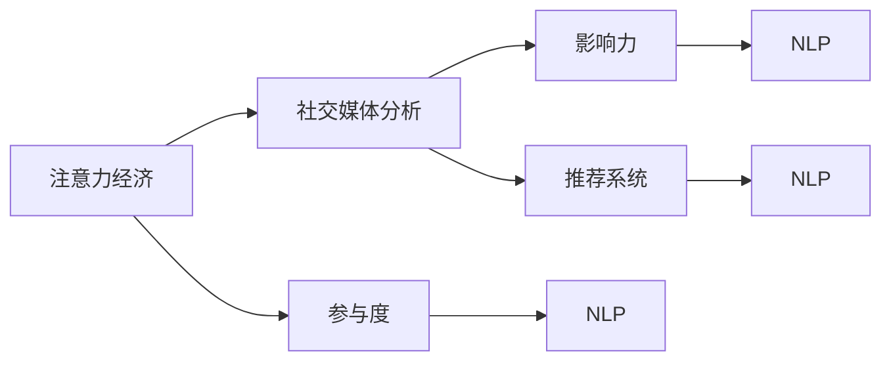

                 

## 1. 背景介绍

在数字经济时代，注意力成为最重要的资源之一。作为信息时代的重要产物，社交媒体已经成为大众获取新闻、信息和社交互动的主要渠道。如何理解和利用社交媒体用户的注意力，是商家、品牌和内容创造者不断追求的挑战。同时，随着社交媒体平台的广泛应用，如何在海量数据中洞察受众的参与度和影响力，也成为亟待解决的问题。

本文将从注意力经济的角度出发，探讨如何通过社交媒体分析，深度理解受众的参与度和影响力，进而提升内容策略、优化用户体验和挖掘潜在商机。我们将结合最新的技术工具和方法，从算法原理到具体操作步骤，深入剖析社交媒体分析的核心技术，并给出详细的代码实现和案例分析。

## 2. 核心概念与联系

### 2.1 核心概念概述

在进行社交媒体分析时，涉及多个核心概念。这些概念相互关联，共同构成了一个完整的研究框架。

- **注意力经济（Attention Economy）**：注意力经济指的是在数字时代，通过吸引和利用用户注意力，实现商业价值和经济效益。社交媒体作为一个信息传播和互动的平台，自然成为注意力经济的重要舞台。

- **社交媒体分析（Social Media Analytics）**：社交媒体分析指的是通过收集、分析和解读社交媒体平台上的用户数据，来理解用户行为、兴趣和需求。它涉及数据采集、文本分析、情感分析等多个技术环节。

- **参与度（Engagement）**：参与度是指用户与内容互动的频率和深度，包括点赞、评论、转发等行为。它是衡量用户对内容兴趣和认可度的重要指标。

- **影响力（Influence）**：影响力指的是用户在社交媒体平台上的传播力和影响力，包括粉丝数量、互动质量等。影响力强大的用户可以形成病毒式的传播效应。

- **推荐系统（Recommendation System）**：推荐系统利用用户行为数据和社交关系，为用户提供个性化的内容推荐。它通过深度学习、协同过滤等技术，提升用户体验和满意度。

- **自然语言处理（Natural Language Processing, NLP）**：自然语言处理是使计算机理解和处理人类语言的技术。社交媒体分析中，NLP技术常用于文本分类、情感分析、实体识别等。

这些核心概念之间存在紧密的联系。通过分析社交媒体上的文本数据，可以计算用户的参与度和影响力，并用于推荐系统的优化。而推荐系统则能够提升内容的传播和互动，进一步增强用户的参与度和影响力。

### 2.2 核心概念原理和架构的 Mermaid 流程图



这个流程图展示了核心概念之间的联系。注意力经济通过社交媒体分析，评估参与度和影响力，并用于推荐系统的优化。在社交媒体分析中，自然语言处理技术扮演了关键角色。

## 3. 核心算法原理 & 具体操作步骤

### 3.1 算法原理概述

社交媒体分析的核心算法包括情感分析、文本分类、实体识别等。这些算法通过NLP技术，从文本中提取有用信息，量化用户的行为和情感状态。

以情感分析为例，它的基本原理是通过文本数据，分析用户对特定内容或事件的态度和情感倾向。常用的情感分析算法包括基于规则的方法、机器学习方法和深度学习方法。深度学习方法如循环神经网络（RNN）和卷积神经网络（CNN），在处理大规模文本数据时表现优异。

### 3.2 算法步骤详解

下面以情感分析为例，详细介绍算法步骤。

1. **数据准备**：收集社交媒体平台上的文本数据，进行清洗和预处理，去除无关信息，提取有用特征。

2. **模型选择**：选择合适的情感分析模型，如基于LSTM或BERT的情感分类模型。

3. **特征提取**：通过NLP技术，将文本转化为模型可处理的形式，如词袋模型、TF-IDF、Word2Vec等。

4. **模型训练**：使用标注好的数据集，训练情感分析模型，优化模型参数。

5. **模型评估**：在测试集上评估模型性能，使用准确率、召回率、F1分数等指标。

6. **预测和应用**：将模型应用于新的社交媒体数据，计算情感倾向，用于内容策略、用户推荐等应用场景。

### 3.3 算法优缺点

情感分析作为社交媒体分析的重要组成部分，具有以下优缺点：

**优点**：
- 能够量化用户情感，为内容优化提供依据。
- 可以通过模型训练，提高预测准确性。
- 在NLP技术的支持下，可以处理大量文本数据。

**缺点**：
- 数据质量对模型效果影响较大，标注数据成本高。
- 对于情感模态的多样性和复杂性，模型难以全面覆盖。
- 模型的解释性和可解释性不足，难以理解复杂情感分析结果。

### 3.4 算法应用领域

情感分析可以应用于多个领域，如品牌监测、用户反馈、市场趋势等。通过情感分析，品牌可以了解公众对产品的评价，及时调整市场策略；企业可以监控用户反馈，改进产品和服务；市场分析师可以通过情感分析，预测市场趋势和消费者需求。

## 4. 数学模型和公式 & 详细讲解

### 4.1 数学模型构建

假设我们有一个社交媒体文本数据集 $\{(x_i, y_i)\}_{i=1}^N$，其中 $x_i$ 是第 $i$ 条文本，$y_i$ 是其对应的情感标签（如正面、负面或中性）。我们的目标是通过训练模型，学习一个函数 $f(x)$，使得 $f(x)$ 能够预测 $x$ 的情感倾向。

我们采用深度学习方法，即基于LSTM的情感分类模型。LSTM模型中的每个时间步 $t$，输入文本 $x_t$ 经过编码器层和解码器层，最终输出一个概率分布 $P(y|x)$。我们使用交叉熵损失函数来衡量模型预测和真实标签之间的差距。

### 4.2 公式推导过程

根据上述模型，我们可以写出交叉熵损失函数：

$$
\mathcal{L} = -\frac{1}{N}\sum_{i=1}^N \log P(y_i|x_i)
$$

其中，$P(y_i|x_i)$ 为模型对第 $i$ 条文本情感的预测概率。

模型的训练过程为：
1. 将文本 $x_i$ 输入LSTM模型，得到预测概率 $P(y_i|x_i)$。
2. 计算损失 $\mathcal{L}$。
3. 使用反向传播算法，计算梯度 $\frac{\partial \mathcal{L}}{\partial \theta}$，其中 $\theta$ 为模型参数。
4. 使用优化算法（如Adam）更新模型参数。

### 4.3 案例分析与讲解

假设我们有一个包含100条文本的情感分类数据集，其中正面的文本有30条，负面的文本有20条，中性的文本有50条。我们随机选择了10条文本作为验证集，其余90条作为训练集。

我们选择一个简单的LSTM模型，输入文本长度为100，隐藏层大小为64。我们使用10个epoch进行训练，学习率为0.001。在每个epoch结束时，我们在验证集上评估模型的性能，记录最优的验证集准确率和损失。

训练结束后，我们测试模型的性能，并使用混淆矩阵来分析模型在不同类别上的表现。

## 5. 项目实践：代码实例和详细解释说明

### 5.1 开发环境搭建

为了进行情感分析项目实践，我们需要安装以下工具：
- Python 3.8
- TensorFlow 2.0
- Keras
- NumPy
- pandas
- scikit-learn
- Matplotlib

使用Anaconda创建虚拟环境，并安装上述工具。

### 5.2 源代码详细实现

下面是一个基于LSTM的情感分析项目的完整代码实现：

```python
import tensorflow as tf
from tensorflow.keras.preprocessing.text import Tokenizer
from tensorflow.keras.preprocessing.sequence import pad_sequences
from tensorflow.keras.models import Sequential
from tensorflow.keras.layers import Embedding, LSTM, Dense

# 加载数据集
train_texts = ['...']
train_labels = [0, 1, ...]

test_texts = ['...']
test_labels = [0, 1, ...]

# 分词和编码
tokenizer = Tokenizer()
tokenizer.fit_on_texts(train_texts)
word_index = tokenizer.word_index
sequences = tokenizer.texts_to_sequences(train_texts)
padded_sequences = pad_sequences(sequences, maxlen=100, padding='post')

test_sequences = tokenizer.texts_to_sequences(test_texts)
test_padded_sequences = pad_sequences(test_sequences, maxlen=100, padding='post')

# 构建模型
model = Sequential([
    Embedding(len(word_index)+1, 64),
    LSTM(64, dropout=0.2, recurrent_dropout=0.2),
    Dense(1, activation='sigmoid')
])

# 编译模型
model.compile(optimizer='adam', loss='binary_crossentropy', metrics=['accuracy'])

# 训练模型
model.fit(padded_sequences, train_labels, epochs=10, batch_size=32, validation_data=(test_padded_sequences, test_labels))

# 评估模型
test_loss, test_acc = model.evaluate(test_padded_sequences, test_labels)
print('Test accuracy:', test_acc)

# 预测情感
new_text = ['...']
new_sequences = tokenizer.texts_to_sequences(new_text)
new_padded_sequences = pad_sequences(new_sequences, maxlen=100, padding='post')
prediction = model.predict(new_padded_sequences)
print('Predicted sentiment:', prediction)
```

### 5.3 代码解读与分析

**数据预处理**：
- 使用Tokenizer将文本进行分词和编码。
- 使用pad_sequences对文本进行定长填充，便于模型处理。

**模型构建**：
- 使用Embedding层将文本转换为向量表示。
- 使用LSTM层对向量序列进行建模，并使用Dropout层避免过拟合。
- 使用Dense层进行二分类预测，并使用sigmoid激活函数输出概率。

**模型训练**：
- 使用二分类交叉熵损失函数进行模型训练。
- 使用Adam优化器，设置学习率和学习率衰减。
- 使用validation_data参数，实时监控验证集的准确率。

**模型评估**：
- 在测试集上评估模型性能，记录准确率和损失。

**预测情感**：
- 使用训练好的模型，对新的文本进行情感预测。

## 6. 实际应用场景

### 6.1 品牌监测

品牌监测是社交媒体分析的重要应用之一。通过情感分析，品牌可以实时了解公众对品牌的评价，及时调整市场策略。例如，某化妆品品牌可以使用情感分析工具，监控社交媒体上用户对其产品的反馈，根据反馈结果调整产品配方和营销策略。

### 6.2 用户反馈

在产品开发和迭代过程中，用户的反馈意见是改进产品的重要参考。通过情感分析，企业可以自动识别和分类用户反馈，评估产品的满意度。例如，某电商平台可以使用情感分析工具，对用户评论进行分类，识别用户对商品质量和服务的评价，从而进行针对性的改进。

### 6.3 市场趋势

社交媒体上的情感数据可以反映市场趋势和消费者需求。通过情感分析，分析师可以预测市场走势，制定相应的投资策略。例如，某金融分析师可以使用情感分析工具，监控股民对某公司股票的情感倾向，预测股票价格的变化趋势。

### 6.4 未来应用展望

未来，社交媒体分析将结合更多新兴技术，提升应用效果和场景覆盖。例如，结合图像和视频分析，可以更全面地了解用户行为和需求；结合语音分析，可以深入挖掘用户的情感状态；结合推荐系统，可以实现更个性化的内容推荐。

## 7. 工具和资源推荐

### 7.1 学习资源推荐

- 《自然语言处理综论》：清华大学出版社，介绍NLP基础和前沿技术。
- 《深度学习入门：基于Python的理论与实现》：人民邮电出版社，涵盖深度学习基础和实战项目。
- 《Python深度学习》：第三版：Wes McKinney，介绍深度学习与Python编程。
- 《Python数据分析与数据可视化》：清华大学出版社，涵盖数据处理和可视化技术。
- 《社交媒体分析》：SAGE出版，介绍社交媒体分析的基本方法和技术。

### 7.2 开发工具推荐

- Python：数据科学和机器学习的主流编程语言。
- TensorFlow：深度学习框架，支持分布式计算和自动微分。
- Keras：高层次深度学习框架，易于使用。
- Jupyter Notebook：交互式编程环境，支持代码编写和可视化。
- Matplotlib：数据可视化库，支持绘制图表和数据可视化。

### 7.3 相关论文推荐

- "A Survey on Sentiment Analysis"：Andrea Esuli和Fabrizio Sebastiani，介绍情感分析的最新进展和应用。
- "Twitter Sentiment Analysis Using SVM and Ensemble Methods"：Wenchao Zhang等，介绍基于SVM和集成学习方法的情感分析。
- "A Deep Learning Approach for Text Sentiment Analysis"：Tobias Pfeil等，介绍基于深度学习的情感分类方法。

## 8. 总结：未来发展趋势与挑战

### 8.1 研究成果总结

本文从注意力经济的角度出发，探讨了社交媒体分析的核心概念和技术方法。通过情感分析等技术手段，可以对用户的参与度和影响力进行量化和分析，进而提升内容策略、优化用户体验和挖掘潜在商机。

### 8.2 未来发展趋势

未来，社交媒体分析将结合更多新兴技术，提升应用效果和场景覆盖。例如，结合图像和视频分析，可以更全面地了解用户行为和需求；结合语音分析，可以深入挖掘用户的情感状态；结合推荐系统，可以实现更个性化的内容推荐。

### 8.3 面临的挑战

尽管社交媒体分析技术已经取得显著进展，但在实际应用中仍面临一些挑战：
- 数据质量：标注数据成本高，数据质量对模型效果影响较大。
- 模型复杂度：深度学习模型计算量大，对硬件要求高。
- 模型解释性：模型的解释性和可解释性不足，难以理解复杂情感分析结果。
- 隐私保护：社交媒体数据隐私问题需高度重视。

### 8.4 研究展望

未来，社交媒体分析的研究将从以下几个方面进行突破：
- 无监督学习：减少对标注数据的依赖，利用无监督学习方法提升模型效果。
- 计算效率：优化模型结构和训练算法，提高计算效率，降低硬件成本。
- 模型解释性：开发更可解释的模型，提升模型的透明度和可信度。
- 隐私保护：研究隐私保护技术，保护用户数据安全。

## 9. 附录：常见问题与解答

**Q1: 什么是情感分析？**

A: 情感分析是指通过分析文本数据，识别和量化用户对特定内容或事件的态度和情感倾向。常用的情感分析方法包括基于规则的方法、机器学习方法和深度学习方法。

**Q2: 情感分析在实际应用中有哪些场景？**

A: 情感分析在实际应用中有很多场景，如品牌监测、用户反馈、市场趋势等。通过情感分析，品牌可以了解公众对产品的评价，及时调整市场策略；企业可以监控用户反馈，改进产品和服务；分析师可以预测市场走势，制定相应的投资策略。

**Q3: 情感分析的优缺点是什么？**

A: 情感分析的优点是可以量化用户情感，为内容优化提供依据。但它的缺点是数据质量对模型效果影响较大，标注数据成本高；模型难以全面覆盖情感模态的多样性和复杂性；模型的解释性和可解释性不足，难以理解复杂情感分析结果。

**Q4: 如何使用深度学习进行情感分析？**

A: 使用深度学习进行情感分析，通常采用LSTM或BERT等模型。首先对文本进行分词和编码，然后使用Embedding层将文本转换为向量表示，接着使用LSTM层对向量序列进行建模，并使用Dropout层避免过拟合，最后使用Dense层进行二分类预测。

**Q5: 如何在社交媒体分析中结合更多新兴技术？**

A: 社交媒体分析可以结合图像和视频分析，更全面地了解用户行为和需求；结合语音分析，深入挖掘用户的情感状态；结合推荐系统，实现更个性化的内容推荐。未来，社交媒体分析将结合更多新兴技术，提升应用效果和场景覆盖。

