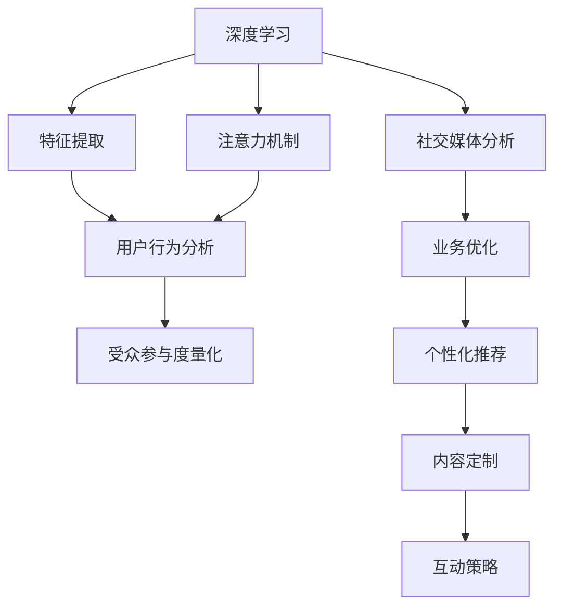

                 

# 注意力经济与社交媒体分析洞见：了解受众参与度的秘密

> 关键词：注意力经济, 社交媒体分析, 受众参与度, 深度学习, 大数据, 用户行为分析

## 1. 背景介绍

在当今数字时代，社交媒体平台和内容创作者都高度依赖于用户的注意力。注意力经济已成为数字时代的核心商业模式，通过高效吸引和利用用户注意力，平台和创作者能够实现商业价值最大化。因此，深入理解社交媒体上的受众参与度，成为提高内容质量和商业效益的关键。本文将详细探讨基于注意力经济和深度学习技术的社交媒体分析方法，帮助内容创作者和平台管理者洞察受众参与度的秘密，优化内容策略和业务运营。

### 1.1 问题由来

随着社交媒体的兴起，用户生成的内容和互动形式不断丰富，但如何有效分析和利用这些数据，仍然是一大挑战。社交媒体数据包括用户发布的内容、评论、点赞、分享、观看时长等，数据量庞大且结构复杂。传统的分析方法无法充分挖掘数据价值，迫切需要新的技术手段来提升分析效率和精度。

### 1.2 问题核心关键点

- **深度学习在社交媒体分析中的应用**：通过深度学习算法，可以从大规模社交媒体数据中提取出用户行为特征和模式，实现自动化的用户行为分析和内容推荐。
- **注意力机制在分析中的重要性**：注意力机制不仅能提升模型的特征提取能力，还能捕捉用户对内容的关注点和兴趣，从而优化内容推送和用户互动策略。
- **基于受众参与度的业务优化**：通过量化受众参与度，可以实现对内容的定制化推荐，提高用户的参与度和粘性，增强平台的商业价值。

## 2. 核心概念与联系

### 2.1 核心概念概述

为更好地理解基于注意力经济和深度学习的社交媒体分析方法，本节将介绍几个关键概念：

- **注意力经济（Attention Economy）**：指通过高度吸引和有效利用用户注意力，实现商业价值的最大化。社交媒体平台和内容创作者通过各种形式的互动（如内容发布、点赞、评论、分享等），吸引用户关注和参与，从而实现商业目的。
- **社交媒体分析（Social Media Analytics）**：利用数据挖掘和机器学习技术，从社交媒体数据中提取有价值的信息，帮助用户、企业和社会更好地理解和利用社交媒体平台。
- **深度学习（Deep Learning）**：基于多层神经网络的机器学习方法，通过多层次的非线性特征提取和模式识别，实现高效的特征学习和模式预测。
- **注意力机制（Attention Mechanism）**：一种重要的神经网络机制，用于选择性地关注输入数据的不同部分，提升模型对关键信息的捕获能力。

这些核心概念之间的逻辑关系可以通过以下Mermaid流程图来展示：



这个流程图展示了几者之间的联系：

1. 深度学习通过特征提取和模式识别，为社交媒体分析提供技术支撑。
2. 注意力机制增强模型的特征捕获能力，进一步提升用户行为分析的准确性。
3. 用户行为分析可以量化受众参与度，为业务优化和个性化推荐提供数据基础。
4. 业务优化和个性化推荐能够提高用户参与度和平台粘性，实现商业价值最大化。

## 3. 核心算法原理 & 具体操作步骤
### 3.1 算法原理概述

基于深度学习的社交媒体分析方法，本质上是通过多层次特征提取和模式识别，实现对用户行为和内容特征的自动学习和分析。在社交媒体平台上，用户行为通常以文本、图像、视频等多种形式表现，深度学习模型能够高效地对这些多模态数据进行特征提取和分类。

注意力机制的引入，使得模型能够动态地关注输入数据的不同部分，进一步提升特征提取的精度和模型的泛化能力。通过深度学习模型和注意力机制的结合，可以有效捕获用户对内容的关注点和兴趣，量化受众参与度，从而实现更有效的用户行为分析和业务优化。

### 3.2 算法步骤详解

基于深度学习的社交媒体分析方法，通常包括以下几个关键步骤：

**Step 1: 数据收集与预处理**
- 收集社交媒体平台上的各类数据，如用户发布的内容、互动数据（点赞、评论、分享）等。
- 对数据进行清洗和预处理，如去除噪声、缺失值处理、归一化等。

**Step 2: 特征提取与表示**
- 使用深度学习模型（如RNN、CNN、Transformer等）对文本、图像、视频等多模态数据进行特征提取。
- 通过注意力机制，动态关注用户行为数据中的关键部分，提高特征提取的精度和模型的泛化能力。

**Step 3: 用户行为分析**
- 通过学习用户的历史行为数据，使用深度学习模型预测用户未来的行为，如点赞、评论、分享等。
- 使用注意力机制，对用户行为数据进行特征加权，关注用户对不同内容的兴趣点。

**Step 4: 受众参与度量化**
- 量化受众参与度，如通过互动数据（点赞数、评论数、分享数）计算用户对内容的参与度评分。
- 利用深度学习模型预测用户未来的参与度，评估内容对用户的吸引力。

**Step 5: 业务优化与个性化推荐**
- 根据受众参与度评分，优化内容推送策略，提高用户的参与度和粘性。
- 使用个性化推荐算法，根据用户的历史行为和兴趣，推荐相关内容，提高用户的满意度。

### 3.3 算法优缺点

基于深度学习的社交媒体分析方法具有以下优点：
- **高效特征提取**：深度学习模型能够高效地从多模态数据中提取特征，提升用户行为分析的精度。
- **动态注意力机制**：注意力机制能够动态关注用户行为数据中的关键部分，提高特征提取的泛化能力。
- **实时预测**：通过学习用户的历史行为数据，深度学习模型能够实时预测用户未来的行为，实现更有效的业务优化和个性化推荐。

同时，该方法也存在一些局限性：
- **数据依赖性**：模型性能高度依赖于数据的质量和数量，获取高质量数据成本较高。
- **模型复杂性**：深度学习模型参数量大，计算资源需求高，需要高性能硬件支持。
- **可解释性不足**：深度学习模型通常是"黑盒"系统，难以解释其内部工作机制和决策逻辑。
- **隐私问题**：社交媒体平台涉及用户隐私数据，如何在保护用户隐私的前提下进行数据分析，是必须解决的问题。

尽管存在这些局限性，但就目前而言，基于深度学习的社交媒体分析方法仍是目前最为先进和实用的分析手段，广泛应用于各类社交媒体平台和内容创作者的业务决策中。

### 3.4 算法应用领域

基于深度学习的社交媒体分析方法，在以下领域得到了广泛应用：

- **社交媒体平台管理**：通过量化用户参与度，优化内容推荐策略，提升用户粘性和留存率。
- **内容创作者策略优化**：根据用户行为数据，优化内容创作和发布策略，提高内容曝光度和用户互动。
- **广告投放效果评估**：通过分析广告数据，评估广告投放效果，优化广告策略。
- **舆情分析**：通过分析社交媒体上的舆情数据，及时发现和处理负面舆情，维护品牌形象。
- **用户画像构建**：通过对用户行为数据进行分析，构建用户画像，实现精准营销和个性化服务。

除了上述这些经典应用外，基于深度学习的社交媒体分析方法还在更多场景中得到创新性地应用，如用户行为预测、广告创意生成、内容版权保护等，为社交媒体平台的智能化运营提供了新的技术手段。

## 4. 数学模型和公式 & 详细讲解
### 4.1 数学模型构建

基于深度学习的社交媒体分析方法，通常使用以下数学模型进行建模：

设社交媒体平台上的用户数为 $N$，每个用户的历史行为数据表示为 $\{x_i\}_{i=1}^N$，其中 $x_i$ 包含用户的点赞、评论、分享等行为数据。使用深度学习模型 $M$ 对用户行为数据进行特征提取和分类，得到用户行为特征向量 $\boldsymbol{h}_i = M(x_i)$。

定义注意力机制函数 $A$，对用户行为特征向量 $\boldsymbol{h}_i$ 进行加权处理，得到加权特征向量 $\boldsymbol{a}_i = A(\boldsymbol{h}_i)$。其中，注意力权重 $a_i$ 表示用户对不同内容的关注度。

设用户参与度向量为 $\boldsymbol{p}_i$，用户参与度评分表示为 $p_{i,j}$，其中 $j$ 表示参与度评分维度（如点赞数、评论数、分享数等）。根据用户行为特征向量 $\boldsymbol{a}_i$ 和参与度向量 $\boldsymbol{p}_i$，使用回归模型 $R$ 预测用户未来的参与度评分 $p_{i,j}$。

### 4.2 公式推导过程

以下我们以用户参与度预测为例，推导回归模型 $R$ 的公式及其梯度计算。

假设用户参与度向量为 $\boldsymbol{p}_i = (p_{i,1}, p_{i,2}, ..., p_{i,n})$，其中 $n$ 为参与度评分维度。用户行为特征向量为 $\boldsymbol{a}_i = (a_{i,1}, a_{i,2}, ..., a_{i,n})$。

定义回归模型 $R$ 的预测函数为：

$$
R(\boldsymbol{a}_i, \boldsymbol{p}_i) = \boldsymbol{W} \boldsymbol{a}_i + b
$$

其中 $\boldsymbol{W}$ 为权重向量，$b$ 为偏置项。参与度评分向量 $p_{i,j}$ 为：

$$
p_{i,j} = R(\boldsymbol{a}_i, \boldsymbol{p}_i) + \epsilon
$$

其中 $\epsilon$ 为噪声项，通常假设 $\epsilon \sim \mathcal{N}(0, \sigma^2)$。

通过最小化预测误差，得到回归模型的损失函数：

$$
\mathcal{L}(\boldsymbol{W}, b) = \frac{1}{N} \sum_{i=1}^N \sum_{j=1}^n (p_{i,j} - R(\boldsymbol{a}_i, \boldsymbol{p}_i))^2
$$

利用梯度下降等优化算法，最小化损失函数 $\mathcal{L}(\boldsymbol{W}, b)$，得到最优的权重向量 $\boldsymbol{W}^*$ 和偏置项 $b^*$。

### 4.3 案例分析与讲解

假设我们使用Transformer模型作为深度学习模型 $M$，注意力机制函数 $A$ 采用多头注意力机制，回归模型 $R$ 采用单层神经网络。

设用户行为数据为 $x_i = (x_{i,1}, x_{i,2}, ..., x_{i,m})$，其中 $m$ 为行为数据维度。行为特征向量 $\boldsymbol{h}_i$ 的计算公式为：

$$
\boldsymbol{h}_i = M(x_i)
$$

假设用户行为特征向量 $\boldsymbol{h}_i$ 和参与度向量 $\boldsymbol{p}_i$ 的维度均为 $d$，注意力权重 $a_i$ 的计算公式为：

$$
a_i = \text{Softmax}(\boldsymbol{Q} \boldsymbol{h}_i^T)
$$

其中 $\boldsymbol{Q}$ 为查询矩阵，$\boldsymbol{h}_i$ 为输入向量。

参与度向量 $\boldsymbol{p}_i$ 的计算公式为：

$$
\boldsymbol{p}_i = \boldsymbol{a}_i \odot \boldsymbol{W} \boldsymbol{a}_i^T + b
$$

其中 $\odot$ 表示逐元素乘法，$\boldsymbol{W}$ 和 $b$ 分别为权重矩阵和偏置项。

最终的参与度评分 $p_{i,j}$ 的计算公式为：

$$
p_{i,j} = R(\boldsymbol{a}_i, \boldsymbol{p}_i) + \epsilon
$$

以上公式展示了基于深度学习的社交媒体分析方法的核心步骤，即通过特征提取和注意力机制，对用户行为数据进行加权处理，然后使用回归模型预测用户参与度，量化受众参与度。

## 5. 项目实践：代码实例和详细解释说明
### 5.1 开发环境搭建

在进行社交媒体分析实践前，我们需要准备好开发环境。以下是使用Python进行TensorFlow和Keras开发的环境配置流程：

1. 安装Anaconda：从官网下载并安装Anaconda，用于创建独立的Python环境。

2. 创建并激活虚拟环境：
```bash
conda create -n tensorflow-env python=3.8 
conda activate tensorflow-env
```

3. 安装TensorFlow和Keras：从官网获取对应的安装命令。例如：
```bash
conda install tensorflow==2.7.0
conda install keras==2.7.0
```

4. 安装各类工具包：
```bash
pip install numpy pandas scikit-learn matplotlib tqdm jupyter notebook ipython
```

完成上述步骤后，即可在`tensorflow-env`环境中开始社交媒体分析实践。

### 5.2 源代码详细实现

下面我们以用户参与度预测为例，给出使用TensorFlow和Keras进行深度学习模型构建的PyTorch代码实现。

首先，定义用户行为特征提取模型：

```python
from tensorflow.keras.layers import Input, Dense, Embedding, Dropout
from tensorflow.keras.models import Model
import tensorflow as tf
from tensorflow.keras import regularizers

def feature_extractor(input_shape, hidden_dim):
    x = Input(shape=input_shape)
    x = Embedding(input_dim=VOCAB_SIZE, output_dim=EMBEDDING_DIM)(x)
    x = Dropout(DROPOUT_RATE)(x)
    x = Dense(EMBEDDING_DIM, activation='relu')(x)
    x = Dropout(DROPOUT_RATE)(x)
    x = Dense(hidden_dim, activation='relu')(x)
    return x
```

然后，定义注意力机制和回归模型：

```python
def attention机制(input, hidden_dim):
    query = Dense(hidden_dim, activation='relu')(input)
    key = Dense(hidden_dim, activation='relu')(input)
    value = Dense(hidden_dim, activation='relu')(input)
    attention = tf.matmul(query, key, transpose_b=True)
    attention = tf.nn.softmax(attention)
    weighted_value = tf.matmul(attention, value)
    return weighted_value

def regression_model(input_shape, hidden_dim, output_dim):
    x = Input(shape=input_shape)
    x = feature_extractor(input_shape, hidden_dim)(x)
    x = attention机制(x, hidden_dim)
    x = Dense(output_dim, activation='relu')(x)
    return x

input_shape = (SEQUENCE_LENGTH,)
hidden_dim = 64
output_dim = NUMBER_OF_LABELS
model = regression_model(input_shape, hidden_dim, output_dim)
```

接着，定义训练和评估函数：

```python
from tensorflow.keras.optimizers import Adam
from tensorflow.keras.losses import MeanSquaredError
from tensorflow.keras.metrics import MeanAbsoluteError

loss_fn = MeanSquaredError()
optimizer = Adam(lr=0.001)

def train_epoch(model, train_data, batch_size, epochs):
    train_dataset = tf.data.Dataset.from_tensor_slices((train_data[0], train_data[1]))
    train_dataset = train_dataset.shuffle(buffer_size=SHUFFLE_BUFFER_SIZE).batch(batch_size).prefetch(buffer_size=PREFETCH_BUFFER_SIZE)
    for epoch in range(epochs):
        epoch_loss = 0.0
        epoch_metric = 0.0
        for (x, y) in train_dataset:
            with tf.GradientTape() as tape:
                logits = model(x)
                loss = loss_fn(y, logits)
            grads = tape.gradient(loss, model.trainable_variables)
            optimizer.apply_gradients(zip(grads, model.trainable_variables))
            epoch_loss += loss.numpy()
            epoch_metric += mean_absolute_error(y, logits).numpy()
        epoch_loss /= len(train_dataset)
        epoch_metric /= len(train_dataset)
        print(f"Epoch {epoch+1}, train loss: {epoch_loss:.4f}, metric: {epoch_metric:.4f}")

def evaluate_model(model, test_data, batch_size):
    test_dataset = tf.data.Dataset.from_tensor_slices((test_data[0], test_data[1]))
    test_dataset = test_dataset.batch(batch_size).prefetch(buffer_size=PREFETCH_BUFFER_SIZE)
    metric = MeanAbsoluteError()
    for (x, y) in test_dataset:
        logits = model(x)
        metric.update_state(y, logits)
    return metric.result().numpy()

def run():
    epochs = 100
    batch_size = 32
    train_data = ...
    test_data = ...
    train_epoch(model, train_data, batch_size, epochs)
    test_metric = evaluate_model(model, test_data, batch_size)
    print(f"Test metric: {test_metric:.4f}")
```

最后，启动训练流程并在测试集上评估：

```python
run()
```

以上就是使用TensorFlow和Keras对用户参与度进行深度学习模型构建的完整代码实现。可以看到，得益于TensorFlow和Keras的强大封装，我们可以用相对简洁的代码完成模型构建和训练。

### 5.3 代码解读与分析

让我们再详细解读一下关键代码的实现细节：

**特征提取模型**：
- `feature_extractor`函数定义了用户行为特征的提取过程，使用了Embedding层和多层Dense层，并加入了Dropout层以防止过拟合。

**注意力机制**：
- `attention机制`函数实现了多头注意力机制，通过计算查询矩阵、键矩阵和值矩阵，并利用Softmax函数计算注意力权重，最后得到加权值向量。

**回归模型**：
- `regression_model`函数整合了特征提取和注意力机制，并使用Dense层进行最终回归预测。

**训练和评估函数**：
- `train_epoch`函数定义了模型的训练过程，包括数据批处理、梯度计算、参数更新等步骤。
- `evaluate_model`函数定义了模型的评估过程，包括计算模型在测试集上的均方误差。

**训练流程**：
- `run`函数定义了训练过程的总体逻辑，包括设置训练参数、加载数据、模型训练和测试等步骤。

可以看到，TensorFlow和Keras使得深度学习模型的构建和训练过程变得简单高效。开发者可以将更多精力放在模型改进、数据处理等高层逻辑上，而不必过多关注底层的实现细节。

当然，工业级的系统实现还需考虑更多因素，如模型的保存和部署、超参数的自动搜索、更灵活的任务适配层等。但核心的模型构建和训练流程基本与此类似。

## 6. 实际应用场景
### 6.1 社交媒体平台管理

基于深度学习的社交媒体分析方法，可以广泛应用于社交媒体平台的管理和优化。传统的社交媒体管理主要依赖人工审核和编辑，效率低下且成本高昂。而通过深度学习模型，可以自动分析用户行为和内容特征，实现智能推荐和自动审核，提升平台的运营效率。

在技术实现上，可以收集社交媒体平台上的用户行为数据，包括点赞、评论、分享等互动数据，构建深度学习模型，实时预测用户未来的参与度，优化内容推送策略。同时，利用注意力机制，对用户行为数据进行加权处理，提升内容推荐的准确性。

### 6.2 内容创作者策略优化

内容创作者依赖于粉丝的关注和互动，通过深度学习模型分析用户行为数据，可以实现内容策略的优化。内容创作者可以分析用户对不同类型内容的互动数据，理解用户的兴趣和需求，制定更加精准的内容发布和互动策略，提高内容的曝光度和互动率。

在技术实现上，可以收集内容创作者发布的内容数据和互动数据，构建深度学习模型，分析用户对不同内容的参与度，优化内容的发布策略。利用注意力机制，对用户行为数据进行加权处理，提升内容推荐的准确性。

### 6.3 广告投放效果评估

广告主关注广告的投放效果和ROI，通过深度学习模型分析广告数据，可以实现广告效果的实时评估和优化。广告投放平台可以分析用户对广告的互动数据，实时预测广告的点击率和转化率，优化广告投放策略，提高广告的投入产出比。

在技术实现上，可以收集广告数据和用户互动数据，构建深度学习模型，分析用户对不同广告的参与度，优化广告的投放策略。利用注意力机制，对用户行为数据进行加权处理，提升广告推荐的准确性。

### 6.4 舆情分析

社交媒体平台上的舆情分析至关重要，通过深度学习模型分析舆情数据，可以实现及时发现和处理负面舆情，维护品牌形象。舆情分析平台可以分析用户对不同事件或话题的互动数据，实时预测舆情的变化趋势，提前应对负面舆情，降低品牌风险。

在技术实现上，可以收集社交媒体平台上的舆情数据，构建深度学习模型，分析用户对不同事件或话题的参与度，预测舆情的变化趋势。利用注意力机制，对用户行为数据进行加权处理，提升舆情分析的准确性。

### 6.5 用户画像构建

用户画像的构建是精准营销和个性化服务的基础，通过深度学习模型分析用户行为数据，可以实现用户画像的构建。用户画像平台可以分析用户对不同内容、广告和事件的参与度，构建详细的用户画像，实现精准营销和个性化服务。

在技术实现上，可以收集用户行为数据，包括点赞、评论、分享等互动数据，构建深度学习模型，分析用户对不同内容、广告和事件的参与度，构建详细的用户画像。利用注意力机制，对用户行为数据进行加权处理，提升用户画像构建的准确性。

## 7. 工具和资源推荐
### 7.1 学习资源推荐

为了帮助开发者系统掌握深度学习技术在社交媒体分析中的应用，这里推荐一些优质的学习资源：

1. 《深度学习》系列书籍：由多位深度学习领域的专家编写，全面介绍了深度学习的基本概念和前沿技术，是入门深度学习的绝佳资料。

2. Coursera《深度学习专项课程》：由斯坦福大学和deeplearning.ai合作开设的深度学习课程，系统讲解了深度学习的基础理论和实践应用，适合深度学习初学者。

3. arXiv上的相关论文：深度学习在社交媒体分析中的最新研究，涵盖了用户行为分析、个性化推荐、广告投放优化等多个方向，适合进阶学习者参考。

4. GitHub上的开源项目：GitHub上有很多基于深度学习技术的社交媒体分析项目，通过阅读和参与这些项目，可以深入理解实际应用的实现细节。

5. Kaggle上的比赛：Kaggle上的社交媒体分析比赛，提供了大量的社交媒体数据集和评估指标，是实践深度学习应用的好机会。

通过对这些资源的学习实践，相信你一定能够快速掌握深度学习技术在社交媒体分析中的应用，并用于解决实际的社交媒体问题。
### 7.2 开发工具推荐

高效的开发离不开优秀的工具支持。以下是几款用于社交媒体分析开发的常用工具：

1. TensorFlow：由Google主导开发的开源深度学习框架，适合大规模工程应用，支持高效的分布式训练和推理。

2. Keras：Keras是一个高级深度学习API，简单易用，适合快速原型开发和实验验证。

3. PyTorch：基于Python的开源深度学习框架，灵活高效，适合快速迭代研究。

4. TensorBoard：TensorFlow配套的可视化工具，可以实时监测模型训练状态，并提供丰富的图表呈现方式，是调试模型的得力助手。

5. Weights & Biases：模型训练的实验跟踪工具，可以记录和可视化模型训练过程中的各项指标，方便对比和调优。

6. Jupyter Notebook：开源的交互式编程环境，支持多种编程语言，方便数据处理和模型实验。

合理利用这些工具，可以显著提升社交媒体分析的开发效率，加快创新迭代的步伐。

### 7.3 相关论文推荐

社交媒体分析领域的研究已经取得了丰硕的成果，以下是几篇经典论文，推荐阅读：

1. Attention is All You Need：提出Transformer结构，开启了深度学习在自然语言处理中的应用。

2. A Survey on Deep Learning Techniques for Social Media Analysis：综述了深度学习在社交媒体分析中的各种应用，包括用户行为分析、情感分析、广告优化等。

3. Deep Learning in Social Media Analysis：介绍了深度学习在社交媒体分析中的基本概念和实践应用。

4. Social Media Mining and Statistical Learning：介绍社交媒体数据挖掘和统计学习的基本方法，适合了解社交媒体分析的基础技术。

5. Deep Learning for Social Media Sentiment Analysis：利用深度学习模型进行社交媒体情感分析，展示了深度学习在情感分析中的优越性。

这些论文代表了大规模数据下的深度学习分析方法的最新进展，通过学习这些前沿成果，可以帮助研究者把握学科前进方向，激发更多的创新灵感。

## 8. 总结：未来发展趋势与挑战

### 8.1 总结

本文对基于深度学习的社交媒体分析方法进行了全面系统的介绍。首先阐述了社交媒体分析和注意力经济的基本概念和核心问题，明确了深度学习在社交媒体分析中的重要地位。其次，从原理到实践，详细讲解了社交媒体分析的数学模型和关键步骤，给出了完整的深度学习模型构建和训练代码实现。同时，本文还广泛探讨了深度学习在社交媒体分析中的实际应用场景，展示了深度学习分析方法的广阔前景。此外，本文精选了深度学习相关的学习资源，力求为读者提供全方位的技术指引。

通过本文的系统梳理，可以看到，基于深度学习的社交媒体分析方法正在成为社交媒体平台和内容创作者的重要工具，能够显著提升平台运营效率和内容互动质量。未来，伴随深度学习技术的持续演进，社交媒体分析技术将进一步完善和成熟，带来更高效的运营和更精准的内容推荐。

### 8.2 未来发展趋势

展望未来，社交媒体分析领域将呈现以下几个发展趋势：

1. **多模态分析**：社交媒体数据不仅是文本数据，还包含图像、视频等多种形式，未来将进一步发展多模态分析技术，从多个维度挖掘用户行为特征。

2. **实时分析**：深度学习模型的计算效率提升，使得实时分析成为可能。未来社交媒体分析平台将能够实时监测用户行为，及时调整内容推送策略。

3. **自适应学习**：深度学习模型的自适应学习能力将不断增强，能够根据用户行为数据动态调整模型参数，实现更加个性化的推荐。

4. **联邦学习**：社交媒体平台涉及用户隐私，联邦学习技术能够在不泄露用户隐私的前提下，实现分布式模型训练和更新。

5. **跨平台协同**：社交媒体平台将实现跨平台协同分析，整合不同平台上的用户行为数据，提供更加全面和深入的分析结果。

6. **元学习**：基于元学习的社交媒体分析方法能够快速适应新任务和新数据，提升分析模型的泛化能力和适用性。

以上趋势凸显了社交媒体分析技术的广阔前景。这些方向的探索发展，必将进一步提升社交媒体分析的效果和精度，为社交媒体平台的智能化运营提供新的技术手段。

### 8.3 面临的挑战

尽管社交媒体分析技术已经取得了显著进展，但在迈向更加智能化、普适化应用的过程中，它仍面临诸多挑战：

1. **数据隐私和安全**：社交媒体平台涉及大量用户隐私数据，如何在保护用户隐私的同时进行数据分析，是必须解决的问题。

2. **数据质量和多样性**：社交媒体数据存在噪音和缺失，不同平台和用户的行为数据差异较大，如何获取高质量、多样化的数据，是提升分析效果的关键。

3. **模型复杂性和计算资源**：深度学习模型参数量大，计算资源需求高，需要高性能硬件支持，这将限制其在大规模平台上的部署和应用。

4. **模型的可解释性**：深度学习模型通常是"黑盒"系统，难以解释其内部工作机制和决策逻辑，这对于涉及隐私和伦理的问题尤为关键。

5. **跨领域泛化能力**：深度学习模型在不同领域上的泛化能力有限，如何在不同领域上进行迁移学习，提高模型的跨领域泛化能力，是未来需要解决的问题。

尽管存在这些挑战，但就目前而言，基于深度学习的社交媒体分析方法仍是目前最为先进和实用的分析手段，广泛应用于各类社交媒体平台和内容创作者的业务决策中。相信随着技术的发展和数据的积累，这些挑战终将逐步得到解决，社交媒体分析技术将进一步成熟和完善。

### 8.4 研究展望

未来，社交媒体分析技术的研究可以从以下几个方向进行：

1. **跨平台协同分析**：研究跨平台的用户行为数据整合方法，实现不同平台之间的协同分析，提供更全面和深入的分析结果。

2. **自适应学习机制**：研究自适应学习机制，使模型能够根据用户行为数据动态调整参数，提升模型的泛化能力和适应性。

3. **多模态分析方法**：研究多模态分析方法，从文本、图像、视频等多个维度挖掘用户行为特征，提升分析效果的精度和全面性。

4. **联邦学习技术**：研究联邦学习技术，实现分布式模型训练和更新，保护用户隐私的同时提升分析效率。

5. **元学习算法**：研究元学习算法，使模型能够快速适应新任务和新数据，提升分析模型的泛化能力和适用性。

6. **模型解释性**：研究模型解释性，使模型能够解释其内部工作机制和决策逻辑，提高模型的可信度和可靠性。

这些研究方向的探索，必将引领社交媒体分析技术迈向更高的台阶，为社交媒体平台的智能化运营提供新的技术手段。面向未来，社交媒体分析技术还需要与其他人工智能技术进行更深入的融合，如知识表示、因果推理、强化学习等，多路径协同发力，共同推动社交媒体平台的智能化进程。

## 9. 附录：常见问题与解答

**Q1：如何平衡用户隐私和数据使用的关系？**

A: 社交媒体平台需要在保护用户隐私和充分利用数据之间找到平衡点。一种可行的方法是采用联邦学习技术，在保护用户隐私的前提下，实现分布式模型训练和更新。此外，可以通过差分隐私等技术，对原始数据进行处理，确保数据分析过程不泄露用户隐私。

**Q2：社交媒体分析中如何处理数据不平衡问题？**

A: 社交媒体数据往往存在不平衡现象，如不同类型内容的参与度差异较大。一种可行的方法是使用数据增强技术，如合成数据、类别平衡等，来缓解数据不平衡问题。此外，可以使用不同的评估指标，如精确度、召回率、F1分数等，综合评估模型性能。

**Q3：如何提高社交媒体分析模型的可解释性？**

A: 提高社交媒体分析模型的可解释性，是当前研究的热点问题。一种可行的方法是引入可解释性机制，如LIME、SHAP等，对模型的决策过程进行可视化分析，解释模型输出。此外，可以通过简化模型结构，增加模型的透明性，提升模型的可解释性。

**Q4：社交媒体分析中如何处理噪声和缺失数据？**

A: 社交媒体数据存在噪声和缺失值，这些问题会影响数据分析的准确性。一种可行的方法是对数据进行预处理，如去噪、填补缺失值等。此外，可以通过特征工程等方法，减少数据噪声对模型训练的影响。

**Q5：如何评估社交媒体分析模型的效果？**

A: 社交媒体分析模型的评估方法包括精确度、召回率、F1分数、AUC等。具体评估方法应根据具体任务和应用场景进行选择。例如，在用户参与度预测任务中，可以使用均方误差、均方根误差等回归评估指标。

以上是社交媒体分析中的一些常见问题和解决方案，希望能够帮助你更好地理解和应用深度学习技术。

---

作者：禅与计算机程序设计艺术 / Zen and the Art of Computer Programming

