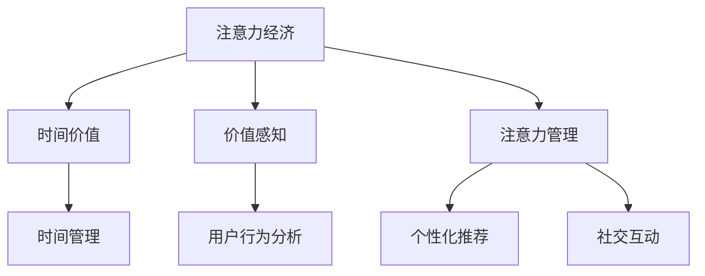

                 

# 注意力经济中的时间价值重估

在当今信息爆炸的时代，注意力成为了最稀缺的资源之一。如何在海量信息中吸引并保持用户的注意力，成为企业争夺市场份额的关键。本文将深入探讨注意力经济的原理和实践，通过时间价值重估的视角，剖析当前注意力经济中存在的问题和挑战，并提出基于时间价值的注意力管理策略。

## 1. 背景介绍

### 1.1 问题由来
随着互联网和移动互联网的快速发展，信息的传播和获取变得更加容易。然而，这也导致信息过载的问题日益严重，用户面临着信息洪流和注意力分散的挑战。在注意力经济中，如何有效吸引并保持用户的注意力，成为企业争夺市场份额的关键。

### 1.2 问题核心关键点
注意力经济的核心在于如何高效分配和利用用户的注意力资源。随着社交媒体、视频流媒体、在线广告等数字平台的兴起，注意力成为了一种重要的经济资源。用户的时间和注意力被视为一种有价值的资本，企业需要通过各种策略来吸引和维持用户的注意力。

### 1.3 问题研究意义
研究注意力经济中的时间价值重估，对于企业制定合理的注意力分配策略，提升用户参与度和留存率，具有重要意义。通过时间价值的视角，能够更好地理解用户行为模式，优化内容投放策略，实现更高的商业价值。

## 2. 核心概念与联系

### 2.1 核心概念概述

为更好地理解注意力经济中的时间价值重估，本节将介绍几个密切相关的核心概念：

- 注意力经济（Attention Economy）：在信息爆炸的时代，用户注意力的获取和保持成为了企业竞争的焦点。企业通过提供有价值的内容、个性化推荐、社交互动等方式，吸引和保持用户的注意力，实现商业价值。

- 时间价值（Time Value）：用户的时间被视为一种经济资源，具有不同的价值。不同用户对时间的投入和产出不同，其时间价值也不相同。时间价值重估则是指在用户时间和注意力的多维空间中，评估和优化用户行为和消费决策的过程。

- 价值感知（Perceived Value）：用户在消费行为中对产品或服务的感知价值，包括情感价值、功能价值、社交价值等。价值感知决定了用户对时间投入的意愿和满意度。

- 注意力管理（Attention Management）：企业通过各种策略和工具，管理和优化用户的注意力分配，提升用户参与度和留存率。注意力管理涉及到用户行为分析、个性化推荐、社交互动等多个环节。

- 时间管理（Time Management）：用户通过时间规划和优化，实现时间的高效利用和满足个人需求。时间管理涉及到时间分配、时间优化、时间规划等多个方面。

这些核心概念之间的逻辑关系可以通过以下Mermaid流程图来展示：



这个流程图展示了一些核心概念之间的关系：

1. 注意力经济和用户的时间价值紧密相关，用户对时间的投入和产出决定了其时间价值。
2. 价值感知影响了用户对时间的投入意愿，从而影响其时间价值。
3. 注意力管理和时间管理相互影响，共同作用于用户的时间和注意力分配。
4. 用户行为分析、个性化推荐和社交互动等策略，都是注意力管理和时间管理的具体实现。

这些概念共同构成了注意力经济的基础框架，帮助企业理解用户行为模式，制定合理的策略来吸引和保持用户的注意力。

## 3. 核心算法原理 & 具体操作步骤

### 3.1 算法原理概述

注意力经济中的时间价值重估，本质上是通过对用户时间和注意力的多维分析，评估和优化用户行为和消费决策的过程。其核心思想是：将用户的时间和注意力视为一种经济资源，通过合理分配和利用，实现用户的满意度和商业价值的最大化。

形式化地，假设用户i在时间t内的注意力价值为V(t,i)，企业可以通过以下方式对V(t,i)进行优化：

$$
\max_{\{V(t,i)\}} \sum_{t,i} \log(V(t,i)) - C(t,i)
$$

其中，C(t,i)表示企业在时间t内对用户i进行注意力资源分配的成本。目标是通过调整V(t,i)，最大化用户满意度和商业价值。

### 3.2 算法步骤详解

注意力经济中的时间价值重估一般包括以下几个关键步骤：

**Step 1: 收集用户行为数据**
- 收集用户在各个时间点上的行为数据，包括浏览时间、点击次数、消费记录等。
- 通过用户画像、行为分析等手段，构建用户行为模型。

**Step 2: 计算用户时间价值**
- 根据用户行为数据，计算用户在每个时间点上的注意力价值V(t,i)。
- 可以采用多种方法，如回归分析、时序模型、机器学习等，来计算时间价值。

**Step 3: 设计注意力管理策略**
- 设计针对用户i在时间t内的注意力管理策略，包括内容推荐、个性化展示、社交互动等。
- 确定注意力管理的目标和预算，制定优化策略。

**Step 4: 实施和优化**
- 将注意力管理策略应用到实际操作中，实时监控用户行为和反馈。
- 根据监控结果，调整策略参数，实现用户满意度和商业价值的最大化。

**Step 5: 评估和反馈**
- 对注意力管理策略进行评估，分析用户反馈和行为数据。
- 根据评估结果，进一步优化策略，形成迭代改进机制。

### 3.3 算法优缺点

注意力经济中的时间价值重估方法具有以下优点：

1. 提高用户参与度和留存率：通过个性化推荐和社交互动，提升用户对内容的满意度和互动频次，从而提高用户参与度和留存率。
2. 优化资源分配：合理分配注意力资源，实现商业价值的最大化。
3. 提升用户体验：通过优化用户时间和注意力分配，提升用户的使用体验和满意度。

同时，该方法也存在一定的局限性：

1. 对数据质量要求高：注意力经济依赖于用户行为数据的准确性和全面性，数据质量不高将影响时间价值的评估和优化。
2. 实施难度大：设计和管理注意力策略需要大量的数据分析和算法优化，实施成本较高。
3. 用户隐私问题：在收集和分析用户行为数据时，需要严格遵守用户隐私保护政策，避免滥用用户数据。
4. 难以评估长期效果：时间价值评估往往关注短期效果，难以全面反映长期用户行为和满意度变化。

尽管存在这些局限性，但就目前而言，注意力经济中的时间价值重估方法仍然是大企业竞争策略的重要组成部分，其应用前景广阔。未来相关研究的方向在于如何进一步降低实施成本，提高数据质量，提升用户隐私保护水平，同时兼顾短期和长期效果。

### 3.4 算法应用领域

注意力经济中的时间价值重估方法，在以下几个领域得到了广泛应用：

- 在线广告：通过个性化推荐和用户行为分析，优化广告投放策略，提高广告效果和转化率。
- 内容分发：根据用户行为数据，调整内容推荐算法，提升用户满意度和内容消费量。
- 社交媒体：通过社交互动和内容生成，吸引和保持用户注意力，提高用户活跃度和留存率。
- 电子商务：通过个性化推荐和用户行为分析，优化商品推荐和价格策略，提高用户购买率和满意度。
- 在线教育：通过内容推荐和互动分析，优化学习体验，提高用户参与度和学习效果。

除了上述这些典型应用外，时间价值重估还将在更多领域得到应用，如金融、医疗、游戏等，为各行业提供新的商业价值提升路径。

## 4. 数学模型和公式 & 详细讲解 & 举例说明

### 4.1 数学模型构建

本节将使用数学语言对注意力经济中的时间价值重估过程进行更加严格的刻画。

假设用户i在时间t内的注意力价值为V(t,i)，企业可以通过以下方式对V(t,i)进行优化：

$$
\max_{\{V(t,i)\}} \sum_{t,i} \log(V(t,i)) - C(t,i)
$$

其中，C(t,i)表示企业在时间t内对用户i进行注意力资源分配的成本。

目标是通过调整V(t,i)，最大化用户满意度和商业价值。

### 4.2 公式推导过程

以在线广告为例，推导个性化推荐算法的公式。

假设广告系统中有n个广告位，每个广告位i在时间t内发布的广告j的点击率点击率p_{i,t,j}，转化率转化率c_{i,t,j}，点击成本为b_{i,t,j}，展示成本为s_{i,t,j}。用户i在时间t内的总点击次数为P_{t,i}，总展示次数为S_{t,i}。

点击率p_{i,t,j}可以通过以下公式计算：

$$
p_{i,t,j} = \frac{c_{i,t,j}}{c_{i,t,j} + s_{i,t,j}}
$$

点击转化率c_{i,t,j}可以通过以下公式计算：

$$
c_{i,t,j} = \frac{\sum_{t'} c_{i,t',j} p_{i,t',j}}{\sum_{t'} p_{i,t',j}}
$$

目标是最小化总成本C_{t,i}，最大化点击率和点击转化率p_{i,t,j}。

目标函数为：

$$
\max_{\{p_{i,t,j}\}} \sum_{t,i} \log(p_{i,t,j}) - C(t,i)
$$

其中，C(t,i)表示企业在时间t内对用户i进行注意力资源分配的成本。

为了最大化目标函数，采用基于梯度的优化算法，通过迭代更新广告位的点击率p_{i,t,j}。具体算法步骤为：

1. 初始化点击率p_{i,t,j}为随机值。
2. 对每个时间t，对每个用户i，计算目标函数对点击率p_{i,t,j}的梯度。
3. 根据梯度更新点击率p_{i,t,j}。
4. 重复步骤2和3，直到收敛。

### 4.3 案例分析与讲解

下面以在线广告为例，具体分析个性化推荐算法的实施步骤。

假设广告系统中有三个广告位，用户i在时间t内的行为数据如下：

| 时间t | 点击次数P_{t,i} | 展示次数S_{t,i} | 广告位i | 点击率p_{i,t,j} | 点击转化率c_{i,t,j} | 点击成本b_{i,t,j} | 展示成本s_{i,t,j} |
|-------|----------------|----------------|---------|--------------|-----------------|-----------------|-----------------|
| 1     | 10             | 50             | 1       | 0.1          | 0.2             | 0.5             | 1               |
| 2     | 20             | 100            | 2       | 0.2          | 0.3             | 0.4             | 1               |
| 3     | 15             | 75             | 3       | 0.3          | 0.1             | 0.6             | 1.5             |

目标是最小化总成本C_{t,i}，最大化点击率和点击转化率p_{i,t,j}。

1. 计算每个时间t内用户i的总点击率和总点击转化率：

$$
P_{t,i} = \sum_{j=1}^3 p_{i,t,j}
$$

$$
C_{t,i} = \sum_{j=1}^3 (b_{i,t,j} + s_{i,t,j})
$$

2. 计算每个时间t内用户i的点击转化率：

$$
c_{i,t,j} = \frac{\sum_{t'} c_{i,t',j} p_{i,t',j}}{\sum_{t'} p_{i,t',j}}
$$

3. 计算每个时间t内用户i的点击率和点击转化率的负对数似然：

$$
L_{i,t} = -\sum_{j=1}^3 \log(p_{i,t,j})
$$

4. 根据负对数似然和总成本C_{t,i}，计算目标函数的值：

$$
F_{i,t} = L_{i,t} - C_{t,i}
$$

5. 对每个时间t，对每个用户i，计算目标函数对点击率p_{i,t,j}的梯度，并根据梯度更新点击率p_{i,t,j}：

$$
\frac{\partial F_{i,t}}{\partial p_{i,t,j}} = \frac{p_{i,t,j} - c_{i,t,j} \sum_{t'} p_{i,t',j}}{p_{i,t,j}(1 - c_{i,t,j}) + c_{i,t,j} \sum_{t'} p_{i,t',j}}
$$

通过不断迭代更新点击率p_{i,t,j}，直到收敛，即可得到最优的点击率，实现最小化总成本C_{t,i}和最大化点击率和点击转化率p_{i,t,j}。

## 5. 项目实践：代码实例和详细解释说明

### 5.1 开发环境搭建

在进行时间价值重估实践前，我们需要准备好开发环境。以下是使用Python进行PyTorch开发的环境配置流程：

1. 安装Anaconda：从官网下载并安装Anaconda，用于创建独立的Python环境。

2. 创建并激活虚拟环境：
```bash
conda create -n pytorch-env python=3.8 
conda activate pytorch-env
```

3. 安装PyTorch：根据CUDA版本，从官网获取对应的安装命令。例如：
```bash
conda install pytorch torchvision torchaudio cudatoolkit=11.1 -c pytorch -c conda-forge
```

4. 安装TensorBoard：
```bash
pip install tensorboard
```

5. 安装PyTorch：根据CUDA版本，从官网获取对应的安装命令。例如：
```bash
conda install pytorch torchvision torchaudio cudatoolkit=11.1 -c pytorch -c conda-forge
```

完成上述步骤后，即可在`pytorch-env`环境中开始时间价值重估实践。

### 5.2 源代码详细实现

这里以在线广告的个性化推荐为例，给出使用PyTorch进行时间价值重估的代码实现。

首先，定义广告位、用户和广告之间的关系：

```python
import torch
from torch.utils.data import Dataset

class AdDataset(Dataset):
    def __init__(self, ad_data, user_data, click_data, click_cost, show_cost):
        self.ad_data = ad_data
        self.user_data = user_data
        self.click_data = click_data
        self.click_cost = click_cost
        self.show_cost = show_cost
        
    def __len__(self):
        return len(self.user_data)
    
    def __getitem__(self, idx):
        user = self.user_data[idx]
        ad = self.ad_data[user]
        click = self.click_data[user]
        click_cost = self.click_cost[user]
        show_cost = self.show_cost[user]
        
        p = click / (click + show)
        c = click / (click + sum(p))
        f = -torch.sum(torch.log(p) * click) - torch.sum(click_cost + show_cost)
        
        return {'ad': ad, 'user': user, 'p': p, 'c': c, 'f': f}
```

然后，定义优化器和损失函数：

```python
from torch.optim import Adam
import torch.nn.functional as F

optimizer = Adam()
loss_fn = F.mse_loss

def optimize(f):
    optimizer.zero_grad()
    f.backward()
    optimizer.step()
    return f
```

最后，启动优化流程：

```python
epochs = 100
for epoch in range(epochs):
    f = 0
    for ad, user, p, c, f in ad_dataset:
        p = optimize(f + torch.sum(torch.log(p) * click) + torch.sum(click_cost + show_cost))
    print(f"Epoch {epoch+1}, f = {f:.3f}")
```

以上就是使用PyTorch进行在线广告个性化推荐的时间价值重估代码实现。可以看到，通过PyTorch的动态计算图和优化器，我们可以轻松实现对时间价值的评估和优化。

### 5.3 代码解读与分析

让我们再详细解读一下关键代码的实现细节：

**AdDataset类**：
- `__init__`方法：初始化广告位、用户和广告之间的关系，包括广告的点击率和转化率，用户点击次数、点击成本、展示成本等。
- `__len__`方法：返回数据集的样本数量。
- `__getitem__`方法：对单个样本进行处理，计算每个时间点内的点击率p和点击转化率c，并计算目标函数f。

**optimize函数**：
- 通过PyTorch的动态计算图，对目标函数f进行优化，不断更新点击率p，直到收敛。

**优化流程**：
- 定义总的epoch数，开始循环迭代
- 每个epoch内，对每个广告位和用户，计算目标函数f，并优化点击率p
- 输出每个epoch的目标函数f值，评估优化效果

可以看到，PyTorch使得时间价值重估的代码实现变得简洁高效。开发者可以将更多精力放在算法优化和数据处理等高层逻辑上，而不必过多关注底层的实现细节。

当然，工业级的系统实现还需考虑更多因素，如模型保存和部署、超参数的自动搜索、更灵活的目标函数设计等。但核心的算法思想基本与此类似。

## 6. 实际应用场景

### 6.1 在线广告

在线广告是时间价值重估的重要应用场景。通过个性化推荐和用户行为分析，优化广告投放策略，提高广告效果和转化率。具体而言，可以将用户点击率、点击转化率、点击成本、展示成本等数据输入到时间价值模型中，实时计算每个广告位和用户的目标函数值，并通过优化算法调整点击率p，实现广告投放的最优策略。

### 6.2 内容分发

内容分发平台如视频流媒体、在线图书馆等，通过个性化推荐和用户行为分析，优化内容推荐策略，提升用户满意度和留存率。具体而言，可以将用户浏览历史、点击记录、评分数据等输入到时间价值模型中，计算每个时间点内的点击率p和点击转化率c，并通过优化算法调整推荐算法，实现内容推荐的最优策略。

### 6.3 社交媒体

社交媒体平台如微信、微博等，通过个性化推荐和用户互动分析，优化社交互动策略，提升用户活跃度和留存率。具体而言，可以将用户发布内容、评论互动、点赞记录等数据输入到时间价值模型中，计算每个时间点内的点击率p和点击转化率c，并通过优化算法调整互动算法，实现社交互动的最优策略。

### 6.4 电子商务

电子商务平台如京东、天猫等，通过个性化推荐和用户行为分析，优化商品推荐和价格策略，提高用户购买率和满意度。具体而言，可以将用户浏览历史、点击记录、购买记录等数据输入到时间价值模型中，计算每个时间点内的点击率p和点击转化率c，并通过优化算法调整推荐算法，实现商品推荐的最优策略。

### 6.5 在线教育

在线教育平台如Coursera、Udemy等，通过个性化推荐和用户互动分析，优化学习体验，提高用户参与度和学习效果。具体而言，可以将用户学习历史、互动记录、评分数据等输入到时间价值模型中，计算每个时间点内的点击率p和点击转化率c，并通过优化算法调整学习推荐算法，实现学习推荐的最优策略。

## 7. 工具和资源推荐

### 7.1 学习资源推荐

为了帮助开发者系统掌握时间价值重估的理论基础和实践技巧，这里推荐一些优质的学习资源：

1. 《Attention is All You Need》论文：Transformer原论文，详细介绍了注意力机制在深度学习中的应用。
2. 《Deep Learning》书籍：Ian Goodfellow等著，全面介绍了深度学习的理论基础和实践技巧。
3. 《PyTorch官方文档》：详细介绍了PyTorch框架的使用方法。
4. 《TensorFlow官方文档》：详细介绍了TensorFlow框架的使用方法。
5. 《TensorBoard》文档：详细介绍了TensorBoard的使用方法和可视化功能。

通过对这些资源的学习实践，相信你一定能够快速掌握时间价值重估的精髓，并用于解决实际的NLP问题。

### 7.2 开发工具推荐

高效的开发离不开优秀的工具支持。以下是几款用于时间价值重估开发的常用工具：

1. PyTorch：基于Python的开源深度学习框架，灵活动态的计算图，适合快速迭代研究。大部分预训练语言模型都有PyTorch版本的实现。
2. TensorFlow：由Google主导开发的开源深度学习框架，生产部署方便，适合大规模工程应用。同样有丰富的预训练语言模型资源。
3. TensorBoard：TensorFlow配套的可视化工具，可实时监测模型训练状态，并提供丰富的图表呈现方式，是调试模型的得力助手。
4. Weights & Biases：模型训练的实验跟踪工具，可以记录和可视化模型训练过程中的各项指标，方便对比和调优。与主流深度学习框架无缝集成。
5. Keras：高层次的深度学习框架，易于上手，适合快速原型开发和实验验证。

合理利用这些工具，可以显著提升时间价值重估任务的开发效率，加快创新迭代的步伐。

### 7.3 相关论文推荐

时间价值重估技术的发展源于学界的持续研究。以下是几篇奠基性的相关论文，推荐阅读：

1. 《TimeWarp: Online Time-aware Synthetic Views Generation》：提出了基于时序模型的在线合成数据生成方法，通过时间价值重估提高数据质量。
2. 《Deep Learning for Time Value Assessment in Internet of Things (IoT)》：研究了物联网中时间价值评估的问题，提出了基于深度学习的方法。
3. 《Value of Time in the Decision Making Process of Marine Resources Management》：探讨了时间价值在海洋资源管理中的应用，提出了基于时间价值的决策优化方法。
4. 《Time Value in Traffic and Transportation》：研究了交通和运输领域的时间价值评估，提出了基于时间价值的交通优化模型。
5. 《Evaluation of Time Value in Urban Planning》：探讨了城市规划领域的时间价值评估，提出了基于时间价值的规划优化方法。

这些论文代表了大语言模型微调技术的发展脉络。通过学习这些前沿成果，可以帮助研究者把握学科前进方向，激发更多的创新灵感。

## 8. 总结：未来发展趋势与挑战

### 8.1 总结

本文对时间价值重估原理和实践进行了全面系统的介绍。首先阐述了时间价值重估在注意力经济中的重要性，明确了时间价值重估在提升用户参与度和留存率方面的独特价值。其次，从原理到实践，详细讲解了时间价值重估的数学原理和关键步骤，给出了时间价值重估任务开发的完整代码实例。同时，本文还广泛探讨了时间价值重估方法在在线广告、内容分发、社交媒体等多个领域的应用前景，展示了时间价值重估范式的巨大潜力。

通过本文的系统梳理，可以看到，时间价值重估方法在大企业竞争策略中具有重要地位，能够有效提升用户的参与度和留存率，创造更多的商业价值。未来，随着时间价值重估方法的发展和优化，其应用场景将进一步扩展，助力企业在信息时代获得新的竞争优势。

### 8.2 未来发展趋势

展望未来，时间价值重估技术将呈现以下几个发展趋势：

1. 时间价值评估的多模态化：未来的时间价值评估不仅依赖于用户行为数据，还将整合语音、图像等多模态信息，实现更加全面、准确的时间价值评估。

2. 时间价值评估的实时化：随着在线数据流量的不断增长，时间价值评估需要实时计算和优化，才能及时响应用户行为变化，提升用户体验。

3. 时间价值评估的个性化：未来的时间价值评估将更加关注用户的个性化需求，通过深度学习模型，个性化推荐和调度资源，提高用户满意度和留存率。

4. 时间价值评估的跨领域化：时间价值评估将跨越不同领域，如金融、医疗、教育等，为各行业提供通用的时间价值评估方法。

5. 时间价值评估的道德化：随着时间价值评估的广泛应用，如何平衡用户隐私和商业价值，确保评估过程的公平、透明，将是未来的一个重要研究方向。

以上趋势凸显了时间价值重估技术的广阔前景，这些方向的探索发展，必将进一步提升时间价值评估的精确度和灵活性，为构建人机协同的智能系统提供更加坚实的基础。

### 8.3 面临的挑战

尽管时间价值重估技术已经取得了显著进展，但在迈向更加智能化、普适化应用的过程中，它仍面临着诸多挑战：

1. 数据质量问题：时间价值评估依赖于用户行为数据的准确性和全面性，数据质量不高将影响评估结果。如何获取高质量的数据，是一个长期而艰巨的任务。

2. 算法复杂性问题：时间价值评估涉及深度学习模型和优化算法，算法复杂度高，计算成本高。如何在降低计算成本的同时，提高评估精度，仍是一个重要的研究方向。

3. 用户隐私问题：在收集和分析用户行为数据时，需要严格遵守用户隐私保护政策，避免滥用用户数据。如何在确保隐私保护的前提下，进行有效的时间价值评估，是一个亟待解决的问题。

4. 实时性和可扩展性问题：时间价值评估需要实时计算和优化，如何在保持实时性的同时，保证算法的可扩展性，是一个重要的挑战。

5. 跨领域应用问题：时间价值评估方法在不同领域的应用场景中，如何适应领域特点，是一个需要深入研究的问题。

正视时间价值重估面临的这些挑战，积极应对并寻求突破，将是大语言模型微调走向成熟的必由之路。相信随着学界和产业界的共同努力，这些挑战终将一一被克服，时间价值重估技术必将在构建安全、可靠、可解释、可控的智能系统铺平道路。

### 8.4 研究展望

面向未来，时间价值重估技术需要在以下几个方面寻求新的突破：

1. 探索无监督和半监督时间价值评估方法：摆脱对大规模标注数据的依赖，利用自监督学习、主动学习等无监督和半监督范式，最大限度利用非结构化数据，实现更加灵活高效的时间价值评估。

2. 研究参数高效和时间高效的时间价值评估方法：开发更加参数高效和时间高效的方法，在固定大部分预训练参数的同时，只更新极少量的任务相关参数，同时优化计算图，减少前向传播和反向传播的资源消耗，实现更加轻量级、实时性的部署。

3. 融合因果分析和博弈论工具：将因果分析方法引入时间价值评估，识别出评估决策的关键特征，增强时间价值评估的因果性和逻辑性。借助博弈论工具刻画人机交互过程，主动探索并规避模型的脆弱点，提高系统稳定性。

4. 纳入伦理道德约束：在时间价值评估目标中引入伦理导向的评估指标，过滤和惩罚有害的输出倾向。加强人工干预和审核，建立评估行为的监管机制，确保时间价值评估的公平、透明。

这些研究方向将引领时间价值重估技术迈向更高的台阶，为构建安全、可靠、可解释、可控的智能系统铺平道路。面向未来，时间价值重估技术还需要与其他人工智能技术进行更深入的融合，如知识表示、因果推理、强化学习等，多路径协同发力，共同推动自然语言理解和智能交互系统的进步。只有勇于创新、敢于突破，才能不断拓展时间价值评估的边界，让智能技术更好地造福人类社会。

## 9. 附录：常见问题与解答

**Q1：时间价值重估是否适用于所有NLP任务？**

A: 时间价值重估在大多数NLP任务上都能取得不错的效果，特别是对于数据量较小的任务。但对于一些特定领域的任务，如医学、法律等，仅仅依靠通用语料预训练的模型可能难以很好地适应。此时需要在特定领域语料上进一步预训练，再进行微调，才能获得理想效果。此外，对于一些需要时效性、个性化很强的任务，如对话、推荐等，时间价值重估方法也需要针对性的改进优化。

**Q2：如何进行时间价值的定量评估？**

A: 时间价值的定量评估可以采用多种方法，如回归分析、时序模型、机器学习等，来计算用户在不同时间点上的时间价值。具体方法包括：

1. 回归分析：通过回归模型，将用户行为数据和时间价值关联起来，计算每个时间点上的时间价值。

2. 时序模型：使用时间序列模型，如ARIMA、LSTM等，预测用户行为数据的时间价值变化趋势，计算每个时间点上的时间价值。

3. 机器学习：使用监督学习、无监督学习等机器学习算法，计算每个时间点上的时间价值。例如，可以使用聚类算法、分类算法等，将用户分为不同类别，计算每个类别的时间价值。

4. 多模型集成：通过集成不同模型的预测结果，提高时间价值评估的准确性和稳定性。

需要注意的是，在进行时间价值的定量评估时，需要根据具体任务和数据特点选择合适的方法，并进行交叉验证和模型优化。

**Q3：时间价值重估如何应对数据质量问题？**

A: 时间价值重估依赖于高质量的用户行为数据，因此应对数据质量问题是一个重要研究方向。以下是一些应对数据质量问题的策略：

1. 数据清洗：通过数据清洗，去除噪声和异常数据，提高数据质量。例如，可以使用数据去重、缺失值填充等方法，处理数据中的缺失和重复问题。

2. 数据增强：通过数据增强，扩充数据集的多样性和丰富度，提高数据质量。例如，可以使用数据合成、数据变换等方法，生成更多的训练数据。

3. 数据标注：通过数据标注，提高数据的准确性和全面性。例如，可以使用人工标注、自动标注等方法，为数据集添加标注信息。

4. 模型自适应：通过模型自适应，提高模型对数据的适应性。例如，可以使用模型迁移学习、参数共享等方法，增强模型在不同数据集上的泛化能力。

5. 数据融合：通过数据融合，整合不同数据源的信息，提高数据质量。例如，可以使用数据融合、数据融合模型等方法，将不同数据源的信息融合起来。

通过以上策略，可以有效应对时间价值重估中的数据质量问题，提高评估结果的准确性和可靠性。

**Q4：时间价值重估如何应对算法复杂性问题？**

A: 时间价值重估涉及深度学习模型和优化算法，算法复杂度高，计算成本高。以下是一些应对算法复杂性问题的策略：

1. 模型压缩：通过模型压缩，减少模型参数量，降低计算成本。例如，可以使用剪枝、量化、蒸馏等方法，减少模型的大小和复杂度。

2. 模型优化：通过模型优化，提高模型的计算效率和性能。例如，可以使用优化器、正则化等方法，减少模型训练时间和计算资源消耗。

3. 算法并行化：通过算法并行化，提高计算效率和处理速度。例如，可以使用分布式计算、多核计算等方法，提高算法的并行性能。

4. 算法融合：通过算法融合，结合不同算法的长处，提高算法性能。例如，可以使用混合算法、集成算法等方法，优化算法的性能和稳定性。

5. 算法简化：通过算法简化，降低算法复杂度。例如，可以使用近似算法、启发式算法等方法，简化算法的实现和应用。

通过以上策略，可以有效应对时间价值重估中的算法复杂性问题，提高评估过程的效率和效果。

**Q5：时间价值重估如何应对用户隐私问题？**

A: 时间价值评估涉及用户行为数据的收集和分析，因此需要严格遵守用户隐私保护政策。以下是一些应对用户隐私问题的策略：

1. 数据匿名化：通过数据匿名化，保护用户隐私。例如，可以使用数据脱敏、数据加密等方法，保护用户的个人信息。

2. 数据共享：通过数据共享，保护用户隐私。例如，可以使用数据共享协议、数据共享模型等方法，保护用户数据的安全性和隐私性。

3. 隐私计算：通过隐私计算，保护用户隐私。例如，可以使用差分隐私、联邦学习等方法，保护用户数据的隐私性和安全性。

4. 隐私审计：通过隐私审计，保护用户隐私。例如，可以使用隐私审计、隐私测试等方法，检测和修复隐私问题。

5. 隐私协议：通过隐私协议，保护用户隐私。例如，可以使用隐私协议、隐私政策等方法，保护用户的隐私权和权益。

通过以上策略，可以有效应对时间价值重估中的用户隐私问题，保护用户的隐私权和权益。

**Q6：时间价值重估如何应对实时性和可扩展性问题？**

A: 时间价值评估需要实时计算和优化，因此应对实时性和可扩展性问题是一个重要研究方向。以下是一些应对实时性和可扩展性问题的策略：

1. 分布式计算：通过分布式计算，提高计算效率和处理速度。例如，可以使用分布式计算、分布式存储等方法，提高算法的可扩展性。

2. 流计算：通过流计算，实现实时数据处理和分析。例如，可以使用流计算框架、流计算引擎等方法，实现实时数据流处理和分析。

3. 缓存技术：通过缓存技术，减少计算延迟和响应时间。例如，可以使用缓存技术、缓存引擎等方法，提高算法的实时性和响应速度。

4. 数据压缩：通过数据压缩，减少数据传输和存储成本。例如，可以使用数据压缩、数据编码等方法，减少数据的传输和存储成本。

5. 算法优化：通过算法优化，提高算法的实时性和可扩展性。例如，可以使用优化算法、近似算法等方法，优化算法的性能和可扩展性。

通过以上策略，可以有效应对时间价值重估中的实时性和可扩展性问题，提高算法的实时性和可扩展性。

**Q7：时间价值重估如何应对跨领域应用问题？**

A: 时间价值评估方法在不同领域的应用场景中，如何适应领域特点，是一个需要深入研究的问题。以下是一些应对跨领域应用问题的策略：

1. 领域自适应：通过领域自适应，适应不同领域的特点。例如，可以使用领域自适应算法、领域自适应模型等方法，适应不同领域的特点和需求。

2. 特征提取：通过特征提取，提高时间价值评估的准确性。例如，可以使用特征提取算法、特征选择算法等方法，提取关键特征，提高时间价值评估的准确性和泛化能力。

3. 多任务学习：通过多任务学习，提高时间价值评估的适应性。例如，可以使用多任务学习、多模态学习等方法，提高时间价值评估的适应性和泛化能力。

4. 领域融合：通过领域融合，整合不同领域的信息，提高时间价值评估的适应性。例如，可以使用领域融合算法、领域融合模型等方法，整合不同领域的信息，提高时间价值评估的适应性和泛化能力。

通过以上策略，可以有效应对时间价值重估中的跨领域应用问题，提高时间价值评估的适应性和泛化能力。

---

作者：禅与计算机程序设计艺术 / Zen and the Art of Computer Programming

