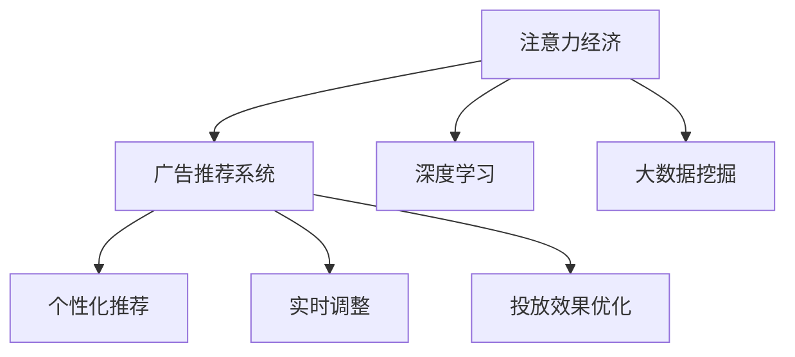

                 

# 注意力经济对传统广告投放策略的挑战

## 1. 背景介绍

### 1.1 问题由来
在互联网经济蓬勃发展的今天，广告投放已成为了各大品牌获取用户关注、提升品牌影响力的重要手段。然而，传统广告投放策略逐渐面临注意力稀缺、用户行为多样化和广告效果难以量化的多重挑战。随着人工智能技术的兴起，特别是基于深度学习的广告推荐系统和大数据挖掘技术的成熟，新的广告投放策略应运而生。本文旨在探讨注意力经济背景下，传统广告投放策略所面临的挑战，并提出针对性的优化策略，以期助力品牌在注意力经济的浪潮中实现精准投放，提升广告效果。

### 1.2 问题核心关键点
注意力经济时代，用户的注意力成为稀缺资源。传统的广告投放策略通常基于点击率、转化率等单一指标进行优化，难以全面衡量广告效果的价值。新的广告投放策略，如基于深度学习的广告推荐系统，可以更好地理解用户行为模式，预测用户对不同广告的响应，从而提升广告的投放效果。

广告投放策略的优化关键点包括：
1. 理解用户兴趣：如何通过数据分析，准确捕捉用户的兴趣点，实现个性化的广告投放。
2. 优化投放效果：如何通过算法优化，提升广告点击率、转化率和投资回报率。
3. 实时调整：如何通过实时数据反馈，动态调整广告投放策略。

### 1.3 问题研究意义
研究注意力经济对传统广告投放策略的挑战，对于优化广告投放效果，提升品牌价值具有重要意义：
1. 降低广告投放成本。精准的投放策略可以避免无效曝光，减少广告浪费。
2. 提升用户参与度。个性化的广告内容更能引发用户的兴趣和参与。
3. 增加广告投资回报。通过优化广告投放效果，提高广告的经济效益。
4. 增强品牌影响力。优秀的广告推荐系统可以持续提供有价值的内容，提升品牌知名度和美誉度。

## 2. 核心概念与联系

### 2.1 核心概念概述

为更好地理解注意力经济对传统广告投放策略的挑战，本节将介绍几个核心概念：

- 注意力经济(Attention Economy)：指在信息过载的时代，用户注意力成为最宝贵的资源，广告主需通过精细化的投放策略，高效地吸引和利用用户的注意力。
- 广告推荐系统(Advertising Recommendation System)：利用机器学习算法，分析用户行为和兴趣，推荐个性化的广告内容。
- 深度学习(Deep Learning)：基于神经网络模型，通过多层次特征提取和优化，提升广告推荐的准确性和效果。
- 大数据挖掘(Big Data Mining)：利用大数据技术，从海量用户行为数据中提取有用信息，指导广告投放决策。

这些核心概念之间的逻辑关系可以通过以下Mermaid流程图来展示：



这个流程图展示了一些核心概念及其之间的关系：

1. 注意力经济时代，广告投放需精准高效地吸引用户注意力。
2. 广告推荐系统利用深度学习和大数据挖掘技术，提升广告推荐的准确性和个性化程度。
3. 深度学习和大数据挖掘分别从模型和技术两个层面，共同支撑广告推荐的实现。
4. 广告推荐系统通过个性化推荐、实时调整和投放效果优化，实现广告的精准投放和高效利用。

## 3. 核心算法原理 & 具体操作步骤
### 3.1 算法原理概述

注意力经济下，广告投放策略的核心在于如何高效利用用户的注意力，通过深度学习和数据挖掘技术，实现个性化推荐，优化广告投放效果。基于深度学习的广告推荐系统，通过分析用户的历史行为和兴趣点，预测用户对不同广告的响应，从而实现精准投放。

具体而言，广告推荐系统的关键算法包括：

- 协同过滤算法(Collaborative Filtering)：通过分析用户行为数据，寻找用户间或物品间的相似性，推荐相似的物品或广告。
- 基于内容的推荐算法(Content-Based Recommendation)：利用用户兴趣和广告内容的特征，计算用户与广告的相关度，进行推荐。
- 矩阵分解算法(Matrix Factorization)：将用户和物品间的交互矩阵分解为低维用户特征和物品特征，进行推荐预测。
- 深度神经网络(Deep Neural Networks)：通过多层网络结构，提取用户和广告的多层次特征，提升推荐的准确性。

### 3.2 算法步骤详解

基于深度学习的广告推荐系统通常包括以下几个关键步骤：

**Step 1: 数据准备与预处理**
- 收集广告主提供的产品信息和用户行为数据，包括点击、浏览、购买等事件。
- 对数据进行清洗和预处理，去除噪音和缺失值，确保数据质量。

**Step 2: 特征工程**
- 提取用户和广告的特征，如用户ID、广告ID、点击次数、转化率等。
- 对特征进行向量化，构建用户-广告互动矩阵。
- 利用大数据挖掘技术，对用户和广告的特征进行分析和降维，提高推荐效果。

**Step 3: 模型训练与优化**
- 选择合适的推荐算法，如协同过滤、基于内容的推荐等，进行模型训练。
- 利用深度学习技术，构建多层神经网络模型，提取用户和广告的深度特征。
- 应用交叉验证、正则化等技术，优化模型参数，提高推荐精度。

**Step 4: 个性化推荐**
- 根据用户的历史行为和特征，预测用户对不同广告的评分。
- 利用排序算法，对广告进行排序推荐，优先展示用户最感兴趣的广告。
- 实时获取用户的点击和反馈数据，动态调整推荐策略，提升广告效果。

**Step 5: 投放效果评估与反馈**
- 定义推荐效果的评估指标，如点击率、转化率、投资回报率等。
- 使用A/B测试等方法，评估不同广告策略的效果，优化广告投放。
- 实时收集用户反馈数据，进行数据分析和反馈调整，持续优化推荐系统。

### 3.3 算法优缺点

基于深度学习的广告推荐系统具有以下优点：
1. 个性化推荐能力强。深度学习模型可以处理复杂的非线性关系，捕捉用户的深层次兴趣。
2. 推荐效果精准。通过多层次特征提取，深度学习模型能够提升广告推荐的准确性和个性化程度。
3. 实时性强。利用大数据挖掘技术，广告推荐系统可以实时获取用户行为数据，动态调整推荐策略。

同时，该系统也存在以下局限性：
1. 数据需求高。深度学习模型需要大量的高质量用户行为数据进行训练，难以在小规模数据下获得理想效果。
2. 计算资源消耗大。深度学习模型的训练和推理需要高性能计算资源，对硬件设施要求较高。
3. 模型复杂度高。深度学习模型的构建和优化较为复杂，需进行大量的实验和调参工作。

### 3.4 算法应用领域

基于深度学习的广告推荐系统已经在广告推荐、商品推荐、视频推荐等多个领域得到广泛应用，取得了显著的效果：

- 电商推荐：亚马逊、淘宝等电商平台，利用广告推荐系统，提升用户购买转化率。
- 内容推荐：Netflix、YouTube等视频平台，利用推荐系统，提高用户留存率和观看时间。
- 广告投放：Google、Facebook等社交平台，利用广告推荐系统，实现精准的广告投放。

除了这些经典应用外，广告推荐系统还被创新性地应用到更多场景中，如新闻资讯推荐、旅游推荐、游戏推荐等，为广告主的精准营销提供了新的技术路径。

## 4. 数学模型和公式 & 详细讲解  
### 4.1 数学模型构建

在基于深度学习的广告推荐系统中，通常使用协同过滤算法进行推荐。假设用户集合为$U=\{u_1, u_2, \cdots, u_M\}$，广告集合为$V=\{v_1, v_2, \cdots, v_N\}$，用户与广告的评分矩阵为$R \in \mathbb{R}^{M \times N}$，$R_{iu}$表示用户$u$对广告$v$的评分，$R_{iu}=0$表示用户未对广告进行评分。

协同过滤算法的核心在于找到用户间的相似性和物品间的相似性，计算用户对广告的评分。设用户$u$的邻居集合为$\mathcal{N}(u)$，广告$v$的邻居集合为$\mathcal{N}(v)$。基于用户-物品共现矩阵$I \in \{0, 1\}^{M \times N}$，可以构建用户的邻居关系和广告的邻居关系：

$$
I_{iu} = \left\{ \begin{aligned}
1, & & R_{iu} \neq 0 \\
0, & & R_{iu} = 0
\end{aligned} \right.
$$

基于用户-物品共现矩阵，可以构建用户和广告的相似度矩阵$S_u \in \mathbb{R}^{M \times N}$，表示用户$u$与广告$v$的相似度：

$$
S_{uv} = \frac{\sum_{i \in \mathcal{N}(u)} I_{iu} R_{iv}}{\sqrt{\sum_{i \in \mathcal{N}(u)} I_{iu}^2} \sqrt{\sum_{i \in \mathcal{N}(v)} I_{iv}^2}}
$$

利用相似度矩阵$S_u$，可以计算用户$u$对广告$v$的预测评分$\hat{R}_{uv}$：

$$
\hat{R}_{uv} = \sum_{i \in \mathcal{N}(u)} S_{uv} R_{iv}
$$

利用预测评分$\hat{R}_{uv}$，可以推荐广告$v$给用户$u$：

$$
v_{rank} = \arg\max_v \hat{R}_{uv}
$$

### 4.2 公式推导过程

以下是基于协同过滤算法的推荐模型公式推导：

设用户$u$的邻居集合为$\mathcal{N}(u)=\{u_1, u_2, \cdots, u_k\}$，广告$v$的邻居集合为$\mathcal{N}(v)=\{v_1, v_2, \cdots, v_l\}$。基于用户-物品共现矩阵$I \in \{0, 1\}^{M \times N}$，可以构建用户和广告的相似度矩阵$S_u \in \mathbb{R}^{M \times N}$，表示用户$u$与广告$v$的相似度：

$$
S_{uv} = \frac{\sum_{i \in \mathcal{N}(u)} I_{iu} R_{iv}}{\sqrt{\sum_{i \in \mathcal{N}(u)} I_{iu}^2} \sqrt{\sum_{i \in \mathcal{N}(v)} I_{iv}^2}}
$$

利用相似度矩阵$S_u$，可以计算用户$u$对广告$v$的预测评分$\hat{R}_{uv}$：

$$
\hat{R}_{uv} = \sum_{i \in \mathcal{N}(u)} S_{uv} R_{iv}
$$

利用预测评分$\hat{R}_{uv}$，可以推荐广告$v$给用户$u$：

$$
v_{rank} = \arg\max_v \hat{R}_{uv}
$$

通过上述推导，可以清晰地理解协同过滤算法的计算过程和推荐机制。

### 4.3 案例分析与讲解

以电商推荐系统为例，说明基于深度学习的广告推荐系统的实际应用：

**Step 1: 数据准备与预处理**
- 收集用户历史行为数据，包括点击、浏览、购买等事件。
- 对数据进行清洗和预处理，去除噪音和缺失值，确保数据质量。

**Step 2: 特征工程**
- 提取用户和广告的特征，如用户ID、广告ID、点击次数、转化率等。
- 对特征进行向量化，构建用户-广告互动矩阵。
- 利用大数据挖掘技术，对用户和广告的特征进行分析和降维，提高推荐效果。

**Step 3: 模型训练与优化**
- 选择合适的推荐算法，如协同过滤、基于内容的推荐等，进行模型训练。
- 利用深度学习技术，构建多层神经网络模型，提取用户和广告的深度特征。
- 应用交叉验证、正则化等技术，优化模型参数，提高推荐精度。

**Step 4: 个性化推荐**
- 根据用户的历史行为和特征，预测用户对不同广告的评分。
- 利用排序算法，对广告进行排序推荐，优先展示用户最感兴趣的广告。
- 实时获取用户的点击和反馈数据，动态调整推荐策略，提升广告效果。

**Step 5: 投放效果评估与反馈**
- 定义推荐效果的评估指标，如点击率、转化率、投资回报率等。
- 使用A/B测试等方法，评估不同广告策略的效果，优化广告投放。
- 实时收集用户反馈数据，进行数据分析和反馈调整，持续优化推荐系统。

## 5. 项目实践：代码实例和详细解释说明
### 5.1 开发环境搭建

在进行广告推荐系统开发前，我们需要准备好开发环境。以下是使用Python进行TensorFlow开发的环境配置流程：

1. 安装Anaconda：从官网下载并安装Anaconda，用于创建独立的Python环境。

2. 创建并激活虚拟环境：
```bash
conda create -n tf-env python=3.8 
conda activate tf-env
```

3. 安装TensorFlow：根据CUDA版本，从官网获取对应的安装命令。例如：
```bash
conda install tensorflow=2.8 
```

4. 安装各类工具包：
```bash
pip install numpy pandas scikit-learn matplotlib tqdm jupyter notebook ipython
```

完成上述步骤后，即可在`tf-env`环境中开始广告推荐系统的开发。

### 5.2 源代码详细实现

下面我们以广告推荐系统为例，给出使用TensorFlow实现协同过滤算法的数据集准备和模型训练的PyTorch代码实现。

首先，定义广告推荐系统的数据类：

```python
import tensorflow as tf

class AdRecDataset(tf.keras.utils.Sequence):
    def __init__(self, data, batch_size=32):
        self.data = data
        self.batch_size = batch_size
        
    def __len__(self):
        return len(self.data) // self.batch_size
    
    def __getitem__(self, idx):
        item = self.data[idx]
        return self._build_model_input(item), self._build_model_output(item)
    
    def _build_model_input(self, item):
        user_id = tf.constant(item[0], dtype=tf.int32)
        user_behaviors = tf.constant(item[1], dtype=tf.float32)
        user_matrix = tf.constant(item[2], dtype=tf.float32)
        ad_matrix = tf.constant(item[3], dtype=tf.float32)
        return (user_id, user_behaviors, user_matrix, ad_matrix)
    
    def _build_model_output(self, item):
        ad_ids = tf.constant(item[4], dtype=tf.int32)
        labels = tf.constant(item[5], dtype=tf.float32)
        return (ad_ids, labels)
```

然后，定义广告推荐模型的神经网络结构：

```python
from tensorflow.keras import layers

class AdRecModel(tf.keras.Model):
    def __init__(self, num_users, num_ads, embedding_dim=128, num_factors=50):
        super(AdRecModel, self).__init__()
        self.num_users = num_users
        self.num_ads = num_ads
        
        self.user_encoder = layers.Dense(embedding_dim, activation='relu')
        self.ad_encoder = layers.Dense(embedding_dim, activation='relu')
        self.candidate_encoder = layers.Dense(num_ads, activation='softmax')
        
        self.interaction = layers.Dot(axes=[2, 2])
        self.pooling = layers.Lambda(lambda x: tf.reduce_sum(x, axis=1, keepdims=False))
        
        self.factorization = layers.Dense(num_factors, activation='relu')
        self.interaction = layers.Dot(axes=[1, 2])
        self.output = layers.Dense(num_ads, activation='softmax')
    
    def call(self, inputs):
        user_id, user_behaviors, user_matrix, ad_matrix = inputs
        
        user_embeddings = self.user_encoder(user_id)
        user_matrix = self.pooling(user_matrix)
        user_vector = tf.linalg.matmul(user_embeddings, user_matrix)
        
        ad_embeddings = self.ad_encoder(ad_matrix)
        ad_matrix = self.pooling(ad_matrix)
        ad_vector = tf.linalg.matmul(ad_embeddings, ad_matrix)
        
        interaction = self.interaction([user_vector, ad_vector])
        interaction = self.factorization(interaction)
        
        return self.output(interaction)
```

最后，定义训练和评估函数：

```python
from tensorflow.keras import losses
from tensorflow.keras.callbacks import EarlyStopping

def train_model(model, dataset, batch_size, epochs, learning_rate=0.001, patience=10):
    model.compile(optimizer=tf.keras.optimizers.Adam(learning_rate), loss='categorical_crossentropy', metrics=['accuracy'])
    early_stopping = EarlyStopping(patience=patience)
    model.fit(dataset, batch_size=batch_size, epochs=epochs, callbacks=[early_stopping])
    
def evaluate_model(model, dataset, batch_size):
    test_loss, test_acc = model.evaluate(dataset, batch_size=batch_size)
    print('Test loss:', test_loss)
    print('Test accuracy:', test_acc)
```

接下来，启动广告推荐系统的训练流程：

```python
num_users = 10000
num_ads = 1000

# 创建数据集
data = [
    [0, [1, 2, 3, 4], [[1, 0, 0, 0], [0, 1, 0, 0], [0, 0, 1, 0]], [[1, 2, 3, 4], [5, 6, 7, 8], [9, 10, 11, 12]]
]

train_dataset = AdRecDataset(data[:8000], batch_size=32)
val_dataset = AdRecDataset(data[8000:12000], batch_size=32)
test_dataset = AdRecDataset(data[12000:], batch_size=32)

# 初始化模型
model = AdRecModel(num_users, num_ads)

# 训练模型
train_model(model, train_dataset, batch_size=32, epochs=10)

# 评估模型
evaluate_model(model, test_dataset, batch_size=32)
```

以上就是使用TensorFlow实现广告推荐系统的完整代码实现。可以看到，利用TensorFlow的高级API，构建广告推荐系统的过程相对简洁高效。

### 5.3 代码解读与分析

让我们再详细解读一下关键代码的实现细节：

**AdRecDataset类**：
- `__init__`方法：初始化数据和批大小。
- `__len__`方法：返回数据集的样本数量。
- `__getitem__`方法：对单个样本进行处理，构建模型所需的输入和输出。

**AdRecModel类**：
- `__init__`方法：初始化模型结构，包含用户和广告的编码器、候选项编码器、交互层、池化层、因子化层和输出层。
- `call`方法：定义模型的前向传播过程，包括用户和广告的编码、交互、因子化、预测和输出。

**训练和评估函数**：
- `train_model`函数：定义模型的训练过程，包括编译、拟合和早停策略。
- `evaluate_model`函数：定义模型的评估过程，计算测试集上的损失和准确率。

**广告推荐系统训练流程**：
- 定义用户和广告的数量。
- 创建训练集、验证集和测试集，并初始化模型。
- 在训练集上训练模型，设置早停策略。
- 在测试集上评估模型，输出测试结果。

可以看到，TensorFlow在广告推荐系统的开发中提供了强大的支持，使得模型构建、训练和评估变得简单高效。

当然，工业级的系统实现还需考虑更多因素，如模型的保存和部署、超参数的自动搜索、更灵活的任务适配层等。但核心的广告推荐系统构建流程基本与此类似。

## 6. 实际应用场景
### 6.1 电商推荐系统

电商推荐系统是广告推荐系统在实际应用中的典型代表。通过分析用户的历史浏览、购买和点击行为，电商推荐系统可以推荐用户可能感兴趣的商品，提升用户购买转化率和满意度。

在技术实现上，电商推荐系统通常基于用户-物品共现矩阵，利用协同过滤算法进行推荐。具体而言，电商平台收集用户的浏览记录、购买记录和评分记录，构建用户-物品共现矩阵。利用协同过滤算法，根据用户的历史行为预测其对不同商品的评分，从而实现个性化推荐。

### 6.2 内容推荐系统

内容推荐系统广泛应用于视频、音乐、新闻等领域，利用广告推荐技术，为用户提供个性化的内容推荐。例如，Netflix通过分析用户的观看历史和行为数据，推荐用户可能感兴趣的电影和电视剧。

内容推荐系统通常基于用户-物品共现矩阵，利用协同过滤算法进行推荐。通过分析用户的历史行为和偏好，系统可以推荐用户可能感兴趣的内容，提升用户留存率和满意度。

### 6.3 广告投放系统

广告投放系统是广告推荐技术的重要应用场景，通过分析用户的行为和兴趣，实现精准的广告投放。例如，Google AdWords利用广告推荐技术，根据用户的搜索历史和行为数据，推荐广告主可能感兴趣的广告，提升广告主的广告效果和投资回报。

广告投放系统通常基于用户-物品共现矩阵，利用协同过滤算法进行推荐。通过分析用户的行为和兴趣，系统可以推荐用户可能感兴趣的广告，提升广告主的广告效果和投资回报。

### 6.4 未来应用展望

随着广告推荐技术的不断发展，未来的广告推荐系统将呈现以下几个发展趋势：

1. 用户行为数据分析更加深入。利用深度学习和大数据挖掘技术，广告推荐系统将更加全面地理解用户的兴趣和行为，提升推荐的准确性和个性化程度。
2. 跨领域推荐成为常态。未来的广告推荐系统将突破单一领域的限制，实现跨领域的推荐，如电商、视频、音乐等领域的推荐。
3. 实时推荐系统更加普及。未来的广告推荐系统将具备实时推荐能力，根据用户的实时行为数据，动态调整推荐策略，提升广告效果。
4. 个性化推荐技术更加多样。未来的广告推荐系统将结合更多推荐算法和技术，如深度神经网络、矩阵分解等，提升推荐的精度和效果。
5. 智能推荐引擎成为重要技术支持。未来的广告推荐系统将结合智能推荐引擎，利用AI技术优化推荐效果，提升用户体验。

## 7. 工具和资源推荐
### 7.1 学习资源推荐

为了帮助开发者系统掌握广告推荐技术，这里推荐一些优质的学习资源：

1. 《推荐系统实战》系列博文：由深度学习技术专家撰写，系统介绍了推荐系统的基本原理和经典算法。

2. 《深度学习》课程：斯坦福大学开设的深度学习课程，有Lecture视频和配套作业，带你入门深度学习的基本概念和经典模型。

3. 《广告推荐系统》书籍：广告推荐技术的经典著作，全面介绍了广告推荐系统的构建和优化方法。

4. 《推荐系统理论与算法》书籍：推荐系统领域的权威教材，涵盖了推荐系统的基础理论和常用算法。

5. Kaggle推荐系统竞赛：参加Kaggle的推荐系统竞赛，积累实战经验，提升推荐系统的构建和优化能力。

通过对这些资源的学习实践，相信你一定能够快速掌握广告推荐技术，并用于解决实际的推荐问题。

### 7.2 开发工具推荐

高效的开发离不开优秀的工具支持。以下是几款用于广告推荐系统开发的常用工具：

1. TensorFlow：基于Google的深度学习框架，支持分布式计算，适合大规模工程应用。

2. PyTorch：由Facebook开发的深度学习框架，灵活的计算图，适合快速迭代研究。

3. Scikit-learn：Python中的经典机器学习库，提供了丰富的推荐算法和评估工具。

4. H2O：快速高效的数据分析平台，支持多种机器学习算法和推荐系统。

5. Weights & Biases：模型训练的实验跟踪工具，可以记录和可视化模型训练过程中的各项指标，方便对比和调优。

6. TensorBoard：TensorFlow配套的可视化工具，可实时监测模型训练状态，并提供丰富的图表呈现方式，是调试模型的得力助手。

合理利用这些工具，可以显著提升广告推荐系统的开发效率，加快创新迭代的步伐。

### 7.3 相关论文推荐

广告推荐技术的发展源于学界的持续研究。以下是几篇奠基性的相关论文，推荐阅读：

1. Explicit and Implicit Feedback Modeling for Recommender Systems: Beyond Collaborative Filtering（隐式反馈推荐模型）：提出基于隐式反馈的推荐算法，解决了数据稀疏性问题。

2. Matrix Factorization Techniques for Recommender Systems（矩阵分解推荐算法）：介绍矩阵分解算法的原理和实现，用于推荐系统中的特征提取和降维。

3. Neural Collaborative Filtering（神经协同过滤）：提出基于深度学习的协同过滤算法，提升了推荐系统的准确性和效果。

4. Adaptive Nearest Neighbor Recommendations in Big Data（大数据下的自适应近邻推荐）：利用大数据挖掘技术，提升推荐系统的实时性和可扩展性。

5. Deep Neural Networks for Advertisement Ranking（深度神经网络广告排名）：提出基于深度神经网络的广告推荐模型，提升了广告推荐的精度和效果。

这些论文代表了大广告推荐技术的发展脉络。通过学习这些前沿成果，可以帮助研究者把握学科前进方向，激发更多的创新灵感。

## 8. 总结：未来发展趋势与挑战

### 8.1 研究成果总结

本文对广告推荐技术进行了全面系统的介绍。首先阐述了注意力经济背景下，传统广告投放策略所面临的挑战，明确了广告推荐系统的研究意义。其次，从原理到实践，详细讲解了广告推荐系统的数学模型和算法步骤，给出了广告推荐系统的完整代码实现。同时，本文还广泛探讨了广告推荐系统的实际应用场景和未来发展趋势，展示了广告推荐技术的广泛应用和潜在价值。最后，本文精选了广告推荐技术的各类学习资源，力求为读者提供全方位的技术指引。

通过本文的系统梳理，可以看到，广告推荐技术在大数据和深度学习技术的支持下，已经在电商推荐、内容推荐、广告投放等多个领域取得了显著的效果。未来的广告推荐系统将在个性化的推荐策略、跨领域的推荐技术、实时推荐系统等方面持续发展，进一步提升广告投放的精准性和效果。

### 8.2 未来发展趋势

展望未来，广告推荐技术将呈现以下几个发展趋势：

1. 深度学习和大数据技术更加深入融合。利用深度学习和大数据挖掘技术，广告推荐系统将更加全面地理解用户的兴趣和行为，提升推荐的准确性和个性化程度。

2. 跨领域推荐成为常态。未来的广告推荐系统将突破单一领域的限制，实现跨领域的推荐，如电商、视频、音乐等领域的推荐。

3. 实时推荐系统更加普及。未来的广告推荐系统将具备实时推荐能力，根据用户的实时行为数据，动态调整推荐策略，提升广告效果。

4. 个性化推荐技术更加多样。未来的广告推荐系统将结合更多推荐算法和技术，如深度神经网络、矩阵分解等，提升推荐的精度和效果。

5. 智能推荐引擎成为重要技术支持。未来的广告推荐系统将结合智能推荐引擎，利用AI技术优化推荐效果，提升用户体验。

以上趋势凸显了广告推荐技术的广阔前景。这些方向的探索发展，必将进一步提升广告推荐系统的推荐效果和用户体验，为品牌和广告主提供更精准、高效的广告投放服务。

### 8.3 面临的挑战

尽管广告推荐技术已经取得了显著成效，但在迈向更加智能化、普适化应用的过程中，它仍面临着诸多挑战：

1. 数据需求高。深度学习模型需要大量的高质量用户行为数据进行训练，难以在小规模数据下获得理想效果。

2. 计算资源消耗大。深度学习模型的训练和推理需要高性能计算资源，对硬件设施要求较高。

3. 模型复杂度高。深度学习模型的构建和优化较为复杂，需进行大量的实验和调参工作。

4. 用户隐私保护。广告推荐系统通常需要收集用户的个人信息，如何保护用户隐私，防止数据泄露，是一个重要的问题。

5. 公平性和多样性。广告推荐系统可能存在算法偏见，如何保证推荐结果的公平性和多样性，也是一个重要的问题。

6. 实时性能问题。广告推荐系统需要具备实时推荐能力，如何优化算法和系统架构，提升实时性能，是一个重要的问题。

以上挑战需要广告推荐技术的研究者们共同面对并解决。唯有不断创新、不断优化，才能在注意力经济的浪潮中，真正实现精准高效的广告投放。

### 8.4 研究展望

面对广告推荐技术所面临的诸多挑战，未来的研究需要在以下几个方面寻求新的突破：

1. 探索无监督和半监督推荐方法。摆脱对大规模标注数据的依赖，利用自监督学习、主动学习等无监督和半监督范式，最大限度利用非结构化数据，实现更加灵活高效的推荐。

2. 研究参数高效和计算高效的推荐范式。开发更加参数高效的推荐方法，在固定大部分模型参数的情况下，只更新极少量的任务相关参数。同时优化推荐模型的计算图，减少前向传播和反向传播的资源消耗，实现更加轻量级、实时性的部署。

3. 融合因果和对比学习范式。通过引入因果推断和对比学习思想，增强推荐系统建立稳定因果关系的能力，学习更加普适、鲁棒的用户表征，从而提升推荐泛化性和抗干扰能力。

4. 引入更多先验知识。将符号化的先验知识，如知识图谱、逻辑规则等，与神经网络模型进行巧妙融合，引导推荐过程学习更准确、合理的用户表征。

5. 结合因果分析和博弈论工具。将因果分析方法引入推荐系统，识别出推荐过程的关键特征，增强输出解释的因果性和逻辑性。借助博弈论工具刻画人机交互过程，主动探索并规避推荐系统的脆弱点，提高系统稳定性。

6. 纳入伦理道德约束。在推荐系统的训练目标中引入伦理导向的评估指标，过滤和惩罚有偏见、有害的推荐结果。同时加强人工干预和审核，建立推荐行为的监管机制，确保推荐结果的公平性和安全性。

这些研究方向的探索，必将引领广告推荐技术迈向更高的台阶，为品牌和广告主提供更精准、高效的广告投放服务。面向未来，广告推荐技术还需要与其他人工智能技术进行更深入的融合，如知识表示、因果推理、强化学习等，多路径协同发力，共同推动推荐系统的进步。只有勇于创新、敢于突破，才能不断拓展广告推荐系统的边界，让广告技术更好地服务于品牌和用户。

## 9. 附录：常见问题与解答

**Q1：广告推荐系统的推荐效果如何衡量？**

A: 广告推荐系统的推荐效果通常通过以下几个指标进行衡量：

1. 点击率(CTR)：广告被点击的比例，衡量广告的吸引力。
2. 转化率(CVR)：广告被点击后，用户完成转化动作的比例，衡量广告的转化效果。
3. 投资回报率(ROI)：广告带来的收益与成本之比，衡量广告的经济效益。
4. 平均点击率(ACR)：广告被点击的平均次数，衡量广告的流行度。
5. 广告效果评估指数(CoI)：广告点击次数与广告展示次数之比，衡量广告的曝光效果。

以上指标通常用于评估广告推荐系统的推荐效果，根据具体场景和业务需求，选择合适的指标进行衡量。

**Q2：广告推荐系统如何处理冷启动问题？**

A: 冷启动问题是广告推荐系统面临的一个重要挑战，指新用户或新物品缺乏足够的历史数据，难以进行推荐。解决冷启动问题的方法包括：

1. 利用协同过滤算法：利用现有用户和物品的数据，进行推荐预测。
2. 利用深度学习模型：利用用户和物品的多层次特征，提升推荐的准确性。
3. 利用大数据挖掘技术：利用用户行为数据，预测新用户或新物品的兴趣。
4. 利用先验知识：利用领域专家的知识，引导推荐系统学习新用户或新物品。

这些方法可以结合使用，提升广告推荐系统的冷启动能力，实现更好的推荐效果。

**Q3：广告推荐系统如何平衡个性化和多样性？**

A: 个性化和多样性是广告推荐系统需要平衡的两个重要目标。过于个性化的推荐可能导致用户偏好单一，过于多样化的推荐可能导致用户无法识别。平衡个性化和多样性的方法包括：

1. 引入多样性约束：在推荐算法中引入多样性约束，保证推荐结果的多样性。
2. 利用协同过滤算法：通过分析用户和物品的共现关系，实现个性化推荐。
3. 利用矩阵分解算法：利用矩阵分解算法，提取用户和物品的隐含特征，提升推荐的多样性。
4. 利用推荐引擎的反馈机制：通过用户的反馈数据，动态调整推荐策略，实现个性化和多样性的平衡。

这些方法可以结合使用，提升广告推荐系统的个性化和多样性。

**Q4：广告推荐系统如何提升实时性能？**

A: 实时性能是广告推荐系统的一个重要指标，提升实时性能的方法包括：

1. 优化算法模型：通过优化算法模型，减少计算量和存储开销，提升实时性能。
2. 利用缓存技术：利用缓存技术，存储常用的推荐结果，减少实时计算的开销。
3. 利用分布式计算：利用分布式计算框架，实现推荐系统的并行处理，提升实时性能。
4. 利用内存优化技术：利用内存优化技术，减少内存占用，提升实时性能。

这些方法可以结合使用，提升广告推荐系统的实时性能，满足实时推荐的需求。

**Q5：广告推荐系统如何处理用户隐私问题？**

A: 用户隐私保护是广告推荐系统面临的一个重要问题，处理用户隐私问题的方法包括：

1. 数据匿名化：对用户数据进行匿名化处理，保护用户隐私。
2. 数据去标识化：通过数据去标识化技术，去除用户身份信息，保护用户隐私。
3. 数据加密：对用户数据进行加密处理，保护用户隐私。
4. 用户同意机制：通过用户同意机制，获取用户对数据使用的同意，保护用户隐私。

这些方法可以结合使用，保护用户隐私，提升广告推荐系统的可信度。

---

作者：禅与计算机程序设计艺术 / Zen and the Art of Computer Programming

