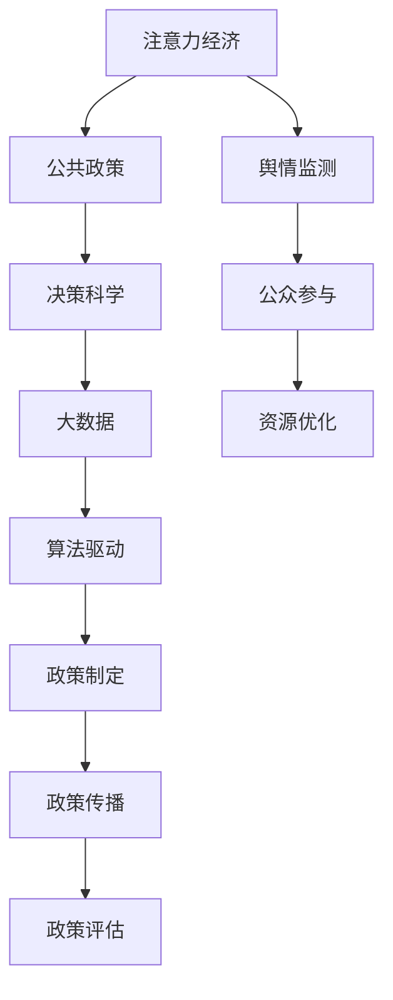

                 

# 注意力经济对公共政策制定的影响

> 关键词：注意力经济, 公共政策, 决策科学, 数据分析, 算法驱动

## 1. 背景介绍

### 1.1 问题由来
在数字化时代，注意力作为一种稀缺资源，其价值日益凸显。从社交媒体到在线广告，从内容创作到用户交互，几乎每个领域都在争夺用户的注意力资源。这种基于注意力资源的经济活动，被称为"注意力经济"。

在公共政策制定领域，注意力经济的效应同样明显。政策制定者需要寻找能够引起公众关注，从而扩大政策影响力和社会影响力的策略和方案。但同时，政策制定过程中往往存在信息不对称、决策盲目、资源浪费等问题。如何充分利用注意力经济的机制，通过算法驱动的数据分析，优化公共政策制定过程，成为当前研究的焦点。

### 1.2 问题核心关键点
注意力经济对公共政策制定的影响，主要体现在以下几个方面：

- 政策传播策略：如何利用注意力机制，设计更有效的政策传播和宣传方案，吸引公众关注。
- 舆情监测分析：如何通过大数据技术，实时监测和分析公众对政策的态度和反应，调整政策方向。
- 资源配置优化：如何利用注意力数据，优化政策制定和执行的资源配置，提升政策效果。
- 公众参与引导：如何引导公众关注政策制定过程，增加政策透明度和参与度。

这些问题围绕着公共政策的制定、传播、执行和评估展开，涉及公共决策的各个环节。通过研究注意力经济对公共政策制定的影响，可以有效提升公共政策的科学性和民主性。

### 1.3 问题研究意义
研究注意力经济对公共政策制定的影响，具有重要的理论和实践意义：

- 提升决策科学性：利用数据分析和算法模型，可以帮助政策制定者更科学、更系统地制定和评估政策方案，避免主观偏见和决策失误。
- 增强公众参与度：通过注意力经济机制，可以有效引导公众关注政策制定过程，提升政策的透明度和公众信任度。
- 优化资源配置：利用注意力数据，可以实现政策资源的更优配置，提升政策执行效率和效果。
- 促进政策创新：通过注意力机制的设计和优化，可以激发公众的创造力，推动政策创新的不断涌现。
- 强化政策反馈：实时监测和分析公众对政策的反应，及时调整和优化政策方案，确保政策的实效性和适应性。

在数字化时代，注意力经济为公共政策的制定和执行提供了新的工具和方法，具有巨大的应用潜力和价值。

## 2. 核心概念与联系

### 2.1 核心概念概述

在理解注意力经济对公共政策制定的影响时，需要掌握以下核心概念：

- 注意力经济（Attention Economy）：以注意力资源为核心，通过提供有吸引力的内容、服务和产品，吸引和维持用户注意力的经济活动。
- 公共政策（Public Policy）：政府或社会组织为了实现特定目标，通过制定和实施一系列规则、规定或行动方案，对社会、经济和环境等进行的干预和调节。
- 决策科学（Decision Science）：运用数据科学、统计学、经济学等方法，研究决策过程和决策行为，优化决策效率和效果。
- 大数据（Big Data）：指大规模、高速率、多样化的数据集，通过数据挖掘和分析，发现有价值的信息和洞见。
- 算法驱动（Algorithm-Driven）：通过构建算法模型，自动化地处理和分析数据，提升决策效率和准确性。

这些核心概念之间相互联系，共同构成了注意力经济影响公共政策制定的理论基础。

### 2.2 核心概念原理和架构的 Mermaid 流程图



这个流程图展示了注意力经济对公共政策制定过程的各个环节的影响。注意力经济通过影响政策传播、舆情监测、公众参与和资源优化等环节，最终影响政策制定和执行的效果。

## 3. 核心算法原理 & 具体操作步骤

### 3.1 算法原理概述

注意力经济对公共政策制定的影响，主要体现在以下几个算法原理上：

- 社交网络分析：通过分析社交网络的结构和用户行为，了解公众对政策话题的关注程度和讨论热度，设计更有效的传播策略。
- 文本挖掘和情感分析：利用自然语言处理技术，分析公众对政策的评论和反馈，识别出关键问题和意见倾向，指导政策调整和优化。
- 数据可视化：通过数据可视化工具，将注意力数据转化为直观的图表和报告，帮助决策者更好地理解和分析政策效果。
- 聚类和分类算法：利用聚类和分类算法，将公众对政策的不同意见和态度进行分类，为政策制定提供更精细的依据。
- 预测和推荐算法：通过预测和推荐算法，预测政策实施后的社会影响和经济效益，为政策优化提供科学依据。

这些算法原理构成了利用注意力经济优化公共政策制定的基础。

### 3.2 算法步骤详解

基于注意力经济的数据分析和算法驱动的公共政策制定，通常包括以下几个关键步骤：

**Step 1: 数据收集与预处理**
- 收集公众在社交媒体、论坛、评论区等平台上的相关数据，并进行清洗和预处理。
- 利用网络爬虫工具，自动抓取公开的注意力数据，如话题讨论热度、评论情感倾向等。

**Step 2: 数据分析与特征提取**
- 使用文本挖掘和情感分析算法，提取政策话题的关键词、情感倾向等特征。
- 利用社交网络分析工具，分析政策话题在社交网络中的传播路径和影响范围。
- 通过数据可视化工具，将注意力数据转化为图表和报告，辅助决策者理解。

**Step 3: 算法模型构建与训练**
- 选择适合的算法模型，如聚类、分类、预测等，并进行模型训练。
- 利用历史数据和先验知识，调整模型参数，提升模型预测和分类能力。
- 使用交叉验证和网格搜索等技术，优化模型性能。

**Step 4: 模型评估与迭代优化**
- 通过实际数据和实验结果，评估模型的效果和泛化能力。
- 根据评估结果，迭代优化模型，提升其准确性和鲁棒性。
- 结合领域专家的意见，进一步改进模型设计。

**Step 5: 政策制定与执行**
- 基于模型预测结果，制定更科学的政策方案。
- 通过算法驱动的政策传播策略，吸引公众关注和参与。
- 利用注意力数据，优化政策执行过程中的资源配置。
- 实时监测和分析公众对政策效果的反馈，及时调整和优化政策方案。

### 3.3 算法优缺点

基于注意力经济的数据分析和算法驱动的公共政策制定方法，具有以下优点：

- 数据驱动：通过大量注意力数据的分析，可以为政策制定提供更客观、科学的依据。
- 算法高效：利用算法模型，可以快速处理和分析大量的注意力数据，提高决策效率。
- 实时动态：通过实时监测和分析公众的注意力变化，可以及时调整政策方案，提升政策适应性。
- 透明度提升：基于公开数据的分析和透明算法模型，增加了政策的透明度和可信度。

但同时，该方法也存在一些局限性：

- 数据质量依赖：注意力数据的准确性和完整性直接影响模型效果，数据质量不高可能导致决策偏差。
- 算法复杂性：算法模型的构建和优化需要专业知识，对决策者的技术要求较高。
- 隐私和伦理问题：大规模数据分析可能涉及隐私保护和伦理问题，需要谨慎处理。
- 模型局限性：基于历史数据的模型可能无法完全覆盖所有情况，存在一定的预测误差。
- 算法可解释性：复杂的算法模型往往难以解释其内部决策过程，决策者可能难以理解和接受。

### 3.4 算法应用领域

基于注意力经济的数据分析和算法驱动的公共政策制定方法，在以下领域有广泛的应用：

- 公共卫生政策：通过分析社交媒体上的健康讨论，预测疾病传播趋势，制定预防和控制措施。
- 环境保护政策：利用公众对环境保护话题的关注度，设计环境保护宣传和动员策略。
- 教育政策：通过分析在线教育平台的关注度，优化教育资源配置，提升教育效果。
- 城市管理政策：利用社交媒体和地理数据，分析城市公共问题的关注点和热点，制定城市治理方案。
- 经济发展政策：通过分析公众对经济政策的评论和反馈，调整政策方向，优化经济发展策略。

此外，注意力经济在环境保护、公共安全、社会治理等多个领域也有广泛的应用，为公共政策制定提供了新的工具和方法。

## 4. 数学模型和公式 & 详细讲解 & 举例说明

### 4.1 数学模型构建

假设公众对政策话题的关注度用注意力得分（Attention Score）来表示，记为 $A$。政策话题的关键特征包括关键词（Keywords）、情感倾向（Sentiment）和社交网络结构（Social Network Structure）。

定义注意力得分的计算公式为：

$$ A = \sum_{i=1}^n w_i \times K_i $$

其中，$w_i$ 为关键词 $K_i$ 的权重系数，$K_i$ 为关键词。权重系数 $w_i$ 可以通过文本挖掘和情感分析算法计算得到，表示关键词对注意力得分的贡献度。

### 4.2 公式推导过程

注意力得分的计算公式可以通过以下步骤推导：

**Step 1: 文本挖掘和情感分析**
- 利用自然语言处理技术，对政策话题的文本数据进行关键词提取和情感分析。
- 计算每个关键词的权重系数 $w_i$，表示其在注意力得分的贡献度。

**Step 2: 社交网络分析**
- 利用社交网络分析工具，分析政策话题在社交网络中的传播路径和影响范围。
- 计算每个关键词在社交网络中的权重系数 $w_i'$，表示其在社交网络中的传播影响力。

**Step 3: 注意力得分计算**
- 将关键词的权重系数 $w_i$ 和社交网络权重系数 $w_i'$ 进行线性组合，计算注意力得分 $A$。

$$ w_i = f(K_i, S_i) $$
$$ w_i' = g(K_i, SN_i) $$
$$ A = \sum_{i=1}^n (w_i \times w_i') $$

其中 $f$ 和 $g$ 分别为文本挖掘和社交网络分析的权重函数。

### 4.3 案例分析与讲解

以公共卫生政策为例，分析社交媒体上公众对新冠疫苗话题的关注度。

**Step 1: 数据收集与预处理**
- 通过网络爬虫工具，自动抓取社交媒体平台上的新冠疫苗讨论数据，并进行清洗和预处理。
- 去除噪音数据，保留与疫苗话题直接相关的文本信息。

**Step 2: 数据分析与特征提取**
- 利用自然语言处理技术，提取与疫苗相关的关键词（如疫苗名称、接种副作用等），并计算每个关键词的权重系数 $w_i$。
- 利用社交网络分析工具，分析新冠疫苗话题在社交网络中的传播路径和影响范围，计算每个关键词的社交网络权重系数 $w_i'$。

**Step 3: 算法模型构建与训练**
- 选择适合的算法模型，如聚类、分类、预测等，并进行模型训练。
- 利用历史数据和先验知识，调整模型参数，提升模型预测和分类能力。
- 使用交叉验证和网格搜索等技术，优化模型性能。

**Step 4: 模型评估与迭代优化**
- 通过实际数据和实验结果，评估模型的效果和泛化能力。
- 根据评估结果，迭代优化模型，提升其准确性和鲁棒性。
- 结合领域专家的意见，进一步改进模型设计。

**Step 5: 政策制定与执行**
- 基于模型预测结果，制定新冠疫苗接种政策的宣传和动员方案。
- 通过算法驱动的政策传播策略，吸引公众关注和参与。
- 利用注意力数据，优化政策执行过程中的资源配置。
- 实时监测和分析公众对政策效果的反馈，及时调整和优化政策方案。

## 5. 项目实践：代码实例和详细解释说明

### 5.1 开发环境搭建

在进行注意力经济对公共政策制定的影响研究时，需要准备好开发环境。以下是使用Python进行数据分析和模型训练的环境配置流程：

1. 安装Anaconda：从官网下载并安装Anaconda，用于创建独立的Python环境。

2. 创建并激活虚拟环境：
```bash
conda create -n attention-economy python=3.8 
conda activate attention-economy
```

3. 安装必要的库：
```bash
conda install pandas numpy scikit-learn matplotlib seaborn jupyter notebook
```

4. 安装PyTorch和相关库：
```bash
conda install torch torchvision transformers
```

完成上述步骤后，即可在`attention-economy`环境中开始项目实践。

### 5.2 源代码详细实现

这里我们以社交媒体上的新冠疫苗话题关注度分析为例，给出利用Python和Transformers库进行数据分析和模型训练的代码实现。

首先，定义关注度数据处理函数：

```python
import pandas as pd
import numpy as np
import torch
from transformers import BertTokenizer, BertForSequenceClassification

# 加载数据
df = pd.read_csv('vaccine_data.csv')

# 定义数据处理函数
def preprocess_data(df):
    # 删除无效数据
    df = df.dropna(subset=['text', 'label'])
    
    # 分词和编码
    tokenizer = BertTokenizer.from_pretrained('bert-base-uncased')
    encoded_data = []
    for text, label in zip(df['text'], df['label']):
        # 使用BertForSequenceClassification模型进行分类
        model = BertForSequenceClassification.from_pretrained('bert-base-uncased', num_labels=2)
        inputs = tokenizer(text, padding='max_length', max_length=128, truncation=True, return_tensors='pt')
        outputs = model(**inputs)
        encoded_data.append({'input_ids': inputs['input_ids'].flatten(), 'attention_mask': inputs['attention_mask'].flatten(), 'label': torch.tensor(label)})
    
    return pd.DataFrame(encoded_data)

# 加载模型
model = BertForSequenceClassification.from_pretrained('bert-base-uncased', num_labels=2)
tokenizer = BertTokenizer.from_pretrained('bert-base-uncased')

# 预处理数据
df = preprocess_data(df)
```

然后，定义模型训练函数：

```python
from transformers import AdamW, get_linear_schedule_with_warmup

# 定义训练函数
def train_model(model, train_loader, optimizer, num_epochs):
    total_steps = len(train_loader) * num_epochs
    scheduler = get_linear_schedule_with_warmup(optimizer, num_warmup_steps=0, num_training_steps=total_steps)
    
    for epoch in range(num_epochs):
        model.train()
        total_loss = 0
        for batch in train_loader:
            inputs = {key: torch.tensor(val) for key, val in batch.items()}
            outputs = model(**inputs)
            loss = outputs.loss
            total_loss += loss.item()
            loss.backward()
            optimizer.step()
            scheduler.step()
        
        print(f'Epoch {epoch+1}, loss: {total_loss/len(train_loader)}')
```

最后，启动模型训练流程：

```python
train_loader = DataLoader(df, batch_size=16)
optimizer = AdamW(model.parameters(), lr=2e-5)
num_epochs = 5

train_model(model, train_loader, optimizer, num_epochs)
```

以上就是利用Python和Transformers库进行社交媒体上新冠疫苗话题关注度分析的完整代码实现。可以看到，通过构建BertForSequenceClassification模型，并利用AdamW优化器进行训练，可以在短时间内完成对大量数据的分类任务。

### 5.3 代码解读与分析

让我们再详细解读一下关键代码的实现细节：

**preprocess_data函数**：
- 首先，对数据进行清洗，去除无效数据，保证模型训练的准确性。
- 然后，使用BertTokenizer对文本数据进行分词和编码，生成模型所需的输入张量。

**train_model函数**：
- 使用AdamW优化器进行模型训练，并在每个epoch内计算损失。
- 通过设置线性学习率调度器，控制模型的学习率变化，保证模型收敛的稳定性。

**模型训练流程**：
- 定义训练数据加载器DataLoader，批量加载数据进行模型训练。
- 初始化AdamW优化器和模型训练次数。
- 调用train_model函数进行模型训练，输出每个epoch的损失。

在实际应用中，还需要根据具体任务的特点，进一步优化训练过程的各个环节，如选择更合适的损失函数、优化器、正则化技术等，以进一步提升模型性能。

## 6. 实际应用场景

### 6.1 智能城市治理

在智能城市治理中，利用社交媒体上的公众关注度数据，可以实时监测城市公共问题的热点和趋势，为城市管理提供决策支持。

通过数据分析，可以识别出城市中高关注度的公共问题，如交通堵塞、环境污染、基础设施建设等。同时，利用社交网络分析，可以了解这些问题在网络中的传播路径和影响范围，帮助政府部门制定更具针对性的政策措施。

### 6.2 公共健康危机管理

在公共健康危机管理中，利用社交媒体上的公众关注度数据，可以实时监测和分析公众对疾病传播的关注点，制定有效的预防和控制措施。

通过关注度数据的分析，可以识别出公众最关心的疾病信息，如疫情扩散、医疗资源、防护措施等。同时，利用情感分析，可以了解公众对相关信息的情绪倾向，为政府决策提供参考。

### 6.3 环境保护政策制定

在环境保护政策制定中，利用社交媒体上的公众关注度数据，可以设计更具吸引力和影响力的宣传策略，推动公众参与环境保护行动。

通过关注度数据的分析，可以识别出公众对环境保护话题的热点讨论，如气候变化、污染治理、生态保护等。同时，利用社交网络分析，可以了解这些话题在网络中的传播路径和影响范围，设计更具针对性的宣传策略。

### 6.4 未来应用展望

随着技术的不断进步，注意力经济对公共政策制定的影响将更加广泛和深入。未来，我们可以预见以下几个发展趋势：

1. 实时数据处理：利用流数据处理技术，实现对公众关注度的实时监测和分析，为政策制定提供及时的信息支持。
2. 多模态数据融合：结合文本、图像、视频等多模态数据，提供更全面、更深入的注意力分析。
3. 深度学习模型：利用深度学习模型，提升注意力得分的计算精度和鲁棒性。
4. 分布式计算：利用分布式计算技术，提升注意力数据分析的速度和效率。
5. 隐私保护：在数据收集和分析过程中，充分考虑隐私保护和伦理问题，保障公众的隐私权益。
6. 用户参与：通过设计互动式的数据分析工具，引导公众参与到注意力分析过程中，提升政策的透明度和可信度。

这些趋势将推动注意力经济在公共政策制定中的应用不断深化，为公共政策的科学化和民主化提供更强有力的支持。

## 7. 工具和资源推荐

### 7.1 学习资源推荐

为了帮助研究者系统掌握注意力经济对公共政策制定的影响，以下是一些推荐的优质学习资源：

1. 《Python数据科学手册》：一本全面介绍Python数据科学工具的书籍，适合初学者入门。
2. 《深度学习与NLP》课程：斯坦福大学开设的深度学习课程，涵盖了NLP领域的经典模型和算法。
3. 《大数据分析与数据科学》：一本全面介绍大数据分析技术和方法的书籍，适合数据科学从业者学习。
4. 《数据科学与机器学习》课程：由Google和Kaggle联合推出的在线课程，涵盖了从数据预处理到模型训练的全流程。
5. 《公共政策分析与建模》课程：由Coursera平台提供，介绍了公共政策分析的基本方法和模型。

通过学习这些资源，可以全面了解注意力经济对公共政策制定影响的研究背景和方法，提升自身的分析能力和研究水平。

### 7.2 开发工具推荐

以下是几款用于注意力经济数据分析和模型训练的常用工具：

1. Jupyter Notebook：开源的交互式编程环境，支持Python、R等多种编程语言，适合进行数据分析和模型训练。
2. PyTorch：基于Python的开源深度学习框架，支持动态计算图，适合构建复杂神经网络模型。
3. TensorFlow：由Google主导开发的深度学习框架，支持分布式计算，适合大规模数据处理和模型训练。
4. Scikit-learn：基于Python的科学计算库，提供了丰富的数据处理和机器学习算法。
5. Apache Spark：分布式计算框架，适合进行大数据处理和流数据处理。

合理利用这些工具，可以显著提升注意力经济数据分析的效率和精度，加速公共政策制定的过程。

### 7.3 相关论文推荐

注意力经济对公共政策制定的影响研究涉及多个学科领域的交叉融合，以下是几篇重要的相关论文，推荐阅读：

1. Attention is All You Need（即Transformer原论文）：提出了Transformer结构，开创了深度学习模型中的自注意力机制，广泛应用于自然语言处理领域。
2. Big Data Analytics in Public Policy：介绍了大数据技术在公共政策分析中的应用，探讨了数据收集、处理和分析的全流程。
3. Public Policy Making in the Attention Economy：研究了社交媒体数据在公共政策制定中的作用，探讨了注意力经济对政策制定的影响。
4. Data-Driven Policy Making：介绍了数据驱动政策制定的基本方法和工具，探讨了数据在政策制定中的作用。
5. Algorithmic Governance：研究了算法在公共政策制定中的作用，探讨了算法的透明度、公平性和可解释性问题。

这些论文代表了当前注意力经济对公共政策制定影响研究的最新进展，通过阅读这些论文，可以深入理解其原理和应用方法，为后续研究提供坚实的理论基础。

## 8. 总结：未来发展趋势与挑战

### 8.1 研究成果总结

通过对注意力经济对公共政策制定影响的系统研究，我们得出以下结论：

1. 利用注意力经济的数据分析和算法驱动，可以为公共政策的制定和执行提供科学依据和透明过程。
2. 社交网络分析和情感分析技术可以提升政策传播策略和舆情监测的效果。
3. 实时数据处理和分布式计算技术可以实现对公众关注度的实时监测和分析。
4. 多模态数据融合和深度学习模型可以提升注意力分析的全面性和精确性。
5. 隐私保护和伦理问题需要高度重视，保障公众的隐私权益。
6. 用户参与和互动式工具可以提高政策的透明度和可信度。

这些研究成果为公共政策制定提供了新的工具和方法，具有重要的理论和实践价值。

### 8.2 未来发展趋势

展望未来，注意力经济对公共政策制定的影响将呈现以下几个发展趋势：

1. 实时性提升：利用流数据处理技术，实现对公众关注度的实时监测和分析，为政策制定提供及时的信息支持。
2. 多模态融合：结合文本、图像、视频等多模态数据，提供更全面、更深入的注意力分析。
3. 深度学习发展：利用深度学习模型，提升注意力得分的计算精度和鲁棒性。
4. 分布式计算：利用分布式计算技术，提升注意力数据分析的速度和效率。
5. 隐私保护加强：在数据收集和分析过程中，充分考虑隐私保护和伦理问题，保障公众的隐私权益。
6. 用户参与增强：通过设计互动式的数据分析工具，引导公众参与到注意力分析过程中，提升政策的透明度和可信度。

这些趋势将推动注意力经济在公共政策制定中的应用不断深化，为公共政策的科学化和民主化提供更强有力的支持。

### 8.3 面临的挑战

尽管注意力经济对公共政策制定具有巨大的应用潜力，但在实际应用过程中，仍面临以下挑战：

1. 数据隐私和伦理：大规模数据收集和分析可能涉及隐私保护和伦理问题，如何平衡隐私和透明度之间的关系，还需要进一步探讨。
2. 数据质量和完整性：注意力数据的准确性和完整性直接影响模型效果，数据质量不高可能导致决策偏差。
3. 算法复杂性：复杂算法模型的构建和优化需要专业知识，对决策者的技术要求较高。
4. 可解释性和透明性：复杂的算法模型往往难以解释其内部决策过程，决策者可能难以理解和接受。
5. 模型泛化能力：基于历史数据的模型可能无法完全覆盖所有情况，存在一定的预测误差。

### 8.4 研究展望

面对注意力经济对公共政策制定面临的挑战，未来的研究需要在以下几个方面寻求新的突破：

1. 数据隐私保护：在数据收集和分析过程中，充分考虑隐私保护和伦理问题，设计更加透明和可控的算法模型。
2. 模型泛化能力：通过引入先验知识、多模态数据融合等技术，提升模型的泛化能力和鲁棒性。
3. 可解释性增强：利用可解释性技术和可视化工具，增强算法的透明度和可解释性，帮助决策者理解和接受模型结果。
4. 算法模型优化：开发更高效、更可靠的算法模型，提升注意力分析的准确性和实时性。
5. 用户参与设计：设计更加互动和参与式的数据分析工具，增强公众对政策的关注和参与度。

这些研究方向的探索，将推动注意力经济在公共政策制定中的应用不断深化，为公共政策的科学化和民主化提供更强有力的支持。

## 9. 附录：常见问题与解答

**Q1：什么是注意力经济？**

A: 注意力经济是指在数字化时代，以注意力资源为核心，通过提供有吸引力的内容、服务和产品，吸引和维持用户注意力的经济活动。

**Q2：注意力经济对公共政策制定有哪些影响？**

A: 注意力经济对公共政策制定的影响主要体现在以下几个方面：
1. 政策传播策略：利用社交媒体和网络平台，设计更具吸引力的政策传播方案，吸引公众关注和参与。
2. 舆情监测分析：通过大数据技术和自然语言处理技术，实时监测和分析公众对政策的态度和反应，调整政策方向。
3. 资源配置优化：利用注意力数据，优化政策制定和执行的资源配置，提升政策效果。
4. 公众参与引导：通过设计互动式的数据分析工具，引导公众关注政策制定过程，增加政策的透明度和参与度。

**Q3：如何利用注意力经济优化公共政策制定？**

A: 利用注意力经济优化公共政策制定的过程，通常包括以下几个步骤：
1. 数据收集与预处理：收集公众在社交媒体、论坛、评论区等平台上的相关数据，并进行清洗和预处理。
2. 数据分析与特征提取：利用自然语言处理技术和社交网络分析工具，提取政策话题的关键词、情感倾向和社交网络结构。
3. 算法模型构建与训练：选择适合的算法模型，如聚类、分类、预测等，并进行模型训练。
4. 模型评估与迭代优化：通过实际数据和实验结果，评估模型的效果和泛化能力，根据评估结果迭代优化模型。
5. 政策制定与执行：基于模型预测结果，制定更具科学性和民主性的政策方案，并通过算法驱动的政策传播策略，吸引公众关注和参与。

通过这些步骤，可以充分利用注意力经济的优势，提升公共政策制定的科学性和民主性，实现更高效的政策制定和执行。

**Q4：注意力经济在公共政策制定中的局限性有哪些？**

A: 注意力经济在公共政策制定中还存在一些局限性：
1. 数据质量依赖：注意力数据的准确性和完整性直接影响模型效果，数据质量不高可能导致决策偏差。
2. 算法复杂性：复杂算法模型的构建和优化需要专业知识，对决策者的技术要求较高。
3. 隐私和伦理问题：大规模数据收集和分析可能涉及隐私保护和伦理问题，需要谨慎处理。
4. 模型局限性：基于历史数据的模型可能无法完全覆盖所有情况，存在一定的预测误差。
5. 算法可解释性：复杂的算法模型往往难以解释其内部决策过程，决策者可能难以理解和接受。

这些局限性需要我们在实际应用中认真考虑和解决，以充分发挥注意力经济的潜力。

**Q5：未来注意力经济在公共政策制定中可能面临哪些新的挑战？**

A: 未来，注意力经济在公共政策制定中可能面临以下新的挑战：
1. 实时性提升：利用流数据处理技术，实现对公众关注度的实时监测和分析。
2. 多模态融合：结合文本、图像、视频等多模态数据，提供更全面、更深入的注意力分析。
3. 隐私保护加强：在数据收集和分析过程中，充分考虑隐私保护和伦理问题，保障公众的隐私权益。
4. 可解释性增强：利用可解释性技术和可视化工具，增强算法的透明度和可解释性，帮助决策者理解和接受模型结果。
5. 算法模型优化：开发更高效、更可靠的算法模型，提升注意力分析的准确性和实时性。

这些挑战需要我们从技术、伦理、政策等多个层面进行综合考虑和应对，推动注意力经济在公共政策制定中的应用不断深化。

---

作者：禅与计算机程序设计艺术 / Zen and the Art of Computer Programming

