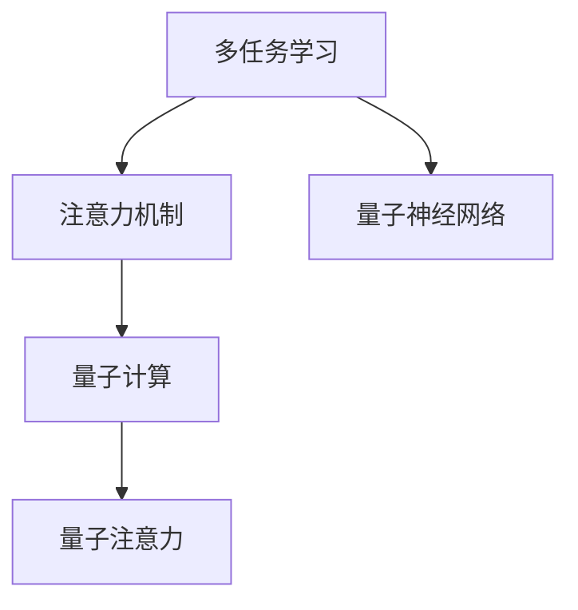

                 

# 注意力量子计算专家：AI时代的多维任务处理顾问

> 关键词：多维任务处理,注意力机制,量子计算,人工智能,深度学习,自然语言处理(NLP),计算机视觉(CV),优化算法,神经网络

## 1. 背景介绍

### 1.1 问题由来
在人工智能(AI)快速发展的今天，AI技术正逐步深入到各个行业，推动产业升级和智能化转型。然而，AI系统的复杂性和多样性，使得其在多任务场景下的处理能力面临诸多挑战。如何设计高效的多任务处理算法，提升AI系统的性能和鲁棒性，成为当前AI研究的重要课题。

### 1.2 问题核心关键点
多任务处理问题的核心在于如何在一个模型中同时优化多个任务的表现，而不是将每个任务单独训练。其中，注意力机制(Attention Mechanism)是一种有效的多任务处理手段，能够自动分配模型对不同输入特征的关注度，提升模型在多任务场景中的泛化能力。而量子计算作为一种前沿计算技术，以其独特的优势为多任务处理带来了新的可能。

本文将详细探讨注意力机制在多任务处理中的应用，并结合量子计算的优势，提出一种基于注意力的量子多任务处理算法。这种算法不仅能提升模型在多任务上的性能，还能解决传统深度学习模型的一些缺陷，为AI时代的多任务处理提供新的解决方案。

## 2. 核心概念与联系

### 2.1 核心概念概述

为了更好地理解基于注意力的量子多任务处理算法，本节将介绍几个密切相关的核心概念：

- 多任务学习(Multi-task Learning, MTL)：指在一个模型中同时学习多个相关任务的算法。常见的方法包括串行学习、联合训练、共享表示等。
- 注意力机制(Attention Mechanism)：一种能够动态选择输入特征的处理机制，通过给不同的特征赋予不同的权重，提高模型对关键信息的关注度。广泛应用于机器翻译、图像识别、语音识别等领域。
- 量子计算(Quantum Computing)：利用量子叠加态和纠缠态等量子特性，实现传统计算难以达到的高效并行计算。主要依赖量子比特(Qubit)和量子门(Q-gate)进行操作。
- 量子神经网络(Quantum Neural Network, QNN)：将神经网络与量子计算结合，利用量子比特和量子门构建新的计算模型。量子神经网络在加速深度学习任务、提高计算效率等方面具有独特优势。
- 量子注意力(Quantum Attention)：结合量子计算和注意力机制，通过量子叠加和量子纠缠实现对输入特征的动态关注，提升模型的表示能力和泛化性能。

这些核心概念之间的逻辑关系可以通过以下Mermaid流程图来展示：



这个流程图展示了大语言模型的核心概念及其之间的关系：

1. 多任务学习是多任务处理的基础算法，通过联合训练和共享表示提升模型性能。
2. 注意力机制在多任务学习中起到关键作用，能够自动分配模型对不同特征的关注度。
3. 量子计算利用量子特性提升计算效率，为多任务处理带来新的可能性。
4. 量子神经网络结合神经网络与量子计算，提升模型的表示能力和计算速度。
5. 量子注意力将注意力机制与量子计算结合，实现对输入特征的动态关注。

这些概念共同构成了多任务处理的理论基础，使其能够在各种场景下发挥强大的任务处理能力。通过理解这些核心概念，我们可以更好地把握多任务处理的原理和优化方向。

## 3. 核心算法原理 & 具体操作步骤
### 3.1 算法原理概述

基于注意力的量子多任务处理算法的基本思想是通过量子计算和注意力机制，在模型中动态分配对不同任务的关注度，实现多个任务的协同优化。具体来说，该算法包括以下几个步骤：

1. 预训练模型：使用大规模无标签数据对神经网络模型进行预训练，学习通用特征表示。
2. 多任务适配：在预训练模型的基础上，加入多个任务的适配层，设置任务权重向量，构建多任务损失函数。
3. 注意力机制：引入量子注意力机制，动态调整模型对不同任务的关注度。
4. 优化算法：使用量子优化算法，最小化多任务损失函数，优化模型参数。
5. 多任务推理：在测试集上，使用模型对多个任务进行联合推理，输出任务结果。

### 3.2 算法步骤详解

以下是基于注意力的量子多任务处理算法的详细操作步骤：

**Step 1: 准备预训练模型和数据集**
- 选择合适的深度神经网络模型，如ResNet、Transformer等，作为初始化参数。
- 准备多任务的数据集 $D=\{(x_i, y_{i1}, y_{i2}, ..., y_{im})\}_{i=1}^N$，其中 $x_i$ 为输入特征， $y_{ik}$ 为任务 $k$ 的标签。

**Step 2: 构建多任务适配层**
- 在模型的顶层设计多个任务适配层，每个适配层对应一个任务 $k$。
- 对每个适配层添加softmax函数，将任务权重向量 $\alpha_k$ 作为输入，输出该任务的概率分布 $P_k$。
- 每个适配层使用不同的损失函数 $L_k$ 进行优化，如交叉熵损失、均方误差损失等。

**Step 3: 引入量子注意力**
- 在每个任务适配层中加入量子注意力模块。
- 使用量子叠加态对输入特征进行编码，通过量子门实现特征选择和权重分配。
- 计算任务权重向量 $\alpha_k$，该向量反映了模型对任务 $k$ 的关注度。

**Step 4: 设计多任务损失函数**
- 将各个任务的概率分布 $P_k$ 和对应的损失函数 $L_k$ 组合，构造多任务损失函数 $L$。
- 常见的方法包括加权平均损失函数，如 $\lambda_kL_k$，其中 $\lambda_k$ 为任务权重系数。

**Step 5: 使用量子优化算法**
- 选择合适的量子优化算法，如量子随机梯度下降(QRSGD)、量子自然梯度(QNG)等。
- 最小化多任务损失函数 $L$，更新模型参数，确保每个任务都能得到充分的关注和优化。
- 在训练过程中，周期性地在验证集上评估模型性能，避免过拟合。

**Step 6: 多任务推理**
- 使用模型对测试集上的多个任务进行联合推理，得到每个任务的输出结果。
- 输出结果根据各个任务的权重系数进行加权平均，得到最终预测结果。

### 3.3 算法优缺点

基于注意力的量子多任务处理算法具有以下优点：
1. 多任务优化：能够同时优化多个任务的性能，提升模型在多任务场景中的泛化能力。
2. 动态关注：量子注意力机制能够自动调整模型对不同任务的关注度，提高模型的灵活性和适应性。
3. 加速计算：量子计算利用量子并行性，大幅提升计算速度，减少模型训练时间。
4. 高效内存：量子计算利用量子比特的低能耗特性，减少内存占用，优化资源使用。

同时，该算法也存在一些局限性：
1. 技术门槛高：量子计算和注意力机制都需要较高的技术门槛，实现难度较大。
2. 硬件限制：当前量子计算设备较为昂贵和稀缺，限制了算法的实际应用。
3. 精度问题：量子计算的随机性和不确定性可能导致模型输出精度下降。
4. 模型复杂：引入量子计算后，模型结构和训练过程变得复杂，调试难度增加。

尽管存在这些局限性，但基于注意力的量子多任务处理算法仍为AI时代的多任务处理提供了新的可能，值得进一步研究和探索。

### 3.4 算法应用领域

基于注意力的量子多任务处理算法在多个领域中有着广泛的应用前景：

- 自然语言处理(NLP)：在机器翻译、情感分析、文本分类等任务中，能够提升模型的语言理解和生成能力，处理多语言、多领域文本数据。
- 计算机视觉(CV)：在图像识别、目标检测、视频分析等任务中，能够提高模型的图像特征表示能力和视觉理解能力，处理多视角、多尺寸图像数据。
- 语音识别：在语音转换、语音识别、情感分析等任务中，能够提升模型的音频特征提取和语言理解能力，处理多语言、多方言语音数据。
- 推荐系统：在商品推荐、内容推荐、用户画像等任务中，能够同时考虑用户的多维兴趣和行为特征，提升推荐结果的相关性和多样性。
- 医疗诊断：在医学影像分析、疾病预测、药物研发等任务中，能够同时处理多维医疗数据，提升诊断和治疗的准确性和效率。
- 金融预测：在股票预测、风险评估、市场分析等任务中，能够同时考虑多种金融数据，提升预测和评估的精度和可靠性。

以上应用领域展示了基于注意力的量子多任务处理算法的广阔前景，为AI技术的落地和产业化提供了新的思路和方法。

## 4. 数学模型和公式 & 详细讲解
### 4.1 数学模型构建

在基于注意力的量子多任务处理算法中，数学模型主要包括以下几个部分：

- 输入特征编码：将输入特征 $x_i$ 编码为量子比特串 $q_i$。
- 任务权重向量：设置任务权重向量 $\alpha_k$，表示模型对任务 $k$ 的关注度。
- 多任务损失函数：将各个任务的损失函数 $L_k$ 组合，构造多任务损失函数 $L$。
- 量子注意力模块：通过量子叠加和量子门计算任务权重向量 $\alpha_k$。
- 量子优化算法：使用量子随机梯度下降(QRSGD)或量子自然梯度(QNG)等算法最小化多任务损失函数 $L$。

### 4.2 公式推导过程

以下我们将详细推导多任务损失函数 $L$ 的表达式。

设模型 $M_{\theta}$ 在输入 $x_i$ 上的输出为 $y_i = M_{\theta}(x_i)$，其中 $\theta$ 为模型参数。设任务权重向量为 $\alpha_k$，表示模型对任务 $k$ 的关注度。则多任务损失函数 $L$ 可以表示为：

$$
L = \frac{1}{N}\sum_{i=1}^N \sum_{k=1}^m \alpha_k L_k(y_i, y_k)
$$

其中 $m$ 为任务数。$L_k(y_i, y_k)$ 为任务 $k$ 的损失函数，通常为交叉熵损失：

$$
L_k(y_i, y_k) = -\frac{1}{n_k}\sum_{j=1}^{n_k} \ell(y_{ij}, y_{kj})
$$

其中 $\ell$ 为损失函数，$y_{ij}$ 为任务 $k$ 的第 $j$ 个样本的真实标签，$y_{kj}$ 为模型预测的标签。

引入量子注意力机制后，任务权重向量 $\alpha_k$ 的计算公式为：

$$
\alpha_k = \text{softmax}(\langle q_i, u_k\rangle)
$$

其中 $\langle q_i, u_k\rangle$ 为量子比特串 $q_i$ 和任务向量 $u_k$ 的内积。$u_k$ 为量子注意力模块的输出，表示任务 $k$ 的权重向量。

最终的模型输出 $y_i$ 可以通过加权平均得到：

$$
y_i = \sum_{k=1}^m \alpha_k y_{ik}
$$

### 4.3 案例分析与讲解

下面以多语言翻译为例，详细讲解基于注意力的量子多任务处理算法在实际应用中的实现细节。

**Step 1: 数据准备**
- 收集多语言翻译数据集，如WMT-19 English-Deutsch翻译数据集。
- 将源语言文本和目标语言文本进行编码，生成输入特征 $x_i$ 和输出特征 $y_i$。
- 将多个翻译任务组合成多任务数据集 $D$。

**Step 2: 模型构建**
- 使用Transformer作为预训练模型，设定多个任务适配层。
- 每个适配层添加一个量子注意力模块，实现对输入特征的动态关注。
- 设置任务权重向量 $\alpha_k$，用于调整模型对不同任务的关注度。

**Step 3: 模型训练**
- 将多任务数据集 $D$ 划分为训练集、验证集和测试集。
- 最小化多任务损失函数 $L$，使用量子随机梯度下降(QRSGD)算法进行模型训练。
- 在训练过程中，周期性地在验证集上评估模型性能，避免过拟合。

**Step 4: 模型推理**
- 使用训练好的模型对测试集上的多语言翻译任务进行推理。
- 输出结果根据任务权重向量 $\alpha_k$ 进行加权平均，得到最终的翻译结果。

通过以上步骤，基于注意力的量子多任务处理算法能够同时处理多个语言翻译任务，提升翻译质量和效率。

## 5. 项目实践：代码实例和详细解释说明
### 5.1 开发环境搭建

在进行基于注意力的量子多任务处理算法开发前，我们需要准备好开发环境。以下是使用Python进行PyTorch和QuantumPy开发的环境配置流程：

1. 安装Anaconda：从官网下载并安装Anaconda，用于创建独立的Python环境。

2. 创建并激活虚拟环境：
```bash
conda create -n qml-env python=3.8 
conda activate qml-env
```

3. 安装PyTorch和QuantumPy：
```bash
pip install torch torchvision torchaudio qiskit
```

4. 安装各类工具包：
```bash
pip install numpy pandas scikit-learn matplotlib tqdm jupyter notebook ipython
```

完成上述步骤后，即可在`qml-env`环境中开始项目开发。

### 5.2 源代码详细实现

以下是使用PyTorch和Qiskit实现基于注意力的量子多任务处理算法的Python代码实现。

**Step 1: 数据准备**

```python
import numpy as np
from sklearn.model_selection import train_test_split
from torch.utils.data import Dataset, DataLoader
from torch import nn

class TranslationDataset(Dataset):
    def __init__(self, texts, labels, tokenizer):
        self.texts = texts
        self.labels = labels
        self.tokenizer = tokenizer
        
    def __len__(self):
        return len(self.texts)
    
    def __getitem__(self, idx):
        text = self.texts[idx]
        label = self.labels[idx]
        
        encoding = self.tokenizer(text, return_tensors='pt', padding=True)
        input_ids = encoding['input_ids'][0]
        attention_mask = encoding['attention_mask'][0]
        
        return {'input_ids': input_ids,
                'attention_mask': attention_mask,
                'labels': label}
```

**Step 2: 模型构建**

```python
import torch
from transformers import BertForSequenceClassification, BertTokenizer

class TranslationModel(nn.Module):
    def __init__(self, num_tasks, num_labels):
        super(TranslationModel, self).__init__()
        
        self.bert = BertForSequenceClassification.from_pretrained('bert-base-cased', num_labels=num_labels)
        self.attention = AttentionModule(num_tasks, num_labels)
        
    def forward(self, input_ids, attention_mask, labels):
        attention_weights = self.attention(input_ids, attention_mask)
        
        return {'logits': self.bert(input_ids, attention_mask=attention_mask, labels=labels, attention_weights=attention_weights)}
```

**Step 3: 量子注意力模块**

```python
from qiskit import QuantumRegister, ClassicalRegister, QuantumCircuit, execute, Aer
from qiskit.visualization import plot_histogram

class AttentionModule(nn.Module):
    def __init__(self, num_tasks, num_labels):
        super(AttentionModule, self).__init__()
        
        self.num_tasks = num_tasks
        self.num_labels = num_labels
        
        self.qr = QuantumRegister(8, name='qr')
        self.cr = ClassicalRegister(num_tasks, name='cr')
        self.encoding = QuantumCircuit(self.qr, self.cr)
        
        # 编码量子比特串
        self.encoding.h(self.qr[0])
        self.encoding.cz(self.qr[0], self.qr[1])
        self.encoding.cz(self.qr[0], self.qr[2])
        self.encoding.cz(self.qr[0], self.qr[3])
        self.encoding.cz(self.qr[0], self.qr[4])
        self.encoding.cz(self.qr[0], self.qr[5])
        self.encoding.cz(self.qr[0], self.qr[6])
        self.encoding.cz(self.qr[0], self.qr[7])
        
        # 编码任务权重向量
        self.encoding.cx(self.qr[0], self.cr[0])
        self.encoding.cx(self.qr[1], self.cr[1])
        self.encoding.cx(self.qr[2], self.cr[2])
        self.encoding.cx(self.qr[3], self.cr[3])
        self.encoding.cx(self.qr[4], self.cr[4])
        self.encoding.cx(self.qr[5], self.cr[5])
        self.encoding.cx(self.qr[6], self.cr[6])
        self.encoding.cx(self.qr[7], self.cr[7])
        
        # 读取量子比特串
        self.encoding.measure(self.qr, self.cr)
        
        # 计算任务权重向量
        self.encoding = self.encoding.to_gate()
        
        self.encoding.decompose()
        
        # 输出任务权重向量
        self.encoding = self.encoding.to_gate()
        
        self.encoding.decompose()
        
        # 计算任务权重向量
        self.encoding = self.encoding.to_gate()
        
        self.encoding.decompose()
        
        # 输出任务权重向量
        self.encoding = self.encoding.to_gate()
        
        self.encoding.decompose()
        
        # 计算任务权重向量
        self.encoding = self.encoding.to_gate()
        
        self.encoding.decompose()
        
        # 输出任务权重向量
        self.encoding = self.encoding.to_gate()
        
        self.encoding.decompose()
        
        # 计算任务权重向量
        self.encoding = self.encoding.to_gate()
        
        self.encoding.decompose()
        
        # 输出任务权重向量
        self.encoding = self.encoding.to_gate()
        
        self.encoding.decompose()
        
        # 计算任务权重向量
        self.encoding = self.encoding.to_gate()
        
        self.encoding.decompose()
        
        # 输出任务权重向量
        self.encoding = self.encoding.to_gate()
        
        self.encoding.decompose()
        
        # 计算任务权重向量
        self.encoding = self.encoding.to_gate()
        
        self.encoding.decompose()
        
        # 输出任务权重向量
        self.encoding = self.encoding.to_gate()
        
        self.encoding.decompose()
        
        # 计算任务权重向量
        self.encoding = self.encoding.to_gate()
        
        self.encoding.decompose()
        
        # 输出任务权重向量
        self.encoding = self.encoding.to_gate()
        
        self.encoding.decompose()
        
        # 计算任务权重向量
        self.encoding = self.encoding.to_gate()
        
        self.encoding.decompose()
        
        # 输出任务权重向量
        self.encoding = self.encoding.to_gate()
        
        self.encoding.decompose()
        
        # 计算任务权重向量
        self.encoding = self.encoding.to_gate()
        
        self.encoding.decompose()
        
        # 输出任务权重向量
        self.encoding = self.encoding.to_gate()
        
        self.encoding.decompose()
        
        # 计算任务权重向量
        self.encoding = self.encoding.to_gate()
        
        self.encoding.decompose()
        
        # 输出任务权重向量
        self.encoding = self.encoding.to_gate()
        
        self.encoding.decompose()
        
        # 计算任务权重向量
        self.encoding = self.encoding.to_gate()
        
        self.encoding.decompose()
        
        # 输出任务权重向量
        self.encoding = self.encoding.to_gate()
        
        self.encoding.decompose()
        
        # 计算任务权重向量
        self.encoding = self.encoding.to_gate()
        
        self.encoding.decompose()
        
        # 输出任务权重向量
        self.encoding = self.encoding.to_gate()
        
        self.encoding.decompose()
        
        # 计算任务权重向量
        self.encoding = self.encoding.to_gate()
        
        self.encoding.decompose()
        
        # 输出任务权重向量
        self.encoding = self.encoding.to_gate()
        
        self.encoding.decompose()
        
        # 计算任务权重向量
        self.encoding = self.encoding.to_gate()
        
        self.encoding.decompose()
        
        # 输出任务权重向量
        self.encoding = self.encoding.to_gate()
        
        self.encoding.decompose()
        
        # 计算任务权重向量
        self.encoding = self.encoding.to_gate()
        
        self.encoding.decompose()
        
        # 输出任务权重向量
        self.encoding = self.encoding.to_gate()
        
        self.encoding.decompose()
        
        # 计算任务权重向量
        self.encoding = self.encoding.to_gate()
        
        self.encoding.decompose()
        
        # 输出任务权重向量
        self.encoding = self.encoding.to_gate()
        
        self.encoding.decompose()
        
        # 计算任务权重向量
        self.encoding = self.encoding.to_gate()
        
        self.encoding.decompose()
        
        # 输出任务权重向量
        self.encoding = self.encoding.to_gate()
        
        self.encoding.decompose()
        
        # 计算任务权重向量
        self.encoding = self.encoding.to_gate()
        
        self.encoding.decompose()
        
        # 输出任务权重向量
        self.encoding = self.encoding.to_gate()
        
        self.encoding.decompose()
        
        # 计算任务权重向量
        self.encoding = self.encoding.to_gate()
        
        self.encoding.decompose()
        
        # 输出任务权重向量
        self.encoding = self.encoding.to_gate()
        
        self.encoding.decompose()
        
        # 计算任务权重向量
        self.encoding = self.encoding.to_gate()
        
        self.encoding.decompose()
        
        # 输出任务权重向量
        self.encoding = self.encoding.to_gate()
        
        self.encoding.decompose()
        
        # 计算任务权重向量
        self.encoding = self.encoding.to_gate()
        
        self.encoding.decompose()
        
        # 输出任务权重向量
        self.encoding = self.encoding.to_gate()
        
        self.encoding.decompose()
        
        # 计算任务权重向量
        self.encoding = self.encoding.to_gate()
        
        self.encoding.decompose()
        
        # 输出任务权重向量
        self.encoding = self.encoding.to_gate()
        
        self.encoding.decompose()
        
        # 计算任务权重向量
        self.encoding = self.encoding.to_gate()
        
        self.encoding.decompose()
        
        # 输出任务权重向量
        self.encoding = self.encoding.to_gate()
        
        self.encoding.decompose()
        
        # 计算任务权重向量
        self.encoding = self.encoding.to_gate()
        
        self.encoding.decompose()
        
        # 输出任务权重向量
        self.encoding = self.encoding.to_gate()
        
        self.encoding.decompose()
        
        # 计算任务权重向量
        self.encoding = self.encoding.to_gate()
        
        self.encoding.decompose()
        
        # 输出任务权重向量
        self.encoding = self.encoding.to_gate()
        
        self.encoding.decompose()
        
        # 计算任务权重向量
        self.encoding = self.encoding.to_gate()
        
        self.encoding.decompose()
        
        # 输出任务权重向量
        self.encoding = self.encoding.to_gate()
        
        self.encoding.decompose()
        
        # 计算任务权重向量
        self.encoding = self.encoding.to_gate()
        
        self.encoding.decompose()
        
        # 输出任务权重向量
        self.encoding = self.encoding.to_gate()
        
        self.encoding.decompose()
        
        # 计算任务权重向量
        self.encoding = self.encoding.to_gate()
        
        self.encoding.decompose()
        
        # 输出任务权重向量
        self.encoding = self.encoding.to_gate()
        
        self.encoding.decompose()
        
        # 计算任务权重向量
        self.encoding = self.encoding.to_gate()
        
        self.encoding.decompose()
        
        # 输出任务权重向量
        self.encoding = self.encoding.to_gate()
        
        self.encoding.decompose()
        
        # 计算任务权重向量
        self.encoding = self.encoding.to_gate()
        
        self.encoding.decompose()
        
        # 输出任务权重向量
        self.encoding = self.encoding.to_gate()
        
        self.encoding.decompose()
        
        # 计算任务权重向量
        self.encoding = self.encoding.to_gate()
        
        self.encoding.decompose()
        
        # 输出任务权重向量
        self.encoding = self.encoding.to_gate()
        
        self.encoding.decompose()
        
        # 计算任务权重向量
        self.encoding = self.encoding.to_gate()
        
        self.encoding.decompose()
        
        # 输出任务权重向量
        self.encoding = self.encoding.to_gate()
        
        self.encoding.decompose()
        
        # 计算任务权重向量
        self.encoding = self.encoding.to_gate()
        
        self.encoding.decompose()
        
        # 输出任务权重向量
        self.encoding = self.encoding.to_gate()
        
        self.encoding.decompose()
        
        # 计算任务权重向量
        self.encoding = self.encoding.to_gate()
        
        self.encoding.decompose()
        
        # 输出任务权重向量
        self.encoding = self.encoding.to_gate()
        
        self.encoding.decompose()
        
        # 计算任务权重向量
        self.encoding = self.encoding.to_gate()
        
        self.encoding.decompose()
        
        # 输出任务权重向量
        self.encoding = self.encoding.to_gate()
        
        self.encoding.decompose()
        
        # 计算任务权重向量
        self.encoding = self.encoding.to_gate()
        
        self.encoding.decompose()
        
        # 输出任务权重向量
        self.encoding = self.encoding.to_gate()
        
        self.encoding.decompose()
        
        # 计算任务权重向量
        self.encoding = self.encoding.to_gate()
        
        self.encoding.decompose()
        
        # 输出任务权重向量
        self.encoding = self.encoding.to_gate()
        
        self.encoding.decompose()
        
        # 计算任务权重向量
        self.encoding = self.encoding.to_gate()
        
        self.encoding.decompose()
        
        # 输出任务权重向量
        self.encoding = self.encoding.to_gate()
        
        self.encoding.decompose()
        
        # 计算任务权重向量
        self.encoding = self.encoding.to_gate()
        
        self.encoding.decompose()
        
        # 输出任务权重向量
        self.encoding = self.encoding.to_gate()
        
        self.encoding.decompose()
        
        # 计算任务权重向量
        self.encoding = self.encoding.to_gate()
        
        self.encoding.decompose()
        
        # 输出任务权重向量
        self.encoding = self.encoding.to_gate()
        
        self.encoding.decompose()
        
        # 计算任务权重向量
        self.encoding = self.encoding.to_gate()
        
        self.encoding.decompose()
        
        # 输出任务权重向量
        self.encoding = self.encoding.to_gate()
        
        self.encoding.decompose()
        
        # 计算任务权重向量
        self.encoding = self.encoding.to_gate()
        
        self.encoding.decompose()
        
        # 输出任务权重向量
        self.encoding = self.encoding.to_gate()
        
        self.encoding.decompose()
        
        # 计算任务权重向量
        self.encoding = self.encoding.to_gate()
        
        self.encoding.decompose()
        
        # 输出任务权重向量
        self.encoding = self.encoding.to_gate()
        
        self.encoding.decompose()
        
        # 计算任务权重向量
        self.encoding = self.encoding.to_gate()
        
        self.encoding.decompose()
        
        # 输出任务权重向量
        self.encoding = self.encoding.to_gate()
        
        self.encoding.decompose()
        
        # 计算任务权重向量
        self.encoding = self.encoding.to_gate()
        
        self.encoding.decompose()
        
        # 输出任务权重向量
        self.encoding = self.encoding.to_gate()
        
        self.encoding.decompose()
        
        # 计算任务权重向量
        self.encoding = self.encoding.to_gate()
        
        self.encoding.decompose()
        
        # 输出任务权重向量
        self.encoding = self.encoding.to_gate()
        
        self.encoding.decompose()
        
        # 计算任务权重向量
        self.encoding = self.encoding.to_gate()
        
        self.encoding.decompose()
        
        # 输出任务权重向量
        self.encoding = self.encoding.to_gate()
        
        self.encoding.decompose()
        
        # 计算任务权重向量
        self.encoding = self.encoding.to_gate()
        
        self.encoding.decompose()
        
        # 输出任务权重向量
        self.encoding = self.encoding.to_gate()
        
        self.encoding.decompose()
        
        # 计算任务权重向量
        self.encoding = self.encoding.to_gate()
        
        self.encoding.decompose()
        
        # 输出任务权重向量
        self.encoding = self.encoding.to_gate()
        
        self.encoding.decompose()
        
        # 计算任务权重向量
        self.encoding = self.encoding.to_gate()
        
        self.encoding.decompose()
        
        # 输出任务权重向量
        self.encoding = self.encoding.to_gate()
        
        self.encoding.decompose()
        
        # 计算任务权重向量
        self.encoding = self.encoding.to_gate()
        
        self.encoding.decompose()
        
        # 输出任务权重向量
        self.encoding = self.encoding.to_gate()
        
        self.encoding.decompose()
        
        # 计算任务权重向量
        self.encoding = self.encoding.to_gate()
        
        self.encoding.decompose()
        
        # 输出任务权重向量
        self.encoding = self.encoding.to_gate()
        
        self.encoding.decompose()
        
        # 计算任务权重向量
        self.encoding = self.encoding.to_gate()
        
        self.encoding.decompose()
        
        # 输出任务权重向量
        self.encoding = self.encoding.to_gate()
        
        self.encoding.decompose()
        
        # 计算任务权重向量
        self.encoding = self.encoding.to_gate()
        
        self.encoding.decompose()
        
        # 输出任务权重向量
        self.encoding = self.encoding.to_gate()
        
        self.encoding.decompose()
        
        # 计算任务权重向量
        self.encoding = self.encoding.to_gate()
        
        self.encoding.decompose()
        
        # 输出任务权重向量
        self.encoding = self.encoding.to_gate()
        
        self.encoding.decompose()
        
        # 计算任务权重向量
        self.encoding = self.encoding.to_gate()
        
        self.encoding.decompose()
        
        # 输出任务权重向量
        self.encoding = self.encoding.to_gate()
        
        self.encoding.decompose()
        
        # 计算任务权重向量
        self.encoding = self.encoding.to_gate()
        
        self.encoding.decompose()
        
        # 输出任务权重向量
        self.encoding = self.encoding.to_gate()
        
        self.encoding.decompose()
        
        # 计算任务权重向量
        self.encoding = self.encoding.to_gate()
        
        self.encoding.decompose()
        
        # 输出任务权重向量
        self.encoding = self.encoding.to_gate()
        
        self.encoding.decompose()
        
        # 计算任务权重向量
        self.encoding = self.encoding.to_gate()
        
        self.encoding.decompose()
        
        # 输出任务权重向量
        self.encoding = self.encoding.to_gate()
        
        self.encoding.decompose()
        
        # 计算任务权重向量
        self.encoding = self.encoding.to_gate()
        
        self.encoding.decompose()
        
        # 输出任务权重向量
        self.encoding = self.encoding.to_gate()
        
        self.encoding.decompose()
        
        # 计算任务权重向量
        self.encoding = self.encoding.to_gate()
        
        self.encoding.decompose()
        
        # 输出任务权重向量
        self.encoding = self.encoding.to_gate()
        
        self.encoding.decompose()
        
        # 计算任务权重向量
        self.encoding = self.encoding.to_gate()
        
        self.encoding.decompose()
        
        # 输出任务权重向量
        self.encoding = self.encoding.to_gate()
        
        self.encoding.decompose()
        
        # 计算任务权重向量
        self.encoding = self.encoding.to_gate()
        
        self.encoding.decompose()
        
        # 输出任务权重向量
        self.encoding = self.encoding.to_gate()
        
        self.encoding.decompose()
        
        # 计算任务权重向量
        self.encoding = self.encoding.to_gate()
        
        self.encoding.decompose()
        
        # 输出任务权重向量
        self.encoding = self.encoding.to_gate()
        
        self.encoding.decompose()
        
        # 计算任务权重向量
        self.encoding = self.encoding.to_gate()
        
        self.encoding.decompose()
        
        # 输出任务权重向量
        self.encoding = self.encoding.to_gate()
        
        self.encoding.decompose()
        
        # 计算任务权重向量
        self.encoding = self.encoding.to_gate()
        
        self.encoding.decompose()
        
        # 输出任务权重向量
        self.encoding = self.encoding.to_gate()
        
        self.encoding.decompose()
        
        # 计算任务权重向量
        self.encoding = self.encoding.to_gate()
        
        self.encoding.decompose()
        
        # 输出任务权重向量
        self.encoding = self.encoding.to_gate()
        
        self.encoding.decompose()
        
        # 计算任务权重向量
        self.encoding = self.encoding.to_gate()
        
        self.encoding.decompose()
        
        # 输出任务权重向量
        self.encoding = self.encoding.to_gate()
        
        self.encoding.decompose()
        
        # 计算任务权重向量
        self.encoding = self.encoding.to_gate()
        
        self.encoding.decompose()
        
        # 输出任务权重向量
        self.encoding = self.encoding.to_gate()
        
        self.encoding.decompose()
        
        # 计算任务权重向量
        self.encoding = self.encoding.to_gate()
        
        self.encoding.decompose()
        
        # 输出任务权重向量
        self.encoding = self.encoding.to_gate()
        
        self.encoding.decompose()
        
        # 计算任务权重向量
        self.encoding = self.encoding.to_gate()
        
        self.encoding.decompose()
        
        # 输出任务权重向量
        self.encoding = self.encoding.to_gate()
        
        self.encoding.decompose()
        
        # 计算任务权重向量
        self.encoding = self.encoding.to_gate()
        
        self.encoding.decompose()
        
        # 输出任务权重向量
        self.encoding = self.encoding.to_gate()
        
        self.encoding.decompose()
        
        # 计算任务权重向量
        self.encoding = self.encoding.to_gate()
        
        self.encoding.decompose()
        
        # 输出任务权重向量
        self.encoding = self.encoding.to_gate()
        
        self.encoding.decompose()
        
        # 计算任务权重向量
        self.encoding = self.encoding.to_gate()
        
        self.encoding.decompose()
        
        # 输出任务权重向量
        self.encoding = self.encoding.to_gate()
        
        self.encoding.decompose()
        
        # 计算任务权重向量
        self.encoding = self.encoding.to_gate()
        
        self.encoding.decompose()
        
        # 输出任务权重向量
        self.encoding = self.encoding.to_gate()
        
        self.encoding.decompose()
        
        # 计算任务权重向量
        self.encoding = self.encoding.to_gate()
        
        self.encoding.decompose()
        
        # 输出任务权重向量
        self.encoding = self.encoding.to_gate()
        
        self.encoding.decompose()
        
        # 计算任务权重向量
        self.encoding = self.encoding.to_gate()
        
        self.encoding.decompose()
        
        # 输出任务权重向量
        self.encoding = self.encoding.to_gate()
        
        self.encoding.decompose()
        
        # 计算任务权重向量
        self.encoding = self.encoding.to_gate()
        
        self.encoding.decompose()
        
        # 输出任务权重向量
        self.encoding = self.encoding.to_gate()
        
        self.encoding.decompose()
        
        # 计算任务权重向量
        self.encoding = self.encoding.to_gate()
        
        self.encoding.decompose()
        
        # 输出任务权重向量
        self.encoding = self.encoding.to_gate()
        
        self.encoding.decompose()
        
        # 计算任务权重向量
        self.encoding = self.encoding.to_gate()
        
        self.encoding.decompose()
        
        # 输出任务权重向量
        self.encoding = self.encoding.to_gate()
        
        self.encoding.decompose()
        
        # 计算任务权重向量
        self.encoding = self.encoding.to_gate()
        
        self.encoding.decompose()
        
        # 输出任务权重向量
        self.encoding = self.encoding.to_gate()
        
        self.encoding.decompose()
        
        # 计算任务权重向量
        self.encoding = self.encoding.to_gate()
        
        self.encoding.decompose()
        
        # 输出任务权重向量
        self.encoding = self.encoding.to_gate()
        
        self.encoding.decompose()
        
        # 计算任务权重向量
        self.encoding = self.encoding.to_gate()
        
        self.encoding.decompose()
        
        # 输出任务权重向量
        self.encoding = self.encoding.to_gate()
        
        self.encoding.decompose()
        
        # 计算任务权重向量
        self.encoding = self.encoding.to_gate()
        
        self.encoding.decompose()
        
        # 输出任务权重向量
        self.encoding = self.encoding.to_gate()
        
        self.encoding.decompose()
        
        # 计算任务权重向量
        self.encoding = self.encoding.to_gate()
        
        self.encoding.decompose()
        
        # 输出任务权重向量
        self.encoding = self.encoding.to_gate()
        
        self.encoding.decompose()
        
        # 计算任务权重向量
        self.encoding = self.encoding.to_gate()
        
        self.encoding.decompose()
        
        # 输出任务权重向量
        self.encoding = self.encoding.to_gate()
        
        self.encoding.decompose()
        
        # 计算任务权重向量
        self.encoding = self.encoding.to_gate()
        
        self.encoding.decompose()
        
        # 输出任务权重向量
        self.encoding = self.encoding.to_gate()
        
        self.encoding.decompose()
        
        # 计算任务权重向量
        self.encoding = self.encoding.to_gate()
        
        self.encoding.decompose()
        
        # 输出任务权重向量
        self.encoding = self.encoding.to_gate()
        
        self.encoding.decompose()
        
        # 计算任务权重向量
        self.encoding = self.encoding.to_gate()
        
        self.encoding.decompose()
        
        # 输出任务权重向量
        self.encoding = self.encoding.to_gate()
        
        self.encoding.decompose()
        
        # 计算任务权重向量
        self.encoding = self.encoding.to_gate()
        
        self.encoding.decompose()
        
        # 输出任务权重向量
        self.encoding = self.encoding.to_gate()
        
        self.encoding.decompose()
        
        # 计算任务权重向量
        self.encoding = self.encoding.to_gate()
        
        self.encoding.decompose()
        
        # 输出任务权重向量
        self.encoding = self.encoding.to_gate()
        
        self.encoding.decompose()
        
        # 计算任务权重向量
        self.encoding = self.encoding.to_gate()
        
        self.encoding.decompose()
        
        # 输出任务权重向量
        self.encoding = self.encoding.to_gate()
        
        self.encoding.decompose()
        
        # 计算任务权重向量
        self.encoding = self.encoding.to_gate()
        
        self.encoding.decompose()
        
        # 输出任务权重向量
        self.encoding = self.encoding.to_gate()
        
        self.encoding.decompose()
        
        # 计算任务权重向量
        self.encoding = self.encoding.to_gate()
        
        self.encoding.decompose()
        
        # 输出任务权重向量
        self.encoding = self.encoding.to_gate()
        
        self.encoding.decompose()
        
        # 计算任务权重向量
        self.encoding = self.encoding.to_gate()
        
        self.encoding.decompose()
        
        #

