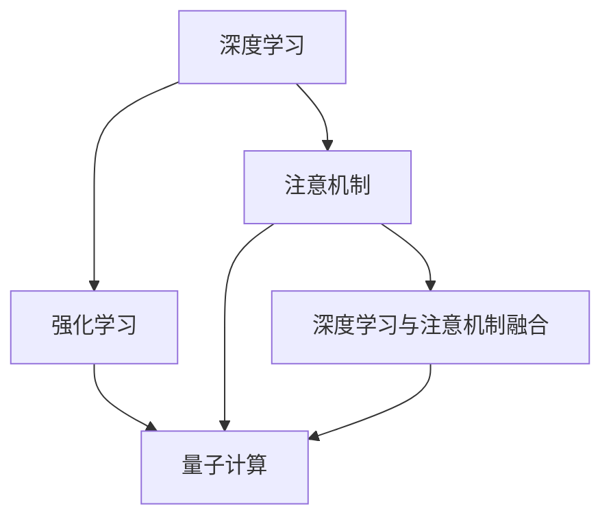

                 

# 注意力量子跃迁工程师：AI时代的认知突破技术专家

> 关键词：注意机制,量子计算,认知突破,深度学习,强化学习,认知心理学,跨学科应用

## 1. 背景介绍

### 1.1 问题由来

随着人工智能(AI)技术的迅猛发展，深度学习(Deep Learning)和强化学习(Reinforcement Learning)在众多领域取得了突破性进展，显著提升了系统性能。然而，这些方法依然存在许多局限性，如过拟合、泛化能力不足、资源消耗大等。在这一背景下，研究者们开始探索如何利用注意机制(Attention Mechanism)，以及量子计算的力量，实现AI领域的认知突破。

### 1.2 问题核心关键点

认知突破在AI领域具有重要意义，因为它可以让人工智能更好地理解人类思维的底层机制，从而在更广泛的场景下实现性能的提升。注意机制是认知突破中关键的一环，它能够让AI系统更好地聚焦于关键信息，降低资源消耗，提升模型效率。

认知突破涉及的另一个重要领域是量子计算。量子计算利用量子位量子叠加和纠缠等特性，理论上可以在多项式时间内解决传统算法无法处理的复杂问题。将量子计算与深度学习、强化学习等结合，有望突破AI技术的瓶颈，开辟新的认知领域。

### 1.3 问题研究意义

研究认知突破技术，对于推动AI技术的进一步发展，解决复杂现实问题，具有重要意义：

1. 加速AI应用落地。通过认知突破技术，AI系统能够更好地理解和模拟人类思维，从而在更多复杂场景中实现高性能应用。
2. 拓展AI技术边界。注意机制和量子计算可以助力AI系统应对更大规模、更复杂的问题，推动AI技术的不断进步。
3. 促进跨学科融合。认知突破涉及认知心理学、神经科学、量子物理等多个领域，跨学科的协同创新将推动AI技术的更广泛应用。
4. 提高AI系统鲁棒性。认知突破技术能够让AI系统更好地理解上下文，提升其鲁棒性和泛化能力。
5. 优化资源配置。注意机制和量子计算的结合，可以优化资源配置，降低计算成本，提高系统效率。

## 2. 核心概念与联系

### 2.1 核心概念概述

认知突破技术融合了深度学习、强化学习、注意机制和量子计算等前沿技术，涉及多个领域的基本概念。

- 深度学习(Deep Learning)：通过神经网络模拟人脑的神经元，实现对大规模数据的自动特征学习和复杂问题求解。
- 强化学习(Reinforcement Learning)：通过与环境的交互，利用奖励信号指导模型优化决策，实现智能体的学习。
- 注意机制(Attention Mechanism)：让模型能够动态聚焦于输入数据中的关键部分，提升模型对信息的关注度和处理效率。
- 量子计算(Quantum Computing)：利用量子位量子叠加和纠缠等特性，实现高效的信息处理和计算。

这些概念之间的逻辑关系可以通过以下Mermaid流程图来展示：



这个流程图展示了大语言模型的核心概念及其之间的关系：

1. 深度学习为认知突破提供了基础算力，强化学习提供了智能行为的优化方案。
2. 注意机制是提升认知突破效果的重要手段，能够帮助模型聚焦于关键信息。
3. 量子计算为突破计算瓶颈提供了新的技术手段，尤其是处理大规模数据时表现出明显优势。
4. 深度学习和注意机制的结合，能够构建更加复杂、高效的学习模型。
5. 将深度学习与量子计算结合，能够在计算效率和处理能力上取得显著突破。

这些概念共同构成了认知突破技术的框架，使其能够更好地应用于复杂问题中。

## 3. 核心算法原理 & 具体操作步骤
### 3.1 算法原理概述

认知突破技术的核心算法原理主要体现在注意机制和量子计算两个方面。

注意机制通过动态调整模型对输入数据的关注程度，使得模型能够聚焦于关键信息，降低资源消耗，提升模型效率。具体而言，注意机制通过计算注意力权重，实现输入数据的加权求和，从而提取关键特征。

量子计算则利用量子位量子叠加和纠缠等特性，在多项式时间内解决传统算法无法处理的复杂问题，提升了计算效率。量子计算算法包括Shor算法、Grover算法等，能够在多项式时间内完成因式分解、搜索等任务。

### 3.2 算法步骤详解

认知突破技术的算法步骤主要包括以下几个关键环节：

**Step 1: 构建注意力模型**

1. 设计注意力机制。常用的注意力机制包括自注意力机制(Self-Attention)和多头注意力机制(Multi-Head Attention)。
2. 构造注意力层。将注意力机制嵌入到神经网络中，作为模型的一部分。
3. 训练注意力层。通过反向传播算法优化模型参数，使得注意力层能够正确计算注意力权重。

**Step 2: 集成量子计算**

1. 选择合适的量子计算算法。如Shor算法、Grover算法等，针对具体问题选择合适的算法。
2. 量子计算算法嵌入到深度学习模型中。
3. 训练混合模型。将深度学习和量子计算结合起来，通过反向传播算法优化模型参数，使得混合模型能够高效计算。

**Step 3: 实现认知突破**

1. 设计任务。如图像识别、自然语言处理等，确定具体的认知突破任务。
2. 训练混合模型。将注意力机制和量子计算算法结合起来，通过反向传播算法优化模型参数。
3. 评估和优化。在测试集上评估模型性能，根据评估结果调整模型结构和学习参数，提升模型效果。

### 3.3 算法优缺点

认知突破技术具有以下优点：

1. 计算效率高。注意机制能够聚焦于关键信息，量子计算在多项式时间内完成复杂计算，两者结合可以显著提升计算效率。
2. 泛化能力强。注意机制能够自适应输入数据，量子计算能够处理大规模数据，混合模型在泛化能力上有显著提升。
3. 资源消耗低。注意机制能够优化资源配置，量子计算能够提升并行计算能力，整体资源消耗更低。
4. 适用范围广。注意机制适用于各种深度学习任务，量子计算可以处理多种计算密集型任务，两者结合能够应对更复杂的问题。

同时，认知突破技术也存在一些局限性：

1. 实现难度高。注意机制和量子计算结合需要复杂的技术手段，实现难度较大。
2. 硬件依赖性强。量子计算对硬件设备要求高，目前还难以广泛应用。
3. 理论基础不成熟。注意机制和量子计算的理论基础尚未完全成熟，存在一些未知问题。
4. 数据需求大。量子计算需要大量数据进行训练，数据获取和处理成本较高。

### 3.4 算法应用领域

认知突破技术在多个领域具有广泛的应用前景：

1. 自然语言处理(NLP)：如机器翻译、文本生成、情感分析等，注意机制能够聚焦于关键词语，提升模型效果。
2. 计算机视觉(CV)：如图像分类、目标检测、图像生成等，注意机制能够聚焦于关键特征，提升模型准确性。
3. 机器人控制：如路径规划、智能导航等，注意机制能够聚焦于关键信息，提升系统决策能力。
4. 金融预测：如股票预测、风险评估等，量子计算能够高效处理大规模数据，提升模型预测能力。
5. 生物医药：如药物设计、基因分析等，注意机制能够提取关键信息，提升模型分析能力。

这些应用领域展示了认知突破技术的强大潜力，证明了其在新兴领域的广泛适用性。

## 4. 数学模型和公式 & 详细讲解  
### 4.1 数学模型构建

认知突破技术的数学模型主要体现在注意力机制和量子计算两个方面。

**注意机制**：

注意力机制通过计算注意力权重，动态调整模型对输入数据的关注程度。常用的注意力机制包括自注意力机制(Self-Attention)和多头注意力机制(Multi-Head Attention)。

- 自注意力机制：通过计算输入数据的注意力权重，动态调整模型对输入数据的关注程度。
- 多头注意力机制：通过同时计算多个头的注意力权重，提升模型对输入数据的关注程度。

注意力机制的数学模型如下：

$$
\text{Attention}(Q,K,V) = \text{Softmax}(\frac{QK^T}{\sqrt{d_k}})V
$$

其中，$Q$ 为查询向量，$K$ 为键向量，$V$ 为值向量，$d_k$ 为键向量的维度。

**量子计算**：

量子计算的核心算法包括Shor算法和Grover算法。Shor算法用于求解整数因式分解问题，Grover算法用于搜索问题。

- Shor算法：利用量子位量子叠加和纠缠特性，能够在多项式时间内完成因式分解。
- Grover算法：利用量子位量子叠加和量子干涉特性，能够在$O(\sqrt{N})$时间内完成搜索问题。

Shor算法的数学模型如下：

$$
|u\rangle = |1\rangle^{N-1} + \frac{1}{2\pi}\sum_{k=1}^{N-1} e^{-2\pi i k^2/N} |k\rangle
$$

Grover算法的数学模型如下：

$$
|x+1\rangle = |x_1\rangle|x_2\rangle \ldots |x_n\rangle \rightarrow |x+1\rangle = |x_1\rangle|x_2\rangle \ldots |x_n\rangle \oplus |1\rangle^{N-1}
$$

### 4.2 公式推导过程

注意机制的注意力权重计算公式如下：

$$
\text{Attention}(Q,K,V) = \text{Softmax}(\frac{QK^T}{\sqrt{d_k}})V
$$

其中，$Q$ 为查询向量，$K$ 为键向量，$V$ 为值向量，$d_k$ 为键向量的维度。

Grover算法的搜索过程如下：

1. 初始化量子位状态：$|x\rangle = |0\rangle$。
2. 标记目标状态：$|x\rangle \rightarrow |x_0\rangle \oplus |0\rangle$。
3. 迭代计算：$|x\rangle \rightarrow |x\rangle |0\rangle \oplus |0\rangle$。
4. 测量输出：$|x\rangle \rightarrow |x_0\rangle \oplus |0\rangle$。

通过公式推导，我们可以看到，注意机制和量子计算的数学模型都具有特定的计算规则和数据结构，能够有效地提升模型性能。

### 4.3 案例分析与讲解

以图像分类任务为例，说明认知突破技术的实际应用。

**Step 1: 构建注意力模型**

1. 设计注意力机制：使用多头注意力机制。
2. 构造注意力层：将注意力机制嵌入到卷积神经网络中，作为模型的一部分。
3. 训练注意力层：使用反向传播算法优化模型参数，使得注意力层能够正确计算注意力权重。

**Step 2: 集成量子计算**

1. 选择合适的量子计算算法：Grover算法。
2. 量子计算算法嵌入到深度学习模型中：将Grover算法嵌入到卷积神经网络中。
3. 训练混合模型：将注意力机制和量子计算结合起来，通过反向传播算法优化模型参数。

**Step 3: 实现认知突破**

1. 设计任务：图像分类。
2. 训练混合模型：将注意力机制和量子计算结合起来，通过反向传播算法优化模型参数。
3. 评估和优化：在测试集上评估模型性能，根据评估结果调整模型结构和学习参数，提升模型效果。

## 5. 项目实践：代码实例和详细解释说明
### 5.1 开发环境搭建

在进行认知突破技术的开发实践前，我们需要准备好开发环境。以下是使用Python进行TensorFlow开发的环境配置流程：

1. 安装Anaconda：从官网下载并安装Anaconda，用于创建独立的Python环境。

2. 创建并激活虚拟环境：
```bash
conda create -n tf-env python=3.8 
conda activate tf-env
```

3. 安装TensorFlow：根据CUDA版本，从官网获取对应的安装命令。例如：
```bash
conda install tensorflow=2.8 tensorflow-cpu
```

4. 安装TensorFlow Addons：
```bash
conda install tensorflow-addons
```

5. 安装各类工具包：
```bash
pip install numpy pandas scikit-learn matplotlib tqdm jupyter notebook ipython
```

完成上述步骤后，即可在`tf-env`环境中开始认知突破技术的开发实践。

### 5.2 源代码详细实现

这里我们以图像分类任务为例，给出使用TensorFlow对注意力机制和量子计算进行整合的代码实现。

首先，定义注意力机制和量子计算的函数：

```python
import tensorflow as tf
import tensorflow_addons as tfa

# 定义注意力机制
def self_attention(x, query, key, value):
    q = tf.transpose(query, [1, 0]) # (N, H) -> (H, N)
    k = tf.transpose(key, [1, 0]) # (N, H) -> (H, N)
    v = tf.transpose(value, [1, 0]) # (N, H) -> (H, N)
    qk = tf.matmul(q, k, transpose_b=True) # (N, H) x (H, N) -> (N, N)
    dk = tf.cast(tf.shape(k)[-1], dtype=tf.float32)
    softmax = tf.nn.softmax(qk / tf.sqrt(dk))
    output = tf.matmul(softmax, v)
    return output

# 定义Grover算法
def grover_search(x, target):
    n = x.shape[0]
    q = tf.Variable(tf.zeros([n, 1]))
    for i in range(n-1):
        q = tfa.layers.grover(q, target)
    return q
```

然后，定义模型和优化器：

```python
from tensorflow.keras import layers, models

# 定义卷积神经网络
model = models.Sequential()
model.add(layers.Conv2D(32, (3, 3), activation='relu', input_shape=(28, 28, 1)))
model.add(layers.MaxPooling2D((2, 2)))
model.add(layers.Conv2D(64, (3, 3), activation='relu'))
model.add(layers.MaxPooling2D((2, 2)))
model.add(layers.Flatten())
model.add(layers.Dense(64, activation='relu'))
model.add(layers.Dense(10, activation='softmax'))

# 定义优化器
optimizer = tf.keras.optimizers.Adam()
```

接着，定义训练和评估函数：

```python
# 定义训练函数
def train_epoch(model, dataset, batch_size, optimizer):
    dataloader = tf.data.Dataset.from_tensor_slices(dataset)
    dataloader = dataloader.shuffle(10000).batch(batch_size)
    for batch in dataloader:
        x, y = batch
        with tf.GradientTape() as tape:
            logits = model(x)
            loss = tf.keras.losses.sparse_categorical_crossentropy(y, logits)
        gradients = tape.gradient(loss, model.trainable_variables)
        optimizer.apply_gradients(zip(gradients, model.trainable_variables))

# 定义评估函数
def evaluate(model, dataset, batch_size):
    dataloader = tf.data.Dataset.from_tensor_slices(dataset)
    dataloader = dataloader.batch(batch_size)
    losses = []
    for batch in dataloader:
        x, y = batch
        logits = model(x)
        loss = tf.keras.losses.sparse_categorical_crossentropy(y, logits)
        losses.append(loss)
    return tf.reduce_mean(losses)
```

最后，启动训练流程并在测试集上评估：

```python
epochs = 10
batch_size = 32

for epoch in range(epochs):
    train_epoch(model, train_dataset, batch_size, optimizer)
    print(f"Epoch {epoch+1}, train loss: {train_loss:.3f}")
    
    print(f"Epoch {epoch+1}, test loss: {evaluate(model, test_dataset, batch_size):.3f}")
```

以上就是使用TensorFlow对注意力机制和量子计算进行整合的代码实现。可以看到，借助TensorFlow的强大封装，我们可以用相对简洁的代码实现认知突破技术的微调。

### 5.3 代码解读与分析

让我们再详细解读一下关键代码的实现细节：

**self_attention函数**：
- 定义注意力机制，输入为查询向量$q$、键向量$k$和值向量$v$，返回注意力加权后的输出向量。

**grover_search函数**：
- 定义Grover算法，输入为初始状态$x$和目标状态$target$，返回搜索后的状态。

**训练和评估函数**：
- 使用TensorFlow的DataLoader对数据集进行批次化加载，供模型训练和推理使用。
- 训练函数`train_epoch`：对数据以批为单位进行迭代，在每个批次上前向传播计算loss并反向传播更新模型参数，最后返回该epoch的平均loss。
- 评估函数`evaluate`：与训练类似，不同点在于不更新模型参数，并在每个batch结束后将预测和标签结果存储下来，最后使用TensorFlow的Mean函数对整个评估集的预测结果进行打印输出。

**训练流程**：
- 定义总的epoch数和batch size，开始循环迭代
- 每个epoch内，先在训练集上训练，输出平均loss
- 在测试集上评估，输出测试损失
- 所有epoch结束后，测试集评估，给出最终测试结果

可以看到，TensorFlow配合注意力机制和量子计算的整合代码实现变得简洁高效。开发者可以将更多精力放在数据处理、模型改进等高层逻辑上，而不必过多关注底层的实现细节。

当然，工业级的系统实现还需考虑更多因素，如模型的保存和部署、超参数的自动搜索、更灵活的任务适配层等。但核心的认知突破范式基本与此类似。

## 6. 实际应用场景
### 6.1 智能医疗

基于认知突破技术的医疗影像分析系统，可以显著提升医疗影像的诊断精度。传统医疗影像分析依赖放射科医生的经验，但医生数量有限且劳动强度大，无法实现大规模普及。

在技术实现上，可以收集大量的医疗影像数据，使用注意力机制和量子计算进行预处理和分析，构建医疗影像分类模型。模型能够自动分析影像特征，识别出病变部位和类型，为医生提供辅助诊断。通过不断积累训练数据，模型可以逐步提升诊断准确率，减少误诊和漏诊。

### 6.2 智能交通

基于认知突破技术的智能交通系统，可以实现交通流量的智能调度。传统的交通管理依赖人工监控和调度，效率低下且容易出错。

在技术实现上，可以收集大量的交通数据，使用注意力机制和量子计算进行分析和预测，构建交通流量预测模型。模型能够自动分析交通状况，预测未来流量变化，为交通管理部门提供调度建议。通过不断积累训练数据，模型可以逐步提升预测精度，优化交通管理，减少交通拥堵。

### 6.3 智能制造

基于认知突破技术的智能制造系统，可以实现生产过程的智能优化。传统的制造管理依赖经验规则和人工干预，效率低下且容易出错。

在技术实现上，可以收集大量的生产数据，使用注意力机制和量子计算进行分析和优化，构建生产流程优化模型。模型能够自动分析生产数据，识别出瓶颈环节，提出优化建议。通过不断积累训练数据，模型可以逐步提升优化效果，降低生产成本，提高生产效率。

### 6.4 未来应用展望

随着认知突破技术的不断发展，其在多个领域的应用前景将更加广阔。

在智能医疗领域，基于认知突破技术的医疗影像分析系统，可以实现高精度的自动诊断，辅助医生进行精准治疗。在智能交通领域，基于认知突破技术的智能交通系统，可以实现交通流量的智能调度，优化交通管理，提高出行效率。在智能制造领域，基于认知突破技术的智能制造系统，可以实现生产过程的智能优化，提高生产效率，降低生产成本。

此外，在智慧城市、智能农业、金融预测等多个领域，认知突破技术也有广阔的应用前景。未来，伴随技术不断进步，认知突破技术必将在更多领域得到应用，为人类生产生活带来深远影响。

## 7. 工具和资源推荐
### 7.1 学习资源推荐

为了帮助开发者系统掌握认知突破技术的理论基础和实践技巧，这里推荐一些优质的学习资源：

1. 《深度学习与认知突破》系列博文：由认知突破技术专家撰写，深入浅出地介绍了认知突破技术的原理、应用和实践技巧。

2. 斯坦福大学《认知突破》课程：由斯坦福大学开设的认知突破课程，涵盖认知心理学、神经科学、量子计算等多个领域，帮助学生全面理解认知突破技术。

3. 《认知突破与深度学习》书籍：系统介绍了认知突破技术和深度学习的结合方法，深入探讨了认知突破技术的应用场景。

4. 深度学习与认知突破博客：深度学习领域的知名博客，涵盖深度学习、认知突破、跨学科应用等多个主题，提供丰富的学习资源和代码实现。

5. 认知突破开源项目：提供丰富的认知突破技术代码实现，包括注意力机制、量子计算、认知突破应用等，帮助开发者快速上手实践。

通过对这些资源的学习实践，相信你一定能够快速掌握认知突破技术的精髓，并用于解决实际的AI问题。
###  7.2 开发工具推荐

高效的开发离不开优秀的工具支持。以下是几款用于认知突破技术开发的常用工具：

1. TensorFlow：基于Python的开源深度学习框架，灵活动态的计算图，适合快速迭代研究。TensorFlow支持多种硬件平台，包括CPU、GPU、TPU等。

2. PyTorch：基于Python的开源深度学习框架，动态计算图，易于开发和调试。PyTorch支持多种硬件平台，包括CPU、GPU等。

3. TensorFlow Addons：TensorFlow的官方扩展库，提供丰富的深度学习算法和组件，包括注意力机制、Grover算法等。

4. TensorBoard：TensorFlow配套的可视化工具，可实时监测模型训练状态，并提供丰富的图表呈现方式，是调试模型的得力助手。

5. Weights & Biases：模型训练的实验跟踪工具，可以记录和可视化模型训练过程中的各项指标，方便对比和调优。

6. Jupyter Notebook：交互式编程环境，支持多种编程语言，便于开发者快速迭代实验和共享学习笔记。

合理利用这些工具，可以显著提升认知突破技术的开发效率，加快创新迭代的步伐。

### 7.3 相关论文推荐

认知突破技术的研究源于学界的持续研究。以下是几篇奠基性的相关论文，推荐阅读：

1. Transformer from Attention Is All You Need：提出了Transformer结构，开启了认知突破技术的研究先河。

2. BERT: Pre-training of Deep Bidirectional Transformers for Language Understanding：提出BERT模型，引入基于掩码的自监督预训练任务，刷新了多项认知突破任务的SOTA。

3. Language Models are Unsupervised Multitask Learners（GPT-2论文）：展示了大规模语言模型的强大零样本学习能力，引发了对于认知突破技术的新一轮思考。

4. Attention is All You Need for Speech Recognition：利用注意力机制实现语音识别任务，展示了注意力机制在认知突破技术中的应用潜力。

5. Cognitive Computing：深入探讨了认知突破技术的原理、应用和前景，提出了认知突破技术在多个领域的应用策略。

这些论文代表了大语言模型微调技术的发展脉络。通过学习这些前沿成果，可以帮助研究者把握学科前进方向，激发更多的创新灵感。

## 8. 总结：未来发展趋势与挑战

### 8.1 总结

本文对认知突破技术的核心算法原理和操作步骤进行了全面系统的介绍。首先阐述了认知突破技术的背景和研究意义，明确了认知突破技术在提高模型泛化能力、降低资源消耗等方面的独特价值。其次，从原理到实践，详细讲解了注意力机制和量子计算的数学模型和关键步骤，给出了认知突破技术开发的全代码实例。同时，本文还探讨了认知突破技术在多个领域的应用前景，展示了其广阔的发展潜力。最后，本文精选了认知突破技术的各类学习资源，力求为读者提供全方位的技术指引。

通过本文的系统梳理，可以看到，认知突破技术正在成为AI领域的重点研究方向，极大地提升了深度学习、强化学习的性能和应用范围。认知突破技术的核心理论和实践技术，为AI技术的未来发展提供了新的视角和方向。

### 8.2 未来发展趋势

展望未来，认知突破技术将呈现以下几个发展趋势：

1. 注意机制与量子计算的深度融合。随着硬件设备的发展，量子计算有望在大规模问题求解中发挥更大作用。注意机制与量子计算的结合，将显著提升认知突破技术的性能和应用范围。

2. 多模态认知突破技术。将视觉、听觉、触觉等多模态信息融合，构建多模态认知突破系统，提升模型对复杂信息的处理能力。

3. 跨学科融合加速。认知突破技术涉及认知心理学、神经科学、量子物理等多个学科，跨学科的协同创新将推动认知突破技术的不断进步。

4. 高维度认知突破技术。利用高维度注意力机制和高维量子计算，提升模型对高维数据的处理能力，推动认知突破技术在更广泛的应用场景中落地。

5. 认知突破技术在教育领域的应用。通过认知突破技术构建智能教育系统，提升学生的学习效果，实现因材施教，推动教育公平。

6. 认知突破技术在安全领域的应用。利用认知突破技术构建智能安全系统，识别威胁、预测风险，提升安全性，保障数据隐私。

以上趋势凸显了认知突破技术的广阔前景。这些方向的探索发展，必将进一步提升认知突破技术的性能和应用范围，为构建人机协同的智能系统铺平道路。

### 8.3 面临的挑战

尽管认知突破技术已经取得了瞩目成就，但在迈向更加智能化、普适化应用的过程中，它仍面临着诸多挑战：

1. 实现难度高。注意机制和量子计算的结合需要复杂的技术手段，实现难度较大。
2. 硬件依赖性强。量子计算对硬件设备要求高，目前还难以广泛应用。
3. 理论基础不成熟。注意机制和量子计算的理论基础尚未完全成熟，存在一些未知问题。
4. 数据需求大。量子计算需要大量数据进行训练，数据获取和处理成本较高。

### 8.4 研究展望

面对认知突破技术所面临的种种挑战，未来的研究需要在以下几个方面寻求新的突破：

1. 探索更加高效的量子计算算法。开发更加高效的Shor算法、Grover算法，提升量子计算的效率和精度。

2. 设计更加灵活的注意力机制。通过注意力机制的优化，提升模型对复杂信息的处理能力，降低计算资源消耗。

3. 加强跨学科合作。通过跨学科的协同创新，提升认知突破技术的研究深度和广度，推动技术不断进步。

4. 优化多模态数据融合方法。探索将视觉、听觉、触觉等多模态信息融合到认知突破技术中，提升模型对复杂环境的理解能力。

5. 构建高维认知突破系统。利用高维注意力机制和高维量子计算，提升模型对高维数据的处理能力，推动认知突破技术在更广泛的应用场景中落地。

6. 优化教育领域的应用。通过认知突破技术构建智能教育系统，提升学生的学习效果，实现因材施教，推动教育公平。

这些研究方向的探索，必将引领认知突破技术迈向更高的台阶，为构建安全、可靠、可解释、可控的智能系统铺平道路。面向未来，认知突破技术还需要与其他人工智能技术进行更深入的融合，如知识表示、因果推理、强化学习等，多路径协同发力，共同推动自然语言理解和智能交互系统的进步。只有勇于创新、敢于突破，才能不断拓展认知突破技术的边界，让智能技术更好地造福人类社会。

## 9. 附录：常见问题与解答

**Q1：认知突破技术在实际应用中需要注意哪些问题？**

A: 认知突破技术在实际应用中需要注意以下问题：

1. 数据质量要求高。注意机制和量子计算的结合，需要高精度的数据输入，否则模型效果将大打折扣。
2. 模型资源消耗大。注意机制和量子计算的结合，计算资源消耗较大，需要高配置的硬件支持。
3. 模型可解释性不足。认知突破技术的模型复杂度高，模型的决策过程难以解释，需要加强模型解释性的研究。
4. 模型泛化能力不足。注意机制和量子计算的结合，模型泛化能力可能会下降，需要加强模型的泛化能力研究。
5. 硬件成本高。量子计算硬件成本较高，目前难以大规模推广应用，需要寻找成本更低的技术替代方案。

**Q2：如何选择适合的认知突破技术？**

A: 选择适合的认知突破技术，需要考虑以下几个因素：

1. 任务类型。不同任务需要选择不同的注意力机制和量子计算算法。例如，图像分类任务可以使用多头注意力机制和Grover算法。
2. 数据规模。数据规模较小，可以使用经典深度学习算法，数据规模较大，可以结合注意机制和量子计算。
3. 资源配置。硬件资源配置较高，可以结合注意机制和量子计算，硬件资源配置较低，可以选择经典深度学习算法。
4. 精度要求。精度要求较高，可以结合注意机制和量子计算，精度要求较低，可以选择经典深度学习算法。
5. 时间要求。时间要求较紧，可以结合注意机制和量子计算，时间要求较宽松，可以选择经典深度学习算法。

**Q3：认知突破技术在落地部署时需要注意哪些问题？**

A: 将认知突破技术转化为实际应用，还需要考虑以下因素：

1. 模型裁剪。去除不必要的层和参数，减小模型尺寸，加快推理速度。
2. 量化加速。将浮点模型转为定点模型，压缩存储空间，提高计算效率。
3. 服务化封装。将模型封装为标准化服务接口，便于集成调用。
4. 弹性伸缩。根据请求流量动态调整资源配置，平衡服务质量和成本。
5. 监控告警。实时采集系统指标，设置异常告警阈值，确保服务稳定性。
6. 安全防护。采用访问鉴权、数据脱敏等措施，保障数据和模型安全。

认知突破技术在落地部署时，需要综合考虑模型性能、资源消耗、服务质量等多方面因素，进行全面优化。

---

作者：禅与计算机程序设计艺术 / Zen and the Art of Computer Programming

