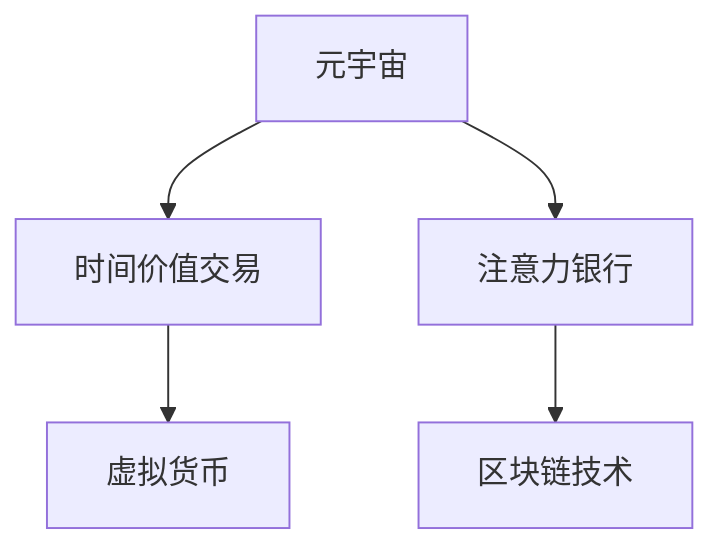
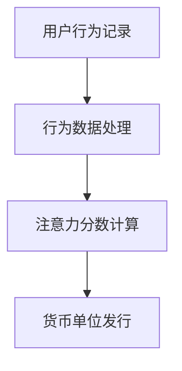

                 

## 1. 背景介绍

### 1.1 元宇宙概述
随着区块链、虚拟现实(VR)、增强现实(AR)、5G、云计算等技术的快速发展，元宇宙这一全新的数字空间形式逐渐被推上风口浪尖，引发全球科技圈、资本界的广泛关注。
元宇宙是一种将数字世界与现实世界融合的虚拟空间，通过利用先进的数字技术，模拟一个与现实世界深度融合的虚拟世界。它具备完整的经济系统、社会规则、治理体系，能够让用户在虚拟空间中实现自由互动、社交、娱乐、商业交易等多种活动。

### 1.2 时间价值的重要性
在现实世界中，时间被视为稀缺资源，随着经济的发展和社会进步，时间价值愈发凸显。人们在有限的生命里追求高效利用时间，实现自我价值最大化。然而，在传统的物理世界和互联网空间中，时间这一关键资源往往被忽略，未能得到充分利用。
元宇宙的崛起，带来了新的时间管理和利用方式。时间价值在元宇宙中得到了前所未有的重视，成为连接用户与虚拟世界的纽带。如何高效地管理和交易时间价值，成为元宇宙发展的关键问题。

### 1.3 时间价值交易的意义
时间价值交易，是指用户通过特定方式在虚拟世界中进行时间资源的交换和转让。元宇宙中，用户可以通过时间价值交易，实现高效的时间管理，实现财富积累，从而在虚拟世界中获得更多资源、更优体验。
时间价值交易能够提升用户的参与感和满足感，增强元宇宙的社交和经济活动。通过交易，用户可以在虚拟世界中体验到现实世界中的竞争与合作，激发更多创意和活力。

## 2. 核心概念与联系

### 2.1 核心概念概述
1. **元宇宙**：由先进的数字技术模拟生成的虚拟世界，具备完整的经济系统、社会规则和治理体系。
2. **时间价值交易**：用户通过特定方式在虚拟世界中进行时间资源的交换和转让。
3. **注意力银行**：一种基于用户注意力的价值衡量机制，通过量化用户注意力行为，将时间价值转化为具体的货币单位。
4. **区块链技术**：一种分布式账本技术，为元宇宙中的交易活动提供了信任保障和安全机制。
5. **虚拟货币**：在元宇宙中流通的数字货币，用于记录和交换时间价值。

### 2.2 核心概念联系
以上概念之间的联系可以通过以下Mermaid流程图展示：



### 2.3 核心概念原理与架构

#### 2.3.1 注意力银行原理
注意力银行通过量化用户注意力行为，将时间价值转化为具体的货币单位。用户在使用元宇宙中的服务、内容时，系统会记录其注意力时长、行为频率等数据，并基于这些数据计算用户的注意力分数。注意力分数越高，用户的时间价值越高。
注意力银行的架构如图：



#### 2.3.2 区块链技术原理
区块链技术提供了一种去中心化的分布式账本，记录并验证元宇宙中所有的交易活动。用户的时间价值交易数据会被记录在区块链上，实现透明、可追溯、不可篡改的记录。

## 3. 核心算法原理 & 具体操作步骤

### 3.1 算法原理概述
注意力银行系统通过以下步骤实现时间价值的计算和交易：
1. **行为记录与数据采集**：用户在使用元宇宙中的服务、内容时，系统会记录其注意力时长、行为频率等数据。
2. **注意力分数计算**：基于用户行为数据，计算其注意力分数，用于衡量时间价值。
3. **虚拟货币发行**：根据用户注意力分数，发行虚拟货币，表示其时间价值。
4. **交易与转账**：用户可以在元宇宙中进行虚拟货币的交易和转账，实现时间价值的交换和转让。

### 3.2 算法步骤详解

#### 3.2.1 行为记录与数据采集
1. **事件日志记录**：系统记录用户在使用元宇宙中的服务、内容时产生的事件日志。
2. **行为数据采集**：根据事件日志，采集用户的行为数据，包括注意力时长、行为频率等。

#### 3.2.2 注意力分数计算
1. **用户行为加权**：根据不同行为的重要性，对用户行为进行加权。例如，在线时长、互动频率等高重要性行为赋予更高的权重。
2. **分数计算**：基于加权后的行为数据，计算用户的注意力分数。

#### 3.2.3 虚拟货币发行
1. **货币单位设定**：定义虚拟货币的基本单位，如“注意币”，规定其与现实货币的兑换比例。
2. **货币发行**：根据用户注意力分数，发行虚拟货币，表示其时间价值。

#### 3.2.4 交易与转账
1. **交易平台搭建**：搭建虚拟货币交易平台，提供用户交易服务。
2. **交易逻辑实现**：实现虚拟货币的转账、交易逻辑，确保交易的安全性和公平性。

### 3.3 算法优缺点
#### 3.3.1 优点
1. **量化时间价值**：通过量化用户注意力行为，将时间价值转化为具体的货币单位，便于管理和交易。
2. **促进用户参与**：用户通过时间价值交易，可以实现高效的时间管理，激发更多创意和活力。
3. **增强经济系统**：时间价值交易为元宇宙提供了新的经济活动，增强了其经济系统。

#### 3.3.2 缺点
1. **数据隐私问题**：记录和处理用户行为数据可能引发隐私问题，需确保数据安全和隐私保护。
2. **行为量化难度**：不同行为的重要性和价值难以量化，需设计合理的权重体系。
3. **货币价值波动**：虚拟货币的价值波动可能影响用户的时间价值评估，需建立稳定机制。

### 3.4 算法应用领域

1. **游戏领域**：用户在游戏中积累的时间价值可以通过虚拟货币交易，实现游戏资源的交换和转让，提升游戏体验。
2. **教育领域**：学生通过在线学习积累的时间价值，可以兑换虚拟奖励，促进学习积极性。
3. **社交领域**：用户在虚拟社区中的活跃度和贡献度，可以通过虚拟货币交易，获得更多资源和特权。
4. **商业领域**：企业通过用户的时间价值交易，实现品牌推广和市场拓展，提升用户粘性和忠诚度。

## 4. 数学模型和公式 & 详细讲解

### 4.1 数学模型构建
注意力银行的数学模型主要包括以下几个组成部分：
1. **用户行为数据**：$B = (b_1, b_2, ..., b_n)$，其中 $b_i$ 表示用户在第 $i$ 个时间段的行为记录。
2. **行为权重**：$W = (w_1, w_2, ..., w_n)$，其中 $w_i$ 表示第 $i$ 个行为的权重。
3. **注意力分数**：$A = \sum_{i=1}^n b_i \times w_i$。
4. **虚拟货币价值**：$V = A \times k$，其中 $k$ 为虚拟货币与现实货币的兑换比例。

### 4.2 公式推导过程
注意力分数的计算公式如下：

$$
A = \sum_{i=1}^n b_i \times w_i
$$

其中，$b_i$ 表示用户在第 $i$ 个时间段的行为记录，$w_i$ 表示第 $i$ 个行为的权重。
虚拟货币价值的计算公式如下：

$$
V = A \times k
$$

其中，$A$ 为用户的注意力分数，$k$ 为虚拟货币与现实货币的兑换比例。

### 4.3 案例分析与讲解
以游戏领域为例，分析注意力银行系统的时间价值交易机制。
1. **行为记录**：游戏用户在登录游戏、完成任务、参与活动时，系统会记录其行为日志。
2. **行为加权**：系统根据行为的重要性和用户贡献度，赋予不同的权重。例如，完成任务的行为赋予更高的权重。
3. **注意力分数计算**：基于加权后的行为数据，计算用户的注意力分数，表示其时间价值。
4. **虚拟货币发行**：根据用户注意力分数，发行虚拟货币，用于在虚拟市场中交易。
5. **交易与转账**：用户可以在游戏内商店、市场中进行虚拟货币的交易和转账，购买游戏道具、皮肤等资源。

## 5. 项目实践：代码实例和详细解释说明

### 5.1 开发环境搭建
1. **Python环境**：使用Python作为开发语言，配置开发环境。
2. **区块链平台**：选择以太坊或Binance Smart Chain等区块链平台，搭建虚拟货币交易平台。
3. **数据采集工具**：使用Flume、Logstash等工具，采集和处理用户行为数据。
4. **数据存储系统**：使用Elasticsearch、MongoDB等数据库，存储用户行为数据。

### 5.2 源代码详细实现

```python
import pandas as pd
from sqlalchemy import create_engine

# 数据采集与处理
def collect_user_behavior_data():
    # 使用Flume、Logstash等工具采集用户行为数据
    # 将数据存储到Elasticsearch中
    pass

# 行为加权与分数计算
def calculate_attention_score():
    # 从Elasticsearch中读取用户行为数据
    # 对不同行为进行加权
    # 计算用户的注意力分数
    pass

# 虚拟货币发行
def issue_virtual_currency():
    # 根据注意力分数，发行虚拟货币
    # 设置虚拟货币与现实货币的兑换比例
    pass

# 虚拟货币交易
def execute_virtual_currency_transaction():
    # 搭建虚拟货币交易平台
    # 实现交易逻辑，确保交易安全
    pass
```

### 5.3 代码解读与分析
1. **数据采集与处理**：使用Flume、Logstash等工具，采集用户行为数据，并将其存储到Elasticsearch中。
2. **行为加权与分数计算**：从Elasticsearch中读取用户行为数据，对不同行为进行加权，计算用户的注意力分数。
3. **虚拟货币发行**：根据注意力分数，发行虚拟货币，并设定虚拟货币与现实货币的兑换比例。
4. **虚拟货币交易**：搭建虚拟货币交易平台，实现交易逻辑，确保交易安全。

### 5.4 运行结果展示
以游戏领域为例，展示时间价值交易的结果。
1. **行为记录与数据采集**：
    - 用户A在3小时内登录游戏，完成任务3次，参与活动2次。
    - 行为记录数据为 $B = (3, 3, 2)$。
2. **行为加权与分数计算**：
    - 行为权重为 $W = (0.4, 0.3, 0.3)$。
    - 注意力分数为 $A = 3 \times 0.4 + 3 \times 0.3 + 2 \times 0.3 = 2.5$。
3. **虚拟货币发行**：
    - 虚拟货币价值为 $V = 2.5 \times 10 = 25$，假设兑换比例为 $k = 10$。
    - 用户A的虚拟货币余额为 $25$。
4. **虚拟货币交易**：
    - 用户A在虚拟市场购买了游戏道具，价值 $20$ 虚拟货币。
    - 用户A的虚拟货币余额更新为 $25 - 20 = 5$。

## 6. 实际应用场景

### 6.1 游戏领域
元宇宙中的游戏领域是时间价值交易的重要应用场景。用户在玩游戏时，可以通过积累的时间价值，兑换游戏道具、皮肤等资源，提升游戏体验。游戏公司可以通过用户的时间价值交易，增加收入来源，同时增强用户粘性。
具体实现方式包括：
- **行为记录**：记录用户在登录游戏、完成任务、参与活动时的行为数据。
- **行为加权**：根据不同行为的重要性，对用户行为进行加权。
- **注意力分数计算**：基于加权后的行为数据，计算用户的注意力分数。
- **虚拟货币发行**：根据注意力分数，发行虚拟货币，用于在虚拟市场中交易。
- **虚拟货币交易**：用户可以在游戏内商店、市场中进行虚拟货币的交易和转账，购买游戏道具、皮肤等资源。

### 6.2 教育领域
在教育领域，学生通过在线学习积累的时间价值，可以兑换虚拟奖励，促进学习积极性。教育机构可以通过学生的时间价值交易，增加招生来源，提升教育质量。
具体实现方式包括：
- **行为记录**：记录学生在在线学习平台上的行为数据，如在线时长、完成作业情况、参与讨论等。
- **行为加权**：根据不同行为的贡献度，对学生行为进行加权。
- **注意力分数计算**：基于加权后的行为数据，计算学生的注意力分数。
- **虚拟货币发行**：根据注意力分数，发行虚拟货币，用于在虚拟市场中交易。
- **虚拟货币交易**：学生可以在在线平台上兑换虚拟奖励，如虚拟文具、学习资源等。

### 6.3 社交领域
在社交领域，用户在虚拟社区中的活跃度和贡献度，可以通过虚拟货币交易，获得更多资源和特权。社区平台可以通过用户的时间价值交易，增加用户粘性和平台收益。
具体实现方式包括：
- **行为记录**：记录用户在虚拟社区中的行为数据，如发布内容、评论互动、参与讨论等。
- **行为加权**：根据不同行为的贡献度，对用户行为进行加权。
- **注意力分数计算**：基于加权后的行为数据，计算用户的注意力分数。
- **虚拟货币发行**：根据注意力分数，发行虚拟货币，用于在虚拟市场中交易。
- **虚拟货币交易**：用户可以在虚拟社区中兑换虚拟奖励，如社区特权、资源等。

### 6.4 商业领域
在商业领域，企业通过用户的时间价值交易，实现品牌推广和市场拓展，提升用户粘性和忠诚度。电商平台可以通过用户的时间价值交易，增加收入来源，提升用户购物体验。
具体实现方式包括：
- **行为记录**：记录用户在电商平台上的行为数据，如浏览商品、加入购物车、下单支付等。
- **行为加权**：根据不同行为的贡献度，对用户行为进行加权。
- **注意力分数计算**：基于加权后的行为数据，计算用户的注意力分数。
- **虚拟货币发行**：根据注意力分数，发行虚拟货币，用于在虚拟市场中交易。
- **虚拟货币交易**：用户可以在电商平台上兑换虚拟奖励，如积分、优惠券等。

## 7. 工具和资源推荐

### 7.1 学习资源推荐

1. **《元宇宙经济学》**：作者邹晓宇，介绍了元宇宙的经济学原理、时间价值交易机制等内容。
2. **《区块链技术入门》**：作者刘旷宇，介绍了区块链技术的原理和应用，适合理解元宇宙中的虚拟货币交易。
3. **《Python数据分析与可视化》**：作者斯特凡·卡塔尔奇克，介绍了Python在数据分析和可视化方面的应用，适合处理用户行为数据。

### 7.2 开发工具推荐

1. **Flume、Logstash**：用于采集和处理用户行为数据。
2. **Elasticsearch**：用于存储和管理用户行为数据。
3. **Python**：用于开发元宇宙中的注意力银行系统。
4. **Binance Smart Chain**：用于搭建虚拟货币交易平台。

### 7.3 相关论文推荐

1. **《元宇宙中的时间价值交易机制研究》**：文章探讨了元宇宙中时间价值交易的机制和应用，提出了基于注意力银行的时间价值量化方法。
2. **《基于区块链的元宇宙经济系统设计》**：文章介绍了基于区块链技术的元宇宙经济系统设计，强调了虚拟货币的交易安全性和透明性。
3. **《用户行为数据驱动的元宇宙智能推荐系统》**：文章探讨了基于用户行为数据的元宇宙智能推荐系统，提出了基于注意力银行的推荐算法。

## 8. 总结：未来发展趋势与挑战

### 8.1 研究成果总结
注意力银行系统作为元宇宙中时间价值交易的核心机制，通过量化用户注意力行为，将时间价值转化为具体的货币单位。该系统通过行为记录、行为加权、注意力分数计算、虚拟货币发行、虚拟货币交易等步骤，实现了时间价值的量化和交易。

### 8.2 未来发展趋势
1. **技术演进**：随着人工智能技术的发展，元宇宙中的行为加权和注意力分数计算将更加智能和精准。
2. **多模态融合**：未来的注意力银行系统将融合语音、视觉等多模态数据，提升时间价值评估的全面性和准确性。
3. **分布式计算**：元宇宙将采用分布式计算技术，提升系统的处理能力和响应速度。
4. **区块链技术的优化**：未来元宇宙中的虚拟货币交易将采用更高效的区块链技术，提升交易效率和安全性。

### 8.3 面临的挑战
1. **隐私保护**：记录和处理用户行为数据可能引发隐私问题，需确保数据安全和隐私保护。
2. **行为量化难度**：不同行为的重要性和价值难以量化，需设计合理的权重体系。
3. **虚拟货币价值波动**：虚拟货币的价值波动可能影响用户的时间价值评估，需建立稳定机制。

### 8.4 研究展望
未来研究将围绕以下方向展开：
1. **智能行为量化**：利用AI技术，对用户行为进行更加智能的加权和量化。
2. **多模态融合**：结合语音、视觉等多模态数据，提升时间价值评估的全面性。
3. **区块链技术优化**：采用更高效的区块链技术，提升虚拟货币交易效率和安全性。
4. **隐私保护**：建立更加完善的隐私保护机制，保障用户数据安全。

## 9. 附录：常见问题与解答

**Q1: 注意力银行系统如何保障用户隐私？**
A: 注意力银行系统通过加密存储用户行为数据，使用匿名化处理和访问控制，确保用户隐私保护。

**Q2: 如何设计合理的行为权重？**
A: 根据不同行为的重要性和用户贡献度，对行为进行加权。可以参考用户的实际行为数据，利用机器学习算法，自动调整行为权重。

**Q3: 虚拟货币的价值如何稳定？**
A: 可以引入虚拟货币的稳定机制，如采用资产锚定、自动调节发行量等方法，确保虚拟货币价值的稳定。

**Q4: 注意力银行系统有哪些应用场景？**
A: 注意力银行系统可以应用于游戏、教育、社交、商业等多个领域，通过时间价值交易，提升用户参与度和粘性。

**Q5: 注意力银行系统有哪些优势？**
A: 通过量化时间价值，将时间价值转化为具体的货币单位，便于管理和交易。促进用户参与，提升元宇宙的经济活动。

