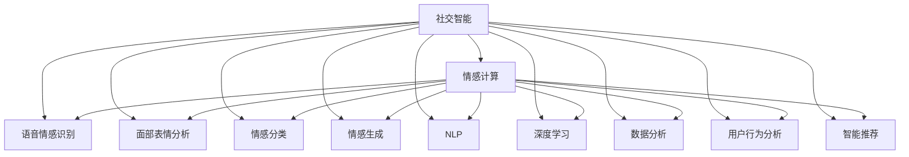

                 

# 洞察力与情商：社交智能的核心

> 关键词：社交智能, 情感计算, 机器学习, 自然语言处理(NLP), 深度学习, 数据分析, 用户行为分析, 智能推荐, 应用场景, 算法优化, 系统架构

## 1. 背景介绍

### 1.1 问题由来
社交智能（Social Intelligence）是近年来的热门话题，尤其是在人工智能和机器学习领域。社交智能旨在理解人类社交行为和情感，通过机器学习算法和数据分析，来预测和优化人类行为，提升社交互动体验。情感计算（Affective Computing）是社交智能的重要分支，旨在通过机器学习技术识别和理解人类情感。情感计算在医疗、教育、金融、市场营销等领域有广泛应用，被认为将是下一代人工智能的重要方向。

### 1.2 问题核心关键点
情感计算的核心在于如何准确地识别和理解人类情感。情感计算涉及多个子领域，包括语音情感识别、面部表情分析、情感分类和情感生成等。情感计算的应用场景包括智能客服、智能医疗、情感分析、社交媒体监控、市场营销等。情感计算的目标是构建智能化的社交互动系统，提升用户体验，增加用户粘性，推动企业创新。

## 2. 核心概念与联系

### 2.1 核心概念概述

为更好地理解社交智能和情感计算，本节将介绍几个密切相关的核心概念：

- 社交智能（Social Intelligence）：指理解人类社交行为和情感的能力，通过机器学习算法和数据分析，来预测和优化人类行为。
- 情感计算（Affective Computing）：指通过机器学习技术识别和理解人类情感的能力。情感计算涉及到语音、面部表情、文本等多个模态的数据，通常用于情感分类和生成。
- 语音情感识别（Voice Affective Recognition）：指通过语音信号识别人类情感的能力。
- 面部表情分析（Facial Expression Analysis）：指通过面部图像分析人类情感的能力。
- 情感分类（Sentiment Classification）：指对文本或语音数据进行情感分类的任务。
- 情感生成（Sentiment Generation）：指通过机器学习生成具有特定情感的文本或语音的能力。
- 自然语言处理（Natural Language Processing, NLP）：指处理和分析人类语言的能力。
- 深度学习（Deep Learning）：指使用多层神经网络进行学习和预测的能力。
- 数据分析（Data Analysis）：指通过数据挖掘和统计分析，发现数据背后的规律和趋势的能力。
- 用户行为分析（User Behavior Analysis）：指通过数据分析，了解用户行为模式和需求的能力。
- 智能推荐（Recommendation System）：指通过数据分析和机器学习，为用户推荐个性化的产品或服务的能力。

这些核心概念之间的逻辑关系可以通过以下Mermaid流程图来展示：



这个流程图展示了几大核心概念及其之间的关系：

1. 社交智能通过情感计算、语音情感识别、面部表情分析等技术手段，实现对人类情感的识别和理解。
2. 语音情感识别、面部表情分析、情感分类和情感生成等技术，都是情感计算的子领域。
3. 自然语言处理和深度学习是情感计算的基础技术，通过数据分析和用户行为分析，可以更好地理解和预测用户情感。
4. 智能推荐系统通过情感计算和用户行为分析，为个性化推荐提供依据。

## 3. 核心算法原理 & 具体操作步骤
### 3.1 算法原理概述

情感计算的算法原理主要基于机器学习和深度学习技术。情感计算的任务可以分为两个层次：第一层次是情感识别，即识别输入数据中的情感类型；第二层次是情感生成，即根据用户需求生成具有特定情感的输出。

情感识别的基本流程包括数据预处理、特征提取和模型训练三个步骤。其中，数据预处理包括文本清洗、分词、向量化等；特征提取包括提取文本中的情感词、情感强度、情感极性等特征；模型训练包括选择合适的模型（如RNN、CNN、Transformer等）和训练参数（如学习率、批量大小、迭代次数等）。

情感生成的基本流程包括文本生成、情感词选择和情感调节三个步骤。其中，文本生成包括文本生成模型（如GPT-3、T5等）的选择和训练；情感词选择包括从情感词库中挑选与用户需求相匹配的词汇；情感调节包括调节文本中的情感词的强度和极性，使其符合用户需求。

### 3.2 算法步骤详解

以下详细讲解情感计算的基本算法步骤：

**Step 1: 数据收集与预处理**
- 收集情感数据：可以通过公开数据集、用户行为数据、社交媒体数据等收集情感数据。
- 数据清洗：清洗掉数据中的噪声和无关信息，如无关词汇、标点符号等。
- 分词和向量化：将文本分词并进行向量化，以便后续的特征提取和模型训练。

**Step 2: 特征提取与模型训练**
- 特征提取：提取文本中的情感词、情感强度、情感极性等特征。
- 模型选择：选择合适的机器学习模型，如RNN、CNN、Transformer等。
- 模型训练：使用训练数据对模型进行训练，调整模型参数。

**Step 3: 情感分类**
- 情感分类模型：训练情感分类模型，识别输入数据中的情感类型。
- 模型评估：使用验证数据评估模型的性能，调整模型参数。

**Step 4: 情感生成**
- 情感生成模型：训练情感生成模型，生成具有特定情感的文本或语音。
- 情感调节：调节生成的文本或语音中的情感词的强度和极性，使其符合用户需求。

**Step 5: 模型应用**
- 情感分析：将模型应用于新的情感数据，进行情感识别和分类。
- 情感生成：根据用户需求生成具有特定情感的文本或语音。

### 3.3 算法优缺点

情感计算的算法具有以下优点：
1. 灵活性高：可以根据不同的应用场景选择合适的特征和模型。
2. 准确性高：深度学习等高级技术可以提高情感识别的准确性。
3. 应用广泛：情感计算可以应用于多个领域，如智能客服、智能医疗、情感分析、市场营销等。
4. 可解释性：深度学习等技术虽然准确，但也存在黑盒问题，但可以通过特征提取等手段提高可解释性。

同时，情感计算的算法也存在以下局限性：
1. 数据依赖性高：情感计算的效果很大程度上依赖于数据质量，而获取高质量情感数据成本较高。
2. 数据多样性不足：情感计算的数据通常单一，难以处理复杂的情感表达。
3. 算法复杂度高：深度学习等高级技术虽然准确，但需要较长的训练时间和较多的计算资源。
4. 模型泛化能力差：情感计算的模型往往针对特定的数据集和任务进行训练，泛化能力较弱。

尽管存在这些局限性，但情感计算在NLP和AI领域已经得到了广泛应用，为情感分析、智能推荐等提供了强大的技术支持。未来，相关研究的重点在于如何进一步降低数据依赖，提高算法的泛化能力和可解释性，同时兼顾模型的效率和准确性。

### 3.4 算法应用领域

情感计算在多个领域中得到了广泛应用，例如：

- 智能客服系统：通过情感识别和情感生成技术，提升客服系统的用户体验，增加用户粘性。
- 智能医疗系统：通过情感分类和情感生成技术，提升医疗系统的诊断和治疗效果。
- 情感分析：对用户评论、社交媒体内容等进行情感分析，了解用户需求和情感状态。
- 市场营销：通过情感生成和情感分类技术，制定个性化的市场营销策略，提升用户转化率。
- 用户行为分析：通过情感分类和情感生成技术，预测用户行为，实现个性化推荐。

除了上述这些应用场景外，情感计算还被创新性地应用于情感计算辅助决策、情感驱动的游戏设计等领域，为人类社会带来新的变革。

## 4. 数学模型和公式 & 详细讲解 & 举例说明

### 4.1 数学模型构建

情感计算的数学模型主要基于机器学习算法和深度学习模型。以下是一个基本的情感分类模型构建过程：

假设输入数据为 $X=\{x_1, x_2, ..., x_n\}$，每个数据 $x_i$ 包含多个特征 $x_i^k$。情感分类模型 $M$ 的输出为 $y$，表示情感类型。模型的目标是最小化损失函数 $\mathcal{L}$。

$$
\mathcal{L} = \frac{1}{N} \sum_{i=1}^N \ell(y_i, M(x_i))
$$

其中 $\ell$ 为损失函数，$\ell(y_i, M(x_i))$ 表示预测值与真实值之间的差异。常用的损失函数包括交叉熵损失（Cross-Entropy Loss）、均方误差损失（Mean Squared Error Loss）等。

### 4.2 公式推导过程

以下以交叉熵损失函数为例，推导情感分类模型的公式。

假设模型 $M$ 在输入 $x_i$ 上的输出为 $\hat{y}_i$，表示情感类型 $C$ 的概率分布。真实标签 $y_i \in \{1,2,...,C\}$。则交叉熵损失函数定义为：

$$
\ell(y_i, M(x_i)) = -\log P(y_i|M(x_i))
$$

其中 $P(y_i|M(x_i))$ 表示模型预测的情感概率分布。将交叉熵损失函数代入总体损失函数公式，得：

$$
\mathcal{L} = -\frac{1}{N} \sum_{i=1}^N \log P(y_i|M(x_i))
$$

为了求解模型参数 $\theta$，我们通常使用基于梯度的优化算法（如SGD、Adam等）来最小化损失函数。设 $\eta$ 为学习率，则参数的更新公式为：

$$
\theta \leftarrow \theta - \eta \nabla_{\theta}\mathcal{L}(\theta)
$$

其中 $\nabla_{\theta}\mathcal{L}(\theta)$ 为损失函数对模型参数的梯度，可通过反向传播算法高效计算。

### 4.3 案例分析与讲解

假设我们有一个情感分类问题，输入为社交媒体评论文本，输出为评论的情感极性（正面、负面、中性）。使用BERT模型作为情感分类器，数据集包含10万条社交媒体评论。

1. 数据预处理：将评论文本进行分词、向量化、去停用词等预处理。
2. 特征提取：从向量化后的评论文本中提取情感词、情感强度等特征。
3. 模型训练：使用10万条评论数据，对BERT模型进行训练，调整模型参数。
4. 模型评估：使用验证集对模型进行评估，选择最优的模型参数。
5. 情感分类：使用训练好的模型对新的评论文本进行情感分类。

## 5. 项目实践：代码实例和详细解释说明

### 5.1 开发环境搭建

在进行情感计算实践前，我们需要准备好开发环境。以下是使用Python进行PyTorch开发的环境配置流程：

1. 安装Anaconda：从官网下载并安装Anaconda，用于创建独立的Python环境。

2. 创建并激活虚拟环境：
```bash
conda create -n sentiment-env python=3.8 
conda activate sentiment-env
```

3. 安装PyTorch：根据CUDA版本，从官网获取对应的安装命令。例如：
```bash
conda install pytorch torchvision torchaudio cudatoolkit=11.1 -c pytorch -c conda-forge
```

4. 安装相关库：
```bash
pip install transformers pandas scikit-learn matplotlib
```

完成上述步骤后，即可在`sentiment-env`环境中开始情感计算实践。

### 5.2 源代码详细实现

下面我们以情感分类任务为例，给出使用Transformers库对BERT模型进行情感分类的PyTorch代码实现。

首先，定义情感分类任务的数据处理函数：

```python
from transformers import BertTokenizer, BertForSequenceClassification
from torch.utils.data import Dataset, DataLoader
import torch

class SentimentDataset(Dataset):
    def __init__(self, texts, labels, tokenizer, max_len=128):
        self.texts = texts
        self.labels = labels
        self.tokenizer = tokenizer
        self.max_len = max_len
        
    def __len__(self):
        return len(self.texts)
    
    def __getitem__(self, item):
        text = self.texts[item]
        label = self.labels[item]
        
        encoding = self.tokenizer(text, return_tensors='pt', max_length=self.max_len, padding='max_length', truncation=True)
        input_ids = encoding['input_ids'][0]
        attention_mask = encoding['attention_mask'][0]
        
        # 将标签转换为id
        label_id = [tag2id[label]] * self.max_len
        labels = torch.tensor(label_id, dtype=torch.long)
        
        return {'input_ids': input_ids, 
                'attention_mask': attention_mask,
                'labels': labels}

# 标签与id的映射
tag2id = {'positive': 1, 'negative': 2, 'neutral': 0}
id2tag = {v: k for k, v in tag2id.items()}

# 创建dataset
tokenizer = BertTokenizer.from_pretrained('bert-base-cased')

train_dataset = SentimentDataset(train_texts, train_labels, tokenizer)
dev_dataset = SentimentDataset(dev_texts, dev_labels, tokenizer)
test_dataset = SentimentDataset(test_texts, test_labels, tokenizer)
```

然后，定义模型和优化器：

```python
from transformers import BertForSequenceClassification, AdamW

model = BertForSequenceClassification.from_pretrained('bert-base-cased', num_labels=len(tag2id))

optimizer = AdamW(model.parameters(), lr=2e-5)
```

接着，定义训练和评估函数：

```python
from tqdm import tqdm
from sklearn.metrics import classification_report

device = torch.device('cuda') if torch.cuda.is_available() else torch.device('cpu')
model.to(device)

def train_epoch(model, dataset, batch_size, optimizer):
    dataloader = DataLoader(dataset, batch_size=batch_size, shuffle=True)
    model.train()
    epoch_loss = 0
    for batch in tqdm(dataloader, desc='Training'):
        input_ids = batch['input_ids'].to(device)
        attention_mask = batch['attention_mask'].to(device)
        labels = batch['labels'].to(device)
        model.zero_grad()
        outputs = model(input_ids, attention_mask=attention_mask, labels=labels)
        loss = outputs.loss
        epoch_loss += loss.item()
        loss.backward()
        optimizer.step()
    return epoch_loss / len(dataloader)

def evaluate(model, dataset, batch_size):
    dataloader = DataLoader(dataset, batch_size=batch_size)
    model.eval()
    preds, labels = [], []
    with torch.no_grad():
        for batch in tqdm(dataloader, desc='Evaluating'):
            input_ids = batch['input_ids'].to(device)
            attention_mask = batch['attention_mask'].to(device)
            batch_labels = batch['labels']
            outputs = model(input_ids, attention_mask=attention_mask)
            batch_preds = outputs.logits.argmax(dim=1).to('cpu').tolist()
            batch_labels = batch_labels.to('cpu').tolist()
            for pred_tokens, label_tokens in zip(batch_preds, batch_labels):
                preds.append(pred_tokens[:len(label_tokens)])
                labels.append(label_tokens)
                
    print(classification_report(labels, preds))
```

最后，启动训练流程并在测试集上评估：

```python
epochs = 5
batch_size = 16

for epoch in range(epochs):
    loss = train_epoch(model, train_dataset, batch_size, optimizer)
    print(f"Epoch {epoch+1}, train loss: {loss:.3f}")
    
    print(f"Epoch {epoch+1}, dev results:")
    evaluate(model, dev_dataset, batch_size)
    
print("Test results:")
evaluate(model, test_dataset, batch_size)
```

以上就是使用PyTorch对BERT进行情感分类任务微调的完整代码实现。可以看到，得益于Transformers库的强大封装，我们可以用相对简洁的代码完成BERT模型的加载和微调。

### 5.3 代码解读与分析

让我们再详细解读一下关键代码的实现细节：

**SentimentDataset类**：
- `__init__`方法：初始化文本、标签、分词器等关键组件。
- `__len__`方法：返回数据集的样本数量。
- `__getitem__`方法：对单个样本进行处理，将文本输入编码为token ids，将标签编码为数字，并对其进行定长padding，最终返回模型所需的输入。

**tag2id和id2tag字典**：
- 定义了标签与数字id之间的映射关系，用于将token-wise的预测结果解码回真实的标签。

**训练和评估函数**：
- 使用PyTorch的DataLoader对数据集进行批次化加载，供模型训练和推理使用。
- 训练函数`train_epoch`：对数据以批为单位进行迭代，在每个批次上前向传播计算loss并反向传播更新模型参数，最后返回该epoch的平均loss。
- 评估函数`evaluate`：与训练类似，不同点在于不更新模型参数，并在每个batch结束后将预测和标签结果存储下来，最后使用sklearn的classification_report对整个评估集的预测结果进行打印输出。

**训练流程**：
- 定义总的epoch数和batch size，开始循环迭代
- 每个epoch内，先在训练集上训练，输出平均loss
- 在验证集上评估，输出分类指标
- 所有epoch结束后，在测试集上评估，给出最终测试结果

可以看到，PyTorch配合Transformers库使得BERT微调的代码实现变得简洁高效。开发者可以将更多精力放在数据处理、模型改进等高层逻辑上，而不必过多关注底层的实现细节。

当然，工业级的系统实现还需考虑更多因素，如模型的保存和部署、超参数的自动搜索、更灵活的任务适配层等。但核心的微调范式基本与此类似。

## 6. 实际应用场景
### 6.1 智能客服系统

基于情感计算的智能客服系统，可以显著提升客户服务体验。传统的客服系统往往依赖人工，高峰期响应慢，且服务质量参差不齐。使用情感计算技术，可以构建智能客服系统，实现全天候服务，快速响应客户咨询，用自然流畅的语言解答各类问题。

在技术实现上，可以收集企业内部的历史客服对话记录，将问题和最佳答复构建成监督数据，在此基础上对情感计算模型进行微调。微调后的模型能够自动理解用户意图，匹配最合适的答复模板，生成个性化的客服回复。对于客户提出的新问题，还可以接入检索系统实时搜索相关内容，动态组织生成回答。如此构建的智能客服系统，能大幅提升客户咨询体验和问题解决效率。

### 6.2 智能医疗系统

情感计算技术在医疗领域有广泛应用。通过情感分类和情感生成技术，可以提升医疗系统的诊断和治疗效果。例如，可以使用情感计算技术对患者情绪进行识别，从而调整医生的治疗方案，或者对患者进行心理疏导，提升治疗效果。

在技术实现上，可以收集患者的情绪数据和医疗记录，训练情感分类模型，识别患者的情绪状态。根据情绪状态，可以调整医生的诊断和治疗方案，或者推荐心理咨询等辅助服务。此外，还可以使用情感生成技术，根据患者的情绪状态生成个性化的治疗建议，提升治疗体验。

### 6.3 情感分析

情感分析是情感计算的重要应用之一。通过情感分类技术，可以分析社交媒体、新闻、评论等文本数据，了解用户对品牌、产品、事件的情感态度。情感分析在品牌管理、市场调研、舆情监控等领域有广泛应用。

在技术实现上，可以收集社交媒体、新闻、评论等文本数据，训练情感分类模型，识别文本中的情感类型。根据情感分析结果，可以制定市场营销策略，优化产品设计，提升品牌形象。此外，还可以使用情感生成技术，根据用户需求生成具有特定情感的文本，提升用户互动体验。

### 6.4 未来应用展望

随着情感计算技术的发展，未来将在更多领域得到应用，为人类社会带来新的变革。

在智慧城市治理中，情感计算技术可以用于监控城市事件、舆情分析、应急指挥等环节，提高城市管理的自动化和智能化水平，构建更安全、高效的未来城市。

在智能家居领域，情感计算技术可以用于分析用户的情感状态，自动调整家居设备的设置，提升居住体验。

在教育领域，情感计算技术可以用于分析学生的情感状态，提升教学效果。例如，可以分析学生在课堂上的情感状态，调整教学方法和节奏，提升学习效果。

除了上述这些应用场景外，情感计算技术还被创新性地应用于情感计算辅助决策、情感驱动的游戏设计等领域，为人类社会带来新的变革。相信随着技术的不断进步，情感计算将为人类带来更多的便利和乐趣。

## 7. 工具和资源推荐
### 7.1 学习资源推荐

为了帮助开发者系统掌握情感计算的理论基础和实践技巧，这里推荐一些优质的学习资源：

1. 《Affective Computing for Engineering, Psychology, Education and Commerce》：麻省理工学院出版的情感计算经典教材，系统讲解了情感计算的理论基础和应用场景。
2. 《Emotion AI: Understanding and Detecting Emotion》：《Python Machine Learning》的作者编写的情感计算应用指南，介绍了情感计算的基本概念和应用实例。
3. Coursera《Affective Computing》课程：由麻省理工学院开设的情感计算课程，介绍了情感计算的理论基础和应用实例。
4. Udacity《Affective Computing with Deep Learning》课程：由IBM和卡内基梅隆大学联合开设的情感计算课程，介绍了情感计算的深度学习应用。
5. Kaggle《Sentiment Analysis》比赛：Kaggle平台上的情感分析比赛，可以通过竞赛实践情感计算技术。

通过对这些资源的学习实践，相信你一定能够快速掌握情感计算的精髓，并用于解决实际的情感问题。
###  7.2 开发工具推荐

高效的开发离不开优秀的工具支持。以下是几款用于情感计算开发的常用工具：

1. PyTorch：基于Python的开源深度学习框架，灵活动态的计算图，适合快速迭代研究。大部分情感计算模型都有PyTorch版本的实现。
2. TensorFlow：由Google主导开发的开源深度学习框架，生产部署方便，适合大规模工程应用。同样有丰富的情感计算模型资源。
3. Transformers库：HuggingFace开发的NLP工具库，集成了众多SOTA情感计算模型，支持PyTorch和TensorFlow，是进行情感计算开发的利器。
4. Weights & Biases：模型训练的实验跟踪工具，可以记录和可视化模型训练过程中的各项指标，方便对比和调优。与主流深度学习框架无缝集成。
5. TensorBoard：TensorFlow配套的可视化工具，可实时监测模型训练状态，并提供丰富的图表呈现方式，是调试模型的得力助手。
6. Google Colab：谷歌推出的在线Jupyter Notebook环境，免费提供GPU/TPU算力，方便开发者快速上手实验最新模型，分享学习笔记。

合理利用这些工具，可以显著提升情感计算任务的开发效率，加快创新迭代的步伐。

### 7.3 相关论文推荐

情感计算的研究历史悠久，涉及多个子领域。以下是几篇奠基性的相关论文，推荐阅读：

1. "Affordances and the Experiences of Action" by Douglas R. Hofstadter：经典论文，提出情感计算的概念，并详细阐述了情感计算的重要性。
2. "Sentiment Analysis with Deep Learning: A Tutorial" by Jonathan P. Breda et al.：深度学习在情感分析中的应用指南，介绍了情感分析的深度学习模型和应用实例。
3. "Affect in Human-Robot Interaction" by B. Picard：情感计算在机器人领域的经典论文，详细介绍了情感计算在机器人中的应用。
4. "Emotion AI: A Survey of Current Challenges" by Fazlul Shahriar et al.：情感计算领域的综述论文，总结了情感计算的研究现状和未来趋势。
5. "Emotion Recognition using Machine Learning: A Review" by Anil K. Gupta et al.：情感识别的机器学习综述论文，总结了情感识别的常用方法和应用实例。

这些论文代表了大语言模型微调技术的发展脉络。通过学习这些前沿成果，可以帮助研究者把握学科前进方向，激发更多的创新灵感。

## 8. 总结：未来发展趋势与挑战

### 8.1 总结

本文对情感计算的基本概念、算法原理和操作步骤进行了全面系统的介绍。首先阐述了情感计算的研究背景和意义，明确了情感计算在人类情感识别和理解方面的重要价值。其次，从原理到实践，详细讲解了情感计算的数学模型和关键步骤，给出了情感计算任务开发的完整代码实例。同时，本文还广泛探讨了情感计算在智能客服、智能医疗、情感分析等多个领域的应用前景，展示了情感计算技术的巨大潜力。

通过本文的系统梳理，可以看到，情感计算技术正在成为人工智能领域的重要方向，极大地拓展了情感理解和预测的能力。情感计算为机器与人类之间的自然互动提供了新的可能性，为人工智能技术的普及和发展注入了新的动力。未来，随着技术的不断进步，情感计算将在更多领域得到应用，为人类带来更多的便利和乐趣。

### 8.2 未来发展趋势

展望未来，情感计算技术将呈现以下几个发展趋势：

1. 数据依赖性降低：随着自然语言处理和语音识别技术的不断进步，情感计算的数据依赖性将逐渐降低。情感计算将更加依赖于文本、语音等模态数据的自动标注和挖掘，而非传统的情感标签数据。
2. 模型复杂度降低：随着模型的不断优化，情感计算的模型复杂度将逐渐降低，所需的计算资源和时间将进一步减少。同时，模型的泛化能力将进一步提升，适应更多不同领域和任务。
3. 情感计算与知识图谱结合：情感计算将与知识图谱、逻辑规则等外部知识进行融合，提升情感识别的准确性和泛化能力。
4. 情感计算与多模态融合：情感计算将与图像、视频、语音等多模态数据进行融合，提升对复杂情感表达的理解和识别。
5. 情感计算与强化学习结合：情感计算将与强化学习结合，实现情感表达的智能优化和生成，提升用户的互动体验。
6. 情感计算与可解释性结合：情感计算将更加注重算法的可解释性，提升系统的透明性和可信任度，确保情感识别的准确性和可靠性。

这些趋势凸显了情感计算技术的广阔前景。这些方向的探索发展，必将进一步提升情感计算的能力和应用范围，为人类社会带来更多的便利和乐趣。

### 8.3 面临的挑战

尽管情感计算技术已经取得了显著进展，但在迈向更加智能化、普适化应用的过程中，它仍面临着诸多挑战：

1. 数据质量问题：情感计算的效果很大程度上依赖于数据质量，而高质量情感数据获取成本较高，且存在标注偏差等问题。如何获取高质量、多样化的情感数据，是情感计算面临的一大难题。
2. 模型泛化能力差：当前的情感计算模型往往针对特定的数据集和任务进行训练，泛化能力较弱。如何提高情感计算模型的泛化能力，是情感计算技术需要解决的关键问题之一。
3. 可解释性不足：情感计算的模型通常黑盒运行，难以解释其内部工作机制和决策逻辑。如何提高情感计算模型的可解释性，是情感计算技术需要解决的关键问题之一。
4. 伦理与安全问题：情感计算涉及到个人情感数据的收集和分析，可能带来隐私和安全问题。如何保护用户隐私，确保情感数据的安全性，是情感计算技术需要解决的关键问题之一。
5. 计算资源消耗大：情感计算模型的训练和推理计算量较大，需要高性能的计算资源和算力支持。如何优化计算资源的使用，是情感计算技术需要解决的关键问题之一。

尽管存在这些挑战，但情感计算在NLP和AI领域已经得到了广泛应用，为情感分析、智能推荐等提供了强大的技术支持。未来，相关研究的重点在于如何进一步降低数据依赖，提高算法的泛化能力和可解释性，同时兼顾模型的效率和准确性。

### 8.4 研究展望

面对情感计算面临的挑战，未来的研究需要在以下几个方面寻求新的突破：

1. 探索无监督和半监督情感计算方法：摆脱对大规模标注数据的依赖，利用自监督学习、主动学习等无监督和半监督范式，最大限度利用非结构化数据，实现更加灵活高效的情感计算。
2. 研究情感计算的跨模态融合方法：情感计算将与图像、视频、语音等多模态数据进行融合，提升对复杂情感表达的理解和识别。
3. 融合因果分析和博弈论工具：通过引入因果分析方法，增强情感计算模型的因果关系，学习更加普适、鲁棒的语言表征，从而提升模型的泛化性和抗干扰能力。
4. 引入更多先验知识：将符号化的先验知识，如知识图谱、逻辑规则等，与情感计算模型进行巧妙融合，引导情感计算过程学习更准确、合理的情感表达。
5. 结合因果分析和博弈论工具：通过引入因果分析方法，增强情感计算模型的因果关系，学习更加普适、鲁棒的语言表征，从而提升模型的泛化性和抗干扰能力。
6. 纳入伦理道德约束：在情感计算模型的训练目标中引入伦理导向的评估指标，过滤和惩罚有偏见、有害的输出倾向，确保情感计算模型的输出符合人类价值观和伦理道德。

这些研究方向的探索，必将引领情感计算技术迈向更高的台阶，为构建安全、可靠、可解释、可控的智能系统铺平道路。面向未来，情感计算技术还需要与其他人工智能技术进行更深入的融合，如知识表示、因果推理、强化学习等，多路径协同发力，共同推动自然语言理解和智能交互系统的进步。只有勇于创新、敢于突破，才能不断拓展情感计算技术的边界，让智能技术更好地造福人类社会。

## 9. 附录：常见问题与解答

**Q1：情感计算是否适用于所有情感识别任务？**

A: 情感计算在大多数情感识别任务上都能取得不错的效果，特别是对于数据量较小的任务。但对于一些特定领域的任务，如医学、法律等，仅仅依靠通用语料预训练的模型可能难以很好地适应。此时需要在特定领域语料上进一步预训练，再进行微调，才能获得理想效果。此外，对于一些需要时效性、个性化很强的任务，如对话、推荐等，情感计算方法也需要针对性的改进优化。

**Q2：情感计算过程中如何选择合适的学习率？**

A: 情感计算的学习率一般要比预训练时小1-2个数量级，如果使用过大的学习率，容易破坏预训练权重，导致过拟合。一般建议从1e-5开始调参，逐步减小学习率，直至收敛。也可以使用warmup策略，在开始阶段使用较小的学习率，再逐渐过渡到预设值。需要注意的是，不同的优化器(如AdamW、Adafactor等)以及不同的学习率调度策略，可能需要设置不同的学习率阈值。

**Q3：情感计算模型在落地部署时需要注意哪些问题？**

A: 将情感计算模型转化为实际应用，还需要考虑以下因素：
1. 模型裁剪：去除不必要的层和参数，减小模型尺寸，加快推理速度
2. 量化加速：将浮点模型转为定点模型，压缩存储空间，提高计算效率
3. 服务化封装：将模型封装为标准化服务接口，便于集成调用
4. 弹性伸缩：根据请求流量动态调整资源配置，平衡服务质量和成本
5. 监控告警：实时采集系统指标，设置异常告警阈值，确保服务稳定性
6. 安全防护：采用访问鉴权、数据脱敏等措施，保障数据和模型安全

情感计算技术为情感分析、智能推荐等提供了强大的技术支持，但如何将强大的性能转化为稳定、高效、安全的业务价值，还需要工程实践的不断打磨。只有从数据、算法、工程、业务等多个维度协同发力，才能真正实现人工智能技术在垂直行业的规模化落地。总之，情感计算需要开发者根据具体任务，不断迭代和优化模型、数据和算法，方能得到理想的效果。

---

作者：禅与计算机程序设计艺术 / Zen and the Art of Computer Programming

