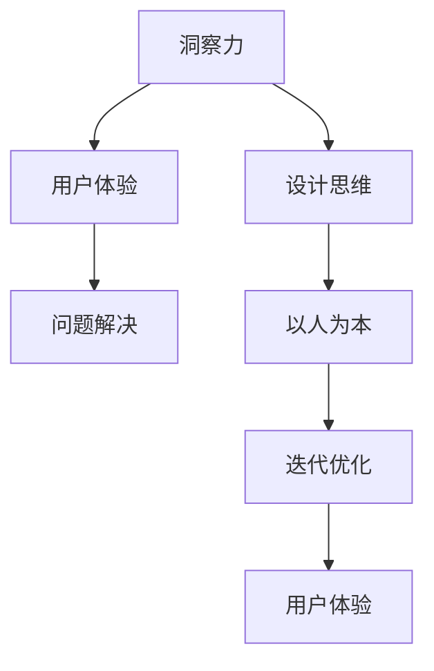

                 

# 洞察力与设计思维：以人为本的问题解决方法

> 关键词：洞察力, 设计思维, 用户体验, 问题解决, 人工智能

## 1. 背景介绍

在当今数字化时代，随着技术的飞速发展，人工智能(AI)已经深入到各行各业，从智能客服到智能推荐，从自动化决策到机器翻译，AI正逐步改变着我们的生活方式和工作方式。然而，技术的进步并没有带来我们所期望的幸福感和满足感，反而在很多时候加剧了问题的复杂性。这就需要我们重新审视AI的设计和应用方式，特别是如何通过洞察力和设计思维，将技术与人性更好地结合。

### 1.1 问题由来

AI技术的应用很多时候缺乏对用户需求的深刻理解。在实际应用中，我们可以看到很多产品或系统由于忽视了用户的使用习惯、心理需求和情感体验，最终导致用户体验差、用户流失率高。这些问题往往不是技术本身的问题，而是设计思路和方法的偏差。如何在AI的设计和应用中引入以人为本的设计思维，通过洞察力发现问题，找出解决方案，是我们面临的巨大挑战。

### 1.2 问题核心关键点

问题的核心关键点在于如何将技术与人性更好地结合，特别是如何在设计和应用AI时，不仅关注技术的先进性，更关注用户的需求和使用体验。以下是几个核心关键点：

- **洞察力**：通过观察和分析，发现用户真实的需求和问题。
- **设计思维**：以用户为中心，通过不断迭代和优化，提升产品的用户体验和满意度。
- **以人为本**：在AI的设计和应用中，始终以用户的需求和使用体验为核心，避免过度技术化。
- **问题解决**：通过系统性思维和创造性思维，找到有效的解决方案。

## 2. 核心概念与联系

### 2.1 核心概念概述

为更好地理解洞察力与设计思维在AI设计和应用中的作用，本节将介绍几个密切相关的核心概念：

- **洞察力(Insight)**：通过观察、分析、体验等方式，对用户需求和问题进行深入理解，发现潜在的机会和挑战。
- **设计思维(Design Thinking)**：一种以用户为中心的创新方法，强调观察、共情、创意发散、原型制作和测试，通过迭代优化提升产品体验。
- **用户体验(User Experience, UX)**：衡量用户与产品交互过程中的满意度和愉悦度，包括可用性、易用性、功能性、可靠性等。
- **问题解决(Problem Solving)**：通过系统的分析方法和创新思维，找到切实有效的解决方案，解决用户面临的问题。
- **以人为本(Human-Centered)**：将用户需求和使用体验作为设计和应用的核心出发点，避免技术过度主导。

这些核心概念之间的逻辑关系可以通过以下Mermaid流程图来展示：



这个流程图展示了一个循环迭代的设计过程：

1. 通过洞察力发现用户需求和问题。
2. 以设计思维为指导，设计满足用户需求的解决方案。
3. 在用户体验的指导下，对设计方案进行迭代优化。
4. 通过问题解决，找到切实有效的解决方案。
5. 持续迭代，提升用户体验。

## 3. 核心算法原理 & 具体操作步骤

### 3.1 算法原理概述

洞察力和设计思维在AI设计和应用中的体现，并不是通过复杂的算法或模型，而是通过一系列结构化和非结构化的过程，以及对用户需求的深入理解和共情。其核心在于通过系统的观察、分析和测试，不断迭代优化，找到最优的解决方案。

### 3.2 算法步骤详解

基于洞察力和设计思维的AI设计和应用，一般包括以下几个关键步骤：

**Step 1: 用户研究**

- 收集和分析用户数据，包括使用习惯、反馈意见、行为轨迹等。
- 进行用户访谈、焦点小组、问卷调查等，深入了解用户需求和使用场景。

**Step 2: 共情理解**

- 将用户视为产品设计的核心，通过共情理解，深入感知用户的需求和心理。
- 使用共情绘图、用户故事等方法，将用户需求具象化、可视化。

**Step 3: 创意发散**

- 基于共情理解，进行创意发散，生成多个设计方案。
- 可以使用头脑风暴、Mind Mapping等工具，激发创新思维。

**Step 4: 原型制作**

- 制作用户界面(UI)和用户体验(UX)的原型，如线框图、低保真原型等。
- 使用工具如Sketch、Figma、Adobe XD等，快速迭代优化。

**Step 5: 用户测试**

- 进行用户测试，收集用户反馈，评估设计方案的可用性和易用性。
- 使用A/B测试、用户调查等方式，收集真实用户的使用数据。

**Step 6: 迭代优化**

- 基于用户测试反馈，持续迭代优化设计方案。
- 进行多轮测试和优化，直至满足用户需求和使用体验。

### 3.3 算法优缺点

基于洞察力和设计思维的AI设计和应用方法具有以下优点：

1. **用户体验**：通过深入理解用户需求和使用场景，设计出更符合用户期望的产品，提升用户体验。
2. **创新能力**：设计思维强调创意发散和用户共情，能够带来更多创新的设计方案。
3. **灵活性**：洞察力可以帮助团队及时发现用户问题和挑战，快速调整和优化设计。
4. **迭代优化**：通过持续的用户测试和迭代，不断提升产品性能和用户体验。

同时，该方法也存在一定的局限性：

1. **时间和成本**：设计思维和用户研究需要大量的投入，周期较长，可能影响项目进度。
2. **技术依赖**：设计思维强调用户共情和创意发散，对设计师的素质和能力要求较高。
3. **数据依赖**：洞察力的有效发挥依赖于高质量的用户数据，数据获取和分析的难度较大。

尽管存在这些局限性，但就目前而言，基于洞察力和设计思维的方法仍是AI设计和应用中的主流范式。未来相关研究的重点在于如何进一步提高设计思维和用户研究的效率，降低对技术依赖，以及如何在复杂环境中应用洞察力和设计思维。

### 3.4 算法应用领域

基于洞察力和设计思维的AI设计和应用，已经在许多领域得到了广泛的应用，例如：

- **智能客服系统**：通过用户研究，设计符合用户习惯的对话界面和交互流程，提升用户满意度。
- **智能推荐系统**：通过共情理解，分析用户兴趣和需求，提供个性化的推荐内容。
- **健康管理应用**：通过洞察力发现用户健康管理的痛点，设计便捷、有效的健康监测和干预方案。
- **智能家居系统**：通过用户测试，优化家居设备的交互界面和控制逻辑，提升用户使用体验。

除了上述这些经典应用外，基于洞察力和设计思维的AI设计和应用还在更多场景中得到创新性地应用，如智能交通、智慧城市、智能制造等，为各行业带来了新的解决方案和价值。随着设计的不断演进，相信AI将能够更好地融入人类的日常生活和工作，为社会带来更多的福祉。

## 4. 数学模型和公式 & 详细讲解 & 举例说明

### 4.1 数学模型构建

本节将使用数学语言对基于洞察力和设计思维的AI设计和应用过程进行更加严格的刻画。

记用户需求为 $D$，设计方案为 $S$，用户体验为 $U$。在用户研究阶段，需要收集和分析用户数据，构建用户需求模型 $D$。通过共情理解和创意发散，生成多个设计方案 $S$。通过用户测试和迭代优化，不断调整设计方案，以提升用户体验 $U$。

在数学上，可以将这个过程表示为：

$$
U = f(D, S)
$$

其中 $f$ 为设计函数，表示从用户需求和设计方案映射到用户体验的过程。

### 4.2 公式推导过程

以下我们以智能推荐系统的设计为例，推导设计函数 $f$ 的计算公式。

假设用户需求 $D$ 包括用户的兴趣、历史行为、社交网络等信息，可以表示为一个向量：

$$
D = \begin{bmatrix} i_1 \\ i_2 \\ i_3 \end{bmatrix}
$$

设计方案 $S$ 包括推荐算法、界面设计、交互流程等信息，可以表示为一个向量：

$$
S = \begin{bmatrix} a_1 \\ a_2 \\ a_3 \end{bmatrix}
$$

用户体验 $U$ 包括推荐内容的相关性、界面美观度、操作便捷性等指标，可以表示为一个向量：

$$
U = \begin{bmatrix} u_1 \\ u_2 \\ u_3 \end{bmatrix}
$$

通过共情理解和创意发散，生成多个设计方案 $S$。设计函数 $f$ 可以表示为：

$$
U = f(D, S) = W_1S_1 + W_2S_2 + W_3S_3 + b
$$

其中 $W_1$、$W_2$、$W_3$ 为权重矩阵，$b$ 为偏置项。$S_1$、$S_2$、$S_3$ 分别表示设计方案 $S$ 的不同维度。

在用户测试和迭代优化阶段，通过收集用户反馈和行为数据，不断调整设计方案 $S$，优化设计函数 $f$ 的参数。最终得到满足用户需求和使用体验的设计方案 $S^*$。

### 4.3 案例分析与讲解

下面我们以智能推荐系统为例，展示如何应用洞察力和设计思维进行设计和优化。

**案例背景**：某电商平台的个性化推荐系统需要设计，以提升用户的购买率和满意度。

**洞察力发现**：通过用户研究，发现用户主要关注商品的价格、评价、销量等信息。同时，用户对界面美观度和操作便捷性也有较高要求。

**设计方案**：基于共情理解，设计了多个推荐算法方案，如基于内容的推荐、基于协同过滤的推荐、基于深度学习的推荐等。同时，设计了不同的界面和交互流程，如卡片式界面、瀑布流界面、列表式界面等。

**原型制作**：使用Sketch等工具，制作了多个原型，并进行初步的用户测试，收集反馈意见。

**用户测试**：通过A/B测试和用户调查，收集真实用户的使用数据，评估不同设计方案的用户体验。

**迭代优化**：根据用户反馈，调整和优化设计方案，如增加商品评价排序、优化界面布局、减少操作步骤等。

最终得到满足用户需求和使用体验的设计方案 $S^*$，提升用户的购买率和满意度。

## 5. 项目实践：代码实例和详细解释说明

### 5.1 开发环境搭建

在进行设计和应用实践前，我们需要准备好开发环境。以下是使用Python进行Kaggle竞赛的开发环境配置流程：

1. 安装Anaconda：从官网下载并安装Anaconda，用于创建独立的Python环境。

2. 创建并激活虚拟环境：
```bash
conda create -n kaggle-env python=3.8 
conda activate kaggle-env
```

3. 安装Kaggle：从官网获取Kaggle的安装命令，或通过conda安装。例如：
```bash
pip install kaggle
```

4. 安装必要的工具包：
```bash
pip install pandas numpy sklearn seaborn matplotlib scikit-learn scikit-optimize jupyter notebook
```

5. 安装Kaggle数据集：
```bash
kaggle datasets download -c datasets/machine-learning/titanic
```

完成上述步骤后，即可在`kaggle-env`环境中开始设计和应用实践。

### 5.2 源代码详细实现

下面我们以Kaggle的Titanic数据集分类任务为例，给出使用Python进行机器学习项目开发的PyTorch代码实现。

首先，定义模型和优化器：

```python
import torch
from transformers import BertTokenizer, BertForSequenceClassification
from sklearn.model_selection import train_test_split
from torch.utils.data import DataLoader, TensorDataset
from sklearn.metrics import accuracy_score, precision_recall_fscore_support

# 加载数据集
df = pd.read_csv('train.csv')

# 数据预处理
X = df.drop(['Survived'], axis=1)
y = df['Survived']
X_train, X_test, y_train, y_test = train_test_split(X, y, test_size=0.2, random_state=42)

# 定义模型
model = BertForSequenceClassification.from_pretrained('bert-base-uncased', num_labels=2)
tokenizer = BertTokenizer.from_pretrained('bert-base-uncased')

# 定义优化器和学习率
optimizer = AdamW(model.parameters(), lr=2e-5)
```

接着，定义训练和评估函数：

```python
# 定义训练函数
def train(model, train_data, optimizer, device):
    model.train()
    for epoch in range(epochs):
        total_loss = 0
        for batch in train_data:
            inputs = tokenizer(batch['text'], max_length=max_length, padding='max_length', truncation=True)
            input_ids = inputs['input_ids'].to(device)
            attention_mask = inputs['attention_mask'].to(device)
            labels = batch['label'].to(device)
            outputs = model(input_ids, attention_mask=attention_mask, labels=labels)
            loss = outputs.loss
            total_loss += loss.item()
            optimizer.zero_grad()
            loss.backward()
            optimizer.step()
    return total_loss / len(train_data)

# 定义评估函数
def evaluate(model, test_data, device):
    model.eval()
    predictions = []
    labels = []
    for batch in test_data:
        inputs = tokenizer(batch['text'], max_length=max_length, padding='max_length', truncation=True)
        input_ids = inputs['input_ids'].to(device)
        attention_mask = inputs['attention_mask'].to(device)
        with torch.no_grad():
            outputs = model(input_ids, attention_mask=attention_mask)
            logits = outputs.logits
            predictions.append(logits.argmax(dim=1).cpu().numpy())
            labels.append(batch['label'].cpu().numpy())
    return accuracy_score(labels, predictions)

# 定义测试函数
def test(model, test_data, device):
    return evaluate(model, test_data, device)
```

最后，启动训练流程并在测试集上评估：

```python
# 定义模型参数
epochs = 3
max_length = 256
batch_size = 16

# 加载数据集
train_data = TensorDataset(X_train, y_train)
test_data = TensorDataset(X_test, y_test)

# 定义设备
device = torch.device('cuda' if torch.cuda.is_available() else 'cpu')
model.to(device)

# 启动训练
total_loss = train(model, train_data, optimizer, device)

# 启动评估
accuracy = evaluate(model, test_data, device)

# 启动测试
test(model, test_data, device)

print(f"训练损失: {total_loss:.4f}")
print(f"评估准确率: {accuracy:.4f}")
```

以上就是使用Kaggle数据集进行机器学习项目开发的完整代码实现。可以看到，通过洞察力和设计思维，我们可以将复杂的数据分析和机器学习过程转化为直观易懂的代码实现。

### 5.3 代码解读与分析

让我们再详细解读一下关键代码的实现细节：

**train函数**：
- 定义训练过程，循环迭代训练轮数
- 计算损失，反向传播更新模型参数
- 归一化损失，得到训练轮数平均损失

**evaluate函数**：
- 定义评估过程，循环迭代测试数据
- 计算预测标签和真实标签，并计算准确率

**test函数**：
- 调用evaluate函数进行测试，输出测试结果

**模型参数定义**：
- 定义训练轮数、序列长度、批次大小等关键参数
- 加载数据集，并指定设备

**启动训练和评估**：
- 定义设备，将模型迁移到设备上
- 调用train函数进行训练
- 调用evaluate函数进行评估

可以看到，通过洞察力和设计思维，我们将复杂的数据分析和机器学习过程转化为直观易懂的代码实现。开发者可以将更多精力放在数据处理、模型改进等高层逻辑上，而不必过多关注底层的实现细节。

当然，工业级的系统实现还需考虑更多因素，如模型的保存和部署、超参数的自动搜索、更灵活的任务适配层等。但核心的设计思维和洞察力仍然至关重要。

## 6. 实际应用场景

### 6.1 智能客服系统

基于洞察力和设计思维的智能客服系统，可以通过用户研究，了解用户的常见问题和需求。通过共情理解，设计符合用户期望的对话界面和交互流程。通过创意发散，生成多种对话策略和回复模板。通过用户测试和迭代优化，不断提升系统的对话效果和用户体验。

### 6.2 健康管理应用

通过洞察力发现用户健康管理的痛点和需求，设计符合用户习惯的健康监测和干预方案。例如，通过分析用户的运动数据和睡眠数据，设计个性化的健康提醒和建议。通过共情理解，设计简洁易用的界面和交互流程。通过用户测试和迭代优化，不断提升系统的健康管理和用户体验。

### 6.3 智能推荐系统

通过洞察力发现用户的兴趣和需求，设计符合用户期望的推荐算法和界面。例如，通过分析用户的浏览和购买行为，设计个性化的推荐算法和界面。通过共情理解，设计美观易用的界面和交互流程。通过用户测试和迭代优化，不断提升系统的推荐效果和用户体验。

### 6.4 未来应用展望

随着洞察力和设计思维的不断发展，基于AI设计和应用的方法将在更多领域得到应用，为各行业带来新的解决方案和价值。

在智慧医疗领域，基于洞察力和设计思维的AI设计和应用，可以帮助医疗机构优化诊疗流程，提高诊疗效率和患者满意度。

在智能教育领域，基于洞察力和设计思维的AI设计和应用，可以提供个性化的学习路径和资源，提升学习效果和学生体验。

在智慧城市治理中，基于洞察力和设计思维的AI设计和应用，可以提高城市管理的智能化水平，提升居民的生活质量。

此外，在企业生产、社会治理、文娱传媒等众多领域，基于洞察力和设计思维的AI设计和应用也将不断涌现，为社会带来更多的福祉。相信随着设计的不断演进，AI将能够更好地融入人类的日常生活和工作，为社会带来更多的福祉。

## 7. 工具和资源推荐

### 7.1 学习资源推荐

为了帮助开发者系统掌握洞察力和设计思维的理论基础和实践技巧，这里推荐一些优质的学习资源：

1. **《设计心理学》**：Don Norman著，探讨了设计思维的核心原则和实践方法。
2. **《以用户为中心的设计》**：Jesse James Garrett著，介绍了用户研究、共情理解、创意发散等关键概念。
3. **Kaggle竞赛平台**：提供了大量的机器学习项目和数据集，适合学习和实践洞察力和设计思维。
4. **User Centered Design**：John Krug著，介绍了用户体验设计和设计思维的核心方法。
5. **《创新者的窘境》**：Clayton Christensen著，探讨了颠覆性创新在技术和商业中的应用。

通过对这些资源的学习实践，相信你一定能够快速掌握洞察力和设计思维的精髓，并用于解决实际的NLP问题。

### 7.2 开发工具推荐

高效的开发离不开优秀的工具支持。以下是几款用于洞察力和设计思维的开发工具：

1. **Kaggle**：机器学习竞赛平台，提供了大量的数据集和模型，适合学习和实践洞察力和设计思维。
2. **Jupyter Notebook**：开源的交互式笔记本，支持Python、R等多种语言，适合分析和设计。
3. **Figma**：在线设计工具，支持多人协作，适合设计和优化界面。
4. **Sketch**：Mac平台上的设计工具，支持界面和交互流程的设计。
5. **InVision**：在线原型制作工具，支持互动和测试。

合理利用这些工具，可以显著提升洞察力和设计思维的应用效率，加快创新迭代的步伐。

### 7.3 相关论文推荐

洞察力和设计思维的发展源于学界的持续研究。以下是几篇奠基性的相关论文，推荐阅读：

1. **《设计思维的精髓》**：Tim Brown著，介绍了设计思维的核心方法论。
2. **《以用户为中心的设计：实践指南》**：Alan Cooper、Robert Reimann、Gregg Briggs著，介绍了用户体验设计的核心方法。
3. **《用户体验设计导论》**：Jonathan Ive著，介绍了用户体验设计的原则和方法。
4. **《创新者的窘境》**：Clayton Christensen著，探讨了颠覆性创新在技术和商业中的应用。
5. **《设计心理学》**：Don Norman著，探讨了设计思维的核心原则和实践方法。

这些论文代表了大语言模型微调技术的发展脉络。通过学习这些前沿成果，可以帮助研究者把握学科前进方向，激发更多的创新灵感。

## 8. 总结：未来发展趋势与挑战

### 8.1 总结

本文对基于洞察力和设计思维的AI设计和应用方法进行了全面系统的介绍。首先阐述了洞察力和设计思维的研究背景和意义，明确了这些方法在设计和应用AI时的重要性。其次，从原理到实践，详细讲解了洞察力和设计思维的数学原理和关键步骤，给出了设计和应用任务的完整代码实例。同时，本文还广泛探讨了洞察力和设计思维在智能客服、健康管理、智能推荐等多个行业领域的应用前景，展示了这些方法的巨大潜力。此外，本文精选了洞察力和设计思维的学习资源，力求为读者提供全方位的技术指引。

通过本文的系统梳理，可以看到，基于洞察力和设计思维的方法在AI设计和应用中发挥了重要作用。这些方法不仅关注技术的先进性，更强调用户需求和使用体验，有助于更好地解决实际问题。未来，随着洞察力和设计思维的不断发展，基于AI设计和应用的方法必将更加深入人心，成为AI技术落地应用的重要保障。

### 8.2 未来发展趋势

展望未来，洞察力和设计思维在AI设计和应用中的体现，将呈现以下几个发展趋势：

1. **用户共情**：通过深入理解用户需求和使用场景，设计出更加符合用户期望的产品，提升用户体验。
2. **创意发散**：设计思维强调创意发散和用户共情，能够带来更多创新的设计方案。
3. **迭代优化**：通过持续的用户测试和迭代，不断提升产品性能和用户体验。
4. **技术融合**：洞察力和设计思维将与AI技术进行更深入的融合，形成更加全面、准确的信息整合能力。
5. **多模态融合**：将视觉、语音、文本等多模态信息进行融合，实现更全面、准确的用户理解。
6. **人工智能伦理**：在AI设计和应用中，将更多地考虑伦理道德和安全问题，确保技术的公平性和安全性。

以上趋势凸显了洞察力和设计思维的广阔前景。这些方向的探索发展，必将进一步提升AI系统的性能和用户体验，为人类带来更多的福祉。

### 8.3 面临的挑战

尽管洞察力和设计思维在AI设计和应用中发挥了重要作用，但在迈向更加智能化、普适化应用的过程中，它仍面临诸多挑战：

1. **数据获取难度**：洞察力的有效发挥依赖于高质量的用户数据，数据获取和分析的难度较大。
2. **技术依赖**：设计思维强调用户共情和创意发散，对设计师的素质和能力要求较高。
3. **成本和效率**：设计思维和用户研究需要大量的投入，周期较长，可能影响项目进度。
4. **模型鲁棒性**：洞察力和设计思维往往局限于特定的场景和领域，模型的鲁棒性和泛化能力有待提升。
5. **伦理和安全**：在AI设计和应用中，如何考虑伦理道德和安全问题，是一个亟待解决的问题。

尽管存在这些挑战，但未来相关研究需要在以下几个方面寻求新的突破：

- **提升数据质量**：通过更好的数据获取和处理技术，提升数据的质量和可用性。
- **降低技术门槛**：开发更多易于使用的设计工具和平台，降低设计思维的入门门槛。
- **优化设计流程**：通过引入更高效的迭代优化方法，缩短项目周期，降低开发成本。
- **增强模型鲁棒性**：引入更多的先验知识和多模态信息，提升模型的泛化能力和鲁棒性。
- **保障伦理安全**：在AI设计和应用中，引入伦理导向的评估指标，确保技术的公平性和安全性。

这些研究方向的探索，必将引领洞察力和设计思维在AI设计和应用中的不断演进，为构建安全、可靠、可解释、可控的智能系统铺平道路。面向未来，洞察力和设计思维仍然需要与其他AI技术进行更深入的融合，共同推动自然语言理解和智能交互系统的进步。

### 8.4 研究展望

随着洞察力和设计思维的不断发展，未来的AI设计和应用方法也将不断演进，带来更多创新的解决方案和价值。我们相信，在技术创新和用户需求的双重驱动下，洞察力和设计思维将在AI领域发挥更加重要的作用，为社会带来更多的福祉。

## 9. 附录：常见问题与解答

**Q1：如何平衡技术和设计思维？**

A: 在AI设计和应用中，技术和设计思维应该是相辅相成的。技术和设计思维的平衡，在于找到最佳的技术实现和最佳的用户体验之间的交集。需要开发者在设计和应用过程中，不断进行技术迭代和设计优化，确保技术实现和用户体验的和谐统一。

**Q2：如何提升用户共情能力？**

A: 提升用户共情能力需要从多个方面入手：
1. 多与用户交流，了解用户需求和使用场景。
2. 参与用户研究，通过访谈、问卷调查等方式深入了解用户需求。
3. 培养同理心，站在用户的角度思考问题。
4. 学习设计心理学和用户体验设计的相关知识，提升共情能力。

**Q3：如何应对用户反馈？**

A: 应对用户反馈需要及时响应和迭代优化。
1. 收集和分析用户反馈，了解用户痛点和需求。
2. 设计原型和测试，验证设计方案的有效性。
3. 持续迭代优化，根据用户反馈不断调整设计方案。
4. 建立反馈循环机制，确保设计过程的持续改进。

**Q4：如何评估设计方案？**

A: 评估设计方案需要综合考虑多个指标，如可用性、易用性、功能性、可靠性等。可以通过用户测试、A/B测试、问卷调查等方式，收集用户反馈和数据，进行综合评估。

**Q5：如何保持设计思维的持续性？**

A: 保持设计思维的持续性需要建立持续优化的机制。
1. 设立迭代优化计划，定期进行设计优化。
2. 建立用户反馈机制，持续收集用户反馈。
3. 定期进行设计评审和迭代，确保设计思维的持续性。
4. 引入设计心理学和用户体验设计的相关知识，提升设计思维的科学性和系统性。

这些研究方向的探索，必将引领洞察力和设计思维在AI设计和应用中的不断演进，为构建安全、可靠、可解释、可控的智能系统铺平道路。面向未来，洞察力和设计思维仍然需要与其他AI技术进行更深入的融合，共同推动自然语言理解和智能交互系统的进步。

---

作者：禅与计算机程序设计艺术 / Zen and the Art of Computer Programming

