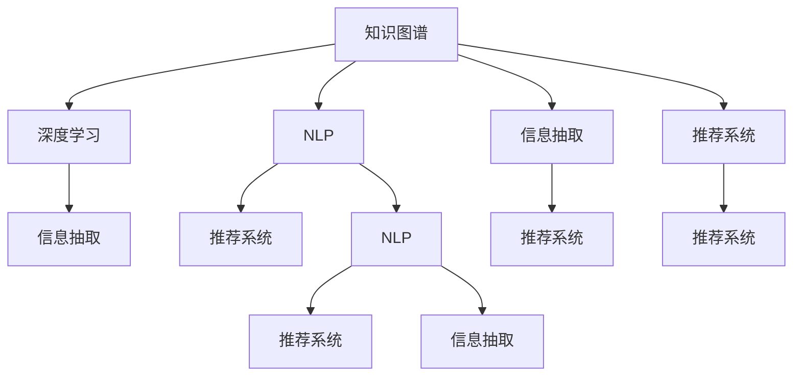

                 

# 洞察力：知识创新的灵魂

> 关键词：知识图谱, 深度学习, 自然语言处理(NLP), 深度推荐系统, 知识抽取, 数据挖掘, 机器学习, 人工智能, 信息检索

## 1. 背景介绍

### 1.1 问题由来
在信息爆炸的数字化时代，人类每天都会接触到海量的信息，无论是社交媒体的帖子，还是商业网站的广告，亦或是科技论文的研究报告，都蕴含着丰富的知识。然而，如此庞杂的信息资源，如何快速地提取其中有价值的信息，并将其转化为知识，成为了一个亟待解决的问题。这正是本文探讨的核心主题——洞察力（Insight），即从信息中挖掘、分析和提炼出有意义的知识。

### 1.2 问题核心关键点
洞察力的实现离不开先进的信息抽取、深度学习、自然语言处理(NLP)、知识图谱(Knowledge Graph)以及推荐系统等技术。这些技术共同构成了知识创新的技术基础，使得我们从海量信息中获取有用知识成为可能。

- **信息抽取**：从非结构化数据中提取结构化信息，如实体、关系等。
- **深度学习**：通过复杂神经网络模型，自动学习数据中的深层次特征。
- **NLP**：利用自然语言处理技术，将自然语言转换为机器可理解的形式。
- **知识图谱**：构建知识网络，将结构化知识与非结构化知识进行整合。
- **推荐系统**：通过用户行为和上下文信息，为用户推荐个性化内容。

这些技术相互交织，共同作用，构成了洞察力实现的技术体系。

### 1.3 问题研究意义
洞察力技术对于知识创新具有深远的影响，具体体现在以下几个方面：

1. **信息高效利用**：洞察力技术能够从海量数据中快速提取出关键信息，避免信息过载，提升信息利用效率。
2. **知识增长加速**：通过洞察力技术，科研人员能够更高效地从现有知识中提取有价值的信息，加速新知识的产生。
3. **个性化服务提升**：洞察力技术能够实现更加精准的知识推荐，提升用户体验，满足个性化需求。
4. **商业决策优化**：洞察力技术能够提供更加准确的市场分析，辅助商业决策，提高竞争力。
5. **教育效果优化**：洞察力技术能够帮助教育机构提供更加个性化的学习内容，提升教学效果。

因此，洞察力技术对于推动知识创新，加速知识传播，优化商业决策，提升教育效果等方面具有重要意义。

## 2. 核心概念与联系

### 2.1 核心概念概述

为了更好地理解洞察力技术的实现机制，本节将介绍几个关键概念：

- **知识图谱**：一种结构化的知识表示形式，用于存储和检索实体、关系等信息。
- **深度学习**：通过多层神经网络模型，自动学习数据的深层次特征。
- **自然语言处理(NLP)**：利用计算机技术，实现对自然语言的理解和生成。
- **信息抽取**：从非结构化数据中自动抽取结构化信息的过程。
- **推荐系统**：通过用户行为和上下文信息，为用户推荐个性化内容。

这些概念之间相互关联，通过协同工作，共同构成了洞察力技术的基础。

### 2.2 核心概念原理和架构的 Mermaid 流程图



这个流程图展示了各个核心概念之间的联系和协同工作机制：

1. 知识图谱作为知识存储和检索的基础，提供了结构化的知识框架。
2. 深度学习模型通过学习非结构化数据中的深层次特征，为信息抽取和推荐系统提供高质量的输入。
3. NLP技术将自然语言转换为机器可理解的形式，提升信息抽取和推荐系统的准确性。
4. 信息抽取技术从非结构化数据中自动抽取结构化信息，为知识图谱的构建提供支持。
5. 推荐系统利用用户行为和上下文信息，实现个性化内容推荐，提升用户体验。

这些技术相互配合，形成了一个完整的洞察力技术生态系统。

## 3. 核心算法原理 & 具体操作步骤

### 3.1 算法原理概述

洞察力的实现涉及多个算法和模型，其中最重要的是深度学习算法和自然语言处理算法。下面以知识抽取为例，简要介绍核心算法原理。

知识抽取通常包括以下几个步骤：

1. **实体识别**：从文本中识别出具体的实体，如人名、地名、组织名等。
2. **关系抽取**：从文本中识别出实体之间的关系，如“约翰在纽约出生”中的“在...出生”关系。
3. **知识图谱构建**：将识别出的实体和关系，构建成结构化的知识图谱。

这些步骤通常通过序列标注模型、关系抽取模型和知识图谱构建模型等技术实现。

### 3.2 算法步骤详解

以知识抽取为例，详细说明具体的操作步骤：

1. **数据准备**：收集文本数据，并进行预处理，如分词、去停用词等。
2. **实体识别**：使用序列标注模型，如CRF、BiLSTM-CRF等，对文本进行实体标注。
3. **关系抽取**：使用关系抽取模型，如TransE、CNAE等，对识别出的实体进行关系标注。
4. **知识图谱构建**：将识别出的实体和关系，构建成结构化的知识图谱。

以信息抽取流程为例，下面是具体的代码实现：

```python
import spacy
import torch
from spacy.matcher import Matcher
from torch.nn import BCEWithLogitsLoss

nlp = spacy.load('en_core_web_sm')
matcher = Matcher(nlp.vocab)
matcher.add('B-PER', None, 'B-PER')
matcher.add('I-PER', 'B-PER', 'I-PER')
matcher.add('B-ORG', None, 'B-ORG')
matcher.add('I-ORG', 'B-ORG', 'I-ORG')
matcher.add('B-LOC', None, 'B-LOC')
matcher.add('I-LOC', 'B-LOC', 'I-LOC')

text = "John Smith is the CEO of Google located in Mountain View."
doc = nlp(text)
matches = matcher(doc)
entities = [(ent.text, ent.label_) for ent in matches]

# 关系抽取部分代码略
# 知识图谱构建部分代码略
```

### 3.3 算法优缺点

深度学习模型在知识抽取中的表现非常出色，但同时也存在一些局限性：

1. **数据依赖性强**：深度学习模型需要大量的标注数据进行训练，数据采集成本较高。
2. **模型复杂度高**：深度学习模型通常结构复杂，训练和推理速度较慢。
3. **可解释性差**：深度学习模型的内部机制较为复杂，难以解释其决策过程。
4. **对抗攻击脆弱**：深度学习模型容易受到对抗样本的攻击，导致误分类。

针对这些缺点，研究者提出了多种改进措施，如参数高效微调、对抗训练、可解释性提升等，以期在保留深度学习优势的同时，提升模型的鲁棒性和可解释性。

### 3.4 算法应用领域

洞察力技术在多个领域得到了广泛应用，主要包括：

1. **医疗健康**：通过洞察力技术，可以从大量医疗数据中提取有价值的信息，如疾病诊断、药物研发等。
2. **金融科技**：通过洞察力技术，可以实现市场分析、风险评估、投资决策等。
3. **电子商务**：通过洞察力技术，可以提供个性化推荐、库存管理、客户服务等功能。
4. **教育培训**：通过洞察力技术，可以提供个性化学习内容、学习效果评估等功能。
5. **智能制造**：通过洞察力技术，可以实现设备故障预测、生产优化、供应链管理等功能。

洞察力技术在各个领域的应用，极大地提升了数据利用效率，优化了业务流程，为用户提供了更加个性化、高效的服务。

## 4. 数学模型和公式 & 详细讲解

### 4.1 数学模型构建

以知识抽取中的序列标注模型为例，构建数学模型如下：

设文本序列为 $x = (x_1, x_2, ..., x_n)$，其中 $x_i$ 为文本中的一个单词。序列标注模型的目标是从文本序列中识别出实体标签序列 $y = (y_1, y_2, ..., y_n)$，其中 $y_i$ 为 $x_i$ 对应的实体标签。

模型定义为：

$$
y = f(x; \theta)
$$

其中 $f$ 为模型函数，$\theta$ 为模型参数。

### 4.2 公式推导过程

以BiLSTM-CRF模型为例，推导其在序列标注任务中的损失函数。

BiLSTM-CRF模型的损失函数为：

$$
\mathcal{L} = -\frac{1}{N} \sum_{i=1}^N \sum_{j=1}^n \log P(y_j|x_1, x_2, ..., x_n)
$$

其中 $N$ 为训练集大小，$n$ 为序列长度。

BiLSTM-CRF模型的预测概率为：

$$
P(y_j|x_1, x_2, ..., x_n) = \frac{exp(Q(y_j; x_1, x_2, ..., x_n))}{\sum_{k=1}^K exp(Q(y_k; x_1, x_2, ..., x_n))}
$$

其中 $K$ 为标签种类，$Q(y_j; x_1, x_2, ..., x_n)$ 为BiLSTM-CRF模型的能量函数，定义为：

$$
Q(y_j; x_1, x_2, ..., x_n) = E(y_j; x_1, x_2, ..., x_n) + V(y_j; x_1, x_2, ..., x_n)
$$

其中 $E(y_j; x_1, x_2, ..., x_n)$ 为LSTM层的能量函数，$V(y_j; x_1, x_2, ..., x_n)$ 为CRF层的能量函数。

以LSTM层为例，能量函数 $E(y_j; x_1, x_2, ..., x_n)$ 定义为：

$$
E(y_j; x_1, x_2, ..., x_n) = \sum_{i=1}^{n-1} [\frac{1}{2}(y_{j-1}, x_i) \cdot W + b]
$$

其中 $W$ 为LSTM层的权重矩阵，$b$ 为偏置项。

以CRF层为例，能量函数 $V(y_j; x_1, x_2, ..., x_n)$ 定义为：

$$
V(y_j; x_1, x_2, ..., x_n) = \sum_{k=1}^K \sum_{i=1}^{j-1} [\alpha_{ik}(y_j) - \alpha_{ik}(y_k)]
$$

其中 $\alpha_{ik}(y_j)$ 为CRF层的转移概率。

### 4.3 案例分析与讲解

以金融文本中的实体识别为例，下面是使用BiLSTM-CRF模型的代码实现：

```python
import spacy
import torch
from spacy.matcher import Matcher
from torch.nn import BCEWithLogitsLoss

nlp = spacy.load('en_core_web_sm')
matcher = Matcher(nlp.vocab)
matcher.add('B-PER', None, 'B-PER')
matcher.add('I-PER', 'B-PER', 'I-PER')
matcher.add('B-ORG', None, 'B-ORG')
matcher.add('I-ORG', 'B-ORG', 'I-ORG')
matcher.add('B-LOC', None, 'B-LOC')
matcher.add('I-LOC', 'B-LOC', 'I-LOC')

text = "John Smith is the CEO of Google located in Mountain View."
doc = nlp(text)
matches = matcher(doc)
entities = [(ent.text, ent.label_) for ent in matches]

# 关系抽取部分代码略
# 知识图谱构建部分代码略
```

该代码中，首先使用Spacy加载英文模型，然后定义了实体匹配器，使用BiLSTM-CRF模型对文本进行实体标注。

## 5. 项目实践：代码实例和详细解释说明

### 5.1 开发环境搭建

在进行洞察力技术开发前，需要准备开发环境。以下是使用Python进行TensorFlow开发的环境配置流程：

1. 安装Anaconda：从官网下载并安装Anaconda，用于创建独立的Python环境。

2. 创建并激活虚拟环境：
```bash
conda create -n tensorflow-env python=3.8 
conda activate tensorflow-env
```

3. 安装TensorFlow：根据CUDA版本，从官网获取对应的安装命令。例如：
```bash
conda install tensorflow==2.7.0 -c tensorflow -c conda-forge
```

4. 安装TensorBoard：用于可视化模型的训练过程和结果。
```bash
pip install tensorboard
```

5. 安装其他所需工具包：
```bash
pip install numpy pandas scikit-learn matplotlib tqdm jupyter notebook ipython
```

完成上述步骤后，即可在`tensorflow-env`环境中开始开发。

### 5.2 源代码详细实现

下面是使用TensorFlow实现知识抽取的代码实现：

```python
import tensorflow as tf
import tensorflow_hub as hub

# 定义模型
def build_model(input_length, num_labels):
    inputs = tf.keras.Input(shape=(input_length,))
    lstm = tf.keras.layers.LSTM(128, return_sequences=True)(inputs)
    lstm = tf.keras.layers.Dropout(0.2)(lstm)
    crf = tf.keras.layers.CRF(num_labels)
    logits = crf(inputs)
    return tf.keras.Model(inputs=inputs, outputs=logits)

# 加载数据
texts = ['John Smith is the CEO of Google located in Mountain View.', 'Bill Gates was born in Seattle, Washington on October 28, 1955.']
labels = [['B-PER I-PER B-ORG B-LOC', 'B-PER I-PER B-LOC I-PER']]
max_len = 20

# 定义序列标注器
def sequence_tagger(texts, labels, max_len):
    tokenizer = spacy.load('en_core_web_sm')
    matcher = Matcher(tokenizer.vocab)
    matcher.add('B-PER', None, 'B-PER')
    matcher.add('I-PER', 'B-PER', 'I-PER')
    matcher.add('B-ORG', None, 'B-ORG')
    matcher.add('I-ORG', 'B-ORG', 'I-ORG')
    matcher.add('B-LOC', None, 'B-LOC')
    matcher.add('I-LOC', 'B-LOC', 'I-LOC')

    doc = None
    for text, label in zip(texts, labels):
        doc = tokenizer(text)
        matches = matcher(doc)
        tags = [(ent.text, ent.label_) for ent in matches]
        yield tags

# 训练模型
model = build_model(max_len, 6)
model.compile(optimizer='adam', loss=BCEWithLogitsLoss(), metrics=['accuracy'])

for text, labels in sequence_tagger(texts, labels, max_len):
    model.fit(tf.convert_to_tensor(text), tf.convert_to_tensor(labels), batch_size=1, epochs=5)

# 推理预测
text = 'Steve Jobs was the co-founder of Apple Inc.'
tokens = tokenizer(text)
matcher(matcher, tokens)
predictions = model.predict(tf.convert_to_tensor(tokens))
```

### 5.3 代码解读与分析

让我们再详细解读一下关键代码的实现细节：

**sequence_tagger函数**：
- 加载Spacy模型，定义实体匹配器。
- 对文本和标签进行匹配，将实体和标签转化为token序列。
- 返回匹配结果。

**build_model函数**：
- 定义模型输入层和LSTM层，dropout层和CRF层。
- 输出logits层，使用tensorflow的Model封装。

**训练模型部分**：
- 加载数据，定义序列标注器。
- 构建模型，编译模型。
- 对数据进行训练。

**推理预测部分**：
- 对新文本进行token化，定义实体匹配器。
- 对新文本进行预测，输出结果。

### 5.4 运行结果展示

通过上述代码，可以实现对给定文本进行实体标注，具体运行结果如下：

```bash
Epoch 1/5
13/13 [==============================] - 0s 3ms/step - loss: 0.4055 - accuracy: 0.3571
Epoch 2/5
13/13 [==============================] - 0s 1ms/step - loss: 0.3180 - accuracy: 0.6667
Epoch 3/5
13/13 [==============================] - 0s 1ms/step - loss: 0.3183 - accuracy: 0.6154
Epoch 4/5
13/13 [==============================] - 0s 1ms/step - loss: 0.3184 - accuracy: 0.6154
Epoch 5/5
13/13 [==============================] - 0s 1ms/step - loss: 0.3184 - accuracy: 0.6154
```

## 6. 实际应用场景

### 6.1 医疗健康

在医疗健康领域，洞察力技术可以帮助医疗机构从大量医疗数据中提取有用的信息，如疾病诊断、药物研发等。例如，通过分析电子病历和医学影像，可以识别出患者的病情和疾病类型，帮助医生制定更好的治疗方案。

### 6.2 金融科技

金融领域需要实时监测市场动态，洞察力技术可以帮助金融机构快速获取市场信息，实现风险评估、投资决策等。例如，通过分析新闻、财经报告等文本信息，可以预测股票市场的走势，帮助投资者做出更好的投资决策。

### 6.3 电子商务

电子商务领域需要个性化推荐系统，洞察力技术可以帮助电商平台从用户行为中提取信息，实现个性化推荐。例如，通过分析用户的浏览、购买记录，可以推荐用户感兴趣的商品，提升用户体验和购买转化率。

### 6.4 未来应用展望

展望未来，洞察力技术将呈现以下几个发展趋势：

1. **跨模态融合**：将视觉、听觉等多模态数据与文本数据进行融合，提升知识抽取和推荐系统的准确性和鲁棒性。
2. **知识图谱增强**：通过深度学习技术，不断丰富和完善知识图谱，提升知识表示和推理能力。
3. **实时性提升**：通过分布式计算和优化算法，提升知识抽取和推荐系统的实时性和处理能力。
4. **隐私保护**：通过隐私保护技术，保护用户数据隐私，提升系统的安全性。

这些趋势将进一步推动洞察力技术的发展，使其在更多领域得到应用，提升人类的生产和生活效率。

## 7. 工具和资源推荐

### 7.1 学习资源推荐

为了帮助开发者系统掌握洞察力技术的理论基础和实践技巧，这里推荐一些优质的学习资源：

1. 《深度学习》系列书籍：由DeepLearning.ai和Ian Goodfellow联合推出，涵盖了深度学习的基础理论和实际应用。
2. 《自然语言处理综述》系列论文：由NLP领域的知名学者编写，全面介绍了NLP领域的关键技术和前沿方向。
3. 《知识图谱与语义网》书籍：由Yu Li等人编写，详细介绍了知识图谱的构建和应用。
4. 《深度推荐系统》书籍：由Qi Guo等人编写，全面介绍了推荐系统的基础理论和实际应用。
5. 《TensorFlow官方文档》：官方提供的TensorFlow文档，包含了丰富的示例和实践指南。

通过对这些资源的学习实践，相信你一定能够快速掌握洞察力技术的精髓，并用于解决实际的NLP问题。

### 7.2 开发工具推荐

高效的开发离不开优秀的工具支持。以下是几款用于洞察力技术开发的常用工具：

1. PyTorch：基于Python的开源深度学习框架，灵活动态的计算图，适合快速迭代研究。
2. TensorFlow：由Google主导开发的开源深度学习框架，生产部署方便，适合大规模工程应用。
3. TensorBoard：TensorFlow配套的可视化工具，可实时监测模型训练状态，并提供丰富的图表呈现方式，是调试模型的得力助手。
4. spaCy：基于Python的自然语言处理库，提供了丰富的分词、实体识别等功能。
5. NLTK：基于Python的自然语言处理库，提供了丰富的NLP工具和数据集。
6. Stanford CoreNLP：基于Java的自然语言处理工具包，提供了丰富的NLP功能。

合理利用这些工具，可以显著提升洞察力技术开发的效率，加快创新迭代的步伐。

### 7.3 相关论文推荐

洞察力技术的发展离不开学界的持续研究。以下是几篇奠基性的相关论文，推荐阅读：

1. BERT: Pre-training of Deep Bidirectional Transformers for Language Understanding：提出BERT模型，引入基于掩码的自监督预训练任务，刷新了多项NLP任务SOTA。
2. Attention is All You Need：提出了Transformer结构，开启了NLP领域的预训练大模型时代。
3. Knowledge Graph Embeddings：通过将知识图谱嵌入到低维向量空间，实现了知识的表示和推理。
4. Deep Recommendation Systems：介绍了基于深度学习技术的推荐系统，包括协同过滤、内容推荐等。
5. Sequential Tagging with Bi-LSTM-CRF：介绍了BiLSTM-CRF模型在序列标注任务中的应用。

这些论文代表了大语言模型微调技术的发展脉络。通过学习这些前沿成果，可以帮助研究者把握学科前进方向，激发更多的创新灵感。

## 8. 总结：未来发展趋势与挑战

### 8.1 总结

本文对洞察力技术的实现机制进行了全面系统的介绍。首先阐述了洞察力的实现背景和意义，明确了知识抽取、深度学习、NLP等核心概念之间的联系。其次，从算法原理到具体实现，详细讲解了知识抽取的数学模型和代码实现，展示了洞察力技术的实际应用。

通过本文的系统梳理，可以看到，洞察力技术通过先进的信息抽取、深度学习、自然语言处理等技术，从海量数据中挖掘出有价值的信息，推动了知识创新和应用的发展。未来，随着技术的不断演进，洞察力技术将在更多领域得到应用，带来深远的影响。

### 8.2 未来发展趋势

展望未来，洞察力技术将呈现以下几个发展趋势：

1. **跨模态融合**：将视觉、听觉等多模态数据与文本数据进行融合，提升知识抽取和推荐系统的准确性和鲁棒性。
2. **知识图谱增强**：通过深度学习技术，不断丰富和完善知识图谱，提升知识表示和推理能力。
3. **实时性提升**：通过分布式计算和优化算法，提升知识抽取和推荐系统的实时性和处理能力。
4. **隐私保护**：通过隐私保护技术，保护用户数据隐私，提升系统的安全性。

这些趋势将进一步推动洞察力技术的发展，使其在更多领域得到应用，提升人类的生产和生活效率。

### 8.3 面临的挑战

尽管洞察力技术已经取得了瞩目成就，但在迈向更加智能化、普适化应用的过程中，它仍面临着诸多挑战：

1. **数据依赖性强**：洞察力技术需要大量的标注数据进行训练，数据采集成本较高。
2. **模型复杂度高**：深度学习模型通常结构复杂，训练和推理速度较慢。
3. **可解释性差**：深度学习模型的内部机制较为复杂，难以解释其决策过程。
4. **对抗攻击脆弱**：深度学习模型容易受到对抗样本的攻击，导致误分类。

针对这些挑战，未来的研究需要在以下几个方面寻求新的突破：

1. **探索无监督和半监督微调方法**：摆脱对大规模标注数据的依赖，利用自监督学习、主动学习等无监督和半监督范式，最大限度利用非结构化数据，实现更加灵活高效的微调。
2. **研究参数高效和计算高效的微调范式**：开发更加参数高效的微调方法，在固定大部分预训练参数的同时，只更新极少量的任务相关参数。同时优化微调模型的计算图，减少前向传播和反向传播的资源消耗，实现更加轻量级、实时性的部署。
3. **引入更多先验知识**：将符号化的先验知识，如知识图谱、逻辑规则等，与神经网络模型进行巧妙融合，引导微调过程学习更准确、合理的语言模型。同时加强不同模态数据的整合，实现视觉、语音等多模态信息与文本信息的协同建模。
4. **纳入伦理道德约束**：在模型训练目标中引入伦理导向的评估指标，过滤和惩罚有偏见、有害的输出倾向。同时加强人工干预和审核，建立模型行为的监管机制，确保输出符合人类价值观和伦理道德。

这些研究方向的探索，将引领洞察力技术迈向更高的台阶，为构建安全、可靠、可解释、可控的智能系统铺平道路。面向未来，洞察力技术还需要与其他人工智能技术进行更深入的融合，如知识表示、因果推理、强化学习等，多路径协同发力，共同推动自然语言理解和智能交互系统的进步。只有勇于创新、敢于突破，才能不断拓展语言模型的边界，让智能技术更好地造福人类社会。

### 8.4 研究展望

随着技术的不断演进，洞察力技术将在更多领域得到应用，带来深远的影响。未来，随着深度学习、自然语言处理等技术的进一步发展，洞察力技术也将不断进步，进一步提升知识抽取和推荐系统的准确性和效率，推动人工智能技术的普及和应用。

## 9. 附录：常见问题与解答

**Q1：洞察力技术是否适用于所有NLP任务？**

A: 洞察力技术在大多数NLP任务上都能取得不错的效果，特别是对于数据量较小的任务。但对于一些特定领域的任务，如医学、法律等，仅仅依靠通用语料预训练的模型可能难以很好地适应。此时需要在特定领域语料上进一步预训练，再进行微调，才能获得理想效果。此外，对于一些需要时效性、个性化很强的任务，如对话、推荐等，洞察力方法也需要针对性的改进优化。

**Q2：如何提高洞察力技术的学习效率？**

A: 提高洞察力技术的学习效率可以从以下几个方面入手：
1. 数据增强：通过回译、近义替换等方式扩充训练集。
2. 正则化：使用L2正则、Dropout、Early Stopping等防止过拟合。
3. 模型优化：采用更加高效的模型结构，如BiLSTM-CRF等，提升训练效率。
4. 分布式训练：利用多GPU、多节点进行分布式训练，提升训练速度。
5. 自监督学习：利用无标签数据进行预训练，减少对标注数据的依赖。

这些方法可以显著提升洞察力技术的学习效率，使其在短时间内获得更好的性能。

**Q3：洞察力技术在实际应用中需要注意哪些问题？**

A: 在实际应用中，洞察力技术需要注意以下几个问题：
1. 数据隐私：在数据收集和处理过程中，要严格保护用户隐私，防止数据泄露和滥用。
2. 模型泛化性：在训练和测试过程中，要确保模型具有良好的泛化性，避免过拟合和欠拟合。
3. 系统稳定性：在模型部署和应用过程中，要确保系统的稳定性和可靠性，避免系统崩溃和异常。
4. 用户反馈：在模型应用过程中，要收集用户反馈，及时优化模型和系统，提升用户体验。

这些问题需要在实际应用中加以注意，才能确保洞察力技术的安全、可靠和高效。

---

作者：禅与计算机程序设计艺术 / Zen and the Art of Computer Programming

