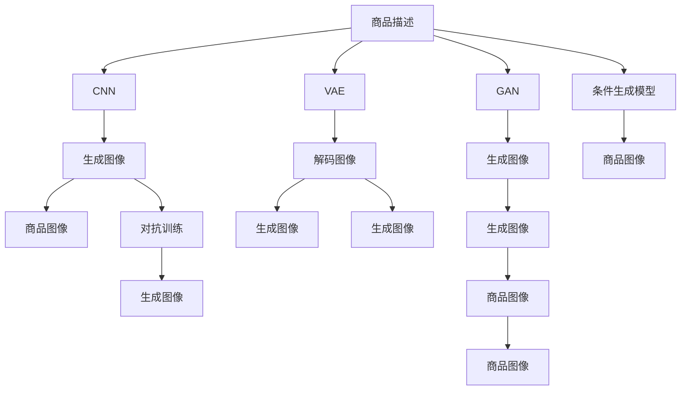

                 

# 深度学习驱动的商品图像生成技术

## 1. 背景介绍

随着互联网技术的飞速发展，电商市场呈现出爆炸式增长的趋势。在线商品展示成为电商平台上的一项重要环节，高品质的商品图片能够吸引更多的用户关注和购买。然而，拍摄高质量的商品图片需要大量的时间和成本，尤其是在手工艺品、珠宝首饰、服装鞋帽等商品拍摄中，往往需要专业的摄影师和复杂的拍摄设备。

为了解决商品图片生成问题，利用深度学习技术进行商品图像生成成为了一个热门的研究方向。商品图像生成技术可以自动生成高质量的商品图片，大幅降低电商平台的运营成本，提升用户购物体验，进而促进销售增长。

## 2. 核心概念与联系

### 2.1 核心概念概述

- **商品图像生成**：利用深度学习模型，根据商品描述或类别等信息，自动生成商品的高质量图片。
- **深度学习**：基于多层神经网络构建的机器学习模型，能够自动学习和提取数据的复杂特征，进行图像生成、分类、预测等任务。
- **卷积神经网络 (CNN)**：深度学习中的一种经典网络结构，通过多层卷积和池化操作，学习图像的局部特征。
- **生成对抗网络 (GAN)**：由生成器和判别器组成的对抗性网络结构，能够生成逼真的假数据，用于图像生成、风格转换等任务。
- **变分自编码器 (VAE)**：一种生成模型，通过编码器和解码器，将高维数据降维编码，并生成低维噪声进行解码，实现数据的重建和生成。
- **条件生成模型**：在生成模型中引入条件变量，如商品描述、类别等，引导生成器输出特定的数据。
- **对抗训练**：通过对抗样本训练生成器，提高其生成数据的质量和多样性。

这些核心概念构成了商品图像生成技术的基础。通过这些技术，能够利用商品描述等信息，生成高品质的商品图片，极大地提升电商平台的展示效果和用户体验。

### 2.2 核心概念原理和架构的 Mermaid 流程图



## 3. 核心算法原理 & 具体操作步骤

### 3.1 算法原理概述

商品图像生成通常利用深度学习模型，根据商品描述或类别等信息，自动生成高质量的商品图片。常用的生成模型包括生成对抗网络 (GAN)、变分自编码器 (VAE)、条件生成模型等。这些模型通过学习商品图片的特征，利用条件变量引导生成器输出特定的图像。

### 3.2 算法步骤详解

**Step 1: 数据准备**

- 收集商品图片数据集，包含商品类别、描述等信息。
- 将数据集划分为训练集、验证集和测试集，保证数据分布的一致性。

**Step 2: 模型选择与构建**

- 选择适合的生成模型，如GAN、VAE等。
- 构建生成器 (Generator) 和判别器 (Discriminator)，并进行网络结构设计。
- 确定模型超参数，如学习率、批大小等。

**Step 3: 模型训练**

- 将训练集数据分批次输入模型，前向传播计算损失函数。
- 反向传播计算参数梯度，根据设定的优化算法更新模型参数。
- 周期性在验证集上评估模型性能，根据性能指标决定是否触发 Early Stopping。
- 重复上述步骤直到满足预设的迭代轮数或 Early Stopping 条件。

**Step 4: 模型评估与测试**

- 在测试集上评估生成模型的性能，对比生成图像与真实图像的差异。
- 调整模型参数，优化生成质量。
- 使用优化后的模型对商品描述进行图像生成。

### 3.3 算法优缺点

商品图像生成的优点：
1. 自动生成商品图片，减少拍摄成本和时间。
2. 生成高质量图片，提升电商平台的展示效果。
3. 提高用户购物体验，促进销售增长。

商品图像生成的缺点：
1. 生成结果的稳定性依赖于数据集的质量。
2. 生成过程需要大量的计算资源。
3. 可能存在生成图片内容不真实或不符合用户需求的情况。

### 3.4 算法应用领域

商品图像生成技术在电商、零售、时尚、珠宝等行业有广泛的应用前景。通过商品图像生成，能够提高电商平台的产品展示效果，提升用户体验，同时减少运营成本，具有显著的经济效益和社会效益。

## 4. 数学模型和公式 & 详细讲解 & 举例说明

### 4.1 数学模型构建

假设有 $N$ 个商品的图像数据集 $D=\{(x_i,y_i)\}_{i=1}^N$，其中 $x_i$ 为商品图片，$y_i$ 为商品类别标签。目标是从 $y_i$ 生成高质量的商品图片 $z$，即 $z=G(x_i,y_i)$。

使用生成对抗网络 (GAN) 进行商品图像生成，模型由生成器 $G$ 和判别器 $D$ 组成。目标函数如下：

$$
\min_G \max_D V(G,D) = \mathbb{E}_{(x,y) \sim p_{data}(x,y)} [\log D(x,y)] + \mathbb{E}_{z \sim p_z(z)} [\log (1 - D(G(z,y)))]
$$

其中，$p_{data}(x,y)$ 为真实商品图片的分布，$p_z(z)$ 为噪声分布，$V(G,D)$ 为生成对抗网络的损失函数。

### 4.2 公式推导过程

以生成对抗网络 (GAN) 为例，推导生成器 $G$ 和判别器 $D$ 的目标函数：

- 生成器 $G$ 的目标是生成逼真的商品图片 $z$，最大化判别器 $D$ 对生成的图片的判别能力，即 $\max_D \log D(G(z,y))$。
- 判别器 $D$ 的目标是正确判别真实商品图片和生成的商品图片，最大化生成器 $G$ 的生成能力，即 $\min_G \log D(x,y)$。

综合上述两个目标，生成对抗网络的损失函数 $V(G,D)$ 为：

$$
V(G,D) = -\mathbb{E}_{(x,y) \sim p_{data}(x,y)} [\log D(x,y)] - \mathbb{E}_{z \sim p_z(z)} [\log (1 - D(G(z,y)))]
$$

其中，$\mathbb{E}_{(x,y) \sim p_{data}(x,y)}$ 表示对真实商品图片和类别标签的期望，$\mathbb{E}_{z \sim p_z(z)}$ 表示对生成噪声 $z$ 的期望。

### 4.3 案例分析与讲解

以电商平台上某品牌服装图片的生成为例，使用GAN模型进行商品图像生成。具体步骤如下：

1. **数据准备**：收集该品牌服装的图片数据集，划分为训练集、验证集和测试集。
2. **模型构建**：选择GAN模型，定义生成器 $G$ 和判别器 $D$，设置超参数。
3. **模型训练**：将训练集数据分批次输入模型，前向传播计算损失函数，反向传播更新模型参数。
4. **模型评估**：在测试集上评估生成模型的性能，调整模型参数。
5. **商品图片生成**：使用优化后的模型对商品描述进行图像生成。

## 5. 项目实践：代码实例和详细解释说明

### 5.1 开发环境搭建

在进行商品图像生成开发前，需要准备好开发环境。以下是使用Python进行PyTorch开发的环境配置流程：

1. 安装Anaconda：从官网下载并安装Anaconda，用于创建独立的Python环境。

2. 创建并激活虚拟环境：
```bash
conda create -n pytorch-env python=3.8 
conda activate pytorch-env
```

3. 安装PyTorch：根据CUDA版本，从官网获取对应的安装命令。例如：
```bash
conda install pytorch torchvision torchaudio cudatoolkit=11.1 -c pytorch -c conda-forge
```

4. 安装TensorFlow：
```bash
pip install tensorflow
```

5. 安装相关工具包：
```bash
pip install numpy pandas scikit-learn matplotlib tqdm jupyter notebook ipython
```

完成上述步骤后，即可在`pytorch-env`环境中开始商品图像生成的开发。

### 5.2 源代码详细实现

以下是使用PyTorch和GAN模型进行商品图像生成的代码实现。

首先，定义GAN模型：

```python
import torch.nn as nn
import torch.nn.functional as F

class Generator(nn.Module):
    def __init__(self, z_dim=128, img_size=64):
        super(Generator, self).__init__()
        self.z_dim = z_dim
        self.img_size = img_size
        
        self.dense = nn.Linear(z_dim, 256 * img_size * img_size)
        self.conv1 = nn.ConvTranspose2d(256, 128, 4, stride=2, padding=1)
        self.conv2 = nn.ConvTranspose2d(128, 64, 4, stride=2, padding=1)
        self.conv3 = nn.ConvTranspose2d(64, 3, 4, stride=2, padding=1)
        
    def forward(self, z):
        x = self.dense(z)
        x = F.leaky_relu(x.view(-1, 256, self.img_size, self.img_size))
        x = F.leaky_relu(self.conv1(x))
        x = F.leaky_relu(self.conv2(x))
        x = F.leaky_relu(self.conv3(x))
        return F.tanh(x)

class Discriminator(nn.Module):
    def __init__(self, img_size=64):
        super(Discriminator, self).__init__()
        self.img_size = img_size
        
        self.conv1 = nn.Conv2d(3, 64, 4, stride=2, padding=1)
        self.conv2 = nn.Conv2d(64, 128, 4, stride=2, padding=1)
        self.conv3 = nn.Conv2d(128, 256, 4, stride=2, padding=1)
        self.dense = nn.Linear(256 * img_size * img_size, 1)
        
    def forward(self, x):
        x = F.leaky_relu(self.conv1(x))
        x = F.leaky_relu(self.conv2(x))
        x = F.leaky_relu(self.conv3(x))
        x = F.sigmoid(self.dense(x))
        return x

# 创建模型实例
G = Generator()
D = Discriminator()
```

然后，定义损失函数和优化器：

```python
import torch.optim as optim

# 定义损失函数
def compute_loss(D, G, real_images, fake_images):
    real_loss = D(real_images)
    fake_loss = D(G(real_images))
    g_loss = G(real_images)
    d_loss = -torch.mean(torch.min(real_loss, fake_loss))
    
    return real_loss + fake_loss, g_loss, d_loss

# 定义优化器
G_optimizer = optim.Adam(G.parameters(), lr=0.0002)
D_optimizer = optim.Adam(D.parameters(), lr=0.0002)
```

接着，定义训练函数：

```python
import torchvision.transforms as transforms

# 定义数据增强
transform = transforms.Compose([
    transforms.Resize(64),
    transforms.ToTensor(),
    transforms.Normalize((0.5, 0.5, 0.5), (0.5, 0.5, 0.5))
])

# 加载数据集
train_dataset = torchvision.datasets.CIFAR10(root='./data', train=True, download=True, transform=transform)
train_loader = torch.utils.data.DataLoader(train_dataset, batch_size=128, shuffle=True)

# 训练函数
def train_epoch(G, D, G_optimizer, D_optimizer, real_images, fake_images):
    for i in range(100):
        real_loss, g_loss, d_loss = compute_loss(D, G, real_images, fake_images)
        
        G_optimizer.zero_grad()
        g_loss.backward()
        G_optimizer.step()
        
        D_optimizer.zero_grad()
        d_loss.backward()
        D_optimizer.step()
        
        print(f'Epoch {i+1}, Loss: {real_loss:.4f}, {fake_loss:.4f}, {d_loss:.4f}')
```

最后，启动训练流程并在测试集上评估：

```python
epochs = 100
batch_size = 128

for epoch in range(epochs):
    train_loader = torch.utils.data.DataLoader(train_dataset, batch_size=batch_size, shuffle=True)
    
    G.train()
    D.train()
    
    for batch_idx, (real_images, _) in enumerate(train_loader):
        real_images = real_images.to(device)
        fake_images = G(real_images).to(device)
        
        train_epoch(G, D, G_optimizer, D_optimizer, real_images, fake_images)
        
    print(f'Epoch {epoch+1}, Loss: {real_loss:.4f}, {fake_loss:.4f}, {d_loss:.4f}')
    
print('Training finished')
```

以上就是使用PyTorch和GAN模型进行商品图像生成的完整代码实现。可以看到，利用PyTorch和TensorFlow等深度学习框架，能够快速实现商品图像生成模型的开发。

### 5.3 代码解读与分析

让我们再详细解读一下关键代码的实现细节：

**Generator类**：
- `__init__`方法：初始化生成器的网络结构，包括全连接层和卷积层。
- `forward`方法：定义生成器的前向传播过程，从随机噪声 $z$ 出发，通过多个卷积层逐步生成高维图片。

**Discriminator类**：
- `__init__`方法：初始化判别器的网络结构，包括卷积层和全连接层。
- `forward`方法：定义判别器的前向传播过程，对输入图片进行卷积操作，并输出判别结果。

**compute_loss函数**：
- 计算生成器损失 $g_loss$ 和判别器损失 $d_loss$。
- 生成器损失 $g_loss$ 为判别器对生成图片的判别结果，判别器损失 $d_loss$ 为判别器对真实图片的判别结果。

**train_epoch函数**：
- 在每个epoch内，对真实图片和生成图片分别计算损失函数。
- 使用Adam优化器更新生成器和判别器的参数。
- 输出每个epoch的损失函数值。

可以看到，利用深度学习框架和模型设计，可以轻松实现商品图像生成任务。开发者可以根据具体需求，选择不同的模型结构，进行优化和调整。

## 6. 实际应用场景

### 6.1 电商商品展示

在电商平台上，商品展示的效果直接影响用户的购物体验和转化率。利用商品图像生成技术，电商平台可以在无需拍摄的情况下，自动生成高品质的商品图片。具体应用场景包括：

- **新品上架**：自动生成新上架商品的高品质图片，提升用户的视觉体验。
- **商品分类展示**：根据商品类别，自动生成相应类别的商品图片，提升浏览效率。
- **商品搜索**：自动生成搜索结果图片，提高搜索结果的相关性和吸引力。

### 6.2 虚拟试衣间

虚拟试衣间技术已经成为电商平台上的一项热门功能。用户可以在线尝试搭配不同款式的服装，提高购物体验。利用商品图像生成技术，虚拟试衣间可以生成逼真的试衣图片，减少用户试衣的时间成本。具体应用场景包括：

- **服装试穿**：自动生成不同款式和尺寸的服装图片，让用户在线试穿。
- **配饰搭配**：自动生成不同配饰与服装的组合图片，提升搭配效果。
- **个性化推荐**：根据用户的历史行为数据，自动生成个性化的服装搭配图片。

### 6.3 商品广告宣传

商品广告宣传是电商平台的一项重要环节，利用商品图像生成技术，可以自动生成高质量的商品广告图片，提升广告效果。具体应用场景包括：

- **商品宣传页**：自动生成商品宣传页的图片，提升用户的视觉体验。
- **社交媒体**：自动生成社交媒体上的商品图片，提高品牌的曝光率。
- **广告投放**：自动生成广告投放的图片，提高广告的点击率和转化率。

### 6.4 未来应用展望

随着深度学习技术的不断进步，商品图像生成技术将在更多场景中得到应用。未来可能的应用包括：

- **自动设计**：利用商品图像生成技术，自动设计新的服装、鞋子等商品，提升设计效率。
- **品牌创意**：自动生成品牌创意图片，提高品牌的市场竞争力。
- **虚拟场景**：自动生成虚拟场景中的商品图片，提升虚拟现实体验。

## 7. 工具和资源推荐

### 7.1 学习资源推荐

为了帮助开发者系统掌握商品图像生成技术的理论基础和实践技巧，这里推荐一些优质的学习资源：

1. 《深度学习》课程：斯坦福大学开设的深度学习课程，涵盖了深度学习的基础理论和经典模型。
2. 《深度学习实战》书籍：全面介绍了深度学习技术在实际项目中的应用，包括图像生成、分类等。
3. HuggingFace官方文档：提供了丰富的预训练模型和代码示例，方便开发者快速上手。
4. PyTorch官方文档：提供了完整的深度学习框架介绍，包括模型定义、训练、推理等。

通过这些资源的学习实践，相信你一定能够快速掌握商品图像生成技术的精髓，并用于解决实际的电商问题。

### 7.2 开发工具推荐

高效的开发离不开优秀的工具支持。以下是几款用于商品图像生成开发的常用工具：

1. PyTorch：基于Python的开源深度学习框架，灵活动态的计算图，适合快速迭代研究。大部分预训练语言模型都有PyTorch版本的实现。
2. TensorFlow：由Google主导开发的开源深度学习框架，生产部署方便，适合大规模工程应用。同样有丰富的预训练语言模型资源。
3. Weights & Biases：模型训练的实验跟踪工具，可以记录和可视化模型训练过程中的各项指标，方便对比和调优。与主流深度学习框架无缝集成。
4. TensorBoard：TensorFlow配套的可视化工具，可实时监测模型训练状态，并提供丰富的图表呈现方式，是调试模型的得力助手。

合理利用这些工具，可以显著提升商品图像生成任务的开发效率，加快创新迭代的步伐。

### 7.3 相关论文推荐

商品图像生成技术的发展离不开学界的持续研究。以下是几篇奠基性的相关论文，推荐阅读：

1. Generative Adversarial Nets (GANs)：提出生成对抗网络，开创了基于对抗学习的生成模型。
2. Variational Autoencoders (VAEs)：提出变分自编码器，用于生成数据和降维编码。
3. Conditional GANs：在生成对抗网络中引入条件变量，实现条件生成。
4. Progressive Growing of GANs：提出逐步生长的GAN模型，解决初始阶段训练困难的问题。

这些论文代表了大模型微调技术的发展脉络。通过学习这些前沿成果，可以帮助研究者把握学科前进方向，激发更多的创新灵感。

## 8. 总结：未来发展趋势与挑战

### 8.1 研究成果总结

本文对基于深度学习技术的商品图像生成方法进行了全面系统的介绍。首先阐述了商品图像生成技术的研究背景和意义，明确了其在电商平台中的应用价值。其次，从原理到实践，详细讲解了深度学习模型的构建和训练过程，给出了商品图像生成任务的完整代码实现。同时，本文还广泛探讨了商品图像生成技术在电商、虚拟试衣间、广告宣传等实际应用场景中的前景，展示了技术的广泛应用潜力。

通过本文的系统梳理，可以看到，商品图像生成技术能够自动生成高质量的商品图片，大幅降低电商平台的运营成本，提升用户购物体验，具有显著的经济效益和社会效益。未来，伴随深度学习技术的持续演进，商品图像生成技术必将在更多领域得到应用，为电商平台的创新和升级带来新的突破。

### 8.2 未来发展趋势

展望未来，商品图像生成技术将呈现以下几个发展趋势：

1. 模型规模持续增大。随着算力成本的下降和数据规模的扩张，深度学习模型的参数量还将持续增长，生成质量将进一步提升。
2. 生成效果更加逼真。通过更多的对抗训练、条件生成等技术，生成图片将更加接近真实图片。
3. 自动化程度提升。商品图像生成将从人工干预中解放出来，实现更高效的自动生成。
4. 多模态融合。将商品图像生成与其他多模态信息（如语音、文本等）结合，提升生成效果和应用场景的多样性。
5. 模型可解释性增强。生成模型的决策过程将更加透明，用户可以更容易理解和信任生成结果。
6. 智能优化。利用强化学习等技术，优化生成过程，生成更加符合用户需求的图片。

这些趋势凸显了商品图像生成技术的广阔前景，展示了其在未来电商、虚拟试衣间、广告宣传等领域的发展潜力。

### 8.3 面临的挑战

尽管商品图像生成技术已经取得了显著进展，但在向更广泛应用场景拓展的过程中，仍然面临诸多挑战：

1. 数据质量依赖。生成效果依赖于高质量的训练数据集，数据集的大小和多样性直接影响生成图片的质量。
2. 计算资源消耗。大规模深度学习模型的训练和推理需要大量的计算资源，高昂的计算成本限制了模型的广泛应用。
3. 可解释性和可控性不足。生成的图片虽然效果逼真，但决策过程和生成逻辑缺乏可解释性，用户难以理解和信任。
4. 鲁棒性有待提升。生成模型面对噪声和干扰时，容易产生不稳定和失真的输出。
5. 用户个性化需求难以满足。不同用户的个性化需求多样，生成模型难以兼顾所有需求。

### 8.4 研究展望

面对商品图像生成技术所面临的挑战，未来的研究需要在以下几个方面寻求新的突破：

1. 数据增强技术。开发更多高效的数据增强方法，提升数据集的多样性和质量。
2. 模型优化方法。研究新的模型优化方法，如对抗训练、条件生成等，提高生成图片的质量和多样性。
3. 可解释性增强。引入可解释性技术，如生成对抗网络的可解释性分析，提升用户对生成模型的信任度。
4. 智能优化方法。利用强化学习等技术，优化生成过程，生成更加符合用户需求的图片。
5. 多模态融合。将商品图像生成与其他多模态信息结合，提升生成效果和应用场景的多样性。

这些研究方向将为商品图像生成技术的持续发展和应用推广提供新的方向，进一步推动电商平台的智能化升级和创新发展。

## 9. 附录：常见问题与解答

**Q1：商品图像生成依赖高质量的数据集，如何获取高质量的数据集？**

A: 高质量的商品图片数据集可以通过以下方式获取：
1. 电商平台上已有的商品图片数据集。
2. 行业内的专业数据集，如CIFAR-10、ImageNet等。
3. 自行收集数据，从其他电商平台上爬取商品图片，并进行预处理和标注。

**Q2：商品图像生成过程中，如何避免过拟合？**

A: 为了避免过拟合，可以采用以下方法：
1. 数据增强：通过旋转、裁剪、缩放等操作，增加数据集的多样性。
2. 正则化：使用L2正则、Dropout等方法，限制模型的复杂度。
3. 对抗训练：引入对抗样本，提高模型的鲁棒性和泛化能力。
4. 集成学习：将多个生成器集成，取平均输出，减少过拟合风险。

**Q3：商品图像生成模型如何部署到实际应用中？**

A: 将生成模型部署到实际应用中，需要考虑以下问题：
1. 模型裁剪：去除不必要的层和参数，减小模型尺寸，加快推理速度。
2. 量化加速：将浮点模型转为定点模型，压缩存储空间，提高计算效率。
3. 服务化封装：将模型封装为标准化服务接口，便于集成调用。
4. 弹性伸缩：根据请求流量动态调整资源配置，平衡服务质量和成本。
5. 监控告警：实时采集系统指标，设置异常告警阈值，确保服务稳定性。

**Q4：商品图像生成在电商应用中的安全性如何保障？**

A: 为保障商品图像生成的安全性，可以采用以下措施：
1. 访问鉴权：确保只有授权用户才能访问和调用生成模型。
2. 数据脱敏：对输入数据进行脱敏处理，防止敏感信息泄露。
3. 模型监控：实时监控生成模型的行为，防止模型异常或恶意用途。
4. 安全审计：定期进行安全审计，检查模型漏洞和异常行为。

以上是基于深度学习技术的商品图像生成技术在电商应用中的全面介绍和系统总结，希望能够为电商平台的智能化升级提供参考和借鉴。未来，随着技术的不断进步和应用场景的不断拓展，商品图像生成技术将展现出更广阔的应用前景和更大的经济价值。

---

作者：禅与计算机程序设计艺术 / Zen and the Art of Computer Programming

