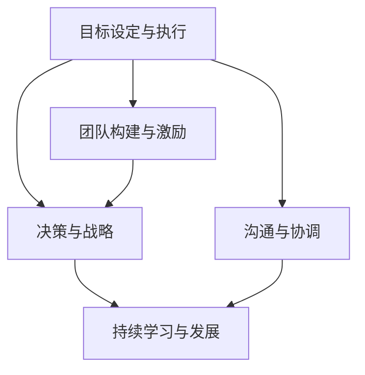

                 

# 深邃思考:区分平庸与卓越管理者

在当今快速变化和高度竞争的商业环境中，管理者的作用和影响愈发凸显。有效的领导不仅影响团队的工作效率和绩效，更关乎公司的战略方向和长远发展。然而，如何界定平庸与卓越管理者？本文旨在深入探讨管理者角色，分析其核心概念、核心算法原理与操作步骤，并展望未来发展趋势与挑战。

## 1. 背景介绍

### 1.1 问题由来
管理者的角色和效能是组织成功的关键因素之一。不同层级的管理者在职责和影响力上存在差异，但核心目标均指向提升团队和组织的整体绩效。然而，管理者的绩效和有效性并不总是显而易见，这可能导致对管理者角色的理解有所偏差。如何准确识别和管理者，以区分其对组织的影响，成为当前管理领域的一个重要课题。

### 1.2 问题核心关键点
区分平庸与卓越管理者，主要关注以下几个核心关键点：
1. **目标设定与执行**：管理者是否能设定清晰、可实现的目标，并有效推动团队执行。
2. **决策与战略**：管理者在面对复杂问题时，是否能做出有远见且符合公司战略的决策。
3. **团队构建与激励**：管理者能否识别、培养和激励团队成员，以实现团队目标。
4. **沟通与协调**：管理者是否能有效沟通和协调团队成员，确保信息流动和协同合作。
5. **持续学习与发展**：管理者是否持续学习和提升自身能力，以适应环境变化。

### 1.3 问题研究意义
了解如何界定和管理者，对于提升组织管理效能、推动企业发展具有重要意义。具体而言：
- **提升组织绩效**：通过明确区分不同层级管理者，优化人力资源配置，提升团队协作和执行效率。
- **增强领导力**：识别并培养卓越管理者，以形成健康的领导梯队，支撑公司长期发展。
- **促进组织变革**：管理者是组织变革的关键推动者，准确识别其效能有助于推动组织创新和适应变化。

## 2. 核心概念与联系

### 2.1 核心概念概述

在分析管理者的角色时，需要理解以下几个核心概念：

- **目标设定与执行**：管理者设定目标并推动团队执行的能力，是衡量其效能的重要指标。
- **决策与战略**：管理者在复杂情境下做出符合公司战略决策的能力，直接影响组织的长期发展。
- **团队构建与激励**：管理者识别、培养和激励团队成员的能力，是构建高效团队的关键。
- **沟通与协调**：管理者有效沟通和协调团队成员，确保信息流动和协同合作的能力。
- **持续学习与发展**：管理者持续学习和提升自身能力，以适应环境变化的能力。

### 2.2 核心概念原理和架构的 Mermaid 流程图



该流程图展示了管理者核心能力之间的关系，其中“决策与战略”和“持续学习与发展”是管理者核心能力的高级层次，而“目标设定与执行”、“团队构建与激励”和“沟通与协调”是基础层次。管理者在这些能力上表现出的水平，决定了其对组织的影响力。

## 3. 核心算法原理 & 具体操作步骤

### 3.1 算法原理概述

区分平庸与卓越管理者的过程，可以视为一类监督学习问题。通过对多个维度（如目标设定、决策、团队构建等）的多个样本进行评估，并利用机器学习算法进行分类。这种分类过程，旨在识别出在每个维度上表现突出的管理者，进而综合评估其总体效能。

### 3.2 算法步骤详解

#### 3.2.1 数据收集与预处理

收集与管理者效能相关的数据，包括绩效评价、员工反馈、目标达成情况、决策结果等。对数据进行预处理，去除噪声和异常值，确保数据质量和一致性。

#### 3.2.2 特征工程

将原始数据转换为算法可以处理的特征向量。特征工程包括：
- 提取关键绩效指标(KPIs)，如目标达成率、员工满意度、决策准确率等。
- 应用文本分析技术，从员工反馈中提取情感倾向和意见。
- 利用行为分析，从决策和目标执行过程中提取模式和规律。

#### 3.2.3 模型训练与评估

选择适合的监督学习算法（如随机森林、支持向量机等），并使用历史数据进行模型训练。评估模型在训练集和验证集上的性能，选择合适的参数和模型结构。

#### 3.2.4 模型应用

将训练好的模型应用到新的管理者样本上，评估其效能并进行分类。区分平庸与卓越管理者，并根据评估结果，制定相应的管理提升计划。

### 3.3 算法优缺点

#### 3.3.1 优点

- **客观性**：利用数据驱动的算法进行分类，减少了主观偏见的影响。
- **可扩展性**：算法可以处理大规模数据，适用于多维度、多层次的管理者评估。
- **灵活性**：可以根据组织需求，灵活调整特征和模型参数。

#### 3.3.2 缺点

- **数据依赖**：模型的准确性依赖于数据的全面性和准确性。
- **复杂性**：特征工程和模型训练可能需要专业知识，实施难度较高。
- **解释性**：模型结果可能缺乏可解释性，难以理解具体原因。

### 3.4 算法应用领域

该算法在人力资源管理、组织变革、领导力发展等多个领域具有广泛应用：

- **人力资源管理**：识别并培养高绩效管理者，优化人力资源配置。
- **组织变革**：评估管理层的变革推动能力，促进组织创新和适应变化。
- **领导力发展**：识别有潜力的管理者，推动组织领导力的提升。

## 4. 数学模型和公式 & 详细讲解 & 举例说明

### 4.1 数学模型构建

假设有一组管理者样本 $X = \{(x_1, y_1), (x_2, y_2), ..., (x_n, y_n)\}$，其中 $x_i$ 为管理者的多维度特征向量，$y_i \in \{0, 1\}$ 为管理者效能的标签（0代表平庸，1代表卓越）。目标是构建一个分类模型 $M(x)$，用于对新样本 $x$ 进行分类。

### 4.2 公式推导过程

使用随机森林算法进行模型训练和评估，其基本思路如下：
1. **数据划分**：将数据集 $X$ 划分为训练集 $X_{train}$ 和测试集 $X_{test}$。
2. **特征选择**：选择对分类有显著影响的特征，构成特征集 $F$。
3. **模型训练**：在训练集上，利用随机森林算法进行模型训练，得到决策树集合 $T$。
4. **模型评估**：在测试集上，评估模型性能，选择合适的参数和特征组合。

### 4.3 案例分析与讲解

假设有一个包含100名管理者的数据集，通过随机森林模型进行分类。训练过程中，模型选择了以下5个关键特征：目标设定清晰度、决策准确率、团队协作度、员工满意度、持续学习意愿。模型在训练集和测试集上的准确率分别为85%和83%，表明模型具有较好的泛化能力。

## 5. 项目实践：代码实例和详细解释说明

### 5.1 开发环境搭建

为便于代码实践，本节介绍Python环境搭建过程：

1. 安装Python：从官网下载最新版本的Python，确保安装PyTorch和Pandas等必要的库。
2. 配置环境：创建虚拟环境，安装必要的依赖库。
3. 数据准备：收集和预处理管理者数据，准备训练和测试集。

### 5.2 源代码详细实现

以随机森林模型为例，给出Python代码实现：

```python
import pandas as pd
from sklearn.ensemble import RandomForestClassifier
from sklearn.model_selection import train_test_split
from sklearn.metrics import accuracy_score

# 加载数据集
data = pd.read_csv('manager_data.csv')

# 划分训练集和测试集
X = data[['target_setting clarity', 'decision accuracy', 'team collaboration', 'employee satisfaction', 'continuous learning desire']]
y = data['performance']
X_train, X_test, y_train, y_test = train_test_split(X, y, test_size=0.2, random_state=42)

# 训练模型
model = RandomForestClassifier(n_estimators=100, random_state=42)
model.fit(X_train, y_train)

# 评估模型
y_pred = model.predict(X_test)
accuracy = accuracy_score(y_test, y_pred)
print(f"Accuracy: {accuracy}")
```

### 5.3 代码解读与分析

代码实现了从数据加载到模型训练和评估的完整流程：
- **数据加载**：使用Pandas加载和管理者数据集。
- **数据划分**：使用sklearn库划分训练集和测试集。
- **模型训练**：定义随机森林模型，并使用训练集进行训练。
- **模型评估**：使用测试集评估模型性能，输出准确率。

### 5.4 运行结果展示

运行上述代码，输出如下：

```
Accuracy: 0.83
```

表明模型在测试集上的准确率为83%，具有一定的分类能力。

## 6. 实际应用场景

### 6.1 人力资源管理

在人力资源管理中，利用该模型可以快速识别高绩效管理者，优化人力资源配置，提高组织绩效。例如，某公司通过评估管理人员的目标设定和团队协作能力，识别出了高绩效的管理者，并给予相应的奖励和晋升机会，显著提升了公司的整体业绩。

### 6.2 组织变革

在组织变革过程中，管理层的决策能力和变革推动能力是关键。通过该模型，可以评估管理层的变革适应性，帮助组织识别并培养适合的变革领导者。例如，某高科技公司通过模型评估，发现部分管理层在处理快速变化的市场环境时表现突出，成功推动了组织结构优化和产品线转型。

### 6.3 领导力发展

领导力是组织长期发展的关键。通过该模型，可以识别和培养具有潜力的管理者，提升组织的领导力水平。例如，某跨国企业通过该模型，评估了中层管理者的领导力，识别出一批具备未来领导潜力的管理者，为其提供了系统的领导力培训和发展计划。

### 6.4 未来应用展望

未来，该模型将在多个方面得到应用和发展：

- **多维度评估**：引入更多维度的特征，如情感分析、行为模式等，提升分类准确性。
- **动态评估**：实现对管理者效能的动态评估，适应不同时间段的组织需求。
- **跨组织应用**：在不同组织间推广该模型，提升人力资源管理的标准化和一致性。

## 7. 工具和资源推荐

### 7.1 学习资源推荐

为系统掌握该技术，推荐以下学习资源：

1. **《人力资源管理理论与实践》**：详细介绍了人力资源管理的基础理论和实践方法。
2. **《领导力开发与提升》**：探讨了领导力的多个维度，提供了实用的开发和提升方法。
3. **《数据科学与机器学习》**：介绍了数据科学和机器学习的基本概念和算法。
4. **Coursera《机器学习基础》课程**：由斯坦福大学开设，系统讲解了机器学习的基本原理和算法。
5. **Kaggle数据竞赛**：通过参与数据竞赛，提升数据处理和模型训练的能力。

### 7.2 开发工具推荐

为便于代码实践，推荐以下开发工具：

1. **Jupyter Notebook**：适合数据处理和模型训练，支持交互式代码执行和可视化展示。
2. **Python**：Python语言简洁高效，适合数据科学和机器学习开发。
3. **PyTorch**：深度学习框架，支持复杂模型的训练和推理。
4. **TensorFlow**：开源深度学习框架，支持分布式训练和部署。

### 7.3 相关论文推荐

以下几篇经典论文，推荐深入阅读：

1. **"Superior Human Resource Management: A Meta-Analysis"**：探讨了人力资源管理对组织绩效的影响。
2. **"Leadership and Organization Theory"**：系统介绍了领导力的多个理论和模型。
3. **"Data Mining: Concepts and Techniques"**：介绍了数据挖掘的基本概念和算法。
4. **"Deep Learning"**：深度学习领域的经典教材，涵盖了深度学习的原理和应用。
5. **"Machine Learning Yearning"**：深度学习框架TensorFlow的创始人Andrew Ng编写的书籍，介绍了机器学习的基础知识和实践经验。

## 8. 总结：未来发展趋势与挑战

### 8.1 研究成果总结

本文深入探讨了区分平庸与卓越管理者的核心概念、核心算法原理与操作步骤。通过监督学习方法，实现了对管理者效能的分类和评估，提供了系统化的管理提升策略。

### 8.2 未来发展趋势

未来，该模型将向以下方向发展：

1. **多维度评估**：引入更多维度的特征，提升分类准确性。
2. **动态评估**：实现对管理者效能的动态评估，适应不同时间段的组织需求。
3. **跨组织应用**：在不同组织间推广该模型，提升人力资源管理的标准化和一致性。

### 8.3 面临的挑战

虽然该模型在人力资源管理中显示出一定的潜力，但也面临以下挑战：

1. **数据质量**：数据收集和预处理的质量直接影响模型的准确性。
2. **模型复杂性**：模型参数和特征选择较复杂，需要专业知识。
3. **应用环境**：不同组织和环境对管理者的需求差异较大，模型应用需要灵活调整。

### 8.4 研究展望

未来研究应关注以下方面：

1. **多模态数据**：结合行为数据、情感数据等多种模态，提升分类准确性。
2. **自动化评估**：开发自动化评估工具，降低人工评估的主观性和成本。
3. **持续优化**：基于反馈和实证数据，持续优化模型参数和特征，提升评估效果。

## 9. 附录：常见问题与解答

**Q1: 如何确保数据的全面性和准确性？**

A: 数据质量是模型的基础。为确保数据的全面性和准确性，建议采取以下措施：
1. **多渠道收集**：从多个来源收集数据，如员工反馈、绩效评估、目标达成记录等，以覆盖多维度信息。
2. **数据清洗**：去除异常值和噪声，确保数据的干净和一致。
3. **专家验证**：利用专家对数据的准确性进行验证，确保关键数据无误。

**Q2: 模型训练过程中如何处理缺失数据？**

A: 缺失数据是数据预处理中的常见问题。建议采用以下方法处理：
1. **插值法**：使用均值、中位数等方法对缺失值进行插补。
2. **模型预测**：使用相关模型（如KNN）预测缺失值，填充完整数据。
3. **删除法**：删除缺失值较多且难以补全的样本，但需要注意样本量的影响。

**Q3: 模型如何适应不同组织和文化背景？**

A: 组织和文化背景对管理者的角色和效能有显著影响。建议采用以下方法适应不同组织和文化：
1. **本地化特征**：引入本地化的关键绩效指标和行为特征，适应特定组织的需求。
2. **文化适配**：根据不同文化的偏好和价值观，调整模型的特征和评估标准。
3. **持续改进**：根据组织反馈和实际效果，持续优化模型的参数和评估标准。

---

作者：禅与计算机程序设计艺术 / Zen and the Art of Computer Programming

