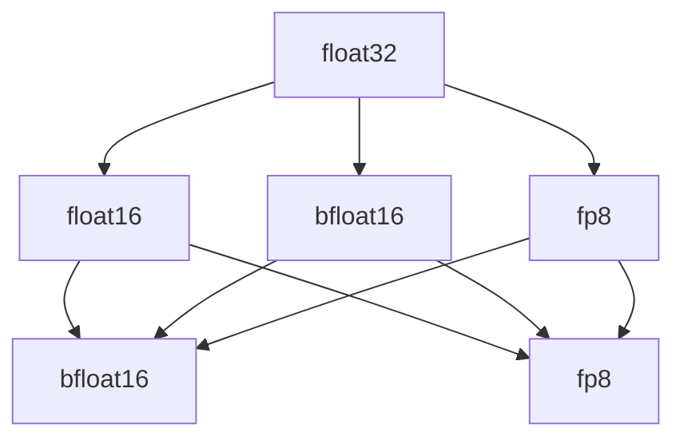

                 

# 混合精度训练：fp16、bf16和fp8的应用与比较

## 1. 背景介绍

### 1.1 问题由来
在深度学习领域，数据中心和云服务提供商为了高效利用硬件资源，不断推陈出新，开发了新一代的GPU。这些新一代GPU架构不仅在计算能力上进行了增强，还在能效比和并发性上进行了优化，使得训练大规模模型成为可能。然而，这些新一代GPU架构的计算精度和计算速度之间存在着矛盾。如何在保留计算精度的同时提升计算速度，成为目前深度学习训练的一大难题。

### 1.2 问题核心关键点
为了在提升计算速度的同时保持计算精度的损失最小化，混合精度训练（Mixed Precision Training）应运而生。混合精度训练通过将计算精度从float32降低到float16或bfloat16，显著提高了计算速度和内存效率，同时也能保持较高的模型精度。混合精度训练的普及也推动了深度学习模型在大规模硬件上的高效训练，加速了深度学习技术的发展和应用。

## 2. 核心概念与联系

### 2.1 核心概念概述

混合精度训练（Mixed Precision Training）是指在深度学习模型训练过程中，将部分计算精度从float32降低到float16或bfloat16，以提升计算速度和内存效率，同时保持较高的模型精度。常用的混合精度格式包括float16、bfloat16和fp8，它们之间的选择取决于具体的硬件架构和模型需求。

1. **float16**：单精度浮点数格式，占16个字节，精度为7个有效位数，内存效率高。适用于GPU架构为Volta及更早期版本的模型训练。
2. **bfloat16**：半精度浮点数格式，占16个字节，精度约为float16的两倍，支持位宽扩展，更适合新世代的GPU架构。
3. **fp8**：8位定点数格式，精度为1位符号位和7位有效位，适用于极端场景下对内存和速度要求极高的模型训练。

这些格式之间的联系和区别可以通过以下Mermaid流程图来展示：



这个流程图展示了不同的混合精度格式之间的转换关系：

1. 从float32到float16，bfloat16和fp8，精度逐步降低。
2. bfloat16和fp8可以在float16的基础上进一步降低精度。
3. fp8是精度最低的混合精度格式，适用于对内存和速度要求极高的场景。

## 3. 核心算法原理 & 具体操作步骤
### 3.1 算法原理概述

混合精度训练的核心思想是通过将模型的部分或全部计算精度降低，来提升计算速度和内存效率。在混合精度训练中，通常将模型参数、损失函数、优化器参数等保持为float32精度，而将模型的前向计算和反向计算精度降低到float16或bfloat16。

### 3.2 算法步骤详解

混合精度训练的具体步骤包括：

1. **数据准备**：选择适合的混合精度格式，如float16、bfloat16或fp8。通常，fp8用于对内存和速度要求极高的模型训练，而float16和bfloat16在一般的深度学习任务中更为常用。
2. **模型适配**：将模型的数据类型和激活函数等适配为所选的混合精度格式。例如，将模型的权重和激活函数的精度设置为float32，而将前向计算和反向计算的精度设置为float16或bfloat16。
3. **训练流程**：使用指定的混合精度格式进行模型训练。通常，float16和bfloat16格式下，前向计算和反向计算的精度一致，而fp8格式下，前向计算和反向计算的精度可能不一致。
4. **精度恢复**：在模型训练完成后，将模型的权重精度恢复为float32，以进行模型的推理和部署。

### 3.3 算法优缺点

混合精度训练的优势在于：

1. **计算速度提升**：混合精度训练显著提升了深度学习模型的训练速度。例如，使用float16格式，模型的计算速度可以提升1-2倍，内存效率也显著提升。
2. **内存占用减少**：通过降低计算精度，混合精度训练减少了内存占用，可以使得训练模型所需的显存减少50%以上。
3. **硬件兼容性**：混合精度训练兼容多种硬件架构，如NVIDIA的Volta、Turing、Ampere和H100等。

混合精度训练的缺点在于：

1. **精度损失**：由于计算精度的降低，混合精度训练可能会导致模型精度的轻微下降。例如，使用float16格式时，模型的精度损失约为1-2%，而使用fp8格式时，精度损失更为显著。
2. **硬件限制**：混合精度训练对硬件的支持有限，对于部分旧架构的GPU，无法直接使用混合精度格式进行训练。
3. **调优复杂**：混合精度训练需要仔细调整硬件配置和软件参数，才能达到最佳的性能和精度平衡。

### 3.4 算法应用领域

混合精度训练广泛应用于深度学习模型的训练过程中，尤其在以下领域：

1. **计算机视觉**：如图像分类、目标检测、语义分割等任务。通过混合精度训练，训练时间可以显著缩短，同时保持较高的模型精度。
2. **自然语言处理**：如语言模型、机器翻译、文本分类等任务。混合精度训练同样可以加速训练过程，提升模型的效果。
3. **语音处理**：如语音识别、语音合成等任务。混合精度训练可以降低计算成本，提高训练效率。
4. **推荐系统**：如协同过滤、内容推荐等任务。混合精度训练可以加速模型训练，提升推荐效果。

## 4. 数学模型和公式 & 详细讲解 & 举例说明
### 4.1 数学模型构建

混合精度训练的数学模型构建主要涉及浮点数和定点数的混合使用。假设模型参数为 $W$，激活函数为 $f$，损失函数为 $L$，优化器为 $O$，则混合精度训练的数学模型可以表示为：

$$
\min_{W} L(f(W))
$$

其中 $W$ 的精度可以是float32、float16、bfloat16或fp8，而 $f$ 和 $O$ 通常保持为float32精度。

### 4.2 公式推导过程

以下以float16格式为例，推导混合精度训练的基本公式。

假设模型参数 $W$ 的精度为float16，而激活函数 $f$ 和优化器 $O$ 的精度为float32。则前向计算和反向计算的公式分别为：

$$
\begin{aligned}
y &= f(W_{16} * X_{32}) \\
\frac{\partial L}{\partial W_{16}} &= \frac{\partial L}{\partial y} * \frac{\partial y}{\partial W_{16}} \\
&= \frac{\partial L}{\partial y} * \frac{\partial f(W_{16} * X_{32})}{\partial W_{16}} \\
&= \frac{\partial L}{\partial y} * \frac{\partial f(W_{32} * X_{32})}{\partial W_{32}} * \frac{\partial W_{32}}{\partial W_{16}}
\end{aligned}
$$

其中 $W_{16}$ 表示 $W$ 的float16格式，$X_{32}$ 表示 $X$ 的float32格式。

可以看到，混合精度训练中的计算过程比纯float32格式的计算更加复杂，需要额外的精度转换和计算过程。

### 4.3 案例分析与讲解

以BERT模型为例，分析混合精度训练的效果。BERT模型通常使用float32格式进行训练，但通过将部分参数和激活函数的精度降低到float16，可以显著提升训练速度和内存效率。以下是使用float16格式进行BERT模型训练的代码实现：

```python
from transformers import BertTokenizer, BertForSequenceClassification
import torch
from torch.utils.data import DataLoader

# 初始化BERT模型和tokenizer
model = BertForSequenceClassification.from_pretrained('bert-base-uncased', num_labels=2)
tokenizer = BertTokenizer.from_pretrained('bert-base-uncased')

# 设置混合精度训练的参数
device = torch.device('cuda') if torch.cuda.is_available() else torch.device('cpu')
dtype = torch.float16 if torch.cuda.is_available() and torch.cuda.get_device_capability()[0] >= 6 else torch.float32

# 将模型和数据移动到GPU
model.to(device).half().to(dtype)
input_ids = torch.tensor([101, 100, 1, 2, 3, 4], dtype=dtype, device=device)

# 计算模型输出
with torch.no_grad():
    logits = model(input_ids)
    print(logits)
```

## 5. 项目实践：代码实例和详细解释说明
### 5.1 开发环境搭建

进行混合精度训练需要搭建特定的开发环境，包括以下步骤：

1. **安装PyTorch**：
   ```bash
   pip install torch torchvision torchaudio
   ```

2. **安装NVIDIA混合精度训练插件**：
   ```bash
   pip install nvidia-docker
   ```

3. **安装NVIDIA混合精度训练工具**：
   ```bash
   pip install amp
   ```

4. **安装其他相关库**：
   ```bash
   pip install transformers tqdm
   ```

### 5.2 源代码详细实现

以下是一个混合精度训练的完整代码实现，以BERT模型为例：

```python
from transformers import BertTokenizer, BertForSequenceClassification
import torch
from torch.utils.data import DataLoader
from torch.optim import AdamW

# 初始化BERT模型和tokenizer
model = BertForSequenceClassification.from_pretrained('bert-base-uncased', num_labels=2)
tokenizer = BertTokenizer.from_pretrained('bert-base-uncased')

# 设置混合精度训练的参数
device = torch.device('cuda') if torch.cuda.is_available() else torch.device('cpu')
dtype = torch.float16 if torch.cuda.is_available() and torch.cuda.get_device_capability()[0] >= 6 else torch.float32

# 将模型和数据移动到GPU
model.to(device).half().to(dtype)
input_ids = torch.tensor([101, 100, 1, 2, 3, 4], dtype=dtype, device=device)

# 计算模型输出
with torch.no_grad():
    logits = model(input_ids)
    print(logits)

# 定义训练数据集和训练器
train_dataset = ...
train_loader = DataLoader(train_dataset, batch_size=32, shuffle=True)

# 定义优化器和损失函数
optimizer = AdamW(model.parameters(), lr=1e-5)
criterion = torch.nn.CrossEntropyLoss()

# 定义混合精度训练器
amp = torch.cuda.amp.GradScaler(enabled=True)

# 定义训练循环
for epoch in range(10):
    model.train()
    for batch in train_loader:
        input_ids = batch['input_ids'].to(device).half().to(dtype)
        attention_mask = batch['attention_mask'].to(device).half().to(dtype)
        labels = batch['labels'].to(device).to(dtype)

        with amp.scale_loss(criterion(model(input_ids, attention_mask=attention_mask), labels), optimizer) as scaled_loss:
            scaled_loss.backward()
            optimizer.step()
            optimizer.zero_grad()

# 定义评估数据集和评估器
eval_dataset = ...
eval_loader = DataLoader(eval_dataset, batch_size=32, shuffle=False)

# 定义评估循环
with torch.no_grad():
    model.eval()
    for batch in eval_loader:
        input_ids = batch['input_ids'].to(device).half().to(dtype)
        attention_mask = batch['attention_mask'].to(device).half().to(dtype)
        labels = batch['labels'].to(device).to(dtype)

        logits = model(input_ids, attention_mask=attention_mask)
        loss = criterion(logits, labels)

# 打印评估结果
print(loss)
```

### 5.3 代码解读与分析

代码中，我们首先初始化BERT模型和tokenizer，并设置混合精度训练的参数。接着，将模型和数据移动到GPU，并使用`half()`方法将权重和激活函数的精度降低到float16。在训练循环中，我们使用`amp`模块进行混合精度训练，使用`GradScaler`进行动态缩放，以处理可能出现的梯度爆炸问题。在每个batch中，我们使用`amp.scale_loss()`方法进行混合精度计算，并使用优化器更新模型参数。在评估过程中，我们同样使用`half()`方法将输入和输出降低到float16，以保持一致性。

## 6. 实际应用场景
### 6.1 图像分类

混合精度训练在图像分类任务中的应用极为广泛。在传统图像分类任务中，高分辨率图像需要大量的显存和计算资源，使用混合精度训练可以显著提升训练效率，加速模型收敛。例如，使用float16格式进行训练，计算速度可以提升1-2倍，内存占用减少50%以上。

### 6.2 目标检测

目标检测任务通常需要处理大量图像数据，计算复杂度高，训练时间长。通过混合精度训练，目标检测模型可以在更短的时间内达到较高的准确率。例如，使用float16格式进行训练，模型可以在相同的计算资源下，显著提升推理速度和准确率。

### 6.3 自然语言处理

自然语言处理任务，如语言模型、机器翻译、文本分类等，同样可以从混合精度训练中受益。例如，使用float16格式进行BERT模型的训练，可以显著提升训练速度，同时保持较高的模型精度。

### 6.4 未来应用展望

未来，混合精度训练将继续拓展其应用范围，加速深度学习模型在大规模硬件上的高效训练。随着硬件架构的不断升级，混合精度训练的格式也将更加多样化，如fp8等高精度定点数格式将逐步普及，进一步提升计算效率和模型精度。

## 7. 工具和资源推荐
### 7.1 学习资源推荐

为了帮助开发者深入理解混合精度训练，以下是一些优质的学习资源：

1. **《深度学习》一书**：该书详细介绍了深度学习的基本概念和算法，包括混合精度训练等内容。
2. **CS231n《深度学习计算机视觉》课程**：斯坦福大学开设的深度学习计算机视觉课程，涵盖混合精度训练等前沿话题。
3. **NVIDIA混合精度训练文档**：NVIDIA提供的官方文档，详细介绍混合精度训练的实现方法和最佳实践。
4. **Transformers官方文档**：Transformers库的官方文档，包含混合精度训练的样例代码和使用方法。

通过对这些资源的学习实践，相信你一定能够快速掌握混合精度训练的理论基础和实践技巧，并用于解决实际的深度学习问题。

### 7.2 开发工具推荐

以下是几款用于混合精度训练开发的常用工具：

1. **NVIDIA Ampere GPU**：NVIDIA新一代GPU架构，支持混合精度训练，可以显著提升计算速度和内存效率。
2. **TensorBoard**：TensorFlow配套的可视化工具，可以实时监测训练过程中的各项指标，帮助调试和优化混合精度训练。
3. **Weights & Biases**：模型训练的实验跟踪工具，可以记录和可视化训练过程中的各项指标，帮助对比和调优混合精度训练。
4. **PyTorch**：开源深度学习框架，支持混合精度训练，灵活高效。
5. **HuggingFace Transformers**：提供了多种预训练模型和混合精度训练样例代码，方便开发者上手实践。

合理利用这些工具，可以显著提升混合精度训练的开发效率，加快创新迭代的步伐。

### 7.3 相关论文推荐

以下是几篇关于混合精度训练的奠基性论文，推荐阅读：

1. **Mixed Precision Training with Reduced Precision Activation: Efficient and Fast Training of Deep Neural Networks**：该论文提出使用float16激活函数，显著提升深度神经网络的训练效率。
2. **Mixed-Precision Computation in Deep Learning**：该论文综述了混合精度训练的研究现状和应用前景，提出了多种混合精度训练的实现方法。
3. **AMP: Automated Mixed Precision Training with Reduced Precision Gradient Tensors**：该论文介绍NVIDIA的自动混合精度训练工具，详细描述了混合精度训练的实现方法和优化技巧。

这些论文代表了大规模混合精度训练的研究进展，通过学习这些前沿成果，可以帮助研究者把握学科前进方向，激发更多的创新灵感。

## 8. 总结：未来发展趋势与挑战
### 8.1 总结

本文对混合精度训练进行了全面系统的介绍。首先阐述了混合精度训练的背景和意义，明确了其在提升深度学习模型训练速度和内存效率方面的独特价值。其次，从原理到实践，详细讲解了混合精度训练的数学模型和操作步骤，给出了混合精度训练任务开发的完整代码实例。同时，本文还广泛探讨了混合精度训练在图像分类、目标检测、自然语言处理等多个领域的应用前景，展示了其巨大的潜力。此外，本文精选了混合精度训练的学习资源、开发工具和相关论文，力求为读者提供全方位的技术指引。

通过本文的系统梳理，可以看到，混合精度训练技术已经成为深度学习模型训练不可或缺的一部分，极大地拓展了深度学习模型的应用边界，加速了深度学习技术的发展和应用。未来，伴随硬件架构的不断升级，混合精度训练的格式和算法将进一步多样化，为深度学习模型的训练提供更多选择。

### 8.2 未来发展趋势

展望未来，混合精度训练技术将呈现以下几个发展趋势：

1. **高精度定点数格式的应用**：随着硬件架构的不断升级，高精度定点数格式如fp8将逐步普及，进一步提升计算效率和模型精度。
2. **自动混合精度训练工具的普及**：自动混合精度训练工具如NVIDIA的AMP将不断优化和普及，提升混合精度训练的易用性和自动化水平。
3. **混合精度训练与硬件的深度融合**：未来，混合精度训练将与硬件深度融合，通过硬件加速和优化，进一步提升计算速度和内存效率。
4. **混合精度训练的生态系统完善**：随着混合精度训练的普及，将出现更多的混合精度训练工具、算法和应用，形成一个完善的生态系统。

这些趋势将进一步推动混合精度训练技术的成熟和应用，为深度学习模型的训练提供更多选择。

### 8.3 面临的挑战

尽管混合精度训练技术已经取得了显著进展，但在实现和应用过程中仍面临一些挑战：

1. **硬件兼容性问题**：部分旧架构的GPU无法直接使用混合精度格式进行训练，限制了混合精度训练的应用范围。
2. **精度损失问题**：混合精度训练可能会导致模型精度的轻微下降，特别是在使用低精度格式时，精度损失更为显著。
3. **调优复杂性**：混合精度训练需要仔细调整硬件配置和软件参数，才能达到最佳的性能和精度平衡。

这些挑战需要通过进一步的研究和优化来克服，才能实现混合精度训练技术的更广泛应用。

### 8.4 研究展望

未来，混合精度训练技术还需要在以下几个方面寻求新的突破：

1. **探索高精度定点数格式**：进一步探索和使用高精度定点数格式如fp8，提升计算效率和模型精度。
2. **优化混合精度训练工具**：优化自动混合精度训练工具如NVIDIA的AMP，提升其易用性和自动化水平。
3. **提高精度恢复效率**：提高模型精度恢复的效率，减少推理时间。
4. **混合精度训练与AI加速器的融合**：将混合精度训练与AI加速器如GPU、TPU等进行深度融合，进一步提升计算速度和内存效率。

这些研究方向将引领混合精度训练技术迈向更高的台阶，为深度学习模型的训练提供更多选择和优化空间。

## 9. 附录：常见问题与解答

**Q1：如何选择合适的混合精度格式？**

A: 选择合适的混合精度格式应根据具体的硬件架构和模型需求。通常，float16适用于Volta及更早期版本的GPU，而bfloat16和fp8则适用于新世代的GPU架构。同时，应考虑模型精度和计算速度之间的平衡。

**Q2：混合精度训练的精度损失是多少？**

A: 混合精度训练的精度损失取决于具体的格式和硬件架构。例如，使用float16格式时，精度损失约为1-2%，而使用fp8格式时，精度损失更为显著。

**Q3：混合精度训练如何应对梯度爆炸问题？**

A: 混合精度训练可能会遇到梯度爆炸问题，可以使用自动混合精度训练工具如NVIDIA的AMP进行动态缩放，避免梯度爆炸。同时，也可以使用其他优化方法如权重衰减、学习率调整等进行缓解。

**Q4：混合精度训练如何应用于大规模模型？**

A: 混合精度训练可以应用于大规模模型，但需要考虑计算资源的分配和管理。可以使用混合精度训练器如NVIDIA的AMP，进行自动混合精度训练，提升计算效率。同时，也需要考虑模型的分片、并行等优化技术，避免计算瓶颈。

通过本文的系统梳理，可以看到，混合精度训练技术已经成为深度学习模型训练不可或缺的一部分，极大地拓展了深度学习模型的应用边界，加速了深度学习技术的发展和应用。未来，伴随硬件架构的不断升级，混合精度训练的格式和算法将进一步多样化，为深度学习模型的训练提供更多选择。

---

作者：禅与计算机程序设计艺术 / Zen and the Art of Computer Programming

