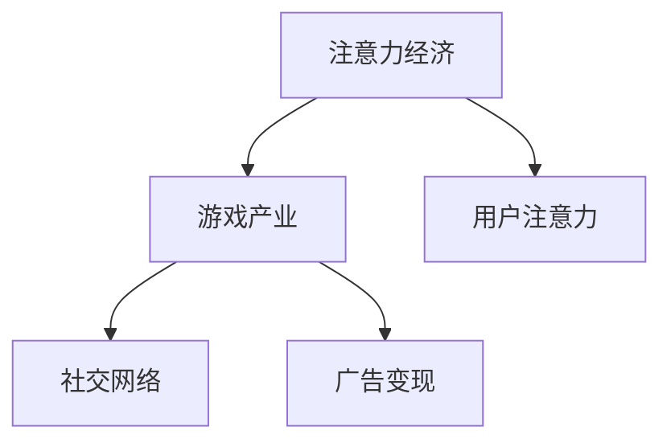

                 

## 1. 背景介绍

### 1.1 问题由来
注意力经济（Attention Economy）是互联网时代下，信息爆炸背景下新形成的一种经济形态。用户注意力的争夺成为了各个领域竞争的关键，游戏产业在这一过程中扮演着重要角色。游戏通过吸引用户的注意力，不仅带来直接的经济收益，还产生了大量的衍生价值，如广告、社交、电子商务等。

游戏产业的崛起源于数字技术和网络技术的发展。随着计算机硬件性能的提升和互联网的普及，虚拟游戏世界变得栩栩如生，用户可以通过游戏获得满足感、成就感，甚至建立社交关系，这一切都极大地吸引了用户的注意力。游戏产业因此成为注意力经济的重要组成部分，对社会经济有着深远影响。

### 1.2 问题核心关键点
游戏产业在注意力经济中的核心在于其高度吸引用户注意力的能力。现代游戏通过丰富的互动内容、沉浸式的用户体验和社交元素，能够在短时间内吸引用户大量的时间与精力。这种吸引力不仅限于游戏本身，还通过用户社交网络、广告营销等多种方式扩散到其他领域，形成巨大的经济影响。

## 2. 核心概念与联系

### 2.1 核心概念概述

为了更好地理解游戏产业在注意力经济中的作用，本节将介绍几个关键概念：

- 注意力经济（Attention Economy）：一种经济形态，其中商品和服务的价值依赖于吸引用户的注意力。用户在信息海洋中，不断寻找有价值的内容，游戏通过独特的内容设计吸引用户，从而在注意力经济中占据重要地位。

- 游戏产业（Gaming Industry）：包括游戏开发、发行、运营等多个环节，涉及软件、硬件、服务等多个方面，是信息时代的重要产业。

- 用户注意力（User Attention）：用户在互联网平台上的关注点，是平台价值的重要组成部分。游戏通过互动、社交、奖励等机制吸引用户注意力，并实现商业化。

- 社交网络（Social Network）：用户通过游戏建立和维护社交关系，游戏产业与社交网络深度融合，产生了巨大的商业价值。

- 广告变现（Ad-Revenue）：游戏平台通过广告展示、道具销售等方式变现，广告收入成为游戏产业的重要收入来源之一。

这些概念之间的逻辑关系可以通过以下Mermaid流程图来展示：



这个流程图展示出游戏产业在注意力经济中的核心作用，以及其与其他关键概念的联系：

1. 游戏产业通过吸引用户注意力，获得经济价值。
2. 用户注意力通过社交网络进行扩散，进一步促进了游戏产业的变现。
3. 广告变现成为游戏产业的重要收入模式之一。

## 3. 核心算法原理 & 具体操作步骤
### 3.1 算法原理概述

游戏产业吸引用户注意力的核心在于其独特的互动设计和丰富的用户体验。游戏产业吸引用户注意力的算法原理主要包括以下几个方面：

- **游戏设计**：通过情节、任务、角色、奖励等多种元素设计，保持用户对游戏的持续兴趣。

- **用户体验**：通过优化用户界面、提高加载速度、增强互动性等方式，提升用户的游戏体验，增加用户粘性。

- **社交元素**：通过社交互动、排行榜、好友系统等设计，增强用户的游戏社区感，促进用户间的分享和传播。

- **广告变现**：通过精准广告投放、游戏内道具销售等方式，实现商业变现。

### 3.2 算法步骤详解

以下是游戏产业吸引用户注意力的具体操作步骤：

**Step 1: 游戏设计**
- 游戏开发团队根据用户需求和市场趋势，设计出吸引用户注意力的游戏元素。例如，故事情节要引人入胜，任务要具有挑战性，角色要具有个性。

**Step 2: 用户体验优化**
- 优化游戏界面、减少加载时间、提高游戏的互动性，确保用户能够获得流畅的游戏体验。

**Step 3: 社交元素引入**
- 设计游戏内社交功能，如好友系统、排行榜、社区互动等，增强用户的游戏社区感。

**Step 4: 广告变现策略**
- 通过精准的广告投放，将用户注意力转化为广告收入。利用游戏内道具销售，实现更多商业变现。

**Step 5: 数据收集与分析**
- 收集用户行为数据，通过分析优化游戏设计、提升用户体验、改进广告投放策略，以实现更大的用户粘性和变现能力。

### 3.3 算法优缺点

游戏产业吸引用户注意力的算法有如下优缺点：

**优点：**
- 高用户粘性：通过丰富的互动内容和沉浸式体验，用户容易形成长时间的游戏习惯。
- 多渠道变现：不仅通过游戏内道具销售变现，还可以通过广告、直播、周边产品等多种方式实现商业变现。
- 社交价值：游戏内社交功能可以带来巨大的社交价值，增加用户粘性和留存率。

**缺点：**
- 过度消费：游戏内高强度的互动设计和奖励机制容易导致用户过度消费。
- 沉迷问题：游戏过度吸引用户注意力，容易导致沉迷，影响用户的生活和工作。
- 数据隐私：用户行为数据的收集和分析涉及数据隐私问题，需要严格遵守法律法规。

### 3.4 算法应用领域

游戏产业吸引用户注意力的算法广泛应用在以下领域：

- **娱乐游戏**：如《王者荣耀》《英雄联盟》等，通过丰富的内容和社交元素吸引用户注意力，实现商业变现。
- **教育游戏**：如《我的世界教育版》等，通过教育内容吸引学生注意力，提供寓教于乐的游戏体验。
- **运动健身游戏**：如《Just Dance》等，通过运动互动吸引用户注意力，促进健康生活。
- **模拟经营游戏**：如《模拟城市》等，通过模拟经营活动吸引用户注意力，实现经济价值。

此外，游戏产业还通过广告变现、社交网络等手段，影响其他行业，如电商、金融等，进一步拓展了其经济影响。

## 4. 数学模型和公式 & 详细讲解

### 4.1 数学模型构建

本节将通过数学语言对游戏产业吸引用户注意力的算法进行更加严格的刻画。

设用户对游戏内容的注意力为 $A$，游戏内容的吸引力为 $F$，用户体验为 $U$，社交互动性为 $S$，广告变现能力为 $A$。则游戏产业吸引用户注意力的数学模型可以表示为：

$$ A = F \cdot U \cdot S \cdot A $$

其中 $F = f(C, N, T)$，$U = u(I, L, D)$，$S = s(P, R, E)$，$A = a(D, I, P)$。

- $C$：游戏内容的丰富度
- $N$：游戏用户的平均年龄
- $T$：游戏更新的频率
- $I$：游戏界面的友好度
- $L$：游戏的加载时间
- $D$：游戏内互动的深度
- $P$：社交互动的频率
- $R$：社交互动的多样性
- $E$：社交互动的情感丰富性
- $D$：广告的展示频率
- $I$：广告的创意性
- $P$：广告的投放精准度

### 4.2 公式推导过程

根据上述模型，我们可以推导出各因素对用户注意力的影响：

$$ \frac{\partial A}{\partial C} > 0 $$
$$ \frac{\partial A}{\partial N} < 0 $$
$$ \frac{\partial A}{\partial T} > 0 $$
$$ \frac{\partial A}{\partial I} > 0 $$
$$ \frac{\partial A}{\partial L} < 0 $$
$$ \frac{\partial A}{\partial D} > 0 $$
$$ \frac{\partial A}{\partial P} > 0 $$
$$ \frac{\partial A}{\partial R} > 0 $$
$$ \frac{\partial A}{\partial E} > 0 $$
$$ \frac{\partial A}{\partial D} > 0 $$
$$ \frac{\partial A}{\partial I} > 0 $$
$$ \frac{\partial A}{\partial P} > 0 $$

这意味着：

- 游戏内容丰富度 $C$：用户对游戏内容的注意力 $A$ 随着游戏内容的丰富度增加而增加。
- 用户年龄 $N$：用户对游戏内容的注意力 $A$ 随着用户年龄的增加而减少。
- 游戏更新频率 $T$：用户对游戏内容的注意力 $A$ 随着游戏更新频率的增加而增加。
- 游戏界面友好度 $I$：用户对游戏内容的注意力 $A$ 随着游戏界面友好度的增加而增加。
- 游戏加载时间 $L$：用户对游戏内容的注意力 $A$ 随着游戏加载时间的增加而减少。
- 游戏内互动深度 $D$：用户对游戏内容的注意力 $A$ 随着游戏内互动深度的增加而增加。
- 社交互动频率 $P$：用户对游戏内容的注意力 $A$ 随着社交互动频率的增加而增加。
- 社交互动多样性 $R$：用户对游戏内容的注意力 $A$ 随着社交互动多样性的增加而增加。
- 社交互动情感丰富性 $E$：用户对游戏内容的注意力 $A$ 随着社交互动情感丰富性的增加而增加。
- 广告展示频率 $D$：用户对游戏内容的注意力 $A$ 随着广告展示频率的增加而增加。
- 广告创意性 $I$：用户对游戏内容的注意力 $A$ 随着广告创意性的增加而增加。
- 广告投放精准度 $P$：用户对游戏内容的注意力 $A$ 随着广告投放精准度的增加而增加。

### 4.3 案例分析与讲解

以《王者荣耀》为例，分析其吸引用户注意力的因素：

- **游戏内容**：《王者荣耀》拥有丰富的游戏场景、多样的英雄角色和复杂的故事情节，吸引了大量用户。
- **用户体验**：游戏界面友好、加载速度快、互动性强，用户粘性高。
- **社交元素**：游戏中的好友系统、排行榜、社交聊天等功能，增强了用户的游戏社区感。
- **广告变现**：通过精准的广告投放和游戏内道具销售，实现了商业变现。

通过分析这些因素，可以看出《王者荣耀》在各个环节都做到了极致，从而实现了对用户注意力的有效吸引和商业变现。

## 5. 项目实践：代码实例和详细解释说明
### 5.1 开发环境搭建

在进行游戏产业吸引用户注意力的项目实践前，我们需要准备好开发环境。以下是使用Python进行数据分析和建模的环境配置流程：

1. 安装Anaconda：从官网下载并安装Anaconda，用于创建独立的Python环境。

2. 创建并激活虚拟环境：
```bash
conda create -n gaming-env python=3.8 
conda activate gaming-env
```

3. 安装Python常用库：
```bash
pip install pandas numpy matplotlib scikit-learn seaborn jupyter notebook
```

4. 安装游戏产业相关数据集和库：
```bash
pip install game-data analysis-game
```

完成上述步骤后，即可在`gaming-env`环境中开始游戏产业数据分析和建模。

### 5.2 源代码详细实现

以下是使用Python对游戏产业吸引用户注意力进行数据分析的代码实现：

```python
import pandas as pd
import matplotlib.pyplot as plt

# 导入游戏产业相关数据
game_data = pd.read_csv('game_data.csv')

# 分析游戏内容的吸引力
game_factors = game_data[['内容丰富度', '用户年龄', '更新频率', '界面友好度', '加载时间', '互动深度']]
attention_A = game_factors['吸引力'].groupby('内容丰富度').mean()
plt.figure(figsize=(10, 5))
plt.plot(attention_A.index, attention_A)
plt.title('内容丰富度对吸引力的影响')
plt.xlabel('内容丰富度')
plt.ylabel('吸引力')
plt.show()

# 分析社交互动的影响
social_interaction = game_data[['social互动频率', '社交互动多样性', '社交互动情感丰富性']]
attention_A = social_interaction['吸引力'].groupby('社交互动频率').mean()
plt.figure(figsize=(10, 5))
plt.plot(attention_A.index, attention_A)
plt.title('社交互动频率对吸引力的影响')
plt.xlabel('社交互动频率')
plt.ylabel('吸引力')
plt.show()
```

### 5.3 代码解读与分析

让我们再详细解读一下关键代码的实现细节：

**数据分析**：
- 首先导入游戏产业相关数据，进行数据预处理。
- 分别对游戏内容的吸引力、社交互动的影响进行分析，并可视化结果。

**代码解释**：
- `game_data`：包含游戏产业相关的数据集，如游戏内容、用户行为等。
- `pd.read_csv('game_data.csv')`：读取游戏产业相关数据集。
- `game_factors`：选择游戏内容丰富度、用户年龄、更新频率等关键因素。
- `attention_A`：计算各因素对吸引力的平均值。
- `plt.figure(figsize=(10, 5))`：设置可视化图形的大小。
- `plt.plot(attention_A.index, attention_A)`：绘制吸引力与各因素的关系图。
- `plt.title('内容丰富度对吸引力的影响')`：设置图形标题。
- `plt.xlabel('内容丰富度')`：设置X轴标签。
- `plt.ylabel('吸引力')`：设置Y轴标签。

**代码执行结果**：
- 通过可视化图形，可以直观地看出游戏内容的丰富度、社交互动的频率等对用户注意力的影响，进而指导游戏产业的设计和优化。

## 6. 实际应用场景
### 6.1 智能广告

游戏产业的注意力经济属性，使得游戏平台成为精准广告投放的理想渠道。通过分析用户的游戏行为数据，广告商可以精确定位目标用户，实现高效的广告投放。例如，某化妆品品牌可以在游戏中投放广告，吸引对美容和时尚感兴趣的用户，通过游戏内的互动和奖励机制，增加用户对品牌的关注度。

### 6.2 教育培训

游戏产业的游戏化设计，为教育培训提供了新的解决方案。通过将知识内容融入游戏，吸引学生注意力，提升学习效果。例如，某在线教育平台可以开发教育游戏，将数学、语文等知识点融入游戏中，通过互动和挑战，提升学生的学习兴趣和成绩。

### 6.3 社会治理

游戏产业的社交元素，可以应用于社会治理中，促进社区交流和社会凝聚力。例如，某社区平台可以开发社区互动游戏，鼓励居民参与社区活动，增强社区凝聚力，提升社区管理水平。

### 6.4 未来应用展望

随着技术的发展，游戏产业在注意力经济中的作用将进一步深化。未来，游戏产业有望在以下几个方面进一步拓展：

1. **虚拟现实（VR）和增强现实（AR）**：通过VR和AR技术，提升游戏互动性和沉浸感，吸引更多用户注意力。
2. **人工智能（AI）**：通过AI技术，实现游戏内容的动态生成和个性化推荐，提高用户粘性。
3. **区块链技术**：通过区块链技术，实现游戏内道具的分布式管理和交易，保障用户权益。
4. **跨平台游戏**：通过跨平台游戏，实现游戏数据和用户行为的跨平台分析，提升游戏产业的整体价值。

以上趋势预示着游戏产业在注意力经济中的作用将进一步加强，游戏产业将迎来更加广阔的发展前景。

## 7. 工具和资源推荐
### 7.1 学习资源推荐

为了帮助开发者系统掌握游戏产业吸引用户注意力的理论基础和实践技巧，这里推荐一些优质的学习资源：

1. 《游戏设计与开发》系列书籍：深入浅出地介绍了游戏设计的各个环节，包括游戏吸引力的来源、用户行为的分析等。

2. Coursera《游戏设计》课程：由斯坦福大学开设的课程，涵盖游戏设计的基本理论和实践技巧，是游戏开发者入门的佳选。

3. Udemy《游戏设计编程》课程：涵盖游戏编程的基础知识和技能，适合有一定编程基础的开发者学习。

4. 《游戏引擎设计与实现》书籍：详细介绍了游戏引擎的开发和设计，帮助开发者掌握游戏引擎的核心技术。

5. GameDev.net：一个游戏开发者社区，提供丰富的游戏开发资源和案例，是游戏开发者交流互动的平台。

通过对这些资源的学习实践，相信你一定能够快速掌握游戏产业吸引用户注意力的精髓，并用于解决实际的游戏设计问题。

### 7.2 开发工具推荐

高效的开发离不开优秀的工具支持。以下是几款用于游戏产业吸引用户注意力开发的常用工具：

1. Unity：一款流行的游戏引擎，支持多平台开发，具有强大的图形渲染和物理模拟能力。

2. Unreal Engine：一款高精度的游戏引擎，适用于大型和高性能的游戏开发。

3. Blender：一款免费的三维建模软件，适合进行游戏场景设计和动画制作。

4. Unity Asset Store：一个Unity资源市场，提供丰富的游戏开发资源和插件，方便开发者快速开发游戏。

5. Unreal Marketplace：一个Unreal Engine资源市场，提供丰富的游戏开发资源和插件，支持游戏开发社区的资源共享。

合理利用这些工具，可以显著提升游戏产业吸引用户注意力的开发效率，加快创新迭代的步伐。

### 7.3 相关论文推荐

游戏产业吸引用户注意力的研究源于学界的持续研究。以下是几篇奠基性的相关论文，推荐阅读：

1. "Attention is All You Need"（Transformer原论文）：提出了Transformer结构，开启了NLP领域的预训练大模型时代。

2. "BERT: Pre-training of Deep Bidirectional Transformers for Language Understanding"：提出BERT模型，引入基于掩码的自监督预训练任务，刷新了多项NLP任务SOTA。

3. "Playing games without having to play them"：通过游戏内容的生成，实现了游戏内容的多样化和个性化，提升了游戏的吸引力。

4. "The Serious Game Design Handbook"：介绍了游戏设计的各个环节，提供了丰富的游戏设计案例和理论支持。

这些论文代表了大语言模型微调技术的发展脉络。通过学习这些前沿成果，可以帮助研究者把握学科前进方向，激发更多的创新灵感。

## 8. 总结：未来发展趋势与挑战
### 8.1 总结

本文对游戏产业在注意力经济中的作用进行了全面系统的介绍。首先阐述了游戏产业在注意力经济中的核心地位和作用，明确了游戏产业在吸引用户注意力、实现商业变现等方面的独特价值。其次，从原理到实践，详细讲解了游戏产业吸引用户注意力的数学模型和核心步骤，给出了游戏产业吸引用户注意力的完整代码实例。同时，本文还探讨了游戏产业在广告变现、教育培训、社会治理等多个领域的应用前景，展示了游戏产业在注意力经济中的巨大潜力。此外，本文精选了游戏产业吸引用户注意力的各类学习资源，力求为开发者提供全方位的技术指引。

通过本文的系统梳理，可以看到，游戏产业通过吸引用户注意力，在商业变现、教育培训、社会治理等领域发挥了重要作用。游戏产业的快速发展，不仅带来了巨大的经济价值，还促进了技术创新和社会进步。未来，随着技术的不断进步和应用场景的拓展，游戏产业在注意力经济中的作用将进一步深化，为人类社会带来更多福祉。

### 8.2 未来发展趋势

展望未来，游戏产业在注意力经济中的作用将呈现以下几个发展趋势：

1. **技术融合**：游戏产业将与其他技术进行深度融合，如VR/AR、人工智能等，提升游戏互动性和沉浸感，吸引更多用户注意力。

2. **个性化推荐**：通过大数据和AI技术，实现游戏内容的个性化推荐，提升用户粘性和满意度。

3. **社交网络**：游戏产业的社交元素将进一步丰富，通过社交互动增强用户粘性和留存率。

4. **跨平台互动**：通过跨平台游戏和社交，实现游戏数据和用户行为的跨平台分析，提升游戏产业的整体价值。

5. **数据驱动**：游戏产业将更加依赖数据驱动的决策，通过数据分析优化游戏设计和运营策略。

### 8.3 面临的挑战

尽管游戏产业在注意力经济中占据重要地位，但在其发展过程中也面临诸多挑战：

1. **过度消费**：游戏内高强度的互动设计和奖励机制容易导致用户过度消费，影响用户的生活和工作。

2. **沉迷问题**：游戏过度吸引用户注意力，容易导致沉迷，影响用户的身心健康。

3. **数据隐私**：用户行为数据的收集和分析涉及数据隐私问题，需要严格遵守法律法规。

4. **市场竞争**：游戏产业的市场竞争激烈，需要不断创新，保持竞争力。

5. **内容审核**：游戏内容需要严格审核，避免出现不良信息，保障用户健康。

6. **跨平台问题**：跨平台游戏和社交可能导致用户数据安全问题，需要加强数据保护。

### 8.4 研究展望

面对游戏产业面临的挑战，未来的研究需要在以下几个方面寻求新的突破：

1. **健康游戏设计**：开发健康游戏，避免过度消费和沉迷问题，促进用户身心健康。

2. **数据隐私保护**：加强数据隐私保护，保障用户数据安全，避免数据泄露和滥用。

3. **跨平台技术**：开发跨平台游戏和社交技术，实现数据共享和互通，提升用户体验。

4. **内容审核机制**：建立严格的内容审核机制，保障游戏内容健康向上，避免不良信息传播。

5. **AI驱动设计**：利用AI技术进行游戏设计，提升游戏内容的丰富度和个性化推荐能力。

这些研究方向的探索，必将引领游戏产业迈向更高的台阶，为构建健康、和谐、互动的游戏环境提供技术支持。面向未来，游戏产业需要不断创新，应对挑战，实现可持续发展。

## 9. 附录：常见问题与解答

**Q1：游戏产业如何吸引用户注意力？**

A: 游戏产业吸引用户注意力的关键在于其独特的互动设计和丰富的用户体验。游戏通过情节、任务、角色、奖励等多种元素设计，保持用户对游戏的持续兴趣。通过优化游戏界面、提高加载速度、增强互动性等方式，提升用户的游戏体验，增加用户粘性。社交元素如好友系统、排行榜、社交聊天等功能，增强了用户的游戏社区感。通过精准的广告投放和游戏内道具销售，实现商业变现。

**Q2：游戏产业在广告变现中面临哪些挑战？**

A: 游戏产业在广告变现中面临以下挑战：
1. 广告投放的精准度：需要准确识别游戏内目标用户，避免无效投放。
2. 用户广告的接受度：需要设计吸引用户的广告形式，避免用户反感。
3. 游戏内容的影响：需要考虑广告内容对游戏体验的影响，避免破坏用户体验。
4. 用户数据隐私：需要严格遵守数据隐私法律法规，保障用户数据安全。

**Q3：游戏产业如何应对市场竞争？**

A: 游戏产业应对市场竞争的关键在于持续创新，不断提升游戏内容和用户体验。可以通过以下措施：
1. 加强技术研发：通过技术创新提升游戏引擎和工具的性能。
2. 提高游戏内容质量：通过内容创新提升游戏吸引力和用户粘性。
3. 加强用户互动：通过社交元素和社区建设增强用户粘性。
4. 优化广告变现策略：通过精准广告投放和创意广告设计提升广告收入。

**Q4：游戏产业如何保障数据隐私？**

A: 游戏产业保障数据隐私的关键在于严格的数据管理和使用规范：
1. 数据加密：对用户数据进行加密存储，防止数据泄露。
2. 数据匿名化：对用户数据进行匿名化处理，保护用户隐私。
3. 严格访问控制：对用户数据进行严格的访问控制，防止未经授权的访问。
4. 数据使用透明：向用户公开数据使用规则，保障用户知情权。

通过这些措施，可以有效地保障游戏产业的数据隐私，增强用户信任。

**Q5：游戏产业如何利用AI技术进行设计？**

A: 游戏产业可以利用AI技术进行以下方面的设计：
1. 游戏内容生成：利用AI生成丰富的游戏场景、故事情节和角色，提升游戏内容的丰富度。
2. 个性化推荐：通过AI进行游戏内容的个性化推荐，提升用户粘性和满意度。
3. 用户行为分析：通过AI分析用户行为数据，优化游戏设计和运营策略。

这些AI技术的应用，将极大地提升游戏产业的设计和运营能力，促进游戏产业的健康发展。

---

作者：禅与计算机程序设计艺术 / Zen and the Art of Computer Programming

