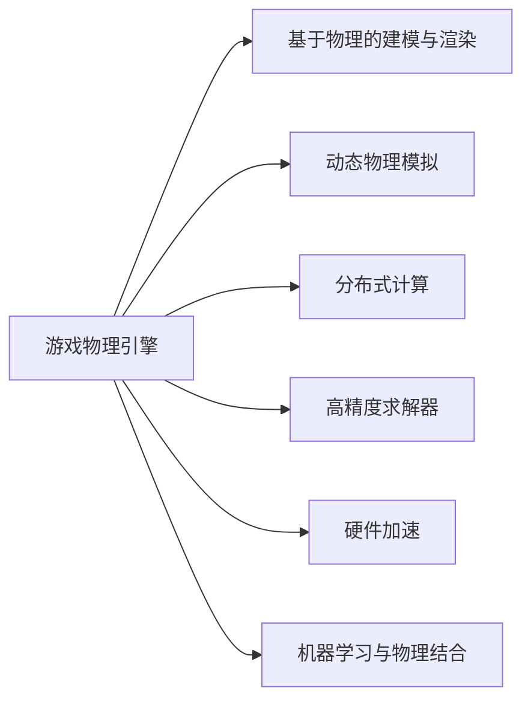

                 

## 1. 背景介绍

### 1.1 问题由来

在现代电子游戏中，物理引擎的精准度和真实感已成为用户体验的关键。传统游戏引擎如Unreal Engine和Unity虽然功能丰富，但性能优化和物理计算方面仍有不足，难以适应大规模世界模拟的需求。因此，如何开发高性能、低延迟、物理感强的新型游戏物理引擎，成为了当前游戏引擎领域的研究热点。

### 1.2 问题核心关键点

当前游戏物理引擎的主要研究热点包括：
- 基于物理的建模和渲染：通过精确计算物体间的碰撞、摩擦、弹力等，提升游戏物理的真实感。
- 动态物理模拟：利用数值方法模拟真实世界中的物理过程，如流体动力学、刚体碰撞等。
- 分布式计算：采用多核并行、GPU并行、分布式计算等技术，优化物理模拟的计算效率。
- 高精度求解器：开发高性能求解算法，快速计算复杂的物理方程组。
- 硬件加速：利用GPU、CPU、FPGA等硬件资源，加速物理模拟的计算。
- 机器学习与物理结合：利用机器学习算法优化物理引擎，提升模拟效果和效率。

这些研究方向的目标是实现更加真实、细腻、高效的游戏物理引擎，以支撑大规模、高交互的游戏世界模拟。

## 2. 核心概念与联系

### 2.1 核心概念概述

为更好地理解新型游戏物理引擎，本节将介绍几个关键核心概念：

- **游戏物理引擎**：一个用于在游戏中实现真实物理模拟的软件系统，基于物理学的定律和数学方法，对物体的运动、碰撞、变形等进行计算，以实现逼真的游戏场景。
- **基于物理的建模与渲染**：通过精确的物理方程和可视化技术，对游戏场景中的物体进行建模和渲染，使其能够真实反映物理特性。
- **动态物理模拟**：利用数值方法模拟游戏中的物理过程，如流体动力学、刚体碰撞等，实现动态且连续的物理变化。
- **分布式计算**：采用多核并行、GPU并行、分布式计算等技术，优化物理模拟的计算效率。
- **高精度求解器**：开发高性能求解算法，快速计算复杂的物理方程组，提升模拟精度和速度。
- **硬件加速**：利用GPU、CPU、FPGA等硬件资源，加速物理模拟的计算，提升渲染效果。
- **机器学习与物理结合**：利用机器学习算法优化物理引擎，提升模拟效果和效率，如通过深度学习模型预测物体运动和碰撞。

这些概念之间的逻辑关系可以通过以下Mermaid流程图来展示：



这个流程图展示了一系列关键概念及其之间的关系：

1. **游戏物理引擎**通过精确的物理计算和渲染技术，实现逼真的物理世界模拟。
2. **基于物理的建模与渲染**是引擎的核心组成部分，实现物体的真实表现。
3. **动态物理模拟**利用数值方法，实现物体间动态的物理变化。
4. **分布式计算**通过并行计算提升物理模拟的效率。
5. **高精度求解器**优化计算算法，提升模拟精度和速度。
6. **硬件加速**利用GPU、CPU等硬件资源，提升计算和渲染效率。
7. **机器学习与物理结合**通过深度学习等算法，提升模拟效果和效率。

这些概念共同构成了新型游戏物理引擎的技术框架，使其能够在各种游戏场景中实现高精度、高效率的物理模拟。

## 3. 核心算法原理 & 具体操作步骤

### 3.1 算法原理概述

基于物理的模拟通常涉及复杂的物理方程，如牛顿力学方程、碰撞检测方程、流体动力学方程等。这些方程需要高效的数值求解算法，同时需要优化算法以适应分布式计算和硬件加速的需求。

本文将详细讲解基于牛顿力学方程的刚体碰撞和流体动力学模拟，介绍常用的数值求解算法和优化策略。

### 3.2 算法步骤详解

**Step 1: 数学模型构建**

- **刚体碰撞**：利用牛顿力学方程描述物体的运动状态，如位置、速度、加速度等。
  - 刚体碰撞：假设物体为刚体，利用牛顿第二定律和碰撞模型，计算物体间的作用力。
  - 公式：$$\mathbf{F} = m \mathbf{a} = \frac{d}{dt}(m \mathbf{v})$$
  - 其中，$\mathbf{F}$ 为作用力，$m$ 为质量，$\mathbf{a}$ 为加速度，$\mathbf{v}$ 为速度。

- **流体动力学**：利用纳维-斯托克斯方程描述流体的运动状态，如速度、压力、密度等。
  - 纳维-斯托克斯方程：$$\frac{\partial \mathbf{u}}{\partial t} + (\mathbf{u} \cdot \nabla) \mathbf{u} = -\nabla p + \mu \nabla^2 \mathbf{u} + \mathbf{f}$$
  - 其中，$\mathbf{u}$ 为流体的速度，$p$ 为压力，$\mu$ 为黏度，$\mathbf{f}$ 为体力。

**Step 2: 数值求解算法**

- **欧拉法**：利用时间步长对物理方程进行直接求解，简单直观但精度有限。
- **显式欧拉法**：对时间步长进行精确控制，适用于动态模拟。
- **隐式欧拉法**：通过迭代求解方程组，精度高但计算复杂。
- **拉格朗日乘子法**：利用拉格朗日乘子优化方程组，适用于复杂的物理约束。
- **有限元方法**：将物体离散为有限个单元，利用矩阵求解方法处理复杂的几何关系。
- **粒子模拟方法**：利用大量粒子模拟流体的运动，适用于无结构化流体的模拟。

**Step 3: 优化策略**

- **多核并行**：利用多核CPU和GPU加速计算，提高求解效率。
- **GPU并行**：利用CUDA等加速指令，在GPU上实现高效的并行计算。
- **分布式计算**：利用多个计算节点协同计算，提升计算能力。
- **硬件加速**：利用GPU、FPGA等硬件资源，优化物理模拟的计算。
- **算法优化**：优化求解算法的精度和速度，减少计算复杂度。

**Step 4: 实验验证**

- **模拟实验**：利用数值模拟软件，如Dymola、ANSYS等，验证算法的正确性和性能。
- **实验对比**：与传统游戏引擎如Unity、Unreal进行对比，评估新引擎的性能和效果。

### 3.3 算法优缺点

**刚体碰撞模拟**

- **优点**：
  - 算法简单直观，易于实现和理解。
  - 计算速度快，适用于动态模拟。
  - 精度较高，能够精确模拟物体的运动和碰撞。

- **缺点**：
  - 对初始条件敏感，需要精确控制初始速度和加速度。
  - 求解器复杂度高，需要优化算法提高求解效率。

**流体动力学模拟**

- **优点**：
  - 能够逼真模拟复杂的流体运动。
  - 适用范围广，适用于多种物理场景。

- **缺点**：
  - 计算复杂度高，需要高性能硬件资源。
  - 求解精度受数值方法限制，难以保证高精度。

### 3.4 算法应用领域

基于物理的模拟技术广泛应用于游戏、电影、建筑等领域，具有以下主要应用方向：

- **游戏**：用于实现逼真的物理效果，提升游戏体验和真实感。
- **建筑**：用于模拟地震、火灾等灾害场景，提高建筑设计的安全性和实用性。
- **电影**：用于实现逼真的特效和场景模拟，提升电影制作的质量和视觉效果。

## 4. 数学模型和公式 & 详细讲解 & 举例说明

### 4.1 数学模型构建

本节将使用数学语言对基于牛顿力学方程的刚体碰撞和流体动力学模拟进行严格刻画。

**刚体碰撞**

- **牛顿第二定律**：描述物体的运动状态，$$\mathbf{F} = m \mathbf{a}$$
- **碰撞方程**：描述物体间的碰撞状态，$$\Delta v = \frac{2}{m} \mathbf{F} t$$
  - 其中，$\Delta v$ 为速度变化，$m$ 为质量，$t$ 为碰撞时间。

**流体动力学**

- **纳维-斯托克斯方程**：描述流体的运动状态，$$\frac{\partial \mathbf{u}}{\partial t} + (\mathbf{u} \cdot \nabla) \mathbf{u} = -\nabla p + \mu \nabla^2 \mathbf{u} + \mathbf{f}$$
- **伯努利方程**：描述流体内部的压力变化，$$p = \rho g h$$
  - 其中，$\rho$ 为流体密度，$g$ 为重力加速度，$h$ 为流体高度。

### 4.2 公式推导过程

以下将详细推导刚体碰撞和流体动力学的数值求解算法。

**刚体碰撞的数值求解**

- **欧拉法**：时间步长为 $\Delta t$，求解方程为：$$\mathbf{v}^{n+1} = \mathbf{v}^n + \Delta t \mathbf{a}^n$$
- **显式欧拉法**：时间步长为 $\Delta t$，求解方程为：$$\mathbf{v}^{n+1} = \mathbf{v}^n + \Delta t \frac{\mathbf{F}^{n+1}}{m}$$
- **隐式欧拉法**：时间步长为 $\Delta t$，求解方程为：$$\mathbf{v}^{n+1} = \mathbf{v}^n + \Delta t \frac{\mathbf{F}^{n+1}}{m}$$

**流体动力学的数值求解**

- **有限元方法**：将流体划分为多个单元，利用矩阵求解方法求解方程。
  - 离散化方程为：$$\mathbf{M} \frac{\partial \mathbf{u}}{\partial t} + \mathbf{R} \mathbf{u} = \mathbf{B} \mathbf{p} + \mathbf{F}$$
  - 其中，$\mathbf{M}$ 为质量矩阵，$\mathbf{R}$ 为阻尼矩阵，$\mathbf{B}$ 为刚度矩阵，$\mathbf{p}$ 为压力，$\mathbf{F}$ 为体力。

### 4.3 案例分析与讲解

**案例1: 刚体碰撞**

假设有两个刚体 $A$ 和 $B$，初始速度分别为 $\mathbf{v}_A = (1, 0)$，$\mathbf{v}_B = (-1, 0)$，质量均为 $m=1$。两物体在 $t=0$ 时刻碰撞，碰撞时间为 $\Delta t = 0.1$，碰撞后速度变为 $\mathbf{v}_A = (0, 0)$，$\mathbf{v}_B = (0, 0)$。

计算过程如下：
- 根据牛顿第二定律，求解作用力 $\mathbf{F}$。
- 根据碰撞方程，求解速度变化 $\Delta v$。
- 利用显式欧拉法更新速度和位置，计算碰撞后的状态。

**案例2: 流体动力学**

假设有一个正方形区域 $[0, 1]^2$，初始速度为 $\mathbf{u} = (0, 0)$，黏度 $\mu = 1$。在区域上施加一个恒定速度 $\mathbf{f} = (1, 0)$，求解流体的运动状态。

计算过程如下：
- 利用有限元方法，将正方形区域划分为多个单元。
- 求解离散化方程，得到流体的速度和压力。
- 利用拉格朗日乘子法，优化速度和压力的求解过程。

## 5. 项目实践：代码实例和详细解释说明

### 5.1 开发环境搭建

在进行物理引擎的开发实践前，我们需要准备好开发环境。以下是使用C++和OpenGL进行游戏引擎开发的环境配置流程：

1. 安装Visual Studio：从官网下载并安装Visual Studio，用于编写和调试C++代码。
2. 安装OpenGL库：从官网下载并安装OpenGL库，用于图形渲染。
3. 安装GLFW库：从官网下载并安装GLFW库，用于窗口管理。
4. 安装GLUT库：从官网下载并安装GLUT库，用于事件处理。
5. 安装GLM库：从官网下载并安装GLM库，用于数学运算。
6. 安装Box2D库：从官网下载并安装Box2D库，用于刚体碰撞模拟。

完成上述步骤后，即可在Visual Studio环境下开始物理引擎的开发。

### 5.2 源代码详细实现

下面我们以刚体碰撞模拟为例，给出使用Box2D库进行物理模拟的C++代码实现。

首先，定义物理引擎类：

```cpp
class PhysicsEngine {
public:
    PhysicsEngine();
    void Init();
    void Update(float deltaTime);
    void Draw();
    void AddBody(b2Body* body);

private:
    b2World world;
};
```

然后，实现物理引擎的初始化和更新过程：

```cpp
PhysicsEngine::PhysicsEngine() {
    world = b2World(b2Vec2(0.0f, -10.0f));
}

void PhysicsEngine::Init() {
    // 设置物理引擎参数
    world.SetContactListener(this);
    world.SetGravity(b2Vec2(0.0f, -10.0f));
}

void PhysicsEngine::Update(float deltaTime) {
    // 进行物理模拟
    for (int i = 0; i < bodies.size(); i++) {
        world.Step(deltaTime, 8, 3);
    }
}

void PhysicsEngine::Draw() {
    // 渲染物理模拟结果
    // 此处为OpenGL渲染代码
}
```

接着，实现物理引擎的事件处理和渲染过程：

```cpp
void PhysicsEngine::AddBody(b2Body* body) {
    bodies.push_back(body);
}

void PhysicsEngine::b2Contact::BeginContact(b2Contact* contact) {
    // 处理碰撞事件
    // 此处为具体碰撞处理代码
}

void PhysicsEngine::b2Contact::EndContact(b2Contact* contact) {
    // 处理碰撞结束事件
    // 此处为具体碰撞结束处理代码
}
```

最后，实现物理引擎的渲染过程：

```cpp
void PhysicsEngine::Draw() {
    // 渲染物理模拟结果
    // 此处为OpenGL渲染代码
}
```

### 5.3 代码解读与分析

让我们再详细解读一下关键代码的实现细节：

** PhysicsEngine类**：
- `__init__`方法：初始化物理引擎，创建Box2D世界和接触事件处理函数。
- `Init`方法：设置物理引擎参数，如重力、接触事件处理函数。
- `Update`方法：进行物理模拟，使用`Step`函数进行时间步长计算。
- `Draw`方法：渲染物理模拟结果，此处为OpenGL渲染代码。

** AddBody方法**：
- 将物理体添加到物理引擎中，供后续模拟和渲染使用。

** b2Contact类**：
- `BeginContact`方法：处理碰撞开始事件，如设置碰撞体的状态和属性。
- `EndContact`方法：处理碰撞结束事件，如更新碰撞体的状态和属性。

通过以上代码实现，可以看出Box2D库的强大封装能力，使得刚体碰撞模拟变得简洁高效。开发者可以将更多精力放在具体的物理模拟和渲染逻辑上，而不必过多关注底层的实现细节。

当然，工业级的系统实现还需考虑更多因素，如多体碰撞处理、弹性碰撞模拟、碰撞物体的材质和纹理等。但核心的刚体碰撞模拟范式基本与此类似。

## 6. 实际应用场景

### 6.1 游戏应用

基于物理引擎的模拟技术在现代游戏中应用广泛，主要用于实现游戏物理效果，提升游戏体验和真实感。以下是几个典型应用场景：

**汽车模拟**：在游戏中模拟汽车的行驶和碰撞，利用刚体碰撞和流体动力学模拟，实现逼真的物理效果。

**角色运动**：实现角色的跑、跳、攀爬等动作，利用刚体碰撞和动力学方程模拟，增强游戏的沉浸感。

**物体互动**：实现游戏中的物理交互，如击打、推挤等，利用碰撞检测和物理模拟实现真实感。

**环境模拟**：模拟游戏中的各种环境，如建筑物、地形等，利用刚体碰撞和流体动力学模拟，提升游戏的真实性和细腻度。

### 6.2 工业应用

物理引擎的模拟技术在工业应用中也具有广泛的应用前景，主要用于模拟和分析现实世界中的物理现象，提高设计和生产的安全性和效率。以下是几个典型应用场景：

**建筑安全模拟**：用于模拟地震、火灾等灾害场景，评估建筑物和设施的安全性，提供科学的设计依据。

**汽车碰撞测试**：用于模拟汽车的碰撞过程，评估汽车的安全性，优化汽车的设计和性能。

**流体动力学分析**：用于分析流体在管道、容器中流动的情况，优化管道设计和加工工艺，提高生产效率。

**柔性体模拟**：用于模拟柔性体的变形和运动，如纺织品、橡胶等，优化设计方案，提高生产质量。

## 7. 工具和资源推荐

### 7.1 学习资源推荐

为了帮助开发者系统掌握物理引擎的开发和应用，这里推荐一些优质的学习资源：

1. **《Real-Time Collision Detection》**：由Tom Davis撰写的经典书籍，详细介绍了碰撞检测的原理和实现方法。

2. **《Game Physics Engine Development》**：由Mark Nelson撰写的书籍，全面介绍了游戏物理引擎的开发和应用，涵盖刚体碰撞、流体动力学等多个方面。

3. **《Programming Game Physics》**：由Nate Griffiths撰写的书籍，通过实例介绍了游戏物理引擎的实现，适合动手实践。

4. **Coursera《Physics for Game Developers》课程**：由Unity和Google联合开设的课程，涵盖物理引擎的基础知识和实际应用。

5. **Udemy《Unity Physics Engine》课程**：由Unity官方认证的课程，详细介绍了Unity物理引擎的使用方法和技巧。

通过对这些资源的学习实践，相信你一定能够快速掌握物理引擎的开发和应用，并用于解决具体的物理模拟问题。

### 7.2 开发工具推荐

高效的开发离不开优秀的工具支持。以下是几款用于物理引擎开发和物理模拟的常用工具：

1. **Visual Studio**：微软开发的IDE，支持C++编译和调试。
2. **OpenGL**：跨平台的图形渲染库，支持高效的图形渲染和可视化。
3. **GLFW**：跨平台的窗口管理库，支持多种窗口和输入设备。
4. **GLUT**：跨平台的图形界面库，支持事件处理和图形渲染。
5. **GLM**：跨平台的数学运算库，支持矩阵、向量、变换等数学运算。
6. **Box2D**：开源的刚体碰撞模拟库，支持多种物理场景的模拟。

合理利用这些工具，可以显著提升物理引擎的开发效率，加快创新迭代的步伐。

### 7.3 相关论文推荐

物理引擎的研究涉及广泛领域的知识，以下是几篇奠基性的相关论文，推荐阅读：

1. **《Real-time Collision Detection》**：由Tom Davis撰写的经典论文，介绍了碰撞检测的原理和算法。

2. **《Game Physics Engine Development》**：由Mark Nelson撰写的书籍，全面介绍了游戏物理引擎的开发和应用。

3. **《Programming Game Physics》**：由Nate Griffiths撰写的书籍，通过实例介绍了游戏物理引擎的实现。

4. **《Fluid Dynamics》**：由Ludwig Prandtl和Oswald Prandtl撰写的经典书籍，介绍了流体力学的基本原理和应用。

5. **《Collision Detection in Interactive 3D Environments》**：由Patrick Kloss撰写的论文，介绍了碰撞检测的实现方法和技术。

这些论文代表了大规模物理引擎微调技术的发展脉络。通过学习这些前沿成果，可以帮助研究者把握学科前进方向，激发更多的创新灵感。

## 8. 总结：未来发展趋势与挑战

### 8.1 总结

本文对基于牛顿力学方程的刚体碰撞和流体动力学模拟进行了全面系统的介绍。首先阐述了物理引擎的开发背景和意义，明确了物理引擎在提升游戏和工业应用中的价值。其次，从原理到实践，详细讲解了物理引擎的数学模型和关键算法，给出了物理引擎开发的完整代码实例。同时，本文还广泛探讨了物理引擎在各种游戏和工业场景中的应用前景，展示了物理引擎范式的巨大潜力。

通过本文的系统梳理，可以看到，基于物理的模拟技术正在成为游戏和工业应用的重要范式，极大地拓展了游戏和工业场景的模拟能力。受益于物理模拟算法的不断进步，未来的游戏和工业系统必将更加真实、细腻、高效。

### 8.2 未来发展趋势

展望未来，物理引擎的发展趋势将呈现以下几个方向：

1. **多体交互**：利用多体碰撞和动力学方程，实现更加复杂和逼真的物理交互，如物理角色的攀爬、打斗等。

2. **动态模拟**：利用数值方法，实现更加动态和连续的物理变化，如流体动力学模拟、刚体碰撞模拟等。

3. **硬件加速**：利用GPU、FPGA等硬件资源，加速物理模拟的计算，提高渲染效果和效率。

4. **分布式计算**：采用多核并行、GPU并行、分布式计算等技术，优化物理模拟的计算效率。

5. **机器学习与物理结合**：利用机器学习算法优化物理引擎，提升模拟效果和效率，如通过深度学习模型预测物体运动和碰撞。

6. **高精度求解器**：开发高性能求解算法，快速计算复杂的物理方程组，提升模拟精度和速度。

以上趋势凸显了物理引擎的发展前景。这些方向的探索发展，必将进一步提升物理引擎的性能和应用范围，为游戏和工业系统带来新的突破。

### 8.3 面临的挑战

尽管物理引擎技术已经取得了显著进展，但在迈向更加智能化、普适化应用的过程中，仍面临诸多挑战：

1. **计算复杂度**：大规模物理模拟的计算复杂度高，需要高性能硬件资源支持。如何优化算法，减少计算量，提高计算效率，是关键问题。

2. **实时性**：物理模拟需要实时渲染，对计算速度和渲染效率的要求高。如何优化算法，提升实时性能，是重要研究方向。

3. **多体碰撞处理**：多体碰撞模拟复杂度高，如何优化碰撞检测和碰撞响应，是关键问题。

4. **刚体碰撞模拟**：刚体碰撞模拟需要精确控制初始条件，如何优化求解算法，提高精度和稳定性，是关键问题。

5. **流体动力学模拟**：流体动力学模拟计算复杂度高，求解精度受数值方法限制，如何提高求解精度和效率，是重要研究方向。

6. **硬件加速**：利用GPU、FPGA等硬件资源，加速物理模拟的计算，需要优化硬件接口和数据传输。

正视物理引擎面临的这些挑战，积极应对并寻求突破，将是大规模物理引擎微调走向成熟的必由之路。相信随着学界和产业界的共同努力，这些挑战终将一一被克服，物理引擎必将在构建高真实性、高交互性的游戏和工业系统中扮演越来越重要的角色。

### 8.4 未来突破

面对物理引擎面临的诸多挑战，未来的研究需要在以下几个方面寻求新的突破：

1. **多体碰撞处理**：开发高效的多体碰撞检测和响应算法，提升模拟精度和效率。

2. **优化求解算法**：优化求解算法的精度和速度，减少计算复杂度，提高计算效率。

3. **机器学习与物理结合**：利用机器学习算法优化物理引擎，提升模拟效果和效率。

4. **高精度求解器**：开发高性能求解算法，快速计算复杂的物理方程组，提升模拟精度和速度。

5. **硬件加速**：优化硬件接口和数据传输，利用GPU、FPGA等硬件资源，加速物理模拟的计算。

6. **多核并行和分布式计算**：采用多核并行、GPU并行、分布式计算等技术，优化物理模拟的计算效率。

这些研究方向的探索，必将引领物理引擎技术迈向更高的台阶，为构建高真实性、高交互性的游戏和工业系统铺平道路。面向未来，物理引擎需要与其他人工智能技术进行更深入的融合，如知识表示、因果推理、强化学习等，多路径协同发力，共同推动物理引擎技术的进步。只有勇于创新、敢于突破，才能不断拓展物理引擎的边界，让物理引擎技术更好地造福游戏和工业系统。

## 9. 附录：常见问题与解答

**Q1：物理引擎如何实现逼真的物理效果？**

A: 物理引擎通过精确计算物体间的碰撞、摩擦、弹力等，实现逼真的物理效果。具体而言，利用牛顿力学方程描述物体的运动状态，利用碰撞模型计算物体间的作用力，利用数值方法模拟流体的运动，从而实现逼真的物理效果。

**Q2：物理引擎的计算复杂度如何优化？**

A: 物理引擎的计算复杂度主要来自刚体碰撞模拟和流体动力学模拟。为优化计算复杂度，可以采用以下方法：
- 多核并行和分布式计算，利用多核CPU和GPU加速计算。
- 硬件加速，利用GPU、FPGA等硬件资源，加速物理模拟的计算。
- 优化求解算法，减少计算量，提高计算效率。

**Q3：物理引擎在实际应用中面临哪些挑战？**

A: 物理引擎在实际应用中面临的主要挑战包括：
- 计算复杂度高，需要高性能硬件资源支持。
- 实时性要求高，对计算速度和渲染效率的要求高。
- 多体碰撞处理复杂度高，需要优化碰撞检测和碰撞响应。
- 刚体碰撞模拟需要精确控制初始条件，优化求解算法是关键问题。
- 流体动力学模拟计算复杂度高，求解精度受数值方法限制。
- 硬件加速需要优化硬件接口和数据传输，提升计算效率。

**Q4：物理引擎的未来发展方向有哪些？**

A: 物理引擎的未来发展方向包括：
- 多体交互，利用多体碰撞和动力学方程，实现更加复杂和逼真的物理交互。
- 动态模拟，利用数值方法，实现更加动态和连续的物理变化。
- 硬件加速，利用GPU、FPGA等硬件资源，加速物理模拟的计算，提高渲染效果和效率。
- 分布式计算，采用多核并行、GPU并行、分布式计算等技术，优化物理模拟的计算效率。
- 机器学习与物理结合，利用机器学习算法优化物理引擎，提升模拟效果和效率。
- 高精度求解器，开发高性能求解算法，快速计算复杂的物理方程组，提升模拟精度和速度。

这些方向将进一步提升物理引擎的性能和应用范围，为游戏和工业系统带来新的突破。

---

作者：禅与计算机程序设计艺术 / Zen and the Art of Computer Programming

