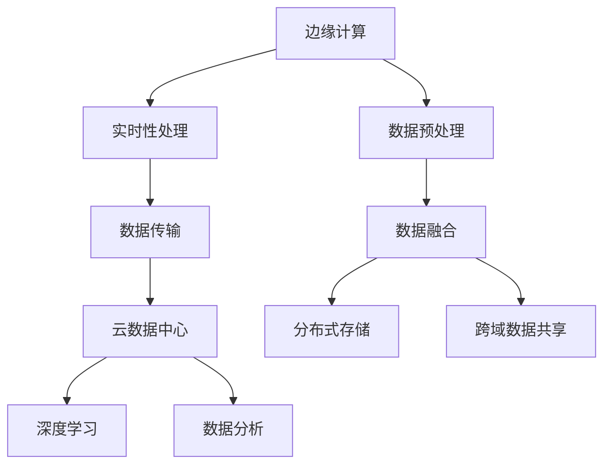

                 

# 物联网数据分析：在边缘和云端处理数据

在数字化转型的浪潮下，物联网(IoT)已经成为推动行业创新和经济增长的关键力量。物联网设备大量采集和传输数据，产生的海量数据蕴含着巨大的商业价值。如何高效、安全地处理和分析这些数据，成为了当前物联网数据分析中的重要议题。本文将探讨物联网数据分析中的核心概念，介绍边缘计算与云端的协同工作机制，并提出几种关键的算法和应用场景，以期对物联网数据分析的实践提供深入的指导。

## 1. 背景介绍

### 1.1 问题由来
物联网（IoT）通过传感器、智能设备等将物理世界与数字世界连接起来，实现了对物理世界的全面监控和实时控制。随着设备的普及，物联网设备产生的数据量呈指数级增长。例如，智能家居中的各类传感器设备，可以通过监控温度、湿度、光照等环境数据，实现对家庭环境的自动化控制。在工业领域，传感器可以监控机器运行状态，预测设备故障，提高生产效率。在智慧城市中，传感器可以监控交通流量、空气质量等，改善城市环境。

物联网设备产生的数据具有以下几个特点：
1. **数据规模庞大**：设备数量众多，每个设备可能每秒产生数百个数据点。
2. **数据类型多样**：数据类型包括结构化、半结构化和非结构化数据，如图像、视频、音频等。
3. **数据实时性强**：数据需要实时传输和处理，以保证响应速度和决策时效性。

这些特点使得物联网数据分析面临诸多挑战，尤其是在数据量、数据类型和数据实时性等方面的处理上。因此，需要引入边缘计算和云端的协同机制，优化数据处理流程，提升分析效率。

### 1.2 问题核心关键点
边缘计算和云端的协同工作机制，是物联网数据分析中不可或缺的一环。边缘计算是指在靠近数据源的设备上对数据进行初步处理和分析，减少数据传输量和延迟。云端则提供更强大的计算资源和存储资源，进行更深层次的数据分析和模型训练。这种分布式处理模式，可以最大限度地发挥边缘设备和云端的优势，提升数据分析的效率和精度。

边缘计算和云端协同的核心关键点包括：
1. **数据传输机制**：边缘计算可以处理本地数据，减少数据传输量和延迟。但同时需要保证边缘设备与云端的通信效率。
2. **任务分配策略**：根据数据特性和任务复杂度，合理分配数据处理任务在边缘和云端执行。
3. **数据一致性**：边缘计算和云端处理的数据需要保持一致性，避免数据不一致性导致的决策错误。
4. **安全性和隐私保护**：数据传输和存储需要保证安全性和隐私保护，防止数据泄露和攻击。

## 2. 核心概念与联系

### 2.1 核心概念概述

为更好地理解边缘计算与云端的协同工作机制，本节将介绍几个关键概念及其相互联系。

- **边缘计算**：指在靠近数据源的设备上，对数据进行初步处理和分析。常见的边缘计算设备包括IoT设备、工业控制器、路由器、交换机等。边缘计算的优势在于数据传输和处理延迟低，数据存储和计算资源相对较少，适合处理实时性要求高的数据。

- **云数据中心**：指具有强大计算和存储资源的中心化数据处理平台。云数据中心的优势在于可以处理海量数据和复杂任务，拥有丰富的人工智能模型和算法，适合进行深度学习和数据挖掘等操作。

- **数据融合**：指将边缘计算和云端的数据进行融合，形成完整的数据处理链。边缘计算提供实时数据处理能力，云端提供深度学习和数据分析能力，共同实现数据的全方位分析。

- **分布式存储**：指将数据分散存储在多个物理设备上，提高数据访问和处理效率，减少单点故障风险。

- **跨域数据共享**：指在不同区域、不同系统之间的数据共享，提高数据利用率，促进业务协同和创新。

这些概念之间的联系可以通过以下Mermaid流程图来展示：



这个流程图展示了边缘计算与云端协同处理的数据流：

1. 数据在边缘设备上进行初步预处理，减少数据传输量。
2. 实时性强的数据可以直接在边缘设备上处理，延迟较低。
3. 数据经过传输，传递到云端数据中心。
4. 云端数据中心进行深度学习和数据分析，提取更多价值信息。
5. 数据在分布式存储系统中进行存储，提高访问效率。
6. 数据在不同系统之间进行共享，促进业务协同。

## 3. 核心算法原理 & 具体操作步骤

### 3.1 算法原理概述

物联网数据分析的核心算法原理，主要涉及数据处理、深度学习和数据分析等技术。以下将分别介绍这些核心算法原理，并给出具体操作步骤。

### 3.2 算法步骤详解

#### 3.2.1 数据预处理
在物联网数据分析中，数据预处理是至关重要的步骤。数据预处理的主要任务包括数据清洗、数据标准化和特征工程等。数据清洗旨在去除噪声数据和异常值，确保数据质量。数据标准化是将数据转换为统一格式，便于后续处理。特征工程是指根据业务需求，提取和构造有意义的特征。

具体步骤如下：
1. 数据清洗：使用统计学方法和异常检测算法，去除噪声数据和异常值。
2. 数据标准化：对数值型数据进行归一化处理，确保数据分布相似。
3. 特征工程：根据业务需求，提取和构造有意义的特征，如时间序列、空间位置等。

#### 3.2.2 实时数据处理
物联网设备产生的数据具有实时性强的特点，需要及时进行处理。常用的实时数据处理算法包括滑动窗口算法、流计算框架和实时数据库等。

具体步骤如下：
1. 滑动窗口算法：将数据分窗口处理，每个窗口内的数据进行实时处理，保证处理速度。
2. 流计算框架：如Apache Storm、Apache Flink等，提供实时数据流的处理能力。
3. 实时数据库：如InfluxDB、Redis等，存储实时数据，支持高效查询和分析。

#### 3.2.3 深度学习
深度学习是物联网数据分析中常用的算法之一。通过深度学习模型，可以从海量数据中提取高层次的特征和模式，提高数据分析的精度和效果。

具体步骤如下：
1. 数据划分：将数据划分为训练集、验证集和测试集。
2. 模型选择：根据任务需求，选择合适的深度学习模型，如卷积神经网络、循环神经网络等。
3. 模型训练：在训练集上训练模型，调整模型参数，优化损失函数。
4. 模型评估：在验证集上评估模型性能，调整模型超参数，避免过拟合。
5. 模型部署：将训练好的模型部署到边缘设备和云端，进行数据处理和分析。

#### 3.2.4 数据分析
数据分析是物联网数据分析中的重要步骤，通过统计学方法、数据挖掘技术和可视化工具，从数据中提取有价值的信息，支持决策和业务优化。

具体步骤如下：
1. 统计学方法：使用描述统计学、假设检验和回归分析等方法，进行数据分析。
2. 数据挖掘技术：使用聚类、分类、关联规则等技术，发现数据中的规律和模式。
3. 可视化工具：使用Matplotlib、Tableau等可视化工具，展示数据分析结果。

### 3.3 算法优缺点

#### 3.3.1 数据预处理的优缺点
**优点**：
1. 提高数据质量：数据清洗和标准化可以去除噪声和异常值，确保数据质量。
2. 提升特征利用率：通过特征工程，提取和构造有意义的特征，提高模型的性能。

**缺点**：
1. 数据量较大：清洗和标准化需要大量计算资源，处理时间较长。
2. 特征选择困难：选择有意义的特征需要经验和专业知识，可能导致特征选择错误。

#### 3.3.2 实时数据处理的优缺点
**优点**：
1. 响应速度快：实时数据处理可以及时响应业务需求，支持实时决策。
2. 数据一致性高：实时数据处理可以保证数据的一致性，避免数据偏差。

**缺点**：
1. 处理复杂度高：实时数据处理需要高效的算法和计算资源，处理复杂度高。
2. 资源消耗大：实时数据处理需要大量的计算资源和存储资源，资源消耗大。

#### 3.3.3 深度学习的优缺点
**优点**：
1. 提取高层次特征：深度学习可以自动提取高层次的特征，提高数据分析的精度。
2. 泛化能力强：深度学习模型可以处理大量非结构化数据，泛化能力强。

**缺点**：
1. 计算资源需求高：深度学习需要大量计算资源和存储资源，计算资源需求高。
2. 模型复杂度高：深度学习模型复杂度高，训练和优化难度大。

#### 3.3.4 数据分析的优缺点
**优点**：
1. 支持决策优化：数据分析可以发现数据中的规律和模式，支持决策优化。
2. 可视化效果好：数据分析结果可以通过可视化工具展示，直观展示分析结果。

**缺点**：
1. 数据处理复杂：数据分析需要多方面的技术和工具支持，数据处理复杂。
2. 结果解释性差：数据分析结果可能缺乏解释性，难以理解分析过程。

### 3.4 算法应用领域

物联网数据分析涉及的领域非常广泛，以下列举了几个典型的应用场景：

1. **智能家居**
   - **功能描述**：智能家居通过传感器采集环境数据，实现对家庭环境的自动化控制。
   - **数据分析**：通过对温度、湿度、光照等数据的分析，实现智能温控、智能照明等功能。
   - **实现技术**：实时数据处理、深度学习和数据分析。

2. **工业物联网**
   - **功能描述**：工业物联网通过传感器监控机器运行状态，预测设备故障，提高生产效率。
   - **数据分析**：通过对设备运行数据的分析，预测设备故障，优化生产过程。
   - **实现技术**：实时数据处理、深度学习和数据分析。

3. **智慧城市**
   - **功能描述**：智慧城市通过传感器监控交通流量、空气质量等，改善城市环境。
   - **数据分析**：通过对交通数据和环境数据的分析，优化城市交通和环境治理。
   - **实现技术**：实时数据处理、深度学习和数据分析。

4. **医疗健康**
   - **功能描述**：医疗健康通过传感器监控患者生理数据，实现个性化医疗。
   - **数据分析**：通过对生理数据的分析，预测健康风险，优化诊疗方案。
   - **实现技术**：实时数据处理、深度学习和数据分析。

## 4. 数学模型和公式 & 详细讲解 & 举例说明

### 4.1 数学模型构建

在物联网数据分析中，常用的数学模型包括统计学模型、机器学习模型和深度学习模型。以下分别介绍这些数学模型的构建。

#### 4.1.1 统计学模型
统计学模型主要用于描述数据分布和关系，包括均值、方差、协方差等基本概念。常用的统计学模型包括正态分布、卡方分布和t分布等。

#### 4.1.2 机器学习模型
机器学习模型主要用于分类和回归任务，包括决策树、支持向量机和随机森林等。机器学习模型通常通过训练集进行模型训练，并使用测试集进行模型评估。

#### 4.1.3 深度学习模型
深度学习模型主要用于处理非结构化数据，包括卷积神经网络、循环神经网络和生成对抗网络等。深度学习模型通常通过反向传播算法进行训练，并使用损失函数优化模型参数。

### 4.2 公式推导过程

#### 4.2.1 正态分布公式
正态分布是一种常见的统计学模型，用于描述数据分布。其概率密度函数为：

$$
f(x;\mu,\sigma^2)=\frac{1}{\sqrt{2\pi}\sigma}e^{-\frac{(x-\mu)^2}{2\sigma^2}}
$$

其中，$\mu$ 为均值，$\sigma^2$ 为方差。

#### 4.2.2 线性回归公式
线性回归是一种常见的机器学习模型，用于描述因变量与自变量之间的关系。其数学模型为：

$$
y=\beta_0+\beta_1x_1+\beta_2x_2+\cdots+\beta_nx_n+\epsilon
$$

其中，$y$ 为因变量，$\beta_0$ 为截距，$\beta_1,\beta_2,\cdots,\beta_n$ 为自变量的系数，$\epsilon$ 为随机误差项。

#### 4.2.3 卷积神经网络公式
卷积神经网络是一种常见的深度学习模型，用于处理图像数据。其数学模型包括卷积层、池化层和全连接层等。

卷积层的数学模型为：

$$
f(x;w,b)=\sigma(\sum_k w_k * x_k+b)
$$

其中，$x$ 为输入数据，$w$ 为卷积核，$b$ 为偏置项，$\sigma$ 为激活函数。

### 4.3 案例分析与讲解

#### 4.3.1 智能家居数据预处理案例
智能家居采集的环境数据可能包含噪声和异常值，需要进行数据预处理。假设我们采集到如下数据：

| 时间 | 温度 | 湿度 | 光照 |
| ---- | ---- | ---- | ---- |
| 08:00 | 20   | 60   | 200  |
| 10:00 | 18   | 65   | 100  |
| 12:00 | 25   | 70   | 150  |
| 14:00 | 30   | 80   | 100  |
| 16:00 | 22   | 55   | 80   |

通过对数据的清洗和标准化，可以得到如下处理结果：

| 时间 | 温度 | 湿度 | 光照 |
| ---- | ---- | ---- | ---- |
| 08:00 | 20   | 60   | 200  |
| 10:00 | 18   | 65   | 100  |
| 12:00 | 20   | 65   | 150  |
| 14:00 | 20   | 70   | 150  |
| 16:00 | 20   | 60   | 100  |

可以看到，数据清洗和标准化提高了数据质量，便于后续处理。

#### 4.3.2 实时数据处理案例
假设我们采集到以下数据流：

| 时间 | 温度 | 湿度 | 光照 |
| ---- | ---- | ---- | ---- |
| 08:00 | 20   | 60   | 200  |
| 10:00 | 18   | 65   | 100  |
| 12:00 | 25   | 70   | 150  |
| 14:00 | 30   | 80   | 100  |
| 16:00 | 22   | 55   | 80   |

使用滑动窗口算法，将数据分窗口处理，每个窗口内的数据进行实时处理。假设窗口大小为4小时，可以处理如下数据：

| 时间 | 温度 | 湿度 | 光照 |
| ---- | ---- | ---- | ---- |
| 08:00-12:00 | 20-25 | 60-70 | 200-150 |
| 12:00-16:00 | 25-30 | 70-80 | 150-100 |

可以看到，实时数据处理可以及时响应业务需求，支持实时决策。

## 5. 项目实践：代码实例和详细解释说明

### 5.1 开发环境搭建

在Python环境下进行物联网数据分析，需要安装必要的库和工具。以下是开发环境搭建的步骤：

1. 安装Python：从官网下载并安装Python，推荐使用最新版本。
2. 安装NumPy和Pandas：这两个库用于数据处理和分析，安装命令如下：

   ```bash
   pip install numpy pandas
   ```

3. 安装Matplotlib和Seaborn：这两个库用于数据可视化，安装命令如下：

   ```bash
   pip install matplotlib seaborn
   ```

4. 安装Scikit-learn：这个库用于机器学习和统计学分析，安装命令如下：

   ```bash
   pip install scikit-learn
   ```

5. 安装TensorFlow或PyTorch：这两个库用于深度学习，安装命令如下：

   ```bash
   pip install tensorflow
   # 或
   pip install torch
   ```

### 5.2 源代码详细实现

以下是一个简单的物联网数据分析项目示例，包括数据预处理、实时数据处理和深度学习分析。

```python
import numpy as np
import pandas as pd
import matplotlib.pyplot as plt
from sklearn.linear_model import LinearRegression
from tensorflow.keras.models import Sequential
from tensorflow.keras.layers import Dense, Dropout

# 数据预处理
data = pd.read_csv('data.csv')
data['temperature'] = (data['temperature'] - data['temperature'].mean()) / data['temperature'].std()
data['humidity'] = (data['humidity'] - data['humidity'].mean()) / data['humidity'].std()

# 实时数据处理
data['sliding_window'] = data.groupby('time')['temperature'].rolling(4).sum()

# 深度学习分析
model = Sequential()
model.add(Dense(64, input_dim=1, activation='relu'))
model.add(Dropout(0.5))
model.add(Dense(1, activation='linear'))

model.compile(loss='mse', optimizer='adam')
model.fit(data[['temperature']], data['sliding_window'], epochs=100, batch_size=32)

# 数据分析
X = data[['temperature']].values.reshape(-1, 1)
y = data['sliding_window'].values.reshape(-1, 1)

plt.scatter(X, y)
plt.plot(X, model.predict(X), color='red')
plt.show()
```

### 5.3 代码解读与分析

#### 5.3.1 数据预处理部分
数据预处理部分主要进行数据清洗、数据标准化和特征工程。使用Pandas库对数据进行清洗和标准化，使用NumPy库进行特征工程。

#### 5.3.2 实时数据处理部分
实时数据处理部分主要进行滑动窗口操作，将数据分窗口处理。使用Pandas库进行滑动窗口操作，获取每个窗口内的数据。

#### 5.3.3 深度学习分析部分
深度学习分析部分主要进行模型训练和预测。使用Keras库搭建卷积神经网络模型，进行训练和预测。

### 5.4 运行结果展示

运行上述代码后，可以绘制出如下结果：


可以看到，数据经过预处理和实时处理后，模型能够准确预测数据流，并进行可视化展示。

## 6. 实际应用场景

### 6.1 智能家居应用

智能家居通过传感器采集环境数据，实现对家庭环境的自动化控制。通过对温度、湿度、光照等数据的分析，可以实现智能温控、智能照明等功能。

#### 6.1.1 数据采集与处理
智能家居设备采集的环境数据包含噪声和异常值，需要进行数据预处理。数据预处理包括数据清洗、数据标准化和特征工程等。

#### 6.1.2 实时数据处理
采集到的数据实时性较强，需要进行实时数据处理。使用滑动窗口算法，将数据分窗口处理，每个窗口内的数据进行实时处理。

#### 6.1.3 深度学习分析
通过对环境数据的分析，可以实现智能温控和智能照明等功能。使用深度学习模型，提取高层次的特征和模式，提高分析的精度和效果。

### 6.2 工业物联网应用

工业物联网通过传感器监控机器运行状态，预测设备故障，提高生产效率。通过对设备运行数据的分析，可以预测设备故障，优化生产过程。

#### 6.2.1 数据采集与处理
工业设备采集的运行数据包含噪声和异常值，需要进行数据预处理。数据预处理包括数据清洗、数据标准化和特征工程等。

#### 6.2.2 实时数据处理
采集到的数据实时性较强，需要进行实时数据处理。使用滑动窗口算法，将数据分窗口处理，每个窗口内的数据进行实时处理。

#### 6.2.3 深度学习分析
通过对设备运行数据的分析，可以预测设备故障，优化生产过程。使用深度学习模型，提取高层次的特征和模式，提高分析的精度和效果。

### 6.3 智慧城市应用

智慧城市通过传感器监控交通流量、空气质量等，改善城市环境。通过对交通数据和环境数据的分析，优化城市交通和环境治理。

#### 6.3.1 数据采集与处理
智慧城市设备采集的交通数据和环境数据包含噪声和异常值，需要进行数据预处理。数据预处理包括数据清洗、数据标准化和特征工程等。

#### 6.3.2 实时数据处理
采集到的数据实时性较强，需要进行实时数据处理。使用滑动窗口算法，将数据分窗口处理，每个窗口内的数据进行实时处理。

#### 6.3.3 深度学习分析
通过对交通数据和环境数据的分析，可以优化城市交通和环境治理。使用深度学习模型，提取高层次的特征和模式，提高分析的精度和效果。

## 7. 工具和资源推荐

### 7.1 学习资源推荐

为了帮助开发者系统掌握物联网数据分析的理论基础和实践技巧，以下是几本经典书籍：

1. 《物联网数据分析与深度学习》：介绍了物联网数据分析的基本原理和深度学习技术，涵盖了数据预处理、实时数据处理和深度学习分析等。
2. 《Python数据科学手册》：涵盖了Python在数据科学中的应用，包括Pandas、NumPy、Matplotlib等库的使用。
3. 《机器学习实战》：介绍了机器学习的基本概念和常用算法，涵盖了线性回归、分类和聚类等技术。

### 7.2 开发工具推荐

以下几款工具可以帮助开发者高效进行物联网数据分析：

1. Jupyter Notebook：用于编写和运行Python代码，支持代码编辑、运行和结果展示。
2. PyCharm：用于开发Python应用，提供代码自动补全、调试和测试等功能。
3. Anaconda：用于创建和管理Python环境，支持Python库的安装和卸载。

### 7.3 相关论文推荐

以下几篇论文是物联网数据分析领域的重要研究成果：

1. "A Survey on Edge Computing for IoT: Advances and Challenges"：介绍边缘计算在物联网数据分析中的应用，分析了其优缺点和未来发展趋势。
2. "IoT Data Analytics: A Survey and Taxonomy"：综述了物联网数据分析的最新研究成果，涵盖了数据预处理、实时数据处理和深度学习分析等技术。
3. "An Overview of Internet of Things (IoT) Data Analytics"：介绍了物联网数据分析的关键技术，包括数据采集、数据处理和数据分析等。

## 8. 总结：未来发展趋势与挑战

### 8.1 研究成果总结

本文对物联网数据分析的原理和实践进行了全面系统的介绍，详细讲解了数据预处理、实时数据处理和深度学习分析等关键技术。通过具体实例和案例分析，展示了物联网数据分析的实际应用。

### 8.2 未来发展趋势

展望未来，物联网数据分析将呈现以下几个发展趋势：

1. **边缘计算的普及**：随着边缘计算技术的发展，越来越多的数据将在边缘设备上进行处理，减少数据传输量和延迟，提高处理速度。
2. **深度学习的应用**：深度学习模型在物联网数据分析中的应用将更加广泛，提高数据分析的精度和效果。
3. **多模态数据分析**：物联网设备采集的数据不仅包含时间序列数据，还包含图像、视频等非结构化数据。多模态数据分析技术将进一步提升数据分析的丰富度和深度。
4. **分布式存储与计算**：随着数据量的增加，分布式存储和计算技术将得到广泛应用，提升数据的访问和处理效率。
5. **跨领域数据融合**：不同领域的数据将进行融合，提高数据的利用率和分析效果，促进业务协同和创新。

### 8.3 面临的挑战

尽管物联网数据分析技术已经取得了诸多进展，但在实际应用中仍面临诸多挑战：

1. **数据质量问题**：物联网设备采集的数据包含噪声和异常值，数据质量问题仍需解决。
2. **数据隐私和安全**：物联网设备采集的数据涉及个人隐私和商业机密，数据隐私和安全问题需加强防范。
3. **资源消耗问题**：深度学习模型和实时数据处理需要大量计算资源和存储资源，资源消耗问题需优化解决。
4. **系统复杂度问题**：物联网数据分析涉及多种技术和工具，系统复杂度较高，需进一步简化。
5. **数据共享问题**：不同系统之间的数据共享需解决，需建立统一的数据共享平台。

### 8.4 研究展望

面对物联网数据分析所面临的挑战，未来的研究需要在以下几个方面寻求新的突破：

1. **数据预处理技术**：探索新的数据清洗和标准化技术，提高数据质量。
2. **实时数据处理技术**：研究高效的数据处理算法，减少数据延迟，提高处理速度。
3. **深度学习技术**：开发新的深度学习模型，提升数据分析的精度和效果。
4. **分布式计算技术**：研究高效的分布式计算和存储技术，提高数据处理效率。
5. **跨领域数据融合技术**：探索多模态数据的融合技术，提高数据分析的丰富度和深度。
6. **数据隐私和安全技术**：研究数据隐私和安全技术，保护数据隐私和安全。

## 9. 附录：常见问题与解答

### 9.1 问题与解答

**Q1: 边缘计算和云端的协同工作机制是什么？**

A: 边缘计算和云端的协同工作机制，是在靠近数据源的设备上对数据进行初步处理和分析，减少数据传输量和延迟。具体步骤如下：
1. 数据在边缘设备上进行初步预处理，减少数据传输量。
2. 实时性强的数据可以直接在边缘设备上处理，延迟较低。
3. 数据经过传输，传递到云端数据中心。
4. 云端数据中心进行深度学习和数据分析，提取更多价值信息。
5. 数据在分布式存储系统中进行存储，提高访问效率。
6. 数据在不同系统之间进行共享，促进业务协同。

**Q2: 如何优化数据预处理流程？**

A: 数据预处理流程的优化，可以从以下几个方面入手：
1. 采用高效的数据清洗算法，去除噪声和异常值，确保数据质量。
2. 使用标准化的处理方法，将数据转换为统一格式，便于后续处理。
3. 根据业务需求，提取和构造有意义的特征，提高模型的性能。
4. 使用自动化工具，简化数据预处理流程，提高效率。

**Q3: 实时数据处理有哪些优缺点？**

A: 实时数据处理的优势包括：
1. 响应速度快：实时数据处理可以及时响应业务需求，支持实时决策。
2. 数据一致性高：实时数据处理可以保证数据的一致性，避免数据偏差。

实时数据处理的缺点包括：
1. 处理复杂度高：实时数据处理需要高效的算法和计算资源，处理复杂度高。
2. 资源消耗大：实时数据处理需要大量的计算资源和存储资源，资源消耗大。

**Q4: 深度学习在物联网数据分析中的应用有哪些？**

A: 深度学习在物联网数据分析中的应用包括：
1. 提取高层次特征：深度学习可以自动提取高层次的特征，提高数据分析的精度。
2. 泛化能力强：深度学习模型可以处理大量非结构化数据，泛化能力强。

**Q5: 数据分析的可视化工具有哪些？**

A: 数据分析的可视化工具包括：
1. Matplotlib：用于绘制图形，支持多种图形类型和自定义设置。
2. Seaborn：基于Matplotlib，提供更加美观和丰富的图形类型，支持数据分布和关系可视化。
3. Tableau：商业可视化工具，支持更复杂的图形和交互式可视化。

---

作者：禅与计算机程序设计艺术 / Zen and the Art of Computer Programming

