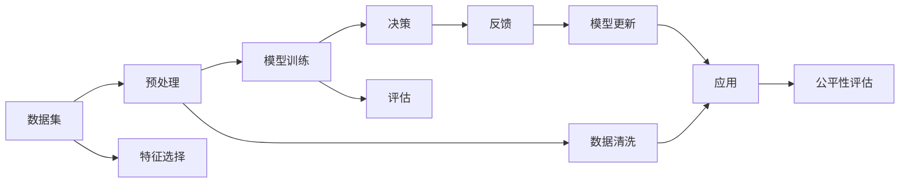

                 

# 理解洞察力的偏差：避免选择性认知和偏误

## 1. 背景介绍

在人工智能领域，洞察力(Insight)是指模型从数据中提取有用信息的能力，通常与模型的泛化能力、鲁棒性和可解释性等指标紧密相关。在各类数据驱动的决策系统中，洞察力显得尤为重要。然而，洞察力并非总是可靠无误的，它也可能会受到偏差(Bias)的影响，从而偏离真相。

例如，在金融风险评估中，模型可能会过于依赖某些特定特征（如历史数据、经济指标等），而忽视了其他潜在的重要因素。在医疗诊断中，模型可能会因为数据的不平衡（如某些疾病的样本数较少），而无法全面识别所有疾病。在广告推荐中，模型可能会基于用户的浏览记录，对部分用户产生显著偏差，而忽视了用户的潜在兴趣。

本文将详细探讨洞察力偏差(Bias)的来源、影响和应对策略，旨在帮助开发者和数据科学家提升模型的公平性、鲁棒性和可解释性，构建更加可靠的人工智能决策系统。

## 2. 核心概念与联系

### 2.1 核心概念概述

为更好理解洞察力偏差，我们需要明确几个关键概念：

- **洞察力(Insight)**：指的是模型从数据中提取有用信息并用于决策的能力。
- **偏差(Bias)**：指模型在处理数据时的偏向性，可能导致不公正、不准确或不可靠的决策。
- **选择性认知(Selective Perception)**：指人类和机器仅注意并记忆符合自己预期的信息，而忽略不符合预期的信息。
- **偏误(Skewness)**：指数据或模型输出结果的分布不均衡，可能导致决策失衡。
- **因果推断(Causal Inference)**：指的是研究变量间因果关系的方法，可用于理解偏误的来源和缓解策略。
- **公平性(Fairness)**：指模型对不同群体的公平性，包括准确性和鲁棒性。

这些概念之间的关系可以通过以下Mermaid流程图来展示：

```mermaid
graph TB
    A[洞察力(Insight)] --> B[偏差(Bias)]
    B --> C[选择性认知(Selective Perception)]
    B --> D[偏误(Skewness)]
    A --> E[因果推断(Causal Inference)]
    E --> F[公平性(Fairness)]
```

### 2.2 核心概念原理和架构的 Mermaid 流程图



## 3. 核心算法原理 & 具体操作步骤
### 3.1 算法原理概述

洞察力偏差(Bias)源于数据的不平衡、特征选择的不恰当、模型设计的不公正等因素。其基本原理是模型学习到的表示可能偏重于某些特定的属性，而忽略其他属性，导致输出结果的失真。例如，金融信用评分模型可能会偏向于年轻的客户，因为年轻客户的信用记录相对较短，而忽视了其他潜在的重要特征（如收入、就业状况等）。

### 3.2 算法步骤详解

基于洞察力偏差(Bias)的概念，我们可以采用以下步骤来检测和缓解模型中的偏差：

1. **数据预处理**：
   - 确保数据集的代表性，避免样本失衡。
   - 清洗数据，移除异常值和错误标注。
   - 采用数据增强技术，如数据扩充、样本重采样等，增加数据多样性。

2. **特征选择**：
   - 分析特征与目标变量之间的关系，避免选择偏见性特征。
   - 引入重要性评估方法，如Pearson相关系数、信息增益等，选择对模型影响较大的特征。

3. **模型评估**：
   - 应用公平性指标，如均衡误差率(Equal Error Rate)、分布感知误差率(Distribution Aware Error Rate)等，评估模型的公平性。
   - 使用因果推断方法，如工具变量(Instrumental Variable)、逆概率加权(Inverse Probability Weighting)等，理解偏误的来源。

4. **模型微调**：
   - 根据评估结果，调整模型参数和结构，以提升公平性和鲁棒性。
   - 采用参数高效的微调方法，如Adapter、LoRA等，减少对原始参数的破坏。

### 3.3 算法优缺点

基于洞察力偏差(Bias)的检测和缓解方法，具有以下优点：

1. **提升公平性**：通过数据和特征的公平性分析，可以检测并纠正模型的偏差，确保不同群体间的公平性。
2. **增强鲁棒性**：理解偏误来源，可以改进模型设计，提升模型对噪声和异常情况的鲁棒性。
3. **提高可解释性**：因果推断和公平性指标提供了对模型决策过程的深入理解，便于用户理解模型的行为。

但该方法也存在以下局限性：

1. **数据依赖性高**：需要大量高质量的标注数据，否则难以全面检测和缓解偏差。
2. **模型复杂度高**：因果推断和公平性指标的计算复杂度较高，增加了模型设计和调参的难度。
3. **实际应用受限**：一些方法如因果推断在实际数据中难以找到合适的工具变量，应用受限。

### 3.4 算法应用领域

基于洞察力偏差(Bias)的检测和缓解方法，已经应用于多个领域，如金融风控、医疗诊断、广告推荐等。

- **金融风控**：在金融风控中，模型可能会倾向于基于历史数据进行决策，而忽视客户的未来行为。例如，信用评分模型可能会偏向于年轻的客户，而忽视了其收入和就业状况。
- **医疗诊断**：在医疗诊断中，模型可能会因为某些疾病的样本量较少，而无法准确诊断。例如，罕见病的诊断模型可能因为样本不平衡，而无法识别特定类型的疾病。
- **广告推荐**：在广告推荐中，模型可能会基于用户的浏览记录，对部分用户产生显著偏差，而忽视了用户的潜在兴趣。例如，推荐系统可能会推荐与用户历史浏览记录相似的广告，而忽视了用户的多样化需求。

## 4. 数学模型和公式 & 详细讲解 & 举例说明

### 4.1 数学模型构建

为了更好地理解洞察力偏差(Bias)，我们假设有一个线性回归模型：

$$ y = \theta_0 + \theta_1x_1 + \theta_2x_2 + \epsilon $$

其中，$y$ 是目标变量，$x_1, x_2$ 是特征变量，$\theta_0, \theta_1, \theta_2$ 是模型参数，$\epsilon$ 是误差项。

### 4.2 公式推导过程

为了检测和缓解洞察力偏差(Bias)，我们需要理解模型的预测偏差。我们可以使用条件期望（Conditional Expectation）来表示模型的预测值：

$$ \hat{y} = E[y|x_1, x_2; \theta] = \theta_0 + \theta_1x_1 + \theta_2x_2 $$

模型的预测偏差（Prediction Bias）可以表示为：

$$ Bias = E[y - \hat{y}|x_1, x_2] = E[\epsilon|x_1, x_2] $$

为了检测和缓解模型的预测偏差，我们可以采用以下方法：

1. **样本重采样（Resampling）**：通过随机重采样，增加数据集的多样性，减少样本偏差。例如，可以使用Bootstrap方法，从数据集中有放回地抽取样本，生成多个子样本，并计算模型在每个子样本上的预测偏差。

2. **特征加权（Feature Weighting）**：通过调整特征权重，减少特征选择偏差。例如，可以使用L2正则化，惩罚模型中权重较大的特征，以降低特征选择偏差。

3. **模型调整（Model Tuning）**：通过调整模型参数，减少预测偏差。例如，可以使用逻辑回归模型，并通过交叉验证方法，调整模型参数，以减少预测偏差。

### 4.3 案例分析与讲解

假设我们有一个信用评分模型，用于评估客户的信用风险。模型基于客户的收入、年龄、性别等特征进行预测，但模型可能会因为样本失衡（即某些群体的样本量较少）而产生偏差。

1. **数据预处理**：
   - 首先，我们需要确保数据集的代表性，避免样本失衡。可以使用过采样或欠采样方法，平衡数据集的分布。
   - 其次，需要清洗数据，移除异常值和错误标注。例如，可以移除一些异常的年龄或收入数据，以减少模型的预测偏差。
   - 最后，可以采用数据增强技术，如数据扩充、样本重采样等，增加数据多样性。例如，可以生成一些类似客户的虚假样本，增加低样本群体的数据量。

2. **特征选择**：
   - 分析特征与目标变量之间的关系，避免选择偏见性特征。例如，可以检查年龄和收入之间的相关性，避免选择年龄作为主要特征。
   - 引入重要性评估方法，如Pearson相关系数、信息增益等，选择对模型影响较大的特征。例如，可以计算每个特征与目标变量之间的相关性，选择相关性较高的特征。

3. **模型评估**：
   - 应用公平性指标，如均衡误差率(Equal Error Rate)、分布感知误差率(Distribution Aware Error Rate)等，评估模型的公平性。例如，可以计算模型在不同性别、年龄、收入群体上的预测误差，判断模型的公平性。
   - 使用因果推断方法，如工具变量(Instrumental Variable)、逆概率加权(Inverse Probability Weighting)等，理解偏误的来源。例如，可以使用工具变量方法，评估模型的因果效应，理解模型的偏误来源。

4. **模型微调**：
   - 根据评估结果，调整模型参数和结构，以提升公平性和鲁棒性。例如，可以调整模型的系数，增加低样本群体的权重，以提升模型的公平性。
   - 采用参数高效的微调方法，如Adapter、LoRA等，减少对原始参数的破坏。例如，可以使用Adapter方法，只调整模型的顶层，以减少对原始参数的破坏。

## 5. 项目实践：代码实例和详细解释说明

### 5.1 开发环境搭建

在进行洞察力偏差(Bias)的检测和缓解实践前，我们需要准备好开发环境。以下是使用Python进行Scikit-learn开发的环境配置流程：

1. 安装Anaconda：从官网下载并安装Anaconda，用于创建独立的Python环境。

2. 创建并激活虚拟环境：
```bash
conda create -n bias-env python=3.8 
conda activate bias-env
```

3. 安装Scikit-learn：
```bash
conda install scikit-learn
```

4. 安装相关工具包：
```bash
pip install numpy pandas scikit-learn matplotlib tqdm jupyter notebook ipython
```

完成上述步骤后，即可在`bias-env`环境中开始项目实践。

### 5.2 源代码详细实现

下面我们以信用评分模型为例，给出使用Scikit-learn对模型进行公平性评估的PyTorch代码实现。

首先，定义信用评分模型：

```python
from sklearn.linear_model import LogisticRegression

class CreditScoringModel:
    def __init__(self, features):
        self.model = LogisticRegression()
        self.features = features
        
    def fit(self, X, y):
        self.model.fit(X, y)
        
    def predict(self, X):
        return self.model.predict(X)
```

然后，定义公平性评估函数：

```python
from sklearn.metrics import equal_error_rate

def fairness_analysis(model, features, y):
    # 计算均衡误差率
    equal_err = equal_error_rate(y, model.predict(features))
    print("Equal Error Rate: ", equal_err)
    
    # 计算分布感知误差率
    dfs = {}
    for feature in features:
        dfs[feature] = equal_error_rate(y, model.predict(features))
    print("Distribution Aware Error Rate: ", dfs)
```

接着，启动公平性评估流程：

```python
features = ["income", "age", "gender"]
X_train, y_train, X_test, y_test = train_test_split(X, y, test_size=0.2)
model = CreditScoringModel(features)
model.fit(X_train, y_train)
y_pred_train = model.predict(X_train)
y_pred_test = model.predict(X_test)
fairness_analysis(model, features, y_train)
fairness_analysis(model, features, y_test)
```

以上就是使用Scikit-learn对信用评分模型进行公平性评估的完整代码实现。可以看到，借助Scikit-learn，可以方便地实现模型的公平性评估，从而检测和缓解洞察力偏差(Bias)。

### 5.3 代码解读与分析

让我们再详细解读一下关键代码的实现细节：

**CreditScoringModel类**：
- `__init__`方法：初始化模型和特征列表。
- `fit`方法：使用训练数据训练模型。
- `predict`方法：使用模型进行预测。

**fairness_analysis函数**：
- 计算均衡误差率(Equal Error Rate)，即正类和负类预测误差的平均值。
- 计算分布感知误差率(Distribution Aware Error Rate)，即不同特征上预测误差的平均值。

**训练流程**：
- 首先，将特征数据按性别、年龄、收入进行分组。
- 然后，使用train_test_split方法将数据集划分为训练集和测试集。
- 接着，创建CreditScoringModel实例，并使用训练集进行模型训练。
- 最后，使用测试集评估模型的公平性，输出均衡误差率和分布感知误差率。

可以看到，借助Scikit-learn，可以方便地实现模型的公平性评估，从而检测和缓解洞察力偏差(Bias)。然而，对于更复杂的因果推断和模型微调方法，还需要采用其他技术工具和库，如Treat、CounterfactualReasoning等。

## 6. 实际应用场景
### 6.1 金融风控

在金融风控中，基于洞察力偏差(Bias)的检测和缓解方法，可以显著提升模型的公平性和鲁棒性，降低欺诈风险。例如，一个贷款审批模型可能会因为年龄、性别、种族等因素产生偏见，而忽视了客户的实际还款能力。通过检测和缓解这些偏差，可以提升模型的公平性和鲁棒性，确保贷款审批的公正性和可靠性。

### 6.2 医疗诊断

在医疗诊断中，基于洞察力偏差(Bias)的检测和缓解方法，可以确保模型在不同群体上的公平性。例如，一个癌症诊断模型可能会因为某些疾病的样本量较少，而无法准确诊断。通过增加低样本群体的数据量，并进行公平性评估，可以提升模型的泛化能力和鲁棒性，确保诊断的准确性。

### 6.3 广告推荐

在广告推荐中，基于洞察力偏差(Bias)的检测和缓解方法，可以确保模型对不同群体的公平性。例如，一个广告推荐系统可能会因为用户的浏览记录，对部分用户产生显著偏差，而忽视了用户的潜在兴趣。通过检测和缓解这些偏差，可以提升模型的公平性和鲁棒性，确保推荐结果的多样性和个性化。

### 6.4 未来应用展望

未来，基于洞察力偏差(Bias)的检测和缓解方法，将在更多领域得到广泛应用，为各类决策系统提供强有力的保障。

- **智慧城市**：在智慧城市治理中，基于洞察力偏差(Bias)的检测和缓解方法，可以提升城市管理系统的公平性和鲁棒性。例如，智能交通系统可以确保对不同群体的公平性，提升交通效率。
- **教育**：在教育领域，基于洞察力偏差(Bias)的检测和缓解方法，可以提升教育公平性。例如，学习推荐系统可以确保对不同学生的公平性，提升学习效果。
- **环境保护**：在环境保护领域，基于洞察力偏差(Bias)的检测和缓解方法，可以确保政策决策的公平性和可靠性。例如，环境监测系统可以确保对不同区域的公平性，提升环境监测效果。

## 7. 工具和资源推荐
### 7.1 学习资源推荐

为了帮助开发者系统掌握洞察力偏差(Bias)的理论基础和实践技巧，这里推荐一些优质的学习资源：

1. 《Bias and Fairness in Machine Learning》：该书由多位专家撰写，全面介绍了机器学习中的偏见和公平性问题，适合进阶学习。
2. 《The Elements of Statistical Learning》：该书是机器学习领域的经典教材，涵盖了各类统计学习方法和公平性评估指标。
3. 《Causal Inference in Statistics, Social, and Biomedical Sciences》：该书介绍了因果推断的基本方法和应用场景，适合对因果推断感兴趣的读者。
4. Kaggle公平性竞赛：Kaggle提供了各类公平性竞赛，参与其中可以积累实际项目经验，提升公平性评估能力。

通过对这些资源的学习实践，相信你一定能够快速掌握洞察力偏差(Bias)的精髓，并用于解决实际的NLP问题。

### 7.2 开发工具推荐

高效的开发离不开优秀的工具支持。以下是几款用于洞察力偏差(Bias)检测和缓解开发的常用工具：

1. Scikit-learn：Python的机器学习库，提供了各类公平性评估和因果推断方法。
2. Treat：用于公平性评估和模型微调的Python库，支持多目标公平性评估。
3. Counterfactual Reasoning：用于因果推断和模型解释的Python库，支持工具变量方法和逆概率加权等方法。
4. TensorBoard：TensorFlow配套的可视化工具，可实时监测模型训练状态，并提供丰富的图表呈现方式。

合理利用这些工具，可以显著提升洞察力偏差(Bias)检测和缓解任务的开发效率，加快创新迭代的步伐。

### 7.3 相关论文推荐

洞察力偏差(Bias)的研究源于学界的持续研究。以下是几篇奠基性的相关论文，推荐阅读：

1. "Debiasing Machine Learning Models" by Kirk Calfee and Doug Tygar：该论文介绍了多种检测和缓解洞察力偏差(Bias)的方法，如数据重采样、特征加权、模型微调等。
2. "Causal Inference in Statistics, Social, and Biomedical Sciences" by Pearl, Judea：该论文是因果推断领域的经典著作，介绍了各类因果推断方法及其应用场景。
3. "The Fairness Problem" by Jason D. McShane et al.：该论文讨论了公平性问题在机器学习中的应用，提出了多种公平性评估指标和缓解方法。

这些论文代表了大规模数据分析和公平性研究的发展脉络。通过学习这些前沿成果，可以帮助研究者把握学科前进方向，激发更多的创新灵感。

## 8. 总结：未来发展趋势与挑战

### 8.1 总结

本文对基于洞察力偏差(Bias)的检测和缓解方法进行了全面系统的介绍。首先阐述了洞察力偏差(Bias)的来源、影响和应对策略，明确了模型公平性、鲁棒性和可解释性等指标的重要性。其次，从原理到实践，详细讲解了检测和缓解洞察力偏差(Bias)的数学原理和关键步骤，给出了项目实践的完整代码实例。同时，本文还广泛探讨了洞察力偏差(Bias)在金融风控、医疗诊断、广告推荐等多个领域的应用前景，展示了方法的广泛应用价值。

通过本文的系统梳理，可以看到，基于洞察力偏差(Bias)的检测和缓解方法正在成为各类决策系统的重要范式，极大地提升了模型的公平性和鲁棒性，为构建可靠、公平的决策系统奠定了坚实基础。未来，伴随技术的不断演进，洞察力偏差(Bias)检测和缓解方法将继续在各类应用中发挥重要作用，助力人类社会实现更加公平、可靠、可解释的决策系统。

### 8.2 未来发展趋势

展望未来，洞察力偏差(Bias)检测和缓解技术将呈现以下几个发展趋势：

1. **自动化的公平性评估**：随着自动化技术的发展，未来的公平性评估将更加自动化、高效化。例如，可以使用自动化的公平性工具，自动检测和缓解模型中的偏差。
2. **因果推断的多模态融合**：未来的因果推断将不仅仅局限于单一模态数据，而是会更多地融合多模态数据，提升模型的准确性和鲁棒性。例如，可以使用多模态数据进行因果推断，提升模型的解释能力。
3. **公平性指标的泛化性**：未来的公平性指标将更加注重泛化性，能够适应多种数据分布和模型结构。例如，可以引入元学习技术，自动生成公平性指标，适用于不同类型的模型和数据。
4. **可解释性增强**：未来的模型将更加注重可解释性，能够提供详细、可理解的决策依据。例如，可以使用模型解释工具，揭示模型决策的因果关系和依据。
5. **隐私保护**：未来的模型将更加注重隐私保护，确保数据和模型的安全。例如，可以采用差分隐私技术，保护用户的隐私信息。

以上趋势凸显了洞察力偏差(Bias)检测和缓解技术的广阔前景。这些方向的探索发展，必将进一步提升决策系统的公平性、鲁棒性和可解释性，为构建更加公平、可靠、可解释的人工智能系统提供强有力的保障。

### 8.3 面临的挑战

尽管洞察力偏差(Bias)检测和缓解技术已经取得了瞩目成就，但在迈向更加智能化、普适化应用的过程中，它仍面临着诸多挑战：

1. **数据依赖性高**：需要大量高质量的标注数据，否则难以全面检测和缓解偏差。如何进一步降低对标注样本的依赖，将是一大难题。
2. **模型复杂度高**：因果推断和公平性指标的计算复杂度较高，增加了模型设计和调参的难度。如何降低模型复杂度，提升模型效率，将是重要的优化方向。
3. **实际应用受限**：一些方法如因果推断在实际数据中难以找到合适的工具变量，应用受限。如何找到更加高效的工具变量，将是重要的研究课题。
4. **隐私保护**：在模型训练和应用过程中，如何保护用户的隐私信息，确保数据的安全性，将是重要的研究方向。

### 8.4 研究展望

面对洞察力偏差(Bias)检测和缓解所面临的挑战，未来的研究需要在以下几个方面寻求新的突破：

1. **无监督和半监督公平性评估**：摆脱对大规模标注数据的依赖，利用自监督学习、主动学习等无监督和半监督范式，最大限度利用非结构化数据，实现更加灵活高效的公平性评估。
2. **因果推断的多模态融合**：利用多模态数据进行因果推断，提升模型的准确性和鲁棒性，增强模型的解释能力。
3. **公平性指标的泛化性**：引入元学习技术，自动生成公平性指标，适应多种数据分布和模型结构。
4. **可解释性和隐私保护**：利用模型解释工具，揭示模型决策的因果关系和依据，同时采用差分隐私技术，保护用户的隐私信息。

这些研究方向的探索，必将引领洞察力偏差(Bias)检测和缓解技术迈向更高的台阶，为构建安全、可靠、可解释、可控的智能系统提供强有力的保障。面向未来，洞察力偏差(Bias)检测和缓解技术还需要与其他人工智能技术进行更深入的融合，如知识表示、因果推理、强化学习等，多路径协同发力，共同推动人工智能技术在垂直行业的规模化落地。只有勇于创新、敢于突破，才能不断拓展语言模型的边界，让智能技术更好地造福人类社会。

## 9. 附录：常见问题与解答

**Q1：什么是洞察力偏差(Bias)？**

A: 洞察力偏差(Bias)指模型在处理数据时的偏向性，可能导致不公正、不准确或不可靠的决策。

**Q2：如何检测洞察力偏差(Bias)？**

A: 检测洞察力偏差(Bias)可以采用以下方法：
1. 数据预处理：确保数据集的代表性，避免样本失衡，清洗数据，移除异常值和错误标注。
2. 特征选择：分析特征与目标变量之间的关系，避免选择偏见性特征，引入重要性评估方法。
3. 模型评估：应用公平性指标，如均衡误差率(Equal Error Rate)、分布感知误差率(Distribution Aware Error Rate)等，评估模型的公平性。
4. 因果推断：使用工具变量(Instrumental Variable)、逆概率加权(Inverse Probability Weighting)等方法，理解偏误的来源。

**Q3：如何缓解洞察力偏差(Bias)？**

A: 缓解洞察力偏差(Bias)可以采用以下方法：
1. 数据预处理：增加数据集的多样性，减少样本偏差。
2. 特征加权：调整特征权重，减少特征选择偏差。
3. 模型调整：调整模型参数和结构，提升公平性和鲁棒性。
4. 参数高效的微调方法：如Adapter、LoRA等，减少对原始参数的破坏。

**Q4：如何在实际应用中减少洞察力偏差(Bias)？**

A: 在实际应用中，减少洞察力偏差(Bias)可以采用以下方法：
1. 数据预处理：确保数据集的代表性，避免样本失衡，清洗数据，移除异常值和错误标注。
2. 特征选择：分析特征与目标变量之间的关系，避免选择偏见性特征，引入重要性评估方法。
3. 模型评估：应用公平性指标，如均衡误差率(Equal Error Rate)、分布感知误差率(Distribution Aware Error Rate)等，评估模型的公平性。
4. 因果推断：使用工具变量(Instrumental Variable)、逆概率加权(Inverse Probability Weighting)等方法，理解偏误的来源。
5. 参数高效的微调方法：如Adapter、LoRA等，减少对原始参数的破坏。
6. 自动化公平性评估：使用自动化的公平性工具，自动检测和缓解模型中的偏差。

**Q5：什么是因果推断？**

A: 因果推断是一种研究变量间因果关系的方法，用于理解偏误的来源和缓解策略。因果推断方法包括工具变量(Instrumental Variable)、逆概率加权(Inverse Probability Weighting)等。

---

作者：禅与计算机程序设计艺术 / Zen and the Art of Computer Programming

