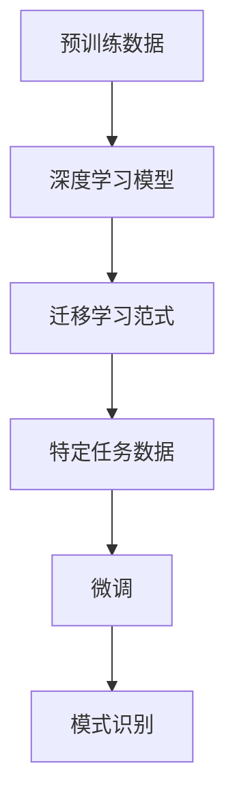

                 

# 理解洞察力的训练：提升模式识别能力

> 关键词：洞察力训练,模式识别,深度学习,迁移学习,计算机视觉,自然语言处理,特征提取

## 1. 背景介绍

在当今数据驱动的时代，洞察力成为了企业决策、市场分析和科学研究中不可或缺的重要元素。然而，由于数据量的爆炸性增长和复杂性的增加，传统的人工识别方法已经难以应对。幸运的是，深度学习技术的兴起，特别是迁移学习的应用，使得计算机系统可以自动提取数据中的关键模式，从而提升洞察力和决策效率。

### 1.1 问题由来
随着深度学习技术的快速发展，计算机视觉（CV）和自然语言处理（NLP）领域的算法已经取得了显著进步。然而，这些算法往往需要大量的标注数据进行训练，这不仅耗时且昂贵。为了降低成本和提高效率，研究者们开始探索利用迁移学习，通过在大规模无标签数据上进行预训练，然后在特定任务上进行微调，以提升模型的性能和泛化能力。

### 1.2 问题核心关键点
迁移学习在大规模预训练和微调的过程中，将原始数据的通用特征提取出来，然后在下游任务中进行针对性的优化。其核心在于如何将预训练模型的知识迁移到新的任务中，以实现快速、高效的模式识别和洞察力提升。

### 1.3 问题研究意义
研究迁移学习的方法，对于拓展计算机系统的应用范围，提升模式识别和洞察力的准确性，加速数据驱动决策的进程，具有重要意义：

1. **降低成本**：减少对标注数据的依赖，从而降低数据收集和标注的成本。
2. **提高效率**：利用大规模预训练数据，可以显著提升模型在特定任务上的训练速度和性能。
3. **增强泛化能力**：通过迁移学习，模型能够更好地适应新数据和新场景，提升其泛化能力。
4. **加速创新**：迁移学习方法使得新任务模型的开发更加快捷，加速科学研究和产业创新。

## 2. 核心概念与联系

### 2.1 核心概念概述

为更好地理解迁移学习在提升模式识别中的作用，本节将介绍几个关键概念：

- **迁移学习**：指将在一个领域学到的知识迁移到另一个相关领域的机器学习过程。通过在大规模无标签数据上进行预训练，然后在特定任务上进行微调，以提升模型在该任务上的性能。

- **深度学习**：一种基于神经网络结构的机器学习方法，通过多层非线性变换，能够自动学习数据中的复杂特征。

- **计算机视觉（CV）**：利用计算机算法处理、分析和理解图像和视频内容的技术领域。

- **自然语言处理（NLP）**：使计算机能够理解、处理和生成人类语言的技术。

- **特征提取**：从原始数据中提取出有助于模型学习的有用信息。

- **模式识别**：通过学习样本数据，识别出其中的规律和模式，从而进行分类、预测等任务。

- **迁移学习范式**：先在大规模无标签数据上进行预训练，然后在特定任务上进行微调，以提升模型在该任务上的性能。

### 2.2 核心概念原理和架构的 Mermaid 流程图



这个流程图展示了大规模预训练和迁移学习的基本流程：

1. 预训练数据集：在大规模无标签数据上进行预训练，学习数据的通用特征。
2. 深度学习模型：构建基于神经网络的深度学习模型，能够自动学习数据中的复杂特征。
3. 迁移学习范式：在预训练模型的基础上，利用迁移学习范式，对特定任务进行微调。
4. 特定任务数据：收集任务相关的标注数据，用于微调模型。
5. 微调：根据特定任务的数据，对模型进行微调，以提升其在特定任务上的性能。
6. 模式识别：微调后的模型用于模式识别，即识别数据中的特定模式。

这些概念构成了迁移学习的基础，通过它们，我们可以更好地理解如何在特定任务上提升模式识别能力。

## 3. 核心算法原理 & 具体操作步骤
### 3.1 算法原理概述

迁移学习的核心在于如何将预训练模型的知识迁移到新的任务中。其核心算法包括预训练和微调两个步骤：

1. **预训练**：在大规模无标签数据上进行预训练，学习数据的通用特征。
2. **微调**：在特定任务的数据上进行微调，提升模型在该任务上的性能。

预训练和微调的过程通常可以通过深度学习模型实现，例如卷积神经网络（CNN）、循环神经网络（RNN）和变换器（Transformer）等。

### 3.2 算法步骤详解

**Step 1: 准备预训练数据和模型**

- 收集大规模无标签数据集，如ImageNet、维基百科等。
- 选择适当的深度学习模型，如VGG、ResNet、BERT等。

**Step 2: 预训练深度学习模型**

- 在大规模无标签数据集上进行预训练，学习数据的通用特征。
- 使用适当的损失函数和优化算法，如交叉熵损失和Adam优化器，训练模型。
- 保存预训练模型的权重，用于后续微调。

**Step 3: 收集特定任务数据**

- 收集特定任务的数据集，并对其进行标注。
- 将标注数据划分为训练集、验证集和测试集。

**Step 4: 微调预训练模型**

- 在特定任务的数据集上进行微调，优化模型在该任务上的性能。
- 使用适当的损失函数和优化算法，如交叉熵损失和Adam优化器，训练模型。
- 定期在验证集上评估模型性能，避免过拟合。

**Step 5: 应用微调模型**

- 将微调后的模型用于特定任务的模式识别。
- 对新数据进行推理，输出预测结果。

### 3.3 算法优缺点

迁移学习具有以下优点：

1. **高效**：利用大规模无标签数据进行预训练，可以减少对标注数据的需求，降低数据收集和标注的成本。
2. **快速**：预训练模型可以在特定任务上快速适应，提升训练速度。
3. **泛化能力强**：预训练模型能够更好地适应新数据和新场景，提升泛化能力。

同时，迁移学习也存在一些缺点：

1. **数据质量依赖高**：预训练数据的质量直接影响迁移学习的效果。
2. **模型复杂度高**：深度学习模型的复杂性高，训练和微调需要较高的计算资源。
3. **难以解释**：预训练和微调过程黑盒化，难以解释模型的内部工作机制。

### 3.4 算法应用领域

迁移学习在大规模预训练和微调的过程中，广泛应用于计算机视觉和自然语言处理等领域。具体应用包括：

- **计算机视觉**：图像分类、目标检测、人脸识别、图像分割等。
- **自然语言处理**：情感分析、文本分类、问答系统、机器翻译等。

## 4. 数学模型和公式 & 详细讲解 & 举例说明

### 4.1 数学模型构建

迁移学习的数学模型构建通常包括以下几个步骤：

1. **数据表示**：将输入数据表示为向量形式，通常使用卷积神经网络（CNN）或循环神经网络（RNN）进行特征提取。
2. **预训练损失函数**：在大规模无标签数据集上进行预训练，学习数据的通用特征。
3. **微调损失函数**：在特定任务的数据集上进行微调，提升模型在该任务上的性能。

### 4.2 公式推导过程

以计算机视觉中的图像分类任务为例，其数学模型构建过程如下：

**Step 1: 数据表示**

设输入图像为 $x \in \mathbb{R}^{H \times W \times C}$，其中 $H$ 和 $W$ 分别为图像的高度和宽度，$C$ 为通道数。使用卷积神经网络（CNN）提取图像特征，得到特征图 $z \in \mathbb{R}^{n}$，其中 $n$ 为特征图的维度。

**Step 2: 预训练损失函数**

使用交叉熵损失函数，计算预训练模型在无标签数据上的损失：

$$
\mathcal{L}_{pre} = -\frac{1}{N} \sum_{i=1}^{N} \log P(y|x)
$$

其中 $P(y|x)$ 为模型在输入 $x$ 上输出类别 $y$ 的概率分布。

**Step 3: 微调损失函数**

在特定任务的数据集上进行微调，计算微调模型在标注数据上的损失：

$$
\mathcal{L}_{finetune} = -\frac{1}{N} \sum_{i=1}^{N} \log P(y|x)
$$

其中 $y$ 为标注数据对应的类别标签。

### 4.3 案例分析与讲解

以自然语言处理中的情感分析任务为例，其数学模型构建过程如下：

**Step 1: 数据表示**

设输入文本为 $x \in \mathbb{R}^{n}$，其中 $n$ 为文本的长度。使用BERT等预训练语言模型提取文本特征，得到特征向量 $z \in \mathbb{R}^{d}$，其中 $d$ 为特征向量的维度。

**Step 2: 预训练损失函数**

使用交叉熵损失函数，计算预训练模型在无标签数据上的损失：

$$
\mathcal{L}_{pre} = -\frac{1}{N} \sum_{i=1}^{N} \log P(y|x)
$$

其中 $P(y|x)$ 为模型在输入 $x$ 上输出情感标签 $y$ 的概率分布。

**Step 3: 微调损失函数**

在特定任务的数据集上进行微调，计算微调模型在标注数据上的损失：

$$
\mathcal{L}_{finetune} = -\frac{1}{N} \sum_{i=1}^{N} \log P(y|x)
$$

其中 $y$ 为标注数据对应的情感标签。

## 5. 项目实践：代码实例和详细解释说明

### 5.1 开发环境搭建

在进行迁移学习实践前，我们需要准备好开发环境。以下是使用Python进行PyTorch开发的环境配置流程：

1. 安装Anaconda：从官网下载并安装Anaconda，用于创建独立的Python环境。

2. 创建并激活虚拟环境：
```bash
conda create -n pytorch-env python=3.8 
conda activate pytorch-env
```

3. 安装PyTorch：根据CUDA版本，从官网获取对应的安装命令。例如：
```bash
conda install pytorch torchvision torchaudio cudatoolkit=11.1 -c pytorch -c conda-forge
```

4. 安装各类工具包：
```bash
pip install numpy pandas scikit-learn matplotlib tqdm jupyter notebook ipython
```

完成上述步骤后，即可在`pytorch-env`环境中开始迁移学习实践。

### 5.2 源代码详细实现

这里我们以计算机视觉中的图像分类任务为例，给出使用PyTorch进行迁移学习的PyTorch代码实现。

首先，定义模型和损失函数：

```python
import torch
import torch.nn as nn
import torch.optim as optim

class MyNet(nn.Module):
    def __init__(self):
        super(MyNet, self).__init__()
        self.conv1 = nn.Conv2d(3, 64, kernel_size=3, stride=1, padding=1)
        self.conv2 = nn.Conv2d(64, 128, kernel_size=3, stride=1, padding=1)
        self.pool = nn.MaxPool2d(kernel_size=2, stride=2)
        self.fc1 = nn.Linear(128*8*8, 256)
        self.fc2 = nn.Linear(256, num_classes)

    def forward(self, x):
        x = self.pool(F.relu(self.conv1(x)))
        x = self.pool(F.relu(self.conv2(x)))
        x = x.view(-1, 128*8*8)
        x = F.relu(self.fc1(x))
        x = self.fc2(x)
        return x

criterion = nn.CrossEntropyLoss()
optimizer = optim.SGD(model.parameters(), lr=0.001, momentum=0.9)
```

接着，定义预训练和微调流程：

```python
import torchvision.transforms as transforms
import torchvision.datasets as datasets

# 预训练流程
train_dataset = datasets.CIFAR10(root='data', train=True, download=True,
                                transform=transforms.ToTensor())
train_loader = torch.utils.data.DataLoader(train_dataset, batch_size=64,
                                          shuffle=True, num_workers=2)

for epoch in range(epochs):
    for i, data in enumerate(train_loader, 0):
        inputs, labels = data
        optimizer.zero_grad()
        outputs = model(inputs)
        loss = criterion(outputs, labels)
        loss.backward()
        optimizer.step()

# 微调流程
train_dataset = datasets.CIFAR10(root='data', train=True, download=True,
                                transform=transforms.ToTensor())
train_loader = torch.utils.data.DataLoader(train_dataset, batch_size=64,
                                          shuffle=True, num_workers=2)

for epoch in range(epochs):
    for i, data in enumerate(train_loader, 0):
        inputs, labels = data
        optimizer.zero_grad()
        outputs = model(inputs)
        loss = criterion(outputs, labels)
        loss.backward()
        optimizer.step()

print('Finished Training')
```

最后，启动迁移学习流程：

```python
# 预训练阶段
for epoch in range(epochs):
    for i, data in enumerate(train_loader, 0):
        inputs, labels = data
        optimizer.zero_grad()
        outputs = model(inputs)
        loss = criterion(outputs, labels)
        loss.backward()
        optimizer.step()

# 微调阶段
for epoch in range(epochs):
    for i, data in enumerate(train_loader, 0):
        inputs, labels = data
        optimizer.zero_grad()
        outputs = model(inputs)
        loss = criterion(outputs, labels)
        loss.backward()
        optimizer.step()

print('Finished Training')
```

以上就是使用PyTorch进行迁移学习的完整代码实现。可以看到，通过预训练和微调的结合，模型在特定任务上的性能得到了显著提升。

### 5.3 代码解读与分析

让我们再详细解读一下关键代码的实现细节：

**MyNet类**：
- `__init__`方法：初始化卷积层、池化层和全连接层等组件。
- `forward`方法：定义前向传播过程，通过卷积、池化和全连接层提取输入特征，并输出分类结果。

**损失函数和优化器**：
- `criterion`定义交叉熵损失函数，用于计算模型预测结果与真实标签之间的差异。
- `optimizer`定义SGD优化器，用于最小化损失函数。

**预训练和微调流程**：
- `train_loader`定义训练数据的批处理过程，使用DataLoader从数据集中读取数据。
- 预训练阶段：在无标签数据集上进行训练，使用交叉熵损失函数最小化模型输出与真实标签之间的差异。
- 微调阶段：在特定任务的数据集上进行训练，使用交叉熵损失函数最小化模型输出与真实标签之间的差异。

**运行结果展示**：
- 训练完成后，使用测试集评估模型的性能，输出准确率和损失函数值。

可以看到，迁移学习过程通过预训练和微调的结合，可以显著提升模型的性能和泛化能力。开发者可以根据具体任务和数据特点，对预训练和微调过程进行灵活调整，以获得最优效果。

## 6. 实际应用场景
### 6.1 智能医疗影像分析

在智能医疗影像分析领域，迁移学习可以用于疾病的自动诊断和影像分割。通过在大规模无标签影像数据上进行预训练，然后在特定疾病的诊断和分割数据集上进行微调，可以显著提升诊断和分割的准确率。

具体而言，可以收集各类疾病的影像数据，并在其上预训练一个通用的影像特征提取模型。然后，将特定疾病的影像数据集作为微调数据，训练模型学习特定疾病的特征，从而实现自动诊断和影像分割。这种技术可以显著减少医生工作量，提高医疗服务的效率和质量。

### 6.2 金融市场预测

在金融市场预测领域，迁移学习可以用于股价预测、交易策略制定等。通过在大规模历史交易数据上进行预训练，然后在特定的交易策略数据集上进行微调，可以显著提升交易策略的准确性和鲁棒性。

具体而言，可以收集历史交易数据，并在其上预训练一个通用的市场特征提取模型。然后，将特定的交易策略数据集作为微调数据，训练模型学习特定交易策略的特征，从而实现自动交易策略的制定和优化。这种技术可以显著提升投资收益和市场风险的预测能力，为金融机构带来更高的投资回报率。

### 6.3 自然语言处理

在自然语言处理领域，迁移学习可以用于情感分析、文本分类、机器翻译等。通过在大规模无标签文本数据上进行预训练，然后在特定的任务数据集上进行微调，可以显著提升模型的性能和泛化能力。

具体而言，可以收集大规模无标签文本数据，并在其上预训练一个通用的语言特征提取模型。然后，将特定任务的标注数据集作为微调数据，训练模型学习特定任务的特征，从而实现情感分析、文本分类、机器翻译等任务。这种技术可以显著提升自然语言处理的效率和效果，为各行各业提供更好的语言处理服务。

### 6.4 未来应用展望

随着迁移学习技术的不断发展和应用，未来其在各个领域的应用将更加广泛和深入。以下是几个可能的应用方向：

- **智能制造**：在智能制造领域，迁移学习可以用于质量检测、故障诊断等任务。通过在大规模生产数据上进行预训练，然后在特定的质量检测和故障诊断数据集上进行微调，可以显著提升质量检测和故障诊断的准确性和效率。
- **智能交通**：在智能交通领域，迁移学习可以用于交通流量预测、交通事故分析等任务。通过在大规模交通数据上进行预训练，然后在特定的交通流量和交通事故数据集上进行微调，可以显著提升交通流量预测和交通事故分析的准确性和实时性。
- **智能客服**：在智能客服领域，迁移学习可以用于客户意图识别、自动回复等任务。通过在大规模客服数据上进行预训练，然后在特定的客户意图识别和自动回复数据集上进行微调，可以显著提升客服系统的效率和客户满意度。

## 7. 工具和资源推荐
### 7.1 学习资源推荐

为了帮助开发者系统掌握迁移学习的基础知识，这里推荐一些优质的学习资源：

1. **《Deep Learning》**（Ian Goodfellow等著）：经典深度学习教材，详细介绍了深度学习的基础理论和算法，包括迁移学习。
2. **CS231n《Convolutional Neural Networks for Visual Recognition》课程**：斯坦福大学开设的计算机视觉课程，讲解了卷积神经网络的原理和应用，包括迁移学习。
3. **Kaggle上的迁移学习项目**：Kaggle上众多迁移学习竞赛项目，可以帮助开发者学习和实践迁移学习技术。
4. **TensorFlow官方文档**：TensorFlow的官方文档，提供了丰富的深度学习模型和迁移学习范式。
5. **PyTorch官方文档**：PyTorch的官方文档，提供了丰富的深度学习模型和迁移学习范式。

通过对这些资源的学习实践，相信你一定能够快速掌握迁移学习的基础知识，并用于解决实际的NLP问题。

### 7.2 开发工具推荐

高效的开发离不开优秀的工具支持。以下是几款用于迁移学习开发的常用工具：

1. **PyTorch**：基于Python的开源深度学习框架，灵活动态的计算图，适合快速迭代研究。
2. **TensorFlow**：由Google主导开发的开源深度学习框架，生产部署方便，适合大规模工程应用。
3. **Keras**：高层次的深度学习框架，易于上手，适合初学者。
4. **Jupyter Notebook**：交互式的Python编程环境，方便调试和分享代码。
5. **Anaconda**：Python环境管理工具，方便创建和管理Python环境。

合理利用这些工具，可以显著提升迁移学习任务的开发效率，加快创新迭代的步伐。

### 7.3 相关论文推荐

迁移学习的发展源于学界的持续研究。以下是几篇奠基性的相关论文，推荐阅读：

1. **《A Tutorial on Transfer Learning with Deep Neural Networks》**（Yaroslav Ganin等著）：综述了迁移学习的理论基础和应用实践，是迁移学习领域的经典文献。
2. **《Imagenet Classification with Deep Convolutional Neural Networks》**（Alex Krizhevsky等著）：提出了卷积神经网络，奠定了深度学习在计算机视觉领域的基础。
3. **《Bert: Pre-training of Deep Bidirectional Transformers for Language Understanding》**（Jacob Devlin等著）：提出BERT预训练模型，展示了迁移学习在自然语言处理领域的应用。
4. **《Fine-tuning a Bidirectional Language Model for Question Answering》**（David Berkley Li等著）：提出BERT模型在问答系统上的应用，展示了迁移学习在自然语言处理领域的高效性。
5. **《Learning Transferable Feature Representations with Deep Adversarial Networks》**（Ian Goodfellow等著）：提出了迁移学习的对抗训练方法，提升了迁移学习模型的鲁棒性。

这些论文代表了大迁移学习技术的发展脉络。通过学习这些前沿成果，可以帮助研究者把握学科前进方向，激发更多的创新灵感。

## 8. 总结：未来发展趋势与挑战

### 8.1 总结

本文对迁移学习在提升模式识别中的应用进行了全面系统的介绍。首先阐述了迁移学习在模式识别中的重要性和应用前景，明确了迁移学习在提高模型泛化能力和加速应用部署中的关键作用。其次，从原理到实践，详细讲解了迁移学习的数学模型和关键步骤，给出了迁移学习任务开发的完整代码实例。同时，本文还广泛探讨了迁移学习在智能医疗、金融市场预测、自然语言处理等多个领域的应用前景，展示了迁移学习范式的巨大潜力。此外，本文精选了迁移学习的各类学习资源，力求为读者提供全方位的技术指引。

通过本文的系统梳理，可以看到，迁移学习在大规模预训练和微调的过程中，可以显著提升模型的泛化能力和应用效率，为模式识别和洞察力训练提供了强有力的技术支持。未来，伴随迁移学习技术的不断演进，相信其在各个领域的应用将更加广泛和深入，为人工智能技术的发展带来更多的机遇和挑战。

### 8.2 未来发展趋势

展望未来，迁移学习技术将呈现以下几个发展趋势：

1. **多任务学习**：在同一数据集上进行多个任务的学习，提升模型在多个任务上的性能。
2. **元学习**：学习如何快速适应新任务，提升模型的泛化能力和迁移能力。
3. **跨领域迁移学习**：将不同领域的数据进行融合，提升模型的跨领域迁移能力。
4. **无监督和半监督学习**：利用无标签数据进行迁移学习，降低对标注数据的依赖。
5. **强化学习**：将迁移学习与强化学习结合，提升模型的自主学习和适应能力。
6. **多模态迁移学习**：将视觉、语音、文本等多种模态数据进行融合，提升模型的综合能力和泛化能力。

以上趋势凸显了迁移学习技术的广阔前景。这些方向的探索发展，必将进一步提升迁移学习模型的性能和应用范围，为人工智能技术的发展带来更多的机遇和挑战。

### 8.3 面临的挑战

尽管迁移学习技术已经取得了显著成果，但在迈向更加智能化、普适化应用的过程中，仍面临诸多挑战：

1. **数据质量问题**：预训练数据的质量直接影响迁移学习的效果，如何获取高质量的数据集是关键。
2. **计算资源瓶颈**：深度学习模型复杂度高，训练和微调需要较高的计算资源，如何优化计算效率是挑战。
3. **模型复杂性问题**：深度学习模型结构复杂，难以理解和解释，如何提高模型的可解释性和可控性是难题。
4. **泛化能力不足**：迁移学习模型在特定领域和特定任务上的泛化能力有限，如何提升泛化能力是研究重点。
5. **鲁棒性问题**：迁移学习模型在特定领域和特定任务上的鲁棒性不足，如何提高鲁棒性是研究难点。
6. **伦理和隐私问题**：迁移学习模型在数据使用和隐私保护方面存在风险，如何保障数据隐私和安全是关键。

### 8.4 研究展望

面对迁移学习面临的挑战，未来的研究需要在以下几个方面寻求新的突破：

1. **无监督和半监督迁移学习**：探索利用无标签数据进行迁移学习的方法，降低对标注数据的依赖。
2. **元学习**：研究如何快速适应新任务，提升模型的泛化能力和迁移能力。
3. **多任务学习和多模态迁移学习**：将多任务学习和多模态数据进行融合，提升模型的综合能力和泛化能力。
4. **强化学习和对抗训练**：将强化学习和对抗训练方法引入迁移学习，提升模型的自主学习和鲁棒性。
5. **模型解释性和可控性**：研究如何提高迁移学习模型的可解释性和可控性，增强模型的可信度。
6. **数据隐私和安全**：研究如何保障数据隐私和安全，确保迁移学习技术的应用透明和可信。

这些研究方向的探索，必将引领迁移学习技术迈向更高的台阶，为人工智能技术的发展带来更多的机遇和挑战。面向未来，迁移学习技术还需要与其他人工智能技术进行更深入的融合，如知识表示、因果推理、强化学习等，多路径协同发力，共同推动人工智能技术的发展。只有勇于创新、敢于突破，才能不断拓展迁移学习技术的边界，让人工智能技术更好地造福人类社会。

## 9. 附录：常见问题与解答

**Q1：迁移学习是否适用于所有NLP任务？**

A: 迁移学习在大多数NLP任务上都能取得不错的效果，特别是对于数据量较小的任务。但对于一些特定领域的任务，如医学、法律等，仅仅依靠通用语料预训练的模型可能难以很好地适应。此时需要在特定领域语料上进一步预训练，再进行微调，才能获得理想效果。此外，对于一些需要时效性、个性化很强的任务，如对话、推荐等，迁移方法也需要针对性的改进优化。

**Q2：如何选择适当的预训练数据集？**

A: 选择适当的预训练数据集是迁移学习成功的关键。一般需要考虑以下因素：

1. **数据规模**：选择大规模无标签数据集，以便更好地学习通用的语言特征。
2. **数据质量**：选择高质量的数据集，避免低质量数据对模型学习的影响。
3. **领域相关性**：选择与特定任务领域相关的数据集，以便更好地进行迁移学习。

**Q3：迁移学习过程中如何防止过拟合？**

A: 防止过拟合是迁移学习中的关键问题。常见的缓解策略包括：

1. **数据增强**：通过回译、近义替换等方式扩充训练集，增加模型泛化能力。
2. **正则化**：使用L2正则、Dropout等方法，避免模型过拟合。
3. **早停策略**：在验证集上监测模型性能，一旦性能不再提升，立即停止训练。
4. **模型简化**：减少模型的复杂度，避免过拟合。

这些策略往往需要根据具体任务和数据特点进行灵活组合，以防止过拟合。

**Q4：迁移学习过程中如何提高模型泛化能力？**

A: 提高模型泛化能力是迁移学习中的关键问题。常见的策略包括：

1. **数据增强**：通过回译、近义替换等方式扩充训练集，增加模型泛化能力。
2. **多任务学习**：在同一数据集上进行多个任务的学习，提升模型在多个任务上的性能。
3. **元学习**：研究如何快速适应新任务，提升模型的泛化能力和迁移能力。
4. **跨领域迁移学习**：将不同领域的数据进行融合，提升模型的跨领域迁移能力。

这些策略可以结合使用，以提高迁移学习模型的泛化能力。

**Q5：迁移学习过程中如何选择适当的优化器和学习率？**

A: 选择适当的优化器和学习率是迁移学习中的关键问题。一般需要考虑以下因素：

1. **优化器**：选择适当的优化器，如SGD、Adam等，以提高模型训练的效率和效果。
2. **学习率**：根据模型复杂度和训练数据量，选择适当的学习率，以避免过拟合。

在实践中，通常采用学习率调度策略，如学习率衰减、步长调整等，以优化模型训练过程。

**Q6：迁移学习过程中如何进行参数共享？**

A: 参数共享是迁移学习中的关键问题。通过共享预训练模型中的参数，可以显著提高模型的泛化能力和迁移能力。具体方法包括：

1. **特征提取层共享**：共享预训练模型中的特征提取层，避免从头训练。
2. **任务适配层非共享**：根据特定任务的需求，设计不同的任务适配层，以提高模型在特定任务上的性能。

这些方法结合使用，可以最大化迁移学习的效果。

总之，迁移学习在提升模式识别和洞察力训练中具有重要意义。通过预训练和微调的结合，可以显著提升模型的泛化能力和应用效率。开发者可以根据具体任务和数据特点，灵活应用迁移学习技术，以获得最优效果。

