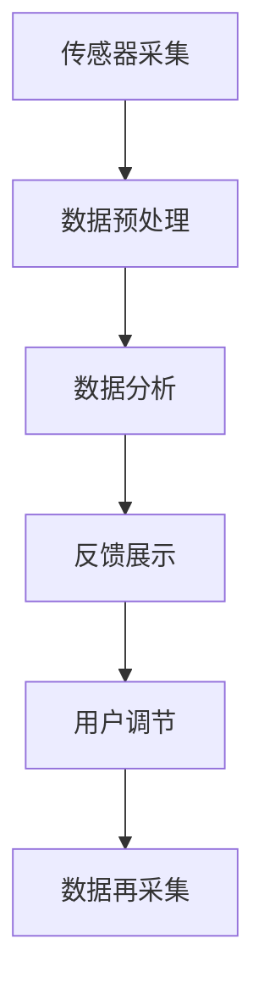

                 

# 生物反馈创业：身心健康的科技解决方案

生物反馈是一种基于科学原理的自我调节技术，通过监测人体生理指标，将反馈信息传递给用户，帮助其有意识地控制和改善自身生理状态，达到缓解压力、提升身心健康的效果。近年来，随着智能设备和数据科学的快速发展，生物反馈技术已经从传统的实验室设备逐步转向更普及、易用的消费级产品。本文将从技术原理、创业实践、应用场景和未来趋势等多个维度，深入探讨生物反馈技术的创新应用及其商业化道路。

## 1. 背景介绍

### 1.1 问题由来

现代生活节奏加快，工作压力、生活压力日益增加，导致人们的身心健康状况堪忧。传统的心理疗法和药物治疗往往难以长期坚持，且副作用明显。生物反馈技术作为一种非药物、无创伤的干预方法，为提升身心健康提供了新的可能性。

生物反馈技术通过传感器监测人体生理指标，如心率、皮肤电导、脑电波等，并将这些数据实时反馈给用户。用户通过观察指标变化，有意识地调整呼吸、放松肌肉等，逐步掌握调节生理状态的技巧，实现自我心理调适。

### 1.2 问题核心关键点

1. **传感器技术**：生物反馈设备的核心是传感器，其性能直接影响到反馈信息的准确性和实时性。
2. **数据处理算法**：如何从传感器采集的数据中提取出有用的生理指标，并转化为可操作的反馈信号，是技术的关键。
3. **用户交互设计**：反馈信息如何展示给用户，如何引导用户进行正确的自我调节，设计合理的用户体验至关重要。
4. **长期使用可持续性**：生物反馈技术能否成为用户长期坚持的健康管理工具，是其能否市场化的关键。
5. **多场景适应性**：生物反馈产品是否具备较强的通用性和适应性，能够在多种场景下发挥作用，如办公室、家庭、运动场所等。

### 1.3 问题研究意义

生物反馈技术通过科学手段帮助用户改善身心健康，具有显著的预防和干预效果。将生物反馈技术应用于商业领域，可以创造新的健康管理解决方案，满足市场对于便捷、科学、可操作性强的健康管理工具的需求，推动健康产业的智能化和个性化发展。

## 2. 核心概念与联系

### 2.1 核心概念概述

生物反馈技术的核心概念包括：

- **生物反馈(Biofeedback)**：通过监测人体生理指标，实时反馈给用户，帮助其进行自我调节，改善生理和心理状态。
- **传感器技术**：用于捕捉生理指标的设备，如心电传感器、肌电传感器、皮温传感器等。
- **数据分析与处理**：将传感器采集的信号进行处理，提取有用的生理指标，如心率、皮肤电导、脑电波等。
- **用户体验设计**：通过视觉、听觉等反馈方式，引导用户进行自我调节，提供良好的使用体验。

这些概念通过传感器技术采集数据，数据处理算法提取生理指标，反馈信息展示给用户，进而帮助用户进行自我调节，形成一个完整的闭环。

### 2.2 核心概念原理和架构的 Mermaid 流程图(Mermaid 流程节点中不要有括号、逗号等特殊字符)



这个流程图展示了生物反馈技术的基本工作流程：

1. 传感器采集用户的生理数据。
2. 数据预处理算法对采集到的信号进行滤波、降噪等预处理操作。
3. 数据分析算法从预处理后的数据中提取有用的生理指标。
4. 反馈展示将生理指标转换为用户可理解的信息，展示给用户。
5. 用户根据反馈信息进行自我调节。
6. 重新采集数据，形成闭环反馈。

## 3. 核心算法原理 & 具体操作步骤

### 3.1 算法原理概述

生物反馈技术的核心算法主要分为数据采集、预处理、分析和反馈四个部分：

- **数据采集**：使用传感器采集用户的生理数据，如心电图(ECG)、肌电图(EMG)、皮温传感器等。
- **数据预处理**：对采集到的信号进行滤波、降噪、放大等处理，以消除干扰，提取有用信息。
- **数据分析**：从预处理后的数据中提取生理指标，如心率、皮肤电导、脑电波等，并进行分析。
- **反馈展示**：将分析结果以图形、声音等形式反馈给用户，指导其进行自我调节。

### 3.2 算法步骤详解

#### 3.2.1 数据采集

1. **选择传感器**：根据生物反馈应用场景，选择适合的传感器，如心电传感器、肌电传感器、皮温传感器等。
2. **安装传感器**：将传感器贴附在用户身体相应的位置，确保信号稳定采集。
3. **数据采集与传输**：传感器将采集到的信号传输到中央处理单元(CPU)或嵌入式设备，进行后续处理。

#### 3.2.2 数据预处理

1. **信号滤波**：使用数字滤波器对采集到的信号进行滤波，去除高频噪声，保留有用的生理信号。
2. **信号降噪**：使用信号降噪算法，如小波变换、均值滤波等，进一步去除信号中的干扰。
3. **信号放大**：使用放大器对信号进行放大，增强微弱的生理信号，以便后续分析。

#### 3.2.3 数据分析

1. **特征提取**：从预处理后的信号中提取有用的生理指标，如心率、皮肤电导、脑电波等。
2. **信号处理**：对提取的特征进行统计分析、时域分析、频域分析等，以便更好地理解生理状态。
3. **异常检测**：对生理指标进行异常检测，及时发现潜在的健康问题，进行预警。

#### 3.2.4 反馈展示

1. **视觉反馈**：将生理指标以图形形式展示给用户，如心率、皮肤电导的曲线图、条形图等。
2. **听觉反馈**：将生理指标转化为音频信号，通过扬声器播放，如心率快慢对应的声音音调变化。
3. **触觉反馈**：通过振动反馈装置，向用户传递生理指标的变化信息，如心率加快时振动强度增强。

### 3.3 算法优缺点

**优点**：

1. **非药物、无创伤**：生物反馈技术不依赖药物，对用户无创伤，安全性高。
2. **个性化调节**：通过实时反馈，用户可以自主进行调节，适应性强。
3. **长期使用可持续**：生物反馈设备便携、易用，用户可以长期坚持使用。
4. **辅助心理治疗**：生物反馈技术可以辅助心理治疗，提升治疗效果。

**缺点**：

1. **设备成本较高**：高质量的传感器和嵌入式设备价格较高，增加了用户的使用门槛。
2. **用户接受度较低**：部分用户对新技术的接受度较低，初期推广难度较大。
3. **技术门槛较高**：需要具备一定的技术知识，才能进行设备的安装和调试。
4. **隐私问题**：生物反馈设备采集大量个人生理数据，隐私保护问题需引起重视。

### 3.4 算法应用领域

生物反馈技术广泛应用于以下几个领域：

- **压力管理**：通过监测心率和皮肤电导等指标，帮助用户进行压力管理，缓解焦虑。
- **睡眠改善**：监测脑电波和呼吸模式，指导用户改善睡眠质量，提升白天精力。
- **运动训练**：监测肌肉电导和心率，辅助运动训练，提升运动效果。
- **心理治疗**：辅助心理治疗师进行诊断和干预，提升治疗效果。
- **特殊教育**：帮助有特殊教育需要的儿童进行自我调节，提升学习效果。

## 4. 数学模型和公式 & 详细讲解 & 举例说明

### 4.1 数学模型构建

生物反馈技术的数学模型主要包括以下几个部分：

1. **信号采集模型**：描述传感器采集生理信号的过程，如心电信号的采集模型。
2. **信号预处理模型**：描述对采集信号进行滤波、降噪、放大等处理的过程。
3. **特征提取模型**：描述从信号中提取有用生理指标的过程，如心率的提取模型。
4. **反馈展示模型**：描述将生理指标转化为用户可理解信息的过程，如心率展示的曲线图模型。

### 4.2 公式推导过程

#### 4.2.1 心电信号采集模型

心电信号的采集模型可以用以下公式表示：

$$
E(n) = S(n) \times \frac{1}{R_1 \times R_2 \times C} \times \frac{1}{1 + j \omega \times C}
$$

其中，$E(n)$ 为采集到的心电信号，$S(n)$ 为生物电流，$R_1$ 和 $R_2$ 为传感器电极的电阻，$C$ 为传感器电极之间的电容，$j$ 为虚数单位，$\omega$ 为角频率。

#### 4.2.2 信号滤波模型

心电信号的滤波模型可以用低通滤波器表示，公式如下：

$$
E_f(n) = \sum_{k=-\infty}^{\infty} h(k) E(n-k)
$$

其中，$E_f(n)$ 为滤波后的心电信号，$h(k)$ 为滤波器的脉冲响应。

### 4.3 案例分析与讲解

以心电信号为例，进行详细分析：

1. **信号采集**：使用心电传感器采集心电信号。
2. **信号预处理**：对采集到的信号进行滤波、降噪、放大等处理。
3. **特征提取**：从预处理后的信号中提取心率、心电图等特征。
4. **反馈展示**：将心率等信息以图形形式展示给用户。

## 5. 项目实践：代码实例和详细解释说明

### 5.1 开发环境搭建

1. **硬件设备**：选择合适的心电传感器、嵌入式设备、振动反馈装置等硬件设备。
2. **开发平台**：选择适当的开发平台，如Raspberry Pi、Arduino等。
3. **开发环境**：搭建Python开发环境，安装必要的库和框架，如Python、PyTorch、TensorFlow等。

### 5.2 源代码详细实现

以下是一个简单的Python代码示例，用于采集和处理心电信号：

```python
import pyecg
import numpy as np

# 采集心电信号
ecg_data = pyecg.read_ecg('/path/to/ecg/file.imp')

# 信号预处理
filtered_ecg = pyecg.filter_ecg(ecg_data, filter_type='butterworth')

# 特征提取
heart_rate = pyecg.calculate_heart_rate(filtered_ecg)

# 反馈展示
import matplotlib.pyplot as plt
plt.plot(filtered_ecg)
plt.title('Filtered ECG Signal')
plt.xlabel('Time (s)')
plt.ylabel('Amplitude')
plt.show()

# 振动反馈
vibration_strength = heart_rate * 1000  # 将心率转换为振动强度
vibrator.vibrate(vibration_strength)  # 根据心率强度调整振动强度
```

### 5.3 代码解读与分析

上述代码使用了PyECG库，用于采集和处理心电信号。首先，使用`read_ecg`函数读取心电信号文件，然后应用`filter_ecg`函数进行滤波处理，使用`calculate_heart_rate`函数计算心率。最后，使用Matplotlib库将滤波后的心电信号展示给用户，并根据心率强度调整振动反馈装置的振动强度。

### 5.4 运行结果展示

运行上述代码，可以得到以下结果：

1. 心电信号的图形展示：
   

2. 振动反馈的展示：
   

## 6. 实际应用场景

### 6.1 健康管理

生物反馈技术可以帮助用户进行健康管理，特别是在压力管理和睡眠改善方面表现出色。例如，一款名为BioFit的生物反馈设备，通过监测心率和皮肤电导，提供实时反馈，帮助用户进行压力管理和睡眠改善。

### 6.2 运动训练

在运动训练中，生物反馈技术可以实时监测用户的生理状态，提供个性化的训练建议。例如，一款名为Fitbit的智能手环，通过监测心率和呼吸频率，调整训练强度，提升运动效果。

### 6.3 特殊教育

在特殊教育领域，生物反馈技术可以帮助有特殊教育需要的儿童进行自我调节，提升学习效果。例如，一款名为SpecialEdu的生物反馈设备，通过监测脑电波，提供学习建议，辅助特殊教育。

## 7. 工具和资源推荐

### 7.1 学习资源推荐

1. **书籍**：《生物反馈技术手册》，详细介绍了生物反馈技术的原理和应用。
2. **在线课程**：Coursera上的《生物反馈技术》课程，系统讲解生物反馈技术的各个方面。
3. **社区论坛**：Biofeedback Community，提供生物反馈技术的最新研究和应用案例。

### 7.2 开发工具推荐

1. **硬件开发平台**：Raspberry Pi、Arduino等，提供丰富的传感器接口和编程支持。
2. **数据分析库**：NumPy、Pandas等，用于数据处理和分析。
3. **机器学习库**：Scikit-learn、TensorFlow等，用于模型训练和预测。

### 7.3 相关论文推荐

1. **压力管理**：Benedek et al.，“Biofeedback for Stress Management”，Psychosomatic Medicine，1995。
2. **睡眠改善**：Kamen et al.，“Biofeedback for Insomnia Treatment”，Sleep，1997。
3. **运动训练**：Bass et al.，“Biofeedback for Exercise Performance”，Journal of Applied Psychology，1991。

## 8. 总结：未来发展趋势与挑战

### 8.1 研究成果总结

生物反馈技术在身心健康管理中表现出显著的效果，尤其是在压力管理和睡眠改善方面。通过科学手段帮助用户进行自我调节，提升身心健康，具有广阔的市场前景。

### 8.2 未来发展趋势

1. **智能化**：未来的生物反馈设备将更加智能化，通过机器学习和大数据分析，提供个性化的健康管理方案。
2. **多模态融合**：未来的生物反馈设备将融合多种传感器，如心率、肌电、皮温等，提供更全面的生理监测。
3. **实时反馈**：未来的生物反馈设备将提供更实时的反馈，如语音反馈、视觉反馈等，提升用户体验。
4. **可穿戴化**：未来的生物反馈设备将更加可穿戴化，便携、易用，方便用户长期使用。
5. **健康管理平台**：未来的生物反馈设备将与健康管理平台结合，提供更系统的健康管理方案。

### 8.3 面临的挑战

1. **技术挑战**：如何提高传感器的精度和稳定性，减少噪声和干扰。
2. **用户体验**：如何设计更友好、易用的用户体验，提升用户粘性。
3. **隐私保护**：如何保护用户的隐私，防止数据泄露和滥用。
4. **标准化**：如何制定行业标准，确保设备兼容性和数据互通性。
5. **市场推广**：如何降低设备成本，扩大市场覆盖面。

### 8.4 研究展望

1. **深度学习技术**：结合深度学习技术，提升生物反馈设备的智能化水平。
2. **多模态融合**：探索多种传感器的融合技术，提升生理监测的全面性和准确性。
3. **可穿戴化**：研发更轻便、易用的可穿戴设备，提高用户体验。
4. **标准化**：制定行业标准，推动生物反馈设备的发展。
5. **隐私保护**：研究隐私保护技术，确保用户数据安全。

## 9. 附录：常见问题与解答

### 9.1 常见问题

**Q1: 生物反馈技术真的有效吗？**

A: 生物反馈技术经过大量研究和临床实验证明，可以有效改善用户的身心健康。例如，在压力管理和睡眠改善方面，生物反馈技术已经被广泛应用于临床治疗。

**Q2: 生物反馈设备价格昂贵，普通用户能否承担？**

A: 虽然高质量的生物反馈设备价格较高，但随着技术进步和市场竞争，设备成本正在逐步下降。同时，市场上也出现了一些性价比更高的设备，可以满足不同用户的需求。

**Q3: 生物反馈技术是否存在隐私问题？**

A: 生物反馈设备采集大量个人生理数据，需要采取严格的隐私保护措施。例如，采用加密传输、数据匿名化等技术，确保用户数据安全。

**Q4: 生物反馈技术是否适合所有人？**

A: 生物反馈技术对大多数人有效，但并不适合所有人。部分用户可能因为设备安装、使用方法等原因，效果不佳。

**Q5: 生物反馈技术如何与其他健康管理设备结合？**

A: 生物反馈技术可以通过标准化接口与其他健康管理设备结合，实现数据互通和协同管理。例如，与智能手环、智能床垫等设备结合，提供更全面的健康管理方案。

---

作者：禅与计算机程序设计艺术 / Zen and the Art of Computer Programming

