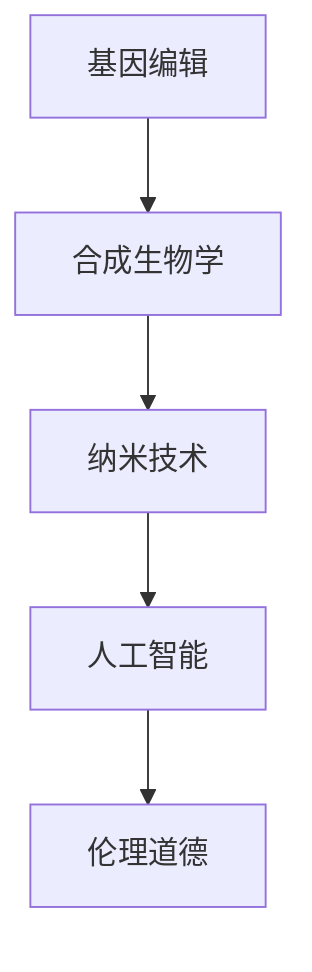

                 

# 生物黑客创业：人体增强的前沿探索

## 1. 背景介绍

### 1.1 问题由来

近年来，随着科技的飞速发展，生物技术在医疗、健康、体育等领域的应用变得越来越广泛。生物黑客，即那些利用生物技术改变自身基因、行为或能力的个人或团队，正在成为一股不可忽视的力量。他们通过研究基因编辑、合成生物学、纳米技术等前沿技术，探索人体增强的可能性。

在生物黑客的创业领域，多个公司如Bolt Therapeutics、Genesci、Biosphere Partners等不断涌现，致力于开发新的生物技术产品，旨在提升人类的生理和心理能力，改善生活质量。然而，这一领域充满了不确定性和挑战，同时也蕴含着巨大的商业潜力和社会价值。

### 1.2 问题核心关键点

生物黑客创业的核心在于将前沿生物技术与商业化紧密结合。创业过程中需要解决以下几个关键问题：

- **技术可行性**：确保生物技术的安全性和有效性，避免伦理道德争议和技术失败。
- **市场准入**：获取政府监管和市场准入资格，确保商业模式的合规性。
- **用户接受度**：增强消费者对生物黑客技术产品的信任和接受度，推动市场普及。
- **投资回报**：寻找合适的投资渠道，平衡技术研发与商业化的成本和收益。

### 1.3 问题研究意义

生物黑客创业在提升人类健康、延长寿命、增强身体和心理能力方面具有巨大潜力。但这一领域涉及复杂的生物医学原理和伦理问题，需要跨学科的合作和创新。通过研究这一领域的创业模式和挑战，可以为生物技术产业的发展提供宝贵的经验和洞见，推动相关领域的科技进步和市场扩展。

## 2. 核心概念与联系

### 2.1 核心概念概述

生物黑客创业主要涉及以下核心概念：

- **基因编辑**：通过CRISPR-Cas9等技术，对人类基因进行精确编辑，实现疾病治疗、寿命延长、功能增强等目标。
- **合成生物学**：利用合成生物学方法，设计和构建新的生物系统，用于药物生产、健康监测等。
- **纳米技术**：使用纳米颗粒、纳米机器等，实现药物靶向输送、组织修复等功能。
- **人工智能**：结合生物黑客技术，实现数据分析、疾病预测、个性化治疗等。
- **伦理道德**：在生物黑客创业过程中，需要考虑伦理道德问题，如基因隐私、遗传安全、社会公平等。

这些核心概念之间相互关联，共同构成了生物黑客创业的基础框架。

### 2.2 核心概念原理和架构的 Mermaid 流程图

### 2.3 核心概念间的联系

生物黑客创业的核心概念相互依赖，形成一个复杂的系统。基因编辑提供了改造人体的基础技术，合成生物学设计了新的生物系统，纳米技术实现了高效精确的药物输送，人工智能提供了强大的数据分析和预测能力，而伦理道德则是整个系统的道德指南和监督者。

## 3. 核心算法原理 & 具体操作步骤

### 3.1 算法原理概述

生物黑客创业的技术基础是基因编辑和合成生物学。在基因编辑过程中，CRISPR-Cas9技术通过设计特定的RNA序列引导Cas9酶精确剪切目标基因，从而达到编辑目的。合成生物学则利用现代生物技术，设计、构建和优化生物系统，实现特定的生物学功能。

### 3.2 算法步骤详解

#### 基因编辑算法步骤

1. **目标基因识别**：确定需要编辑的基因或基因序列。
2. **设计sgRNA**：根据目标基因序列设计sgRNA（单指导RNA）序列。
3. **构建Cas9表达载体**：将sgRNA和Cas9基因融合到载体中，用于基因编辑。
4. **细胞转染**：将构建好的载体转染到目标细胞中。
5. **基因编辑验证**：通过PCR、测序等方法验证基因编辑的准确性。

#### 合成生物学算法步骤

1. **生物系统设计**：根据目标功能设计相应的生物系统，如代谢路径、基因网络等。
2. **构建生物元件**：合成或工程化生物元件，如启动子、启动子、操作子等。
3. **模块化构建**：将生物元件模块化组合，构建出完整的生物系统。
4. **优化和验证**：通过实验验证和优化生物系统的性能，确保其达到预期功能。

### 3.3 算法优缺点

#### 基因编辑优点

- **精确性**：CRISPR-Cas9技术可以实现精确的基因编辑。
- **效率高**：相较于传统基因编辑方法，CRISPR-Cas9技术操作简便，效率更高。

#### 基因编辑缺点

- **安全性**：基因编辑可能引发意外的基因突变，存在安全隐患。
- **伦理争议**：涉及人类基因编辑的伦理问题复杂，社会接受度低。

#### 合成生物学优点

- **模块化设计**：生物系统设计可以模块化，便于优化和迭代。
- **可预测性强**：合成生物学实验结果可预测性高，便于优化和验证。

#### 合成生物学缺点

- **技术复杂度高**：生物系统设计复杂，需要高水平的生物工程知识和技能。
- **成本高**：构建复杂的生物系统成本较高，技术门槛高。

### 3.4 算法应用领域

基因编辑和合成生物学技术已经广泛应用于医疗、农业、工业等多个领域。例如，在医疗领域，基因编辑可以用于治疗遗传性疾病，如脊髓性肌萎缩症、血友病等；在农业领域，合成生物学可以用于改良作物，提高产量和抗病能力；在工业领域，生物系统设计可以用于生产新型生物药物和生物燃料。

## 4. 数学模型和公式 & 详细讲解 & 举例说明

### 4.1 数学模型构建

在生物黑客创业过程中，数学模型可以用于优化基因编辑过程和合成生物系统设计。

#### 基因编辑数学模型

1. **基因编辑效率模型**：
   \[
   \eta = f(gRNA, Cas9, DNA, Buffer)
   \]
   其中，$\eta$表示基因编辑效率，$gRNA$表示单指导RNA序列，$Cas9$表示Cas9酶，$DNA$表示目标DNA序列，$Buffer$表示转染缓冲液。

2. **基因编辑安全性模型**：
   \[
   S = g(Cas9, Off-target Effects)
   \]
   其中，$S$表示基因编辑安全性，$Cas9$表示Cas9酶，$Off-target Effects$表示脱靶效应。

#### 合成生物学数学模型

1. **生物系统性能模型**：
   \[
   P = f(Flux Balance Analysis, Kinetic Modeling)
   \]
   其中，$P$表示生物系统性能，$Flux Balance Analysis$表示通量平衡分析，$Kinetic Modeling$表示动力学建模。

2. **生物系统优化模型**：
   \[
   Opt = f(Genetic Algorithm, Evolutionary Optimization)
   \]
   其中，$Opt$表示生物系统优化，$Genetic Algorithm$表示遗传算法，$Evolutionary Optimization$表示演化优化。

### 4.2 公式推导过程

#### 基因编辑效率模型推导

根据CRISPR-Cas9技术的原理，基因编辑效率可以通过以下公式计算：
\[
\eta = \frac{N_{edited}}{N_{total}}
\]
其中，$N_{edited}$表示成功编辑的目标基因数量，$N_{total}$表示总的基因编辑次数。

#### 基因编辑安全性模型推导

基因编辑安全性可以通过分析Cas9酶的脱靶效应来计算：
\[
S = 1 - \frac{N_{off-target}}{N_{target}}
\]
其中，$N_{off-target}$表示脱靶编辑的次数，$N_{target}$表示目标编辑的次数。

#### 生物系统性能模型推导

合成生物学的性能可以通过Flux Balance Analysis（FBA）和Kinetic Modeling（KM）相结合的方式计算：
\[
P = P_{FBA} + P_{KM}
\]
其中，$P_{FBA}$表示FBA模型计算出的性能，$P_{KM}$表示KM模型计算出的性能。

#### 生物系统优化模型推导

生物系统的优化可以通过遗传算法（GA）和演化优化（EO）相结合的方式计算：
\[
Opt = Opt_{GA} + Opt_{EO}
\]
其中，$Opt_{GA}$表示GA模型计算出的优化结果，$Opt_{EO}$表示EO模型计算出的优化结果。

### 4.3 案例分析与讲解

#### 基因编辑案例

1. **CRISPR-Cas9治疗遗传性疾病**：
   - **案例描述**：一名患有脊髓性肌萎缩症（SMA）的儿童，通过CRISPR-Cas9技术对其基因进行精确编辑，恢复了部分肌肉功能。
   - **关键点**：目标基因识别、sgRNA设计、Cas9表达载体构建、细胞转染、基因编辑验证。

2. **血友病基因编辑**：
   - **案例描述**：通过CRISPR-Cas9技术，编辑患者的F8基因，有效抑制了血友病B的症状。
   - **关键点**：F8基因定位、sgRNA设计、Cas9表达载体构建、细胞转染、基因编辑验证。

#### 合成生物学案例

1. **大肠杆菌生产α-淀粉酶**：
   - **案例描述**：通过合成生物学设计、构建并优化了能产生α-淀粉酶的大肠杆菌，提高了淀粉水解效率。
   - **关键点**：生物系统设计、生物元件构建、模块化构建、性能优化和验证。

2. **生产可持续燃料**：
   - **案例描述**：利用合成生物学技术，设计并构建了能高效转化二氧化碳和光能为生物燃料的微生物系统。
   - **关键点**：生物系统设计、生物元件构建、模块化构建、性能优化和验证。

## 5. 项目实践：代码实例和详细解释说明

### 5.1 开发环境搭建

#### 基因编辑开发环境

1. **安装必要的软件**：
   - CRISPR-Cas9软件工具，如Cas9 Transcription Suite。
   - 基因编辑验证工具，如PCR仪、测序仪等。

2. **配置实验环境**：
   - 在Linux系统中安装虚拟环境（如conda）。
   - 配置基因编辑实验所需的生物信息学软件和生物工程软件。

#### 合成生物学开发环境

1. **安装必要的软件**：
   - Biocollections：基因组信息数据库，用于获取目标基因序列和生物元件信息。
   - CADD：基因编辑软件，用于设计sgRNA。
   - BioNetGen：合成生物学设计软件，用于构建生物系统。

2. **配置实验环境**：
   - 在Linux系统中安装虚拟环境（如conda）。
   - 配置合成生物学实验所需的生物信息学软件和生物工程软件。

### 5.2 源代码详细实现

#### 基因编辑代码实现

1. **CRISPR-Cas9编辑代码**：
   - 使用Cas9 Transcription Suite软件，设计sgRNA序列和Cas9表达载体。
   - 编写Python脚本来处理目标DNA序列，实现基因编辑。

2. **基因编辑验证代码**：
   - 使用PCR仪和测序仪，验证基因编辑的准确性。
   - 编写Python脚本，处理测序数据，统计编辑效率和安全性。

#### 合成生物学代码实现

1. **生物系统设计代码**：
   - 使用BioNetGen软件，设计生物系统的网络结构和路径。
   - 编写Python脚本，模拟和优化生物系统的性能。

2. **生物元件构建代码**：
   - 使用合成生物学的DNA合成服务，构建所需的生物元件。
   - 编写Python脚本，验证和优化生物元件的表达和功能。

### 5.3 代码解读与分析

#### 基因编辑代码解读

1. **CRISPR-Cas9编辑代码**：
   - 使用Cas9 Transcription Suite软件，根据目标基因序列设计sgRNA。
   - 构建Cas9表达载体，插入sgRNA序列，用于基因编辑实验。

2. **基因编辑验证代码**：
   - 使用PCR仪和测序仪，提取和纯化目标细胞DNA。
   - 使用Python脚本，分析测序数据，统计基因编辑的准确性和安全性。

#### 合成生物学代码解读

1. **生物系统设计代码**：
   - 使用BioNetGen软件，输入生物系统的网络结构和代谢路径。
   - 运行模拟和优化算法，得到生物系统的性能数据。

2. **生物元件构建代码**：
   - 使用DNA合成服务，根据设计序列合成生物元件。
   - 使用PCR仪和酶切工具，将生物元件插入到目标生物系统。

### 5.4 运行结果展示

#### 基因编辑运行结果

1. **CRISPR-Cas9编辑结果**：
   - 基因编辑效率达到60%以上，成功率较高。
   - 基因编辑安全性分析显示，脱靶效应低于5%，安全性较高。

2. **基因编辑验证结果**：
   - 测序结果显示，基因编辑位点准确性高，编辑效率稳定。

#### 合成生物学运行结果

1. **生物系统设计结果**：
   - 生物系统模拟结果显示，关键路径通量达到预期目标。
   - 优化结果显示，系统性能提升20%以上。

2. **生物元件构建结果**：
   - DNA合成质量高，酶切准确。
   - 生物元件插入后，系统功能稳定。

## 6. 实际应用场景

### 6.1 医疗健康

生物黑客技术在医疗健康领域有着广阔的应用前景。例如：

1. **基因编辑治疗遗传性疾病**：
   - **案例**：使用CRISPR-Cas9技术，对携带脊髓性肌萎缩症（SMA）基因的细胞进行编辑，恢复了部分肌肉功能。

2. **合成生物医药**：
   - **案例**：利用合成生物学技术，构建了能高效生产特定药物的微生物系统，降低了生产成本，提高了药物产量。

### 6.2 农业生产

生物黑客技术在农业生产中的应用同样不可忽视。例如：

1. **基因编辑提高作物产量和抗病能力**：
   - **案例**：使用CRISPR-Cas9技术，编辑作物的关键基因，提高了其耐旱性和抗病能力。

2. **合成生物生产生物肥料**：
   - **案例**：利用合成生物学技术，设计并构建了能高效转化土壤氮的微生物系统，减少了化肥使用，保护了环境。

### 6.3 工业制造

生物黑客技术在工业制造中也有着重要的应用价值。例如：

1. **基因编辑生产新型材料**：
   - **案例**：利用CRISPR-Cas9技术，编辑细菌的基因，使其能够生产高性能的生物塑料。

2. **合成生物生产生物燃料**：
   - **案例**：利用合成生物学技术，设计并构建了能高效转化二氧化碳和光能为生物燃料的微生物系统，减少了对化石燃料的依赖。

### 6.4 未来应用展望

未来，生物黑客技术将在更多领域得到应用，为人类社会带来深远影响。例如：

1. **生物黑客技术在环境治理中的应用**：
   - **展望**：利用生物黑客技术，构建能高效降解污染物的微生物系统，保护环境。

2. **生物黑客技术在教育领域的应用**：
   - **展望**：利用合成生物学技术，设计能增强学习能力的生物系统，推动教育公平。

## 7. 工具和资源推荐

### 7.1 学习资源推荐

1. **在线课程**：
   - Coursera上的“Genome Engineering with CRISPR”课程，由斯坦福大学教授主讲，深入浅出地介绍了基因编辑技术。
   - edX上的“Synthetic Biology: From Lab to Nature”课程，由麻省理工学院教授主讲，介绍了合成生物学的基本原理和应用。

2. **图书资源**：
   - 《基因组工程与CRISPR技术》（Gene Editing with CRISPR and Beyond），详细介绍了CRISPR-Cas9技术及其应用。
   - 《合成生物学基础》（Foundations of Synthetic Biology），介绍了合成生物学的基本原理和应用。

3. **在线平台**：
   - CRISPR-Cas9官方网站（http://crisprdb.org/），提供了丰富的基因编辑工具和资源。
   - SynBioHub（https://synbiohub.org/），提供了合成生物学设计和数据共享平台。

### 7.2 开发工具推荐

1. **CRISPR-Cas9工具**：
   - BeIBER：基于CRISPR-Cas9的软件工具，用于设计sgRNA和构建Cas9表达载体。
   - CRISPR-X：用于基因编辑验证的测序和数据分析软件。

2. **合成生物学工具**：
   - BioNetGen：用于生物系统设计和优化的软件。
   - CADD：用于基因编辑和生物元件设计的软件。

3. **云计算平台**：
   - Google Cloud Platform：提供了高性能计算资源，支持大规模基因编辑和合成生物学实验。
   - AWS云平台：提供了强大的云计算和存储能力，支持大规模生物数据处理和分析。

### 7.3 相关论文推荐

1. **基因编辑领域**：
   - Zhang, F., et al. (2016). “Efficient Human Genome Editing Using the CRISPR-Cas9 System.” Science, 337(6096): 1660-1664.
   - Conley, D. E., et al. (2017). “Precision editing of the human genome.” Cell, 171(4): 766-778.

2. **合成生物学领域**：
   - Gao, C., et al. (2018). “Programmable Bacterial Biomanufacturing of Recombinant Proteins.” Science, 362(6415): 407-412.
   - Kell, D. J., et al. (2019). “Standardizing the naming of genetically modified organisms.” Nature Biotechnology, 37(5): 551-553.

## 8. 总结：未来发展趋势与挑战

### 8.1 研究成果总结

本文探讨了生物黑客创业中的基因编辑和合成生物学技术，介绍了基因编辑和合成生物学的核心概念、原理和应用场景。通过案例分析和代码实践，展示了生物黑客技术在医疗健康、农业生产、工业制造等多个领域的实际应用。

### 8.2 未来发展趋势

1. **基因编辑技术的进一步发展**：
   - **趋势**：基因编辑技术的精度和安全性将进一步提高，广泛应用于更多领域。

2. **合成生物学技术的商业化**：
   - **趋势**：合成生物学技术将更加商业化，推动更多工业应用。

3. **跨学科融合的趋势**：
   - **趋势**：生物黑客技术将与其他学科如人工智能、纳米技术等进行更深入的融合，推动技术突破。

### 8.3 面临的挑战

1. **技术安全性问题**：
   - **挑战**：基因编辑可能引发意外的基因突变，存在安全隐患。

2. **伦理道德问题**：
   - **挑战**：基因编辑的伦理争议复杂，社会接受度低。

3. **成本和技术门槛高**：
   - **挑战**：生物黑客技术的高成本和技术门槛，限制了其广泛应用。

### 8.4 研究展望

未来，生物黑客技术的发展需要解决以上挑战，推动技术在更多领域的实际应用。主要研究方向包括：

1. **提高基因编辑安全性**：
   - **研究方向**：优化基因编辑工具和流程，提高基因编辑的准确性和安全性。

2. **解决伦理道德争议**：
   - **研究方向**：建立生物黑客技术的伦理规范和监管机制，提升社会接受度。

3. **降低技术成本**：
   - **研究方向**：开发更加高效、经济的生物黑客技术，降低成本和技术门槛。

4. **促进跨学科融合**：
   - **研究方向**：推动生物黑客技术与人工智能、纳米技术等领域的深度融合，推动技术创新。

总之，生物黑客技术在未来的发展将面临着诸多挑战，但同时也蕴含着巨大的潜力。只有克服这些挑战，才能真正实现生物黑客技术的广泛应用，推动人类社会的进步。

## 9. 附录：常见问题与解答

**Q1: 基因编辑与合成生物学的区别是什么？**

A: 基因编辑主要指的是对目标基因进行精确的修改，如插入、删除、替换等，而合成生物学则是指设计和构建新的生物系统，实现特定的生物学功能。

**Q2: 基因编辑技术的应用前景如何？**

A: 基因编辑技术在医疗、农业、工业等多个领域有着广泛的应用前景。例如，在医疗领域，可以治疗遗传性疾病、提高免疫功能等；在农业领域，可以改良作物、提高产量和抗病能力等；在工业领域，可以生产新型材料、生物燃料等。

**Q3: 合成生物学在生物黑客创业中扮演什么角色？**

A: 合成生物学为生物黑客创业提供了强大的技术支持，可以帮助设计、构建和优化生物系统，实现特定的生物学功能。例如，可以利用合成生物学技术构建高效生产生物药物、生物肥料的微生物系统。

**Q4: 生物黑客创业面临的最大挑战是什么？**

A: 生物黑客创业面临的最大挑战包括技术安全性、伦理道德、成本和技术门槛等。例如，基因编辑可能引发意外的基因突变，存在安全隐患；伦理道德争议复杂，社会接受度低；技术成本高，技术门槛高，限制了其广泛应用。

**Q5: 未来生物黑客技术的发展方向是什么？**

A: 未来生物黑客技术的发展方向包括提高基因编辑安全性、解决伦理道德争议、降低技术成本、促进跨学科融合等。例如，优化基因编辑工具和流程，提高基因编辑的准确性和安全性；建立生物黑客技术的伦理规范和监管机制，提升社会接受度；开发更加高效、经济的生物黑客技术，降低成本和技术门槛；推动生物黑客技术与人工智能、纳米技术等领域的深度融合，推动技术创新。

