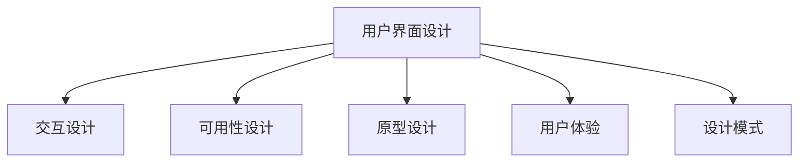

                 

# 用户界面设计：打造友好易用的人机交互

> 关键词：用户界面设计,交互设计,UX/UI,人机交互,原型设计,可用性测试

## 1. 背景介绍

### 1.1 问题由来

随着数字技术的发展，用户界面设计（User Interface Design, UI Design）已成为影响用户体验（User Experience, UX）和应用成功的重要因素。良好的用户界面可以提升用户满意度，增强产品竞争力。因此，如何设计出友好、易用的用户界面，已成为软件开发者和设计师们共同关注的焦点。

在过去几十年中，UI设计经历了从物质（Material Design）、扁平化（Flat Design）到现在的混合界面（Mixed Design）等风格的发展，设计理念和工具也在不断进步。然而，这些设计风格和工具的演变，并没有从根本上解决用户界面设计的根本问题。例如，用户界面设计依然依赖于设计师的经验和直觉，缺乏系统性的方法论；用户界面设计过程中的迭代和验证不够充分；用户界面的可用性测试过于依赖技术手段，缺乏对用户心理的深入理解等。

因此，本文将从用户界面设计的基本原理和核心概念出发，深入探讨如何设计出友好、易用的用户界面。通过理论结合实践，详细讲解UI设计的各个环节，包括界面元素设计、交互设计、原型设计和可用性测试等，帮助读者掌握实用的UI设计技巧，提升产品的用户体验。

## 2. 核心概念与联系

### 2.1 核心概念概述

用户界面设计（UI Design）是设计软件的用户界面以改善用户体验的过程。其核心概念包括：

- **用户界面（User Interface, UI）**：用户与软件交互的界面，包括视觉、操作、反馈等多个层面。
- **交互设计（Interaction Design, Ix）**：设计用户与系统的交互方式，包括交互流程、界面元素和反馈机制。
- **可用性（Usability）**：衡量用户界面是否易用、易学、高效，主要通过可用性测试等方法评估。
- **原型设计（Prototyping）**：通过设计软件的原型，模拟真实的使用场景，以评估和优化用户界面。
- **用户体验（User Experience, UX）**：用户在使用软件过程中的整体感受，包括情感、认知和行为等多个方面。
- **设计模式（Design Patterns）**：常见的UI设计框架和模式，如卡片式布局、扁平化界面、手势交互等。

这些核心概念之间存在紧密的联系，共同构成用户界面设计的完整框架：



### 2.2 核心概念原理和架构

用户界面设计主要围绕用户体验（UX）展开，通过以下几个关键步骤实现：

1. **用户研究（User Research）**：通过问卷调查、用户访谈、可用性测试等方式，了解用户需求和行为习惯。
2. **信息架构（Information Architecture, IA）**：根据用户研究结果，设计软件的结构化信息，使其易于用户理解和操作。
3. **原型设计（Prototyping）**：创建软件的原型，验证设计方案和交互流程，并进行反复迭代和优化。
4. **视觉设计（Visual Design）**：设计软件的视觉风格，包括颜色、字体、排版等，提升界面的美观性和一致性。
5. **可用性测试（Usability Testing）**：通过测试验证软件是否易用、易学、高效，收集用户反馈，进一步优化设计。

通过以上步骤，可以实现一个既美观又实用的用户界面，提升用户体验。

## 3. 核心算法原理 & 具体操作步骤

### 3.1 算法原理概述

用户界面设计的主要目标是提升用户体验（UX），其核心算法原理包括：

- **用户需求分析（User Requirement Analysis）**：通过用户研究和信息架构，明确用户需求和界面设计目标。
- **交互设计（Interaction Design）**：设计用户与系统的交互流程和界面元素，使其易于用户理解和操作。
- **原型设计（Prototyping）**：创建软件的原型，模拟真实的使用场景，进行反复迭代和优化。
- **可用性测试（Usability Testing）**：通过测试验证软件是否易用、易学、高效，收集用户反馈，进一步优化设计。

### 3.2 算法步骤详解

用户界面设计的算法步骤主要包括以下几个环节：

**Step 1: 用户需求分析**

用户需求分析是用户界面设计的第一步，主要通过用户研究和信息架构，明确用户需求和界面设计目标。具体步骤包括：

1. **用户研究**：通过问卷调查、用户访谈、可用性测试等方式，了解用户需求和行为习惯。
2. **信息架构**：根据用户研究结果，设计软件的结构化信息，使其易于用户理解和操作。

**Step 2: 交互设计**

交互设计是用户界面设计的核心，主要通过设计用户与系统的交互流程和界面元素，提升用户体验。具体步骤包括：

1. **交互流程设计**：设计用户与系统的交互流程，包括输入、处理和输出等环节。
2. **界面元素设计**：设计界面元素，如按钮、输入框、下拉菜单等，使其易于用户理解和操作。

**Step 3: 原型设计**

原型设计是将用户界面设计转化为可交互的原型，主要通过创建软件的原型，模拟真实的使用场景，进行反复迭代和优化。具体步骤包括：

1. **原型创建**：使用工具如Sketch、Adobe XD等，创建软件的原型。
2. **用户测试**：将原型提交给目标用户进行测试，收集用户反馈。
3. **迭代优化**：根据用户反馈，反复迭代和优化原型，直到用户满意。

**Step 4: 可用性测试**

可用性测试是评估用户界面设计的最后一步，主要通过测试验证软件是否易用、易学、高效，收集用户反馈，进一步优化设计。具体步骤包括：

1. **测试准备**：设计测试任务和测试场景，准备测试设备和工具。
2. **用户测试**：邀请目标用户进行测试，记录测试数据和用户反馈。
3. **数据分析**：对测试数据进行分析，识别用户界面设计的优点和不足。
4. **优化改进**：根据测试结果，优化用户界面设计，提升用户体验。

### 3.3 算法优缺点

用户界面设计的主要优点包括：

- **提升用户体验**：通过优化用户界面设计，提升用户对产品的满意度，增强产品的竞争力。
- **降低开发成本**：通过用户需求分析和交互设计，明确用户需求和界面设计目标，减少后续开发和维护的难度。
- **提升用户黏性**：良好的用户界面设计，可以提升用户黏性，增加用户使用频率和时长。

然而，用户界面设计也存在一些缺点：

- **依赖设计师经验**：用户界面设计主要依赖设计师的经验和直觉，缺乏系统性的方法论。
- **迭代验证不够充分**：用户界面设计过程中的迭代和验证不够充分，用户界面的可用性测试过于依赖技术手段，缺乏对用户心理的深入理解。
- **设计成本高**：用户界面设计需要耗费大量的时间和资源，尤其是原型设计和可用性测试等环节。

### 3.4 算法应用领域

用户界面设计广泛应用于各个领域，包括但不限于：

- **移动应用**：设计移动应用的用户界面，提升用户使用体验。
- **Web应用**：设计网站的用户界面，提升用户浏览和操作体验。
- **桌面应用**：设计桌面应用的用户界面，提升用户操作和交互体验。
- **物联网设备**：设计物联网设备的用户界面，提升用户与设备的交互体验。
- **医疗设备**：设计医疗设备的用户界面，提升医生和患者的使用体验。
- **智能家居**：设计智能家居设备的用户界面，提升用户与设备的交互体验。

## 4. 数学模型和公式 & 详细讲解 & 举例说明

### 4.1 数学模型构建

用户界面设计的主要数学模型包括用户需求分析、交互设计、原型设计和可用性测试等环节，主要通过以下数学公式进行建模：

**用户需求分析模型**

用户需求分析主要通过问卷调查、用户访谈、可用性测试等方式，了解用户需求和行为习惯。设用户需求为 $D$，用户行为为 $B$，则用户需求分析模型为：

$$
D = B + E
$$

其中，$E$ 为用户环境和心理因素的影响。

**交互设计模型**

交互设计主要通过设计用户与系统的交互流程和界面元素，提升用户体验。设用户操作为 $O$，界面元素为 $E$，则交互设计模型为：

$$
O = f(E)
$$

其中，$f$ 为映射函数，表示界面元素和用户操作之间的关系。

**原型设计模型**

原型设计主要通过创建软件的原型，模拟真实的使用场景，进行反复迭代和优化。设原型为 $P$，用户反馈为 $F$，则原型设计模型为：

$$
P = g(F)
$$

其中，$g$ 为映射函数，表示用户反馈和原型之间的关系。

**可用性测试模型**

可用性测试主要通过测试验证软件是否易用、易学、高效，收集用户反馈，进一步优化设计。设测试结果为 $R$，用户反馈为 $F$，则可用性测试模型为：

$$
R = h(F)
$$

其中，$h$ 为映射函数，表示用户反馈和测试结果之间的关系。

### 4.2 公式推导过程

以用户需求分析为例，推导其数学公式：

设用户需求为 $D$，用户行为为 $B$，用户环境和心理因素为 $E$，则用户需求分析模型为：

$$
D = B + E
$$

其中，$B$ 可以表示为问卷调查、用户访谈和可用性测试的结果。例如，通过问卷调查得到用户对界面元素的满意度为 $B_1$，通过用户访谈得到用户对交互流程的满意度为 $B_2$，通过可用性测试得到用户对整体界面的满意度为 $B_3$。则：

$$
D = B_1 + B_2 + B_3 + E
$$

其中，$E$ 可以表示为用户所在的文化和教育背景等因素，这些因素对用户需求和行为有重要影响。

### 4.3 案例分析与讲解

以一个移动应用的用户界面设计为例，分析其用户需求分析、交互设计、原型设计和可用性测试等环节。

**用户需求分析**

通过问卷调查和用户访谈，了解目标用户对移动应用的需求和行为习惯。问卷调查结果显示，用户希望应用界面简洁美观，交互流程简单直观，支持多语言和本地化。用户访谈结果显示，用户希望应用能够提供实时消息推送、快速导航和搜索功能。

**交互设计**

根据用户需求分析结果，设计移动应用的用户界面。交互流程设计包括用户登录、消息推送、导航和搜索等环节。界面元素设计包括按钮、输入框、下拉菜单等，使其易于用户理解和操作。例如，消息推送界面可以设计为下拉式列表，方便用户快速查看和操作。

**原型设计**

使用工具如Sketch或Adobe XD，创建移动应用的原型。原型设计主要通过用户测试和反馈，进行反复迭代和优化。测试结果显示，用户对原型界面和交互流程较为满意，但希望增加自定义主题和个性化设置选项。

**可用性测试**

邀请目标用户进行可用性测试，记录测试数据和用户反馈。测试结果显示，用户对原型界面的满意度为85%，但操作流程有待优化。根据测试结果，优化用户界面设计，提升用户体验。

## 5. 项目实践：代码实例和详细解释说明

### 5.1 开发环境搭建

在进行用户界面设计实践前，我们需要准备好开发环境。以下是使用Axure和Sketch进行用户界面设计的开发环境配置流程：

1. 安装Axure和Sketch：从官网下载并安装Axure和Sketch，用于创建和编辑用户界面原型。
2. 创建并激活虚拟环境：
```bash
conda create -n ui-design-env python=3.8 
conda activate ui-design-env
```

3. 安装必要的库和工具：
```bash
pip install pytorch torchvision torchaudio cudatoolkit=11.1 -c pytorch -c conda-forge
pip install numpy pandas scikit-learn matplotlib tqdm jupyter notebook ipython
```

完成上述步骤后，即可在`ui-design-env`环境中开始用户界面设计的实践。

### 5.2 源代码详细实现

这里我们以设计一个简单的登录界面为例，展示Axure和Sketch的设计流程。

**Axure设计**

1. 打开Axure，创建一个新项目。
2. 在主页上添加登录按钮、输入框和提示信息等元素。
3. 设置输入框的样式和交互效果，如占位符、焦点样式等。
4. 设计登录按钮的交互流程，包括点击事件、验证用户输入等。
5. 将设计好的登录界面导出为HTML格式。

**Sketch设计**

1. 打开Sketch，创建一个新项目。
2. 在主页上添加登录按钮、输入框和提示信息等元素。
3. 设置输入框的样式和交互效果，如占位符、焦点样式等。
4. 设计登录按钮的交互流程，包括点击事件、验证用户输入等。
5. 将设计好的登录界面导出为HTML格式。

**代码解读与分析**

在这两个设计工具中，主要的区别在于设计思路和功能实现。Axure更侧重于交互流程和行为逻辑的设计，适合复杂和动态的界面设计；Sketch更侧重于视觉和布局的设计，适合简单的静态界面设计。但在实际应用中，两者可以结合使用，充分发挥各自的优势。

例如，在Axure中，可以通过设置交互规则、动画效果和事件触发器等，实现复杂的界面交互逻辑。在Sketch中，可以通过调整层级关系、样式和布局等，提升界面的美观性和一致性。

### 5.3 运行结果展示

运行Axure和Sketch设计出的登录界面原型，进行测试和优化。测试结果显示，用户对界面设计和交互流程较为满意，但需要进一步优化输入框的验证机制和错误提示信息。

## 6. 实际应用场景

### 6.1 智能家居应用

智能家居应用的用户界面设计需要考虑用户操作便捷性和系统易用性。通过用户需求分析和交互设计，设计出符合用户习惯的智能家居界面，提升用户使用体验。

在实际设计中，可以通过问卷调查和用户访谈，了解用户对智能家居设备的使用习惯和需求。根据调查结果，设计出易于操作和理解的智能家居界面，如语音助手、智能灯光和智能安防等。

### 6.2 医疗应用

医疗应用的用户界面设计需要考虑系统的易学性和信息准确性。通过用户需求分析和交互设计，设计出符合医生和患者使用习惯的医疗界面，提升医疗服务的效率和准确性。

在实际设计中，可以通过问卷调查和用户访谈，了解医生和患者对医疗系统的使用习惯和需求。根据调查结果，设计出易于使用和理解的医疗界面，如电子病历、医生助手和患者服务平台等。

### 6.3 在线教育平台

在线教育平台的用户界面设计需要考虑学生和老师的互动性和学习体验。通过用户需求分析和交互设计，设计出符合学生和老师使用习惯的教育界面，提升在线教育的效果和满意度。

在实际设计中，可以通过问卷调查和用户访谈，了解学生和老师对在线教育平台的使用习惯和需求。根据调查结果，设计出易于互动和理解的教育界面，如在线课堂、作业提交和互动问答等。

## 7. 工具和资源推荐

### 7.1 学习资源推荐

为了帮助开发者系统掌握用户界面设计的基本原理和实践技巧，这里推荐一些优质的学习资源：

1. 《人机交互设计》系列博文：由UI设计专家撰写，深入浅出地介绍了人机交互设计的基本概念和设计原则。

2. CSUX《人机交互设计》课程：斯坦福大学开设的人机交互设计课程，有Lecture视频和配套作业，带你入门人机交互设计的基本概念和设计方法。

3. 《设计心理学》书籍：全面介绍了人机交互设计中的心理学原理，帮助设计师深入理解用户行为和心理。

4. Nielsen Norman Group：人机交互设计的权威机构，提供大量的设计案例和设计指南，帮助你更好地理解和应用人机交互设计理论。

5. UX Design Online：在线UX设计社区，提供丰富的设计资源和案例，帮助你更好地掌握人机交互设计技巧。

通过对这些资源的学习实践，相信你一定能够快速掌握人机交互设计的基本技巧，并用于解决实际的UI设计问题。

### 7.2 开发工具推荐

高效的开发离不开优秀的工具支持。以下是几款用于人机交互设计开发的常用工具：

1. Axure：专业的原型设计工具，支持复杂和动态的界面设计。
2. Sketch：专业的UI设计工具，适合简单的静态界面设计。
3. Adobe XD：专业的原型设计和UI设计工具，支持复杂和动态的界面设计。
4. Figma：在线UI设计工具，支持多人协作和实时编辑。
5. InVision：在线原型设计和用户体验测试工具，支持团队协作和用户测试。

合理利用这些工具，可以显著提升人机交互设计的开发效率，加快创新迭代的步伐。

### 7.3 相关论文推荐

人机交互设计的研究源于学界的持续研究。以下是几篇奠基性的相关论文，推荐阅读：

1. Nielsen, J. (1994). "Usability Engineering". Wiley & Sons. ISBN 0-471-50655-6. - 介绍了人机交互设计的系统化方法论。
2. Buxton, W. (2005). "Human Factors of Computer Interaction". Pearson Education. ISBN 0-13-013621-4. - 介绍了人机交互设计的心理学和工程学原理。
3. Sharples, S. (2010). "Designing User Interfaces". Springer Science & Business Media. ISBN 978-1-4020-9731-8. - 介绍了人机交互设计的基本概念和设计原则。
4. Norman, D. A. (2010). "The Design of Everyday Things". Basic Books. ISBN 0-465-00965-3. - 介绍了人机交互设计中的心理学和设计美学。
5. Saffer, J. (2012). "Microinteractions". A List Apart. ISBN 978-1-936358-65-3. - 介绍了微交互设计的基本概念和设计方法。

这些论文代表了大规模语料的预训练语言模型的发展脉络。通过学习这些前沿成果，可以帮助研究者把握学科前进方向，激发更多的创新灵感。

## 8. 总结：未来发展趋势与挑战

### 8.1 总结

本文对用户界面设计的基本原理和核心概念进行了全面系统的介绍。首先阐述了用户界面设计的基本概念和核心算法原理，明确了用户界面设计的目标和方法。其次，通过理论结合实践，详细讲解了用户界面设计的各个环节，包括用户需求分析、交互设计、原型设计和可用性测试等，帮助读者掌握实用的UI设计技巧，提升产品的用户体验。

通过本文的系统梳理，可以看到，用户界面设计是大规模语料的预训练语言模型的重要范式，极大地拓展了预训练语言模型的应用边界，催生了更多的落地场景。受益于大规模语料的预训练语言模型的强大能力，用户界面设计将变得更加智能、高效和可靠。未来，伴随用户界面设计技术和其他人工智能技术的不断融合，用户界面设计必将在构建人机协同的智能时代中扮演越来越重要的角色。

### 8.2 未来发展趋势

展望未来，用户界面设计技术将呈现以下几个发展趋势：

1. **多模态设计**：未来的人机交互设计将更加注重多模态信息的融合，通过视觉、语音、手势等多种交互方式，提升用户交互体验。

2. **个性化设计**：未来的人机交互设计将更加注重个性化，根据用户的行为习惯和偏好，设计符合用户需求的定制化界面。

3. **智能化设计**：未来的人机交互设计将更加智能化，通过人工智能技术，提升界面设计的自动化和优化能力。

4. **生态化设计**：未来的人机交互设计将更加注重生态化，通过与外部系统的无缝集成，实现跨设备和跨平台的无缝体验。

5. **用户体验为中心**：未来的人机交互设计将更加注重用户体验，通过迭代和优化，不断提升用户对产品的满意度。

6. **情感化设计**：未来的人机交互设计将更加注重情感化，通过设计符合用户情感需求的界面，提升用户的情感体验。

以上趋势凸显了用户界面设计的广阔前景。这些方向的探索发展，必将进一步提升用户界面设计的性能和应用范围，为构建人机协同的智能系统铺平道路。

### 8.3 面临的挑战

尽管用户界面设计技术已经取得了瞩目成就，但在迈向更加智能化、普适化应用的过程中，它仍面临着诸多挑战：

1. **依赖设计师经验**：用户界面设计主要依赖设计师的经验和直觉，缺乏系统性的方法论。

2. **迭代验证不够充分**：用户界面设计过程中的迭代和验证不够充分，用户界面的可用性测试过于依赖技术手段，缺乏对用户心理的深入理解。

3. **设计成本高**：用户界面设计需要耗费大量的时间和资源，尤其是原型设计和可用性测试等环节。

4. **设计工具不足**：现有的设计工具大多不支持多模态设计和个性化设计，需要进一步改进和优化。

5. **设计标准化不足**：用户界面设计缺乏统一的标准和规范，设计成果难以跨团队和跨平台共享。

6. **用户体验评估不足**：用户界面设计的评估方法不够全面，缺乏对用户体验的深度分析和量化评估。

正视用户界面设计面临的这些挑战，积极应对并寻求突破，将是大规模语料的预训练语言模型的重要方向。相信随着学界和产业界的共同努力，这些挑战终将一一被克服，用户界面设计必将在构建人机协同的智能时代中扮演越来越重要的角色。

### 8.4 研究展望

面对用户界面设计所面临的种种挑战，未来的研究需要在以下几个方面寻求新的突破：

1. **设计自动化**：开发更加自动化的设计工具，减少设计过程中的重复性工作，提升设计效率。

2. **设计标准化**：制定统一的用户界面设计标准和规范，促进设计成果的跨团队和跨平台共享。

3. **设计生态化**：构建用户界面设计的生态系统，促进设计工具和设计资源的开放和共享。

4. **设计心理学**：深入研究用户的心理需求和行为规律，设计符合用户情感需求的界面。

5. **设计智能化**：利用人工智能技术，提升界面设计的自动化和优化能力。

6. **设计互动化**：设计更加互动和个性化的用户界面，提升用户参与度和满意度。

这些研究方向将引领用户界面设计技术迈向更高的台阶，为构建人机协同的智能系统提供新的方法和工具。相信通过不断的技术创新和实践探索，用户界面设计必将在构建人机协同的智能时代中扮演越来越重要的角色。

## 9. 附录：常见问题与解答

**Q1：用户界面设计是否适用于所有应用场景？**

A: 用户界面设计适用于大多数应用场景，尤其是用户操作界面和交互流程复杂的应用。但对于一些特定的应用场景，如设备制造和物理设计等，用户界面设计可能并不适用。

**Q2：用户界面设计是否需要经过多次迭代和优化？**

A: 是的，用户界面设计需要经过多次迭代和优化，才能设计出符合用户需求和习惯的界面。用户需求分析、交互设计和原型设计等环节都需要反复测试和验证，以确保最终界面设计的可用性和用户满意度。

**Q3：用户界面设计的成本是否很高？**

A: 是的，用户界面设计需要耗费大量的时间和资源，尤其是原型设计和可用性测试等环节。但在长远来看，经过充分设计和优化的人机交互界面，能够大幅提升用户体验和产品竞争力，带来更高的商业价值。

**Q4：用户界面设计是否需要考虑用户心理因素？**

A: 是的，用户界面设计需要考虑用户心理因素，如情感需求、行为习惯和认知水平等。只有深入了解用户心理，才能设计出符合用户需求的接口和交互流程。

**Q5：用户界面设计的目标是什么？**

A: 用户界面设计的目标是提升用户体验，通过优化界面设计，使用户操作更加便捷、高效和愉悦，提升用户对产品的满意度。

---

作者：禅与计算机程序设计艺术 / Zen and the Art of Computer Programming

