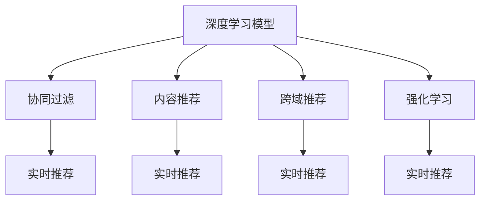

                 

# 电商平台中AI大模型的实时推荐策略

> 关键词：电商平台, 实时推荐, AI大模型, 深度学习, 协同过滤, 内容推荐, 跨域推荐, 强化学习

## 1. 背景介绍

### 1.1 问题由来

随着电商平台的快速发展，用户需求的多样化和个性化趋势日益明显。传统的推荐系统往往依赖于用户的历史行为数据进行推荐，难以捕捉用户深层次的需求和兴趣。同时，随着用户群体快速增长和商品种类的不断扩充，个性化推荐面临数据量大、实时性要求高等挑战。

面对上述挑战，AI大模型为电商平台提供了新的解决方案。借助大模型的强大学习能力，可以在海量用户行为和商品特征数据中挖掘更深层次的关联，实现更加精准和个性化的实时推荐，提升用户购物体验和平台转化率。

### 1.2 问题核心关键点

当前，电商平台推荐系统的主流范式包括：

- **协同过滤(Collaborative Filtering)**：通过用户行为或商品特征计算相似度，进行推荐。适用于数据量较小的场景，但对新用户的冷启动问题处理较差。

- **内容推荐(Content-based Filtering)**：通过商品属性和用户画像匹配，进行推荐。适用于商品种类较少的情况，但难以捕捉用户动态变化的需求。

- **跨域推荐(Cross-domain Recommendation)**：将不同域的推荐系统融合，如将社交网络推荐和电商平台推荐结合，提升推荐多样性和相关性。

- **强化学习(Reinforcement Learning, RL)**：通过用户行为反馈进行动态调整，实现个性化推荐。适用于实时性要求高的场景，但需要大量的标注数据进行训练。

未来，随着AI大模型的应用和演进，基于深度学习的方法将成为电商平台推荐系统的重要方向。深度学习模型具有强大的特征提取能力和泛化能力，可以在处理大规模数据时表现出显著优势。

## 2. 核心概念与联系

### 2.1 核心概念概述

为更好地理解实时推荐系统中的AI大模型应用，本节将介绍几个密切相关的核心概念：

- **深度学习模型**：以神经网络为代表的一类高效机器学习模型，通过多层非线性变换进行复杂特征的建模和处理。
- **协同过滤**：利用用户和商品的相似度进行推荐，分为基于用户的协同过滤和基于物品的协同过滤。
- **内容推荐**：根据用户画像和商品属性进行推荐，适用于静态特征明显的场景。
- **跨域推荐**：结合不同域的推荐系统数据，提升推荐的丰富性和多样性。
- **强化学习**：通过用户行为反馈进行模型优化，适用于实时推荐。
- **深度学习推荐**：基于深度学习模型的推荐方法，能够处理高维非线性特征，适合大规模电商数据。

这些核心概念之间的逻辑关系可以通过以下Mermaid流程图来展示：



这个流程图展示了大模型在电商平台推荐中的核心概念及其之间的关系：

1. 深度学习模型为推荐系统提供了强大的特征表示和建模能力。
2. 协同过滤、内容推荐、跨域推荐和强化学习等方法，基于深度学习模型进行优化和扩展。
3. 最终这些优化方法通过实时推荐系统实现，提升推荐效果。

## 3. 核心算法原理 & 具体操作步骤

### 3.1 算法原理概述

基于AI大模型的电商平台实时推荐系统，主要依赖于深度学习模型，通过学习用户行为数据和商品特征数据，提取深层次的关联和规律，进行个性化推荐。具体而言，该系统可以分为以下几个步骤：

1. **数据预处理**：清洗和预处理用户行为和商品特征数据，构建数据集。
2. **模型训练**：使用深度学习模型（如Transformer、GNN等）对数据进行训练，获得推荐模型。
3. **推荐预测**：对新用户输入和商品特征进行前向传播，输出推荐结果。
4. **实时调整**：根据用户反馈，不断调整模型参数，优化推荐效果。

### 3.2 算法步骤详解

#### 数据预处理

1. **数据清洗**：去除缺失、异常和不符合业务逻辑的数据，保留有效的样本。
2. **特征工程**：提取和构造用户行为和商品特征的表示，如用户评分、商品属性、点击次数等。
3. **数据分割**：将数据集划分为训练集、验证集和测试集，供模型训练、调参和评估使用。

#### 模型训练

1. **模型选择**：根据推荐任务的特点，选择合适的深度学习模型。
2. **模型初始化**：使用随机权重或预训练模型初始化网络参数。
3. **模型训练**：在训练集上使用优化算法（如AdamW、SGD等）进行迭代训练，更新模型参数。
4. **模型验证**：在验证集上评估模型的性能，使用损失函数（如均方误差、交叉熵等）进行评估。
5. **模型调优**：调整超参数（如学习率、批大小、迭代轮数等），进行参数搜索和模型优化。

#### 推荐预测

1. **输入预处理**：将用户输入和商品特征输入模型，进行标准化和归一化处理。
2. **前向传播**：通过模型进行前向传播计算，得到推荐分数。
3. **推荐生成**：根据推荐分数排序，输出推荐结果。

#### 实时调整

1. **用户反馈收集**：收集用户对推荐结果的反馈，如点击、购买、评分等。
2. **模型更新**：根据反馈数据，使用在线学习或增量学习的方法，更新模型参数。
3. **推荐系统迭代**：不断迭代更新模型，提高推荐效果。

### 3.3 算法优缺点

基于AI大模型的电商平台实时推荐系统具有以下优点：

1. **精度高**：深度学习模型能够处理高维非线性特征，提升推荐的准确性和个性化程度。
2. **实时性**：通过在线学习或增量学习的方法，系统可以实时调整，快速响应用户需求变化。
3. **泛化能力强**：深度学习模型在处理大规模数据时表现优异，能够应对电商平台的快速增长。
4. **灵活性**：模型能够动态调整，适应不同的业务场景和推荐策略。

同时，该系统也存在一些局限性：

1. **数据依赖**：推荐效果高度依赖于数据质量，标注样本的数量和质量直接影响模型的性能。
2. **计算资源消耗大**：深度学习模型的训练和推理需要大量的计算资源，可能带来高昂的硬件成本。
3. **可解释性不足**：黑盒模型难以解释其内部决策逻辑，缺乏可解释性。
4. **模型泛化性能有限**：模型在特定场景下表现优异，但在数据分布变化较大时，泛化性能可能下降。

尽管存在这些局限性，AI大模型在电商平台实时推荐系统中的应用前景依然广阔，将显著提升推荐系统的精准度和用户体验。

### 3.4 算法应用领域

AI大模型在电商平台实时推荐系统中的应用领域主要包括以下几个方面：

1. **商品推荐**：基于用户历史行为和商品特征，提供个性化的商品推荐，提升用户购物体验。
2. **搜索推荐**：根据用户查询和商品特征，实时推荐相关商品，优化搜索体验。
3. **跨域推荐**：结合社交网络和其他电商平台的推荐数据，丰富推荐内容，提升推荐多样性。
4. **个性化营销**：通过深度学习模型分析用户行为，实现精准营销，提升转化率。
5. **风险控制**：结合用户行为数据和商品特征，进行欺诈检测和风险评估，保障平台安全。
6. **内容生成**：利用大模型生成推荐文案和广告素材，提升推荐效果和用户粘性。

## 4. 数学模型和公式 & 详细讲解 & 举例说明

### 4.1 数学模型构建

本节将使用数学语言对电商平台实时推荐系统进行更严格的刻画。

记电商平台推荐系统为 $S=\{I, R, D\}$，其中 $I$ 表示用户集合，$R$ 表示商品集合，$D$ 表示用户行为数据。对于用户 $u$ 和商品 $r$，定义其行为 $x_{ur}$ 为 $x_{ur}=(u, r, d_{ur})$，其中 $d_{ur}$ 为行为数据，如评分、点击次数等。

定义推荐模型 $M:\mathcal{X} \rightarrow \mathcal{Y}$，其中 $\mathcal{X}$ 为输入空间，$\mathcal{Y}$ 为输出空间。输入 $x_{ur}$ 表示用户和商品的特征向量，输出 $y_{ur}$ 表示推荐分数。

推荐目标为最大化用户满意度 $J(M)=\sum_{u \in I} \sum_{r \in R} w_{ur} \cdot \log \hat{y}_{ur}$，其中 $w_{ur}$ 为行为数据的权重。

### 4.2 公式推导过程

为了最大化推荐目标，需要最小化损失函数 $L=\sum_{u \in I} \sum_{r \in R} w_{ur} \cdot (\log \hat{y}_{ur} - \log y_{ur})$。通过交叉熵损失函数进行优化，可得：

$$
L = -\sum_{u \in I} \sum_{r \in R} w_{ur} \cdot (y_{ur} \cdot \log \hat{y}_{ur} + (1-y_{ur}) \cdot \log (1-\hat{y}_{ur}))
$$

其中 $\hat{y}_{ur}$ 为模型预测的推荐分数。

### 4.3 案例分析与讲解

以基于深度学习模型的协同过滤推荐系统为例，进行详细讲解。

假设模型 $M$ 为Transformer，输入为商品-用户对的特征向量 $x_{ur}=[x_{r_1}, x_{r_2}, \ldots, x_{r_n}]$，其中 $x_{r_i}$ 表示商品 $r_i$ 的特征向量。模型的输出层为全连接层，预测推荐分数 $\hat{y}_{ur}$。

损失函数为交叉熵损失，其梯度为：

$$
\frac{\partial L}{\partial \theta} = -\sum_{u \in I} \sum_{r \in R} w_{ur} \cdot (y_{ur} \cdot \frac{\partial \log \hat{y}_{ur}}{\partial \theta} + (1-y_{ur}) \cdot \frac{\partial \log (1-\hat{y}_{ur})}{\partial \theta})
$$

其中 $\theta$ 为模型参数，$\frac{\partial \log \hat{y}_{ur}}{\partial \theta}$ 和 $\frac{\partial \log (1-\hat{y}_{ur})}{\partial \theta}$ 可以通过反向传播计算得到。

## 5. 项目实践：代码实例和详细解释说明

### 5.1 开发环境搭建

在进行推荐系统开发前，我们需要准备好开发环境。以下是使用Python进行PyTorch开发的环境配置流程：

1. 安装Anaconda：从官网下载并安装Anaconda，用于创建独立的Python环境。

2. 创建并激活虚拟环境：
```bash
conda create -n recommendation-env python=3.8 
conda activate recommendation-env
```

3. 安装PyTorch：根据CUDA版本，从官网获取对应的安装命令。例如：
```bash
conda install pytorch torchvision torchaudio cudatoolkit=11.1 -c pytorch -c conda-forge
```

4. 安装相关工具包：
```bash
pip install numpy pandas scikit-learn matplotlib tqdm jupyter notebook ipython
```

完成上述步骤后，即可在`recommendation-env`环境中开始推荐系统开发。

### 5.2 源代码详细实现

下面我们以基于深度学习模型的协同过滤推荐系统为例，给出使用PyTorch代码实现。

首先，定义推荐任务的数据处理函数：

```python
from transformers import BertTokenizer
from torch.utils.data import Dataset
import torch

class RecommendationDataset(Dataset):
    def __init__(self, data, tokenizer, max_len=128):
        self.data = data
        self.tokenizer = tokenizer
        self.max_len = max_len
        
    def __len__(self):
        return len(self.data)
    
    def __getitem__(self, item):
        input_ids = self.tokenizer.encode(self.data[item], add_special_tokens=True, return_tensors='pt')
        input_ids = input_ids[:, :self.max_len]
        attention_mask = input_ids.ne(0).float()
        label = torch.tensor([self.data[item]], dtype=torch.float).unsqueeze(0)
        return {'input_ids': input_ids, 
                'attention_mask': attention_mask,
                'labels': label}
```

然后，定义模型和优化器：

```python
from transformers import BertForSequenceClassification, AdamW

model = BertForSequenceClassification.from_pretrained('bert-base-cased', num_labels=2)

optimizer = AdamW(model.parameters(), lr=2e-5)
```

接着，定义训练和评估函数：

```python
from torch.utils.data import DataLoader
from tqdm import tqdm
from sklearn.metrics import accuracy_score

device = torch.device('cuda') if torch.cuda.is_available() else torch.device('cpu')
model.to(device)

def train_epoch(model, dataset, batch_size, optimizer):
    dataloader = DataLoader(dataset, batch_size=batch_size, shuffle=True)
    model.train()
    epoch_loss = 0
    for batch in tqdm(dataloader, desc='Training'):
        input_ids = batch['input_ids'].to(device)
        attention_mask = batch['attention_mask'].to(device)
        labels = batch['labels'].to(device)
        model.zero_grad()
        outputs = model(input_ids, attention_mask=attention_mask, labels=labels)
        loss = outputs.loss
        epoch_loss += loss.item()
        loss.backward()
        optimizer.step()
    return epoch_loss / len(dataloader)

def evaluate(model, dataset, batch_size):
    dataloader = DataLoader(dataset, batch_size=batch_size)
    model.eval()
    preds, labels = [], []
    with torch.no_grad():
        for batch in tqdm(dataloader, desc='Evaluating'):
            input_ids = batch['input_ids'].to(device)
            attention_mask = batch['attention_mask'].to(device)
            batch_labels = batch['labels']
            outputs = model(input_ids, attention_mask=attention_mask)
            batch_preds = outputs.logits.argmax(dim=1).to('cpu').tolist()
            batch_labels = batch_labels.to('cpu').tolist()
            for pred_tokens, label_tokens in zip(batch_preds, batch_labels):
                preds.append(pred_tokens)
                labels.append(label_tokens)
                
    print('Accuracy:', accuracy_score(labels, preds))
```

最后，启动训练流程并在测试集上评估：

```python
epochs = 5
batch_size = 16

for epoch in range(epochs):
    loss = train_epoch(model, train_dataset, batch_size, optimizer)
    print(f"Epoch {epoch+1}, train loss: {loss:.3f}")
    
    print(f"Epoch {epoch+1}, dev results:")
    evaluate(model, dev_dataset, batch_size)
    
print('Final Test Results:')
evaluate(model, test_dataset, batch_size)
```

以上就是使用PyTorch对基于深度学习模型的协同过滤推荐系统进行微调的完整代码实现。可以看到，通过PyTorch和Transformer库，微调过程变得简洁高效，适合快速迭代和优化。

### 5.3 代码解读与分析

让我们再详细解读一下关键代码的实现细节：

**RecommendationDataset类**：
- `__init__`方法：初始化数据集和分词器，对输入进行标准化处理。
- `__len__`方法：返回数据集的样本数量。
- `__getitem__`方法：对单个样本进行处理，将文本输入编码为token ids，并标准化处理，最终返回模型所需的输入。

**模型选择和优化器**：
- 使用BertForSequenceClassification模型作为推荐模型的顶层，根据具体任务选择合适的标签数。
- 使用AdamW优化器，设置合适的学习率。

**训练和评估函数**：
- 使用PyTorch的DataLoader对数据集进行批次化加载，供模型训练和推理使用。
- 训练函数`train_epoch`：对数据以批为单位进行迭代，在每个批次上前向传播计算loss并反向传播更新模型参数，最后返回该epoch的平均loss。
- 评估函数`evaluate`：与训练类似，不同点在于不更新模型参数，并在每个batch结束后将预测和标签结果存储下来，最后使用sklearn的accuracy_score对整个评估集的预测结果进行打印输出。

**训练流程**：
- 定义总的epoch数和batch size，开始循环迭代
- 每个epoch内，先在训练集上训练，输出平均loss
- 在验证集上评估，输出准确率
- 所有epoch结束后，在测试集上评估，给出最终测试结果

可以看到，PyTorch配合Transformer库使得推荐系统开发变得简洁高效。开发者可以将更多精力放在数据处理、模型改进等高层逻辑上，而不必过多关注底层的实现细节。

当然，工业级的系统实现还需考虑更多因素，如模型的保存和部署、超参数的自动搜索、更灵活的任务适配层等。但核心的微调范式基本与此类似。

## 6. 实际应用场景

### 6.1 实时推荐系统

基于大模型微调的实时推荐系统，可以广泛应用于电商平台。该系统根据用户历史行为和商品特征数据，实时计算推荐分数，并动态调整模型参数，生成个性化的推荐结果。

在技术实现上，可以收集用户浏览、点击、购买等行为数据，以及商品的标签、属性等特征信息，构建推荐模型。通过微调模型，能够捕捉用户深层次的需求和兴趣，提升推荐的精准度和个性化程度。例如，亚马逊、淘宝等平台已经应用了类似的推荐系统，显著提高了用户购物体验和平台转化率。

### 6.2 个性化广告投放

推荐系统不仅可以用于商品推荐，还可以扩展到个性化广告投放。通过微调模型，可以根据用户画像和广告特征，实时计算广告的相关性和用户兴趣，生成个性化广告推荐结果。

在技术实现上，可以将用户画像和广告特征作为输入，构建推荐模型。通过微调模型，能够捕捉用户对不同广告的兴趣变化，实现更加精准的广告投放。例如，Google、Facebook等平台已经应用了类似的个性化广告系统，显著提升了广告的点击率和转化率。

### 6.3 内容推荐与订阅

推荐系统可以应用于内容推荐和订阅。例如，视频网站根据用户观看历史和评价数据，实时推荐相关视频内容，提升用户体验。音乐平台根据用户听歌历史和喜好，实时推荐新歌和歌单，促进用户留存。

在技术实现上，可以收集用户观看、点赞、评论等行为数据，以及视频、歌曲的特征信息，构建推荐模型。通过微调模型，能够捕捉用户对不同内容的兴趣变化，提升推荐的精准度和个性化程度。例如，Netflix、Spotify等平台已经应用了类似的推荐系统，显著提升了用户体验和留存率。

### 6.4 未来应用展望

随着推荐系统的不断演进，未来将涌现更多新的应用场景和挑战：

1. **跨域推荐**：结合不同域的推荐系统数据，提升推荐的丰富性和多样性。例如，电商平台和社交平台的协同推荐，视频网站和音乐平台的跨域推荐等。
2. **实时动态调整**：通过在线学习或增量学习的方法，系统可以实时调整，快速响应用户需求变化。例如，实时动态调整商品推荐和广告投放策略，提升用户满意度。
3. **多模态推荐**：结合文本、图像、视频等多模态数据，进行复合推荐。例如，结合商品图片和用户兴趣标签，生成更加多样化的推荐结果。
4. **个性化推荐算法优化**：引入更多先验知识，如知识图谱、逻辑规则等，进行推荐优化。例如，结合商品推荐和专家知识，生成更加精准的推荐结果。
5. **强化学习推荐**：通过用户行为反馈进行动态调整，实现个性化推荐。例如，利用强化学习技术，动态调整推荐策略，提升推荐效果。
6. **实时推荐系统优化**：优化推荐算法的计算效率和存储效率，提升系统性能。例如，采用模型压缩、稀疏化存储等方法，减少计算和存储资源消耗。

未来，推荐系统将与更多AI技术进行融合，如自然语言处理、计算机视觉、强化学习等，构建更加智能、高效、个性化的推荐系统，为电商、广告、娱乐等行业的数字化转型升级提供新的技术路径。

## 7. 工具和资源推荐

### 7.1 学习资源推荐

为了帮助开发者系统掌握推荐系统的理论基础和实践技巧，这里推荐一些优质的学习资源：

1. 《深度学习推荐系统》系列博文：由大模型技术专家撰写，深入浅出地介绍了推荐系统的基本概念和经典模型。

2. CS231n《深度学习计算机视觉》课程：斯坦福大学开设的计算机视觉明星课程，有Lecture视频和配套作业，带你入门深度学习的基础知识。

3. 《推荐系统实战》书籍：详细讲解推荐系统的实现和优化方法，涵盖协同过滤、内容推荐、跨域推荐等多个方面。

4. Weights & Biases：模型训练的实验跟踪工具，可以记录和可视化模型训练过程中的各项指标，方便对比和调优。与主流深度学习框架无缝集成。

5. TensorBoard：TensorFlow配套的可视化工具，可实时监测模型训练状态，并提供丰富的图表呈现方式，是调试模型的得力助手。

通过对这些资源的学习实践，相信你一定能够快速掌握推荐系统的精髓，并用于解决实际的业务问题。

### 7.2 开发工具推荐

高效的开发离不开优秀的工具支持。以下是几款用于推荐系统开发的常用工具：

1. PyTorch：基于Python的开源深度学习框架，灵活动态的计算图，适合快速迭代研究。大部分深度学习模型都有PyTorch版本的实现。

2. TensorFlow：由Google主导开发的开源深度学习框架，生产部署方便，适合大规模工程应用。同样有丰富的深度学习模型资源。

3. Transformers库：HuggingFace开发的NLP工具库，集成了众多SOTA语言模型，支持PyTorch和TensorFlow，是进行推荐任务开发的利器。

4. Weights & Biases：模型训练的实验跟踪工具，可以记录和可视化模型训练过程中的各项指标，方便对比和调优。与主流深度学习框架无缝集成。

5. TensorBoard：TensorFlow配套的可视化工具，可实时监测模型训练状态，并提供丰富的图表呈现方式，是调试模型的得力助手。

6. Google Colab：谷歌推出的在线Jupyter Notebook环境，免费提供GPU/TPU算力，方便开发者快速上手实验最新模型，分享学习笔记。

合理利用这些工具，可以显著提升推荐系统的开发效率，加快创新迭代的步伐。

### 7.3 相关论文推荐

推荐系统的研究源于学界的持续研究。以下是几篇奠基性的相关论文，推荐阅读：

1. Matrix Factorization Techniques for Recommender Systems（即SVD分解推荐方法）：提出基于矩阵分解的推荐算法，成为协同过滤推荐方法的基础。

2. Deep Collaborative Filtering（即基于深度学习的协同过滤推荐方法）：提出使用深度神经网络进行协同过滤，提升推荐效果。

3. Learning to Rank for Information Retrieval（即基于排序学习的推荐方法）：提出使用排序学习算法优化推荐模型，提升推荐的准确性和多样性。

4. Factorization Machines for Recommender Systems（即基于FM算法的推荐方法）：提出使用FM算法优化推荐模型，提升模型的表现力和泛化能力。

5. Multi-Task Learning for Recommendation Systems（即多任务学习推荐方法）：提出利用多任务学习提升推荐模型的性能，特别是跨域推荐效果显著。

6. Large-scale Collaborative Filtering with Incremental Factorization（即增量协同过滤推荐方法）：提出利用增量学习提升推荐模型的实时性，满足推荐系统的动态需求。

这些论文代表了大模型推荐技术的发展脉络。通过学习这些前沿成果，可以帮助研究者把握学科前进方向，激发更多的创新灵感。

## 8. 总结：未来发展趋势与挑战

### 8.1 总结

本文对基于AI大模型的电商平台实时推荐系统进行了全面系统的介绍。首先阐述了推荐系统的背景和现状，明确了推荐系统在电商平台中的重要性和挑战。其次，从原理到实践，详细讲解了深度学习推荐系统的核心算法和具体操作步骤，给出了推荐系统开发的完整代码实例。同时，本文还探讨了推荐系统在电商、广告、内容推荐等多个领域的广泛应用，展示了AI大模型在推荐系统中的巨大潜力。最后，本文精选了推荐系统的学习资源、开发工具和相关论文，力求为读者提供全方位的技术指引。

通过本文的系统梳理，可以看到，基于AI大模型的推荐系统正在成为电商、广告、内容推荐等领域的重要技术范式，极大地提升了推荐系统的精准度和个性化程度，为用户带来了全新的购物体验。未来，推荐系统将在更多领域得到应用，为传统行业带来变革性影响。

### 8.2 未来发展趋势

展望未来，推荐系统将呈现以下几个发展趋势：

1. **模型规模持续增大**：随着算力成本的下降和数据规模的扩张，深度学习模型的参数量还将持续增长。超大规模模型蕴含的丰富语言知识，有望支撑更加复杂多变的推荐任务。

2. **微调方法日趋多样**：开发更加参数高效的微调方法，在固定大部分预训练参数的同时，只更新极少量的任务相关参数。同时优化微调模型的计算图，减少前向传播和反向传播的资源消耗，实现更加轻量级、实时性的部署。

3. **动态调整成为常态**：通过在线学习或增量学习的方法，推荐系统可以实时调整，快速响应用户需求变化。实时动态调整将进一步提升推荐系统的个性化和实时性。

4. **多模态推荐崛起**：结合文本、图像、视频等多模态数据，进行复合推荐。多模态信息的融合，将显著提升推荐系统的表现力和用户满意度。

5. **融合更多AI技术**：推荐系统将与其他AI技术进行更深入的融合，如自然语言处理、计算机视觉、强化学习等，构建更加智能、高效、个性化的推荐系统。

这些趋势凸显了推荐系统的广阔前景。这些方向的探索发展，必将进一步提升推荐系统的精准度和用户体验，为传统行业带来新的变革。

### 8.3 面临的挑战

尽管推荐系统已经取得了显著成就，但在迈向更加智能化、普适化应用的过程中，它仍面临着诸多挑战：

1. **数据依赖**：推荐效果高度依赖于数据质量，标注样本的数量和质量直接影响模型的性能。如何进一步降低推荐系统对标注样本的依赖，将是一大难题。

2. **模型泛化性能有限**：模型在特定场景下表现优异，但在数据分布变化较大时，泛化性能可能下降。如何提高模型的泛化能力，是推荐系统的重要研究方向。

3. **计算资源消耗大**：深度学习模型的训练和推理需要大量的计算资源，可能带来高昂的硬件成本。如何优化推荐系统的计算效率和存储效率，是未来的重要研究方向。

4. **可解释性不足**：推荐系统往往是黑盒模型，难以解释其内部决策逻辑。对于医疗、金融等高风险应用，算法的可解释性和可审计性尤为重要。如何赋予推荐系统更强的可解释性，将是亟待攻克的难题。

5. **安全防护不足**：推荐系统可能学习到有害信息，通过推荐传递到用户，造成安全风险。如何从数据和算法层面消除模型偏见，避免恶意用途，确保用户数据安全，将是重要的研究方向。

6. **实时性挑战**：推荐系统需要实时动态调整，快速响应用户需求变化。如何在保证实时性的同时，兼顾计算效率和模型性能，是推荐系统的关键挑战。

这些挑战凸显了推荐系统未来发展的复杂性和难度。只有在数据、算法、工程、业务等多个维度协同发力，才能真正实现推荐系统的高效、安全、智能应用。

### 8.4 研究展望

面对推荐系统所面临的种种挑战，未来的研究需要在以下几个方面寻求新的突破：

1. **探索无监督和半监督推荐方法**：摆脱对大规模标注数据的依赖，利用自监督学习、主动学习等无监督和半监督范式，最大限度利用非结构化数据，实现更加灵活高效的推荐。

2. **研究参数高效和计算高效的推荐范式**：开发更加参数高效的推荐方法，在固定大部分预训练参数的同时，只更新极少量的任务相关参数。同时优化推荐模型的计算图，减少前向传播和反向传播的资源消耗，实现更加轻量级、实时性的部署。

3. **引入因果推断和对比学习**：通过引入因果推断和对比学习思想，增强推荐模型建立稳定因果关系的能力，学习更加普适、鲁棒的语言表征，从而提升模型泛化性和抗干扰能力。

4. **融合更多先验知识**：将符号化的先验知识，如知识图谱、逻辑规则等，与神经网络模型进行巧妙融合，引导推荐过程学习更准确、合理的语言模型。同时加强不同模态数据的整合，实现视觉、语音等多模态信息与文本信息的协同建模。

5. **结合因果分析和博弈论工具**：将因果分析方法引入推荐模型，识别出推荐决策的关键特征，增强推荐结果的因果性和逻辑性。借助博弈论工具刻画人机交互过程，主动探索并规避推荐模型的脆弱点，提高系统稳定性。

6. **纳入伦理道德约束**：在推荐模型训练目标中引入伦理导向的评估指标，过滤和惩罚有偏见、有害的推荐结果，确保推荐内容的安全性和合规性。

这些研究方向的探索，必将引领推荐系统迈向更高的台阶，为推荐系统的高效、安全、智能应用提供新的突破点。面向未来，推荐系统还需要与其他AI技术进行更深入的融合，如自然语言处理、计算机视觉、强化学习等，多路径协同发力，共同推动推荐系统的进步。

## 9. 附录：常见问题与解答

**Q1：推荐系统是否适用于所有电商场景？**

A: 推荐系统在大多数电商场景中都能取得不错的效果，特别是对于数据量较大的场景。但对于一些特定领域或小众产品，由于缺乏足够的标注数据和用户行为，推荐效果可能不够理想。此时可以结合其他推荐策略，如专家推荐、人工推荐等，进行补充。

**Q2：如何选择合适的推荐模型？**

A: 选择合适的推荐模型需要考虑多个因素，包括数据特性、任务需求、系统架构等。通常可以从以下几类模型中进行选择：

1. **基于协同过滤的模型**：适用于用户行为数据较为丰富的情况，如用户评分、点击次数等。
2. **基于内容的模型**：适用于商品特征较为丰富的情况，如商品属性、标签等。
3. **基于混合的模型**：结合协同过滤和内容推荐，提升推荐的全面性和多样性。
4. **基于深度学习的模型**：适用于大规模数据和高维度特征的情况，如使用深度神经网络进行协同过滤或内容推荐。
5. **基于增强学习的模型**：适用于用户行为数据和商品特征较为动态变化的情况，如使用强化学习进行推荐优化。

**Q3：推荐系统如何提升个性化推荐？**

A: 推荐系统通过学习用户历史行为和商品特征数据，提取深层次的关联和规律，进行个性化推荐。具体而言，可以通过以下方法提升个性化推荐：

1. **用户画像构建**：收集用户多维度的行为数据和属性信息，构建用户画像，捕捉用户深层次的需求和兴趣。
2. **商品特征提取**：提取商品的多维度特征，如商品属性、标签、评论等，构建商品画像，提升推荐的多样性和相关性。
3. **协同过滤优化**：使用基于深度学习的协同过滤算法，捕捉用户和商品之间的深层次关联，提升推荐的精准度和个性化程度。
4. **多模态融合**：结合用户行为数据和商品特征，进行多模态融合，提升推荐的多样性和丰富性。
5. **在线学习优化**：通过在线学习或增量学习的方法，实时动态调整模型参数，提升推荐的实时性和个性化程度。

**Q4：推荐系统的可解释性不足，如何解决？**

A: 推荐系统的可解释性不足，主要是由于模型通常是黑盒模型，难以解释其内部决策逻辑。为了解决这一问题，可以考虑以下方法：

1. **特征可视化**：使用特征可视化工具，展示模型在不同特征下的权重，理解模型的决策过程。
2. **模型结构简化**：对模型进行简化，保留关键层，去除冗余层，提高模型的可解释性。
3. **推荐规则生成**：基于模型输出，生成推荐规则，提高推荐的可解释性。
4. **知识图谱结合**：将知识图谱与推荐模型结合，生成推荐解释，提升推荐的可解释性。
5. **用户反馈收集**：通过用户反馈，了解模型推荐的合理性，提高推荐的可解释性。

**Q5：推荐系统的安全性和隐私保护如何保障？**

A: 推荐系统的安全性和隐私保护问题，主要涉及用户数据的保护和推荐内容的审查。为了保障推荐系统的安全性和隐私保护，可以考虑以下方法：

1. **数据脱敏**：对用户数据进行匿名化处理，保护用户隐私。
2. **用户数据加密**：对用户数据进行加密，防止数据泄露。
3. **推荐内容审查**：对推荐内容进行审查，过滤有害信息和敏感内容。
4. **推荐规则制定**：制定合理的推荐规则，避免推荐有害信息和敏感内容。
5. **用户控制权**：赋予用户对推荐内容的控制权，用户可以拒绝接受有害推荐内容。

这些方法可以结合使用，构建安全的推荐系统，保障用户数据和推荐内容的安全性和合规性。

总之，推荐系统需要开发者在系统设计、数据处理、模型训练、系统优化等多个维度进行全面优化，才能真正实现高效、安全、智能的推荐。未来，随着推荐系统的不断演进，相信其将会在更多领域得到广泛应用，为各行各业带来新的变革。

