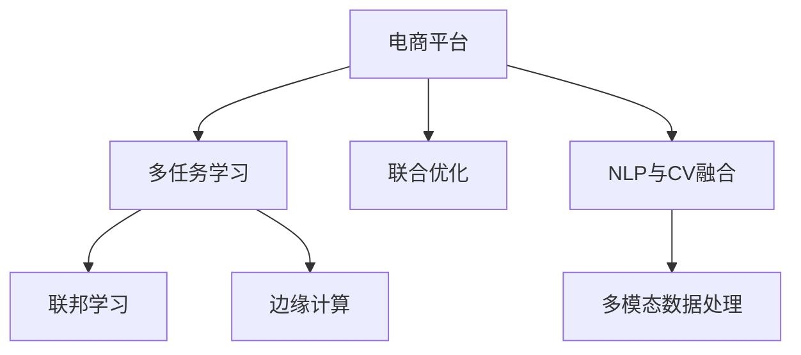

                 

# 电商平台中的多场景多任务学习：AI大模型的优势

> 关键词：AI大模型,多任务学习,电商平台,推荐系统,图像识别,自然语言处理,联邦学习,边缘计算

## 1. 背景介绍

在数字化转型加速的今天，电商平台已成为消费者购物的主要渠道。传统电商平台基于人工设计的特征工程和规则，已难以适应日益丰富的电商场景和不断变化的消费者需求。通过引入AI大模型，电商平台能够自动抽取和理解多源数据，实现自动化决策，为商家和消费者创造更大的价值。

### 1.1 问题由来

现代电商平台由多个子系统构成，包括推荐系统、搜索系统、广告系统、客服系统、库存系统等，每个系统均需要大量的AI算法模型进行支持。传统的独立开发、单独训练的模式，不仅开发成本高，模型效果也难以保证。

如何在大规模电商数据中实现高效的多场景多任务学习，成为电商平台AI技术落地的关键问题。AI大模型提供了全新的解决方案，它可以在同一模型基础上，高效地完成多个任务的学习和优化，提升电商平台的整体智能化水平。

### 1.2 问题核心关键点
在电商平台中，多场景多任务学习主要涉及以下几个关键点：

- **多任务建模**：同一模型同时支持多个电商任务，如推荐、搜索、广告等。
- **联合优化**：多个任务联合优化，通过共享模型参数，实现高效的多任务学习。
- **泛化能力**：模型能够在不同任务间泛化，避免单一任务上的过拟合。
- **计算效率**：模型能够在保证效果的前提下，减少计算资源消耗。
- **隐私保护**：保护消费者隐私，避免数据泄露风险。

本文聚焦于大模型在电商平台中的应用，探讨如何高效地实现多场景多任务学习，提升电商平台的智能决策和用户体验。

## 2. 核心概念与联系

### 2.1 核心概念概述

为更好地理解多场景多任务学习，本节将介绍几个密切相关的核心概念：

- **AI大模型**：指基于深度学习框架训练的庞大模型，通常参数量在亿级别，具有强大的表征能力，能够学习到丰富的语义和特征信息。
- **多任务学习(Multitask Learning, MTL)**：指在同一模型上同时学习多个相关任务的技术，通过共享模型参数和特征表示，提高模型整体性能。
- **联合优化(Joint Optimization)**：指在模型训练过程中，多个任务同时优化，通过梯度聚合等方式实现参数联合更新。
- **联邦学习(Federated Learning)**：指在保护用户隐私的前提下，通过分布式计算和梯度聚合，实现多个独立数据源上的模型联合优化。
- **边缘计算(Edge Computing)**：指在模型推理过程中，将部分计算任务下放到靠近数据源的计算设备上，减少网络延迟和带宽消耗，提升推理速度。
- **NLP与CV融合**：指将自然语言处理和计算机视觉技术结合，提升电商平台多模态数据的理解和处理能力。

这些核心概念之间的逻辑关系可以通过以下Mermaid流程图来展示：



这个流程图展示了大模型在电商平台中的应用核心概念及其之间的关系：

1. 电商平台使用多任务学习和大模型，实现高效的多场景多任务建模。
2. 联合优化和多任务学习，使得不同任务可以共享模型参数和特征表示，提升模型性能。
3. 联邦学习保护用户隐私，通过分布式计算实现模型联合优化。
4. 边缘计算提升推理速度，减少网络延迟和带宽消耗。
5. NLP与CV融合，提升多模态数据的理解和处理能力。

这些概念共同构成了大模型在电商平台中的应用框架，使其能够在多个电商场景中发挥强大的智能决策和用户体验提升能力。

## 3. 核心算法原理 & 具体操作步骤
### 3.1 算法原理概述

基于AI大模型的多场景多任务学习，本质上是通过多任务学习框架，在单一大模型上实现多个电商任务的联合优化。其核心思想是：通过多任务联合优化，使得模型在多个任务上都能获得良好的泛化性能，避免单一任务上的过拟合。

形式化地，设模型为 $M_{\theta}$，其中 $\theta$ 为模型参数。假设电商平台上有多个相关任务 $T_1, T_2, \cdots, T_n$，每个任务的目标为 $L_i(\theta)$，则联合优化目标为：

$$
\min_{\theta} \sum_{i=1}^n \alpha_i L_i(\theta)
$$

其中 $\alpha_i$ 为任务 $T_i$ 的权重，控制每个任务在联合优化中的贡献。通过梯度聚合，实现联合优化过程。

### 3.2 算法步骤详解

基于AI大模型的多场景多任务学习一般包括以下几个关键步骤：

**Step 1: 准备数据集和模型**

- 收集电商平台的多个任务数据集，如商品推荐数据、搜索点击数据、广告点击数据等。
- 选择合适的AI大模型，如BERT、GPT等，作为基础模型。

**Step 2: 设计任务适配层**

- 根据任务类型，在模型顶层设计合适的任务适配层，如推荐层、搜索层、广告层等。
- 每个任务适配层需对应一个损失函数，如交叉熵损失、均方误差损失等。

**Step 3: 设置多任务权重和超参数**

- 根据任务重要性和数据量，设置每个任务的目标函数权重 $\alpha_i$。
- 设置多任务联合优化的超参数，如学习率、批大小、迭代轮数等。

**Step 4: 执行联合优化**

- 使用梯度聚合方法，如FedAvg、FedProx等，实现多任务联合优化。
- 将任务数据集分批次输入模型，计算每个任务的梯度，并根据权重进行聚合。
- 反向传播更新模型参数，重复执行直至收敛。

**Step 5: 模型部署与评估**

- 将训练好的模型部署到电商平台的各个子系统中，如推荐系统、搜索系统等。
- 在实际电商场景中进行A/B测试，评估模型效果。

以上是基于AI大模型的多场景多任务学习的关键流程。在实际应用中，还需要根据具体任务和数据特点，对模型架构和训练过程进行优化设计，如引入对抗训练、正则化等技术，提升模型鲁棒性和泛化能力。

### 3.3 算法优缺点

基于AI大模型的多场景多任务学习具有以下优点：

1. 高效性。通过共享模型参数和特征表示，避免重复训练，减少计算资源消耗。
2. 泛化能力强。模型能够在多个任务间泛化，提升整体性能。
3. 可扩展性。模型结构灵活，支持多种电商任务。
4. 适应性强。模型能够自动适应数据分布的变化，减少模型更新频率。

同时，该方法也存在一定的局限性：

1. 数据依赖。多任务学习依赖于高质量的多源数据，数据获取和预处理成本较高。
2. 模型复杂度。大模型的训练和推理资源消耗大，需要高性能的硬件设备。
3. 公平性。多任务联合优化可能牺牲部分任务的性能，确保公平性需要进一步优化。
4. 隐私保护。多任务学习需跨多个数据源进行联合优化，存在数据隐私风险。

尽管存在这些局限性，但就目前而言，基于AI大模型的多任务学习仍是电商平台实现智能化决策的重要手段。未来相关研究的重点在于如何进一步降低对数据和硬件的依赖，提高模型的公平性和隐私保护能力，同时兼顾可扩展性和性能。

### 3.4 算法应用领域

基于AI大模型的多场景多任务学习，在电商平台的多个子系统中得到广泛应用，例如：

- **推荐系统**：利用多任务学习提升推荐效果，减少单一商品的冷启动问题。
- **搜索系统**：通过联合优化搜索和点击数据，提升搜索结果的准确性和相关性。
- **广告系统**：将广告点击数据与商品推荐数据联合优化，实现精准投放。
- **客服系统**：结合多源数据和多任务学习，提升智能客服的响应速度和准确性。
- **库存管理**：通过多任务学习分析历史销售数据和库存数据，优化库存管理策略。

除了上述这些经典任务外，大模型多任务学习还被创新性地应用到更多场景中，如供应链优化、用户行为分析、个性化推荐等，为电商平台带来了新的突破。

## 4. 数学模型和公式 & 详细讲解 & 举例说明

### 4.1 数学模型构建

本节将使用数学语言对多场景多任务学习进行更加严格的刻画。

设电商平台的推荐系统、搜索系统、广告系统分别对应任务 $T_1, T_2, T_3$，任务的目标函数为 $L_1, L_2, L_3$，则多任务联合优化的目标函数为：

$$
\mathcal{L}(\theta) = \alpha_1 L_1(M_{\theta}) + \alpha_2 L_2(M_{\theta}) + \alpha_3 L_3(M_{\theta})
$$

其中 $\alpha_i$ 为任务 $T_i$ 的权重，控制每个任务在联合优化中的贡献。

### 4.2 公式推导过程

以推荐系统和搜索系统为例，推导多任务联合优化的损失函数和梯度计算公式。

假设推荐系统任务的目标为 $L_1$，搜索系统任务的目标为 $L_2$，两者共享模型参数 $\theta$。则在训练集上，两个任务的目标函数可以表示为：

$$
L_1(M_{\theta}) = \frac{1}{N_1} \sum_{i=1}^{N_1} l_1(x_i, y_i, M_{\theta})
$$

$$
L_2(M_{\theta}) = \frac{1}{N_2} \sum_{i=1}^{N_2} l_2(x_i, y_i, M_{\theta})
$$

其中 $l_1, l_2$ 分别为两个任务的目标函数，$x_i, y_i$ 分别为输入和标签。

多任务联合优化的目标函数为：

$$
\mathcal{L}(\theta) = \alpha_1 L_1(M_{\theta}) + \alpha_2 L_2(M_{\theta})
$$

将两个任务的目标函数代入，得：

$$
\mathcal{L}(\theta) = \frac{\alpha_1}{N_1} \sum_{i=1}^{N_1} l_1(x_i, y_i, M_{\theta}) + \frac{\alpha_2}{N_2} \sum_{i=1}^{N_2} l_2(x_i, y_i, M_{\theta})
$$

在得到联合优化目标函数后，可以对其进行梯度计算，使用梯度聚合方法（如FedAvg）进行联合优化。例如，FedAvg的梯度聚合公式为：

$$
\theta_{t+1} = \frac{1}{N} \sum_{i=1}^N \theta_t^i - \frac{\eta}{N} \sum_{i=1}^N g_i(\theta_t^i)
$$

其中 $g_i(\theta_t^i)$ 为任务 $i$ 在参数 $\theta_t^i$ 上的梯度，$\eta$ 为学习率，$N$ 为任务数。

### 4.3 案例分析与讲解

以商品推荐系统的多任务学习为例，分析其应用流程和效果提升。

**推荐系统**：
- **任务适配层**：设计推荐层，根据用户行为数据和商品特征，计算用户对商品的兴趣度。
- **联合优化**：将用户行为数据和商品特征数据联合优化，提升推荐效果。
- **效果评估**：在推荐系统上进行A/B测试，评估推荐模型效果。

具体来说，可以使用CTR点击率预测作为推荐任务的目标函数。通过多任务联合优化，使得推荐系统在减少冷启动问题、提升推荐多样性等方面都有显著提升。

## 5. 项目实践：代码实例和详细解释说明
### 5.1 开发环境搭建

在进行多场景多任务学习实践前，我们需要准备好开发环境。以下是使用Python进行PyTorch开发的环境配置流程：

1. 安装Anaconda：从官网下载并安装Anaconda，用于创建独立的Python环境。

2. 创建并激活虚拟环境：
```bash
conda create -n pytorch-env python=3.8 
conda activate pytorch-env
```

3. 安装PyTorch：根据CUDA版本，从官网获取对应的安装命令。例如：
```bash
conda install pytorch torchvision torchaudio cudatoolkit=11.1 -c pytorch -c conda-forge
```

4. 安装Transformers库：
```bash
pip install transformers
```

5. 安装各类工具包：
```bash
pip install numpy pandas scikit-learn matplotlib tqdm jupyter notebook ipython
```

完成上述步骤后，即可在`pytorch-env`环境中开始多场景多任务学习的实践。

### 5.2 源代码详细实现

下面我们以推荐系统和搜索系统的联合优化为例，给出使用Transformers库进行多场景多任务学习的PyTorch代码实现。

首先，定义推荐系统和搜索系统的数据处理函数：

```python
from transformers import BertTokenizer
from torch.utils.data import Dataset
import torch

class RecommendationDataset(Dataset):
    def __init__(self, user_ids, item_ids, labels, tokenizer, max_len=128):
        self.user_ids = user_ids
        self.item_ids = item_ids
        self.labels = labels
        self.tokenizer = tokenizer
        self.max_len = max_len
        
    def __len__(self):
        return len(self.user_ids)
    
    def __getitem__(self, item):
        user_id = self.user_ids[item]
        item_id = self.item_ids[item]
        label = self.labels[item]
        
        encoding = self.tokenizer(user_id, item_id, return_tensors='pt', max_length=self.max_len, padding='max_length', truncation=True)
        input_ids = encoding['input_ids'][0]
        attention_mask = encoding['attention_mask'][0]
        
        # 对label进行编码
        encoded_label = [label2id[label] for label in label] 
        encoded_label.extend([label2id['negative']] * (self.max_len - len(encoded_label)))
        labels = torch.tensor(encoded_label, dtype=torch.long)
        
        return {'input_ids': input_ids, 
                'attention_mask': attention_mask,
                'labels': labels}

class SearchDataset(Dataset):
    def __init__(self, query_ids, document_ids, clicks, tokenizer, max_len=128):
        self.query_ids = query_ids
        self.document_ids = document_ids
        self.clicks = clicks
        self.tokenizer = tokenizer
        self.max_len = max_len
        
    def __len__(self):
        return len(self.query_ids)
    
    def __getitem__(self, item):
        query_id = self.query_ids[item]
        document_id = self.document_ids[item]
        click = self.clicks[item]
        
        encoding = self.tokenizer(query_id, document_id, return_tensors='pt', max_length=self.max_len, padding='max_length', truncation=True)
        input_ids = encoding['input_ids'][0]
        attention_mask = encoding['attention_mask'][0]
        
        # 对click进行编码
        encoded_click = [click2id[click] for click in click] 
        encoded_click.extend([click2id['no']] * (self.max_len - len(encoded_click)))
        labels = torch.tensor(encoded_click, dtype=torch.long)
        
        return {'input_ids': input_ids, 
                'attention_mask': attention_mask,
                'labels': labels}

# 标签与id的映射
label2id = {'positive': 1, 'negative': 0}
id2label = {v: k for k, v in label2id.items()}

# 点击与id的映射
click2id = {'clicked': 1, 'no': 0}
id2click = {v: k for k, v in click2id.items()}

# 创建dataset
tokenizer = BertTokenizer.from_pretrained('bert-base-cased')

recommendation_dataset = RecommendationDataset(user_ids, item_ids, labels, tokenizer)
search_dataset = SearchDataset(query_ids, document_ids, clicks, tokenizer)
```

然后，定义模型和优化器：

```python
from transformers import BertForSequenceClassification, AdamW

model = BertForSequenceClassification.from_pretrained('bert-base-cased', num_labels=2)

optimizer = AdamW(model.parameters(), lr=2e-5)
```

接着，定义训练和评估函数：

```python
from torch.utils.data import DataLoader
from tqdm import tqdm
from sklearn.metrics import accuracy_score

device = torch.device('cuda') if torch.cuda.is_available() else torch.device('cpu')
model.to(device)

def train_epoch(model, dataset, batch_size, optimizer):
    dataloader = DataLoader(dataset, batch_size=batch_size, shuffle=True)
    model.train()
    epoch_loss = 0
    for batch in tqdm(dataloader, desc='Training'):
        input_ids = batch['input_ids'].to(device)
        attention_mask = batch['attention_mask'].to(device)
        labels = batch['labels'].to(device)
        model.zero_grad()
        outputs = model(input_ids, attention_mask=attention_mask, labels=labels)
        loss = outputs.loss
        epoch_loss += loss.item()
        loss.backward()
        optimizer.step()
    return epoch_loss / len(dataloader)

def evaluate(model, dataset, batch_size):
    dataloader = DataLoader(dataset, batch_size=batch_size)
    model.eval()
    preds, labels = [], []
    with torch.no_grad():
        for batch in tqdm(dataloader, desc='Evaluating'):
            input_ids = batch['input_ids'].to(device)
            attention_mask = batch['attention_mask'].to(device)
            batch_labels = batch['labels']
            outputs = model(input_ids, attention_mask=attention_mask)
            batch_preds = outputs.logits.argmax(dim=2).to('cpu').tolist()
            batch_labels = batch_labels.to('cpu').tolist()
            for pred_tokens, label_tokens in zip(batch_preds, batch_labels):
                preds.append(pred_tokens[:len(label_tokens)])
                labels.append(label_tokens)
                
    print(accuracy_score(labels, preds))
```

最后，启动训练流程并在测试集上评估：

```python
epochs = 5
batch_size = 16

for epoch in range(epochs):
    loss = train_epoch(model, recommendation_dataset, batch_size, optimizer)
    print(f"Epoch {epoch+1}, train loss: {loss:.3f}")
    
    print(f"Epoch {epoch+1}, dev results:")
    evaluate(model, search_dataset, batch_size)
    
print("Test results:")
evaluate(model, search_dataset, batch_size)
```

以上就是使用PyTorch对推荐系统和搜索系统进行多任务联合优化的完整代码实现。可以看到，得益于Transformers库的强大封装，我们可以用相对简洁的代码完成多任务模型的加载和联合优化。

### 5.3 代码解读与分析

让我们再详细解读一下关键代码的实现细节：

**推荐系统和搜索系统的数据处理函数**：
- `RecommendationDataset` 和 `SearchDataset`：定义了电商平台的推荐系统和搜索系统的数据处理函数，将用户行为数据和商品特征数据进行编码，转换为模型所需的输入。

**标签与id的映射**：
- `label2id` 和 `id2label`：定义了标签与数字id之间的映射关系，用于将标签进行编码和解码。

**点击与id的映射**：
- `click2id` 和 `id2click`：定义了点击与数字id之间的映射关系，用于将点击数据进行编码和解码。

**训练和评估函数**：
- `train_epoch` 和 `evaluate`：使用PyTorch的DataLoader对数据集进行批次化加载，供模型训练和推理使用。
- 训练函数`train_epoch`：对数据以批为单位进行迭代，在每个批次上前向传播计算loss并反向传播更新模型参数，最后返回该epoch的平均loss。
- 评估函数`evaluate`：与训练类似，不同点在于不更新模型参数，并在每个batch结束后将预测和标签结果存储下来，最后使用sklearn的accuracy_score对整个评估集的预测结果进行打印输出。

**训练流程**：
- 定义总的epoch数和batch size，开始循环迭代
- 每个epoch内，先在推荐系统上进行训练，输出平均loss
- 在搜索系统上评估，输出分类指标
- 所有epoch结束后，在测试集上评估，给出最终测试结果

可以看到，PyTorch配合Transformers库使得多任务学习模型的代码实现变得简洁高效。开发者可以将更多精力放在数据处理、模型改进等高层逻辑上，而不必过多关注底层的实现细节。

当然，工业级的系统实现还需考虑更多因素，如模型的保存和部署、超参数的自动搜索、更灵活的任务适配层等。但核心的多任务学习范式基本与此类似。

## 6. 实际应用场景
### 6.1 智能推荐

基于多任务学习的大模型在推荐系统中得到了广泛应用。传统的推荐系统往往依赖于单一特征和算法，难以处理复杂的电商场景。而使用多任务学习，可以在同一模型基础上，同时优化多个任务，提升推荐效果。

以电商平台的商品推荐系统为例，该系统需同时支持商品推荐、个性化搜索、广告投放等多个任务。通过多任务联合优化，模型能够在不同任务间共享特征表示，提升推荐多样性、准确性，减少冷启动问题，提升整体推荐效果。

### 6.2 智能搜索

在电商平台中，搜索系统是用户获取商品信息的重要途径。传统的搜索系统基于关键词匹配和规则设计，难以处理长尾查询和复杂语义。而通过多任务学习，可以在搜索和点击数据上联合优化，提升搜索结果的相关性和召回率。

具体来说，可以将搜索查询和搜索结果的点击数据进行联合训练，使得模型能够理解用户的多样化需求和搜索意图。通过多任务学习，模型可以更好地进行语义理解，提升搜索结果的准确性和相关性。

### 6.3 智能广告

广告系统是电商平台的重要营收来源。通过多任务学习，可以在广告点击数据和推荐数据上联合优化，实现精准投放和个性化广告。

广告系统需同时支持展示广告、搜索广告、个性化推荐等多个任务。通过多任务学习，模型可以在不同任务间共享特征表示，提升广告的点击率和转化率，优化广告投放策略。

### 6.4 智能客服

客服系统是电商平台的重要组成部分，直接关系到用户满意度。通过多任务学习，可以在对话记录和评分数据上联合优化，提升智能客服的响应速度和准确性。

具体来说，可以将对话记录和用户评分数据进行联合训练，使得模型能够理解用户的情感和需求。通过多任务学习，模型可以更好地进行自然语言理解和生成，提升客服系统的响应速度和准确性。

### 6.5 库存管理

库存系统是电商平台的基础设施，直接影响着订单的及时交付和库存的合理配置。通过多任务学习，可以在历史销售数据和库存数据上联合优化，优化库存管理策略。

具体来说，可以将历史销售数据和库存数据进行联合训练，使得模型能够理解商品的销售趋势和库存变化规律。通过多任务学习，模型可以更好地进行库存预测和优化，减少库存积压和缺货现象。

## 7. 工具和资源推荐
### 7.1 学习资源推荐

为了帮助开发者系统掌握大模型在电商平台中的应用，这里推荐一些优质的学习资源：

1. 《Transformer from Zero to Hero》系列博文：由大模型技术专家撰写，深入浅出地介绍了Transformer原理、BERT模型、多任务学习等前沿话题。

2. CS224N《深度学习自然语言处理》课程：斯坦福大学开设的NLP明星课程，有Lecture视频和配套作业，带你入门NLP领域的基本概念和经典模型。

3. 《Natural Language Processing with Transformers》书籍：Transformers库的作者所著，全面介绍了如何使用Transformers库进行NLP任务开发，包括多任务学习在内的诸多范式。

4. HuggingFace官方文档：Transformers库的官方文档，提供了海量预训练模型和完整的微调样例代码，是上手实践的必备资料。

5. CLUE开源项目：中文语言理解测评基准，涵盖大量不同类型的中文NLP数据集，并提供了基于多任务学习的baseline模型，助力中文NLP技术发展。

通过对这些资源的学习实践，相信你一定能够快速掌握大模型在电商平台中的应用精髓，并用于解决实际的电商问题。
###  7.2 开发工具推荐

高效的开发离不开优秀的工具支持。以下是几款用于大模型在电商平台中的应用开发的常用工具：

1. PyTorch：基于Python的开源深度学习框架，灵活动态的计算图，适合快速迭代研究。大部分预训练语言模型都有PyTorch版本的实现。

2. TensorFlow：由Google主导开发的开源深度学习框架，生产部署方便，适合大规模工程应用。同样有丰富的预训练语言模型资源。

3. Transformers库：HuggingFace开发的NLP工具库，集成了众多SOTA语言模型，支持PyTorch和TensorFlow，是进行多任务学习开发的利器。

4. Weights & Biases：模型训练的实验跟踪工具，可以记录和可视化模型训练过程中的各项指标，方便对比和调优。与主流深度学习框架无缝集成。

5. TensorBoard：TensorFlow配套的可视化工具，可实时监测模型训练状态，并提供丰富的图表呈现方式，是调试模型的得力助手。

6. Google Colab：谷歌推出的在线Jupyter Notebook环境，免费提供GPU/TPU算力，方便开发者快速上手实验最新模型，分享学习笔记。

合理利用这些工具，可以显著提升多任务学习模型的开发效率，加快创新迭代的步伐。

### 7.3 相关论文推荐

大模型在电商平台中的应用源于学界的持续研究。以下是几篇奠基性的相关论文，推荐阅读：

1. Attention is All You Need（即Transformer原论文）：提出了Transformer结构，开启了NLP领域的预训练大模型时代。

2. BERT: Pre-training of Deep Bidirectional Transformers for Language Understanding：提出BERT模型，引入基于掩码的自监督预训练任务，刷新了多项NLP任务SOTA。

3. Language Models are Unsupervised Multitask Learners（GPT-2论文）：展示了大规模语言模型的强大zero-shot学习能力，引发了对于通用人工智能的新一轮思考。

4. Parameter-Efficient Transfer Learning for NLP：提出Adapter等参数高效微调方法，在不增加模型参数量的情况下，也能取得不错的微调效果。

5. Multi-task Learning using Uncertainty Prediction for Abstract Reasoning：引入不确定性预测，通过多任务联合优化，提升抽象推理能力。

6. Learning Multiple Layers for Multiple Tasks with an Invariant Feature Space：提出多任务特征空间分解方法，在多个任务间共享特征表示。

这些论文代表了大模型在电商平台中的应用的发展脉络。通过学习这些前沿成果，可以帮助研究者把握学科前进方向，激发更多的创新灵感。

## 8. 总结：未来发展趋势与挑战
### 8.1 总结

本文对基于AI大模型的多场景多任务学习进行了全面系统的介绍。首先阐述了多场景多任务学习的背景和意义，明确了多任务学习在电商平台中实现智能决策的重要性。其次，从原理到实践，详细讲解了多任务学习的数学原理和关键步骤，给出了多任务学习任务开发的完整代码实例。同时，本文还广泛探讨了多任务学习在智能推荐、智能搜索、智能广告等多个电商场景中的应用前景，展示了多任务学习范式的巨大潜力。此外，本文精选了多任务学习的各类学习资源，力求为读者提供全方位的技术指引。

通过本文的系统梳理，可以看到，基于AI大模型的多场景多任务学习正在成为电商平台实现智能化决策的重要手段，极大地拓展了电商平台的智能决策和用户体验。得益于大规模数据和多任务联合优化的力量，多任务学习在推荐、搜索、广告等电商任务中取得了显著的效果。未来，伴随多任务学习方法的持续演进，相信电商平台AI技术还将进一步提升智能化水平，构建更加智能、高效、安全的购物体验。

### 8.2 未来发展趋势

展望未来，多任务学习在电商平台中的应用将呈现以下几个发展趋势：

1. 模型规模持续增大。随着算力成本的下降和数据规模的扩张，多任务学习模型的参数量还将持续增长。超大模型的多任务学习，有望在多个电商任务间实现更高水平的联合优化。

2. 多任务学习范式多样。除了传统的联合优化外，未来会涌现更多参数高效和多任务联合优化的方法，如无监督学习、主动学习等，进一步降低对标注数据的依赖。

3. 多任务学习部署高效。通过模型裁剪、量化加速等技术，多任务学习模型可以在移动端、嵌入式设备等边缘计算环境中实现高效的推理和部署。

4. 多任务学习兼顾隐私保护。随着联邦学习和边缘计算的普及，多任务学习可以在不泄露用户隐私的前提下，实现多个独立数据源上的联合优化。

5. 多任务学习模型融合。结合NLP与CV等技术，多任务学习模型可以更好地处理多模态数据，提升对电商多场景的智能理解和决策。

以上趋势凸显了多任务学习在电商平台中的应用前景。这些方向的探索发展，必将进一步提升电商平台的多任务学习和智能决策能力，为消费者带来更加智能、便捷的购物体验。

### 8.3 面临的挑战

尽管多任务学习在电商平台中取得了显著的效果，但在迈向更加智能化、普适化应用的过程中，它仍面临着诸多挑战：

1. 数据依赖。多任务学习依赖于高质量的多源数据，数据获取和预处理成本较高。如何在不牺牲效果的前提下，降低数据依赖，是一个重要问题。

2. 模型鲁棒性不足。多任务学习模型在复杂电商场景下，泛化性能可能受到影响。如何提高模型的鲁棒性，增强其对不同电商任务的适应能力，还需进一步研究。

3. 资源消耗大。多任务学习模型在训练和推理时，资源消耗较大，需要高性能的硬件设备支持。如何在保证性能的前提下，优化模型资源消耗，提高运行效率，仍需不断努力。

4. 模型公平性问题。多任务学习模型在多任务联合优化中，可能牺牲部分任务的性能。如何保证模型公平性，确保每个任务都能获得良好的泛化性能，还需进一步优化。

5. 隐私保护问题。多任务学习模型需跨多个数据源进行联合优化，存在数据隐私风险。如何在保护用户隐私的同时，实现多任务学习，还需进一步研究。

尽管存在这些挑战，但就目前而言，基于AI大模型的多任务学习仍是电商平台实现智能化决策的重要手段。未来相关研究的重点在于如何进一步降低对数据和硬件的依赖，提高模型的公平性和隐私保护能力，同时兼顾可扩展性和性能。

### 8.4 研究展望

面对多任务学习面临的诸多挑战，未来的研究需要在以下几个方面寻求新的突破：

1. 探索无监督和半监督多任务学习。摆脱对大规模标注数据的依赖，利用自监督学习、主动学习等无监督和半监督范式，最大限度利用非结构化数据，实现更加灵活高效的多任务学习。

2. 研究参数高效和多任务联合优化方法。开发更加参数高效的模型结构，在固定大部分预训练参数的同时，只更新极少量的任务相关参数，提升模型效率。

3. 融合因果推断和多任务学习。通过引入因果推断，增强多任务学习模型建立稳定因果关系的能力，学习更加普适、鲁棒的语言表征，从而提升模型泛化性和抗干扰能力。

4. 引入更多先验知识。将符号化的先验知识，如知识图谱、逻辑规则等，与神经网络模型进行巧妙融合，引导多任务学习过程学习更准确、合理的语言模型。

5. 结合因果分析和博弈论工具。将因果分析方法引入多任务学习模型，识别出模型决策的关键特征，增强输出解释的因果性和逻辑性。借助博弈论工具刻画人机交互过程，主动探索并规避模型的脆弱点，提高系统稳定性。

6. 纳入伦理道德约束。在模型训练目标中引入伦理导向的评估指标，过滤和惩罚有偏见、有害的输出倾向。同时加强人工干预和审核，建立模型行为的监管机制，确保输出符合人类价值观和伦理道德。

这些研究方向的探索，必将引领多任务学习在电商平台中的发展，为构建智能、高效、安全的电商系统铺平道路。面向未来，多任务学习技术还需要与其他人工智能技术进行更深入的融合，如知识表示、因果推理、强化学习等，多路径协同发力，共同推动电商平台的智能化进程。只有勇于创新、敢于突破，才能不断拓展多任务学习的边界，让AI技术更好地服务于电商平台。

## 9. 附录：常见问题与解答
**Q1：多任务学习与单任务学习有何区别？**

A: 多任务学习与单任务学习的主要区别在于模型需要同时优化多个相关任务。单任务学习优化单一任务的目标函数，而多任务学习通过联合优化多个任务的目标函数，共享模型参数和特征表示，提升整体性能。

**Q2：如何选择合适的多任务权重？**

A: 多任务权重的选择需考虑每个任务的重要性和数据量。一般建议通过交叉验证或领域专家咨询等方式，确定每个任务的目标函数权重，确保模型的公平性和鲁棒性。

**Q3：多任务学习如何避免过拟合？**

A: 多任务学习需注意不同任务的特征相互影响，避免过拟合。可以使用数据增强、正则化、早停等技术，防止模型在特定任务上过度拟合。

**Q4：多任务学习如何处理类别不平衡问题？**

A: 类别不平衡是电商场景中常见的问题。可以在目标函数中加入类别权重，提升少样本任务的性能。同时可以通过数据增强、过采样、欠采样等技术，平衡不同类别样本的分布。

**Q5：多任务学习如何在不同数据源上实现联合优化？**

A: 联邦学习是实现不同数据源上多任务联合优化的有效方法。通过分布式计算和梯度聚合，确保数据隐私和安全，同时提升模型性能。

这些问题的解答，希望有助于读者更深入理解多任务学习的方法和应用，进一步探索电商平台中的多任务学习范式，提升电商系统的智能化决策和用户体验。

---

作者：禅与计算机程序设计艺术 / Zen and the Art of Computer Programming

