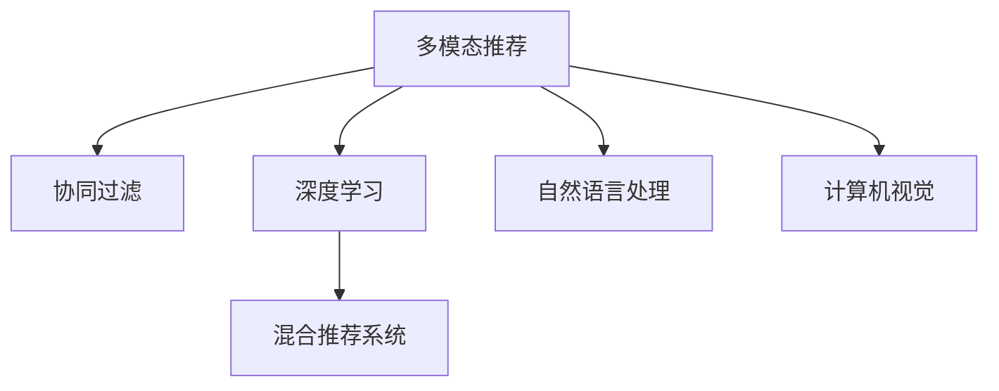
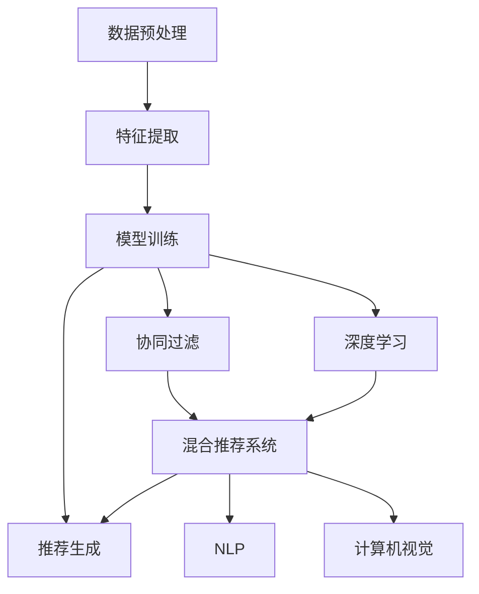

                 

# 电商平台中的多模态推荐技术

> 关键词：多模态推荐,电商平台,深度学习,自然语言处理(NLP),计算机视觉,协同过滤,混合推荐系统,商品推荐系统,个性化推荐

## 1. 背景介绍

### 1.1 问题由来
随着电商平台的快速发展，个性化推荐已成为提升用户体验、增加交易转化率的重要手段。传统的基于协同过滤和规则的推荐系统难以有效处理海量、动态的用户行为数据。近年来，深度学习技术在大数据上的卓越表现，为推荐系统带来了新的思路和突破。

特别是基于深度学习的多模态推荐技术，能够综合利用用户行为数据中的多模态信息（如文本、图片、行为数据等），实现更全面、更精准的个性化推荐，极大提升了电商平台的用户体验和商业价值。

## 2. 核心概念与联系

### 2.1 核心概念概述

为了更好地理解电商平台中的多模态推荐技术，我们首先介绍几个关键概念：

- 多模态推荐：指同时利用用户在不同模态上的行为数据（如文本评论、图片浏览、购买行为等）进行推荐。与单模态推荐相比，多模态推荐能够更全面地刻画用户需求，提升推荐质量。
- 协同过滤：通过用户间的相似度，推荐用户未曾交互过的商品。包括基于用户相似性的基于用户的协同过滤和基于物品相似性的基于物品的协同过滤。
- 混合推荐系统：结合多种推荐算法，取长补短，综合提升推荐效果。
- 深度学习：利用多层神经网络学习复杂、高维的特征表示，能够处理大规模数据，捕捉用户行为间的复杂关联。
- 自然语言处理(NLP)：处理文本数据的技术，包括文本分类、情感分析、语言模型等。
- 计算机视觉：处理图像和视频数据的技术，包括图像分类、目标检测、图像生成等。

这些概念之间的关系如图示：



### 2.2 核心概念原理和架构的 Mermaid 流程图

下图展示了多模态推荐系统的基本架构，包括数据预处理、特征提取、模型训练和推荐生成等关键环节。



在这个架构中，数据预处理环节通过清洗、拼接、标准化等操作，将不同模态的数据集化为统一的格式。特征提取环节使用不同的技术手段，对不同模态的数据进行特征表示。模型训练环节则是核心，通过深度学习模型学习用户和商品之间的复杂关联。推荐生成环节基于训练好的模型，输出个性化推荐结果。

协同过滤、深度学习和混合推荐系统等子系统模块，通过不同的算法和技术手段，对用户和商品进行刻画和推荐。NLP和计算机视觉模块则用于处理文本和图像等特殊数据模态，为推荐系统提供额外的信息支持。

## 3. 核心算法原理 & 具体操作步骤

### 3.1 算法原理概述

多模态推荐系统主要基于深度学习模型构建，利用用户行为数据中的文本、图像、行为等多个模态的信息，对用户和商品进行编码和表示。具体步骤如下：

1. 数据预处理：将不同模态的用户行为数据进行清洗、拼接和标准化，生成统一格式的数据集。
2. 特征提取：使用NLP和计算机视觉等技术手段，对文本和图像数据进行特征提取，转化为模型可以接受的向量表示。
3. 模型训练：使用深度学习模型，如DNN、CNN、RNN等，学习用户和商品之间的复杂关联，得到用户的兴趣向量表示和商品的特征表示。
4. 推荐生成：基于训练好的模型，计算用户与商品之间的相似度，生成个性化推荐列表。

多模态推荐算法的主要原理是利用深度学习模型的非线性映射能力，从多个模态的数据中学习出用户的兴趣表示和商品的特征表示，进而计算用户与商品之间的相似度，生成推荐结果。

### 3.2 算法步骤详解

#### 3.2.1 数据预处理

数据预处理是保证数据质量和一致性的关键步骤，主要包括：

- 数据清洗：去除缺失、异常和无用数据，确保数据的质量和一致性。
- 数据拼接：将不同模态的数据进行拼接，如用户评分、行为数据、文本评论等。
- 数据标准化：对数据进行归一化和标准化处理，如将文本转化为向量表示，将图像尺寸归一化等。

#### 3.2.2 特征提取

特征提取是将原始数据转化为模型可以接受的向量表示的过程。不同模态的特征提取方法如下：

- 文本特征提取：使用NLP技术，如词袋模型、TF-IDF、词嵌入等，将文本转化为向量表示。
- 图像特征提取：使用计算机视觉技术，如卷积神经网络(CNN)等，将图像转化为高维向量表示。
- 行为数据特征提取：将用户的行为数据转化为向量表示，如将用户的浏览序列、购买历史等转化为高维稀疏向量。

#### 3.2.3 模型训练

模型训练是利用深度学习模型，学习用户和商品之间的复杂关联的过程。常用的深度学习模型包括：

- 深度神经网络(DNN)：利用多层非线性映射，学习用户和商品之间的复杂关联。
- 卷积神经网络(CNN)：适用于图像数据的特征提取和表示。
- 循环神经网络(RNN)：适用于序列数据的建模和预测。

训练过程如下：

1. 选择模型结构：根据任务需求，选择合适的深度学习模型。
2. 准备数据集：将预处理后的数据集分为训练集、验证集和测试集。
3. 定义损失函数：根据推荐任务的特点，定义合适的损失函数，如均方误差、交叉熵等。
4. 优化算法：选择适当的优化算法，如随机梯度下降(SGD)、Adam等，更新模型参数。
5. 训练模型：在训练集上迭代优化，不断调整模型参数，最小化损失函数。
6. 模型评估：在验证集上评估模型的性能，调整超参数，防止过拟合。
7. 最终测试：在测试集上评估模型的最终性能，输出推荐结果。

#### 3.2.4 推荐生成

推荐生成是基于训练好的模型，计算用户与商品之间的相似度，生成个性化推荐列表的过程。具体步骤如下：

1. 用户编码：将用户的行为数据和文本信息等转化为向量表示，得到用户的兴趣向量。
2. 商品编码：将商品的特征数据，如图片、描述等转化为向量表示，得到商品的特征向量。
3. 相似度计算：计算用户向量与商品向量之间的相似度，得到相似度矩阵。
4. 排序推荐：根据相似度矩阵，排序生成推荐列表，输出到电商平台展示。

### 3.3 算法优缺点

多模态推荐算法的优点如下：

- 全面刻画用户需求：同时利用不同模态的数据，从多个角度刻画用户需求，提升推荐质量。
- 灵活性高：可以结合多种推荐算法，构建混合推荐系统，提升推荐效果。
- 模型表现优异：深度学习模型能够学习复杂、高维的特征表示，提升推荐精度。

缺点如下：

- 数据需求大：需要大规模用户行为数据进行训练，获取高精度推荐结果。
- 算法复杂：模型复杂度高，训练和推理时间较长。
- 可解释性差：深度学习模型通常被视为"黑盒"系统，缺乏可解释性。

### 3.4 算法应用领域

多模态推荐算法广泛应用于电商、社交、音乐、视频等多个领域，以下列举几个典型应用场景：

- 电商商品推荐：利用用户行为数据、商品图片和描述等多模态信息，提升用户的购买转化率和满意度。
- 社交网络推荐：利用用户评论、点赞、关注等多模态信息，推荐用户感兴趣的内容和好友。
- 视频推荐：利用用户观看历史、评分和评论等多模态信息，推荐用户感兴趣的视频内容。

## 4. 数学模型和公式 & 详细讲解 & 举例说明

### 4.1 数学模型构建

多模态推荐系统涉及多种数学模型，这里重点介绍几个核心模型：

- 协同过滤模型：
$$
P_{ij} = \alpha u_i^T V_j + \beta \hat{p}_{ij}
$$
其中，$P_{ij}$ 为第 $i$ 个用户对第 $j$ 个商品的预测评分，$u_i$ 为用户 $i$ 的兴趣向量，$V_j$ 为商品 $j$ 的特征向量，$\alpha$ 和 $\beta$ 为模型参数，$\hat{p}_{ij}$ 为基于用户-商品交互历史和物品相似性计算的评分预测值。

- 深度神经网络模型：
$$
\hat{P}_{ij} = \sigma(W^T \tanh (A(x_i, V_j)))
$$
其中，$W$ 为权重矩阵，$A$ 为激活函数，$\tanh$ 为双曲正切函数，$\sigma$ 为sigmoid函数，$x_i$ 为用户 $i$ 的行为数据和文本信息等特征，$V_j$ 为商品 $j$ 的特征向量。

### 4.2 公式推导过程

以协同过滤模型为例，推导其基本原理。

假设用户 $i$ 对商品 $j$ 的预测评分为 $P_{ij}$，模型参数为 $\theta = \{u_i, V_j, \alpha, \beta\}$。则模型的损失函数为：
$$
L = -\frac{1}{N} \sum_{i=1}^N \sum_{j=1}^N (y_{ij} - P_{ij})^2
$$
其中，$y_{ij}$ 为实际评分，$N$ 为样本数量。

模型的梯度更新公式为：
$$
\theta \leftarrow \theta - \eta \nabla_{\theta}L
$$
其中，$\eta$ 为学习率，$\nabla_{\theta}L$ 为损失函数对模型参数的梯度。

具体推导过程如下：
1. 计算预测评分：
$$
P_{ij} = \alpha u_i^T V_j + \beta \hat{p}_{ij}
$$
2. 计算误差：
$$
\epsilon_{ij} = y_{ij} - P_{ij}
$$
3. 计算梯度：
$$
\nabla_{u_i} L = -2 \sum_{j=1}^N (\epsilon_{ij} V_j)
$$
$$
\nabla_{V_j} L = -2 \sum_{i=1}^N (\epsilon_{ij} u_i)
$$
$$
\nabla_{\alpha} L = -2 \sum_{i=1}^N \sum_{j=1}^N (\epsilon_{ij} u_i^T V_j)
$$
$$
\nabla_{\beta} L = -2 \sum_{i=1}^N \sum_{j=1}^N (\epsilon_{ij} \hat{p}_{ij})
$$
4. 更新参数：
$$
u_i \leftarrow u_i - \eta \nabla_{u_i} L
$$
$$
V_j \leftarrow V_j - \eta \nabla_{V_j} L
$$
$$
\alpha \leftarrow \alpha - \eta \nabla_{\alpha} L
$$
$$
\beta \leftarrow \beta - \eta \nabla_{\beta} L
$$

### 4.3 案例分析与讲解

以电商平台中的商品推荐为例，分析多模态推荐系统的应用。

假设用户 $i$ 在浏览商品 $j$ 时，浏览了图片 $V_j$，点击了商品 $j$，评论了商品 $j$，并将商品 $j$ 加入了购物车。那么，用户 $i$ 对商品 $j$ 的评分可以表示为：
$$
P_{ij} = \alpha u_i^T V_j + \beta \hat{p}_{ij}
$$
其中，$u_i$ 为用户 $i$ 的兴趣向量，$V_j$ 为商品 $j$ 的特征向量，$\alpha$ 和 $\beta$ 为模型参数，$\hat{p}_{ij}$ 为基于用户-商品交互历史和物品相似性计算的评分预测值。

假设用户 $i$ 对商品 $j$ 的实际评分为 $y_{ij}$，则模型的损失函数为：
$$
L = -\frac{1}{N} \sum_{i=1}^N \sum_{j=1}^N (y_{ij} - P_{ij})^2
$$
通过不断迭代优化，模型参数不断更新，预测评分 $P_{ij}$ 逐渐逼近实际评分 $y_{ij}$，推荐精度不断提升。

## 5. 项目实践：代码实例和详细解释说明

### 5.1 开发环境搭建

以下是在Python环境下搭建多模态推荐系统的环境配置步骤：

1. 安装Anaconda：从官网下载并安装Anaconda，用于创建独立的Python环境。
2. 创建并激活虚拟环境：
```bash
conda create -n recommendation-env python=3.8 
conda activate recommendation-env
```
3. 安装必要的Python库：
```bash
pip install numpy pandas sklearn transformers
```
4. 安装深度学习框架：
```bash
pip install tensorflow keras
```

### 5.2 源代码详细实现

以下是一个简单的多模态推荐系统的Python代码实现，使用TensorFlow进行模型训练和预测：

```python
import tensorflow as tf
from tensorflow.keras.layers import Input, Dense, Embedding, Concatenate
from tensorflow.keras.models import Model

# 定义输入层
user_input = Input(shape=(1,), name='user')
item_input = Input(shape=(1,), name='item')
text_input = Input(shape=(MAX_LEN,), name='text')
image_input = Input(shape=(IMG_SIZE, IMG_SIZE, 3), name='image')

# 定义用户和商品编码层
user_embed = Dense(128)(user_input)
item_embed = Dense(128)(item_input)

# 定义文本和图像编码层
text_embed = Embedding(VOCAB_SIZE, 128)(text_input)
img_embed = Conv2D(64, (3, 3), activation='relu')(image_input)

# 将编码结果拼接
concat = Concatenate()([user_embed, item_embed, text_embed, img_embed])

# 定义多层感知器(MLP)
x = Dense(256, activation='relu')(concat)
x = Dense(256, activation='relu')(x)
x = Dense(1, activation='sigmoid')(x)

# 定义模型
model = Model(inputs=[user_input, item_input, text_input, image_input], outputs=x)

# 编译模型
model.compile(optimizer='adam', loss='binary_crossentropy', metrics=['accuracy'])

# 训练模型
model.fit([user_data, item_data, text_data, img_data], labels, epochs=10, batch_size=32)

# 预测推荐
def predict(user, item, text, img):
    return model.predict([user, item, text, img])
```

### 5.3 代码解读与分析

以上代码实现了基于用户行为数据、文本评论、商品图片和描述等多模态信息进行商品推荐的多模态推荐系统。具体解读如下：

- `Input`层：定义输入层的形状，如用户ID、商品ID、文本和图像的维度等。
- `Dense`层：定义用户和商品编码层，将ID编码为一维向量。
- `Embedding`层：定义文本编码层，将文本转化为高维向量表示。
- `Conv2D`层：定义图像编码层，通过卷积神经网络将图像转化为高维向量表示。
- `Concatenate`层：将所有编码层的输出拼接，构成多模态特征向量。
- `Dense`层：定义多层感知器(MLP)，对多模态特征向量进行编码和分类。
- `Model`层：定义多模态推荐模型的结构和输入输出关系。
- `compile`方法：编译模型，定义优化器和损失函数。
- `fit`方法：训练模型，指定训练数据和标签。
- `predict`方法：基于训练好的模型进行推荐预测。

## 6. 实际应用场景

### 6.1 智能客服系统

多模态推荐技术在智能客服系统中具有广泛应用前景。通过分析用户的对话记录、历史行为和反馈信息，客服系统可以生成个性化的客服回复，提高用户满意度。

以下是一个基于多模态推荐技术的智能客服系统的应用示例：

1. 收集用户历史对话记录和行为数据，如用户提问、回应、点击链接等。
2. 提取文本特征，如词袋模型、TF-IDF等。
3. 提取图像特征，如对话中的表情、图片等。
4. 训练多模态推荐模型，生成个性化的客服回复。
5. 实时动态更新模型，根据最新的用户行为数据调整回复策略。

### 6.2 社交网络推荐

社交网络中的用户行为数据非常丰富，包括点赞、评论、分享等。多模态推荐技术可以充分利用这些数据，为用户推荐感兴趣的内容和好友。

以下是一个基于多模态推荐技术的社交网络推荐系统的应用示例：

1. 收集用户的行为数据，如点赞、评论、分享等。
2. 提取文本特征，如评论内容、用户简介等。
3. 提取图像特征，如用户头像、图片等。
4. 训练多模态推荐模型，为用户推荐感兴趣的内容和好友。
5. 实时动态更新模型，根据最新的用户行为数据调整推荐结果。

### 6.3 视频推荐

视频推荐是推荐系统中的重要应用场景之一。通过分析用户的观看历史、评分和评论，多模态推荐技术可以为用户推荐感兴趣的视频内容。

以下是一个基于多模态推荐技术的视频播放推荐系统的应用示例：

1. 收集用户的观看历史、评分和评论数据。
2. 提取文本特征，如视频描述、用户评论等。
3. 提取图像特征，如视频截图、用户头像等。
4. 训练多模态推荐模型，为用户推荐感兴趣的视频内容。
5. 实时动态更新模型，根据最新的用户行为数据调整推荐结果。

### 6.4 未来应用展望

多模态推荐技术在未来有望在更多领域得到广泛应用，如智慧医疗、智能交通、智能家居等。以下列举几个未来应用展望：

1. 智慧医疗推荐：利用患者的历史数据、基因信息、病历信息等，推荐个性化的治疗方案和药品。
2. 智能交通推荐：通过分析用户的出行历史、路线偏好、交通状况等，推荐最佳的出行路线和交通工具。
3. 智能家居推荐：利用用户的家居行为数据，推荐个性化的家居产品和服务。

## 7. 工具和资源推荐

### 7.1 学习资源推荐

为了帮助开发者系统掌握多模态推荐技术的理论和实践，这里推荐一些优质的学习资源：

1. 《推荐系统实战》一书：详细介绍了推荐系统的基本原理和多种算法，适合初学者和中级开发者。
2. 《深度学习与推荐系统》课程：由上海交通大学讲授，涵盖推荐系统的基本原理和最新技术。
3. 《推荐系统理论与实践》论文集：包含推荐系统的经典论文和最新研究成果，适合进阶阅读。
4. Kaggle推荐系统竞赛：通过实际竞赛项目，实践推荐系统算法，积累实战经验。
5. PyTorch官方文档：PyTorch深度学习框架的官方文档，提供了丰富的深度学习算法和工具。

### 7.2 开发工具推荐

以下是几个常用的多模态推荐系统开发工具：

1. TensorFlow：由Google开发的深度学习框架，支持多模态数据的建模和训练。
2. PyTorch：由Facebook开发的深度学习框架，灵活高效，支持多模态数据的处理和建模。
3. Scikit-learn：Python中的机器学习库，提供多种推荐算法的实现。
4. FastAPI：基于FastHTTP的Web框架，支持快速搭建API服务，用于多模态推荐系统的部署和调用。

### 7.3 相关论文推荐

多模态推荐技术的快速发展离不开学界的持续研究。以下是几篇奠基性的相关论文，推荐阅读：

1. Multi-View Tensor Factorization for Recommender Systems：提出了多视图张量分解方法，适用于多模态数据的推荐建模。
2. Multi-Modal Recommendation in a Deep Neural Network Framework：使用深度学习框架，综合利用多模态数据进行推荐建模。
3. Multi-Modal Multi-View Matrix Factorization for Recommender Systems：提出多视图矩阵分解方法，用于多模态数据的推荐建模。
4. Deep Neural Network Approach for Multi-View Collaborative Filtering：提出多层感知器方法，结合多模态数据进行协同过滤。

这些论文代表了大模态推荐技术的演进方向，为未来研究提供了丰富的理论和实践基础。

## 8. 总结：未来发展趋势与挑战

### 8.1 研究成果总结

多模态推荐技术自提出以来，已经取得了丰硕的研究成果，涵盖了多种推荐算法和技术手段。在理论和实践两个层面，均实现了显著的突破。

1. 理论研究：基于深度学习的推荐算法，通过多模态数据的融合，提升了推荐精度和泛化能力。多视图张量分解、多层感知器等方法，均取得了较好的推荐效果。
2. 实践应用：多模态推荐系统已经广泛应用于电商、社交、视频等多个领域，提升了用户体验和商业价值。多模态数据融合、模型集成等技术手段，提高了推荐系统的稳定性和鲁棒性。

### 8.2 未来发展趋势

展望未来，多模态推荐技术将呈现以下几个发展趋势：

1. 模型集成和融合：结合多种推荐算法和技术手段，构建混合推荐系统，提升推荐效果。
2. 深度学习模型优化：优化深度学习模型结构和参数，提升模型效率和泛化能力。
3. 多模态数据融合：综合利用文本、图像、行为等多种数据模态，提升推荐质量。
4. 跨领域推荐：将多模态推荐技术应用于跨领域推荐，如视频推荐、社交推荐、电商推荐等。
5. 实时推荐系统：构建实时推荐系统，动态更新模型，提升推荐精度和响应速度。

### 8.3 面临的挑战

尽管多模态推荐技术已经取得了显著进展，但在实际应用中也面临诸多挑战：

1. 数据质量和多样性：多模态推荐系统需要大量高质量、多模态的数据进行训练，数据获取和处理成本较高。
2. 算法复杂度和计算成本：深度学习模型结构复杂，训练和推理时间较长，计算资源需求大。
3. 模型可解释性和透明性：深度学习模型通常被视为"黑盒"系统，缺乏可解释性，用户难以理解推荐结果。
4. 模型泛化能力和鲁棒性：模型在面对新数据和新用户时，泛化能力和鲁棒性可能不足。
5. 用户隐私和数据安全：多模态推荐系统涉及用户隐私和数据安全问题，需要采取合适的数据保护措施。

### 8.4 研究展望

面对多模态推荐技术所面临的诸多挑战，未来的研究需要在以下几个方面寻求新的突破：

1. 数据获取和处理：探索自动化的数据获取和处理技术，降低数据获取和处理成本。
2. 算法优化和加速：优化深度学习模型结构和参数，提升模型效率和泛化能力，采用分布式训练等方法加速训练过程。
3. 可解释性和透明性：开发可解释性更高的模型，提高用户对推荐结果的理解和信任。
4. 多模态数据融合：研究如何更好地融合不同模态的数据，提升推荐精度和鲁棒性。
5. 用户隐私和数据安全：采取合适的数据保护措施，确保用户隐私和数据安全。

多模态推荐技术在未来将继续发挥重要作用，为推荐系统带来新的突破和创新。只有不断突破技术瓶颈，才能实现更加高效、精准的推荐服务，真正提升用户体验和商业价值。

## 9. 附录：常见问题与解答

**Q1：多模态推荐系统相比传统推荐系统有哪些优势？**

A: 多模态推荐系统相比传统推荐系统有以下优势：

1. 全面刻画用户需求：同时利用不同模态的数据，从多个角度刻画用户需求，提升推荐质量。
2. 灵活性高：可以结合多种推荐算法，构建混合推荐系统，提升推荐效果。
3. 模型表现优异：深度学习模型能够学习复杂、高维的特征表示，提升推荐精度。

**Q2：多模态推荐系统在应用中需要注意哪些问题？**

A: 多模态推荐系统在应用中需要注意以下问题：

1. 数据需求大：需要大规模用户行为数据进行训练，获取高精度推荐结果。
2. 算法复杂：模型复杂度高，训练和推理时间较长。
3. 可解释性差：深度学习模型通常被视为"黑盒"系统，缺乏可解释性。

**Q3：多模态推荐系统如何应对数据不平衡问题？**

A: 数据不平衡问题在多模态推荐系统中较为常见，主要通过以下方法应对：

1. 数据增强：通过数据增强技术，如数据合成、数据增强等，扩充数据集。
2. 模型优化：优化模型结构，引入正则化、Dropout等技术，防止模型过拟合。
3. 多任务学习：利用多任务学习，同时训练多个任务，提高模型泛化能力。
4. 数据重采样：通过重采样技术，调整数据分布，缓解数据不平衡问题。

通过以上方法，可以有效应对多模态推荐系统中的数据不平衡问题，提升推荐精度和鲁棒性。

**Q4：多模态推荐系统在实际部署中需要注意哪些问题？**

A: 多模态推荐系统在实际部署中需要注意以下问题：

1. 模型裁剪：去除不必要的层和参数，减小模型尺寸，加快推理速度。
2. 量化加速：将浮点模型转为定点模型，压缩存储空间，提高计算效率。
3. 服务化封装：将模型封装为标准化服务接口，便于集成调用。
4. 弹性伸缩：根据请求流量动态调整资源配置，平衡服务质量和成本。
5. 监控告警：实时采集系统指标，设置异常告警阈值，确保服务稳定性。
6. 安全防护：采用访问鉴权、数据脱敏等措施，保障数据和模型安全。

以上措施可以有效应对多模态推荐系统在实际部署中可能遇到的各种问题，确保系统稳定运行，提供优质推荐服务。

**Q5：多模态推荐系统如何保持模型的实时性和适应性？**

A: 保持多模态推荐系统的实时性和适应性，主要通过以下方法实现：

1. 在线学习：实时更新模型参数，避免模型过时，提高推荐精度。
2. 增量训练：利用增量训练技术，在新的用户行为数据到来时，快速更新模型。
3. 数据融合：综合利用实时数据和历史数据，提高模型的泛化能力和适应性。
4. 模型集成：通过模型集成技术，将多个模型输出融合，提升推荐精度和鲁棒性。
5. 反馈机制：引入用户反馈机制，根据用户反馈调整模型参数，优化推荐结果。

通过以上方法，可以有效保持多模态推荐系统的实时性和适应性，提高推荐精度和用户体验。

---

作者：禅与计算机程序设计艺术 / Zen and the Art of Computer Programming

