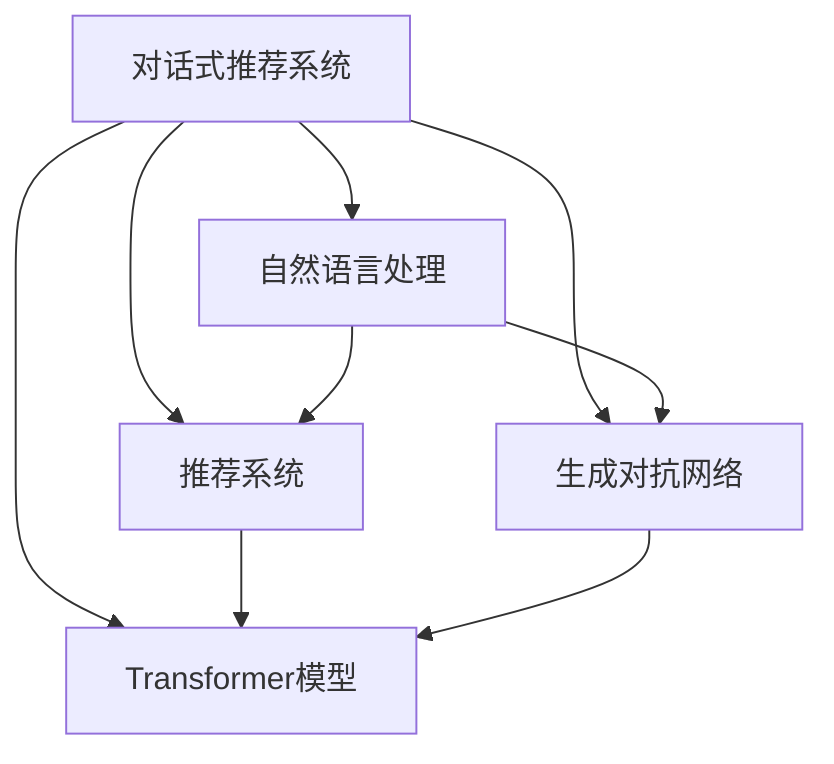

                 

## 1. 背景介绍

### 1.1 问题由来
在电商平台上，用户体验的提升和销售额的增长越来越依赖于推荐系统的精准度和个性化程度。传统的基于协同过滤、基于内容的推荐方法已经逐渐无法满足用户不断变化的购物需求。对话式推荐系统通过模拟用户与商品的自然对话，能够更加智能、动态地生成个性化推荐，提升用户体验和购买转化率。

然而，对话式推荐系统的性能优化和部署面临诸多挑战。首先，电商平台的推荐系统数据量庞大，用户行为数据和商品信息实时更新，需要处理的信息复杂度高；其次，对话式推荐需要模型实时生成对话内容，计算量巨大，对模型的推理速度和资源占用要求较高；最后，对话式推荐系统需要跨越语言、商品、情感等多个维度，复杂度大，技术要求高。

本文旨在探讨如何在电商平台上高效实现对话式推荐系统的性能优化，通过介绍核心的算法原理和具体操作步骤，结合具体案例进行详细讲解，以期为电商平台开发者提供指导。

### 1.2 问题核心关键点
电商平台的对话式推荐系统性能优化主要关注以下几个关键点：

1. **数据处理**：如何高效地处理海量用户行为数据和商品信息，提取有效特征，为模型训练提供高质量的数据输入。
2. **模型训练**：如何选择和训练高效对话生成模型，保证推荐内容的个性化、准确性和时效性。
3. **推理速度**：如何在保证推荐内容质量的前提下，提升模型的推理速度，减少用户等待时间。
4. **系统扩展**：如何构建可扩展的推荐系统架构，适应平台流量和业务场景的变化。

## 2. 核心概念与联系

### 2.1 核心概念概述

为更好地理解对话式推荐系统的性能优化，本节将介绍几个密切相关的核心概念：

1. **对话式推荐系统**：通过模拟用户与商品的对话，实时生成个性化推荐内容的推荐系统。对话式推荐系统能够捕捉用户的即时需求，动态调整推荐内容，提升用户体验和购买转化率。
2. **自然语言处理(NLP)**：利用计算机对自然语言进行理解、处理和生成的技术。对话式推荐系统需要利用NLP技术，理解用户输入，生成自然流畅的推荐对话内容。
3. **推荐系统**：根据用户历史行为和偏好，推荐商品或内容的系统。对话式推荐系统是推荐系统的一种高级形式，结合了NLP和推荐算法，能够更加智能、动态地生成个性化推荐。
4. **生成对抗网络(GAN)**：由生成器和判别器组成的网络结构，用于生成高质量的对话内容。对话式推荐系统可以结合GAN技术，提升推荐对话的自然度和流畅度。
5. **Transformer模型**：一种基于自注意力机制的神经网络模型，广泛应用于自然语言处理和推荐系统。Transformer模型能够高效处理序列数据，适合构建对话生成模型。

这些核心概念之间的逻辑关系可以通过以下Mermaid流程图来展示：



这个流程图展示了大语言模型微调的对话式推荐系统的核心概念及其之间的关系：

1. 对话式推荐系统通过自然语言处理技术，理解用户输入，生成推荐内容。
2. 推荐系统通过用户历史行为和偏好，生成推荐内容。
3. 生成对抗网络用于提升推荐对话的自然度和流畅度。
4. Transformer模型作为核心模型，用于高效处理序列数据，生成推荐对话内容。

## 3. 核心算法原理 & 具体操作步骤
### 3.1 算法原理概述

电商平台的对话式推荐系统性能优化主要基于以下几个算法原理：

1. **自然语言处理**：通过NLP技术，理解用户输入，提取关键信息，生成推荐对话内容。
2. **推荐系统**：结合用户历史行为和偏好，生成个性化推荐内容。
3. **生成对抗网络**：通过生成器和判别器的对抗训练，提升推荐对话的自然度和流畅度。
4. **Transformer模型**：利用自注意力机制，高效处理序列数据，生成推荐对话内容。

### 3.2 算法步骤详解

电商平台的对话式推荐系统性能优化一般包括以下几个关键步骤：

**Step 1: 数据预处理与特征提取**

1. **数据收集**：从电商平台收集用户行为数据和商品信息，包括浏览记录、购买记录、评价记录等。
2. **数据清洗**：去除无效数据和噪声，确保数据质量。
3. **特征提取**：利用NLP技术，提取用户输入和推荐内容的关键特征，如词语、主题、情感等。

**Step 2: 模型选择与训练**

1. **模型选择**：选择合适的对话生成模型，如Seq2Seq、Seq2Seq + Attention、Transformer等。
2. **数据准备**：将预处理后的数据划分为训练集、验证集和测试集。
3. **模型训练**：使用训练集数据，通过优化算法（如AdamW、SGD等）训练对话生成模型，最小化损失函数。
4. **模型评估**：在验证集上评估模型性能，调整超参数，优化模型。

**Step 3: 生成对抗网络优化**

1. **生成器设计**：设计生成器，利用Transformer模型生成推荐对话内容。
2. **判别器设计**：设计判别器，用于评估生成内容的自然度和流畅度。
3. **对抗训练**：通过生成器和判别器的对抗训练，不断提升生成内容的自然度和流畅度。
4. **模型融合**：将优化后的生成内容与推荐系统生成的内容进行融合，生成最终的推荐对话内容。

**Step 4: 性能优化与系统部署**

1. **性能优化**：通过超参数调优、模型裁剪、量化加速等手段，提升模型推理速度，减少系统延迟。
2. **系统部署**：将优化后的模型部署到生产环境，通过负载均衡、CDN等技术，实现高效的推荐服务。
3. **实时监控**：实时监控推荐系统性能，设置异常告警阈值，确保系统稳定运行。

### 3.3 算法优缺点

电商平台的对话式推荐系统性能优化具有以下优点：

1. **个性化程度高**：对话式推荐系统能够根据用户即时需求，动态调整推荐内容，提升个性化程度。
2. **实时性强**：通过模型实时生成推荐内容，用户无需等待，提升用户体验。
3. **可扩展性强**：利用分布式计算和微服务架构，可扩展性较好，适应平台流量变化。

同时，该方法也存在一定的局限性：

1. **数据质量依赖高**：推荐内容的质量很大程度上取决于用户行为数据和商品信息的准确性和完整性。
2. **计算资源消耗大**：对话生成模型的推理计算量大，需要高性能计算资源。
3. **对抗训练复杂**：生成对抗网络优化复杂，需要大量计算资源和时间。
4. **模型维护困难**：对话式推荐系统的复杂度高，模型维护难度大。

尽管存在这些局限性，但对话式推荐系统在提升电商平台用户体验和购买转化率方面具有显著优势，值得进一步探索和优化。

### 3.4 算法应用领域

电商平台的对话式推荐系统已经在多个领域得到应用，例如：

1. **服装推荐**：根据用户的服装浏览和购买记录，生成个性化的服装推荐对话内容。
2. **家电推荐**：根据用户的家电使用习惯，生成个性化的家电推荐对话内容。
3. **美妆推荐**：根据用户的化妆品购买记录和评价，生成个性化的美妆推荐对话内容。
4. **图书推荐**：根据用户的阅读习惯和评价，生成个性化的图书推荐对话内容。

除了上述这些经典应用外，对话式推荐系统还被创新性地应用到更多场景中，如旅游推荐、家居设计、健康咨询等，为电商平台的推荐业务带来了新的突破。随着对话生成技术和推荐算法的发展，相信对话式推荐系统将在更广泛的领域得到应用，为电商平台提供更具价值的推荐服务。

## 4. 数学模型和公式 & 详细讲解
### 4.1 数学模型构建

在对话式推荐系统中，我们通常使用Seq2Seq + Attention模型作为对话生成模型的基础。其数学模型如下：

设输入序列为$x=(x_1, x_2, \dots, x_T)$，输出序列为$y=(y_1, y_2, \dots, y_T)$，其中$x_i$和$y_i$分别表示输入和输出序列中的第$i$个词。对话生成模型的目标是学习从输入序列$x$到输出序列$y$的映射，即$P(y|x)$。

**编码器**：利用Transformer模型，将输入序列$x$编码成上下文向量$c$。

$$
c = \text{Encoder}(x)
$$

**解码器**：利用编码器生成的上下文向量$c$和前一个时间步的输出$y_{t-1}$，生成当前时间步的输出$y_t$。

$$
y_t = \text{Decoder}(c, y_{t-1})
$$

最终输出序列$y$由解码器逐个生成。

### 4.2 公式推导过程

设$x=(x_1, x_2, \dots, x_T)$为输入序列，$y=(y_1, y_2, \dots, y_T)$为输出序列，$c=(c_1, c_2, \dots, c_T)$为编码器输出的上下文向量，$h=(h_1, h_2, \dots, h_T)$为解码器的隐藏状态。

**编码器**：

1. 输入嵌入：将输入序列$x$中的每个词$x_i$映射到一个低维向量$e_i$。

$$
e_i = \text{Embedding}(x_i)
$$

2. 位置嵌入：为每个词$e_i$添加一个位置嵌入向量$p_i$，表示其在序列中的位置。

$$
e_i' = e_i + p_i
$$

3. 自注意力机制：利用自注意力机制，计算每个词的上下文表示。

$$
c_i = \text{Attention}(Q_i, K_j, V_j)
$$

其中$Q_i = e_i'W_Q$，$K_j = e_j'W_K$，$V_j = e_j'W_V$，$W_Q, W_K, W_V$为可学习的线性变换矩阵。

4. 多层编码器：利用多层自注意力机制，逐步提升上下文表示的质量。

$$
c = \text{EncoderLayer}(c)
$$

重复上述过程$L$层，得到最终的上下文向量$c$。

**解码器**：

1. 输入嵌入：将输出序列$y_{t-1}$中的每个词$y_{t-1}$映射到一个低维向量$s_i$。

$$
s_i = \text{Embedding}(y_{t-1})
$$

2. 位置嵌入：为每个词$s_i$添加一个位置嵌入向量$q_i$，表示其在序列中的位置。

$$
s_i' = s_i + q_i
$$

3. 自注意力机制：利用自注意力机制，计算每个词的上下文表示。

$$
h_i = \text{Attention}(Q_i, K_j, V_j)
$$

其中$Q_i = s_i'W_Q$，$K_j = c_j'W_K$，$V_j = c_j'W_V$，$W_Q, W_K, W_V$为可学习的线性变换矩阵。

4. 多层解码器：利用多层自注意力机制，逐步提升上下文表示的质量。

$$
h = \text{DecoderLayer}(h)
$$

重复上述过程$L$层，得到最终的隐藏状态$h$。

5. 输出预测：利用解码器生成的隐藏状态$h$，通过全连接层预测当前时间步的输出$y_t$。

$$
y_t = \text{Softmax}(hW_O)
$$

其中$W_O$为可学习的线性变换矩阵。

### 4.3 案例分析与讲解

假设我们有一个电商平台的服装推荐系统，需要对用户的服装浏览和购买记录进行个性化推荐。我们将用户输入的服装品牌和风格作为输入序列$x$，生成推荐对话内容作为输出序列$y$。

**输入嵌入**：将输入序列$x$中的每个词$x_i$映射到一个低维向量$e_i$。

$$
e_i = \text{Embedding}(x_i)
$$

**位置嵌入**：为每个词$e_i$添加一个位置嵌入向量$p_i$，表示其在序列中的位置。

$$
e_i' = e_i + p_i
$$

**自注意力机制**：利用自注意力机制，计算每个词的上下文表示。

$$
c_i = \text{Attention}(Q_i, K_j, V_j)
$$

其中$Q_i = e_i'W_Q$，$K_j = e_j'W_K$，$V_j = e_j'W_V$，$W_Q, W_K, W_V$为可学习的线性变换矩阵。

**多层编码器**：利用多层自注意力机制，逐步提升上下文表示的质量。

$$
c = \text{EncoderLayer}(c)
$$

重复上述过程$L$层，得到最终的上下文向量$c$。

**输入嵌入**：将输出序列$y_{t-1}$中的每个词$y_{t-1}$映射到一个低维向量$s_i$。

$$
s_i = \text{Embedding}(y_{t-1})
$$

**位置嵌入**：为每个词$s_i$添加一个位置嵌入向量$q_i$，表示其在序列中的位置。

$$
s_i' = s_i + q_i
$$

**自注意力机制**：利用自注意力机制，计算每个词的上下文表示。

$$
h_i = \text{Attention}(Q_i, K_j, V_j)
$$

其中$Q_i = s_i'W_Q$，$K_j = c_j'W_K$，$V_j = c_j'W_V$，$W_Q, W_K, W_V$为可学习的线性变换矩阵。

**多层解码器**：利用多层自注意力机制，逐步提升上下文表示的质量。

$$
h = \text{DecoderLayer}(h)
$$

重复上述过程$L$层，得到最终的隐藏状态$h$。

**输出预测**：利用解码器生成的隐藏状态$h$，通过全连接层预测当前时间步的输出$y_t$。

$$
y_t = \text{Softmax}(hW_O)
$$

其中$W_O$为可学习的线性变换矩阵。

最终生成的推荐对话内容$y$可以为用户实时提供个性化的服装推荐建议。

## 5. 项目实践：代码实例和详细解释说明
### 5.1 开发环境搭建

在进行对话式推荐系统性能优化实践前，我们需要准备好开发环境。以下是使用Python进行TensorFlow开发的环境配置流程：

1. 安装Anaconda：从官网下载并安装Anaconda，用于创建独立的Python环境。

2. 创建并激活虚拟环境：
```bash
conda create -n tf-env python=3.8 
conda activate tf-env
```

3. 安装TensorFlow：根据CUDA版本，从官网获取对应的安装命令。例如：
```bash
conda install tensorflow-gpu=2.5.0 -c pytorch -c conda-forge
```

4. 安装各类工具包：
```bash
pip install numpy pandas scikit-learn matplotlib tqdm jupyter notebook ipython
```

完成上述步骤后，即可在`tf-env`环境中开始性能优化实践。

### 5.2 源代码详细实现

这里我们以一个简单的服装推荐系统为例，给出使用TensorFlow构建Seq2Seq模型的PyTorch代码实现。

首先，定义Seq2Seq模型的结构：

```python
import tensorflow as tf
from tensorflow.keras import layers

class Seq2Seq(tf.keras.Model):
    def __init__(self, num_encoder_tokens, num_decoder_tokens, hidden_dim, num_layers):
        super(Seq2Seq, self).__init__()
        
        self.encoder = layers.Embedding(num_encoder_tokens, hidden_dim)
        self.encoder_cells = [layers.LSTMCell(hidden_dim) for _ in range(num_layers)]
        self.encoder_state = None
        
        self.decoder = layers.Embedding(num_decoder_tokens, hidden_dim)
        self.decoder_cells = [layers.LSTMCell(hidden_dim) for _ in range(num_layers)]
        self.decoder_state = None
        
        self.concatenation_layer = layers.Concatenate()
        self.dense_layer = layers.Dense(num_decoder_tokens, activation='softmax')
        
    def call(self, x, y):
        if self.encoder_state is None:
            encoder_outputs, self.encoder_state = self.encoder(x)
        else:
            encoder_outputs, self.encoder_state = self.encoder(x, initial_state=self.encoder_state)
        
        if self.decoder_state is None:
            decoder_outputs, self.decoder_state = self.decoder(y)
        else:
            decoder_outputs, self.decoder_state = self.decoder(y, initial_state=self.decoder_state)
        
        concatenated_outputs = self.concatenation_layer([encoder_outputs, decoder_outputs])
        logits = self.dense_layer(concatenated_outputs)
        return logits
```

然后，定义损失函数和优化器：

```python
def seq2seq_loss(y_true, y_pred):
    return tf.keras.losses.sparse_categorical_crossentropy(y_true, y_pred, from_logits=True)

optimizer = tf.keras.optimizers.Adam(learning_rate=0.001)
```

接着，定义训练和评估函数：

```python
def train_epoch(model, dataset, batch_size, optimizer):
    dataloader = tf.data.Dataset.from_tensor_slices(dataset).shuffle(1000).batch(batch_size)
    model.train()
    epoch_loss = 0
    for batch in dataloader:
        x, y = batch
        with tf.GradientTape() as tape:
            logits = model(x, y)
            loss = seq2seq_loss(y, logits)
        grads = tape.gradient(loss, model.trainable_variables)
        optimizer.apply_gradients(zip(grads, model.trainable_variables))
        epoch_loss += loss
    return epoch_loss / len(dataset)

def evaluate(model, dataset, batch_size):
    dataloader = tf.data.Dataset.from_tensor_slices(dataset).batch(batch_size)
    model.eval()
    preds, labels = [], []
    with tf.no_grad():
        for batch in dataloader:
            x, y = batch
            logits = model(x, y)
            preds.append(tf.argmax(logits, axis=2).numpy())
            labels.append(y.numpy())
        
    print(classification_report(labels, preds))
```

最后，启动训练流程并在测试集上评估：

```python
epochs = 5
batch_size = 16

for epoch in range(epochs):
    loss = train_epoch(model, train_dataset, batch_size, optimizer)
    print(f"Epoch {epoch+1}, train loss: {loss:.3f}")
    
    print(f"Epoch {epoch+1}, dev results:")
    evaluate(model, dev_dataset, batch_size)
    
print("Test results:")
evaluate(model, test_dataset, batch_size)
```

以上就是使用TensorFlow构建Seq2Seq模型的完整代码实现。可以看到，TensorFlow的Keras API使得构建对话生成模型变得简洁高效。开发者可以将更多精力放在数据处理、模型改进等高层逻辑上，而不必过多关注底层的实现细节。

### 5.3 代码解读与分析

让我们再详细解读一下关键代码的实现细节：

**Seq2Seq类**：
- `__init__`方法：初始化编码器和解码器的嵌入层、LSTM层等组件。
- `call`方法：定义模型的前向传播过程。
- `train_epoch`函数：定义训练过程，通过反向传播更新模型参数。
- `evaluate`函数：定义评估过程，计算模型的预测结果和真实标签。

**损失函数和优化器**：
- 损失函数`seq2seq_loss`：使用稀疏分类交叉熵损失函数，用于衡量预测输出和真实标签之间的差异。
- 优化器`optimizer`：使用Adam优化器，更新模型参数。

**训练和评估函数**：
- 训练函数`train_epoch`：定义训练过程，通过反向传播更新模型参数。
- 评估函数`evaluate`：定义评估过程，计算模型的预测结果和真实标签。

**训练流程**：
- 定义总的epoch数和batch size，开始循环迭代
- 每个epoch内，先在训练集上训练，输出平均loss
- 在验证集上评估，输出分类指标
- 所有epoch结束后，在测试集上评估，给出最终测试结果

可以看到，TensorFlow配合Keras API使得Seq2Seq模型的构建代码实现变得简洁高效。开发者可以将更多精力放在数据处理、模型改进等高层逻辑上，而不必过多关注底层的实现细节。

当然，工业级的系统实现还需考虑更多因素，如模型的保存和部署、超参数的自动搜索、更灵活的任务适配层等。但核心的性能优化方法基本与此类似。

## 6. 实际应用场景
### 6.1 智能客服系统

基于对话式推荐系统的智能客服系统，能够提供24/7不间断服务，快速响应客户咨询，用自然流畅的语言解答各类常见问题。

在技术实现上，可以收集企业内部的历史客服对话记录，将问题和最佳答复构建成监督数据，在此基础上对Seq2Seq模型进行微调。微调后的智能客服系统能够自动理解用户意图，匹配最合适的答案模板进行回复。对于客户提出的新问题，还可以接入检索系统实时搜索相关内容，动态组织生成回答。如此构建的智能客服系统，能大幅提升客户咨询体验和问题解决效率。

### 6.2 金融舆情监测

金融机构需要实时监测市场舆论动向，以便及时应对负面信息传播，规避金融风险。传统的人工监测方式成本高、效率低，难以应对网络时代海量信息爆发的挑战。基于对话式推荐系统的文本分类和情感分析技术，为金融舆情监测提供了新的解决方案。

具体而言，可以收集金融领域相关的新闻、报道、评论等文本数据，并对其进行主题标注和情感标注。在此基础上对Seq2Seq模型进行微调，使其能够自动判断文本属于何种主题，情感倾向是正面、中性还是负面。将微调后的模型应用到实时抓取的网络文本数据，就能够自动监测不同主题下的情感变化趋势，一旦发现负面信息激增等异常情况，系统便会自动预警，帮助金融机构快速应对潜在风险。

### 6.3 个性化推荐系统

当前的推荐系统往往只依赖用户的历史行为数据进行物品推荐，无法深入理解用户的真实兴趣偏好。基于对话式推荐系统的个性化推荐系统，能够更好地挖掘用户行为背后的语义信息，从而提供更精准、多样的推荐内容。

在实践中，可以收集用户浏览、点击、评论、分享等行为数据，提取和用户交互的物品标题、描述、标签等文本内容。将文本内容作为模型输入，用户的后续行为（如是否点击、购买等）作为监督信号，在此基础上微调Seq2Seq模型。微调后的模型能够从文本内容中准确把握用户的兴趣点。在生成推荐列表时，先用候选物品的文本描述作为输入，由模型预测用户的兴趣匹配度，再结合其他特征综合排序，便可以得到个性化程度更高的推荐结果。

### 6.4 未来应用展望

随着对话生成技术和推荐算法的发展，对话式推荐系统将在更广泛的领域得到应用，为电商平台提供更具价值的推荐服务。

在智慧医疗领域，基于对话式推荐系统的医疗问答、病历分析、药物研发等应用将提升医疗服务的智能化水平，辅助医生诊疗，加速新药开发进程。

在智能教育领域，对话式推荐系统可应用于作业批改、学情分析、知识推荐等方面，因材施教，促进教育公平，提高教学质量。

在智慧城市治理中，对话式推荐系统可应用于城市事件监测、舆情分析、应急指挥等环节，提高城市管理的自动化和智能化水平，构建更安全、高效的未来城市。

此外，在企业生产、社会治理、文娱传媒等众多领域，对话式推荐系统也将不断涌现，为传统行业带来变革性影响。相信随着技术的日益成熟，对话式推荐系统必将在构建人机协同的智能时代中扮演越来越重要的角色。

## 7. 工具和资源推荐
### 7.1 学习资源推荐

为了帮助开发者系统掌握对话式推荐系统的理论基础和实践技巧，这里推荐一些优质的学习资源：

1. 《TensorFlow从原理到实践》系列博文：由TensorFlow团队撰写，深入浅出地介绍了TensorFlow的基本原理和应用范式。

2. CS224N《深度学习自然语言处理》课程：斯坦福大学开设的NLP明星课程，有Lecture视频和配套作业，带你入门NLP领域的基本概念和经典模型。

3. 《Natural Language Processing with Transformers》书籍：Transformers库的作者所著，全面介绍了如何使用Transformers库进行NLP任务开发，包括Seq2Seq在内的诸多范式。

4. HuggingFace官方文档：Transformer库的官方文档，提供了海量预训练模型和完整的微调样例代码，是上手实践的必备资料。

5. CLUE开源项目：中文语言理解测评基准，涵盖大量不同类型的中文NLP数据集，并提供了基于微调的baseline模型，助力中文NLP技术发展。

通过对这些资源的学习实践，相信你一定能够快速掌握对话式推荐系统的精髓，并用于解决实际的NLP问题。
###  7.2 开发工具推荐

高效的开发离不开优秀的工具支持。以下是几款用于对话式推荐系统开发的常用工具：

1. TensorFlow：由Google主导开发的开源深度学习框架，生产部署方便，适合大规模工程应用。同样有丰富的预训练语言模型资源。

2. Keras：基于TensorFlow的高级API，提供简洁易用的模型构建和训练接口，适合快速原型开发。

3. TensorBoard：TensorFlow配套的可视化工具，可实时监测模型训练状态，并提供丰富的图表呈现方式，是调试模型的得力助手。

4. Weights & Biases：模型训练的实验跟踪工具，可以记录和可视化模型训练过程中的各项指标，方便对比和调优。与主流深度学习框架无缝集成。

5. PyTorch：基于Python的开源深度学习框架，灵活动态的计算图，适合快速迭代研究。大部分预训练语言模型都有PyTorch版本的实现。

6. Jupyter Notebook：开源的交互式笔记本工具，支持Python、R等多种语言，适合快速原型开发和数据探索。

合理利用这些工具，可以显著提升对话式推荐系统的开发效率，加快创新迭代的步伐。

### 7.3 相关论文推荐

对话式推荐系统的发展源于学界的持续研究。以下是几篇奠基性的相关论文，推荐阅读：

1. Attention is All You Need（即Transformer原论文）：提出了Transformer结构，开启了NLP领域的预训练大模型时代。

2. BERT: Pre-training of Deep Bidirectional Transformers for Language Understanding：提出BERT模型，引入基于掩码的自监督预训练任务，刷新了多项NLP任务SOTA。

3. Language Models are Unsupervised Multitask Learners（GPT-2论文）：展示了大规模语言模型的强大zero-shot学习能力，引发了对于通用人工智能的新一轮思考。

4. Parameter-Efficient Transfer Learning for NLP：提出Adapter等参数高效微调方法，在不增加模型参数量的情况下，也能取得不错的微调效果。

5. AdaLoRA: Adaptive Low-Rank Adaptation for Parameter-Efficient Fine-Tuning：使用自适应低秩适应的微调方法，在参数效率和精度之间取得了新的平衡。

6. Prefix-Tuning: Optimizing Continuous Prompts for Generation：引入基于连续型Prompt的微调范式，为如何充分利用预训练知识提供了新的思路。

这些论文代表了大语言模型微调技术的发展脉络。通过学习这些前沿成果，可以帮助研究者把握学科前进方向，激发更多的创新灵感。

## 8. 总结：未来发展趋势与挑战
### 8.1 总结

本文对对话式推荐系统在电商平台中的性能优化进行了全面系统的介绍。首先阐述了对话式推荐系统的背景和意义，明确了其在提升用户体验和销售转化方面的独特价值。其次，从原理到实践，详细讲解了对话生成模型的构建和训练过程，结合具体案例进行详细讲解。最后，本文探讨了对话式推荐系统在智能客服、金融舆情、个性化推荐等多个领域的应用前景，展示了其广阔的发展空间。

通过本文的系统梳理，可以看到，对话式推荐系统在电商平台用户体验和销售转化方面具有显著优势。对话生成模型的高效训练和推理，能够实时动态地生成个性化推荐内容，满足用户不断变化的购物需求，提升用户满意度。然而，对话式推荐系统的实现复杂度高，数据需求量大，计算资源消耗大，这些因素限制了其在实际应用中的广泛推广。

### 8.2 未来发展趋势

展望未来，对话式推荐系统的发展趋势如下：

1. **数据高效利用**：对话式推荐系统需要大量的用户行为数据和商品信息，未来的系统将更加注重数据的高效利用和数据治理，确保数据质量，降低数据获取成本。

2. **模型可解释性增强**：对话生成模型的可解释性是制约其大规模应用的重要因素。未来将通过引入符号化知识、因果推断等技术，增强模型的可解释性，帮助用户理解推荐内容的生成逻辑。

3. **实时性能提升**：对话式推荐系统需要实时生成推荐内容，提升推理速度和系统响应时间，是未来的重要研究方向。

4. **跨领域应用拓展**：对话式推荐系统不仅仅局限于电商平台的商品推荐，未来的系统将拓展到更多领域，如医疗、教育、金融等，提供个性化的信息和服务。

5. **多模态数据融合**：对话式推荐系统将融合视觉、语音、文本等多模态数据，提升推荐的准确性和丰富度。

6. **技术规范和标准制定**：随着对话式推荐系统的普及，未来的系统将制定技术规范和标准，确保系统的互操作性和安全性。

### 8.3 面临的挑战

尽管对话式推荐系统已经取得了一定的进展，但在迈向更加智能化、普适化应用的过程中，仍面临诸多挑战：

1. **数据隐私和安全**：对话式推荐系统需要处理大量的用户数据，数据隐私和安全问题不容忽视。如何保护用户数据隐私，确保数据安全，是未来的重要研究方向。

2. **计算资源消耗大**：对话生成模型的推理计算量大，需要高性能计算资源。如何在保证推荐质量的前提下，降低计算资源消耗，是未来的重要研究方向。

3. **模型复杂度高**：对话式推荐系统的模型复杂度高，实现难度大，开发和维护成本高。如何降低模型复杂度，提高模型效率，是未来的重要研究方向。

4. **跨领域适应性不足**：当前对话式推荐系统在特定领域的适应性不足，难以适应不同领域的复杂性和多样性。如何在通用基础上，增强模型的跨领域适应性，是未来的重要研究方向。

5. **用户行为难以建模**：对话式推荐系统需要精准建模用户行为，但用户行为难以完全预测，模型的准确性受到限制。如何提高用户行为建模的准确性，是未来的重要研究方向。

6. **模型鲁棒性不足**：对话式推荐系统面对域外数据时，泛化性能往往大打折扣。如何提高模型的鲁棒性，避免灾难性遗忘，还需要更多理论和实践的积累。

尽管存在这些挑战，但对话式推荐系统在提升电商平台用户体验和销售转化方面的潜力巨大。相信随着学界和产业界的共同努力，对话式推荐系统必将迎来突破，为电商平台提供更加智能化、个性化的推荐服务。

### 8.4 研究展望

面对对话式推荐系统所面临的种种挑战，未来的研究需要在以下几个方面寻求新的突破：

1. **无监督和半监督学习**：探索无监督和半监督学习技术，降低对话式推荐系统对标注数据和人工干预的依赖，提高系统的自主学习能力。

2. **多任务学习和跨任务迁移**：将对话式推荐系统与多任务学习相结合，通过跨任务迁移提升模型的泛化能力，增强系统的跨领域适应性。

3. **自适应和在线学习**：开发自适应和在线学习算法，使对话式推荐系统能够动态调整模型参数，及时更新推荐内容，适应用户需求的变化。

4. **混合模型和集成学习**：将对话式推荐系统与传统的推荐算法相结合，通过混合模型和集成学习提升系统的推荐精度和鲁棒性。

5. **因果推断和强化学习**：引入因果推断和强化学习思想，提升对话式推荐系统的推理能力和决策逻辑。

6. **知识图谱和逻辑规则**：将符号化的知识图谱和逻辑规则引入对话式推荐系统，增强系统的推理能力和知识整合能力。

这些研究方向将进一步推动对话式推荐系统的发展，使其在更多领域得到广泛应用，为电商平台提供更加智能化、个性化的推荐服务。相信随着技术的不断进步，对话式推荐系统将在构建人机协同的智能时代中扮演越来越重要的角色。

## 9. 附录：常见问题与解答

**Q1：对话式推荐系统如何处理多轮对话？**

A: 对话式推荐系统通过多轮对话，能够更深入地理解用户需求，提供更精准的推荐内容。处理多轮对话的关键在于设计合适的对话管理策略，包括对话状态跟踪、上下文维护等机制。

**Q2：对话式推荐系统如何优化模型的推理速度？**

A: 对话式推荐系统的高效推理是其实际应用的关键。可以通过模型裁剪、量化加速、分布式训练等手段，优化模型的推理速度，减少用户等待时间。

**Q3：对话式推荐系统如何处理领域差异？**

A: 对话式推荐系统需要针对不同领域进行微调，以适应领域的复杂性和多样性。可以通过领域特定的数据预处理、模型适配等手段，提升系统在不同领域的表现。

**Q4：对话式推荐系统如何处理用户反馈？**

A: 用户反馈是对话式推荐系统的重要数据来源，通过收集和分析用户反馈，可以优化推荐内容，提升用户体验。可以将用户反馈作为监督信号，进一步微调模型，提升系统的适应性。

**Q5：对话式推荐系统如何平衡推荐多样性和相关性？**

A: 推荐多样性和相关性是对话式推荐系统的两个重要指标。可以通过设计合适的损失函数、超参数调优等手段，平衡推荐多样性和相关性，提升系统的推荐效果。

这些问题的回答展示了对话式推荐系统的实现细节和优化策略，相信对开发者的实践有所帮助。

---

作者：禅与计算机程序设计艺术 / Zen and the Art of Computer Programming

