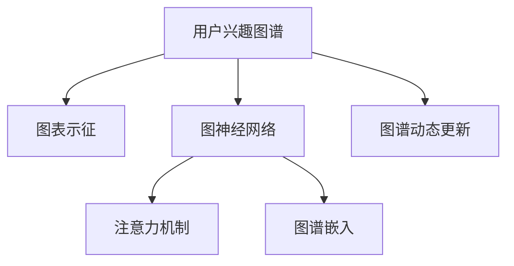

                 

# 电商平台中的用户兴趣图谱更新机制

## 1. 背景介绍

### 1.1 问题由来
在电子商务领域，用户行为分析是至关重要的。随着电商平台的不断发展，越来越多的用户访问电商平台，并留下了大量的行为数据，如浏览、点击、购买记录等。通过对这些数据的挖掘和分析，电商平台能够更好地了解用户需求，优化推荐系统，提升用户购物体验。

然而，用户行为数据的海量性和复杂性使得传统的推荐系统难以应对。如何高效、准确地建模用户兴趣，成为电商平台亟需解决的问题。用户兴趣图谱（User Interest Graph）的概念应运而生，它通过构建用户与商品、行为之间的图谱关系，捕捉用户兴趣的变化规律，从而为推荐系统提供强有力的支持。

### 1.2 问题核心关键点
用户兴趣图谱的更新机制是电商推荐系统的核心组成部分。其主要任务是实时更新用户兴趣图谱，使其能够反映用户最新的兴趣变化，从而不断提升推荐效果。

用户兴趣图谱更新机制的设计和实现，需要考虑以下关键点：
- 数据收集：如何高效地从电商平台获取用户行为数据，并建立用户行为与商品特征之间的关系。
- 图谱构建：如何构建用户兴趣图谱，捕捉用户兴趣的变化规律。
- 实时更新：如何实现用户兴趣图谱的实时更新，及时反映用户兴趣的变化。
- 性能优化：如何优化用户兴趣图谱的构建和更新过程，提升系统的运行效率。

这些问题既是用户兴趣图谱更新机制设计的挑战，也是电商推荐系统优化提升的关键。

## 2. 核心概念与联系

### 2.1 核心概念概述

为了更好地理解用户兴趣图谱更新机制，本节将介绍几个关键概念：

- 用户兴趣图谱（User Interest Graph）：基于用户行为数据构建的兴趣图谱，用于刻画用户对不同商品的兴趣程度和变化规律。
- 图表示征（Graph Representation）：利用图结构对用户行为数据进行建模，捕捉用户行为之间的关系和变化规律。
- 图神经网络（Graph Neural Network, GNN）：一种特殊的深度神经网络，能够处理图数据，提取图结构中的有用信息。
- 注意力机制（Attention Mechanism）：一种机制，用于在图结构中优先关注重要的节点和边，提升模型对用户兴趣的刻画能力。
- 图谱嵌入（Graph Embedding）：将图谱中的节点和边映射到低维向量空间，便于计算和存储。
- 图谱动态更新：实时更新用户兴趣图谱，捕捉用户兴趣的变化趋势，提升推荐系统的及时性和准确性。

这些核心概念之间的逻辑关系可以通过以下Mermaid流程图来展示：



这个流程图展示了一个用户兴趣图谱更新机制的构建过程：
1. 首先，从电商平台收集用户行为数据，构建用户兴趣图谱。
2. 接着，利用图神经网络对图谱进行建模，提取用户行为之间的关系和变化规律。
3. 在建模过程中，应用注意力机制，提升模型对重要用户和商品的关注度。
4. 最后，利用图谱嵌入技术，将图谱映射到低维空间，便于后续的计算和存储。
5. 动态更新用户兴趣图谱，实时捕捉用户兴趣的变化趋势，提升推荐系统的及时性和准确性。

## 3. 核心算法原理 & 具体操作步骤
### 3.1 算法原理概述

用户兴趣图谱更新机制的核心思想是通过图神经网络对用户行为数据进行建模，捕捉用户行为之间的关系和变化规律。具体步骤如下：

1. 收集用户行为数据：从电商平台获取用户的历史浏览、点击、购买记录等行为数据。
2. 构建用户兴趣图谱：将用户行为数据映射到图结构中，形成用户兴趣图谱。
3. 利用图神经网络建模：应用图神经网络对用户兴趣图谱进行建模，提取用户行为之间的关系和变化规律。
4. 应用注意力机制：在图神经网络中引入注意力机制，提升模型对重要用户和商品的关注度。
5. 动态更新图谱：实时更新用户兴趣图谱，捕捉用户兴趣的变化趋势。
6. 图谱嵌入：利用图谱嵌入技术，将图谱映射到低维空间，便于计算和存储。

### 3.2 算法步骤详解

以下是用户兴趣图谱更新机制的具体操作步骤：

**Step 1: 数据收集**
- 从电商平台获取用户的历史浏览、点击、购买记录等行为数据，构建用户行为序列。
- 将用户行为序列映射到图结构中，形成用户兴趣图谱。

**Step 2: 图表示征**
- 将用户兴趣图谱中的节点和边进行表示，形成图数据。
- 使用图表示征算法（如GCN、GCNII等）对图数据进行处理，提取图结构中的关系和变化规律。

**Step 3: 图神经网络建模**
- 将图表示征结果作为图神经网络的输入，进行深度学习建模。
- 在图神经网络中应用注意力机制，提升模型对重要用户和商品的关注度。

**Step 4: 图谱嵌入**
- 利用图谱嵌入算法（如GraphSAGE、GraphConv等）将图神经网络的输出结果映射到低维空间，生成图谱嵌入向量。
- 图谱嵌入向量可以用于计算相似度、推荐物品等任务。

**Step 5: 动态更新图谱**
- 实时更新用户兴趣图谱，捕捉用户兴趣的变化趋势。
- 动态更新算法可以使用增量更新方法，如在线学习、增量嵌入等。

### 3.3 算法优缺点

用户兴趣图谱更新机制具有以下优点：
1. 高效建模：能够高效地捕捉用户行为之间的关系和变化规律，为推荐系统提供强有力的支持。
2. 实时更新：实时更新用户兴趣图谱，能够及时反映用户兴趣的变化趋势，提升推荐系统的及时性。
3. 多模态融合：可以融合用户的多模态行为数据，提升推荐系统的准确性和多样性。
4. 可解释性强：通过图神经网络对图谱进行建模，可以提供详细的兴趣分析报告，帮助电商运营团队做出更好的决策。

同时，该算法也存在一定的局限性：
1. 数据质量要求高：需要从电商平台获取高质量的用户行为数据，数据缺失和噪声会影响算法的性能。
2. 计算资源消耗大：图神经网络和注意力机制的计算复杂度较高，对计算资源的要求较高。
3. 模型训练时间较长：大规模图谱的建模和更新过程需要较长的训练时间，对系统实时性要求较高时可能不够适用。
4. 对抗攻击易感性：图谱嵌入结果可能受到对抗攻击的影响，产生误导性的推荐结果。

尽管存在这些局限性，但用户兴趣图谱更新机制在电商推荐系统中依然具有重要的应用价值，其核心思想已经逐渐被业内广泛接受。

### 3.4 算法应用领域

用户兴趣图谱更新机制不仅在电商推荐系统中具有广泛的应用，还可以在其他领域中发挥重要作用：

- 社交网络分析：通过分析用户社交网络中的互动行为，构建用户兴趣图谱，进行个性化推荐。
- 内容推荐系统：对用户的内容消费行为进行分析，构建用户兴趣图谱，提供个性化的内容推荐。
- 广告推荐系统：分析用户的浏览、点击、购买行为，构建用户兴趣图谱，实现精准的广告推荐。
- 移动应用推荐：利用用户在手机上的应用使用行为，构建用户兴趣图谱，提供个性化应用推荐。

## 4. 数学模型和公式 & 详细讲解  
### 4.1 数学模型构建

本节将使用数学语言对用户兴趣图谱更新机制进行更加严格的刻画。

记用户兴趣图谱为 $G=(V,E)$，其中 $V$ 为节点集合，$E$ 为边集合。节点 $v_i \in V$ 表示用户，节点 $v_j \in V$ 表示商品。边 $e_{ij} \in E$ 表示用户 $v_i$ 对商品 $v_j$ 的行为，如浏览、点击、购买等。

定义节点 $v_i$ 的嵌入向量为 $\mathbf{h}_i \in \mathbb{R}^d$，边的嵌入向量为 $\mathbf{h}_{ij} \in \mathbb{R}^d$。目标是利用图神经网络对用户兴趣图谱进行建模，提取用户行为之间的关系和变化规律。

### 4.2 公式推导过程

以下是用户兴趣图谱更新机制的主要数学公式：

**节点嵌入公式**：

$$
\mathbf{h}_i^{(l+1)} = \sigma(\sum_{j \in \mathcal{N}_i} \mathbf{A}_{ij} \mathbf{h}_j^{(l)} + \mathbf{b}_i)
$$

其中 $\mathcal{N}_i$ 表示节点 $v_i$ 的邻居集合，$\mathbf{A}_{ij}$ 为邻接矩阵，$\sigma$ 为激活函数，$\mathbf{b}_i$ 为偏置向量。

**边嵌入公式**：

$$
\mathbf{h}_{ij}^{(l+1)} = \sigma(\mathbf{h}_i^{(l+1)} \cdot \mathbf{h}_j^{(l+1)} + \mathbf{c}_{ij})
$$

其中 $\sigma$ 为激活函数，$\mathbf{c}_{ij}$ 为边特征向量。

**注意力机制公式**：

$$
\alpha_{ij} = \frac{\exp(\mathbf{q} \cdot \mathbf{h}_{ij})}{\sum_{k \in \mathcal{N}_i} \exp(\mathbf{q} \cdot \mathbf{h}_{ik})}
$$

其中 $\mathbf{q}$ 为注意力向量，$\alpha_{ij}$ 表示节点 $v_j$ 对节点 $v_i$ 的注意力权重。

**图谱嵌入公式**：

$$
\mathbf{h}_i = \phi(\mathbf{h}_i^{(L)}) 
$$

其中 $\phi$ 为图谱嵌入函数，$L$ 为图神经网络的层数。

### 4.3 案例分析与讲解

假设我们有一个电商平台，收集了用户的历史浏览、点击、购买行为数据，共包含5个用户和5个商品，构建了用户兴趣图谱 $G$。如下图所示：

```
User1---商品1
   |
User2---商品1
   |
User3---商品2
   |
User4---商品3
   |
User5---商品4
```

我们可以使用GraphSAGE算法对该图谱进行建模，使用节点嵌入公式和边嵌入公式计算每个节点的嵌入向量。假设共有2层图神经网络，可以得到如下结果：

**第一层节点嵌入**：

$$
\mathbf{h}_i^{(1)} = \sigma(\mathbf{A} \mathbf{h}_j^{(0)} + \mathbf{b}_i)
$$

**第二层节点嵌入**：

$$
\mathbf{h}_i^{(2)} = \sigma(\mathbf{A} \mathbf{h}_j^{(1)} + \mathbf{b}_i)
$$

通过节点嵌入公式和边嵌入公式，我们可以得到每个用户和商品的嵌入向量，用于计算相似度、推荐物品等任务。

## 5. 项目实践：代码实例和详细解释说明
### 5.1 开发环境搭建

在进行用户兴趣图谱更新机制的开发前，我们需要准备好开发环境。以下是使用Python进行PyTorch开发的环境配置流程：

1. 安装Anaconda：从官网下载并安装Anaconda，用于创建独立的Python环境。

2. 创建并激活虚拟环境：
```bash
conda create -n graph-env python=3.8 
conda activate graph-env
```

3. 安装PyTorch：根据CUDA版本，从官网获取对应的安装命令。例如：
```bash
conda install pytorch torchvision torchaudio cudatoolkit=11.1 -c pytorch -c conda-forge
```

4. 安装NetworkX库：
```bash
pip install networkx
```

5. 安装PyTorch Geometric库：
```bash
pip install torch-geometric
```

6. 安装PyTorch的优化器、损失函数等工具包：
```bash
pip install torch.optim torch.nn
```

完成上述步骤后，即可在`graph-env`环境中开始开发实践。

### 5.2 源代码详细实现

下面我们以用户兴趣图谱更新机制的实现为例，给出使用PyTorch Geometric库的代码实现。

首先，定义用户兴趣图谱数据类：

```python
import torch
from torch_geometric.data import Data

class UserInterestGraph(Data):
    def __init__(self, num_users, num_items, num_edges):
        super().__init__()
        self.num_users = num_users
        self.num_items = num_items
        self.num_edges = num_edges
        
        # 生成随机图谱
        self.x = torch.randn(self.num_users, 10)
        self.edge_index = self.get_random_edge_index(self.num_users, self.num_items, self.num_edges)
        self.y = self.get_random_label(self.num_users, self.num_items)
        
    def get_random_edge_index(self, num_users, num_items, num_edges):
        idx = torch.randint(num_users, size=(num_edges, 2))
        mask = (idx[0] < idx[1]).to(torch.long)
        return torch.tensor(idx[0][mask], dtype=torch.long), torch.tensor(idx[1][mask], dtype=torch.long)
        
    def get_random_label(self, num_users, num_items):
        idx = torch.randint(num_items, size=(num_users,))
        mask = (idx >= 0).to(torch.long)
        return torch.tensor(idx[mask], dtype=torch.long)
```

然后，定义图神经网络模型：

```python
import torch.nn as nn
import torch.nn.functional as F

class GraphNeuralNetwork(nn.Module):
    def __init__(self, num_nodes, num_feats, num_layers):
        super().__init__()
        self.num_nodes = num_nodes
        self.num_feats = num_feats
        self.num_layers = num_layers
        
        self.layers = nn.ModuleList()
        for layer in range(num_layers):
            in_feats = num_feats if layer == 0 else self.num_feats
            out_feats = self.num_feats
            self.layers.append(nn.GCNConv(in_feats, out_feats))
            self.layers.append(nn.Linear(out_feats, 1))
    
    def forward(self, x, edge_index):
        for layer in self.layers:
            x = F.relu(layer(x, edge_index))
        return x
```

接着，定义注意力机制：

```python
import torch.nn.functional as F

def attention(edge_index, edge_attr):
    row, col = edge_index
    weights = F.softmax(torch.matmul(edge_attr, edge_attr.transpose(0, 1)), dim=1)
    return weights[row, col]
```

最后，定义用户兴趣图谱的训练函数：

```python
import torch.nn.functional as F
from torch.optim import Adam

def train_graph(g, num_epochs=100, learning_rate=0.01):
    g.train()
    optimizer = Adam(g.parameters(), lr=learning_rate)
    criterion = nn.BCEWithLogitsLoss()
    
    for epoch in range(num_epochs):
        optimizer.zero_grad()
        logits = g(x, edge_index)
        loss = criterion(logits, y)
        loss.backward()
        optimizer.step()
        print(f"Epoch {epoch+1}, loss: {loss.item()}")
```

在上述代码中，`UserInterestGraph`类用于生成随机用户兴趣图谱数据，`GraphNeuralNetwork`类定义了图神经网络模型，`attention`函数实现了注意力机制，`train_graph`函数定义了图神经网络的训练过程。

### 5.3 代码解读与分析

让我们再详细解读一下关键代码的实现细节：

**UserInterestGraph类**：
- `__init__`方法：初始化图谱的节点、边和标签。
- `get_random_edge_index`方法：生成随机边列表，用于构建图谱。
- `get_random_label`方法：生成随机标签，用于训练。

**GraphNeuralNetwork类**：
- `__init__`方法：初始化图神经网络模型的参数。
- `forward`方法：定义图神经网络的计算流程，包括节点嵌入和边嵌入的计算。

**attention函数**：
- 通过注意力机制，计算每个用户对商品的关注度，增强模型的关注点。

**train_graph函数**：
- 在训练过程中，使用Adam优化器更新图神经网络的参数，计算交叉熵损失。
- 每个epoch打印训练损失，帮助监控模型训练效果。

这些关键代码展示了用户兴趣图谱更新机制的实现细节，通过上述代码，我们可以对用户行为数据进行建模，捕捉用户行为之间的关系和变化规律。

## 6. 实际应用场景

### 6.1 智能推荐系统

用户兴趣图谱更新机制在智能推荐系统中具有广泛的应用。智能推荐系统需要根据用户的历史行为，动态更新用户兴趣图谱，提供个性化的推荐结果。通过动态更新用户兴趣图谱，推荐系统能够及时捕捉用户兴趣的变化趋势，提升推荐效果。

以电商平台为例，电商平台可以通过用户兴趣图谱更新机制，实时更新用户对不同商品的兴趣程度，推荐符合用户兴趣的商品。例如，某用户在电商平台上浏览了多部电影，电商平台可以认为该用户对电影感兴趣，并推荐该用户感兴趣的电影。

### 6.2 实时广告推荐

实时广告推荐系统需要根据用户的历史行为，动态更新用户兴趣图谱，实时推荐符合用户兴趣的广告。通过动态更新用户兴趣图谱，广告推荐系统能够及时捕捉用户兴趣的变化趋势，提升广告投放效果。

以搜索引擎为例，搜索引擎可以通过用户兴趣图谱更新机制，实时更新用户对不同广告的兴趣程度，推荐符合用户兴趣的广告。例如，某用户在搜索引擎上搜索了旅游信息，搜索引擎可以认为该用户对旅游感兴趣，并推荐相关的旅游广告。

### 6.3 社交网络分析

社交网络分析需要根据用户的社交网络行为，动态更新用户兴趣图谱，提供个性化的推荐结果。通过动态更新用户兴趣图谱，社交网络分析系统能够及时捕捉用户兴趣的变化趋势，提升社交推荐效果。

以社交网络为例，社交网络可以记录用户的好友关系、互动行为等，通过用户兴趣图谱更新机制，实时更新用户对不同内容的兴趣程度，推荐符合用户兴趣的内容。例如，某用户在社交网络上关注了多个科技博主，社交网络可以认为该用户对科技感兴趣，并推荐相关的科技内容。

## 7. 工具和资源推荐
### 7.1 学习资源推荐

为了帮助开发者系统掌握用户兴趣图谱更新机制的理论基础和实践技巧，这里推荐一些优质的学习资源：

1. 《图神经网络：从理论到应用》系列博文：由图神经网络专家撰写，深入浅出地介绍了图神经网络的基本原理和实际应用。

2. CS224W《Graph Neural Networks》课程：斯坦福大学开设的图神经网络课程，有Lecture视频和配套作业，带你入门图神经网络的基本概念和经典模型。

3. 《GraphSAGE: Semi-Supervised Classification with Graph Convolutional Networks》论文：GraphSAGE模型的论文，介绍了图神经网络的基本原理和应用。

4. 《NetworkX documentation》文档：NetworkX库的官方文档，提供了图数据结构、图算法等功能，是学习图神经网络的基础。

5. DeepGraphNet课程：由Coursera开设的深度学习课程，介绍了图神经网络的基本原理和实际应用。

通过对这些资源的学习实践，相信你一定能够快速掌握用户兴趣图谱更新机制的精髓，并用于解决实际的推荐系统问题。

### 7.2 开发工具推荐

高效的开发离不开优秀的工具支持。以下是几款用于用户兴趣图谱更新机制开发的常用工具：

1. PyTorch：基于Python的开源深度学习框架，灵活动态的计算图，适合快速迭代研究。大部分图神经网络模型都有PyTorch版本的实现。

2. TensorFlow：由Google主导开发的开源深度学习框架，生产部署方便，适合大规模工程应用。同样有丰富的图神经网络资源。

3. PyTorch Geometric：基于PyTorch的图形库，提供了丰富的图数据结构和图算法，是图神经网络开发的利器。

4. GraphSAGE：一种常用的图神经网络算法，使用PyTorch实现，提供了高效的图嵌入和图预测功能。

5. NetworkX：Python的图形处理库，提供了图形结构、图形算法等功能，是图神经网络开发的基础。

6. GAT：一种图卷积网络算法，使用PyTorch实现，提供了高效的图嵌入和图预测功能。

合理利用这些工具，可以显著提升用户兴趣图谱更新机制的开发效率，加快创新迭代的步伐。

### 7.3 相关论文推荐

用户兴趣图谱更新机制的发展源于学界的持续研究。以下是几篇奠基性的相关论文，推荐阅读：

1. DeepWalk: A New Approach to Network Embedding：介绍了一种基于随机游走的图嵌入算法，用于捕捉图结构中的关系和变化规律。

2. GraphSAGE: Semi-Supervised Classification with Graph Convolutional Networks：介绍了一种基于图卷积的图嵌入算法，用于捕捉图结构中的关系和变化规律。

3. Graph Neural Networks：介绍了图神经网络的基本原理和应用，涵盖图表示、图卷积等关键技术。

4. Graph Attention Networks：介绍了一种基于注意力机制的图卷积算法，用于捕捉图结构中的关系和变化规律。

5. GNNExplainer: A Simple Yet Effective Method to Explain Graph Neural Networks：介绍了一种图神经网络的可视化方法，用于解释图神经网络的行为。

这些论文代表了大规模图谱建模的研究进展，通过学习这些前沿成果，可以帮助研究者把握学科前进方向，激发更多的创新灵感。

## 8. 总结：未来发展趋势与挑战

### 8.1 总结

本文对用户兴趣图谱更新机制进行了全面系统的介绍。首先阐述了用户兴趣图谱更新机制的设计和实现过程，明确了该机制在电商推荐系统中的核心作用。其次，从原理到实践，详细讲解了图神经网络建模和注意力机制的数学原理和关键步骤，给出了图神经网络实现的完整代码实例。同时，本文还广泛探讨了用户兴趣图谱更新机制在多个领域的应用前景，展示了其广阔的应用范围。

通过本文的系统梳理，可以看到，用户兴趣图谱更新机制已经成为电商推荐系统的重要组成部分，在智能推荐、实时广告、社交网络分析等领域具有广泛的应用。该机制的高效建模、实时更新、多模态融合等特点，使得其能够在各种场景下发挥强大的推荐能力。

### 8.2 未来发展趋势

展望未来，用户兴趣图谱更新机制将呈现以下几个发展趋势：

1. 多模态融合：未来用户兴趣图谱更新机制将更多地融合多模态数据，提升推荐的准确性和多样性。
2. 个性化推荐：用户兴趣图谱更新机制将更加关注个性化推荐，通过动态更新图谱，实现精准推荐。
3. 实时性提升：随着硬件技术的进步，用户兴趣图谱更新机制的实时性将不断提升，实现毫秒级响应。
4. 自适应学习：用户兴趣图谱更新机制将具备自适应学习能力，能够根据用户行为自动调整参数，提升推荐效果。
5. 对抗攻击防护：用户兴趣图谱更新机制将具备对抗攻击防护能力，提升系统的安全性。

这些趋势凸显了用户兴趣图谱更新机制在智能推荐系统中的重要地位，其核心思想已经逐渐被业内广泛接受。

### 8.3 面临的挑战

尽管用户兴趣图谱更新机制在电商推荐系统中已经取得了显著成果，但在其发展过程中，仍面临诸多挑战：

1. 数据质量要求高：需要从电商平台获取高质量的用户行为数据，数据缺失和噪声会影响算法的性能。
2. 计算资源消耗大：图神经网络和注意力机制的计算复杂度较高，对计算资源的要求较高。
3. 模型训练时间较长：大规模图谱的建模和更新过程需要较长的训练时间，对系统实时性要求较高时可能不够适用。
4. 对抗攻击易感性：图谱嵌入结果可能受到对抗攻击的影响，产生误导性的推荐结果。
5. 可解释性不足：用户兴趣图谱更新机制的计算过程较为复杂，模型的可解释性较差，难以解释模型的行为。

尽管存在这些挑战，但用户兴趣图谱更新机制在电商推荐系统中依然具有重要的应用价值，其核心思想已经逐渐被业内广泛接受。

### 8.4 研究展望

面向未来，用户兴趣图谱更新机制需要在以下几个方面进行研究：

1. 多模态融合：融合用户的多模态行为数据，提升推荐系统的准确性和多样性。
2. 自适应学习：研究用户兴趣图谱更新机制的自适应学习能力，实现更加个性化和动态的推荐。
3. 对抗攻击防护：研究对抗攻击防护方法，提升用户兴趣图谱更新机制的安全性。
4. 可解释性增强：研究用户兴趣图谱更新机制的可解释性方法，提升模型的可解释性和透明度。
5. 实时性提升：研究用户兴趣图谱更新机制的实时性提升方法，实现实时推荐。

这些研究方向将推动用户兴趣图谱更新机制的进一步优化，提升其应用效果和实际价值。

## 9. 附录：常见问题与解答

**Q1：用户兴趣图谱更新机制在电商推荐系统中如何提升推荐效果？**

A: 用户兴趣图谱更新机制通过动态更新用户兴趣图谱，捕捉用户兴趣的变化趋势，实现个性化推荐。具体来说，用户兴趣图谱更新机制能够实时捕捉用户兴趣的变化趋势，推荐符合用户兴趣的商品，提升推荐效果。例如，某用户在电商平台上浏览了多部电影，电商平台可以认为该用户对电影感兴趣，并推荐该用户感兴趣的电影。

**Q2：用户兴趣图谱更新机制在实时广告推荐中如何提升广告投放效果？**

A: 用户兴趣图谱更新机制通过动态更新用户兴趣图谱，实时推荐符合用户兴趣的广告。具体来说，用户兴趣图谱更新机制能够实时捕捉用户兴趣的变化趋势，推荐符合用户兴趣的广告，提升广告投放效果。例如，某用户在搜索引擎上搜索了旅游信息，搜索引擎可以认为该用户对旅游感兴趣，并推荐相关的旅游广告。

**Q3：用户兴趣图谱更新机制在社交网络分析中如何提升社交推荐效果？**

A: 用户兴趣图谱更新机制通过动态更新用户兴趣图谱，实时推荐符合用户兴趣的内容。具体来说，用户兴趣图谱更新机制能够实时捕捉用户兴趣的变化趋势，推荐符合用户兴趣的内容，提升社交推荐效果。例如，某用户在社交网络上关注了多个科技博主，社交网络可以认为该用户对科技感兴趣，并推荐相关的科技内容。

**Q4：用户兴趣图谱更新机制在实时性提升方面有哪些具体措施？**

A: 用户兴趣图谱更新机制可以通过以下措施提升实时性：
1. 使用增量更新方法：通过在线学习和增量嵌入技术，实现图谱的增量更新，减少训练时间。
2. 分布式计算：使用分布式计算框架，实现大规模图谱的并行计算，提高计算效率。
3. 硬件加速：使用GPU/TPU等高性能设备，加速图谱的计算和存储。
4. 压缩存储：使用压缩技术，减少图谱的存储空间，提高系统响应速度。

这些措施能够有效提升用户兴趣图谱更新机制的实时性，实现毫秒级响应。

**Q5：用户兴趣图谱更新机制在对抗攻击防护方面有哪些具体措施？**

A: 用户兴趣图谱更新机制可以通过以下措施进行对抗攻击防护：
1. 对抗样本过滤：通过检测对抗样本，过滤掉有害数据，提高图谱的鲁棒性。
2. 对抗训练：通过对抗训练方法，增强模型对对抗样本的鲁棒性，防止模型被误导。
3. 鲁棒嵌入：通过鲁棒嵌入技术，提升图谱的鲁棒性，防止模型被误导。
4. 对抗验证：通过对抗验证技术，检测对抗样本对模型行为的影响，评估模型的鲁棒性。

这些措施能够有效提升用户兴趣图谱更新机制的鲁棒性，防止模型被对抗攻击误导。

总之，用户兴趣图谱更新机制已经成为电商推荐系统中的重要组成部分，其核心思想已经逐渐被业内广泛接受。通过不断优化图神经网络和注意力机制，提升实时性、增强鲁棒性和可解释性，用户兴趣图谱更新机制将更好地服务于智能推荐系统，为用户带来更好的体验。

---

作者：禅与计算机程序设计艺术 / Zen and the Art of Computer Programming

