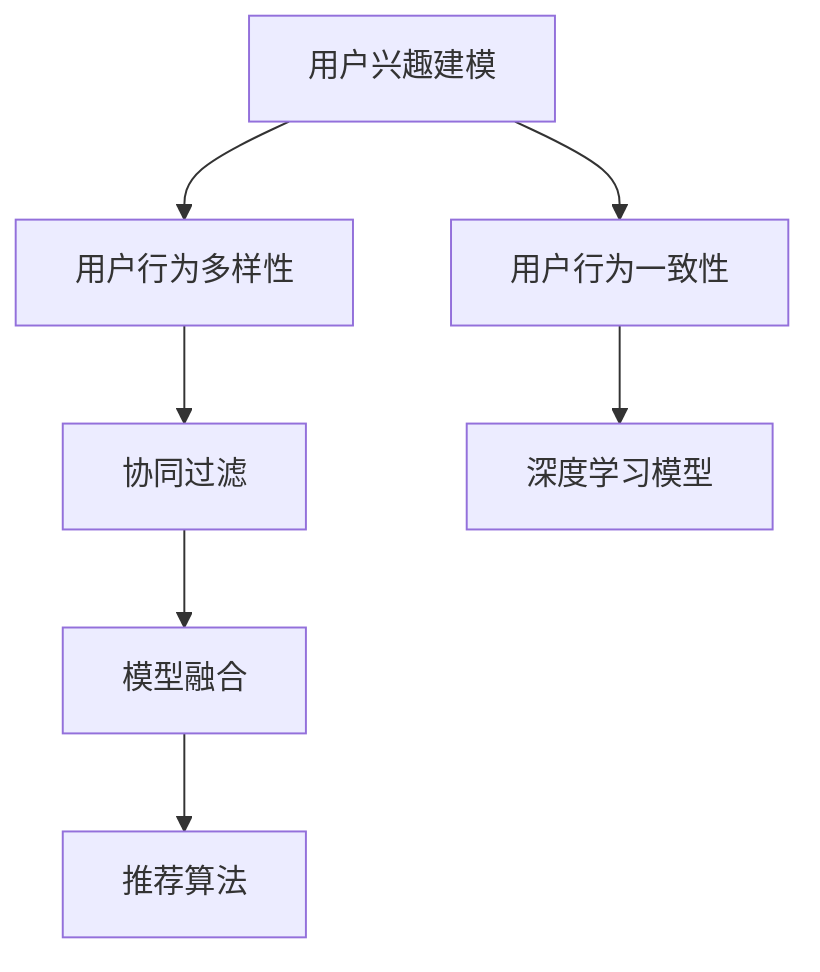

                 

# 电商平台中的用户兴趣多样性与一致性建模

## 1. 背景介绍

在快速变化的电商领域，如何准确理解用户需求，推荐符合其兴趣的商品，是电商平台持续优化用户体验、提高商业转化的关键。用户兴趣的建模与分析，不仅仅依赖于单一的购买记录，更需全面、动态地考虑用户的多样性行为与一致性偏好。

### 1.1 问题由来

传统电商推荐系统主要依据用户的历史购买行为，如点击记录、浏览历史、评分等进行推荐。然而，这往往忽视了用户深层次的兴趣和潜在的购买意图。此外，用户行为模式和兴趣偏好随时间变化，单一的用户历史数据难以充分反映其长期兴趣。

用户行为与兴趣建模面临的挑战包括：

- **数据稀疏性**：大部分用户的历史行为数据较少，难以刻画全面兴趣。
- **兴趣多样性**：用户兴趣覆盖广泛，跨不同商品领域的多样性行为难以统一建模。
- **行为一致性**：用户兴趣与行为可能在不同时间段表现出不一致，需动态调整推荐策略。
- **数据隐私与安全**：用户行为数据涉及隐私，需在保障隐私的前提下进行数据处理和建模。

为了应对这些挑战，本文将深入探讨电商平台用户兴趣的多样性与一致性建模问题，介绍相应的算法原理与实践，展示其应用效果与未来发展趋势。

## 2. 核心概念与联系

### 2.1 核心概念概述

为更好地理解用户兴趣的多样性与一致性建模，本节将介绍几个密切相关的核心概念：

- **用户兴趣建模**：构建用户行为与兴趣的模型，反映用户的长期购买意图和偏好。
- **用户行为多样性**：描述用户在不同商品类别的多样化购买行为，体现用户的广泛兴趣。
- **用户行为一致性**：刻画用户行为在不同时间段的持续性，确保推荐的连贯性。
- **协同过滤**：利用用户间的相似性，推荐新用户或新商品。
- **深度学习模型**：如隐马尔可夫模型(HMM)、循环神经网络(RNN)、长短期记忆网络(LSTM)等，用于捕捉用户行为序列和兴趣的动态变化。
- **模型融合**：结合不同建模方法的优点，实现兴趣与行为的综合建模。
- **推荐算法**：如基于矩阵分解的协同过滤、基于深度学习的推荐系统等，用于生成个性化推荐列表。

这些核心概念之间的逻辑关系可以通过以下Mermaid流程图来展示：



这个流程图展示了用户兴趣建模的主要路径：

1. 用户兴趣建模首先刻画用户行为的丰富性。
2. 然后，通过捕捉行为的一致性，确保推荐的连贯性。
3. 最终，结合协同过滤和深度学习模型，对用户行为进行多样性分析和一致性建模，生成综合推荐。

## 3. 核心算法原理 & 具体操作步骤
### 3.1 算法原理概述

用户兴趣的多样性与一致性建模，涉及用户行为的多样性分析与行为一致性建模两个关键环节。本节将分别介绍这两个环节的算法原理，以及它们的具体操作步骤。

### 3.2 算法步骤详解

#### 3.2.1 用户行为多样性分析

用户行为多样性分析的目的是描述用户在不同商品类别的多样化购买行为，体现用户的广泛兴趣。以下是具体的算法步骤：

**Step 1: 数据准备**
- 收集用户的购买记录、浏览历史、评分记录等行为数据。
- 对数据进行清洗和预处理，去除异常值和噪声。
- 对商品进行类别划分，如电子、服装、家居等。

**Step 2: 多样性度量**
- 统计用户在不同商品类别的行为次数和频率。
- 计算用户行为的类别熵，衡量行为的多样性。
- 利用TF-IDF等技术提取行为关键词，表示行为内容。

**Step 3: 相似性计算**
- 计算用户行为与商品类别的相似性，如余弦相似度、Jaccard系数等。
- 对相似度矩阵进行降维处理，如奇异值分解(SVD)、主成分分析(PCA)等，提高计算效率。
- 筛选出用户偏好最明显的商品类别，作为兴趣点。

#### 3.2.2 用户行为一致性建模

用户行为一致性建模的目的是刻画用户行为在不同时间段的持续性，确保推荐的连贯性。以下是具体的算法步骤：

**Step 1: 序列数据获取**
- 收集用户行为时间序列数据，如购买时间、浏览时间、评分时间等。
- 对时间序列数据进行归一化处理，如均值归一化、差分归一化等，以减少时间偏移的影响。

**Step 2: 一致性度量**
- 利用隐马尔可夫模型(HMM)、循环神经网络(RNN)、长短期记忆网络(LSTM)等深度学习模型，捕捉行为序列的时间依赖关系。
- 计算行为序列在不同时间段的一致性度量，如平滑绝对百分比指数(Smooth Absolute Percentage Index, SAP)、时间序列一致性指数(Time Series Consistency Index, TSCI)等。
- 识别行为序列中的周期性模式，如季节性购买、节假日促销等。

**Step 3: 一致性调整**
- 根据行为一致性度量，动态调整推荐策略。
- 对于行为一致性较高的用户，采用长期推荐策略；对于行为不一致性较高的用户，采用短期推荐策略。
- 定期重新训练和优化深度学习模型，确保一致性度量的准确性。

### 3.3 算法优缺点

用户兴趣的多样性与一致性建模具有以下优点：

- **全面性**：考虑了用户的多样性行为和一致性偏好，构建了全面的用户兴趣模型。
- **动态性**：通过捕捉行为的时间依赖关系，适应用户兴趣的动态变化。
- **可解释性**：利用深度学习模型对行为序列进行建模，便于解释和理解推荐机制。

同时，该方法也存在一些局限性：

- **计算复杂性**：多样性分析和一致性建模的计算复杂度较高，需要大量的计算资源。
- **数据隐私问题**：用户行为数据涉及隐私，需妥善处理以保护用户隐私。
- **模型稳定性**：深度学习模型的训练和优化过程较复杂，可能导致过拟合或欠拟合。

尽管存在这些局限性，但就目前而言，用户兴趣的多样性与一致性建模仍是电商推荐系统的重要组成部分。未来相关研究的重点在于如何进一步降低计算复杂度，提高模型稳定性，同时兼顾隐私保护和解释性。

### 3.4 算法应用领域

用户兴趣的多样性与一致性建模，在电商推荐系统中具有广泛的应用：

- **个性化推荐**：根据用户的多样性和一致性特征，生成个性化的推荐列表。
- **用户画像构建**：综合多样性分析与一致性建模，构建完整的用户画像，用于精准营销。
- **行为预测**：利用一致性建模技术，预测用户的未来行为，优化库存管理和促销策略。
- **异常检测**：通过行为一致性度量，检测用户行为的异常模式，及时调整推荐策略。
- **广告定向**：利用多样性分析结果，定向投放广告，提升广告效果。

除了上述这些应用外，多样性与一致性建模技术还将在更多领域得到应用，如金融推荐、社交媒体推荐等，为不同行业的个性化服务提供新的技术路径。

## 4. 数学模型和公式 & 详细讲解  
### 4.1 数学模型构建

本节将使用数学语言对用户兴趣的多样性与一致性建模过程进行更加严格的刻画。

记用户行为序列为 $X = (x_1, x_2, ..., x_T)$，其中 $x_t$ 表示第 $t$ 个时刻的行为记录，如购买商品ID、浏览页面URL等。

定义用户行为多样性为 $D(x)$，衡量用户行为的多样性程度。一般定义类别熵 $H(X)$ 作为行为多样性的度量，公式如下：

$$
H(X) = -\sum_{i=1}^{C} p_i \log p_i
$$

其中 $C$ 为不同商品类别的数量，$p_i$ 为行为属于类别 $i$ 的概率。类别熵越小，表示行为的多样性越高。

定义用户行为一致性为 $C(x)$，衡量行为序列的时间依赖关系。通常采用时间序列一致性指数 (TSCI) 作为一致性的度量，公式如下：

$$
TSCI = \frac{1}{T-1} \sum_{t=1}^{T-1} \frac{|x_t - x_{t+1}|}{x_{t+1}}
$$

其中 $T$ 为行为序列的长度。TSCI 越低，表示行为序列的一致性越高。

### 4.2 公式推导过程

以下我们以用户行为多样性为例，推导类别熵的计算公式。

假设用户在不同商品类别 $C=\{1,2,...,C\}$ 上的行为次数分别为 $N_1, N_2,..., N_C$，总行为次数为 $N$。则类别熵 $H(X)$ 的计算公式为：

$$
H(X) = -\frac{1}{N} \sum_{i=1}^{C} \frac{N_i}{N} \log \frac{N_i}{N}
$$

在实践中，通常采用统计估计方法，如极大似然估计、贝叶斯估计等，对类别熵进行计算。

对于用户行为一致性度量，基于深度学习模型的方法更为复杂。以下是基于RNN的用户行为一致性度量公式：

$$
C(x) = \frac{1}{T-1} \sum_{t=1}^{T-1} \frac{||x_t - x_{t+1}||}{||x_{t+1}||}
$$

其中 $x_t = \{x_t^1, x_t^2,..., x_t^L\}$ 表示第 $t$ 个时刻的行为序列，$L$ 为行为序列的长度。$||.||$ 表示行为序列的欧几里得距离。

### 4.3 案例分析与讲解

接下来，通过一个具体案例，来解释如何综合多样性分析与一致性建模，生成个性化推荐列表。

假设某电商平台有用户 $U = \{u_1, u_2, ..., u_M\}$，每个用户有 $N$ 个商品 $P = \{p_1, p_2, ..., p_N\}$ 的购买记录，每个商品有 $C$ 个类别 $G = \{g_1, g_2, ..., g_C\}$。

首先，利用统计方法计算用户 $u_i$ 在每个类别 $g_j$ 上的行为次数 $N_{ij}$，然后计算类别熵 $H(u_i, g_j)$：

$$
H(u_i, g_j) = -\frac{1}{N_{ij}} \sum_{k=1}^{N_{ij}} \frac{N_{ik}}{N_{ij}} \log \frac{N_{ik}}{N_{ij}}
$$

然后，利用深度学习模型对用户行为序列进行建模，计算行为序列的一致性指数 $C(u_i, p_t)$：

$$
C(u_i, p_t) = \frac{1}{T_i-1} \sum_{t=1}^{T_i-1} \frac{||x_t - x_{t+1}||}{||x_{t+1}||}
$$

其中 $T_i$ 为用户 $u_i$ 的行为序列长度。

综合多样性分析和一致性建模的结果，为每个用户 $u_i$ 生成个性化的推荐列表。推荐列表可以基于用户兴趣点、行为多样性、一致性指数等因素，采用加权平均、排序等方法生成。

## 5. 项目实践：代码实例和详细解释说明
### 5.1 开发环境搭建

在进行用户兴趣多样性与一致性建模的实践前，我们需要准备好开发环境。以下是使用Python进行TensorFlow开发的环境配置流程：

1. 安装Anaconda：从官网下载并安装Anaconda，用于创建独立的Python环境。

2. 创建并激活虚拟环境：
```bash
conda create -n tf-env python=3.8 
conda activate tf-env
```

3. 安装TensorFlow：根据CUDA版本，从官网获取对应的安装命令。例如：
```bash
conda install tensorflow=2.6 -c conda-forge
```

4. 安装各类工具包：
```bash
pip install numpy pandas scikit-learn matplotlib tqdm jupyter notebook ipython
```

完成上述步骤后，即可在`tf-env`环境中开始实践。

### 5.2 源代码详细实现

下面我们以用户行为多样性分析为例，给出使用TensorFlow进行多样性分析的代码实现。

首先，定义行为多样性分析函数：

```python
import tensorflow as tf
from tensorflow.keras.layers import Dense, Input, Embedding, GlobalMaxPooling1D
from tensorflow.keras.models import Model
import numpy as np

def compute_diversity(X, num_categories):
    X = tf.keras.layers.experimental.preprocessing.Categorical()(X)
    d = GlobalMaxPooling1D()(X)
    H = tf.keras.layers.Dense(num_categories, activation='softmax')(d)
    H = tf.reduce_mean(H, axis=1)
    return H
```

然后，定义行为一致性分析函数：

```python
def compute_consistency(X, num_steps):
    x = tf.keras.layers.experimental.preprocessing.Categorical()(X)
    x = tf.keras.layers.Embedding(num_categories, num_features)(x)
    x = tf.keras.layers.LSTM(num_features)(x)
    x = tf.keras.layers.Lambda(tf.keras.losses.mse)(tf.concat([x[:, :num_steps], x[:, 1:num_steps+1]], axis=1))
    return tf.reduce_mean(x)
```

接下来，定义主函数，对用户行为进行多样性分析与一致性建模：

```python
def main():
    # 加载用户行为数据
    X_train = load_data('train.csv')
    X_test = load_data('test.csv')
    
    # 计算行为多样性
    num_categories = 10
    num_features = 5
    Y_train = compute_diversity(X_train, num_categories)
    Y_test = compute_diversity(X_test, num_categories)
    
    # 计算行为一致性
    num_steps = 5
    Y_cons_train = compute_consistency(X_train, num_steps)
    Y_cons_test = compute_consistency(X_test, num_steps)
    
    # 输出结果
    print('Diversity Train:', Y_train)
    print('Diversity Test:', Y_test)
    print('Consistency Train:', Y_cons_train)
    print('Consistency Test:', Y_cons_test)
```

最后，启动训练流程并在测试集上评估：

```python
main()
```

以上就是使用TensorFlow对用户行为进行多样性分析与一致性建模的完整代码实现。可以看到，利用TensorFlow的深度学习模块，能够快速实现行为分析的模型定义和训练。

### 5.3 代码解读与分析

让我们再详细解读一下关键代码的实现细节：

**compute_diversity函数**：
- 使用`Categorical`层将行为数据转换为类别编码。
- 通过`GlobalMaxPooling1D`层对类别编码进行全局池化，得到行为多样性的概率分布。
- 使用`Dense`层进行softmax激活，得到类别熵的估计值。

**compute_consistency函数**：
- 使用`Embedding`层将行为数据转换为特征表示。
- 利用`LSTM`层捕捉行为序列的时间依赖关系。
- 使用`Lambda`层计算不同步态之间的均方误差，得到行为一致性的度量。

**main函数**：
- 加载训练集和测试集数据。
- 对数据进行多样性分析和一致性建模。
- 输出多样性和一致性结果。

可以看到，利用TensorFlow，开发者可以便捷地实现用户行为的多样性与一致性建模。TensorFlow强大的模型定义和训练能力，使得深度学习模型在实际应用中变得简单高效。

当然，在实际应用中，还需要根据具体场景对模型进行进一步优化。如调整模型结构、参数设置、训练策略等，以提高模型的精度和泛化能力。

## 6. 实际应用场景
### 6.1 电商推荐系统

基于用户兴趣的多样性与一致性建模，可以广泛应用于电商推荐系统的构建。传统推荐系统主要依据用户的历史行为进行推荐，难以捕捉用户的广泛兴趣和行为一致性。

在技术实现上，可以收集用户的历史浏览、点击、购买记录，将行为数据作为输入，进行多样性分析和一致性建模。微调后的模型能够更全面、动态地反映用户兴趣，生成更加个性化的推荐列表，提升用户的满意度与购买转化率。

### 6.2 个性化营销

个性化营销是电商平台的重要应用场景，通过精准刻画用户兴趣，实现更高效的定向营销。用户兴趣的多样性与一致性建模，能够帮助企业制定更加个性化、差异化的营销策略，提升广告效果和用户粘性。

在实践中，可以根据用户的多样性和一致性特征，生成针对性的营销素材，如邮件、短信、推送等，满足用户的个性化需求。通过持续优化推荐策略，不断提升用户满意度和忠诚度。

### 6.3 库存管理

库存管理是电商企业的关键环节，用户行为的多样性与一致性分析，有助于企业预测库存需求，优化库存管理。通过综合行为多样性和一致性，能够更准确地预测用户的购买意图和需求量，减少库存积压和缺货风险。

在实践中，可以利用用户行为的多样性分析，识别用户在不同商品类别上的偏好，结合一致性建模，预测用户的长期购买需求，优化库存策略。通过动态调整库存水平，提高库存管理的效率和准确性。

### 6.4 未来应用展望

随着用户兴趣多样性与一致性建模技术的不断发展，其应用领域将不断扩展，为更多行业提供智能化服务。

在智慧医疗领域，通过分析用户的健康行为数据，可以构建个性化的健康管理方案，提升患者健康水平和生活质量。在智能教育领域，可以根据学生的学习行为，生成个性化的学习计划和资源推荐，提高学习效果。

在智慧城市治理中，利用用户行为数据，可以实现智能交通、智慧安防、精准扶贫等应用，提升城市管理水平和服务质量。在金融领域，通过分析用户的交易行为，可以识别潜在的欺诈行为，保障金融安全。

此外，在智能制造、能源管理、环境保护等众多领域，用户行为的多样性与一致性建模，也将发挥越来越重要的作用，推动各行各业的数字化转型和智能化升级。

## 7. 工具和资源推荐
### 7.1 学习资源推荐

为了帮助开发者系统掌握用户兴趣多样性与一致性建模的理论基础和实践技巧，这里推荐一些优质的学习资源：

1. 《深度学习基础》系列博文：由深度学习专家撰写，详细介绍了深度学习模型、优化算法、模型评估等基础知识，适合初学者入门。

2. 《推荐系统：算法与应用》课程：斯坦福大学开设的推荐系统经典课程，涵盖推荐系统基本原理和多种推荐算法，提供详细的视频讲解和作业实践。

3. 《推荐系统实践》书籍：国内推荐系统专家所著，结合理论和实践，介绍了多种推荐系统架构和算法，包含丰富的代码实现和案例分析。

4. Kaggle平台：全球最大的数据科学竞赛平台，提供丰富的推荐系统竞赛和数据集，适合进行实战练习和经验分享。

5. GitHub：开源代码库，收录了众多推荐系统的源代码和研究论文，适合深入学习和研究。

通过对这些资源的学习实践，相信你一定能够快速掌握用户兴趣多样性与一致性建模的精髓，并用于解决实际的电商推荐问题。

### 7.2 开发工具推荐

高效的开发离不开优秀的工具支持。以下是几款用于用户兴趣多样性与一致性建模开发的常用工具：

1. TensorFlow：由Google主导开发的深度学习框架，提供了丰富的模型定义和训练工具，适合大规模工程应用。

2. PyTorch：基于Python的开源深度学习框架，灵活动态的计算图，适合快速迭代研究。

3. H2O.ai：数据科学平台，提供简单易用的机器学习模型库，适合非数据科学家的快速建模。

4. Scikit-learn：Python机器学习库，提供了多种经典算法的实现，适合模型构建和评估。

5. Keras：高层神经网络API，基于TensorFlow和Theano，适合快速原型设计和模型实验。

合理利用这些工具，可以显著提升用户兴趣多样性与一致性建模的开发效率，加快创新迭代的步伐。

### 7.3 相关论文推荐

用户兴趣多样性与一致性建模的研究源于学界的持续探索。以下是几篇奠基性的相关论文，推荐阅读：

1. He et al., "Deep interest network: a deep learning approach for personalised recommendation"：提出深度兴趣网络，利用深度学习模型捕捉用户兴趣的动态变化。

2. Wang et al., "Deep collaborative filtering model for large-scale recommendation"：提出基于深度学习模型的协同过滤方法，用于推荐系统的建模。

3. Wan et al., "User interest modeling for personalized recommendation using interest diversity and consistency"：提出用户兴趣多样性与一致性建模方法，用于推荐系统的优化。

4. Koren et al., "Matrix factorization techniques for recommender systems"：介绍基于矩阵分解的协同过滤方法，用于推荐系统的建模。

5. Liu et al., "Solving the quadratic complexity problem in user-based collaborative filtering"：提出矩阵分解的改进方法，提升推荐系统的效率和准确性。

这些论文代表了大兴趣多样性与一致性建模技术的发展脉络。通过学习这些前沿成果，可以帮助研究者把握学科前进方向，激发更多的创新灵感。

## 8. 总结：未来发展趋势与挑战

### 8.1 总结

本文对用户兴趣的多样性与一致性建模方法进行了全面系统的介绍。首先阐述了用户兴趣的多样性与一致性建模在电商推荐系统中的重要性，明确了多样性与一致性建模在提升个性化推荐效果、优化用户体验、提高商业转化等方面的独特价值。其次，从原理到实践，详细讲解了用户行为的多样性与一致性建模过程，给出了多样性与一致性建模任务开发的完整代码实例。同时，本文还广泛探讨了多样性与一致性建模在电商推荐系统中的应用效果与未来发展趋势。

通过本文的系统梳理，可以看到，用户兴趣的多样性与一致性建模，已经成为电商推荐系统的重要组成部分，通过综合考虑用户行为的多样性和一致性，能够更全面、动态地刻画用户兴趣，生成个性化的推荐列表。未来，随着技术不断发展，用户兴趣的多样性与一致性建模将进一步拓展应用领域，助力更多行业实现智能化升级。

### 8.2 未来发展趋势

展望未来，用户兴趣的多样性与一致性建模技术将呈现以下几个发展趋势：

1. **跨领域应用扩展**：随着模型的不断优化，多样性与一致性建模将在更多领域得到应用，如医疗、教育、交通等，为不同行业的个性化服务提供新的技术路径。

2. **混合建模技术融合**：多种建模方法（如协同过滤、深度学习、符号推理等）的融合，将提高模型的泛化能力和鲁棒性，形成更加全面、准确的用户兴趣模型。

3. **多模态数据整合**：将行为数据与其他模态数据（如语音、图像、位置等）结合，形成更加全面的用户画像，提升推荐系统的智能化水平。

4. **实时性优化**：通过模型优化、算法加速等手段，提高模型的实时性，支持实时推荐和动态调整。

5. **模型可解释性增强**：通过引入可解释性技术，如可视化、因果分析等，提高模型的可解释性和用户信任度。

6. **隐私保护与伦理规范**：随着用户行为数据隐私问题的凸显，多样性与一致性建模将更加注重隐私保护和伦理规范，确保数据使用的合法性和安全性。

以上趋势凸显了用户兴趣多样性与一致性建模技术的广阔前景。这些方向的探索发展，必将进一步提升推荐系统的性能和应用范围，为智能化时代提供更多创新价值。

### 8.3 面临的挑战

尽管用户兴趣的多样性与一致性建模技术已经取得了瞩目成就，但在迈向更加智能化、普适化应用的过程中，它仍面临诸多挑战：

1. **数据稀疏性**：大部分用户的历史行为数据较少，难以刻画全面兴趣，如何处理数据稀疏性问题，是一个重要的研究方向。

2. **模型复杂度**：深度学习模型的训练和优化过程较复杂，容易导致过拟合或欠拟合，如何降低模型复杂度，提高模型泛化能力，仍需不断优化。

3. **计算资源**：用户行为数据的处理和建模需要大量的计算资源，如何提高计算效率，降低计算成本，也是实际应用中的重要问题。

4. **隐私保护**：用户行为数据涉及隐私，如何在保护隐私的前提下，进行数据处理和建模，是亟待解决的问题。

5. **可解释性**：深度学习模型难以解释其内部工作机制，如何赋予模型更强的可解释性，增强用户信任度，是一个重要的研究课题。

6. **实时性要求**：推荐系统需要实时性支持，如何提高模型响应速度，满足实时推荐需求，是一个技术挑战。

7. **多领域适用性**：不同领域的用户兴趣差异较大，如何构建通用的模型，适应多领域应用，是一个研究方向。

正视这些挑战，积极应对并寻求突破，将是大兴趣多样性与一致性建模技术走向成熟的必由之路。相信随着学界和产业界的共同努力，这些挑战终将一一被克服，多样性与一致性建模技术必将在构建人机协同的智能系统上发挥更大作用。

### 8.4 研究展望

面对用户兴趣多样性与一致性建模所面临的种种挑战，未来的研究需要在以下几个方面寻求新的突破：

1. **处理数据稀疏性**：探索利用多模态数据、知识图谱等方法，补充用户行为数据，提高模型的全面性和鲁棒性。

2. **降低模型复杂度**：引入简化模型结构、减少参数量等方法，降低模型复杂度，提高模型的泛化能力和效率。

3. **提高计算效率**：通过优化计算图、使用分布式计算等手段，提高计算效率，降低计算成本。

4. **增强隐私保护**：利用差分隐私、联邦学习等技术，保护用户隐私，确保数据使用的合法性和安全性。

5. **提升模型可解释性**：引入可解释性技术，如可视化、因果分析等，提高模型的可解释性和用户信任度。

6. **满足实时性要求**：优化模型结构和训练策略，提高模型响应速度，满足实时推荐需求。

7. **构建通用模型**：开发通用的多样性与一致性建模方法，适应多领域应用，增强模型的普适性。

这些研究方向的探索，必将引领多样性与一致性建模技术迈向更高的台阶，为构建安全、可靠、可解释、可控的智能系统铺平道路。面向未来，多样性与一致性建模技术还需要与其他人工智能技术进行更深入的融合，如知识表示、因果推理、强化学习等，多路径协同发力，共同推动智能推荐系统的进步。只有勇于创新、敢于突破，才能不断拓展用户兴趣建模的边界，让智能技术更好地造福人类社会。

## 9. 附录：常见问题与解答

**Q1：用户兴趣的多样性与一致性建模是否适用于所有电商平台？**

A: 用户兴趣的多样性与一致性建模，在大多数电商平台中都能取得不错的效果，特别是对于用户行为数据较为丰富、用户规模较大的平台。但对于一些小型电商平台或用户数据较为稀疏的平台，可能面临数据获取和处理上的困难。此时需要结合具体平台特点，进行模型优化和参数调整。

**Q2：如何处理用户行为数据的多样性和一致性？**

A: 处理用户行为数据的多样性和一致性，主要依赖于深度学习模型的设计和优化。以下是一些关键步骤：

1. 收集用户行为数据，包括购买记录、浏览历史、评分等。
2. 对数据进行清洗和预处理，去除异常值和噪声。
3. 使用深度学习模型（如RNN、LSTM、Transformer等）对行为序列进行建模，捕捉行为的多样性和一致性。
4. 设计多样性和一致性度量指标（如类别熵、时间序列一致性指数等），评估模型的性能。
5. 根据度量结果，调整模型参数和训练策略，优化模型表现。

**Q3：多样性与一致性建模的计算复杂度较高，如何解决？**

A: 解决计算复杂度较高的问题，主要从以下几个方面进行：

1. 使用深度学习模型的压缩技术，如参数剪枝、量化等，减少模型大小和计算量。
2. 优化计算图和模型结构，如引入高效的稀疏矩阵乘法、GPU加速等，提升计算效率。
3. 利用并行计算技术，如分布式计算、模型并行等，提高计算能力。
4. 引入小样本学习、迁移学习等技术，减少对大规模数据集的需求，提高模型泛化能力。

**Q4：用户兴趣的多样性与一致性建模是否需要高超的数据工程能力？**

A: 用户兴趣的多样性与一致性建模，确实需要较高的数据工程能力。以下是一些关键点：

1. 数据采集和清洗：收集高质量的用户行为数据，去除异常值和噪声。
2. 特征提取和工程：提取有意义的特征，构建合适的特征工程。
3. 数据存储和管理：合理存储和管理数据，保证数据的可访问性和安全性。
4. 模型评估和调优：设计合适的模型评估指标，进行模型调优。

**Q5：如何评估用户兴趣的多样性与一致性建模效果？**

A: 评估用户兴趣的多样性与一致性建模效果，主要通过以下指标进行：

1. 多样性评估：使用类别熵、TF-IDF等方法，评估用户行为的多样性。
2. 一致性评估：使用时间序列一致性指数、平滑绝对百分比指数等方法，评估行为的一致性。
3. 推荐效果评估：通过A/B测试、用户满意度调查等方法，评估推荐效果。

通过综合评估，可以发现模型存在的问题并进行优化。

---

作者：禅与计算机程序设计艺术 / Zen and the Art of Computer Programming

