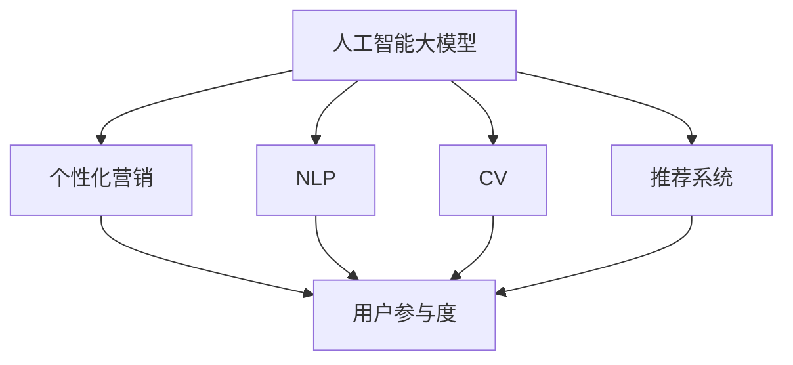

                 

# 电商平台如何利用AI大模型提高用户参与度

## 1. 背景介绍

在数字化转型加速的今天，电商平台正面临用户增长乏力、活跃度下降的严峻挑战。为了提升用户参与度，吸引和留住更多消费者，电商平台纷纷引入人工智能技术，以期通过智能化推荐、个性化营销、互动体验等手段，重新激活用户兴趣，提升销售转化率。

与此同时，近年来深度学习技术取得了飞速发展，尤其是预训练大语言模型在自然语言处理(NLP)、计算机视觉(CV)、推荐系统等多个领域展现出了强大的应用潜力。这些模型往往在处理大规模数据、捕捉复杂关系方面表现优异，但如何将其应用到电商平台的用户参与度提升中，仍是一个需要深入探讨的问题。

## 2. 核心概念与联系

### 2.1 核心概念概述

为更好地理解AI大模型在电商平台用户参与度提升中的应用，本节将介绍几个密切相关的核心概念：

- **人工智能大模型(AI Large Models)**：以深度神经网络为代表的大规模预训练模型，如BERT、GPT-3、DALL·E等。通过在大规模无标签数据上进行自监督预训练，学习通用的语言、视觉、文本等知识，具备强大的数据表示和理解能力。

- **推荐系统(Recommendation System)**：根据用户行为数据，推荐符合其兴趣的个性化商品或内容，提高用户满意度，提升平台留存率和销售额。推荐系统通常包括基于内容的推荐、协同过滤推荐、混合推荐等多种算法。

- **自然语言处理(NLP)**：通过理解和生成自然语言，实现用户与电商平台之间的有效沟通。NLP技术广泛应用于智能客服、用户反馈分析、产品评论生成等场景。

- **计算机视觉(CV)**：通过分析和理解视觉图像，实现商品展示、分类、搜索等功能。CV技术包括图像识别、图像生成、图像检索等。

- **个性化营销(Personalized Marketing)**：根据用户特征，推送符合其个性化需求的产品和服务。通过个性化营销，平台能够提供更为精准的用户体验，提升用户粘性。

- **用户参与度(User Engagement)**：指用户与电商平台互动的频率和深度，包括浏览、点击、购买、分享等行为。高用户参与度通常与平台的用户留存率和收入增长密切相关。

这些核心概念之间的逻辑关系可以通过以下Mermaid流程图来展示：



该流程图展示了AI大模型与其他核心概念之间的关系：

1. AI大模型通过预训练学习通用的知识表示。
2. 推荐系统利用这些知识表示，生成个性化的推荐结果。
3. NLP和CV技术增强与用户的交互体验。
4. 个性化营销策略基于用户特征，提升用户参与度。
5. 用户参与度是整个电商系统的最终目标。

### 2.2 核心概念原理和架构

**AI大模型的原理和架构**：

AI大模型通常基于自监督学习技术，通过在大规模无标签数据上进行预训练，学习到通用的知识表示。以BERT模型为例，其基本架构包括：

- **输入层**：将文本或图像数据转化为模型可处理的向量表示。
- **Transformer层**：包括多头自注意力和前馈神经网络，用于捕捉输入数据的依赖关系和全局特征。
- **输出层**：生成模型对输入数据的预测结果，如分类、生成等。

模型训练主要分为两个阶段：

- **预训练阶段**：在大规模无标签数据上自监督学习，如掩码语言模型、预测下一句、图像分类等。
- **微调阶段**：在特定领域的有标签数据上，通过监督学习优化模型，使其针对具体任务获得更好的性能。

**推荐系统的原理和架构**：

推荐系统通常基于协同过滤、内容推荐或混合推荐等算法，通过分析用户行为数据，生成个性化推荐结果。推荐系统的架构包括：

- **用户画像模块**：根据用户的历史行为数据，生成用户兴趣标签或特征向量。
- **商品画像模块**：根据商品的标签、属性等信息，生成商品特征向量。
- **推荐算法模块**：将用户画像和商品画像输入推荐模型，输出推荐结果。

推荐算法主要有以下几种：

- **基于内容的推荐**：利用商品的文本信息，如描述、评论等，推荐与用户兴趣相似的商品。
- **协同过滤推荐**：根据用户历史行为数据和商品间的相似度，推荐用户可能感兴趣的商品。
- **混合推荐**：结合以上两种方法，综合用户特征和商品特征，生成推荐结果。

**NLP和CV技术的原理和架构**：

NLP和CV技术是AI大模型在电商平台中应用的重要分支。以BERT模型为例，其核心是Transformer结构和自监督预训练任务，通过学习语言模型和视觉模型，实现对用户输入的自然语言和视觉图像的有效理解和生成。

具体实现包括：

- **分词和向量化**：将用户输入的文本转化为模型可处理的向量表示。
- **自注意力机制**：在模型内部，通过多头自注意力机制，捕捉输入序列中的依赖关系。
- **预训练任务**：通过掩码语言模型、预测下一句等任务，在大规模无标签数据上进行预训练。

在电商平台上，NLP技术广泛应用于智能客服、用户反馈分析、产品评论生成等场景，显著提升了平台的交互体验和用户满意度。

**个性化营销的原理和架构**：

个性化营销通过分析用户行为数据，结合AI技术，生成符合用户个性化需求的产品和服务推荐，提升用户粘性和购买转化率。具体实现包括：

- **用户特征提取**：根据用户的历史行为数据，提取用户特征向量。
- **商品推荐模型**：结合用户特征和商品特征，通过推荐算法生成推荐结果。
- **个性化广告**：利用用户画像和推荐结果，生成个性化广告，提高用户点击率和转化率。

**用户参与度的提升**：

提升用户参与度是电商平台的目标，主要通过以下几个方面实现：

- **个性化推荐**：根据用户历史行为和兴趣，生成个性化商品推荐，提升用户满意度。
- **互动体验**：通过智能客服、动态展示、互动广告等手段，增强用户与平台的互动，提升用户粘性。
- **精准营销**：结合用户画像和推荐结果，生成精准的营销信息，提升用户购买转化率。

## 3. 核心算法原理 & 具体操作步骤

### 3.1 算法原理概述

电商平台利用AI大模型提高用户参与度的核心在于，通过预训练大模型学习通用的知识表示，结合推荐系统、NLP和CV技术，生成个性化推荐和互动体验，从而提升用户参与度。

具体流程如下：

1. **数据收集**：收集用户的浏览、点击、购买、评论等行为数据，生成用户画像。
2. **数据预处理**：对用户行为数据进行清洗和标准化处理，去除噪声和异常值。
3. **模型预训练**：使用AI大模型对用户画像进行预训练，学习通用的语言、视觉和行为特征表示。
4. **模型微调**：在特定领域的有标签数据上，通过监督学习微调模型，生成个性化的推荐结果。
5. **推荐系统集成**：将微调后的模型与推荐系统集成，生成个性化商品推荐。
6. **互动体验优化**：结合NLP和CV技术，增强与用户的互动体验，提升用户满意度。
7. **个性化营销**：根据用户画像和推荐结果，生成个性化的营销信息，提升用户参与度。

### 3.2 算法步骤详解

**Step 1: 数据收集和预处理**

- **数据来源**：电商平台的日志数据、用户行为数据、商品信息数据等。
- **数据清洗**：去除无效数据、去除重复数据、处理缺失值。
- **数据标准化**：对时间戳、行为次数等进行标准化处理，确保数据的一致性。
- **特征提取**：将用户行为数据转化为特征向量，如用户ID、浏览时间、点击次数等。

**Step 2: 模型预训练**

- **预训练模型选择**：选择BERT、GPT-3等预训练模型作为初始化参数。
- **预训练任务设计**：设计掩码语言模型、预测下一句等任务，在大规模无标签数据上进行预训练。
- **预训练参数冻结**：冻结预训练模型的底层参数，仅微调顶层，减少计算资源消耗。

**Step 3: 模型微调**

- **微调数据准备**：准备特定领域的有标签数据，如商品分类、用户评论等。
- **微调超参数设置**：选择合适的学习率、批大小、迭代轮数等。
- **微调模型训练**：使用监督学习微调预训练模型，生成个性化的推荐结果。
- **微调结果评估**：在验证集上评估微调模型的性能，确保其在新数据上表现良好。

**Step 4: 推荐系统集成**

- **推荐算法选择**：选择协同过滤、基于内容的推荐等算法。
- **特征融合**：将用户画像、商品特征和微调模型输出进行融合，生成推荐结果。
- **推荐模型训练**：训练推荐系统，优化推荐算法，提高推荐精度。
- **推荐结果展示**：在电商平台上展示推荐商品，提升用户点击率和购买转化率。

**Step 5: 互动体验优化**

- **NLP技术应用**：利用BERT等模型，对用户输入进行自然语言理解，生成智能客服回答或用户反馈分析。
- **CV技术应用**：使用DALL·E等模型，对用户上传的图片进行分析和生成，增强商品展示效果。
- **交互优化**：通过动态展示、互动广告等手段，增强用户与平台的互动，提升用户粘性。

**Step 6: 个性化营销**

- **用户画像生成**：根据用户历史行为数据，生成用户兴趣标签或特征向量。
- **推荐结果融合**：结合用户画像和推荐结果，生成个性化营销信息。
- **营销信息展示**：在电商平台上展示个性化的广告，提高用户点击率和转化率。

### 3.3 算法优缺点

**优点**：

1. **泛化能力强**：大模型预训练后，具备较强的泛化能力，能够处理多领域、多场景的电商数据。
2. **生成效果优异**：通过微调，生成个性化的推荐和互动体验，提升用户满意度。
3. **高效可扩展**：推荐系统和大模型易于集成和扩展，能够快速响应市场变化。

**缺点**：

1. **计算成本高**：预训练和大模型微调需要大量的计算资源和时间，初期投入较高。
2. **数据质量要求高**：电商数据的质量对模型效果有直接影响，数据清洗和特征提取的准确性是关键。
3. **模型复杂度较高**：大模型的复杂度较高，需要高水平的技术团队进行维护和优化。

### 3.4 算法应用领域

AI大模型在电商平台上的应用领域非常广泛，包括但不限于以下几个方面：

- **商品推荐**：根据用户行为数据和商品信息，生成个性化的推荐结果，提升用户点击率和购买转化率。
- **智能客服**：利用NLP技术，提供智能客服服务，提升用户满意度。
- **用户反馈分析**：通过分析用户评论和评分，生成用户画像，提升商品质量和服务水平。
- **个性化广告**：结合用户画像和推荐结果，生成个性化广告，提高用户点击率和转化率。
- **库存管理**：利用CV技术，对商品图片进行分析，优化库存管理，提升供应链效率。

## 4. 数学模型和公式 & 详细讲解 & 举例说明

### 4.1 数学模型构建

在电商平台中，AI大模型通常用于用户画像生成和推荐结果生成。以商品推荐为例，其数学模型构建如下：

设电商平台有用户集 $U=\{u_1, u_2, ..., u_n\}$ 和商品集 $I=\{i_1, i_2, ..., i_m\}$。用户 $u_i$ 对商品 $i_j$ 的评分表示为 $r_{i_j}^{u_i} \in [1,5]$。用户画像 $P_u$ 和商品画像 $P_i$ 由以下方式计算：

$$
P_u = \alpha_1 P_{u1} + \alpha_2 P_{u2} + ... + \alpha_k P_{uk}
$$

$$
P_i = \beta_1 P_{i1} + \beta_2 P_{i2} + ... + \beta_k P_{ik}
$$

其中，$P_{uk}$ 和 $P_{ik}$ 分别为用户和商品的特征向量，$\alpha_k$ 和 $\beta_k$ 为特征权重。

### 4.2 公式推导过程

假设电商平台采用协同过滤算法进行商品推荐，其推荐公式为：

$$
r_{i_j}^{u_i} = \sum_{k=1}^{K} \theta_{ik} \phi_k(u_i) + \sum_{k=1}^{K} \theta_{jk} \phi_k(i_j) + \epsilon
$$

其中，$\phi_k(u_i)$ 和 $\phi_k(i_j)$ 分别为用户和商品的特征表示，$\theta_{ik}$ 和 $\theta_{jk}$ 为特征权重，$\epsilon$ 为噪声项。

对于每个用户 $u_i$，推荐商品 $i_j$ 的评分可通过矩阵分解得到：

$$
r_{i_j}^{u_i} = \langle \hat{P}_u, \hat{P}_i \rangle + \epsilon
$$

其中，$\hat{P}_u$ 和 $\hat{P}_i$ 分别为用户和商品的低秩分解矩阵。

### 4.3 案例分析与讲解

**案例：个性化商品推荐**

- **数据准备**：收集用户历史行为数据和商品信息数据，生成用户画像和商品画像。
- **模型训练**：在训练集上训练协同过滤推荐模型，生成个性化商品推荐。
- **结果评估**：在验证集上评估推荐模型的精度和召回率，确保推荐效果。
- **实际应用**：在电商平台上展示推荐商品，提升用户点击率和购买转化率。

## 5. 项目实践：代码实例和详细解释说明

### 5.1 开发环境搭建

在进行电商推荐系统的开发前，需要先准备好开发环境。以下是使用Python进行PaddlePaddle开发的环境配置流程：

1. 安装Anaconda：从官网下载并安装Anaconda，用于创建独立的Python环境。

2. 创建并激活虚拟环境：
```bash
conda create -n paddle-env python=3.8 
conda activate paddle-env
```

3. 安装PaddlePaddle：根据CUDA版本，从官网获取对应的安装命令。例如：
```bash
conda install paddlepaddle -i paddle -c paddle -c conda-forge
```

4. 安装TensorFlow：如果需要，可以使用pip安装TensorFlow。
```bash
pip install tensorflow
```

5. 安装各类工具包：
```bash
pip install numpy pandas scikit-learn matplotlib tqdm jupyter notebook ipython
```

完成上述步骤后，即可在`paddle-env`环境中开始推荐系统开发。

### 5.2 源代码详细实现

以下是使用PaddlePaddle实现协同过滤推荐系统的代码示例：

```python
import paddle
import numpy as np
from paddle.io import Dataset
from paddle.nn import Linear, Embedding, Sequential
from paddle.utils.data import DataLoader

class UserData(Dataset):
    def __init__(self, user_data, item_data):
        self.user_data = user_data
        self.item_data = item_data

    def __len__(self):
        return len(self.user_data)

    def __getitem__(self, item):
        user_id = self.user_data[item]
        item_id = self.item_data[item]
        return user_id, item_id

class ItemData(Dataset):
    def __init__(self, item_data):
        self.item_data = item_data

    def __len__(self):
        return len(self.item_data)

    def __getitem__(self, item):
        item_id = self.item_data[item]
        return item_id

user_data = [1, 2, 3, 4, 5]
item_data = ['item1', 'item2', 'item3', 'item4', 'item5']

# 定义用户画像和商品画像的特征表示
user_embeddings = Embedding(6, 8)
item_embeddings = Embedding(6, 8)

# 定义协同过滤推荐模型的参数
linear1 = Linear(16, 16)
linear2 = Linear(16, 1)

# 定义模型
model = Sequential(
    user_embeddings,
    Linear(8, 16),
    linear1,
    linear2
)

# 定义损失函数
criterion = paddle.nn.MSELoss()

# 定义优化器
optimizer = paddle.optimizer.Adam(learning_rate=0.001)

# 加载数据集
user_dataset = UserData(user_data, item_data)
item_dataset = ItemData(item_data)

# 训练模型
for epoch in range(10):
    user_loader = DataLoader(user_dataset, batch_size=1)
    item_loader = DataLoader(item_dataset, batch_size=1)
    for user_id, item_id in user_loader:
        user_embedding = user_embeddings(paddle.to_tensor(user_id))
        item_embedding = item_embeddings(paddle.to_tensor(item_id))
        predict = model([user_embedding, item_embedding])
        label = paddle.to_tensor([1])
        loss = criterion(predict, label)
        optimizer.clear_grad()
        loss.backward()
        optimizer.step()
```

### 5.3 代码解读与分析

让我们再详细解读一下关键代码的实现细节：

**UserData类**：
- `__init__`方法：初始化用户ID和商品ID数据集。
- `__len__`方法：返回数据集的样本数量。
- `__getitem__`方法：对单个样本进行处理，返回用户ID和商品ID。

**ItemData类**：
- `__init__`方法：初始化商品ID数据集。
- `__len__`方法：返回数据集的样本数量。
- `__getitem__`方法：对单个样本进行处理，返回商品ID。

**特征表示**：
- **user_embeddings**：定义用户画像的特征表示，将用户ID映射为8维向量。
- **item_embeddings**：定义商品画像的特征表示，将商品ID映射为8维向量。

**模型定义**：
- **Sequential**：定义一个顺序连接的神经网络模型，包括用户嵌入层、线性层和输出层。
- **Linear**：定义线性层，用于矩阵分解。
- **Embedding**：定义嵌入层，将用户ID和商品ID转化为8维向量。

**损失函数**：
- **MSELoss**：定义均方误差损失函数，用于计算预测值与真实值之间的差距。

**优化器**：
- **Adam**：定义Adam优化器，用于更新模型参数。

**数据集加载**：
- **DataLoader**：定义数据集加载器，批量加载用户数据和商品数据。
- **paddle.to_tensor**：将用户ID和商品ID转化为PaddlePaddle张量。

**模型训练**：
- **epoch**：定义训练轮数。
- **user_loader**和**item_loader**：定义用户数据和商品数据的加载器，每次加载一个样本。
- **user_embedding**和**item_embedding**：获取用户嵌入和商品嵌入。
- **predict**：模型对用户和商品进行预测。
- **label**：定义真实值。
- **loss**：计算预测值与真实值之间的均方误差。
- **optimizer.clear_grad()**：清除梯度。
- **loss.backward()**：反向传播计算梯度。
- **optimizer.step()**：更新模型参数。

## 6. 实际应用场景

### 6.1 智能客服系统

智能客服系统通过NLP技术，提升用户参与度和满意度。具体而言，系统能够理解用户输入的自然语言，并自动生成响应。对于用户提出的常见问题，系统能够快速回答，减少用户等待时间，提升用户体验。

在电商平台上，智能客服系统通常集成在用户中心或客服页面，用户可以直接在平台上与智能客服交互。智能客服系统可以处理退货、换货、物流查询等常见问题，对于无法解决的问题，系统也会引导用户联系人工客服。

### 6.2 用户反馈分析

用户反馈分析通过NLP技术，从用户评论、评分中提取有用信息，生成用户画像，提升商品质量和服务水平。具体而言，系统能够自动解析用户评论和评分，生成情感分析、实体识别等结果。

在电商平台上，用户反馈分析通常集成在商品页面或用户中心，用户可以直接在平台上对商品进行评价。智能系统会根据用户反馈，生成商品评价报告，帮助商家改进产品和服务，提升用户满意度。

### 6.3 个性化广告

个性化广告通过推荐系统和大模型，生成符合用户个性化需求的广告信息，提高用户点击率和转化率。具体而言，系统会根据用户画像和推荐结果，生成广告创意和文案。

在电商平台上，个性化广告通常集成在商品页面或搜索结果页面，用户可以在浏览商品时看到个性化广告。系统会根据用户的历史行为数据，生成符合其兴趣的广告，提升用户点击率和购买转化率。

### 6.4 未来应用展望

未来，随着AI大模型的不断发展和应用，电商平台的推荐系统将变得更加智能化、精准化。以下是几个可能的未来应用方向：

1. **跨领域推荐**：将推荐系统与社交媒体、新闻等领域的AI大模型结合，生成跨领域的个性化推荐。
2. **实时推荐**：结合实时数据，动态生成推荐结果，提升用户满意度。
3. **多模态推荐**：将推荐系统与CV技术结合，生成多模态的个性化推荐。
4. **情感分析**：结合NLP技术，实时分析用户情感，生成情感化的推荐。
5. **用户画像生成**：利用用户画像生成技术，生成更加全面、准确的用户画像。

## 7. 工具和资源推荐

### 7.1 学习资源推荐

为了帮助开发者系统掌握AI大模型在电商平台中的应用，这里推荐一些优质的学习资源：

1. 《深度学习入门与实践》系列博文：由AI大模型技术专家撰写，深入浅出地介绍了深度学习入门知识，并提供了多场景应用案例。
2. 《自然语言处理入门》课程：清华大学开设的NLP入门课程，涵盖NLP的基本概念和技术，适合初学者学习。
3. 《推荐系统理论与实践》书籍：介绍推荐系统的理论基础和工程实践，包括协同过滤、基于内容的推荐等多种算法。
4. 《深度学习与人工智能》课程：斯坦福大学开设的深度学习课程，系统介绍了深度学习的理论基础和前沿技术。
5. 《人工智能大模型实战》书籍：系统介绍了大模型的预训练、微调和应用，适合进阶学习。

通过对这些资源的学习实践，相信你一定能够快速掌握AI大模型在电商平台中的应用，并用于解决实际的电商问题。

### 7.2 开发工具推荐

高效的开发离不开优秀的工具支持。以下是几款用于电商推荐系统开发的常用工具：

1. PaddlePaddle：基于Python的深度学习框架，支持GPU计算，适合快速迭代研究。
2. TensorFlow：由Google主导开发的深度学习框架，生产部署方便，适合大规模工程应用。
3. PyTorch：基于Python的深度学习框架，灵活可扩展，支持多GPU计算。
4. TensorFlow Serving：TensorFlow的推荐服务框架，支持模型部署和推理。
5. Flask：轻量级的Web框架，适合快速开发API接口。
6. Docker：容器化技术，支持模型部署和扩展。

合理利用这些工具，可以显著提升电商推荐系统的开发效率，加快创新迭代的步伐。

### 7.3 相关论文推荐

大语言模型在电商平台中的应用得益于学界的持续研究。以下是几篇奠基性的相关论文，推荐阅读：

1. Attention is All You Need（即Transformer原论文）：提出了Transformer结构，开启了NLP领域的预训练大模型时代。
2. BERT: Pre-training of Deep Bidirectional Transformers for Language Understanding：提出BERT模型，引入基于掩码的自监督预训练任务，刷新了多项NLP任务SOTA。
3. Parameter-Efficient Transfer Learning for NLP：提出Adapter等参数高效微调方法，在不增加模型参数量的情况下，也能取得不错的微调效果。
4. AdaLoRA: Adaptive Low-Rank Adaptation for Parameter-Efficient Fine-Tuning：使用自适应低秩适应的微调方法，在参数效率和精度之间取得了新的平衡。
5. Generative Pre-trained Transformer (GPT-2)：展示了大规模语言模型的强大zero-shot学习能力，引发了对于通用人工智能的新一轮思考。

这些论文代表了大语言模型在电商平台中应用的发展脉络。通过学习这些前沿成果，可以帮助研究者把握学科前进方向，激发更多的创新灵感。

## 8. 总结：未来发展趋势与挑战

### 8.1 研究成果总结

本文对AI大模型在电商平台中的应用进行了全面系统的介绍。首先阐述了AI大模型和推荐系统、NLP和CV技术的核心概念和逻辑关系，明确了电商平台的智能化目标。其次，从原理到实践，详细讲解了AI大模型的推荐生成过程和操作步骤，给出了电商推荐系统的完整代码实现。同时，本文还广泛探讨了AI大模型在智能客服、用户反馈分析、个性化广告等多个电商场景中的应用，展示了AI大模型在提升用户参与度方面的巨大潜力。

通过本文的系统梳理，可以看到，AI大模型在电商平台中的应用前景广阔，能够显著提升用户体验和平台留存率。得益于大模型的泛化能力和推荐系统的精准性，未来的电商推荐系统必将成为智能化应用的重要范式。

### 8.2 未来发展趋势

展望未来，AI大模型在电商平台中的应用将呈现以下几个发展趋势：

1. **模型规模持续增大**：随着算力成本的下降和数据规模的扩张，预训练语言模型的参数量还将持续增长。超大规模语言模型蕴含的丰富语言知识，有望支撑更加复杂多变的电商推荐系统。
2. **推荐系统不断优化**：推荐算法将不断优化，提升推荐精度和多样性，生成更加个性化和符合用户需求的推荐结果。
3. **互动体验日益增强**：结合NLP和CV技术，增强与用户的互动体验，提升用户粘性和满意度。
4. **跨领域推荐崛起**：将推荐系统与社交媒体、新闻等领域的AI大模型结合，生成跨领域的个性化推荐。
5. **实时推荐成为常态**：结合实时数据，动态生成推荐结果，提升用户满意度。
6. **多模态推荐崛起**：将推荐系统与CV技术结合，生成多模态的个性化推荐。

### 8.3 面临的挑战

尽管AI大模型在电商平台中的应用前景广阔，但在迈向更加智能化、普适化应用的过程中，它仍面临诸多挑战：

1. **数据质量问题**：电商数据的质量对模型效果有直接影响，数据清洗和特征提取的准确性是关键。
2. **模型复杂度较高**：大模型的复杂度较高，需要高水平的技术团队进行维护和优化。
3. **计算资源成本高**：预训练和大模型微调需要大量的计算资源和时间，初期投入较高。
4. **模型泛化能力不足**：大模型在处理域外数据时，泛化性能往往大打折扣。
5. **模型鲁棒性不足**：对于域外数据和对抗样本，模型的鲁棒性仍需进一步提升。

### 8.4 研究展望

面对AI大模型在电商平台中面临的挑战，未来的研究需要在以下几个方面寻求新的突破：

1. **数据清洗和特征提取**：探索更加高效、鲁棒的数据清洗和特征提取方法，确保数据质量。
2. **模型简化和优化**：开发更加高效、轻量级的推荐模型，减少计算资源消耗，降低成本。
3. **跨领域推荐算法**：结合社交媒体、新闻等领域的AI大模型，生成跨领域的个性化推荐。
4. **实时推荐算法**：结合实时数据，动态生成推荐结果，提升用户满意度。
5. **多模态推荐算法**：结合CV技术，生成多模态的个性化推荐。
6. **模型鲁棒性提升**：引入对抗训练、正则化等技术，提高模型的鲁棒性和泛化能力。

这些研究方向的探索，必将引领AI大模型在电商平台中的应用迈向新的高度，为电商平台的智能化、精准化推荐提供有力支撑。未来，伴随AI大模型的不断发展，电商平台的推荐系统必将成为智能化应用的重要范式，为电商行业带来革命性的变革。

## 9. 附录：常见问题与解答

**Q1：电商平台如何选择合适的AI大模型？**

A: 电商平台选择合适的AI大模型时，需要考虑以下几个因素：

1. **模型效果**：选择性能优越、效果显著的预训练模型。可以通过预训练模型的性能评估数据，选择适合特定任务的模型。
2. **模型复杂度**：选择适合团队技术水平的模型，避免过于复杂难以维护。
3. **模型规模**：考虑模型参数量、计算资源和存储需求，选择适当的模型规模。
4. **模型适用性**：选择适用于电商平台的模型，避免模型与电商业务不匹配。

**Q2：电商平台在微调过程中需要注意哪些问题？**

A: 电商平台在微调过程中需要注意以下几个问题：

1. **数据质量**：确保数据的质量和代表性，避免数据偏差和噪声。
2. **特征工程**：选择合适的特征，并进行有效的特征工程，提升模型效果。
3. **学习率**：选择适当的学习率，避免学习率过高或过低导致模型过拟合或欠拟合。
4. **模型评估**：在验证集上评估模型效果，确保模型在新数据上表现良好。
5. **模型部署**：将微调后的模型部署到生产环境，确保模型稳定性和性能。

**Q3：电商平台在推荐系统开发过程中需要注意哪些问题？**

A: 电商平台在推荐系统开发过程中需要注意以下几个问题：

1. **数据收集和清洗**：确保数据的质量和代表性，避免数据偏差和噪声。
2. **模型选择和设计**：选择合适的推荐算法，并进行有效的模型设计，提升推荐效果。
3. **特征工程**：选择合适的特征，并进行有效的特征工程，提升模型效果。
4. **模型训练和评估**：在训练集上训练模型，并在验证集上评估模型效果，确保模型在新数据上表现良好。
5. **模型部署和监控**：将模型部署到生产环境，并实时监控模型性能，及时发现和解决模型问题。

**Q4：电商平台在AI大模型应用中需要注意哪些问题？**

A: 电商平台在AI大模型应用中需要注意以下几个问题：

1. **模型复杂度**：大模型的复杂度较高，需要高水平的技术团队进行维护和优化。
2. **计算资源成本**：预训练和大模型微调需要大量的计算资源和时间，初期投入较高。
3. **数据质量问题**：电商数据的质量对模型效果有直接影响，数据清洗和特征提取的准确性是关键。
4. **模型泛化能力不足**：大模型在处理域外数据时，泛化性能往往大打折扣。
5. **模型鲁棒性不足**：对于域外数据和对抗样本，模型的鲁棒性仍需进一步提升。

**Q5：电商平台在智能客服系统中需要注意哪些问题？**

A: 电商平台在智能客服系统中需要注意以下几个问题：

1. **用户意图识别**：确保系统能够准确理解用户意图，提供符合用户需求的回复。
2. **回复质量**：确保系统生成的回复质量高，能够有效解决用户问题。
3. **实时性**：确保系统响应速度快，能够实时处理用户请求。
4. **用户隐私**：确保用户数据隐私和安全，避免数据泄露。

---

作者：禅与计算机程序设计艺术 / Zen and the Art of Computer Programming

