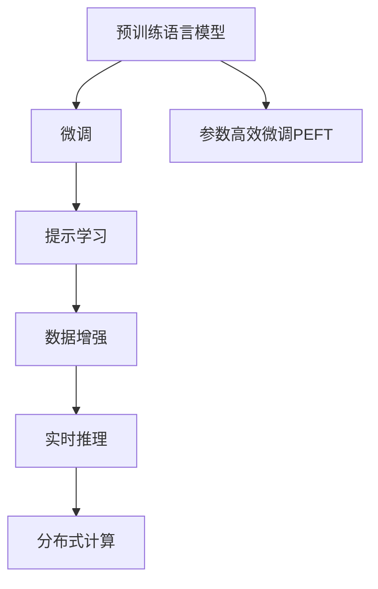

                 

## 1. 背景介绍

### 1.1 问题由来

随着互联网技术的发展，电商平台如淘宝、京东、亚马逊等在用户体验、推荐系统优化方面取得了显著进展。然而，如何在短时间内为用户提供精准且个性化的推荐，仍然是一个巨大的挑战。电商平台推荐系统往往需要处理海量数据、高并发请求，同时还要实时响应用户操作，这对系统的性能和效率提出了极高的要求。

当前推荐的方案主要是基于特征工程、规则引擎、机器学习等方法。但这些方法存在如下问题：

- **特征工程复杂**：需要手动设计并提取特征，难度大且耗时。
- **模型通用性差**：推荐模型过于简单，无法适应多种业务场景。
- **训练时间长**：传统机器学习模型训练时间较长，不适合快速迭代优化。
- **系统扩展性差**：难以扩展到大规模用户群体，无法应对不断变化的业务需求。

为解决上述问题，大语言模型(LLM)在电商平台搜索推荐系统中的应用应运而生。大语言模型通过预训练大规模无标签数据，可以学习到丰富的语言和知识表示，并通过微调等方式，实现对特定任务的适配，从而提升推荐系统的精度、效率和用户体验。

### 1.2 问题核心关键点

大语言模型在电商平台推荐系统中的应用，本质上是一个利用大规模预训练语言模型，进行迁移学习和任务适配的过程。具体来说，包括如下几个关键点：

1. **预训练语言模型**：通过大规模无标签数据预训练，学习通用的语言知识表示。
2. **微调任务适配**：在预训练模型的基础上，使用特定推荐任务的标注数据，通过有监督学习进行微调，使其能够匹配推荐任务的标签。
3. **参数高效微调**：仅调整顶层或部分参数，减少对预训练模型参数的影响。
4. **提示学习**：通过精心设计输入文本，引导大模型进行推荐生成，减少微调参数。
5. **数据增强**：通过数据增强技术，提升模型的泛化能力。
6. **实时推理**：优化推理速度，提升系统实时响应能力。
7. **分布式计算**：利用分布式计算技术，扩展推荐系统的处理能力。

## 2. 核心概念与联系

### 2.1 核心概念概述

为了更好地理解大语言模型在电商平台推荐系统中的应用，本节将介绍几个关键概念：

1. **大语言模型(LLM)**：基于Transformer结构的预训练语言模型，如GPT、BERT等，通过大规模无标签数据预训练，学习到丰富的语言知识表示。
2. **微调(Fine-tuning)**：在预训练模型的基础上，使用特定推荐任务的标注数据，通过有监督学习进行微调，使模型适配推荐任务。
3. **参数高效微调(PEFT)**：仅调整顶层或部分参数，减少对预训练模型参数的影响。
4. **提示学习(Prompt Learning)**：通过精心设计输入文本，引导大模型进行推荐生成，减少微调参数。
5. **数据增强**：通过数据增强技术，提升模型的泛化能力。
6. **实时推理**：优化推理速度，提升系统实时响应能力。
7. **分布式计算**：利用分布式计算技术，扩展推荐系统的处理能力。

这些概念通过以下Mermaid流程图展示其联系：



该流程图展示了大语言模型在电商平台推荐系统中的应用流程：

1. 预训练语言模型通过大规模无标签数据预训练，学习到通用的语言知识表示。
2. 在预训练模型的基础上，使用特定推荐任务的标注数据，通过微调适配推荐任务。
3. 应用参数高效微调技术，减少对预训练模型参数的影响。
4. 使用提示学习技术，通过精心设计输入文本，引导大模型进行推荐生成。
5. 应用数据增强技术，提升模型的泛化能力。
6. 应用实时推理技术，优化推理速度，提升系统实时响应能力。
7. 应用分布式计算技术，扩展推荐系统的处理能力。

这些概念共同构成了大语言模型在推荐系统中的学习框架，使得其能够高效、精准地生成推荐结果。

## 3. 核心算法原理 & 具体操作步骤

### 3.1 算法原理概述

基于大语言模型的电商平台推荐系统，主要通过以下步骤实现：

1. **预训练语言模型的构建**：在大规模无标签数据上预训练语言模型，学习通用的语言知识表示。
2. **微调适配推荐任务**：在预训练模型的基础上，使用特定推荐任务的标注数据，通过有监督学习进行微调，适配推荐任务。
3. **参数高效微调**：通过参数高效微调技术，减少对预训练模型参数的影响，提升微调效率。
4. **提示学习**：通过精心设计输入文本，引导大模型进行推荐生成，减少微调参数。
5. **实时推理**：优化推理速度，提升系统实时响应能力。
6. **分布式计算**：利用分布式计算技术，扩展推荐系统的处理能力。

### 3.2 算法步骤详解

基于大语言模型的电商平台推荐系统，主要包括以下几个关键步骤：

**Step 1: 准备预训练模型和数据集**

1. **选择预训练语言模型**：如BERT、GPT等，作为推荐模型的初始化参数。
2. **准备推荐数据集**：包括用户行为数据、商品描述数据等，划分为训练集、验证集和测试集。

**Step 2: 添加任务适配层**

1. **设计推荐任务**：根据业务需求，设计推荐任务的输出格式和损失函数。
2. **添加任务适配层**：在预训练模型的基础上，添加推荐任务所需的功能层，如注意力机制、解码器等。
3. **定义损失函数**：根据推荐任务的设计，定义合适的损失函数，如均方误差、交叉熵等。

**Step 3: 设置微调超参数**

1. **选择合适的优化算法及其参数**：如AdamW、SGD等，设置学习率、批大小、迭代轮数等。
2. **设置正则化技术**：如L2正则、Dropout、Early Stopping等，防止模型过度拟合。
3. **确定冻结预训练参数的策略**：如仅微调顶层，或全部参数都参与微调。

**Step 4: 执行梯度训练**

1. **加载数据集**：将训练集数据分批次输入模型，前向传播计算损失函数。
2. **反向传播计算参数梯度**：根据设定的优化算法和学习率更新模型参数。
3. **周期性在验证集上评估模型性能**：根据性能指标决定是否触发Early Stopping。
4. **重复上述步骤直到满足预设的迭代轮数或Early Stopping条件**。

**Step 5: 测试和部署**

1. **在测试集上评估微调后模型**：对比微调前后的性能，验证模型提升效果。
2. **部署到实际应用系统中**：将微调后的模型集成到电商平台推荐系统中，实时响应用户请求。
3. **持续收集新数据**：定期重新微调模型，以适应数据分布的变化。

### 3.3 算法优缺点

基于大语言模型的电商平台推荐系统，具有以下优点：

1. **模型通用性强**：通过微调，模型可以适配多种推荐任务，具有良好的通用性。
2. **数据依赖少**：只需要少量的标注数据即可进行微调，减少数据获取成本。
3. **推荐精度高**：大语言模型具有丰富的语言知识表示，能够生成更精准的推荐结果。
4. **实时响应能力强**：应用实时推理技术，可以实时响应用户请求，提升用户体验。
5. **可扩展性强**：利用分布式计算技术，可以扩展推荐系统的处理能力，适应大规模用户需求。

同时，该方法也存在一些局限性：

1. **模型规模大**：大语言模型通常参数量巨大，对计算资源要求较高。
2. **微调过程复杂**：微调过程中需要精心设计输入文本、损失函数等，需要丰富的经验和技巧。
3. **数据质量要求高**：推荐数据集的质量和标注规范性，对模型性能影响较大。
4. **实时推理速度慢**：大语言模型的推理速度相对较慢，影响系统实时响应能力。
5. **微调效果不稳定**：微调过程中容易受到数据质量、标注偏差等因素的影响，导致推荐结果不稳定。

## 4. 数学模型和公式 & 详细讲解 & 举例说明

### 4.1 数学模型构建

基于大语言模型的电商平台推荐系统，主要使用预训练语言模型作为特征提取器，通过微调适配推荐任务。

记预训练语言模型为 $M_{\theta}:\mathcal{X} \rightarrow \mathcal{Y}$，其中 $\mathcal{X}$ 为输入空间，$\mathcal{Y}$ 为输出空间，$\theta$ 为预训练得到的模型参数。假设推荐任务为 $T$，训练集为 $D=\{(x_i, y_i)\}_{i=1}^N, x_i \in \mathcal{X}, y_i \in \mathcal{Y}$。

定义推荐任务 $T$ 在输入 $x$ 上的损失函数为 $\ell(M_{\theta}(x),y)$，则在数据集 $D$ 上的经验风险为：

$$
\mathcal{L}(\theta) = \frac{1}{N} \sum_{i=1}^N \ell(M_{\theta}(x_i),y_i)
$$

微调的优化目标是最小化经验风险，即找到最优参数：

$$
\theta^* = \mathop{\arg\min}_{\theta} \mathcal{L}(\theta)
$$

在实践中，我们通常使用基于梯度的优化算法（如AdamW、SGD等）来近似求解上述最优化问题。设 $\eta$ 为学习率，$\lambda$ 为正则化系数，则参数的更新公式为：

$$
\theta \leftarrow \theta - \eta \nabla_{\theta}\mathcal{L}(\theta) - \eta\lambda\theta
$$

其中 $\nabla_{\theta}\mathcal{L}(\theta)$ 为损失函数对参数 $\theta$ 的梯度，可通过反向传播算法高效计算。

### 4.2 公式推导过程

以下我们以二分类任务为例，推导均方误差损失函数及其梯度的计算公式。

假设模型 $M_{\theta}$ 在输入 $x$ 上的输出为 $\hat{y}=M_{\theta}(x)$，表示商品推荐的得分。真实标签 $y \in \{0,1\}$，表示商品是否被推荐。则二分类均方误差损失函数定义为：

$$
\ell(M_{\theta}(x),y) = \frac{1}{2}(\hat{y}-y)^2
$$

将其代入经验风险公式，得：

$$
\mathcal{L}(\theta) = \frac{1}{N}\sum_{i=1}^N \frac{1}{2}(\hat{y}_i-y_i)^2
$$

根据链式法则，损失函数对参数 $\theta_k$ 的梯度为：

$$
\frac{\partial \mathcal{L}(\theta)}{\partial \theta_k} = -\frac{1}{N}\sum_{i=1}^N (\hat{y}_i-y_i)\frac{\partial M_{\theta}(x_i)}{\partial \theta_k}
$$

其中 $\frac{\partial M_{\theta}(x_i)}{\partial \theta_k}$ 可进一步递归展开，利用自动微分技术完成计算。

在得到损失函数的梯度后，即可带入参数更新公式，完成模型的迭代优化。重复上述过程直至收敛，最终得到适应推荐任务的最优模型参数 $\theta^*$。

### 4.3 案例分析与讲解

以下以电商推荐系统的实际案例为例，展示大语言模型的应用效果。

**案例背景**：一家电商平台有数百万用户，用户行为数据包括浏览记录、购买记录、评分记录等。平台希望基于用户行为数据，推荐用户可能感兴趣的商品。

**数据处理**：将用户行为数据进行清洗、转换，生成训练集、验证集和测试集。训练集包括用户ID、商品ID、行为类型、时间戳等特征。验证集和测试集同理。

**模型选择**：选择BERT作为推荐模型的初始化参数，根据推荐任务设计适当的任务适配层。

**微调过程**：
1. **设置超参数**：选择合适的优化算法（如AdamW）及其参数，设置学习率、批大小、迭代轮数等。
2. **执行梯度训练**：将训练集数据分批次输入模型，前向传播计算损失函数。
3. **反向传播计算参数梯度**：根据设定的优化算法和学习率更新模型参数。
4. **周期性在验证集上评估模型性能**：根据性能指标决定是否触发Early Stopping。
5. **重复上述步骤直到满足预设的迭代轮数或Early Stopping条件**。

**测试和部署**：
1. **在测试集上评估微调后模型**：对比微调前后的性能，验证模型提升效果。
2. **部署到实际应用系统中**：将微调后的模型集成到电商平台推荐系统中，实时响应用户请求。
3. **持续收集新数据**：定期重新微调模型，以适应数据分布的变化。

## 5. 项目实践：代码实例和详细解释说明

### 5.1 开发环境搭建

在进行大语言模型微调实践前，我们需要准备好开发环境。以下是使用Python进行PyTorch开发的环境配置流程：

1. 安装Anaconda：从官网下载并安装Anaconda，用于创建独立的Python环境。

2. 创建并激活虚拟环境：
```bash
conda create -n pytorch-env python=3.8 
conda activate pytorch-env
```

3. 安装PyTorch：根据CUDA版本，从官网获取对应的安装命令。例如：
```bash
conda install pytorch torchvision torchaudio cudatoolkit=11.1 -c pytorch -c conda-forge
```

4. 安装Transformers库：
```bash
pip install transformers
```

5. 安装各类工具包：
```bash
pip install numpy pandas scikit-learn matplotlib tqdm jupyter notebook ipython
```

完成上述步骤后，即可在`pytorch-env`环境中开始微调实践。

### 5.2 源代码详细实现

下面以电商推荐系统为例，给出使用Transformers库对BERT模型进行微调的PyTorch代码实现。

首先，定义推荐任务的数据处理函数：

```python
from transformers import BertTokenizer
from torch.utils.data import Dataset
import torch

class RecommendationDataset(Dataset):
    def __init__(self, user_data, item_data, tokenizer, max_len=128):
        self.user_data = user_data
        self.item_data = item_data
        self.tokenizer = tokenizer
        self.max_len = max_len
        
    def __len__(self):
        return len(self.user_data)
    
    def __getitem__(self, item):
        user = self.user_data[item]
        item = self.item_data[item]
        
        # 将用户行为数据和商品数据拼接，形成输入序列
        sequence = f"{user}_{item}"
        
        # 对输入序列进行分词和编码
        encoding = self.tokenizer(sequence, return_tensors='pt', max_length=self.max_len, padding='max_length', truncation=True)
        input_ids = encoding['input_ids'][0]
        attention_mask = encoding['attention_mask'][0]
        
        # 将用户行为数据和商品数据拼接，形成目标标签
        label = 1 if item in user_data[item] else 0
        
        return {'input_ids': input_ids, 
                'attention_mask': attention_mask,
                'labels': label}

# 将用户行为数据和商品数据拼接，生成推荐任务数据集
user_data = [...] # 用户行为数据
item_data = [...] # 商品数据
tokenizer = BertTokenizer.from_pretrained('bert-base-cased')

train_dataset = RecommendationDataset(user_data, item_data, tokenizer)
dev_dataset = RecommendationDataset(user_data, item_data, tokenizer)
test_dataset = RecommendationDataset(user_data, item_data, tokenizer)
```

然后，定义模型和优化器：

```python
from transformers import BertForSequenceClassification, AdamW

model = BertForSequenceClassification.from_pretrained('bert-base-cased', num_labels=2)

optimizer = AdamW(model.parameters(), lr=2e-5)
```

接着，定义训练和评估函数：

```python
from torch.utils.data import DataLoader
from tqdm import tqdm
from sklearn.metrics import classification_report

device = torch.device('cuda') if torch.cuda.is_available() else torch.device('cpu')
model.to(device)

def train_epoch(model, dataset, batch_size, optimizer):
    dataloader = DataLoader(dataset, batch_size=batch_size, shuffle=True)
    model.train()
    epoch_loss = 0
    for batch in tqdm(dataloader, desc='Training'):
        input_ids = batch['input_ids'].to(device)
        attention_mask = batch['attention_mask'].to(device)
        labels = batch['labels'].to(device)
        model.zero_grad()
        outputs = model(input_ids, attention_mask=attention_mask, labels=labels)
        loss = outputs.loss
        epoch_loss += loss.item()
        loss.backward()
        optimizer.step()
    return epoch_loss / len(dataloader)

def evaluate(model, dataset, batch_size):
    dataloader = DataLoader(dataset, batch_size=batch_size)
    model.eval()
    preds, labels = [], []
    with torch.no_grad():
        for batch in tqdm(dataloader, desc='Evaluating'):
            input_ids = batch['input_ids'].to(device)
            attention_mask = batch['attention_mask'].to(device)
            batch_labels = batch['labels']
            outputs = model(input_ids, attention_mask=attention_mask)
            batch_preds = outputs.logits.argmax(dim=2).to('cpu').tolist()
            batch_labels = batch_labels.to('cpu').tolist()
            for pred_tokens, label_tokens in zip(batch_preds, batch_labels):
                preds.append(pred_tokens[:len(label_tokens)])
                labels.append(label_tokens)
                
    print(classification_report(labels, preds))
```

最后，启动训练流程并在测试集上评估：

```python
epochs = 5
batch_size = 16

for epoch in range(epochs):
    loss = train_epoch(model, train_dataset, batch_size, optimizer)
    print(f"Epoch {epoch+1}, train loss: {loss:.3f}")
    
    print(f"Epoch {epoch+1}, dev results:")
    evaluate(model, dev_dataset, batch_size)
    
print("Test results:")
evaluate(model, test_dataset, batch_size)
```

以上就是使用PyTorch对BERT进行电商推荐系统微调的完整代码实现。可以看到，得益于Transformers库的强大封装，我们可以用相对简洁的代码完成BERT模型的加载和微调。

### 5.3 代码解读与分析

让我们再详细解读一下关键代码的实现细节：

**RecommendationDataset类**：
- `__init__`方法：初始化用户行为数据、商品数据、分词器等关键组件。
- `__len__`方法：返回数据集的样本数量。
- `__getitem__`方法：对单个样本进行处理，将用户行为数据和商品数据拼接形成输入序列，对输入序列进行分词和编码，同时生成目标标签。

**微调过程**：
- 定义超参数：选择合适的优化算法（如AdamW）及其参数，设置学习率、批大小、迭代轮数等。
- 执行梯度训练：将训练集数据分批次输入模型，前向传播计算损失函数。
- 反向传播计算参数梯度：根据设定的优化算法和学习率更新模型参数。
- 周期性在验证集上评估模型性能：根据性能指标决定是否触发Early Stopping。
- 重复上述步骤直到满足预设的迭代轮数或Early Stopping条件。
- 在测试集上评估微调后模型，对比微调前后的性能，验证模型提升效果。

**部署到实际应用系统**：
- 将微调后的模型集成到电商平台推荐系统中，实时响应用户请求。
- 持续收集新数据，定期重新微调模型，以适应数据分布的变化。

可以看到，PyTorch配合Transformers库使得BERT微调的代码实现变得简洁高效。开发者可以将更多精力放在数据处理、模型改进等高层逻辑上，而不必过多关注底层的实现细节。

当然，工业级的系统实现还需考虑更多因素，如模型的保存和部署、超参数的自动搜索、更灵活的任务适配层等。但核心的微调范式基本与此类似。

## 6. 实际应用场景

### 6.1 智能客服系统

基于大语言模型微调的对话技术，可以广泛应用于智能客服系统的构建。传统客服往往需要配备大量人力，高峰期响应缓慢，且一致性和专业性难以保证。而使用微调后的对话模型，可以7x24小时不间断服务，快速响应客户咨询，用自然流畅的语言解答各类常见问题。

在技术实现上，可以收集企业内部的历史客服对话记录，将问题和最佳答复构建成监督数据，在此基础上对预训练对话模型进行微调。微调后的对话模型能够自动理解用户意图，匹配最合适的答案模板进行回复。对于客户提出的新问题，还可以接入检索系统实时搜索相关内容，动态组织生成回答。如此构建的智能客服系统，能大幅提升客户咨询体验和问题解决效率。

### 6.2 金融舆情监测

金融机构需要实时监测市场舆论动向，以便及时应对负面信息传播，规避金融风险。传统的人工监测方式成本高、效率低，难以应对网络时代海量信息爆发的挑战。基于大语言模型微调的文本分类和情感分析技术，为金融舆情监测提供了新的解决方案。

具体而言，可以收集金融领域相关的新闻、报道、评论等文本数据，并对其进行主题标注和情感标注。在此基础上对预训练语言模型进行微调，使其能够自动判断文本属于何种主题，情感倾向是正面、中性还是负面。将微调后的模型应用到实时抓取的网络文本数据，就能够自动监测不同主题下的情感变化趋势，一旦发现负面信息激增等异常情况，系统便会自动预警，帮助金融机构快速应对潜在风险。

### 6.3 个性化推荐系统

当前的推荐系统往往只依赖用户的历史行为数据进行物品推荐，无法深入理解用户的真实兴趣偏好。基于大语言模型微调技术，个性化推荐系统可以更好地挖掘用户行为背后的语义信息，从而提供更精准、多样的推荐内容。

在实践中，可以收集用户浏览、点击、评论、分享等行为数据，提取和用户交互的物品标题、描述、标签等文本内容。将文本内容作为模型输入，用户的后续行为（如是否点击、购买等）作为监督信号，在此基础上微调预训练语言模型。微调后的模型能够从文本内容中准确把握用户的兴趣点。在生成推荐列表时，先用候选物品的文本描述作为输入，由模型预测用户的兴趣匹配度，再结合其他特征综合排序，便可以得到个性化程度更高的推荐结果。

### 6.4 未来应用展望

随着大语言模型和微调方法的不断发展，基于微调范式将在更多领域得到应用，为传统行业带来变革性影响。

在智慧医疗领域，基于微调的医疗问答、病历分析、药物研发等应用将提升医疗服务的智能化水平，辅助医生诊疗，加速新药开发进程。

在智能教育领域，微调技术可应用于作业批改、学情分析、知识推荐等方面，因材施教，促进教育公平，提高教学质量。

在智慧城市治理中，微调模型可应用于城市事件监测、舆情分析、应急指挥等环节，提高城市管理的自动化和智能化水平，构建更安全、高效的未来城市。

此外，在企业生产、社会治理、文娱传媒等众多领域，基于大模型微调的人工智能应用也将不断涌现，为经济社会发展注入新的动力。相信随着技术的日益成熟，微调方法将成为人工智能落地应用的重要范式，推动人工智能技术向更广阔的领域加速渗透。

## 7. 工具和资源推荐

### 7.1 学习资源推荐

为了帮助开发者系统掌握大语言模型微调的理论基础和实践技巧，这里推荐一些优质的学习资源：

1. 《Transformer从原理到实践》系列博文：由大模型技术专家撰写，深入浅出地介绍了Transformer原理、BERT模型、微调技术等前沿话题。

2. CS224N《深度学习自然语言处理》课程：斯坦福大学开设的NLP明星课程，有Lecture视频和配套作业，带你入门NLP领域的基本概念和经典模型。

3. 《Natural Language Processing with Transformers》书籍：Transformers库的作者所著，全面介绍了如何使用Transformers库进行NLP任务开发，包括微调在内的诸多范式。

4. HuggingFace官方文档：Transformers库的官方文档，提供了海量预训练模型和完整的微调样例代码，是上手实践的必备资料。

5. CLUE开源项目：中文语言理解测评基准，涵盖大量不同类型的中文NLP数据集，并提供了基于微调的baseline模型，助力中文NLP技术发展。

通过对这些资源的学习实践，相信你一定能够快速掌握大语言模型微调的精髓，并用于解决实际的NLP问题。
###  7.2 开发工具推荐

高效的开发离不开优秀的工具支持。以下是几款用于大语言模型微调开发的常用工具：

1. PyTorch：基于Python的开源深度学习框架，灵活动态的计算图，适合快速迭代研究。大部分预训练语言模型都有PyTorch版本的实现。

2. TensorFlow：由Google主导开发的开源深度学习框架，生产部署方便，适合大规模工程应用。同样有丰富的预训练语言模型资源。

3. Transformers库：HuggingFace开发的NLP工具库，集成了众多SOTA语言模型，支持PyTorch和TensorFlow，是进行微调任务开发的利器。

4. Weights & Biases：模型训练的实验跟踪工具，可以记录和可视化模型训练过程中的各项指标，方便对比和调优。与主流深度学习框架无缝集成。

5. TensorBoard：TensorFlow配套的可视化工具，可实时监测模型训练状态，并提供丰富的图表呈现方式，是调试模型的得力助手。

6. Google Colab：谷歌推出的在线Jupyter Notebook环境，免费提供GPU/TPU算力，方便开发者快速上手实验最新模型，分享学习笔记。

合理利用这些工具，可以显著提升大语言模型微调任务的开发效率，加快创新迭代的步伐。

### 7.3 相关论文推荐

大语言模型和微调技术的发展源于学界的持续研究。以下是几篇奠基性的相关论文，推荐阅读：

1. Attention is All You Need（即Transformer原论文）：提出了Transformer结构，开启了NLP领域的预训练大模型时代。

2. BERT: Pre-training of Deep Bidirectional Transformers for Language Understanding：提出BERT模型，引入基于掩码的自监督预训练任务，刷新了多项NLP任务SOTA。

3. Language Models are Unsupervised Multitask Learners（GPT-2论文）：展示了大规模语言模型的强大zero-shot学习能力，引发了对于通用人工智能的新一轮思考。

4. Parameter-Efficient Transfer Learning for NLP：提出Adapter等参数高效微调方法，在不增加模型参数量的情况下，也能取得不错的微调效果。

5. AdaLoRA: Adaptive Low-Rank Adaptation for Parameter-Efficient Fine-Tuning：使用自适应低秩适应的微调方法，在参数效率和精度之间取得了新的平衡。

6. Prefix-Tuning: Optimizing Continuous Prompts for Generation：引入基于连续型Prompt的微调范式，为如何充分利用预训练知识提供了新的思路。

这些论文代表了大语言模型微调技术的发展脉络。通过学习这些前沿成果，可以帮助研究者把握学科前进方向，激发更多的创新灵感。

## 8. 总结：未来发展趋势与挑战

### 8.1 总结

本文对基于大语言模型的电商平台推荐系统进行了全面系统的介绍。首先阐述了大语言模型和微调技术的研究背景和意义，明确了微调在拓展预训练模型应用、提升推荐系统性能方面的独特价值。其次，从原理到实践，详细讲解了监督微调的数学原理和关键步骤，给出了微调任务开发的完整代码实例。同时，本文还广泛探讨了微调方法在智能客服、金融舆情、个性化推荐等多个行业领域的应用前景，展示了微调范式的巨大潜力。此外，本文精选了微调技术的各类学习资源，力求为读者提供全方位的技术指引。

通过本文的系统梳理，可以看到，基于大语言模型的微调方法正在成为电商平台推荐系统的重要范式，极大地拓展了预训练语言模型的应用边界，催生了更多的落地场景。受益于大规模语料的预训练，微调模型以更低的时间和标注成本，在小样本条件下也能取得理想的推荐结果，有力推动了NLP技术的产业化进程。未来，伴随预训练语言模型和微调方法的持续演进，相信NLP技术将在更广阔的应用领域大放异彩，深刻影响人类的生产生活方式。

### 8.2 未来发展趋势

展望未来，大语言模型微调技术将呈现以下几个发展趋势：

1. **模型规模持续增大**：随着算力成本的下降和数据规模的扩张，预训练语言模型的参数量还将持续增长。超大规模语言模型蕴含的丰富语言知识，有望支撑更加复杂多变的推荐任务微调。

2. **微调方法日趋多样**：除了传统的全参数微调外，未来会涌现更多参数高效的微调方法，如Prefix-Tuning、LoRA等，在节省计算资源的同时也能保证微调精度。

3. **持续学习成为常态**：随着数据分布的不断变化，微调模型也需要持续学习新知识以保持性能。如何在不遗忘原有知识的同时，高效吸收新样本信息，将成为重要的研究课题。

4. **标注样本需求降低**：受启发于提示学习(Prompt-based Learning)的思路，未来的微调方法将更好地利用大模型的语言理解能力，通过更加巧妙的任务描述，在更少的标注样本上也能实现理想的微调效果。

5. **实时推理速度提升**：优化推理速度，提升系统实时响应能力，成为未来推荐系统优化的重要方向。

6. **分布式计算技术发展**：利用分布式计算技术，扩展推荐系统的处理能力，适应大规模用户需求。

以上趋势凸显了大语言模型微调技术的广阔前景。这些方向的探索发展，必将进一步提升推荐系统的性能和用户体验，为电商平台带来更多的商业价值。

### 8.3 面临的挑战

尽管大语言模型微调技术已经取得了瞩目成就，但在迈向更加智能化、普适化应用的过程中，它仍面临着诸多挑战：

1. **模型规模大**：大语言模型通常参数量巨大，对计算资源要求较高。

2. **微调过程复杂**：微调过程中需要精心设计输入文本、损失函数等，需要丰富的经验和技巧。

3. **数据质量要求高**：推荐数据集的质量和标注规范性，对模型性能影响较大。

4. **实时推理速度慢**：大语言模型的推理速度相对较慢，影响系统实时响应能力。

5. **微调效果不稳定**：微调过程中容易受到数据质量、标注偏差等因素的影响，导致推荐结果不稳定。

6. **可解释性不足**：当前微调模型更像是"黑盒"系统，难以解释其内部工作机制和决策逻辑。

7. **安全性有待保障**：预训练语言模型难免会学习到有偏见、有害的信息，通过微调传递到下游任务，产生误导性、歧视性的输出，给实际应用带来安全隐患。

以上挑战凸显了大语言模型微调技术在实际应用中的复杂性和多面性，需要学者和工程师们共同努力，才能克服这些难题，实现其在电商推荐系统中的应用。

### 8.4 研究展望

面对大语言模型微调所面临的挑战，未来的研究需要在以下几个方面寻求新的突破：

1. **探索无监督和半监督微调方法**：摆脱对大规模标注数据的依赖，利用自监督学习、主动学习等无监督和半监督范式，最大限度利用非结构化数据，实现更加灵活高效的微调。

2. **研究参数高效和计算高效的微调范式**：开发更加参数高效的微调方法，在固定大部分预训练参数的同时，只更新极少量的任务相关参数。同时优化微调模型的计算图，减少前向传播和反向传播的资源消耗，实现更加轻量级、实时性的部署。

3. **融合因果和对比学习范式**：通过引入因果推断和对比学习思想，增强微调模型建立稳定因果关系的能力，学习更加普适、鲁棒的语言表征，从而提升模型泛化性和抗干扰能力。

4. **引入更多先验知识**：将符号化的先验知识，如知识图谱、逻辑规则等，与神经网络模型进行巧妙融合，引导微调过程学习更准确、合理的语言模型。同时加强不同模态数据的整合，实现视觉、语音等多模态信息与文本信息的协同建模。

5. **结合因果分析和博弈论工具**：将因果分析方法引入微调模型，识别出模型决策的关键特征，增强输出解释的因果性和逻辑性。借助博弈论工具刻画人机交互过程，主动探索并规避模型的脆弱点，提高系统稳定性。

6. **纳入伦理道德约束**：在模型训练目标中引入伦理导向的评估指标，过滤和惩罚有偏见、有害的输出倾向。同时加强人工干预和审核，建立模型行为的监管机制，确保输出符合人类价值观和伦理道德。

这些研究方向的探索，必将引领大语言模型微调技术迈向更高的台阶，为构建安全、可靠、可解释、可控的智能系统铺平道路。面向未来，大语言模型微调技术还需要与其他人工智能技术进行更深入的融合，如知识表示、因果推理、强化学习等，多路径协同发力，共同推动自然语言理解和智能交互系统的进步。只有勇于创新、敢于突破，才能不断拓展语言模型的边界，让智能技术更好地造福人类社会。

## 9. 附录：常见问题与解答

**Q1：大语言模型微调是否适用于所有NLP任务？**

A: 大语言模型微调在大多数NLP任务上都能取得不错的效果，特别是对于数据量较小的任务。但对于一些特定领域的任务，如医学、法律等，仅仅依靠通用语料预训练的模型可能难以很好地适应。此时需要在特定领域语料上进一步预训练，再进行微调，才能获得理想效果。此外，对于一些需要时效性、个性化很强的任务，如对话、推荐等，微调方法也需要针对性的改进优化。

**Q2：微调过程中如何选择合适的学习率？**

A: 微调的学习率一般要比预训练时小1-2个数量级，如果使用过大的学习率，容易破坏预训练权重，导致过拟合。一般建议从1e-5开始调参，逐步减小学习率，直至收敛。也可以使用warmup策略，在开始阶段使用较小的学习率，再逐渐过渡到预设值。需要注意的是，不同的优化器(如AdamW、Adafactor等)以及不同的学习率调度策略，可能需要设置不同的学习率阈值。

**Q3：采用大模型微调时会面临哪些资源瓶颈？**

A: 目前主流的预训练大模型动辄以亿计的参数规模，对算力、内存、存储都提出了很高的要求。GPU/TPU等高性能设备是必不可少的，但即便如此，超大批次的训练和推理也可能遇到显存不足的问题。因此需要采用一些资源优化技术，如梯度积累、混合精度训练、模型并行等，来突破硬件瓶颈。同时，模型的存储和读取也可能占用大量时间和空间，需要采用模型压缩、稀疏化存储等方法进行优化。

**Q4：如何缓解微调过程中的过拟合问题？**

A: 过拟合是微调面临的主要挑战，尤其是在标注数据不足的情况下。常见的缓解策略包括：
1. 数据增强：通过回译、近义替换等方式扩充训练集
2. 正则化：使用L2正则、Dropout、Early Stopping等防止模型过度拟合
3. 对抗训练：引入对抗样本，提高模型鲁棒性
4. 参数高效微调：只调整顶层或部分参数，减小过拟合风险
5. 多模型集成：训练多个微调模型，取平均输出，抑制过拟合

这些策略往往需要根据具体任务和数据特点进行灵活组合。只有在数据、模型、训练、推理等各环节进行全面优化，才能最大限度地发挥大模型微调的威力。

**Q5：微调模型在落地部署时需要注意哪些问题？**

A: 将微调模型转化为实际应用，还需要考虑以下因素：
1. 模型裁剪：去除不必要的层和参数，减小模型尺寸，加快推理速度
2. 量化加速：将浮点模型转为定点模型，压缩存储空间，提高计算效率
3. 服务化封装：将模型封装为标准化服务接口，便于集成调用
4. 弹性伸缩：根据请求流量动态调整资源配置，平衡服务质量和成本
5. 监控告警：实时采集系统指标，设置异常告警阈值，确保服务稳定性
6. 安全防护：采用访问鉴权、数据脱敏等措施，保障数据和模型安全

大语言模型微调为电商平台推荐系统开启了广阔的想象空间，但如何将强大的性能转化为稳定、高效、安全的业务价值，还需要工程实践的不断打磨。唯有从数据、算法、工程、业务等多个维度协同发力，才能真正实现人工智能技术在垂直行业的规模化落地。总之，微调需要开发者根据具体任务，不断迭代和优化模型、数据和算法，方能得到理想的效果。

---

作者：禅与计算机程序设计艺术 / Zen and the Art of Computer Programming

