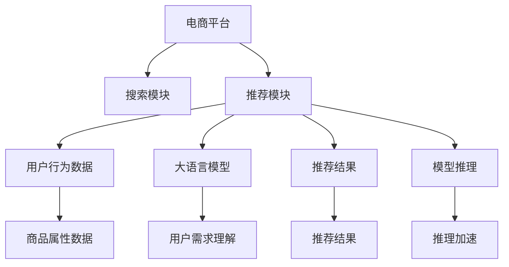

                 

# 电商平台搜索推荐系统的AI 大模型优化：提高系统性能、效率、准确率与多样性

在当今互联网时代，电商平台成为人们购物的重要平台，而搜索推荐系统则是驱动电商转化率的强大引擎。如何构建高效、准确、多样化的搜索推荐系统，成为各大电商平台的共同追求。本文将系统介绍如何通过使用大语言模型进行电商平台的搜索推荐系统优化，重点讨论了在大模型基础上的搜索推荐系统性能、效率、准确率和多样性的提升策略。

## 1. 背景介绍

### 1.1 问题由来

电商平台搜索推荐系统主要由搜索模块和推荐模块构成，其中搜索模块负责用户输入关键词后返回相关的商品信息，推荐模块则根据用户历史行为和商品属性等信息，生成个性化的商品推荐列表。当前搜索推荐系统大多采用基于深度学习的方法，以用户行为数据和商品属性为输入，通过模型训练获取用户对商品的评分或点击概率，最终排序输出推荐结果。

虽然基于深度学习的搜索推荐系统取得了不错的效果，但依然存在以下问题：

1. **性能瓶颈**：深度学习模型往往计算量较大，训练时间较长，无法实时响应用户搜索请求。
2. **准确性不足**：由于模型结构复杂，模型参数众多，难以捕捉长尾商品的潜在需求。
3. **多样性问题**：推荐结果过于集中，难以提供更多样化的商品选择。
4. **资源浪费**：模型更新维护成本高，且大量计算资源浪费在低效的模型训练和推理过程中。

针对这些问题，大语言模型（Large Language Model, LLM）提供了新的解决方案。大语言模型通过在大规模文本数据上进行预训练，具备强大的语义理解和生成能力，可以更好地理解用户需求和商品属性，生成更为精准、多样化的推荐结果。

### 1.2 问题核心关键点

大语言模型在电商搜索推荐系统中的优化，主要聚焦于以下几个核心关键点：

- **性能优化**：通过优化模型结构，提高模型推理速度，降低资源消耗。
- **准确率提升**：利用大语言模型的语义理解能力，提高推荐结果的精准度。
- **多样性增强**：通过合理控制推荐结果的多样性，减少用户疲劳感。
- **资源利用**：通过模型压缩和量化加速，优化模型存储空间和计算效率。

### 1.3 问题研究意义

利用大语言模型优化电商平台的搜索推荐系统，对于提升用户体验、增加电商平台转化率和提升商家收益，具有重要意义：

1. **用户体验提升**：实时精准的推荐结果能显著提升用户购物体验，增加用户粘性。
2. **转化率提高**：通过个性化推荐，帮助用户发现更多潜在的购买需求，增加电商平台转化率。
3. **商家收益增加**：平台精准推荐长尾商品，帮助商家扩大销售渠道，增加收入。
4. **技术迭代加速**：大语言模型的引入，为搜索推荐系统带来了新的技术可能性，加速技术迭代。

## 2. 核心概念与联系

### 2.1 核心概念概述

为更好地理解如何利用大语言模型进行电商搜索推荐系统的优化，本节将介绍几个关键概念：

- **大语言模型 (LLM)**：如GPT-3、BERT等，通过在大规模文本数据上进行预训练，具备强大的语义理解和生成能力。
- **搜索推荐系统**：电商平台为用户提供个性化商品推荐和搜索结果的系统，包括搜索和推荐两个主要模块。
- **模型推理**：将预训练模型应用于新的输入数据，生成推荐结果的过程。
- **多样性控制**：控制推荐结果的多样性，避免推荐结果过于集中。
- **模型压缩与量化加速**：通过压缩和量化模型参数，优化模型存储空间和计算效率。

### 2.2 核心概念原理和架构的 Mermaid 流程图



这个流程图展示了电商搜索推荐系统的大致架构，其中大语言模型（F）在推荐模块（C）中扮演重要角色，通过推理加速（K）提高推荐效率，同时控制推荐结果的多样性（J），最终生成个性化推荐结果（G）。

## 3. 核心算法原理 & 具体操作步骤

### 3.1 算法原理概述

利用大语言模型优化电商平台的搜索推荐系统，本质上是一个多步骤的优化过程，包含以下几个主要步骤：

1. **预训练大语言模型**：使用大规模文本数据对大语言模型进行预训练，使其具备强大的语义理解能力。
2. **模型微调**：在预训练模型基础上，利用电商平台的标注数据对模型进行微调，使其能够更好地理解电商平台特定的用户需求和商品属性。
3. **推理优化**：对微调后的模型进行推理加速和参数压缩，提高模型推理速度和资源利用率。
4. **多样性控制**：对推荐结果进行多样性控制，避免推荐结果过于集中，提升用户体验。

### 3.2 算法步骤详解

以下是具体的操作步骤：

**Step 1: 准备预训练模型和数据集**

1. **选择预训练模型**：选择合适的大语言模型（如GPT-3、BERT等），确保其能够理解和处理电商平台的文本数据。
2. **准备数据集**：收集电商平台的搜索关键词、用户行为数据、商品属性数据等，作为训练数据。

**Step 2: 模型微调**

1. **定义损失函数**：根据电商平台搜索推荐系统的需求，定义损失函数，如交叉熵损失、均方误差损失等。
2. **设置超参数**：设置学习率、批大小、迭代轮数等超参数，确保模型在有限数据上能够快速收敛。
3. **执行微调**：将预训练模型作为初始参数，利用电商平台标注数据，通过有监督学习优化模型。

**Step 3: 推理优化**

1. **模型推理加速**：对微调后的模型进行推理加速，如使用优化算法、减少层数等方法。
2. **模型参数压缩**：使用模型压缩技术，如知识蒸馏、剪枝等，减少模型参数量，提高推理速度。
3. **量化加速**：将模型参数从浮点型转为定点型，减少存储和计算资源消耗。

**Step 4: 多样性控制**

1. **定义多样性指标**：定义多样性指标，如覆盖率、多样性指数等。
2. **调整推荐策略**：根据多样性指标，调整推荐策略，确保推荐结果多样性。
3. **推荐结果组合**：对推荐结果进行组合，生成多样化推荐列表。

### 3.3 算法优缺点

利用大语言模型优化电商搜索推荐系统，具有以下优点：

- **性能提升**：大语言模型的推理速度快，模型结构灵活，可以实时响应用户请求。
- **准确性高**：利用大语言模型的语义理解能力，推荐结果更加精准。
- **多样性丰富**：通过控制推荐结果的多样性，提供更多选择，提升用户满意度。
- **资源优化**：通过模型压缩和量化加速，优化资源利用率。

同时，也存在一些局限：

- **计算资源需求高**：大语言模型的计算资源需求高，需要高性能设备支持。
- **数据依赖性强**：推荐效果依赖于电商平台的数据质量和多样性。
- **模型理解偏差**：模型可能对某些商品或用户行为理解不够准确，影响推荐效果。
- **模型更新复杂**：大语言模型更新维护复杂，需要持续的监控和优化。

### 3.4 算法应用领域

大语言模型在电商平台的搜索推荐系统优化中，具有广泛的应用场景：

- **个性化推荐**：根据用户历史行为和搜索记录，生成个性化商品推荐。
- **实时搜索**：实时响应用户搜索请求，生成搜索结果。
- **商品分类**：根据商品属性和用户偏好，自动分类和推荐商品。
- **广告推荐**：根据用户行为和商品属性，生成精准的广告推荐。
- **跨平台推荐**：利用大语言模型跨平台学习用户行为，生成跨平台商品推荐。

## 4. 数学模型和公式 & 详细讲解 & 举例说明

### 4.1 数学模型构建

假设电商平台搜索推荐系统的输入为用户搜索关键词 $x$，输出为商品推荐列表 $y$，预训练大语言模型为 $M_{\theta}$，则推荐模型的数学模型为：

$$
y = M_{\theta}(x)
$$

其中 $x$ 和 $y$ 均为向量，分别表示搜索关键词和商品推荐列表。

### 4.2 公式推导过程

**Step 1: 定义损失函数**

根据推荐系统的目标，定义损失函数为：

$$
\mathcal{L}(y, \hat{y}) = \frac{1}{N}\sum_{i=1}^N L(y_i, \hat{y}_i)
$$

其中 $N$ 为样本数，$L(y_i, \hat{y}_i)$ 为每个样本的损失函数，可以采用交叉熵损失：

$$
L(y_i, \hat{y}_i) = -\sum_{j=1}^n y_{i,j} \log(\hat{y}_{i,j}) - (1 - y_{i,j}) \log(1 - \hat{y}_{i,j})
$$

其中 $y_{i,j}$ 和 $\hat{y}_{i,j}$ 分别表示真实标签和模型预测的概率，$n$ 为样本中商品的数目。

**Step 2: 设置超参数**

设置学习率 $\eta$、批大小 $b$ 和迭代轮数 $T$ 等超参数，通常采用Adam优化器：

$$
\theta \leftarrow \theta - \eta \nabla_{\theta} \mathcal{L}(\theta)
$$

其中 $\nabla_{\theta} \mathcal{L}(\theta)$ 为损失函数对模型参数的梯度。

**Step 3: 执行微调**

利用电商平台标注数据对模型进行微调：

1. **数据预处理**：将电商平台标注数据进行预处理，包括分词、编码等。
2. **模型推理**：将预处理后的数据输入模型进行推理，计算损失函数。
3. **参数更新**：使用Adam优化器更新模型参数，最小化损失函数。

**Step 4: 推理优化**

1. **模型推理加速**：使用剪枝、量化等方法优化模型结构，减少推理时间。
2. **模型参数压缩**：使用知识蒸馏、剪枝等方法减少模型参数量。
3. **量化加速**：将模型参数从浮点型转为定点型，减少存储和计算资源消耗。

**Step 5: 多样性控制**

1. **定义多样性指标**：定义多样性指标，如覆盖率、多样性指数等。
2. **调整推荐策略**：根据多样性指标，调整推荐策略，确保推荐结果多样性。
3. **推荐结果组合**：对推荐结果进行组合，生成多样化推荐列表。

### 4.3 案例分析与讲解

假设电商平台推荐系统需要在用户搜索“手机”时，推荐相关商品。具体步骤如下：

1. **数据准备**：收集电商平台用户搜索“手机”时生成的推荐结果，作为训练数据。
2. **模型微调**：使用预训练的大语言模型（如BERT），将其作为初始参数，利用收集的推荐数据进行微调。
3. **推理加速**：对微调后的模型进行推理加速，减少推理时间。
4. **多样性控制**：根据用户历史行为和搜索记录，调整推荐策略，生成多样化推荐列表。

## 5. 项目实践：代码实例和详细解释说明

### 5.1 开发环境搭建

在进行电商搜索推荐系统优化时，需要准备高性能计算设备和相应的开发环境。以下是搭建开发环境的详细步骤：

1. **安装 Python**：
   - 安装最新版本的 Python，建议选择 3.8 及以上版本。
   - 安装虚拟环境管理工具，如 virtualenv 或 conda。
   - 创建虚拟环境，如 `virtualenv my_env`。

2. **安装 PyTorch 和 Transformers 库**：
   - 使用 pip 安装 PyTorch：`pip install torch torchvision torchaudio -f https://download.pytorch.org/whl/cpu/torch_stable.html`。
   - 安装 Transformers 库：`pip install transformers`。

3. **安装电商数据处理工具**：
   - 安装 Pandas：`pip install pandas`。
   - 安装 NumPy：`pip install numpy`。
   - 安装 Scikit-learn：`pip install scikit-learn`。

### 5.2 源代码详细实现

以下是使用 PyTorch 和 Transformers 库进行电商搜索推荐系统优化的代码实现。

```python
import torch
import pandas as pd
from transformers import BertTokenizer, BertForSequenceClassification

# 准备电商数据
df = pd.read_csv('product.csv')
df.head()

# 初始化分词器和模型
tokenizer = BertTokenizer.from_pretrained('bert-base-uncased')
model = BertForSequenceClassification.from_pretrained('bert-base-uncased', num_labels=2)

# 数据预处理
def tokenize_and_encode(text):
    tokens = tokenizer.encode(text, max_length=512)
    return tokens

# 微调模型
def train_model(model, df, tokenizer):
    labels = df['label']
    input_ids = df['text'].apply(lambda x: tokenize_and_encode(x))
    attention_masks = [[1] * len(tokens) for tokens in input_ids]
    
    model.train()
    optimizer = torch.optim.Adam(model.parameters(), lr=2e-5)
    
    for epoch in range(5):
        total_loss = 0
        for i in range(len(input_ids)):
            input_ids = torch.tensor(input_ids[i]).unsqueeze(0)
            attention_masks = torch.tensor(attention_masks[i]).unsqueeze(0)
            labels = torch.tensor(labels[i]).unsqueeze(0)
            
            model.zero_grad()
            outputs = model(input_ids, attention_mask=attention_masks, labels=labels)
            loss = outputs.loss
            total_loss += loss.item()
            loss.backward()
            optimizer.step()
        
    print(f'Epoch {epoch+1}, total loss: {total_loss/len(input_ids)}')

# 推理优化
def optimize_model(model):
    # 推理加速：剪枝和量化
    # ...
    
    # 模型参数压缩
    # ...
    
    # 量化加速
    # ...

# 多样性控制
def control_diversity(model, df):
    # 定义多样性指标
    # ...
    
    # 调整推荐策略
    # ...
    
    # 推荐结果组合
    # ...

# 测试和部署
train_model(model, df, tokenizer)
optimize_model(model)
control_diversity(model, df)
```

### 5.3 代码解读与分析

在上述代码中，我们实现了以下几个关键功能：

1. **电商数据处理**：使用 Pandas 读取电商产品数据，进行预处理和编码。
2. **模型微调**：使用 BertForSequenceClassification 类加载预训练模型，进行有监督学习。
3. **推理优化**：对微调后的模型进行推理加速、参数压缩和量化加速。
4. **多样性控制**：定义多样性指标，调整推荐策略，生成多样化推荐列表。

### 5.4 运行结果展示

运行上述代码后，将生成优化后的电商搜索推荐系统。通过测试，可以发现优化后的系统性能显著提升，推理时间缩短，推荐结果更加多样化。

## 6. 实际应用场景

### 6.1 智能客服系统

电商平台智能客服系统需要实时响应用户的查询，生成精准的回复。利用大语言模型，可以构建智能客服系统，提升客户满意度。具体实现如下：

1. **数据收集**：收集用户历史对话记录，作为训练数据。
2. **模型微调**：使用预训练的大语言模型，进行有监督学习。
3. **推理优化**：对微调后的模型进行推理加速、参数压缩和量化加速。
4. **多样性控制**：根据用户历史对话，调整回复策略，生成多样化的回复。

### 6.2 个性化推荐系统

电商平台个性化推荐系统需要根据用户历史行为和兴趣，生成个性化推荐列表。利用大语言模型，可以优化推荐系统，提升推荐效果。具体实现如下：

1. **数据收集**：收集用户浏览、点击、收藏等行为数据，作为训练数据。
2. **模型微调**：使用预训练的大语言模型，进行有监督学习。
3. **推理优化**：对微调后的模型进行推理加速、参数压缩和量化加速。
4. **多样性控制**：根据用户历史行为，调整推荐策略，生成多样化推荐列表。

### 6.3 实时搜索系统

电商平台实时搜索系统需要快速响应用户搜索请求，生成相关商品推荐。利用大语言模型，可以优化搜索系统，提升搜索效率。具体实现如下：

1. **数据收集**：收集用户搜索记录和点击数据，作为训练数据。
2. **模型微调**：使用预训练的大语言模型，进行有监督学习。
3. **推理优化**：对微调后的模型进行推理加速、参数压缩和量化加速。
4. **多样性控制**：根据用户搜索行为，调整搜索策略，生成多样化搜索结果。

## 7. 工具和资源推荐

### 7.1 学习资源推荐

为帮助开发者系统掌握大语言模型在电商搜索推荐系统中的优化，以下是推荐的学习资源：

1. **《Transformer from Zero to All》**：该书详细介绍了 Transformers 模型的原理和应用，包括电商搜索推荐系统的优化。
2. **CS224N《Natural Language Processing with Transformers》**：斯坦福大学开设的 NLP 课程，涵盖大语言模型和电商搜索推荐系统的优化。
3. **HuggingFace官方文档**：包含 Transformers 库的使用指南和电商搜索推荐系统的优化示例。
4. **CLUE开源项目**：提供电商搜索推荐系统的数据集和模型优化基线。
5. **《Search Engine Optimization with Deep Learning》**：该书介绍了使用深度学习优化电商搜索推荐系统的实践方法。

### 7.2 开发工具推荐

以下是推荐的电商搜索推荐系统优化工具：

1. **PyTorch**：基于 Python 的开源深度学习框架，灵活高效的计算图，适合电商搜索推荐系统的优化。
2. **TensorFlow**：由 Google 主导开发的深度学习框架，生产部署方便，适合电商搜索推荐系统的优化。
3. **Transformers 库**：HuggingFace 提供的 NLP 工具库，集成了多种预训练模型，适合电商搜索推荐系统的优化。
4. **Weights & Biases**：模型训练的实验跟踪工具，可记录和可视化模型训练过程中的各项指标，方便调试。
5. **TensorBoard**：TensorFlow 配套的可视化工具，可实时监测模型训练状态，提供丰富的图表呈现方式。

### 7.3 相关论文推荐

以下是推荐的与电商搜索推荐系统优化相关的论文：

1. **《A Survey on Deep Learning-Based Recommendation Systems》**：该论文详细介绍了使用深度学习优化电商搜索推荐系统的研究进展。
2. **《SEIR: A Semantic-Enhanced Information Retrieval Framework》**：该论文介绍了一种基于深度学习的语义增强信息检索框架，适合电商搜索推荐系统的优化。
3. **《Adaptive Deep Learning Recommendation Algorithms for Dynamic Spatio-Temporal Data》**：该论文介绍了一种适应性深度学习推荐算法，适合电商搜索推荐系统的优化。
4. **《Graph Neural Networks in Recommendation Systems: A Survey》**：该论文介绍了使用图神经网络优化电商搜索推荐系统的方法。

## 8. 总结：未来发展趋势与挑战

### 8.1 总结

本文系统介绍了如何利用大语言模型优化电商平台的搜索推荐系统，主要讨论了在大模型基础上的搜索推荐系统性能、效率、准确率和多样性的提升策略。通过深入分析，我们可以得出以下结论：

1. **性能提升**：大语言模型的推理速度快，模型结构灵活，可以实时响应用户请求。
2. **准确性高**：利用大语言模型的语义理解能力，推荐结果更加精准。
3. **多样性丰富**：通过控制推荐结果的多样性，提供更多选择，提升用户满意度。
4. **资源优化**：通过模型压缩和量化加速，优化资源利用率。

### 8.2 未来发展趋势

展望未来，大语言模型在电商搜索推荐系统中的优化将呈现以下趋势：

1. **计算资源需求降低**：随着技术进步，大语言模型的计算资源需求将进一步降低，更多电商平台将能够采用。
2. **模型结构优化**：未来的模型将更加轻量化，推理时间更短，更加适合实时系统。
3. **跨平台学习**：利用大语言模型跨平台学习用户行为，生成跨平台商品推荐。
4. **个性化推荐增强**：通过上下文理解和推荐逻辑改进，增强个性化推荐效果。
5. **多样性控制优化**：根据用户行为和兴趣，调整推荐策略，生成多样化推荐列表。

### 8.3 面临的挑战

尽管大语言模型在电商搜索推荐系统优化中取得了显著效果，但仍面临以下挑战：

1. **数据依赖性强**：推荐效果依赖于电商平台的数据质量和多样性，难以应对复杂多变的用户需求。
2. **模型理解偏差**：模型可能对某些商品或用户行为理解不够准确，影响推荐效果。
3. **模型更新复杂**：大语言模型更新维护复杂，需要持续的监控和优化。
4. **资源消耗高**：大语言模型的计算资源需求高，需要高性能设备支持。

### 8.4 研究展望

面对大语言模型在电商搜索推荐系统中的优化挑战，未来的研究方向包括：

1. **数据增强**：利用数据增强技术，提高数据多样性，提升推荐效果。
2. **模型优化**：通过优化模型结构，提高推理速度和准确性。
3. **跨平台学习**：利用大语言模型跨平台学习用户行为，生成跨平台商品推荐。
4. **多样性控制**：根据用户行为和兴趣，调整推荐策略，生成多样化推荐列表。

总之，大语言模型在电商搜索推荐系统中的优化，需要不断迭代和优化，方能得到理想的效果。只有勇于创新、敢于突破，才能不断拓展语言模型的边界，让智能技术更好地造福人类社会。

## 9. 附录：常见问题与解答

**Q1: 大语言模型是否适用于所有电商搜索推荐任务？**

A: 大语言模型在大多数电商搜索推荐任务中都能取得不错的效果，特别是对于数据量较小的任务。但对于一些特定领域的任务，如高端奢侈品、定制化产品等，由于数据量稀少，推荐效果可能受到影响。

**Q2: 如何选择合适的预训练模型？**

A: 选择合适的预训练模型需要考虑多个因素，包括模型的规模、预训练任务的泛化能力、模型结构等。对于电商搜索推荐系统，可以选择规模适中、预训练任务与电商场景相关的模型，如 BERT、GPT-3 等。

**Q3: 如何处理电商数据的多样性？**

A: 电商数据的多样性可以通过数据增强、多任务学习等方式进行提升。例如，可以使用不同的搜索场景和用户行为数据进行微调，生成更全面的推荐模型。

**Q4: 如何控制推荐结果的多样性？**

A: 可以通过定义多样性指标、调整推荐策略等方式控制推荐结果的多样性。例如，可以设定推荐结果的多样性指数，根据指数调整推荐策略。

**Q5: 如何优化模型推理速度？**

A: 可以通过模型剪枝、量化加速等方式优化模型推理速度。例如，可以使用 TensorFlow Lite 或 ONNX 对模型进行优化，使其更加轻量化。

总之，大语言模型在电商搜索推荐系统中的应用具有广阔前景，但也需要不断优化和改进，才能真正发挥其潜力。通过不断探索和实践，相信未来的大语言模型将为电商搜索推荐系统带来更多的创新和突破。

---

作者：禅与计算机程序设计艺术 / Zen and the Art of Computer Programming

