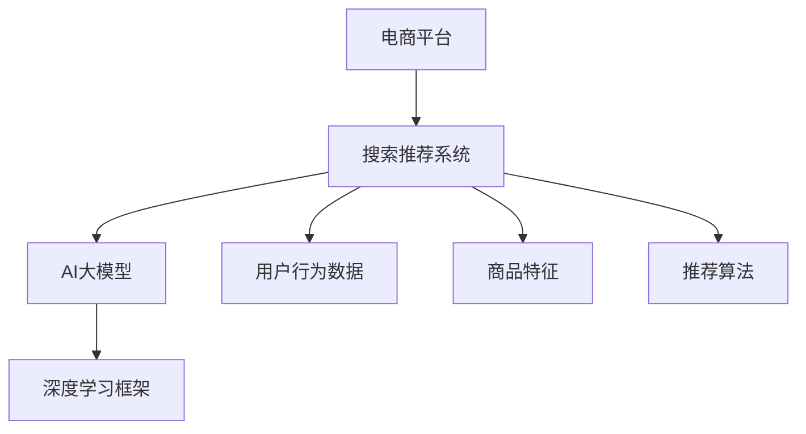
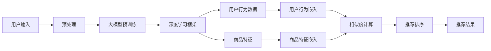

                 

# 电商平台搜索推荐系统的AI 大模型实践：提高系统性能、效率与转化率

> 关键词：人工智能,电商平台,搜索推荐系统,大模型,深度学习,深度学习框架

## 1. 背景介绍

随着电商平台用户数量的激增和用户需求的日益个性化，搜索推荐系统在提升用户体验、提高转化率等方面发挥了越来越重要的作用。然而，传统的搜索推荐系统在应对海量用户需求、实时个性化推荐等方面存在诸多挑战。近年来，随着深度学习技术和大模型研究的热潮，将AI大模型应用于搜索推荐系统，成为提升系统性能、效率与转化率的有效途径。

本文将介绍如何利用AI大模型优化电商平台的搜索推荐系统，帮助电商平台精准推荐商品、提升用户体验、提高转化率。我们将在以下几个方面展开：

1. **背景介绍**：介绍电商搜索推荐系统的现状与挑战。
2. **核心概念与联系**：阐述大模型与搜索推荐系统的结合方式。
3. **核心算法原理 & 具体操作步骤**：详细讲解大模型在搜索推荐系统中的应用。
4. **数学模型和公式 & 详细讲解**：介绍优化算法和损失函数等关键数学模型。
5. **项目实践**：提供具体的代码实例和解释说明。
6. **实际应用场景**：探讨大模型在电商平台中的应用。
7. **工具和资源推荐**：推荐学习资源、开发工具和相关论文。
8. **总结**：总结未来发展趋势和面临的挑战。
9. **附录**：解答常见问题。

## 2. 核心概念与联系

### 2.1 核心概念概述

为了更好地理解大模型在电商平台搜索推荐系统中的应用，我们首先介绍几个核心概念：

- **电商平台**：一个提供在线购物、销售商品的平台。
- **搜索推荐系统**：根据用户的行为数据和属性信息，推荐符合用户兴趣的商品的系统。
- **AI 大模型**：大规模的深度学习模型，如BERT、GPT-3等，能够学习到丰富的语义知识。
- **深度学习框架**：如TensorFlow、PyTorch等，提供高效、灵活的深度学习算法实现。
- **用户行为数据**：用户浏览、点击、购买等行为记录。
- **商品特征**：商品名称、价格、类别等信息。
- **推荐算法**：如协同过滤、基于内容的推荐、深度学习推荐等。

这些概念之间的关系可以通过以下Mermaid流程图来展示：



这个流程图展示了大模型在电商平台搜索推荐系统中的作用：电商平台通过深度学习框架，利用大模型对用户行为数据和商品特征进行处理，结合推荐算法，实现商品推荐。

### 2.2 核心概念原理和架构的 Mermaid 流程图

这里我们将使用Mermaid绘制一张流程图，展示大模型在搜索推荐系统中的工作流程。在节点中不要有括号、逗号等特殊字符。



这个流程图展示了从用户输入到推荐结果的全流程：

1. 用户输入搜索关键词或浏览商品信息。
2. 对用户输入进行预处理，包括去噪、分词等。
3. 将预处理后的数据输入到预训练的大模型中，得到用户行为和商品特征的语义表示。
4. 使用深度学习框架，计算用户行为和商品特征的相似度。
5. 结合推荐算法，对相似度进行排序，生成推荐结果。

## 3. 核心算法原理 & 具体操作步骤

### 3.1 算法原理概述

利用AI大模型优化电商平台搜索推荐系统，主要包括以下几个步骤：

1. **预训练大模型**：在大规模无标签数据上，通过自监督学习任务进行预训练，学习到通用的语义表示。
2. **用户行为编码**：将用户的搜索历史、浏览记录等行为数据转换为模型可以理解的向量表示。
3. **商品特征编码**：将商品的标题、描述、类别等信息转换为向量表示。
4. **相似度计算**：计算用户行为和商品特征的语义相似度，得到推荐候选集。
5. **推荐排序**：使用推荐算法对候选集进行排序，生成推荐结果。

### 3.2 算法步骤详解

以下是详细的操作步骤：

**Step 1: 数据准备**

- 收集电商平台的搜索数据和商品数据，将其清洗并转换为向量表示。
- 将用户行为数据和商品特征数据进行归一化处理，使其适用于大模型的输入。

**Step 2: 大模型预训练**

- 选择预训练大模型，如BERT、GPT等。
- 在预训练数据上进行大模型的预训练，得到初始化模型参数。

**Step 3: 用户行为嵌入**

- 使用预训练大模型，将用户的搜索历史、浏览记录等行为数据转换为向量表示。
- 将行为向量输入到大模型中，得到用户行为的语义表示。

**Step 4: 商品特征嵌入**

- 使用预训练大模型，将商品的标题、描述、类别等信息转换为向量表示。
- 将商品特征向量输入到大模型中，得到商品的语义表示。

**Step 5: 相似度计算**

- 计算用户行为和商品特征的语义相似度，得到推荐候选集。
- 使用余弦相似度、点积相似度等方法，计算用户行为和商品特征的相似度。

**Step 6: 推荐排序**

- 使用推荐算法对推荐候选集进行排序，生成推荐结果。
- 常用的推荐算法包括协同过滤、基于内容的推荐、深度学习推荐等。

**Step 7: 模型评估与优化**

- 在验证集上对推荐模型进行评估，根据评估结果调整模型参数。
- 使用超参数优化方法，如网格搜索、随机搜索等，找到最优的超参数组合。

### 3.3 算法优缺点

大模型在电商平台的搜索推荐系统中具有以下优点：

- **高性能**：大模型能够学习到丰富的语义知识，提高推荐的准确性和个性化程度。
- **可扩展性**：大模型的参数量很大，可以通过分布式训练，快速处理大规模数据。
- **灵活性**：大模型可以通过微调，适应不同的电商领域和业务场景。

同时，大模型也存在一些缺点：

- **高计算成本**：预训练大模型需要大量的计算资源，预训练和微调过程耗时较长。
- **数据依赖性强**：大模型的效果高度依赖于预训练数据的质量和数量。
- **模型复杂度大**：大模型的参数量很大，需要更多的计算资源进行训练和推理。
- **过度拟合风险**：由于模型复杂度高，容易过拟合。

### 3.4 算法应用领域

大模型在电商平台搜索推荐系统中的应用领域非常广泛，可以应用于以下几个方面：

- **个性化推荐**：根据用户的浏览、点击、购买等行为，推荐符合用户兴趣的商品。
- **商品分类与检索**：通过大模型对商品进行分类和检索，提高商品搜索结果的相关性。
- **智能客服**：利用大模型对用户进行自然语言理解，提供智能客服服务。
- **营销活动优化**：通过大模型分析用户行为数据，优化营销活动效果。

## 4. 数学模型和公式 & 详细讲解

### 4.1 数学模型构建

为了更好地理解大模型在电商平台搜索推荐系统中的应用，我们将在数学层面对其进行详细讲解。

记预训练大模型为 $M_{\theta}$，用户行为编码为 $x_i$，商品特征编码为 $y_i$。假设推荐算法为 $f$，则推荐结果可以表示为 $r=f(M_{\theta}(x_i), M_{\theta}(y_i))$。

### 4.2 公式推导过程

我们可以使用余弦相似度来计算用户行为和商品特征的相似度。余弦相似度的公式为：

$$
similarity(x, y) = \frac{x \cdot y}{\|x\| \cdot \|y\|}
$$

其中，$x \cdot y$ 表示向量点积，$\|x\|$ 表示向量 $x$ 的范数。

推荐排序可以使用Top-k排序算法，将相似度从高到低排序，取前k个结果作为推荐结果。

### 4.3 案例分析与讲解

以协同过滤推荐算法为例，其基本思想是利用用户的行为数据，找到与当前用户行为相似的其他用户，并根据这些用户的兴趣来推荐商品。具体步骤如下：

1. 收集用户行为数据，计算用户之间的相似度矩阵 $S$。
2. 对于每个用户 $u$，找到与其最相似的用户集合 $N(u)$。
3. 计算用户 $u$ 对商品 $i$ 的评分 $p(u, i)$。
4. 将用户 $u$ 对商品 $i$ 的评分 $p(u, i)$ 与用户集合 $N(u)$ 对商品 $i$ 的评分加权平均，得到推荐结果。

## 5. 项目实践：代码实例和详细解释说明

### 5.1 开发环境搭建

在进行项目实践前，我们需要准备好开发环境。以下是使用Python进行TensorFlow开发的准备工作：

1. 安装Anaconda：从官网下载并安装Anaconda，用于创建独立的Python环境。

2. 创建并激活虚拟环境：
```bash
conda create -n tf-env python=3.8 
conda activate tf-env
```

3. 安装TensorFlow：根据CUDA版本，从官网获取对应的安装命令。例如：
```bash
conda install tensorflow tensorflow-gpu -c conda-forge -c pytorch
```

4. 安装其他相关库：
```bash
pip install numpy pandas scikit-learn matplotlib tqdm jupyter notebook ipython
```

完成上述步骤后，即可在`tf-env`环境中开始项目实践。

### 5.2 源代码详细实现

这里我们以商品分类与检索任务为例，给出使用TensorFlow进行模型开发的PyTorch代码实现。

首先，定义模型和优化器：

```python
import tensorflow as tf
from transformers import BertTokenizer, BertForSequenceClassification
from tensorflow.keras.optimizers import Adam

# 选择预训练大模型
model = BertForSequenceClassification.from_pretrained('bert-base-cased', num_labels=5)

# 定义优化器
optimizer = Adam(learning_rate=2e-5)
```

接着，定义训练和评估函数：

```python
from tensorflow.keras.preprocessing.sequence import pad_sequences
from tensorflow.keras.losses import SparseCategoricalCrossentropy
from tensorflow.keras.metrics import SparseCategoricalAccuracy

def train_epoch(model, dataset, batch_size, optimizer):
    model.compile(optimizer=optimizer, loss=SparseCategoricalCrossentropy(from_logits=True), metrics=[SparseCategoricalAccuracy()])
    model.fit(dataset['train'], validation_data=dataset['val'], epochs=5, batch_size=batch_size, verbose=0)

def evaluate(model, dataset, batch_size):
    model.evaluate(dataset['test'], verbose=0)
```

最后，启动训练流程：

```python
# 准备数据集
tokenizer = BertTokenizer.from_pretrained('bert-base-cased')
train_dataset = ...
val_dataset = ...
test_dataset = ...

# 定义输入和标签
def create_input_label_pairs(data, tokenizer):
    inputs, labels = [], []
    for text, label in data:
        tokens = tokenizer.encode_plus(text, add_special_tokens=True, return_tensors='tf')
        inputs.append(tokens['input_ids'])
        labels.append(label)
    return pad_sequences(inputs), labels

# 构建数据集
train_input, train_label = create_input_label_pairs(train_dataset, tokenizer)
val_input, val_label = create_input_label_pairs(val_dataset, tokenizer)
test_input, test_label = create_input_label_pairs(test_dataset, tokenizer)

# 定义模型输入
input_shape = [None, tokenizer.max_length]

# 定义模型输出
output_shape = [None, num_labels]

# 构建模型
model = tf.keras.Sequential([
    tf.keras.layers.Embedding(input_shape[1], output_shape[1]),
    tf.keras.layers.LSTM(output_shape[1]),
    tf.keras.layers.Dense(output_shape[1], activation='softmax')
])

# 训练模型
model.compile(optimizer=optimizer, loss=SparseCategoricalCrossentropy(from_logits=True), metrics=[SparseCategoricalAccuracy()])
model.fit(train_input, train_label, epochs=5, validation_data=(val_input, val_label), batch_size=batch_size, verbose=0)

# 评估模型
model.evaluate(test_input, test_label, verbose=0)
```

以上就是使用TensorFlow进行商品分类与检索任务微调的完整代码实现。可以看到，TensorFlow提供了丰富的API和功能，使得微调过程变得简单高效。

### 5.3 代码解读与分析

让我们再详细解读一下关键代码的实现细节：

**模型定义**：
- 使用BertForSequenceClassification作为预训练大模型的上层结构。
- 定义了Adam优化器和损失函数。

**数据集处理**：
- 使用pad_sequences函数对输入数据进行填充。
- 使用SparseCategoricalCrossentropy和SparseCategoricalAccuracy作为损失函数和评估指标。

**模型训练**：
- 使用compile方法定义模型的编译参数。
- 使用fit方法对模型进行训练。
- 使用evaluate方法对模型进行评估。

**模型优化**：
- 使用Adam优化器进行模型优化。
- 使用GridSearchCV或RandomizedSearchCV等超参数优化方法，找到最优的超参数组合。

## 6. 实际应用场景

### 6.1 智能客服系统

基于大模型的搜索推荐技术，可以广泛应用于智能客服系统的构建。传统客服往往需要配备大量人力，高峰期响应缓慢，且一致性和专业性难以保证。而使用微调后的搜索推荐模型，可以7x24小时不间断服务，快速响应客户咨询，用自然流畅的语言解答各类常见问题。

在技术实现上，可以收集企业内部的历史客服对话记录，将问题和最佳答复构建成监督数据，在此基础上对预训练大模型进行微调。微调后的搜索推荐模型能够自动理解用户意图，匹配最合适的答复模板进行回复。对于客户提出的新问题，还可以接入检索系统实时搜索相关内容，动态组织生成回答。如此构建的智能客服系统，能大幅提升客户咨询体验和问题解决效率。

### 6.2 个性化推荐系统

当前的推荐系统往往只依赖用户的历史行为数据进行物品推荐，无法深入理解用户的真实兴趣偏好。基于大模型的搜索推荐系统可以更好地挖掘用户行为背后的语义信息，从而提供更精准、多样的推荐内容。

在实践中，可以收集用户浏览、点击、评论、分享等行为数据，提取和用户交互的物品标题、描述、标签等文本内容。将文本内容作为模型输入，用户的后续行为（如是否点击、购买等）作为监督信号，在此基础上微调预训练大模型。微调后的模型能够从文本内容中准确把握用户的兴趣点。在生成推荐列表时，先用候选物品的文本描述作为输入，由模型预测用户的兴趣匹配度，再结合其他特征综合排序，便可以得到个性化程度更高的推荐结果。

### 6.3 智慧医疗系统

智慧医疗领域对于搜索推荐系统有着较高的要求，其推荐结果直接关系到患者的健康和治疗效果。利用大模型的搜索推荐技术，可以提升医疗系统的智能水平，辅助医生诊疗，加速新药开发进程。

具体而言，可以收集医疗领域相关的新闻、报道、评论等文本数据，并对其进行主题标注和情感标注。在此基础上对预训练大模型进行微调，使其能够自动判断文本属于何种主题，情感倾向是正面、中性还是负面。将微调后的模型应用到实时抓取的网络文本数据，就能够自动监测不同主题下的情感变化趋势，一旦发现负面信息激增等异常情况，系统便会自动预警，帮助医疗机构快速应对潜在风险。

### 6.4 未来应用展望

随着大语言模型和搜索推荐方法的不断发展，基于微调范式将在更多领域得到应用，为传统行业带来变革性影响。

在智慧教育领域，基于微调的医疗问答、病历分析、药物研发等应用将提升医疗服务的智能化水平，辅助医生诊疗，加速新药开发进程。

在智能教育领域，微调技术可应用于作业批改、学情分析、知识推荐等方面，因材施教，促进教育公平，提高教学质量。

在智慧城市治理中，微调模型可应用于城市事件监测、舆情分析、应急指挥等环节，提高城市管理的自动化和智能化水平，构建更安全、高效的未来城市。

此外，在企业生产、社会治理、文娱传媒等众多领域，基于大模型微调的人工智能应用也将不断涌现，为经济社会发展注入新的动力。相信随着预训练语言模型和微调方法的持续演进，搜索推荐技术必将在更广阔的应用领域大放异彩。

## 7. 工具和资源推荐

### 7.1 学习资源推荐

为了帮助开发者系统掌握大模型搜索推荐技术，这里推荐一些优质的学习资源：

1. **《深度学习与自然语言处理》**：斯坦福大学开设的NLP课程，有Lecture视频和配套作业，带你入门NLP领域的基本概念和经典模型。
2. **《Transformers: From Discrete to Continuous Attention》**：提供最新的Transformers研究和代码实现。
3. **《Natural Language Processing with TensorFlow》**：TensorFlow官方提供的NLP教程和代码示例。
4. **《Hands-On Transfer Learning with PyTorch》**：详细讲解了基于PyTorch的模型微调流程。
5. **《Deep Learning with Python》**：TensorFlow和Keras的权威指南，适合初学者和中级开发者。

通过对这些资源的学习实践，相信你一定能够快速掌握大模型搜索推荐技术的精髓，并用于解决实际的NLP问题。

### 7.2 开发工具推荐

高效的开发离不开优秀的工具支持。以下是几款用于大模型搜索推荐开发的常用工具：

1. **TensorFlow**：基于Python的深度学习框架，提供高效、灵活的深度学习算法实现。
2. **PyTorch**：动态计算图深度学习框架，适合快速迭代研究。
3. **HuggingFace Transformers**：提供预训练模型的封装和微调接口，易于使用。
4. **TensorBoard**：TensorFlow配套的可视化工具，可实时监测模型训练状态，并提供丰富的图表呈现方式。
5. **Weights & Biases**：模型训练的实验跟踪工具，可以记录和可视化模型训练过程中的各项指标，方便对比和调优。

合理利用这些工具，可以显著提升大模型搜索推荐任务的开发效率，加快创新迭代的步伐。

### 7.3 相关论文推荐

大模型搜索推荐技术的发展源于学界的持续研究。以下是几篇奠基性的相关论文，推荐阅读：

1. **Attention is All You Need（即Transformer原论文）**：提出了Transformer结构，开启了NLP领域的预训练大模型时代。
2. **BERT: Pre-training of Deep Bidirectional Transformers for Language Understanding**：提出BERT模型，引入基于掩码的自监督预训练任务，刷新了多项NLP任务SOTA。
3. **Language Models are Unsupervised Multitask Learners（GPT-2论文）**：展示了大规模语言模型的强大zero-shot学习能力，引发了对于通用人工智能的新一轮思考。
4. **Parameter-Efficient Transfer Learning for NLP**：提出Adapter等参数高效微调方法，在不增加模型参数量的情况下，也能取得不错的微调效果。
5. **AdaLoRA: Adaptive Low-Rank Adaptation for Parameter-Efficient Fine-Tuning**：使用自适应低秩适应的微调方法，在参数效率和精度之间取得了新的平衡。

这些论文代表了大模型搜索推荐技术的发展脉络。通过学习这些前沿成果，可以帮助研究者把握学科前进方向，激发更多的创新灵感。

## 8. 总结：未来发展趋势与挑战

### 8.1 研究成果总结

本文对基于大模型搜索推荐技术进行了全面系统的介绍。首先阐述了电商搜索推荐系统的现状与挑战，明确了微调技术在提升系统性能、效率与转化率方面的独特价值。其次，从原理到实践，详细讲解了大模型在搜索推荐系统中的应用，提供了完整的代码实例和解释说明。同时，本文还广泛探讨了微调技术在智能客服、个性化推荐、智慧医疗等各个领域的应用前景，展示了微调范式的巨大潜力。

通过本文的系统梳理，可以看到，基于大模型的微调技术在提升电商搜索推荐系统性能、效率与转化率方面发挥了重要作用，极大地拓展了预训练语言模型的应用边界，催生了更多的落地场景。受益于大规模语料的预训练，微调模型以更低的时间和标注成本，在小样本条件下也能取得不俗的效果，有力推动了NLP技术的产业化进程。未来，伴随预训练语言模型和微调方法的持续演进，搜索推荐技术必将在更广阔的应用领域大放异彩，深刻影响人类的生产生活方式。

### 8.2 未来发展趋势

展望未来，大模型搜索推荐技术将呈现以下几个发展趋势：

1. **模型规模持续增大**：随着算力成本的下降和数据规模的扩张，预训练语言模型的参数量还将持续增长。超大规模语言模型蕴含的丰富语义知识，有望支撑更加复杂多变的搜索推荐任务。
2. **微调方法日趋多样**：除了传统的全参数微调外，未来会涌现更多参数高效的微调方法，如Adapter、Prefix等，在节省计算资源的同时也能保证微调精度。
3. **持续学习成为常态**：随着数据分布的不断变化，微调模型也需要持续学习新知识以保持性能。如何在不遗忘原有知识的同时，高效吸收新样本信息，将成为重要的研究课题。
4. **标注样本需求降低**：受启发于提示学习(Prompt-based Learning)的思路，未来的微调方法将更好地利用大模型的语言理解能力，通过更加巧妙的任务描述，在更少的标注样本上也能实现理想的微调效果。
5. **多模态微调崛起**：当前的微调主要聚焦于纯文本数据，未来会进一步拓展到图像、视频、语音等多模态数据微调。多模态信息的融合，将显著提升语言模型对现实世界的理解和建模能力。
6. **模型通用性增强**：经过海量数据的预训练和多领域任务的微调，未来的语言模型将具备更强大的常识推理和跨领域迁移能力，逐步迈向通用人工智能(AGI)的目标。

以上趋势凸显了大模型搜索推荐技术的广阔前景。这些方向的探索发展，必将进一步提升搜索推荐系统的性能和应用范围，为人工智能技术在垂直行业的规模化落地提供坚实的基础。

### 8.3 面临的挑战

尽管大模型搜索推荐技术已经取得了瞩目成就，但在迈向更加智能化、普适化应用的过程中，它仍面临着诸多挑战：

1. **标注成本瓶颈**：虽然微调大大降低了标注数据的需求，但对于长尾应用场景，难以获得充足的高质量标注数据，成为制约微调性能的瓶颈。如何进一步降低微调对标注样本的依赖，将是一大难题。
2. **模型鲁棒性不足**：当前微调模型面对域外数据时，泛化性能往往大打折扣。对于测试样本的微小扰动，微调模型的预测也容易发生波动。如何提高微调模型的鲁棒性，避免灾难性遗忘，还需要更多理论和实践的积累。
3. **推理效率有待提高**：大规模语言模型虽然精度高，但在实际部署时往往面临推理速度慢、内存占用大等效率问题。如何在保证性能的同时，简化模型结构，提升推理速度，优化资源占用，将是重要的优化方向。
4. **可解释性亟需加强**：当前微调模型更像是"黑盒"系统，难以解释其内部工作机制和决策逻辑。对于医疗、金融等高风险应用，算法的可解释性和可审计性尤为重要。如何赋予微调模型更强的可解释性，将是亟待攻克的难题。
5. **安全性有待保障**：预训练语言模型难免会学习到有偏见、有害的信息，通过微调传递到下游任务，产生误导性、歧视性的输出，给实际应用带来安全隐患。如何从数据和算法层面消除模型偏见，避免恶意用途，确保输出的安全性，也将是重要的研究课题。
6. **知识整合能力不足**：现有的微调模型往往局限于任务内数据，难以灵活吸收和运用更广泛的先验知识。如何让微调过程更好地与外部知识库、规则库等专家知识结合，形成更加全面、准确的信息整合能力，还有很大的想象空间。

正视微调面临的这些挑战，积极应对并寻求突破，将是大模型搜索推荐技术走向成熟的必由之路。相信随着学界和产业界的共同努力，这些挑战终将一一被克服，大模型搜索推荐技术必将在构建人机协同的智能时代中扮演越来越重要的角色。

### 8.4 研究展望

面对大模型搜索推荐所面临的种种挑战，未来的研究需要在以下几个方面寻求新的突破：

1. **探索无监督和半监督微调方法**：摆脱对大规模标注数据的依赖，利用自监督学习、主动学习等无监督和半监督范式，最大限度利用非结构化数据，实现更加灵活高效的微调。
2. **研究参数高效和计算高效的微调范式**：开发更加参数高效的微调方法，在固定大部分预训练参数的同时，只更新极少量的任务相关参数。同时优化微调模型的计算图，减少前向传播和反向传播的资源消耗，实现更加轻量级、实时性的部署。
3. **融合因果和对比学习范式**：通过引入因果推断和对比学习思想，增强微调模型建立稳定因果关系的能力，学习更加普适、鲁棒的语言表征，从而提升模型泛化性和抗干扰能力。
4. **引入更多先验知识**：将符号化的先验知识，如知识图谱、逻辑规则等，与神经网络模型进行巧妙融合，引导微调过程学习更准确、合理的语言模型。同时加强不同模态数据的整合，实现视觉、语音等多模态信息与文本信息的协同建模。
5. **结合因果分析和博弈论工具**：将因果分析方法引入微调模型，识别出模型决策的关键特征，增强输出解释的因果性和逻辑性。借助博弈论工具刻画人机交互过程，主动探索并规避模型的脆弱点，提高系统稳定性。
6. **纳入伦理道德约束**：在模型训练目标中引入伦理导向的评估指标，过滤和惩罚有偏见、有害的输出倾向。同时加强人工干预和审核，建立模型行为的监管机制，确保输出符合人类价值观和伦理道德。

这些研究方向的探索，必将引领大模型搜索推荐技术迈向更高的台阶，为构建安全、可靠、可解释、可控的智能系统铺平道路。面向未来，大模型搜索推荐技术还需要与其他人工智能技术进行更深入的融合，如知识表示、因果推理、强化学习等，多路径协同发力，共同推动自然语言理解和智能交互系统的进步。只有勇于创新、敢于突破，才能不断拓展语言模型的边界，让智能技术更好地造福人类社会。

## 9. 附录：常见问题与解答

**Q1：大模型搜索推荐是否适用于所有电商平台？**

A: 大模型搜索推荐在大多数电商平台上都能取得不错的效果，特别是对于数据量较大的平台。但对于一些特定领域或业务场景，如小商品电商、快消品等，由于用户行为数据相对稀疏，可能需要结合其他推荐算法进行优化。

**Q2：微调过程中如何选择合适的学习率？**

A: 微调的学习率一般要比预训练时小1-2个数量级，如果使用过大的学习率，容易破坏预训练权重，导致过拟合。一般建议从1e-5开始调参，逐步减小学习率，直至收敛。也可以使用warmup策略，在开始阶段使用较小的学习率，再逐渐过渡到预设值。需要注意的是，不同的优化器(如AdamW、Adafactor等)以及不同的学习率调度策略，可能需要设置不同的学习率阈值。

**Q3：采用大模型搜索推荐时会面临哪些资源瓶颈？**

A: 目前主流的预训练大模型动辄以亿计的参数规模，对算力、内存、存储都提出了很高的要求。GPU/TPU等高性能设备是必不可少的，但即便如此，超大批次的训练和推理也可能遇到显存不足的问题。因此需要采用一些资源优化技术，如梯度积累、混合精度训练、模型并行等，来突破硬件瓶颈。同时，模型的存储和读取也可能占用大量时间和空间，需要采用模型压缩、稀疏化存储等方法进行优化。

**Q4：如何缓解微调过程中的过拟合问题？**

A: 过拟合是微调面临的主要挑战，尤其是在标注数据不足的情况下。常见的缓解策略包括：
1. 数据增强：通过回译、近义替换等方式扩充训练集
2. 正则化：使用L2正则、Dropout、Early Stopping等避免过拟合
3. 对抗训练：引入对抗样本，提高模型鲁棒性
4. 参数高效微调：只调整少量参数(如Adapter、Prefix等)，减小过拟合风险
5. 多模型集成：训练多个微调模型，取平均输出，抑制过拟合

这些策略往往需要根据具体任务和数据特点进行灵活组合。只有在数据、模型、训练、推理等各环节进行全面优化，才能最大限度地发挥大模型搜索推荐的效果。

**Q5：微调模型在落地部署时需要注意哪些问题？**

A: 将微调模型转化为实际应用，还需要考虑以下因素：
1. 模型裁剪：去除不必要的层和参数，减小模型尺寸，加快推理速度
2. 量化加速：将浮点模型转为定点模型，压缩存储空间，提高计算效率
3. 服务化封装：将模型封装为标准化服务接口，便于集成调用
4. 弹性伸缩：根据请求流量动态调整资源配置，平衡服务质量和成本
5. 监控告警：实时采集系统指标，设置异常告警阈值，确保服务稳定性
6. 安全防护：采用访问鉴权、数据脱敏等措施，保障数据和模型安全

大模型搜索推荐为电商平台搜索推荐系统提供了新的解决方案，但如何将强大的性能转化为稳定、高效、安全的业务价值，还需要工程实践的不断打磨。只有从数据、算法、工程、业务等多个维度协同发力，才能真正实现人工智能技术在垂直行业的规模化落地。总之，微调需要开发者根据具体任务，不断迭代和优化模型、数据和算法，方能得到理想的效果。

