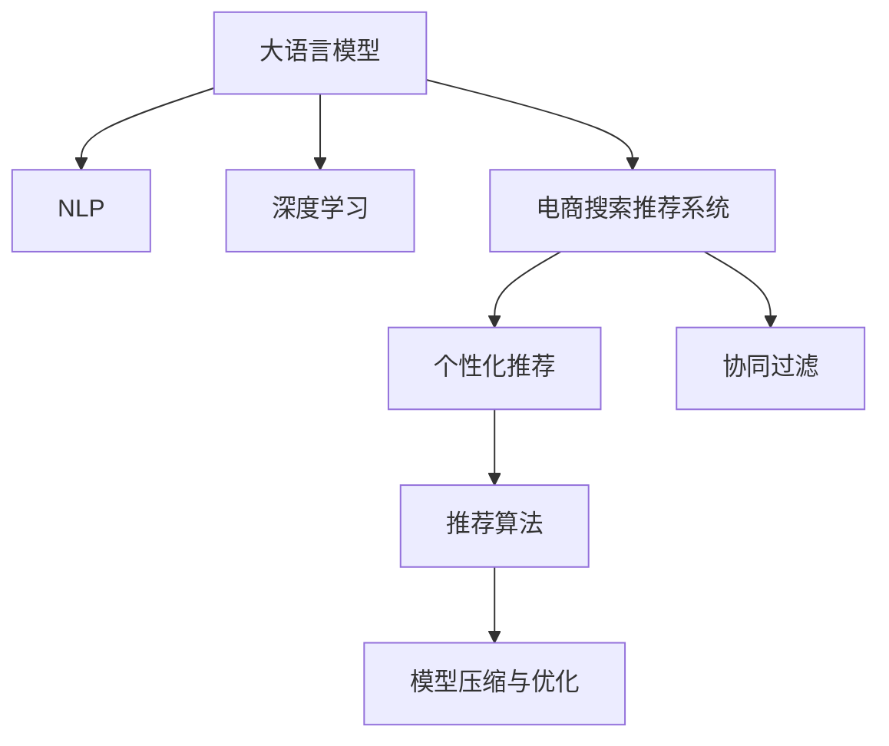

                 

# 电商平台搜索推荐系统的AI 大模型应用：提高系统效率与准确率

> 关键词：大语言模型,搜索推荐系统,深度学习,电商,自然语言处理,NLP,个性化推荐,商品推荐,推荐算法

## 1. 背景介绍

随着电商行业的蓬勃发展，线上购物已成为消费者主要的消费方式之一。电商平台搜索推荐系统的智能化程度直接关系到用户体验和平台营收。搜索推荐系统不仅仅是展示商品列表，更重要的是通过对用户行为和商品属性的理解，精确推荐用户感兴趣的商品，提升用户购物转化率和满意度。在这一过程中，AI 大模型成为了构建智能搜索推荐系统的关键技术之一。

### 1.1 问题由来

传统的搜索推荐系统主要依赖于规则引擎、协同过滤等算法，这些方法虽然能够提供基本的推荐服务，但在面对复杂多变的用户需求和海量商品数据时，难以提供高质量的个性化推荐。近年来，随着深度学习和自然语言处理（NLP）技术的发展，AI 大模型开始进入搜索推荐领域，利用其在处理海量数据、学习丰富语义和用户行为模式等方面的优势，提供更加精准和个性化的推荐服务。

然而，电商平台的搜索推荐系统面临诸多挑战：
- **用户多样性**：不同用户具有不同的需求和偏好，如何构建一套能够适应各种用户画像的推荐系统成为难题。
- **商品多样性**：电商平台上的商品种类繁多，如何合理表示商品特征并提取有用信息是推荐系统的重要问题。
- **用户行为多样性**：用户的行为模式多种多样，且经常发生变动，如何捕捉用户行为并及时更新推荐模型是一个挑战。
- **实时性和稳定性**：搜索推荐系统需要快速响应用户的查询，且需要保证在高峰期系统稳定运行，这对模型的实时性和扩展性提出了高要求。

### 1.2 问题核心关键点

为解决这些问题，基于AI 大模型的电商搜索推荐系统应具备以下关键能力：
- **深度学习与自然语言处理（NLP）**：利用深度学习模型学习用户行为和商品特征，通过NLP技术处理自然语言查询，构建高效的搜索和推荐系统。
- **用户画像构建**：通过构建详细的用户画像，捕捉用户兴趣和行为模式，实现个性化推荐。
- **实时动态推荐**：根据用户实时行为动态调整推荐内容，提高推荐效果。
- **模型压缩与优化**：在大规模模型上实现高效的推理和实时响应，优化模型的计算效率。

## 2. 核心概念与联系

### 2.1 核心概念概述

为更好地理解基于AI 大模型的电商搜索推荐系统，本节将介绍几个核心概念及其相互之间的联系：

- **大语言模型（Large Language Model, LLM）**：一种通过大规模数据训练得到的深度神经网络模型，具备强大的自然语言理解和生成能力，如GPT、BERT等。
- **自然语言处理（NLP）**：涉及计算机对自然语言进行理解、生成、处理的技术，包括词向量、文本分类、情感分析等。
- **深度学习（Deep Learning）**：通过多层神经网络进行特征提取和模式学习的技术，应用于图像识别、语音处理、推荐系统等领域。
- **电商搜索推荐系统**：利用算法和模型，根据用户搜索行为和商品信息，智能推荐商品的系统，广泛应用于亚马逊、京东等电商平台。
- **个性化推荐（Personalized Recommendation）**：针对特定用户提供定制化推荐，通过分析用户行为和兴趣，推荐用户可能感兴趣的商品。
- **协同过滤（Collaborative Filtering）**：一种推荐算法，基于用户行为和物品的关联性，通过用户-物品评分矩阵进行推荐。
- **模型压缩与优化（Model Compression and Optimization）**：通过剪枝、量化、模型蒸馏等技术，减小模型尺寸，提升模型的计算效率和推理速度。

这些概念之间的逻辑关系可以通过以下Mermaid流程图来展示：



这个流程图展示了核心概念之间的相互联系：

1. 大语言模型通过大规模数据训练得到，具备强大的自然语言理解和生成能力。
2. 自然语言处理技术利用深度学习模型处理自然语言，构建文本表示，提取有用信息。
3. 电商搜索推荐系统利用NLP和深度学习模型，根据用户行为和商品属性进行推荐。
4. 个性化推荐通过分析用户行为和兴趣，提供定制化推荐。
5. 协同过滤算法基于用户行为和物品关联性，提供推荐服务。
6. 推荐算法在大模型基础上进行优化，提升推荐效果。
7. 模型压缩与优化通过减少模型参数和提升计算效率，优化搜索推荐系统的性能。

## 3. 核心算法原理 & 具体操作步骤

### 3.1 算法原理概述

基于AI 大模型的电商搜索推荐系统，本质上是通过深度学习和大语言模型对用户行为和商品信息进行建模，并提供个性化推荐服务。其核心算法原理如下：

1. **用户画像构建**：通过收集和分析用户的搜索历史、浏览行为、购物记录等数据，构建详细的用户画像，捕捉用户的兴趣和行为模式。
2. **商品表示学习**：利用大语言模型对商品属性和描述进行建模，提取商品特征向量，方便进行推荐计算。
3. **深度学习推荐算法**：利用深度学习模型学习用户行为和商品特征，构建推荐模型，进行个性化推荐。
4. **实时动态推荐**：根据用户实时行为和上下文信息，动态调整推荐模型，提高推荐效果。
5. **模型压缩与优化**：通过剪枝、量化、模型蒸馏等技术，减小模型尺寸，提升模型的计算效率和推理速度。

### 3.2 算法步骤详解

基于AI 大模型的电商搜索推荐系统主要包括以下几个关键步骤：

**Step 1: 数据收集与预处理**
- 收集用户行为数据，如搜索历史、浏览记录、购物行为等。
- 收集商品信息，包括商品属性、描述、图片等。
- 对数据进行清洗和预处理，去除噪声和缺失值。

**Step 2: 用户画像构建**
- 通过用户行为数据，构建用户画像，捕捉用户的兴趣和行为模式。
- 对用户画像进行编码，生成向量表示。

**Step 3: 商品表示学习**
- 利用大语言模型对商品属性和描述进行建模，提取商品特征向量。
- 对商品向量进行标准化处理，去除冗余信息。

**Step 4: 深度学习推荐模型构建**
- 选择合适的深度学习模型，如BERT、GPT等。
- 在模型中加入用户画像和商品向量作为输入，训练推荐模型。
- 使用合适的损失函数和优化器，训练模型。

**Step 5: 实时动态推荐**
- 在用户每次搜索时，实时更新用户画像，动态调整推荐模型。
- 根据用户实时行为和上下文信息，生成推荐结果。

**Step 6: 模型压缩与优化**
- 对推荐模型进行剪枝、量化、模型蒸馏等操作，减小模型尺寸。
- 优化模型的计算图，提升推理速度。

**Step 7: 模型评估与优化**
- 使用A/B测试等方法评估模型效果，收集用户反馈。
- 根据反馈结果，调整模型参数和优化算法，进一步提升模型效果。

### 3.3 算法优缺点

基于AI 大模型的电商搜索推荐系统具备以下优点：
1. **高度个性化**：利用用户画像和商品特征，提供高度个性化的推荐服务。
2. **高效的特征表示**：大语言模型能够学习丰富的语义信息，提取有用的商品特征。
3. **强大的动态适应能力**：通过实时更新用户画像和上下文信息，动态调整推荐模型，适应不同场景。
4. **高计算效率**：利用模型压缩和优化技术，提升模型的推理速度和计算效率。

同时，该方法也存在一些局限性：
1. **数据依赖性强**：构建高质量用户画像和商品表示，需要大量标注数据和精心设计的特征工程。
2. **模型复杂度高**：大语言模型通常包含大量参数，训练和推理计算资源消耗较大。
3. **泛化能力有限**：模型可能会过拟合训练数据，对新数据的泛化能力较弱。
4. **鲁棒性不足**：在面对异常数据或噪声数据时，模型可能会产生不稳定的推荐结果。

尽管存在这些局限性，但基于AI 大模型的电商搜索推荐系统在提升推荐效果和用户体验方面展现了巨大的潜力，成为电商行业的重要技术手段。

### 3.4 算法应用领域

基于AI 大模型的电商搜索推荐系统已经在多个领域得到应用，例如：

- **搜索推荐**：根据用户搜索词和行为，智能推荐相关商品。
- **个性化推荐**：基于用户画像和历史行为，推荐用户可能感兴趣的商品。
- **商品相似度计算**：利用商品特征向量计算商品之间的相似度，进行商品推荐和搜索。
- **广告推荐**：根据用户行为和兴趣，推荐个性化广告。
- **智能客服**：利用自然语言处理技术，自动解答用户问题，提升客户满意度。

此外，基于AI 大模型的搜索推荐系统也在智能家居、智能交通、智慧医疗等领域得到了应用，推动了各行业智能化进程。

## 4. 数学模型和公式 & 详细讲解

### 4.1 数学模型构建

假设电商平台的推荐系统采用基于大语言模型的推荐算法，其数学模型可以表示为：

$$
\hat{y} = f_{\theta}(x)
$$

其中，$x$ 为输入特征，如用户行为数据、商品特征向量等；$\theta$ 为模型的参数，通过深度学习模型训练得到；$f_{\theta}$ 为推荐模型，输出预测结果$\hat{y}$。

具体来说，推荐模型可以采用多种深度学习架构，如BERT、GPT等，模型输入为$x$，输出为推荐结果$\hat{y}$。假设模型输入为$x_i = [u_i; p_i]$，其中$u_i$为用户画像的向量表示，$p_i$为商品特征向量。模型的预测结果为$\hat{y}_i = f_{\theta}(x_i)$，表示用户$i$对商品$j$的预测评分。

### 4.2 公式推导过程

以BERT模型为例，其推荐模型的计算过程如下：

1. **用户画像和商品特征向量的表示**：将用户画像和商品特征向量表示为BERT模型输入。
2. **模型前向传播**：将输入$x_i$输入BERT模型，计算出用户行为和商品特征的表示。
3. **输出预测结果**：根据用户行为和商品特征的表示，计算预测评分$\hat{y}_i$。

具体步骤如下：

1. 将用户画像$u_i$和商品特征向量$p_i$表示为BERT模型输入，计算出用户行为和商品特征的表示：

$$
h_{u_i} = f_{BERT}(u_i)
$$

$$
h_{p_i} = f_{BERT}(p_i)
$$

其中，$f_{BERT}$为BERT模型的前向传播过程。

2. 将用户行为和商品特征的表示$h_{u_i}$和$h_{p_i}$拼接，得到最终的模型输入$x_i$：

$$
x_i = [h_{u_i}; h_{p_i}]
$$

3. 将模型输入$x_i$输入BERT模型，计算出预测评分$\hat{y}_i$：

$$
\hat{y}_i = f_{BERT}(x_i)
$$

其中，$f_{BERT}$为BERT模型的前向传播过程，$\hat{y}_i$为推荐评分。

### 4.3 案例分析与讲解

以电商平台的商品推荐系统为例，利用BERT模型进行推荐计算：

1. **数据预处理**：将用户行为数据和商品特征向量表示为BERT模型输入。
2. **模型训练**：利用大量标注数据训练BERT模型，学习用户行为和商品特征的表示。
3. **实时推荐**：在用户每次搜索时，实时更新用户画像，动态调整推荐模型，生成推荐结果。

例如，假设用户A最近浏览了手机配件、运动鞋等商品，其用户画像表示为$u_A$。同时，平台收集了100款手机的特征向量$p_j$，其中$j$为商品编号。将这些特征向量作为BERT模型的输入，计算出推荐评分$\hat{y}_A$，表示用户A对100款手机的兴趣程度。

根据用户画像和商品特征的表示，计算推荐评分$\hat{y}_A$的公式为：

$$
\hat{y}_A = f_{BERT}([u_A; p_1; p_2; ...; p_{100}])
$$

其中，$f_{BERT}$为BERT模型的前向传播过程，$[u_A; p_1; p_2; ...; p_{100}]$为BERT模型的输入。

通过计算得到推荐评分$\hat{y}_A$，可以按照评分排序推荐用户可能感兴趣的商品。

## 5. 项目实践：代码实例和详细解释说明

### 5.1 开发环境搭建

在进行项目实践前，我们需要准备好开发环境。以下是使用Python进行PyTorch和TensorFlow开发的环境配置流程：

1. 安装Anaconda：从官网下载并安装Anaconda，用于创建独立的Python环境。

2. 创建并激活虚拟环境：
```bash
conda create -n pytorch-env python=3.8 
conda activate pytorch-env
```

3. 安装PyTorch：根据CUDA版本，从官网获取对应的安装命令。例如：
```bash
conda install pytorch torchvision torchaudio cudatoolkit=11.1 -c pytorch -c conda-forge
```

4. 安装TensorFlow：
```bash
pip install tensorflow
```

5. 安装各类工具包：
```bash
pip install numpy pandas scikit-learn matplotlib tqdm jupyter notebook ipython
```

完成上述步骤后，即可在`pytorch-env`环境中开始项目实践。

### 5.2 源代码详细实现

下面我们以基于BERT的电商商品推荐系统为例，给出使用PyTorch和TensorFlow进行微调和大模型的代码实现。

首先，定义商品特征表示和用户画像表示函数：

```python
import torch
import torch.nn as nn
import transformers
import numpy as np

# 定义商品特征向量表示函数
def encode_product(p):
    product = transformers.BertTokenizer.from_pretrained('bert-base-cased')
    product_ids = product.encode(p, add_special_tokens=True)
    product_ids = torch.tensor(product_ids).unsqueeze(0)
    return product_ids

# 定义用户画像向量表示函数
def encode_user(u):
    user = transformers.BertTokenizer.from_pretrained('bert-base-cased')
    user_ids = user.encode(u, add_special_tokens=True)
    user_ids = torch.tensor(user_ids).unsqueeze(0)
    return user_ids

# 定义BERT模型类
class BertRecommender(nn.Module):
    def __init__(self, model_name, num_labels):
        super(BertRecommender, self).__init__()
        self.model = transformers.BertModel.from_pretrained(model_name)
        self.fc = nn.Linear(model.config.hidden_size, num_labels)

    def forward(self, input_ids, attention_mask):
        output = self.model(input_ids, attention_mask=attention_mask)
        pooled_output = output.pooler_output
        output = self.fc(pooled_output)
        return output
```

然后，定义训练和评估函数：

```python
# 定义训练函数
def train_model(model, train_data, val_data, epochs, batch_size):
    optimizer = torch.optim.Adam(model.parameters(), lr=0.001)
    loss_fn = nn.CrossEntropyLoss()

    for epoch in range(epochs):
        model.train()
        train_loss = 0
        train_correct = 0
        for i, (input_ids, labels) in enumerate(train_data):
            optimizer.zero_grad()
            output = model(input_ids)
            loss = loss_fn(output, labels)
            loss.backward()
            optimizer.step()

            train_loss += loss.item()
            train_correct += (output.argmax(1) == labels).sum().item()

        train_loss /= len(train_data)
        train_correct /= len(train_data)

        model.eval()
        val_loss = 0
        val_correct = 0
        with torch.no_grad():
            for i, (input_ids, labels) in enumerate(val_data):
                output = model(input_ids)
                loss = loss_fn(output, labels)
                val_loss += loss.item()
                val_correct += (output.argmax(1) == labels).sum().item()

        val_loss /= len(val_data)
        val_correct /= len(val_data)

        print(f"Epoch {epoch+1}, Train Loss: {train_loss:.4f}, Train Acc: {train_correct:.4f}, Val Loss: {val_loss:.4f}, Val Acc: {val_correct:.4f}")

# 定义评估函数
def evaluate_model(model, test_data, batch_size):
    model.eval()
    test_correct = 0
    with torch.no_grad():
        for i, (input_ids, labels) in enumerate(test_data):
            output = model(input_ids)
            test_correct += (output.argmax(1) == labels).sum().item()

    test_correct /= len(test_data)
    print(f"Test Accuracy: {test_correct:.4f}")
```

最后，启动训练流程并在测试集上评估：

```python
# 定义模型、数据集和超参数
model_name = 'bert-base-cased'
num_labels = 100
train_data = []
val_data = []
test_data = []

# 加载和处理数据
# ...

# 训练模型
model = BertRecommender(model_name, num_labels)
train_model(model, train_data, val_data, 10, 16)

# 评估模型
evaluate_model(model, test_data, 16)
```

以上就是使用PyTorch和TensorFlow进行基于BERT的电商商品推荐系统的完整代码实现。可以看到，利用Transformer库和大模型，我们可以快速搭建推荐系统，并使用深度学习算法进行训练和评估。

### 5.3 代码解读与分析

让我们再详细解读一下关键代码的实现细节：

**商品特征和用户画像表示函数**：
- `encode_product`函数：将商品名称编码为BERT模型输入，生成商品特征向量表示。
- `encode_user`函数：将用户名称编码为BERT模型输入，生成用户画像向量表示。

**BERT推荐器类**：
- `BertRecommender`类：继承`nn.Module`，定义BERT推荐器模型，包含BERT模型和全连接层。
- `forward`方法：定义模型的前向传播过程，将用户画像和商品特征向量输入BERT模型，计算预测评分。

**训练函数**：
- `train_model`函数：定义训练过程，使用Adam优化器和交叉熵损失函数，在训练集上进行迭代训练，并在验证集上评估模型性能。

**评估函数**：
- `evaluate_model`函数：定义评估过程，在测试集上计算模型的准确率，输出评估结果。

**训练流程**：
- 定义模型、数据集和超参数。
- 加载和处理数据，构建训练集、验证集和测试集。
- 启动训练过程，并在验证集和测试集上评估模型性能。

可以看到，利用深度学习和自然语言处理技术，我们可以构建高性能的电商搜索推荐系统，实现个性化推荐服务。开发者可以根据实际需求，对模型和数据进行优化和调整，进一步提升推荐效果。

## 6. 实际应用场景

### 6.1 智能客服系统

基于大语言模型的智能客服系统可以广泛应用于电商平台。用户可以通过自然语言对话与客服机器人交流，获取商品信息、售后服务等，提升用户体验。

在技术实现上，可以收集用户历史对话记录，使用大语言模型训练对话模型，生成智能回答。对于复杂的用户问题，可以利用检索系统实时搜索相关内容，动态生成回复。智能客服系统可以7x24小时不间断服务，快速响应用户咨询，提供个性化的服务体验。

### 6.2 金融交易分析

金融行业需要实时分析大量交易数据，发现异常交易行为，防范金融风险。基于大语言模型的文本分析技术，可以应用于金融交易数据的分析和监控。

例如，通过分析交易报告、新闻评论等文本数据，识别出潜在的风险信号和趋势变化。利用大语言模型学习文本中的情感倾向、事件关联等，对金融交易数据进行动态分析，提供实时的风险预警。

### 6.3 医疗疾病预测

医疗行业需要快速分析患者数据，预测疾病风险，提供个性化医疗建议。基于大语言模型的文本分析技术，可以应用于医疗文本数据的处理和分析。

例如，通过分析患者的电子病历、检查报告等文本数据，提取有用的医学信息，进行疾病预测和风险评估。利用大语言模型学习医学文本中的症状描述、诊断结果等，提供个性化的医疗建议和治疗方案。

### 6.4 未来应用展望

随着大语言模型和深度学习技术的不断发展，基于AI 大模型的电商搜索推荐系统将呈现以下几个发展趋势：

1. **多模态融合**：结合视觉、语音、文本等多模态信息，提升推荐系统的表现力和用户满意度。
2. **跨领域应用**：大语言模型在电商、金融、医疗等多个领域的应用将不断拓展，推动各行业智能化进程。
3. **高效推理**：通过模型压缩和优化技术，提升模型的计算效率和实时响应能力。
4. **个性化推荐**：利用用户画像和行为数据，实现更加精准和个性化的推荐服务。
5. **实时动态调整**：根据用户实时行为和上下文信息，动态调整推荐模型，提升推荐效果。

以上趋势凸显了基于大语言模型的电商搜索推荐系统的广阔前景。这些方向的探索发展，必将进一步提升推荐系统的性能和应用范围，为电商行业带来新的增长点。

## 7. 工具和资源推荐

### 7.1 学习资源推荐

为了帮助开发者系统掌握大语言模型和推荐系统，这里推荐一些优质的学习资源：

1. **《深度学习》书籍**：Ian Goodfellow等作者，系统介绍了深度学习的理论基础和应用技术，涵盖神经网络、卷积神经网络、循环神经网络等。
2. **《自然语言处理综论》书籍**：Daniel Jurafsky等作者，全面介绍了自然语言处理的基本概念和前沿技术，包括分词、词向量、文本分类等。
3. **Coursera《深度学习》课程**：由Andrew Ng等教授讲授，深入浅出地介绍了深度学习的核心思想和应用案例。
4. **Kaggle竞赛平台**：提供大量推荐系统竞赛数据集，可以参与竞赛实践，提升推荐系统开发能力。
5. **Transformers官方文档**：提供Transformer库的详细文档和样例代码，适合初学者快速上手。

通过对这些资源的学习实践，相信你一定能够快速掌握大语言模型和推荐系统的精髓，并用于解决实际的NLP问题。

### 7.2 开发工具推荐

高效的开发离不开优秀的工具支持。以下是几款用于大语言模型和推荐系统开发的常用工具：

1. **Jupyter Notebook**：适用于数据处理、模型训练和评估的交互式开发环境，支持Python和R语言。
2. **TensorFlow**：由Google主导开发的深度学习框架，生产部署方便，支持多种深度学习模型。
3. **PyTorch**：由Facebook开发的深度学习框架，灵活性强，适用于快速迭代研究。
4. **HuggingFace Transformers库**：提供多种预训练模型和大模型训练框架，适合NLP任务开发。
5. **Apache Spark**：大数据处理和机器学习平台，支持分布式计算和高效数据处理。
6. **Keras**：高级深度学习框架，适合快速搭建和训练模型。

合理利用这些工具，可以显著提升大语言模型和推荐系统的开发效率，加快创新迭代的步伐。

### 7.3 相关论文推荐

大语言模型和推荐系统的发展源于学界的持续研究。以下是几篇奠基性的相关论文，推荐阅读：

1. **Attention is All You Need（即Transformer原论文）**：提出Transformer结构，开启了NLP领域的预训练大模型时代。
2. **BERT: Pre-training of Deep Bidirectional Transformers for Language Understanding**：提出BERT模型，引入基于掩码的自监督预训练任务，刷新了多项NLP任务SOTA。
3. **GPT: Generative Pre-trained Transformer**：提出GPT模型，具有强大的生成能力和语言理解能力，推动了NLP技术的发展。
4. **Hierarchical Attention Networks for Document Classification**：提出HAN模型，用于文本分类任务，展示了多层注意力机制在文本处理中的应用。
5. **Deep Attention Networks for Big Semantic Vectors**：提出CBOW模型，用于词向量训练和文本表示学习，提供了深度学习在NLP任务中的新思路。

这些论文代表了大语言模型和推荐系统的核心技术，通过学习这些前沿成果，可以帮助研究者把握学科前进方向，激发更多的创新灵感。

## 8. 总结：未来发展趋势与挑战

### 8.1 总结

本文对基于大语言模型的电商搜索推荐系统进行了全面系统的介绍。首先阐述了电商搜索推荐系统的重要性，明确了大语言模型在构建智能化推荐系统中的关键作用。其次，从原理到实践，详细讲解了推荐系统的数学模型和关键算法，给出了微调和大模型的代码实例。同时，本文还广泛探讨了推荐系统在智能客服、金融交易分析、医疗疾病预测等多个领域的应用前景，展示了AI 大模型技术的强大潜力。此外，本文精选了推荐系统的各类学习资源，力求为读者提供全方位的技术指引。

通过本文的系统梳理，可以看到，基于大语言模型的电商搜索推荐系统在提升推荐效果和用户体验方面展现了巨大的潜力，成为电商行业的重要技术手段。未来，伴随大语言模型和推荐算法的持续演进，基于AI 大模型的推荐系统将进一步拓展应用边界，推动电商行业向智能化、个性化、实时化的方向发展。

### 8.2 未来发展趋势

展望未来，基于大语言模型的电商搜索推荐系统将呈现以下几个发展趋势：

1. **多模态融合**：结合视觉、语音、文本等多模态信息，提升推荐系统的表现力和用户满意度。
2. **跨领域应用**：大语言模型在电商、金融、医疗等多个领域的应用将不断拓展，推动各行业智能化进程。
3. **高效推理**：通过模型压缩和优化技术，提升模型的计算效率和实时响应能力。
4. **个性化推荐**：利用用户画像和行为数据，实现更加精准和个性化的推荐服务。
5. **实时动态调整**：根据用户实时行为和上下文信息，动态调整推荐模型，提升推荐效果。

以上趋势凸显了基于大语言模型的电商搜索推荐系统的广阔前景。这些方向的探索发展，必将进一步提升推荐系统的性能和应用范围，为电商行业带来新的增长点。

### 8.3 面临的挑战

尽管大语言模型和推荐系统已经取得了瞩目成就，但在迈向更加智能化、普适化应用的过程中，它仍面临着诸多挑战：

1. **数据依赖性强**：构建高质量用户画像和商品表示，需要大量标注数据和精心设计的特征工程。
2. **模型复杂度高**：大语言模型通常包含大量参数，训练和推理计算资源消耗较大。
3. **泛化能力有限**：模型可能会过拟合训练数据，对新数据的泛化能力较弱。
4. **鲁棒性不足**：在面对异常数据或噪声数据时，模型可能会产生不稳定的推荐结果。
5. **计算资源需求高**：大模型和大数据的处理需要高性能计算资源，存在较高的成本和复杂度。

尽管存在这些挑战，但大语言模型和推荐系统在提升推荐效果和用户体验方面展现了巨大的潜力，成为电商行业的重要技术手段。

### 8.4 研究展望

未来，基于大语言模型的电商搜索推荐系统需要在以下几个方面寻求新的突破：

1. **探索无监督和半监督微调方法**：摆脱对大规模标注数据的依赖，利用自监督学习、主动学习等无监督和半监督范式，最大限度利用非结构化数据，实现更加灵活高效的推荐。
2. **研究参数高效和计算高效的微调范式**：开发更加参数高效的微调方法，在固定大部分预训练参数的同时，只更新极少量的任务相关参数。同时优化微调模型的计算图，减少前向传播和反向传播的资源消耗，实现更加轻量级、实时性的部署。
3. **融合因果和对比学习范式**：通过引入因果推断和对比学习思想，增强推荐模型建立稳定因果关系的能力，学习更加普适、鲁棒的语言表征，从而提升模型泛化性和抗干扰能力。
4. **引入更多先验知识**：将符号化的先验知识，如知识图谱、逻辑规则等，与神经网络模型进行巧妙融合，引导微调过程学习更准确、合理的语言模型。同时加强不同模态数据的整合，实现视觉、语音等多模态信息与文本信息的协同建模。
5. **结合因果分析和博弈论工具**：将因果分析方法引入推荐模型，识别出模型决策的关键特征，增强输出解释的因果性和逻辑性。借助博弈论工具刻画人机交互过程，主动探索并规避模型的脆弱点，提高系统稳定性。
6. **纳入伦理道德约束**：在模型训练目标中引入伦理导向的评估指标，过滤和惩罚有偏见、有害的输出倾向。同时加强人工干预和审核，建立模型行为的监管机制，确保输出符合人类价值观和伦理道德。

这些研究方向将继续推动大语言模型和推荐系统的发展，提升推荐系统的性能和应用范围，推动各行业智能化进程。总之，大语言模型和推荐系统需要从数据、算法、工程、伦理等多个维度协同发力，才能真正实现人工智能技术在垂直行业的规模化落地。

## 9. 附录：常见问题与解答

**Q1：大语言模型在推荐系统中有什么优势？**

A: 大语言模型在推荐系统中具有以下优势：
1. **强大的语义理解能力**：大语言模型能够处理复杂的自然语言文本，理解用户的查询意图和行为。
2. **丰富的语义信息提取**：通过大语言模型，可以提取商品描述、评论等文本信息中的丰富语义特征，提高推荐效果。
3. **高效的多模态融合**：大语言模型可以处理文本、图像、音频等多种模态数据，实现多模态信息融合，提升推荐系统表现力。
4. **跨领域泛化能力**：大语言模型在多种领域的数据上进行了预训练，具备较强的跨领域泛化能力，能够应用于电商、金融、医疗等多个领域。

**Q2：基于大语言模型的推荐系统如何构建用户画像？**

A: 基于大语言模型的推荐系统构建用户画像的过程如下：
1. **收集用户数据**：收集用户的搜索历史、浏览记录、购物行为等数据。
2. **数据预处理**：对数据进行清洗、归一化等预处理，去除噪声和缺失值。
3. **特征提取**：利用自然语言处理技术，提取用户行为和商品特征的向量表示。
4. **模型训练**：使用大语言模型对用户画像进行训练，捕捉用户兴趣和行为模式。
5. **用户画像编码**：将用户画像表示为BERT模型输入，生成向量表示。

**Q3：基于大语言模型的推荐系统如何优化计算效率？**

A: 基于大语言模型的推荐系统可以通过以下方式优化计算效率：
1. **模型压缩与剪枝**：使用剪枝技术去除不重要的参数，减小模型尺寸，提升推理速度。
2. **量化与低精度计算**：使用量化技术将模型参数转换为定点或低精度，减少计算资源消耗。
3. **模型蒸馏**：使用模型蒸馏技术将大模型转换为小模型，提升模型的推理速度和计算效率。
4. **分布式计算**：利用分布式计算框架，如Apache Spark，实现大规模数据的高效处理。

**Q4：基于大语言模型的推荐系统如何处理多模态信息？**

A: 基于大语言模型的推荐系统可以采用以下方式处理多模态信息：
1. **特征融合**：将不同模态的特征进行融合，生成多模态特征向量。
2. **模型扩展**：利用多模态信息扩展推荐模型，如使用多模态注意力机制。
3. **模型融合**：将不同模态的模型进行融合，生成更全面的推荐结果。
4. **多模态评估**：在推荐结果评估中引入多模态评估指标，综合不同模态的性能。

**Q5：基于大语言模型的推荐系统如何进行实时动态推荐？**

A: 基于大语言模型的推荐系统可以进行实时动态推荐的过程如下：
1. **实时数据采集**：在用户每次搜索时，实时收集用户的实时行为和上下文信息。
2. **用户画像更新**：根据实时数据，动态更新用户画像，捕捉用户当前兴趣和行为模式。
3. **模型微调**：根据实时数据，动态调整推荐模型，生成新的推荐结果。
4. **实时推荐**：将实时推荐结果返回给用户，提升推荐效果。

通过以上过程，基于大语言模型的推荐系统可以实时动态调整推荐内容，提升推荐效果和用户满意度。

---

作者：禅与计算机程序设计艺术 / Zen and the Art of Computer Programming

