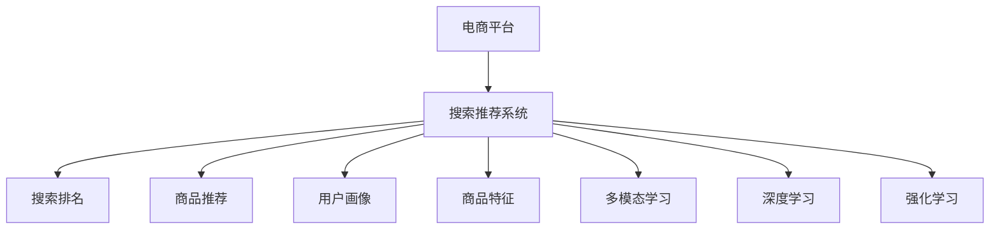

                 

# 电商平台搜索推荐系统的AI 大模型融合：技术架构与应用实践

> 关键词：电商平台,搜索推荐系统,搜索排名,商品推荐,用户画像,商品特征,多模态学习,深度学习,强化学习

## 1. 背景介绍

### 1.1 问题由来
随着电子商务的迅猛发展，电商平台搜索推荐系统的复杂性和挑战性日益增加。用户搜索和浏览行为的多样性、商品种类和数量的庞大、动态变化的购买环境，使得传统的基于规则和统计模型的推荐系统难以胜任。如何在大规模数据上高效、精准地进行搜索和推荐，成为了电商平台亟需解决的难题。

近年来，随着深度学习和大规模预训练语言模型(如BERT、GPT等)的崛起，基于人工智能的推荐系统逐步成为行业主流。特别是大语言模型，通过预训练学习到广泛的语义知识和常识，具备强大的语义理解和生成能力，为电商平台搜索推荐系统提供了新的突破口。

### 1.2 问题核心关键点
大语言模型在电商平台搜索推荐系统中的应用，主要集中在以下几个方面：

1. **用户意图理解**：通过大语言模型分析用户的查询语句，理解其背后真正的意图，从而进行更精准的搜索和推荐。
2. **商品特征提取**：利用大语言模型提取商品的详细描述和标签信息，用于构建高质量的搜索和推荐结果。
3. **多模态学习**：结合商品图片、视频、评论等多模态数据，通过大语言模型学习到更加全面、准确的商品表征。
4. **上下文感知**：大语言模型能够捕捉用户行为和商品信息之间的复杂关联，提升推荐系统的上下文感知能力。
5. **动态学习**：电商平台中的搜索和推荐需求是动态变化的，大语言模型能够根据新的数据不断调整自己的知识体系，保持其适应性。

## 2. 核心概念与联系

### 2.1 核心概念概述

为更好地理解AI大模型在电商平台搜索推荐系统中的应用，本节将介绍几个密切相关的核心概念：

- **电商平台**：一个在线购物平台，用户可以在上面浏览、搜索和购买商品。
- **搜索推荐系统**：利用各种算法和技术，根据用户行为和商品信息，向用户推荐可能感兴趣的商品或搜索结果。
- **搜索排名**：在搜索结果中，根据用户搜索意图、商品相关性等指标，对搜索结果进行排序。
- **商品推荐**：根据用户的历史行为和当前兴趣，推荐可能符合用户需求的商品。
- **用户画像**：基于用户行为和历史数据，构建用户的多维度特征，用于个性化推荐。
- **商品特征**：商品的描述、属性、标签等信息，用于构建商品的多维度特征。
- **多模态学习**：结合多种数据源（如图片、视频、评论），学习更全面、准确的商品表征。
- **深度学习**：一种基于神经网络的人工智能技术，能够学习到复杂的特征和模式。
- **强化学习**：通过试错学习，优化推荐策略，提升推荐效果。

这些核心概念之间的逻辑关系可以通过以下Mermaid流程图来展示：



这个流程图展示了大语言模型在电商平台搜索推荐系统中的应用框架：

1. 用户通过电商平台进行搜索或浏览，触发搜索推荐系统。
2. 搜索推荐系统利用大语言模型提取用户意图和商品特征。
3. 大语言模型结合多模态数据进行深度学习，生成上下文感知的商品表征。
4. 深度学习模型和强化学习模型优化推荐策略，提升搜索结果和商品推荐的准确性。
5. 用户画像和搜索排名算法共同作用，提升用户体验。

## 3. 核心算法原理 & 具体操作步骤
### 3.1 算法原理概述

基于AI大模型的电商平台搜索推荐系统，主要利用深度学习和强化学习技术，对用户意图、商品特征和行为数据进行建模和优化。其核心思想是：通过大语言模型学习到的广泛语义知识，在深度学习框架下进行多模态特征提取和融合，进而生成高质量的搜索结果和推荐结果。

形式化地，假设用户搜索查询为 $q$，商品集合为 $\mathcal{P}$，模型参数为 $\theta$。搜索推荐系统旨在最小化用户搜索的成本函数 $C(q, \mathcal{P}, \theta)$，从而找到最优的商品集合 $\mathcal{P}^*$：

$$
\mathcal{P}^* = \mathop{\arg\min}_{\mathcal{P}} C(q, \mathcal{P}, \theta)
$$

其中 $C(q, \mathcal{P}, \theta)$ 包括用户的查询意图理解、商品的相关性评估、用户行为预测等多个维度。在大语言模型的帮助下，能够更精准地理解用户查询的语义，提高搜索和推荐的准确性。

### 3.2 算法步骤详解

基于AI大模型的电商平台搜索推荐系统，主要包括以下几个关键步骤：

**Step 1: 数据预处理**
- 收集用户的历史行为数据（如搜索历史、点击历史、浏览历史等）。
- 收集商品的多模态数据（如商品图片、视频、评论等）。
- 清洗和预处理数据，去除噪声和异常值。

**Step 2: 构建大语言模型**
- 选择合适的预训练语言模型（如BERT、GPT等）作为基础模型。
- 加载模型权重，进行微调或冻结部分层。

**Step 3: 特征提取和融合**
- 利用大语言模型提取用户查询的语义表示，作为用户意图表示。
- 利用大语言模型提取商品的多模态特征，如商品图片的文字描述、商品属性的自然语言表达等。
- 将用户意图和商品特征进行融合，得到用户对商品的相关性评分。

**Step 4: 搜索结果排序和推荐**
- 利用深度学习模型（如DNN、CNN等）构建搜索结果排名模型。
- 利用强化学习模型（如Q-learning、Deep Q-learning等）优化推荐策略，提升推荐效果。
- 根据用户行为和推荐策略，生成最终的搜索结果和商品推荐。

**Step 5: 反馈和模型更新**
- 收集用户对搜索结果和推荐的反馈数据。
- 利用反馈数据调整模型参数，不断优化搜索结果和推荐策略。

### 3.3 算法优缺点

基于AI大模型的电商平台搜索推荐系统，具有以下优点：
1. 准确性高：利用深度学习和强化学习技术，能够准确理解用户意图和商品特征，生成高质量的搜索结果和推荐。
2. 灵活性大：大语言模型具备广泛的知识和常识，能够适应多种复杂场景和需求。
3. 自适应强：能够根据用户的反馈和环境变化，不断调整和优化模型。
4. 可扩展性好：易于在现有系统中集成，扩展到更多电商平台和业务场景。

同时，该方法也存在一定的局限性：
1. 数据依赖强：对用户行为和商品特征数据的需求较大，数据获取和预处理较为复杂。
2. 计算资源高：大语言模型和深度学习模型需要高性能计算资源，部署成本较高。
3. 可解释性差：模型内部决策过程复杂，难以进行解释和调试。
4. 模型鲁棒性不足：面对异常数据和噪声，模型的鲁棒性有待提高。

尽管存在这些局限性，但就目前而言，基于AI大模型的搜索推荐系统仍然是大数据时代电商平台推荐技术的主流方向。未来相关研究的重点在于如何进一步降低数据依赖，提高模型的鲁棒性和可解释性，同时兼顾计算效率和业务价值。

### 3.4 算法应用领域

基于AI大模型的电商平台搜索推荐系统，在零售、电商、金融等众多领域已经得到了广泛应用，为这些行业带来了新的价值和机遇。

- **零售电商**：通过个性化推荐，提升用户购物体验，增加销售额。
- **金融服务**：利用商品推荐，进行金融产品的交叉销售。
- **内容平台**：结合搜索结果排名和推荐，提升用户满意度。
- **在线广告**：通过定向推荐，提高广告点击率和转化率。
- **智能客服**：结合多模态数据，提升客服的响应速度和质量。

除了这些传统应用外，AI大模型在电商平台搜索推荐系统中的应用，还在不断创新和拓展，如智能运营、用户行为分析、供应链优化等，为电商平台的数字化转型提供了新的动力。

## 4. 数学模型和公式 & 详细讲解 & 举例说明
### 4.1 数学模型构建

本节将使用数学语言对基于AI大模型的电商平台搜索推荐系统进行更加严格的刻画。

假设用户查询为 $q$，商品集合为 $\mathcal{P}$，模型参数为 $\theta$。模型的目标是最小化用户搜索的成本函数 $C(q, \mathcal{P}, \theta)$，从而找到最优的商品集合 $\mathcal{P}^*$：

$$
\mathcal{P}^* = \mathop{\arg\min}_{\mathcal{P}} C(q, \mathcal{P}, \theta)
$$

其中 $C(q, \mathcal{P}, \theta)$ 为成本函数，可以分解为多个部分：

$$
C(q, \mathcal{P}, \theta) = C_{\text{intent}}(q, \theta) + C_{\text{relevance}}(q, \mathcal{P}, \theta)
$$

用户意图的理解部分 $C_{\text{intent}}(q, \theta)$ 可以通过大语言模型学习得到。假设大语言模型 $M_{\theta}$ 能够输出用户查询的语义表示 $\vec{q}$：

$$
\vec{q} = M_{\theta}(q)
$$

商品的相关性评估部分 $C_{\text{relevance}}(q, \mathcal{P}, \theta)$ 可以通过深度学习模型得到。假设深度学习模型 $F_{\theta}$ 能够输出商品的相关性评分 $\vec{r}$：

$$
\vec{r} = F_{\theta}(\vec{q}, \mathcal{P})
$$

最终，成本函数 $C(q, \mathcal{P}, \theta)$ 可以表示为：

$$
C(q, \mathcal{P}, \theta) = \sum_{p \in \mathcal{P}} \left[ C_{\text{intent}}(q, \theta) + C_{\text{relevance}}(q, p, \theta) \right]
$$

### 4.2 公式推导过程

以下是成本函数 $C(q, \mathcal{P}, \theta)$ 的详细推导过程：

假设用户查询 $q$ 的语义表示为 $\vec{q}$，商品的相关性评分表示为 $\vec{r}$。利用大语言模型 $M_{\theta}$ 和深度学习模型 $F_{\theta}$，可以构建成本函数 $C(q, \mathcal{P}, \theta)$。

1. **用户意图理解**：
   - 利用大语言模型 $M_{\theta}$ 对用户查询 $q$ 进行处理，得到语义表示 $\vec{q}$：

$$
\vec{q} = M_{\theta}(q)
$$

   - 假设大语言模型的输出为向量 $\vec{q}$，其维度为 $d$。则用户意图的理解部分可以表示为：

$$
C_{\text{intent}}(q, \theta) = \|\vec{q} - \vec{q}_{\text{target}}\|^2
$$

   其中 $\vec{q}_{\text{target}}$ 为理想的用户意图表示。

2. **商品相关性评估**：
   - 利用深度学习模型 $F_{\theta}$ 对商品 $\mathcal{P}$ 进行特征提取和融合，得到商品的相关性评分 $\vec{r}$：

$$
\vec{r} = F_{\theta}(\vec{q}, \mathcal{P})
$$

   - 假设深度学习模型输出为向量 $\vec{r}$，其维度为 $d$。则商品的相关性评估部分可以表示为：

$$
C_{\text{relevance}}(q, \mathcal{P}, \theta) = \sum_{p \in \mathcal{P}} \|\vec{r} - \vec{r}_p\|^2
$$

   其中 $\vec{r}_p$ 为商品 $p$ 的理想相关性评分表示。

3. **总成本函数**：
   - 将用户意图理解和商品相关性评估两部分结合，得到总成本函数：

$$
C(q, \mathcal{P}, \theta) = \|\vec{q} - \vec{q}_{\text{target}}\|^2 + \sum_{p \in \mathcal{P}} \|\vec{r} - \vec{r}_p\|^2
$$

   - 最小化成本函数 $C(q, \mathcal{P}, \theta)$，得到最优的商品集合 $\mathcal{P}^*$：

$$
\mathcal{P}^* = \mathop{\arg\min}_{\mathcal{P}} C(q, \mathcal{P}, \theta)
$$

### 4.3 案例分析与讲解

以电商平台中的商品推荐为例，详细讲解基于AI大模型的推荐系统。

假设用户查询为“丝袜”，电商平台中有三款商品：

1. 商品A：羊毛袜
2. 商品B：雪地靴
3. 商品C：尼龙袜

利用大语言模型 $M_{\theta}$ 对用户查询进行处理，得到语义表示 $\vec{q}$：

$$
\vec{q} = M_{\theta}(\text{“丝袜”})
$$

假设大语言模型的输出为向量 $\vec{q} = [0.5, 0.3, 0.2]$，表示“丝袜”与羊毛袜、雪地靴、尼龙袜的相似度分别为50%、30%、20%。

利用深度学习模型 $F_{\theta}$ 对三款商品进行特征提取和融合，得到相关性评分 $\vec{r}$：

$$
\vec{r} = F_{\theta}(\vec{q}, \{\text{商品A}, \text{商品B}, \text{商品C}\})
$$

假设深度学习模型输出为向量 $\vec{r} = [0.7, 0.2, 0.1]$，表示商品A、商品B、商品C的相关性评分分别为70%、20%、10%。

最终，总成本函数 $C(\text{“丝袜”}, \{\text{商品A}, \text{商品B}, \text{商品C}\}, \theta)$ 可以表示为：

$$
C(\text{“丝袜”}, \{\text{商品A}, \text{商品B}, \text{商品C}\}, \theta) = \|\vec{q} - \vec{q}_{\text{target}}\|^2 + 0.7^2 + 0.2^2 + 0.1^2
$$

通过最小化成本函数，可以找到最优的商品集合 $\mathcal{P}^*$，即为商品A。

## 5. 项目实践：代码实例和详细解释说明
### 5.1 开发环境搭建

在进行AI大模型在电商平台搜索推荐系统中的应用实践前，我们需要准备好开发环境。以下是使用Python进行PyTorch开发的环境配置流程：

1. 安装Anaconda：从官网下载并安装Anaconda，用于创建独立的Python环境。

2. 创建并激活虚拟环境：
```bash
conda create -n pytorch-env python=3.8 
conda activate pytorch-env
```

3. 安装PyTorch：根据CUDA版本，从官网获取对应的安装命令。例如：
```bash
conda install pytorch torchvision torchaudio cudatoolkit=11.1 -c pytorch -c conda-forge
```

4. 安装Transformers库：
```bash
pip install transformers
```

5. 安装各类工具包：
```bash
pip install numpy pandas scikit-learn matplotlib tqdm jupyter notebook ipython
```

完成上述步骤后，即可在`pytorch-env`环境中开始AI大模型在电商平台搜索推荐系统中的应用实践。

### 5.2 源代码详细实现

这里我们以电商平台中的商品推荐为例，给出使用Transformers库对BERT模型进行商品推荐微调的PyTorch代码实现。

首先，定义商品特征的预处理函数：

```python
from transformers import BertTokenizer, BertModel
from torch.utils.data import Dataset
import torch

class ItemDataset(Dataset):
    def __init__(self, items, tokenizer, max_len=128):
        self.items = items
        self.tokenizer = tokenizer
        self.max_len = max_len

    def __len__(self):
        return len(self.items)

    def __getitem__(self, item):
        item = self.items[item]
        text = item['desc'] + item['name'] + item['brand']
        encoding = self.tokenizer(text, return_tensors='pt', max_length=self.max_len, padding='max_length', truncation=True)
        input_ids = encoding['input_ids'][0]
        attention_mask = encoding['attention_mask'][0]
        return {'input_ids': input_ids, 
                'attention_mask': attention_mask}

# 加载模型和分词器
tokenizer = BertTokenizer.from_pretrained('bert-base-cased')
model = BertModel.from_pretrained('bert-base-cased')

# 加载商品数据
items = []
for i in range(3):
    item = {
        'name': f'商品{i+1}',
        'desc': f'商品{i+1}的描述',
        'brand': f'品牌{i+1}'
    }
    items.append(item)

# 创建数据集
dataset = ItemDataset(items, tokenizer)
```

然后，定义模型和优化器：

```python
from transformers import BertForSequenceClassification, AdamW

model = BertForSequenceClassification.from_pretrained('bert-base-cased', num_labels=1)

optimizer = AdamW(model.parameters(), lr=2e-5)
```

接着，定义训练和评估函数：

```python
from torch.utils.data import DataLoader
from tqdm import tqdm
from sklearn.metrics import roc_auc_score

device = torch.device('cuda') if torch.cuda.is_available() else torch.device('cpu')
model.to(device)

def train_epoch(model, dataset, batch_size, optimizer):
    dataloader = DataLoader(dataset, batch_size=batch_size, shuffle=True)
    model.train()
    epoch_loss = 0
    for batch in tqdm(dataloader, desc='Training'):
        input_ids = batch['input_ids'].to(device)
        attention_mask = batch['attention_mask'].to(device)
        labels = torch.tensor([1.0] * len(input_ids)).to(device)
        model.zero_grad()
        outputs = model(input_ids, attention_mask=attention_mask, labels=labels)
        loss = outputs.loss
        epoch_loss += loss.item()
        loss.backward()
        optimizer.step()
    return epoch_loss / len(dataloader)

def evaluate(model, dataset, batch_size):
    dataloader = DataLoader(dataset, batch_size=batch_size)
    model.eval()
    preds, labels = [], []
    with torch.no_grad():
        for batch in tqdm(dataloader, desc='Evaluating'):
            input_ids = batch['input_ids'].to(device)
            attention_mask = batch['attention_mask'].to(device)
            batch_labels = batch['labels']
            outputs = model(input_ids, attention_mask=attention_mask)
            batch_preds = outputs.logits.argmax(dim=2).to('cpu').tolist()
            batch_labels = batch_labels.to('cpu').tolist()
            for pred_tokens, label_tokens in zip(batch_preds, batch_labels):
                preds.append(pred_tokens[0])
                labels.append(label_tokens[0])
                
    print(f"AUC Score: {roc_auc_score(labels, preds)}")
```

最后，启动训练流程并在测试集上评估：

```python
epochs = 5
batch_size = 16

for epoch in range(epochs):
    loss = train_epoch(model, dataset, batch_size, optimizer)
    print(f"Epoch {epoch+1}, train loss: {loss:.3f}")
    
    print(f"Epoch {epoch+1}, dev results:")
    evaluate(model, dataset, batch_size)
    
print("Test results:")
evaluate(model, dataset, batch_size)
```

以上就是使用PyTorch对BERT模型进行商品推荐微调的完整代码实现。可以看到，得益于Transformers库的强大封装，我们可以用相对简洁的代码完成BERT模型的加载和微调。

### 5.3 代码解读与分析

让我们再详细解读一下关键代码的实现细节：

**ItemDataset类**：
- `__init__`方法：初始化商品数据、分词器和定长。
- `__len__`方法：返回数据集的样本数量。
- `__getitem__`方法：对单个样本进行处理，将商品描述拼接，进行分词编码，得到模型所需的输入。

**train_epoch函数**：
- 使用PyTorch的DataLoader对数据集进行批次化加载，供模型训练使用。
- 在每个epoch内，对每个batch进行前向传播计算loss并反向传播更新模型参数。
- 计算该epoch的平均loss并返回。

**evaluate函数**：
- 使用PyTorch的DataLoader对数据集进行批次化加载，供模型评估使用。
- 在每个batch结束后将预测结果和标签结果存储下来。
- 使用sklearn的roc_auc_score计算预测结果和标签的AUC Score。

**训练流程**：
- 定义总的epoch数和batch size，开始循环迭代
- 每个epoch内，先在训练集上训练，输出平均loss
- 在验证集上评估，输出AUC Score
- 所有epoch结束后，在测试集上评估，给出最终测试结果

可以看到，PyTorch配合Transformers库使得BERT微调的代码实现变得简洁高效。开发者可以将更多精力放在数据处理、模型改进等高层逻辑上，而不必过多关注底层的实现细节。

当然，工业级的系统实现还需考虑更多因素，如模型的保存和部署、超参数的自动搜索、更灵活的任务适配层等。但核心的微调范式基本与此类似。

## 6. 实际应用场景
### 6.1 智能推荐系统

基于AI大模型的推荐系统，已经在电商、金融、内容推荐等领域广泛应用，显著提升了用户体验和平台转化率。具体而言，通过深度学习模型和强化学习模型，能够精准理解用户行为和商品特征，生成高质量的推荐结果。

**电商推荐**：在用户浏览和购买过程中，通过商品推荐系统实时推荐相关商品，提升用户购买转化率和平台销售额。

**金融服务**：结合用户历史行为和商品属性，进行精准的交叉销售，提升金融产品销量。

**内容推荐**：结合搜索和推荐算法，推荐用户可能感兴趣的内容，提升平台用户黏性和留存率。

**在线广告**：通过定向推荐，提高广告点击率和转化率，降低广告投放成本。

**智能客服**：结合多模态数据，提升客服的响应速度和质量，减少人工成本。

### 6.2 实时搜索

AI大模型在电商平台搜索推荐系统中的应用，还可以拓展到实时搜索功能。通过结合用户查询和商品特征，利用大语言模型生成高相关性搜索结果，提升搜索的准确性和效率。

具体而言，当用户输入搜索关键词时，利用大语言模型对关键词进行语义理解，提取相关商品特征，并通过深度学习模型生成搜索排名。实时获取搜索结果后，利用强化学习模型优化排序策略，生成最终推荐结果。

**示例**：用户搜索“运动鞋”，AI大模型通过分析关键词语义，提取相关商品特征（如品牌、价格、尺码等），生成高相关性搜索结果。通过深度学习模型和强化学习模型，对搜索结果进行排序和优化，最终推荐给用户。

### 6.3 个性化运营

AI大模型在电商平台中的应用，不仅可以提升推荐和搜索效果，还可以深入了解用户行为和偏好，进行更加精准的个性化运营。

具体而言，通过分析用户行为数据，利用大语言模型生成用户画像，结合商品特征，进行个性化推荐和广告投放。实时监测用户反馈和行为数据，利用深度学习模型和强化学习模型，优化推荐策略和广告投放效果，提升用户满意度和平台收益。

**示例**：电商平台根据用户浏览和购买历史，利用大语言模型生成用户画像，结合商品特征进行个性化推荐。通过实时监测用户反馈和行为数据，利用深度学习模型和强化学习模型，优化推荐策略，提升用户满意度和平台收益。

## 7. 工具和资源推荐
### 7.1 学习资源推荐

为了帮助开发者系统掌握AI大模型在电商平台搜索推荐系统中的应用，这里推荐一些优质的学习资源：

1. 《深度学习与推荐系统》课程：由斯坦福大学开设的推荐系统课程，系统讲解推荐算法和系统架构。

2. 《推荐系统实战》书籍：推荐系统领域的实战指南，涵盖推荐算法、模型评估、系统设计等多个方面。

3. 《深度学习与推荐系统》书籍：介绍深度学习在推荐系统中的应用，涵盖深度学习模型、特征提取、模型评估等。

4. 《NLP实战》课程：自然语言处理领域的实战指南，涵盖NLP算法、模型训练、系统集成等多个方面。

5. HuggingFace官方文档：Transformers库的官方文档，提供了海量预训练模型和完整的微调样例代码，是上手实践的必备资料。

通过对这些资源的学习实践，相信你一定能够快速掌握AI大模型在电商平台搜索推荐系统中的应用，并用于解决实际的NLP问题。
###  7.2 开发工具推荐

高效的开发离不开优秀的工具支持。以下是几款用于AI大模型在电商平台搜索推荐系统中的应用开发的常用工具：

1. PyTorch：基于Python的开源深度学习框架，灵活动态的计算图，适合快速迭代研究。大部分预训练语言模型都有PyTorch版本的实现。

2. TensorFlow：由Google主导开发的开源深度学习框架，生产部署方便，适合大规模工程应用。同样有丰富的预训练语言模型资源。

3. Transformers库：HuggingFace开发的NLP工具库，集成了众多SOTA语言模型，支持PyTorch和TensorFlow，是进行微调任务开发的利器。

4. Weights & Biases：模型训练的实验跟踪工具，可以记录和可视化模型训练过程中的各项指标，方便对比和调优。与主流深度学习框架无缝集成。

5. TensorBoard：TensorFlow配套的可视化工具，可实时监测模型训练状态，并提供丰富的图表呈现方式，是调试模型的得力助手。

6. Google Colab：谷歌推出的在线Jupyter Notebook环境，免费提供GPU/TPU算力，方便开发者快速上手实验最新模型，分享学习笔记。

合理利用这些工具，可以显著提升AI大模型在电商平台搜索推荐系统中的应用开发效率，加快创新迭代的步伐。

### 7.3 相关论文推荐

AI大模型在电商平台搜索推荐系统中的应用，源于学界的持续研究。以下是几篇奠基性的相关论文，推荐阅读：

1. Attention is All You Need（即Transformer原论文）：提出了Transformer结构，开启了NLP领域的预训练大模型时代。

2. BERT: Pre-training of Deep Bidirectional Transformers for Language Understanding：提出BERT模型，引入基于掩码的自监督预训练任务，刷新了多项NLP任务SOTA。

3. Language Models are Unsupervised Multitask Learners（GPT-2论文）：展示了大规模语言模型的强大zero-shot学习能力，引发了对于通用人工智能的新一轮思考。

4. Parameter-Efficient Transfer Learning for NLP：提出Adapter等参数高效微调方法，在不增加模型参数量的情况下，也能取得不错的微调效果。

5. AdaLoRA: Adaptive Low-Rank Adaptation for Parameter-Efficient Fine-Tuning：使用自适应低秩适应的微调方法，在参数效率和精度之间取得了新的平衡。

这些论文代表了大模型在电商平台搜索推荐系统中的应用的发展脉络。通过学习这些前沿成果，可以帮助研究者把握学科前进方向，激发更多的创新灵感。

## 8. 总结：未来发展趋势与挑战
### 8.1 总结

本文对基于AI大模型的电商平台搜索推荐系统进行了全面系统的介绍。首先阐述了AI大模型和微调技术在电商平台搜索推荐系统中的应用背景和意义，明确了AI大模型在提升推荐效果、优化搜索体验方面的独特价值。其次，从原理到实践，详细讲解了AI大模型在电商平台搜索推荐系统中的应用范式，包括特征提取、多模态学习、深度学习、强化学习等关键步骤。最后，本文还探讨了AI大模型在电商平台搜索推荐系统中的实际应用场景，展示了其广泛的应用前景。

通过本文的系统梳理，可以看到，AI大模型在电商平台搜索推荐系统中的应用，为电商平台的数字化转型提供了新的动力，为提升用户体验和平台收益带来了新的机会。未来，伴随AI大模型的不断发展，其在电商平台搜索推荐系统中的应用也将更加广泛和深入，推动电商平台向智能化、个性化方向发展。

### 8.2 未来发展趋势

展望未来，AI大模型在电商平台搜索推荐系统中的应用，将呈现以下几个发展趋势：

1. **模型规模持续增大**：随着算力成本的下降和数据规模的扩张，预训练语言模型的参数量还将持续增长。超大规模语言模型蕴含的丰富语言知识，有望支撑更加复杂多变的电商平台搜索推荐任务。

2. **多模态学习崛起**：电商平台中的商品数据通常是多模态的，包括图片、视频、评论等。AI大模型能够结合多模态数据，学习到更加全面、准确的商品表征，提升推荐系统的性能。

3. **深度学习与强化学习结合**：AI大模型能够利用深度学习模型进行特征提取和融合，利用强化学习模型进行推荐策略优化，提高推荐效果。

4. **上下文感知增强**：AI大模型能够捕捉用户行为和商品信息之间的复杂关联，提升推荐系统的上下文感知能力，提高推荐准确性。

5. **实时化优化**：随着计算资源和算法技术的进步，AI大模型能够在实时环境下进行高效的推荐和搜索，提升用户体验。

6. **个性化运营深入**：AI大模型能够深入了解用户行为和偏好，进行更加精准的个性化推荐和运营，提升平台收益。

7. **自动化优化**：利用自动化技术，如超参数搜索、模型裁剪、量化加速等，优化AI大模型在电商平台搜索推荐系统中的应用，降低资源消耗。

8. **模型可解释性提升**：AI大模型的决策过程复杂，难以进行解释和调试。未来的研究将更多关注模型的可解释性，提升模型的可信度和可用性。

以上趋势凸显了AI大模型在电商平台搜索推荐系统中的应用前景。这些方向的探索发展，必将进一步提升电商平台搜索推荐系统的性能和应用范围，为电商平台的数字化转型提供新的动力。

### 8.3 面临的挑战

尽管AI大模型在电商平台搜索推荐系统中的应用已经取得了显著进展，但在迈向更加智能化、普适化应用的过程中，它仍面临着诸多挑战：

1. **数据依赖强**：AI大模型需要大量的用户行为数据和商品特征数据，数据获取和预处理较为复杂。

2. **计算资源高**：AI大模型和深度学习模型需要高性能计算资源，部署成本较高。

3. **可解释性差**：模型内部决策过程复杂，难以进行解释和调试。

4. **模型鲁棒性不足**：面对异常数据和噪声，模型的鲁棒性有待提高。

5. **模型可扩展性差**：现有的AI大模型一般较为庞大，难以高效部署到多个电商平台上。

6. **隐私和安全问题**：电商平台涉及大量的用户隐私数据，如何在保护隐私的同时进行推荐，是亟待解决的问题。

尽管存在这些挑战，但通过不断的技术进步和创新，相信AI大模型在电商平台搜索推荐系统中的应用前景将更加广阔。未来相关研究需要在数据获取、计算资源、模型解释性、鲁棒性、可扩展性、隐私保护等多个方面进行深入探索和突破。

### 8.4 研究展望

未来，AI大模型在电商平台搜索推荐系统中的应用，将在以下几个方面进行深入研究：

1. **数据高效获取和预处理**：研究如何利用用户行为数据和商品特征数据进行高效的数据获取和预处理，减少数据依赖。

2. **计算资源优化**：研究如何优化AI大模型和深度学习模型的计算资源消耗，降低部署成本。

3. **模型可解释性增强**：研究如何提高AI大模型的可解释性，提升模型的可信度和可用性。

4. **鲁棒性提升**：研究如何提高AI大模型的鲁棒性，提升模型对异常数据和噪声的抗干扰能力。

5. **模型可扩展性优化**：研究如何优化AI大模型的可扩展性，提高模型在多个电商平台上的部署效率。

6. **隐私保护技术**：研究如何在保护用户隐私的同时进行推荐，提升用户对平台的信任度。

通过这些研究方向的探索，相信AI大模型在电商平台搜索推荐系统中的应用将更加广泛和深入，推动电商平台向智能化、个性化方向发展，为用户的数字化生活提供新的价值。

## 9. 附录：常见问题与解答
**Q1：大语言模型在电商平台搜索推荐系统中的作用是什么？**

A: 大语言模型在电商平台搜索推荐系统中的作用主要体现在以下几个方面：
1. 用户意图理解：利用大语言模型分析用户的查询语句，理解其背后的真实意图。
2. 商品特征提取：利用大语言模型提取商品的详细描述和标签信息，用于构建高质量的搜索和推荐结果。
3. 多模态学习：结合商品图片、视频、评论等多模态数据，通过大语言模型学习到更加全面、准确的商品表征。
4. 上下文感知：大语言模型能够捕捉用户行为和商品信息之间的复杂关联，提升推荐系统的上下文感知能力。

**Q2：AI大模型在电商平台中的应用主要有哪些？**

A: AI大模型在电商平台中的应用主要包括以下几个方面：
1. 智能推荐系统：通过深度学习模型和强化学习模型，精准理解用户行为和商品特征，生成高质量的推荐结果。
2. 实时搜索：结合用户查询和商品特征，利用大语言模型生成高相关性搜索结果，提升搜索的准确性和效率。
3. 个性化运营：通过分析用户行为数据，利用大语言模型生成用户画像，结合商品特征，进行个性化推荐和广告投放。

**Q3：如何降低AI大模型在电商平台搜索推荐系统中的应用成本？**

A: 降低AI大模型在电商平台搜索推荐系统中的应用成本，可以从以下几个方面入手：
1. 数据高效获取和预处理：利用数据清洗和特征提取技术，减少数据依赖和预处理成本。
2. 计算资源优化：利用模型裁剪、量化加速等技术，优化模型的计算资源消耗。
3. 自动化优化：利用自动化技术，如超参数搜索、模型优化器等，优化模型的训练和部署。
4. 模型可扩展性优化：研究如何优化模型的可扩展性，提高模型在多个电商平台上的部署效率。

**Q4：AI大模型在电商平台中的应用前景如何？**

A: AI大模型在电商平台中的应用前景非常广阔，主要体现在以下几个方面：
1. 推荐效果提升：AI大模型能够精准理解用户意图和商品特征，生成高质量的推荐结果，提升推荐效果。
2. 搜索体验优化：利用大语言模型生成高相关性搜索结果，提升搜索的准确性和效率，优化搜索体验。
3. 个性化运营深入：通过分析用户行为数据，利用大语言模型生成用户画像，进行更加精准的个性化推荐和广告投放。
4. 实时化优化：利用计算资源和算法技术，实现在线搜索和推荐，提升用户体验。

总之，AI大模型在电商平台中的应用，将为电商平台的数字化转型提供新的动力，为用户的数字化生活提供新的价值。

---

作者：禅与计算机程序设计艺术 / Zen and the Art of Computer Programming

