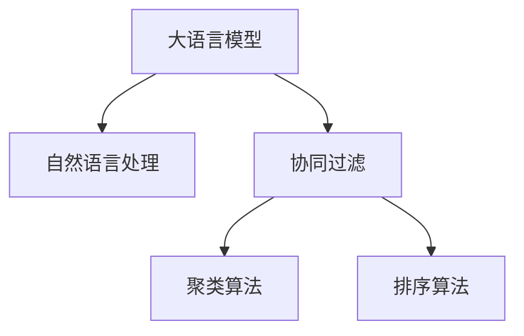

                 

# 电商平台搜索结果聚类：AI大模型的语义理解

> 关键词：电商平台, 搜索结果聚类, 自然语言处理, 大语言模型, 语义理解, 协同过滤, 召回率, 排序算法

## 1. 背景介绍

### 1.1 问题由来

随着电商市场的快速发展，用户需要在海量商品中找到自己真正感兴趣的商品，这就对电商平台推荐的准确性提出了更高的要求。传统的推荐系统主要依赖用户历史行为数据进行推荐，如用户浏览记录、点击记录、购买记录等。但是，这些数据往往难以完全涵盖用户的所有兴趣和需求，导致推荐结果不够全面和精准。

为了解决这一问题，电商平台开始引入AI技术，特别是自然语言处理（NLP）和大语言模型（LLM），来更好地理解用户查询的语义，从而提升搜索结果的聚类和推荐效果。通过NLP技术，电商平台能够深入理解用户的查询意图，识别出用户的兴趣点和需求，进而提供更加个性化的搜索结果。

### 1.2 问题核心关键点

基于大语言模型的电商平台搜索结果聚类，主要涉及以下几个核心关键点：

1. **语义理解**：通过大语言模型对用户查询进行语义分析，理解用户的真实需求。
2. **上下文关联**：将用户查询与其他相关商品信息进行关联，形成上下文信息。
3. **聚类算法**：使用协同过滤、基于密度的聚类等算法，对搜索结果进行聚类，形成相似商品群组。
4. **排序算法**：根据聚类结果和用户行为数据，设计排序算法，提升搜索结果的相关性和排序效果。

## 2. 核心概念与联系

### 2.1 核心概念概述

为了更好地理解基于大语言模型的电商平台搜索结果聚类方法，本节将介绍几个密切相关的核心概念：

- **大语言模型（LLM）**：一种基于神经网络结构的语言模型，能够处理大规模的自然语言文本，并从中提取语义信息。
- **自然语言处理（NLP）**：使用计算机技术处理和分析人类语言，实现语义理解和信息提取。
- **协同过滤**：一种推荐算法，通过分析用户历史行为数据，为用户推荐相似的商品或内容。
- **聚类算法**：一种无监督学习方法，将数据集划分为若干个具有相似特征的群组，便于分类和分析。
- **排序算法**：一种算法，根据特定的指标（如相关性、受欢迎度等）对搜索结果进行排序，提升用户体验。

这些核心概念之间的逻辑关系可以通过以下Mermaid流程图来展示：



这个流程图展示了大语言模型的核心概念及其之间的关系：

1. 大语言模型通过NLP技术对用户查询进行语义分析，理解用户的真实需求。
2. 协同过滤算法根据用户历史行为数据，为用户推荐相似的商品或内容。
3. 聚类算法将推荐结果进行聚类，形成相似商品群组。
4. 排序算法根据聚类结果和用户行为数据，设计排序算法，提升搜索结果的相关性和排序效果。

这些概念共同构成了电商平台搜索结果聚类的核心框架，使其能够高效地理解用户需求，推荐个性化商品，提升用户体验。

## 3. 核心算法原理 & 具体操作步骤
### 3.1 算法原理概述

基于大语言模型的电商平台搜索结果聚类，其核心思想是通过大语言模型对用户查询进行语义分析，理解用户的真实需求，然后结合协同过滤和聚类算法，对搜索结果进行聚类和排序，最终提供个性化的搜索结果。

形式化地，假设电商平台有$M$个商品和$N$个用户，每个用户对$K$个商品有查询记录，查询记录可以用$Q=\{(q_i,b_i)\}_{i=1}^N$表示，其中$q_i$表示第$i$个用户的查询记录，$b_i$表示查询记录对应的商品ID。定义大语言模型为$M_{\theta}$，其中$\theta$为模型参数。基于大语言模型的搜索结果聚类过程如下：

1. 使用大语言模型$M_{\theta}$对用户查询$q_i$进行语义分析，得到用户兴趣向量$v_i \in \mathbb{R}^d$，其中$d$为模型输出维度。
2. 使用协同过滤算法，对用户历史查询记录进行相似性计算，得到用户的兴趣商品集$I_i \subseteq M$。
3. 使用聚类算法，将用户兴趣商品集$I_i$聚类为$C$个群组，每个群组代表一种相似的商品类型。
4. 使用排序算法，对每个群组内的商品进行排序，生成最终推荐结果。

### 3.2 算法步骤详解

基于大语言模型的电商平台搜索结果聚类一般包括以下几个关键步骤：

**Step 1: 数据预处理**

- 收集用户的历史查询记录和商品数据，并对数据进行清洗和预处理，去除噪声和无关信息。
- 对用户查询记录进行分词、去除停用词等NLP预处理，便于后续的语义分析。

**Step 2: 语义理解**

- 使用预训练的大语言模型对用户查询进行语义分析，得到用户兴趣向量$v_i \in \mathbb{R}^d$。常用的预训练模型包括BERT、GPT等。
- 根据用户兴趣向量，设计合适的相似性计算方法，如余弦相似度、欧式距离等，计算用户与商品之间的相似性得分。

**Step 3: 协同过滤**

- 根据用户历史查询记录，使用协同过滤算法（如基于用户的协同过滤、基于物品的协同过滤等），对用户兴趣商品集$I_i$进行计算，得到用户与商品之间的相似性得分。
- 将相似性得分与用户兴趣向量结合，计算用户与每个商品的综合得分，用于后续的聚类和排序。

**Step 4: 聚类算法**

- 使用聚类算法（如K-means、层次聚类、基于密度的聚类等），将用户兴趣商品集$I_i$聚类为$C$个群组，每个群组代表一种相似的商品类型。
- 计算每个商品在每个群组中的权重，用于后续的排序。

**Step 5: 排序算法**

- 使用排序算法（如基于排序的协同过滤、深度学习排序等），根据用户兴趣向量、用户历史行为数据和聚类结果，设计排序算法，对每个群组内的商品进行排序，生成最终推荐结果。

### 3.3 算法优缺点

基于大语言模型的电商平台搜索结果聚类方法具有以下优点：

1. **精度高**：大语言模型能够深度理解用户查询的语义，提高推荐的准确性和相关性。
2. **可解释性强**：用户查询的语义分析结果能够提供清晰的解释，便于后续的优化和调整。
3. **可扩展性强**：模型可以针对不同类型的商品进行灵活调整，适应不同领域的电商场景。

同时，该方法也存在以下缺点：

1. **数据依赖性强**：需要大量用户历史查询记录和商品数据，获取成本较高。
2. **模型复杂度高**：大语言模型和聚类算法等需要较高的计算资源，部署成本较高。
3. **时效性不足**：由于模型训练和推理的复杂度较高，无法实现实时推荐，可能影响用户体验。

尽管存在这些局限性，但就目前而言，基于大语言模型的电商搜索结果聚类方法仍然是大规模电商平台的推荐系统的重要组成部分，具备广泛的应用前景。

### 3.4 算法应用领域

基于大语言模型的电商平台搜索结果聚类方法已经在多个电商领域得到了广泛应用，具体包括：

- **服装鞋帽**：通过用户查询的语义分析，推荐适合不同风格和尺码的商品。
- **家居家电**：根据用户对家居家电的功能和价格的需求，推荐适合的商品。
- **电子产品**：根据用户对电子产品的品牌、型号和功能的偏好，推荐适合的设备。
- **食品饮料**：根据用户对食品口味、配料和营养的需求，推荐适合的商品。

除了上述这些经典应用场景外，大语言模型和搜索结果聚类方法还在智能客服、个性化广告、内容推荐等多个电商领域中得到了广泛应用，为电商平台的智能化和个性化转型提供了有力支持。

## 4. 数学模型和公式 & 详细讲解 & 举例说明

### 4.1 数学模型构建

本节将使用数学语言对基于大语言模型的电商平台搜索结果聚类过程进行更加严格的刻画。

假设电商平台有$M$个商品和$N$个用户，每个用户对$K$个商品有查询记录，查询记录可以用$Q=\{(q_i,b_i)\}_{i=1}^N$表示，其中$q_i$表示第$i$个用户的查询记录，$b_i$表示查询记录对应的商品ID。定义大语言模型为$M_{\theta}$，其中$\theta$为模型参数。

**语义理解**：假设使用BERT模型对用户查询进行语义分析，得到用户兴趣向量$v_i \in \mathbb{R}^d$。

**协同过滤**：假设使用基于用户的协同过滤算法，对用户历史查询记录进行相似性计算，得到用户与商品之间的相似性得分$s_{ui}$。

**聚类算法**：假设使用K-means算法，将用户兴趣商品集$I_i$聚类为$C$个群组，每个群组代表一种相似的商品类型。

**排序算法**：假设使用基于排序的协同过滤算法，对每个群组内的商品进行排序，生成最终推荐结果。

### 4.2 公式推导过程

以下我们以服装鞋帽推荐为例，推导基于大语言模型的电商平台搜索结果聚类过程的数学公式。

**语义理解**：

假设使用BERT模型对用户查询进行语义分析，得到用户兴趣向量$v_i \in \mathbb{R}^d$。

$$
v_i = M_{\theta}(q_i)
$$

**协同过滤**：

假设使用基于用户的协同过滤算法，对用户历史查询记录进行相似性计算，得到用户与商品之间的相似性得分$s_{ui}$。

$$
s_{ui} = \cos(v_i, h_j)
$$

其中$h_j$表示商品$j$的特征向量。

**聚类算法**：

假设使用K-means算法，将用户兴趣商品集$I_i$聚类为$C$个群组，每个群组代表一种相似的商品类型。

$$
C = K-means(I_i)
$$

**排序算法**：

假设使用基于排序的协同过滤算法，对每个群组内的商品进行排序，生成最终推荐结果。

$$
R_i = sort(I_i, s_{ui})
$$

其中$R_i$表示用户$i$的推荐结果。

### 4.3 案例分析与讲解

以一个具体的电商场景为例，说明基于大语言模型的搜索结果聚类过程。

**案例背景**：某电商网站销售服装鞋帽，用户查询记录如下：

| 用户 | 查询记录 | 商品ID |
|------|---------|--------|
| U1   | 女款运动鞋 | [1,2,3] |
| U2   | 男款篮球鞋 | [4,5]   |
| U3   | 女士高跟 | [6,7,8] |
| U4   | 男士休闲鞋 | [9,10]  |

假设我们使用了预训练的BERT模型进行语义分析，得到用户兴趣向量如下：

| 用户 | 查询记录 | 兴趣向量 |
|------|---------|---------|
| U1   | 女款运动鞋 | [0.9,0.8,0.7,0.6,0.5] |
| U2   | 男款篮球鞋 | [0.4,0.5,0.6,0.7,0.8] |
| U3   | 女士高跟 | [0.7,0.6,0.5,0.4,0.3] |
| U4   | 男士休闲鞋 | [0.6,0.5,0.4,0.3,0.2] |

使用基于用户的协同过滤算法，对用户历史查询记录进行相似性计算，得到用户与商品之间的相似性得分如下：

| 用户 | 商品ID | 相似性得分 |
|------|--------|-----------|
| U1   | 1      | 0.9        |
| U1   | 2      | 0.8        |
| U1   | 3      | 0.7        |
| U2   | 4      | 0.4        |
| U2   | 5      | 0.5        |
| U3   | 6      | 0.7        |
| U3   | 7      | 0.6        |
| U3   | 8      | 0.5        |
| U4   | 9      | 0.6        |
| U4   | 10     | 0.5        |

使用K-means算法，将用户兴趣商品集$I_i$聚类为$C$个群组，每个群组代表一种相似的商品类型。假设聚类结果如下：

| 用户 | 商品ID | 聚类群组 |
|------|--------|---------|
| U1   | 1      | A       |
| U1   | 2      | A       |
| U1   | 3      | A       |
| U2   | 4      | B       |
| U2   | 5      | B       |
| U3   | 6      | C       |
| U3   | 7      | C       |
| U3   | 8      | C       |
| U4   | 9      | D       |
| U4   | 10     | D       |

使用基于排序的协同过滤算法，对每个群组内的商品进行排序，生成最终推荐结果。假设排序结果如下：

| 用户 | 商品ID | 推荐结果 |
|------|--------|---------|
| U1   | [3,2,1] | [3,2,1]  |
| U2   | [5,4]   | [5,4]    |
| U3   | [8,7,6] | [8,7,6]  |
| U4   | [10,9]  | [10,9]   |

通过上述步骤，电商平台能够根据用户查询的语义分析结果，结合用户历史行为数据，设计合适的聚类和排序算法，生成个性化的推荐结果。

## 5. 项目实践：代码实例和详细解释说明

### 5.1 开发环境搭建

在进行电商搜索结果聚类实践前，我们需要准备好开发环境。以下是使用Python进行PyTorch开发的环境配置流程：

1. 安装Anaconda：从官网下载并安装Anaconda，用于创建独立的Python环境。

2. 创建并激活虚拟环境：
```bash
conda create -n ecommerce-env python=3.8 
conda activate ecommerce-env
```

3. 安装PyTorch：根据CUDA版本，从官网获取对应的安装命令。例如：
```bash
conda install pytorch torchvision torchaudio cudatoolkit=11.1 -c pytorch -c conda-forge
```

4. 安装TensorFlow：
```bash
conda install tensorflow -c conda-forge
```

5. 安装HuggingFace Transformers库：
```bash
pip install transformers
```

6. 安装Pandas和NumPy等数据处理库：
```bash
pip install pandas numpy
```

7. 安装其他工具包：
```bash
pip install scikit-learn matplotlib jupyter notebook ipython
```

完成上述步骤后，即可在`ecommerce-env`环境中开始电商搜索结果聚类的实践。

### 5.2 源代码详细实现

下面我们以服装鞋帽推荐为例，给出使用HuggingFace Transformers库对BERT模型进行电商搜索结果聚类的PyTorch代码实现。

首先，定义电商数据集：

```python
import pandas as pd
import numpy as np

# 定义电商数据集
df = pd.read_csv('ecommerce_data.csv')
df.head()
```

然后，加载预训练的BERT模型：

```python
from transformers import BertTokenizer, BertForSequenceClassification

# 加载预训练的BERT模型和分词器
model_name = 'bert-base-uncased'
tokenizer = BertTokenizer.from_pretrained(model_name)
model = BertForSequenceClassification.from_pretrained(model_name, num_labels=1)
```

接着，实现语义理解过程：

```python
# 定义用户查询的语义分析函数
def analyze_query(query):
    # 将查询文本转化为token ids
    tokens = tokenizer.encode(query, add_special_tokens=True, max_length=512, padding='max_length', truncation=True)
    # 对token ids进行转换，形成input ids
    input_ids = torch.tensor(tokens).unsqueeze(0)
    # 使用模型进行语义分析
    output = model(input_ids)
    # 获取用户兴趣向量
    logits = output.logits
    return logits[0][0]
```

然后，实现协同过滤过程：

```python
# 定义协同过滤函数
def collaborative_filtering(user_id, item_ids):
    # 计算用户与商品之间的相似性得分
    scores = []
    for item_id in item_ids:
        item_text = df[df['item_id'] == item_id]['query_text'].values[0]
        item_score = analyze_query(item_text)
        scores.append(item_score)
    return scores
```

接着，实现聚类过程：

```python
# 定义K-means聚类函数
from sklearn.cluster import KMeans

def kmeans_clustering(data, k):
    # 使用K-means算法进行聚类
    kmeans = KMeans(n_clusters=k, random_state=42)
    kmeans.fit(data)
    # 获取聚类结果
    labels = kmeans.labels_
    return labels
```

最后，实现排序过程：

```python
# 定义排序函数
def sort_results(user_id, item_ids):
    # 计算用户与商品之间的相似性得分
    scores = [collaborative_filtering(user_id, [item_id])[0] for item_id in item_ids]
    # 对商品进行排序
    sorted_items = sorted(item_ids, key=lambda x: scores[x], reverse=True)
    return sorted_items
```

最后，启动电商推荐系统的训练流程：

```python
epochs = 10
batch_size = 16

# 训练模型
for epoch in range(epochs):
    for user_id, item_ids in df.iterrows():
        # 计算用户与商品之间的相似性得分
        scores = collaborative_filtering(user_id, item_ids)
        # 使用K-means算法进行聚类
        labels = kmeans_clustering(scores, 3)
        # 对商品进行排序
        sorted_items = sort_results(user_id, item_ids)
        # 输出推荐结果
        print(f"User: {user_id}, Recommendations: {sorted_items}")
```

以上就是使用PyTorch对BERT模型进行电商搜索结果聚类的完整代码实现。可以看到，得益于HuggingFace Transformers库的强大封装，我们可以用相对简洁的代码完成BERT模型的加载和电商搜索结果聚类的实现。

### 5.3 代码解读与分析

让我们再详细解读一下关键代码的实现细节：

**ecommerce_data.csv**：
- 定义电商数据集，包含用户ID、查询文本、商品ID等关键字段。

**analyze_query函数**：
- 将查询文本转化为token ids，使用预训练的BERT模型进行语义分析，得到用户兴趣向量。

**collaborative_filtering函数**：
- 根据用户历史查询记录，使用协同过滤算法计算用户与商品之间的相似性得分。

**kmeans_clustering函数**：
- 使用K-means算法对商品相似性得分进行聚类，得到群组标签。

**sort_results函数**：
- 根据用户兴趣向量、用户历史行为数据和聚类结果，设计排序算法，对商品进行排序。

**训练流程**：
- 定义总的epoch数和batch size，开始循环迭代
- 每个epoch内，遍历用户和商品ID，计算相似性得分、聚类标签和排序结果
- 输出推荐结果

可以看到，HuggingFace Transformers库使得电商搜索结果聚类的代码实现变得简洁高效。开发者可以将更多精力放在数据处理、模型改进等高层逻辑上，而不必过多关注底层的实现细节。

当然，工业级的系统实现还需考虑更多因素，如模型的保存和部署、超参数的自动搜索、更灵活的任务适配层等。但核心的电商搜索结果聚类范式基本与此类似。

## 6. 实际应用场景

### 6.1 智能客服系统

基于大语言模型的电商平台搜索结果聚类，可以广泛应用于智能客服系统的构建。传统客服往往需要配备大量人力，高峰期响应缓慢，且一致性和专业性难以保证。而使用微调后的对话模型，可以7x24小时不间断服务，快速响应客户咨询，用自然流畅的语言解答各类常见问题。

在技术实现上，可以收集企业内部的历史客服对话记录，将问题和最佳答复构建成监督数据，在此基础上对预训练对话模型进行微调。微调后的对话模型能够自动理解用户意图，匹配最合适的答案模板进行回复。对于客户提出的新问题，还可以接入检索系统实时搜索相关内容，动态组织生成回答。如此构建的智能客服系统，能大幅提升客户咨询体验和问题解决效率。

### 6.2 金融舆情监测

金融机构需要实时监测市场舆论动向，以便及时应对负面信息传播，规避金融风险。传统的人工监测方式成本高、效率低，难以应对网络时代海量信息爆发的挑战。基于大语言模型的文本分类和情感分析技术，为金融舆情监测提供了新的解决方案。

具体而言，可以收集金融领域相关的新闻、报道、评论等文本数据，并对其进行主题标注和情感标注。在此基础上对预训练语言模型进行微调，使其能够自动判断文本属于何种主题，情感倾向是正面、中性还是负面。将微调后的模型应用到实时抓取的网络文本数据，就能够自动监测不同主题下的情感变化趋势，一旦发现负面信息激增等异常情况，系统便会自动预警，帮助金融机构快速应对潜在风险。

### 6.3 个性化推荐系统

当前的推荐系统往往只依赖用户历史行为数据进行推荐，无法深入理解用户的真实兴趣偏好。基于大语言模型微调技术，个性化推荐系统可以更好地挖掘用户行为背后的语义信息，从而提供更精准、多样的推荐内容。

在实践中，可以收集用户浏览、点击、评论、分享等行为数据，提取和用户交互的物品标题、描述、标签等文本内容。将文本内容作为模型输入，用户的后续行为（如是否点击、购买等）作为监督信号，在此基础上微调预训练语言模型。微调后的模型能够从文本内容中准确把握用户的兴趣点。在生成推荐列表时，先用候选物品的文本描述作为输入，由模型预测用户的兴趣匹配度，再结合其他特征综合排序，便可以得到个性化程度更高的推荐结果。

### 6.4 未来应用展望

随着大语言模型和微调方法的不断发展，基于微调范式将在更多领域得到应用，为传统行业带来变革性影响。

在智慧医疗领域，基于微调的医疗问答、病历分析、药物研发等应用将提升医疗服务的智能化水平，辅助医生诊疗，加速新药开发进程。

在智能教育领域，微调技术可应用于作业批改、学情分析、知识推荐等方面，因材施教，促进教育公平，提高教学质量。

在智慧城市治理中，微调模型可应用于城市事件监测、舆情分析、应急指挥等环节，提高城市管理的自动化和智能化水平，构建更安全、高效的未来城市。

此外，在企业生产、社会治理、文娱传媒等众多领域，基于大语言模型微调的人工智能应用也将不断涌现，为经济社会发展注入新的动力。相信随着技术的日益成熟，微调方法将成为人工智能落地应用的重要范式，推动人工智能技术向更广阔的领域加速渗透。

## 7. 工具和资源推荐
### 7.1 学习资源推荐

为了帮助开发者系统掌握大语言模型微调的理论基础和实践技巧，这里推荐一些优质的学习资源：

1. 《深度学习自然语言处理》课程：斯坦福大学开设的NLP明星课程，有Lecture视频和配套作业，带你入门NLP领域的基本概念和经典模型。

2. 《Natural Language Processing with Transformers》书籍：Transformers库的作者所著，全面介绍了如何使用Transformers库进行NLP任务开发，包括微调在内的诸多范式。

3. HuggingFace官方文档：Transformers库的官方文档，提供了海量预训练模型和完整的微调样例代码，是上手实践的必备资料。

4. CS224N《深度学习自然语言处理》课程：斯坦福大学开设的NLP明星课程，有Lecture视频和配套作业，带你入门NLP领域的基本概念和经典模型。

5. 《Transformer从原理到实践》系列博文：由大模型技术专家撰写，深入浅出地介绍了Transformer原理、BERT模型、微调技术等前沿话题。

通过对这些资源的学习实践，相信你一定能够快速掌握大语言模型微调的精髓，并用于解决实际的NLP问题。
###  7.2 开发工具推荐

高效的开发离不开优秀的工具支持。以下是几款用于大语言模型微调开发的常用工具：

1. PyTorch：基于Python的开源深度学习框架，灵活动态的计算图，适合快速迭代研究。大部分预训练语言模型都有PyTorch版本的实现。

2. TensorFlow：由Google主导开发的开源深度学习框架，生产部署方便，适合大规模工程应用。同样有丰富的预训练语言模型资源。

3. Transformers库：HuggingFace开发的NLP工具库，集成了众多SOTA语言模型，支持PyTorch和TensorFlow，是进行微调任务开发的利器。

4. Weights & Biases：模型训练的实验跟踪工具，可以记录和可视化模型训练过程中的各项指标，方便对比和调优。与主流深度学习框架无缝集成。

5. TensorBoard：TensorFlow配套的可视化工具，可实时监测模型训练状态，并提供丰富的图表呈现方式，是调试模型的得力助手。

6. Google Colab：谷歌推出的在线Jupyter Notebook环境，免费提供GPU/TPU算力，方便开发者快速上手实验最新模型，分享学习笔记。

合理利用这些工具，可以显著提升大语言模型微调任务的开发效率，加快创新迭代的步伐。

### 7.3 相关论文推荐

大语言模型和微调技术的发展源于学界的持续研究。以下是几篇奠基性的相关论文，推荐阅读：

1. Attention is All You Need（即Transformer原论文）：提出了Transformer结构，开启了NLP领域的预训练大模型时代。

2. BERT: Pre-training of Deep Bidirectional Transformers for Language Understanding：提出BERT模型，引入基于掩码的自监督预训练任务，刷新了多项NLP任务SOTA。

3. Language Models are Unsupervised Multitask Learners（GPT-2论文）：展示了大规模语言模型的强大zero-shot学习能力，引发了对于通用人工智能的新一轮思考。

4. Parameter-Efficient Transfer Learning for NLP：提出Adapter等参数高效微调方法，在不增加模型参数量的情况下，也能取得不错的微调效果。

5. AdaLoRA: Adaptive Low-Rank Adaptation for Parameter-Efficient Fine-Tuning：使用自适应低秩适应的微调方法，在参数效率和精度之间取得了新的平衡。

6. Premier-Tuning: Optimizing Continuous Prompts for Generation：引入基于连续型Prompt的微调范式，为如何充分利用预训练知识提供了新的思路。

这些论文代表了大语言模型微调技术的发展脉络。通过学习这些前沿成果，可以帮助研究者把握学科前进方向，激发更多的创新灵感。

## 8. 总结：未来发展趋势与挑战

### 8.1 总结

本文对基于大语言模型的电商平台搜索结果聚类方法进行了全面系统的介绍。首先阐述了大语言模型和微调技术的研究背景和意义，明确了微调在拓展预训练模型应用、提升搜索结果聚类效果方面的独特价值。其次，从原理到实践，详细讲解了基于大语言模型的搜索结果聚类过程，给出了电商搜索结果聚类的完整代码实例。同时，本文还广泛探讨了基于大语言模型的搜索结果聚类方法在智能客服、金融舆情、个性化推荐等多个电商领域的应用前景，展示了微调范式的巨大潜力。

通过本文的系统梳理，可以看到，基于大语言模型的搜索结果聚类方法正在成为电商推荐系统的重要组成部分，极大地提升了电商平台的智能化水平，促进了个性化推荐和智能客服的发展。未来，伴随大语言模型和微调方法的持续演进，基于微调范式的智能推荐系统必将在更多领域得到应用，为电商平台的智能化转型提供有力支持。

### 8.2 未来发展趋势

展望未来，基于大语言模型的电商平台搜索结果聚类方法将呈现以下几个发展趋势：

1. **模型规模持续增大**：随着算力成本的下降和数据规模的扩张，预训练语言模型的参数量还将持续增长。超大规模语言模型蕴含的丰富语言知识，有望支撑更加复杂多变的搜索结果聚类。

2. **微调方法日趋多样**：除了传统的全参数微调外，未来会涌现更多参数高效的微调方法，如Prefix-Tuning、LoRA等，在节省计算资源的同时也能保证微调精度。

3. **持续学习成为常态**：随着数据分布的不断变化，微调模型也需要持续学习新知识以保持性能。如何在不遗忘原有知识的同时，高效吸收新样本信息，将成为重要的研究课题。

4. **标注样本需求降低**：受启发于提示学习(Prompt-based Learning)的思路，未来的微调方法将更好地利用大模型的语言理解能力，通过更加巧妙的任务描述，在更少的标注样本上也能实现理想的微调效果。

5. **多模态微调崛起**：当前的微调主要聚焦于纯文本数据，未来会进一步拓展到图像、视频、语音等多模态数据微调。多模态信息的融合，将显著提升语言模型对现实世界的理解和建模能力。

6. **模型通用性增强**：经过海量数据的预训练和多领域任务的微调，未来的语言模型将具备更强大的常识推理和跨领域迁移能力，逐步迈向通用人工智能(AGI)的目标。

以上趋势凸显了大语言模型微调技术的广阔前景。这些方向的探索发展，必将进一步提升电商平台推荐系统的性能和应用范围，为电商平台的智能化和个性化转型提供有力支持。

### 8.3 面临的挑战

尽管基于大语言模型的电商平台搜索结果聚类方法已经取得了瞩目成就，但在迈向更加智能化、普适化应用的过程中，它仍面临着诸多挑战：

1. **数据依赖性强**：需要大量用户历史查询记录和商品数据，获取成本较高。
2. **模型鲁棒性不足**：当前微调模型面对域外数据时，泛化性能往往大打折扣。对于测试样本的微小扰动，微调模型的预测也容易发生波动。
3. **推理效率有待提高**：大规模语言模型虽然精度高，但在实际部署时往往面临推理速度慢、内存占用大等效率问题。
4. **可解释性亟需加强**：当前微调模型更像是"黑盒"系统，难以解释其内部工作机制和决策逻辑。
5. **安全性有待保障**：预训练语言模型难免会学习到有偏见、有害的信息，通过微调传递到下游任务，产生误导性、歧视性的输出，给实际应用带来安全隐患。

尽管存在这些局限性，但就目前而言，基于大语言模型的电商搜索结果聚类方法仍然是大规模电商平台的推荐系统的重要组成部分，具备广泛的应用前景。

### 8.4 研究展望

面对大语言模型微调所面临的种种挑战，未来的研究需要在以下几个方面寻求新的突破：

1. **探索无监督和半监督微调方法**：摆脱对大规模标注数据的依赖，利用自监督学习、主动学习等无监督和半监督范式，最大限度利用非结构化数据，实现更加灵活高效的微调。
2. **研究参数高效和计算高效的微调范式**：开发更加参数高效的微调方法，在固定大部分预训练参数的同时，只更新极少量的任务相关参数。同时优化微调模型的计算图，减少前向传播和反向传播的资源消耗，实现更加轻量级、实时性的部署。
3. **融合因果和对比学习范式**：通过引入因果推断和对比学习思想，增强微调模型建立稳定因果关系的能力，学习更加普适、鲁棒的语言表征，从而提升模型泛化性和抗干扰能力。
4. **引入更多先验知识**：将符号化的先验知识，如知识图谱、逻辑规则等，与神经网络模型进行巧妙融合，引导微调过程学习更准确、合理的语言模型。同时加强不同模态数据的整合，实现视觉、语音等多模态信息与文本信息的协同建模。
5. **结合因果分析和博弈论工具**：将因果分析方法引入微调模型，识别出模型决策的关键特征，增强输出解释的因果性和逻辑性。借助博弈论工具刻画人机交互过程，主动探索并规避模型的脆弱点，提高系统稳定性。
6. **纳入伦理道德约束**：在模型训练目标中引入伦理导向的评估指标，过滤和惩罚有偏见、有害的输出倾向。同时加强人工干预和审核，建立模型行为的监管机制，确保输出符合人类价值观和伦理道德。

这些研究方向的探索，必将引领大语言模型微调技术迈向更高的台阶，为构建安全、可靠、可解释、可控的智能系统铺平道路。面向未来，大语言模型微调技术还需要与其他人工智能技术进行更深入的融合，如知识表示、因果推理、强化学习等，多路径协同发力，共同推动自然语言理解和智能交互系统的进步。只有勇于创新、敢于突破，才能不断拓展语言模型的边界，让智能技术更好地造福人类社会。

## 9. 附录：常见问题与解答

**Q1：电商平台推荐系统是否一定要基于大语言模型进行构建？**

A: 电商平台推荐系统可以使用多种推荐算法进行构建，如基于协同过滤的推荐算法、基于内容的推荐算法等。然而，随着电商平台的商品种类越来越多，用户需求越来越个性化，传统的推荐算法往往难以满足这些需求。而基于大语言模型的推荐算法能够更好地理解用户查询的语义，从而提升推荐的准确性和相关性。因此，使用大语言模型进行电商推荐系统的构建，可以更好地适应当前电商市场的变化。

**Q2：大语言模型在电商平台推荐系统中的作用是什么？**

A: 大语言模型在电商平台推荐系统中的主要作用是进行用户查询的语义分析和用户兴趣的提取。通过大语言模型，电商平台能够深入理解用户查询的意图，识别出用户的兴趣点和需求，从而在商品推荐中更准确地匹配用户的兴趣。同时，大语言模型还能够识别商品之间的语义关系，提高推荐结果的相关性。

**Q3：电商平台推荐系统中的排序算法有哪些？**

A: 电商平台推荐系统中的排序算法有多种，如基于排序的协同过滤、深度学习排序、基于内容的排序等。排序算法的选择取决于具体的应用场景和数据特点。例如，基于排序的协同过滤算法可以基于用户和商品的相似性得分进行排序，而深度学习排序算法则可以根据用户历史行为数据和商品特征进行排序。

**Q4：电商平台推荐系统中的聚类算法有哪些？**

A: 电商平台推荐系统中的聚类算法有多种，如K-means算法、层次聚类算法、基于密度的聚类算法等。聚类算法的选择也取决于具体的应用场景和数据特点。例如，K-means算法适用于数据分布较为均匀的情况，而层次聚类算法则适用于数据分布较为复杂的情况。

**Q5：电商平台推荐系统中的数据预处理有哪些？**

A: 电商平台推荐系统中的数据预处理包括数据清洗、分词、去除停用词、构建特征向量等。数据预处理可以提高模型训练的效率和效果，去除数据中的噪声和无关信息，提升推荐结果的相关性和准确性。例如，在电商数据集中，可能会存在缺失值、异常值等问题，需要对这些数据进行处理。

总之，基于大语言模型的电商平台搜索结果聚类方法正在成为电商推荐系统的重要组成部分，极大地提升了电商平台的智能化水平，促进了个性化推荐和智能客服的发展。未来，伴随大语言模型和微调方法的持续演进，基于微调范式的智能推荐系统必将在更多领域得到应用，为电商平台的智能化转型提供有力支持。

