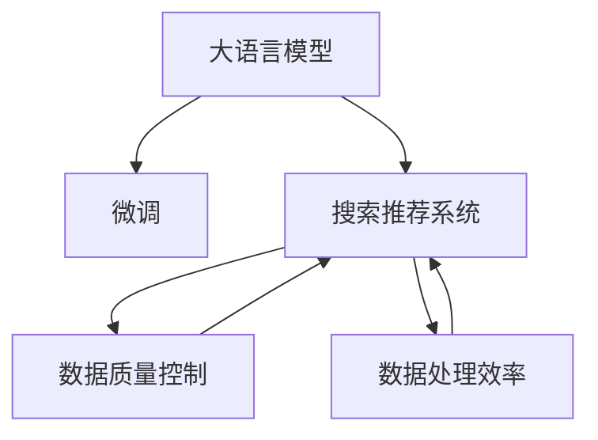

                 

# 电商平台的AI 大模型实践：搜索推荐系统是核心，数据质量控制与处理效率

## 1. 背景介绍

随着电商行业的蓬勃发展，搜索推荐系统（Search and Recommendation System, SRS）作为核心技术，对提升用户体验和平台转化率至关重要。传统推荐系统依赖于专家手工设计和特征工程，且依赖大量标注数据，而大模型在预训练和微调过程中，通过自监督学习任务训练获得了丰富的特征表示，具有更强的泛化能力。因此，AI大模型在电商搜索推荐领域得到了广泛应用，成为电商平台数据驱动决策的重要工具。

本文将围绕AI大模型在电商平台的搜索推荐系统中的应用，详细探讨数据质量控制与处理效率的重要性，并通过实际案例分享大模型在电商平台的落地实践经验。希望通过本文，能够帮助电商从业者更好地理解AI大模型的工作原理，以及如何高效利用其强大的学习能力，优化搜索推荐系统性能。

## 2. 核心概念与联系

### 2.1 核心概念概述

- **大语言模型(Large Language Model, LLM)**：如BERT、GPT系列等，通过大规模无标签文本数据预训练得到，具备强大的语言理解和生成能力。
- **微调(Fine-tuning)**：在大模型基础上，通过小规模标注数据进行有监督学习，优化模型在特定任务上的性能。
- **搜索推荐系统(Search and Recommendation System, SRS)**：通过分析用户行为数据，推荐符合用户兴趣的商品或服务。
- **数据质量控制(Data Quality Control, DQC)**：保证数据集的真实性、准确性、完整性，避免因数据质量问题导致的系统性能下降。
- **数据处理效率(Data Processing Efficiency, DPE)**：通过高效的算法和工具，降低数据处理的时间复杂度，加速模型训练和推理。

以上核心概念通过以下Mermaid流程图关联起来，展示了它们之间的联系和影响：



## 3. 核心算法原理 & 具体操作步骤

### 3.1 算法原理概述

基于大模型的搜索推荐系统主要由两个核心步骤组成：
1. 数据预处理：清洗和标准化用户行为数据，提取相关特征。
2. 模型微调：在大模型基础上，通过微调算法更新模型参数，适应电商平台特定任务。

其中，数据预处理是大模型能否充分发挥作用的前提。只有高质量的数据，才能通过微调得到高性能的推荐模型。同时，数据处理效率直接决定了模型训练和推理的速度。本文将详细介绍这两个步骤的算法原理和操作步骤。

### 3.2 算法步骤详解

#### 3.2.1 数据预处理

**步骤1：数据清洗与标注**
- 数据清洗：去除无效数据、修复数据格式错误。
- 数据标注：标注用户点击、浏览、购买等行为，转化为数值特征。

**步骤2：特征提取与转换**
- 特征提取：提取用户行为、商品属性、上下文信息等特征。
- 特征转换：将离散特征进行编码，连续特征进行归一化，生成高维特征向量。

**步骤3：数据划分与分布**
- 数据划分：将数据集划分为训练集、验证集和测试集，按比例分配。
- 数据分布：确保训练集、验证集和测试集的分布一致，避免过拟合。

#### 3.2.2 模型微调

**步骤1：选择合适的预训练模型**
- 选择通用的预训练模型，如BERT、GPT等，作为初始化参数。

**步骤2：添加任务适配层**
- 根据任务类型，添加输出层和损失函数。
- 对于点击率预测任务，添加二分类输出层和交叉熵损失函数。
- 对于排序任务，添加回归输出层和均方误差损失函数。

**步骤3：设置微调超参数**
- 选择合适的优化算法及其参数，如AdamW、SGD等，设置学习率、批大小、迭代轮数等。
- 设置正则化技术及强度，包括权重衰减、Dropout、Early Stopping等。

**步骤4：执行梯度训练**
- 将训练集数据分批次输入模型，前向传播计算损失函数。
- 反向传播计算参数梯度，根据设定的优化算法和学习率更新模型参数。
- 周期性在验证集上评估模型性能，根据性能指标决定是否触发 Early Stopping。
- 重复上述步骤直到满足预设的迭代轮数或 Early Stopping 条件。

### 3.3 算法优缺点

**优点**：
- 泛化能力强：大模型通过预训练获取丰富的特征表示，具备更强的泛化能力。
- 适应性强：微调过程简单高效，可以快速适应电商平台的特定任务。
- 自动化程度高：通过自动学习用户兴趣和行为，降低人工干预的复杂度。

**缺点**：
- 对标注数据依赖高：微调过程需要标注数据，标注成本较高。
- 计算资源消耗大：大模型参数量巨大，需要高性能计算资源。
- 模型难以解释：大模型输出复杂，难以解释其推理过程。

### 3.4 算法应用领域

大语言模型在电商平台的搜索推荐系统中的应用，主要体现在以下几个方面：
- **商品推荐**：根据用户行为数据，预测用户感兴趣的商品，提升转化率。
- **广告投放**：通过分析用户点击行为，精准投放广告，提高广告ROI。
- **价格优化**：预测商品价格调整对销售的影响，进行动态定价。
- **用户画像**：基于用户行为数据，生成用户画像，提供个性化服务。

以上应用场景体现了大语言模型在电商平台搜索推荐系统中的强大潜力，为电商平台带来了显著的商业价值。

## 4. 数学模型和公式 & 详细讲解 & 举例说明

### 4.1 数学模型构建

基于大模型的搜索推荐系统可以抽象为如下框架：
- 输入：用户行为数据 $D$，商品特征 $X$。
- 输出：用户对商品的评分 $y$ 或点击概率 $p$。

假设预训练模型为 $M_{\theta}$，其输入为 $x \in \mathcal{X}$，输出为 $y \in \mathcal{Y}$。模型的损失函数为 $\mathcal{L}(y,\hat{y})$，其中 $\hat{y}=M_{\theta}(x)$ 为模型预测结果。

### 4.2 公式推导过程

以点击率预测任务为例，假设模型采用二分类输出，则目标函数为交叉熵损失函数：
$$
\mathcal{L}(y,\hat{y}) = -(y\log \hat{y} + (1-y)\log(1-\hat{y}))
$$

对于每个样本 $(x,y)$，其损失函数为：
$$
\ell(x,y) = -[y\log \hat{y} + (1-y)\log(1-\hat{y})]
$$

将训练集 $D=\{(x_i,y_i)\}_{i=1}^N$ 代入上述损失函数，得：
$$
\mathcal{L}(\theta) = \frac{1}{N} \sum_{i=1}^N \ell(x_i,y_i)
$$

通过反向传播算法，计算损失函数对参数 $\theta$ 的梯度，并更新模型参数。

### 4.3 案例分析与讲解

假设电商平台有100万用户，每个用户的历史行为数据包含1000个点击事件。使用BERT预训练模型，对点击率预测任务进行微调。假设用户行为数据和商品属性数据都已经预处理完毕，特征维度为200，训练集、验证集和测试集的样本量分别为80万、10万和10万。

**微调步骤**：
1. 选择BERT作为初始模型，添加二分类输出层和交叉熵损失函数。
2. 设置学习率为1e-4，批大小为256，迭代轮数为5轮。
3. 采用AdamW优化器，设置权重衰减为0.01，Dropout率为0.5，Early Stopping阈值为0.95。
4. 在训练集上执行梯度训练，每轮在验证集上评估模型性能，如AUC、ROC等指标。
5. 选择性能最佳的模型在测试集上进行最终评估，记录指标如AUC、F1-score等。

## 5. 项目实践：代码实例和详细解释说明

### 5.1 开发环境搭建

**环境依赖**：
- Python 3.8
- PyTorch 1.7.1
- Transformers 4.5.1
- Scikit-learn 0.24.1
- Pandas 1.0.5

**环境配置**：
1. 创建虚拟环境，安装依赖包：
```bash
python -m venv env
source env/bin/activate
pip install torch transformers scikit-learn pandas
```

2. 安装必要的库：
```bash
pip install tqdm matplotlib
```

### 5.2 源代码详细实现

**代码实现**：
```python
import torch
from torch.utils.data import DataLoader
from transformers import BertForSequenceClassification, AdamW
from sklearn.metrics import roc_auc_score

class ClickRatesDataset(torch.utils.data.Dataset):
    def __init__(self, data, tokenizer):
        self.data = data
        self.tokenizer = tokenizer
    
    def __getitem__(self, idx):
        inputs = self.tokenizer(self.data[idx], padding='max_length', truncation=True, max_length=256)
        return {
            'input_ids': inputs['input_ids'].to(torch.long),
            'attention_mask': inputs['attention_mask'].to(torch.long),
            'labels': torch.tensor([self.data[idx][2]], dtype=torch.long)
        }
    
    def __len__(self):
        return len(self.data)

# 数据预处理
# ...

# 微调模型
model = BertForSequenceClassification.from_pretrained('bert-base-cased', num_labels=2)
tokenizer = BertTokenizer.from_pretrained('bert-base-cased')
dataset = ClickRatesDataset(train_data, tokenizer)
dataloader = DataLoader(dataset, batch_size=256, shuffle=True)

optimizer = AdamW(model.parameters(), lr=1e-4, weight_decay=0.01)
scheduler = get_linear_schedule_with_warmup(optimizer, num_warmup_steps=0, num_training_steps=len(dataloader))

device = torch.device('cuda' if torch.cuda.is_available() else 'cpu')
model.to(device)

for epoch in range(5):
    model.train()
    for batch in dataloader:
        inputs = {key: val.to(device) for key, val in batch.items()}
        outputs = model(**inputs)
        loss = outputs.loss
        optimizer.zero_grad()
        loss.backward()
        optimizer.step()
        scheduler.step()
    
    model.eval()
    with torch.no_grad():
        eval_preds = []
        eval_labels = []
        for batch in dataloader:
            inputs = {key: val.to(device) for key, val in batch.items()}
            outputs = model(**inputs)
            logits = outputs.logits
            eval_preds.append(logits.cpu().tolist())
            eval_labels.append(batch['labels'].cpu().tolist())
        
        eval_preds = torch.tensor(eval_preds)
        eval_labels = torch.tensor(eval_labels)
        roc_auc = roc_auc_score(eval_labels, eval_preds, average='macro')
        print(f'Epoch {epoch+1}, ROC-AUC: {roc_auc:.4f}')
```

### 5.3 代码解读与分析

**代码解释**：
1. `ClickRatesDataset`：自定义数据集类，继承自PyTorch的Dataset。该类用于将用户行为数据和商品属性数据转换为模型可以处理的格式。
2. `BertForSequenceClassification`：使用预训练的BERT模型，添加二分类输出层。
3. `AdamW`：优化器，设置学习率和权重衰减。
4. `roc_auc_score`：用于评估点击率预测任务的表现。

**分析**：
- 数据预处理：清洗和标注用户行为数据，转换为模型输入格式。
- 模型微调：选择BERT作为初始模型，添加输出层和损失函数。
- 超参数设置：学习率、批大小、迭代轮数、正则化技术等。
- 训练和评估：使用交叉熵损失函数进行模型训练，评估AUC等指标。

## 6. 实际应用场景

### 6.1 智能广告推荐

智能广告推荐系统通过分析用户行为数据，精准推荐相关广告，提高广告投放效率和ROI。使用大语言模型微调算法，可以根据用户历史行为、兴趣偏好等特征，预测用户对不同广告的点击概率，进行精准投放。

**实现步骤**：
1. 收集用户点击、浏览等行为数据。
2. 标注广告标签，将点击事件标记为1，未点击标记为0。
3. 将行为数据和广告属性数据进行特征提取和转换。
4. 在大模型基础上，添加二分类输出层和交叉熵损失函数。
5. 使用微调算法训练模型，评估广告点击率。

### 6.2 个性化商品推荐

个性化商品推荐系统根据用户历史购买、浏览数据，推荐符合用户兴趣的商品。使用大模型微调算法，可以分析用户行为数据，提取特征，预测用户对商品的兴趣，进行个性化推荐。

**实现步骤**：
1. 收集用户浏览、购买、评分等行为数据。
2. 标注商品标签，将用户对商品的评分标记为1，未评分标记为0。
3. 将行为数据和商品属性数据进行特征提取和转换。
4. 在大模型基础上，添加二分类输出层和交叉熵损失函数。
5. 使用微调算法训练模型，评估推荐系统表现。

### 6.3 动态价格优化

动态价格优化系统通过预测商品价格调整对销售的影响，进行动态定价。使用大模型微调算法，可以分析用户行为数据，预测不同价格下的销售量，进行价格优化。

**实现步骤**：
1. 收集用户历史行为数据和商品价格数据。
2. 标注价格标签，将价格标签标记为1，未标记标记为0。
3. 将行为数据和价格数据进行特征提取和转换。
4. 在大模型基础上，添加回归输出层和均方误差损失函数。
5. 使用微调算法训练模型，评估价格优化效果。

## 7. 工具和资源推荐

### 7.1 学习资源推荐

- **《深度学习》**（Ian Goodfellow）：深度学习基础教材，涵盖各种深度学习算法和应用。
- **《自然语言处理综述》**（Michael Collins）：自然语言处理综述教材，详细介绍NLP相关知识。
- **《Transformers》**（Jacob Devlin et al.）：Transformers库文档，提供详细的模型和应用教程。

### 7.2 开发工具推荐

- **PyTorch**：深度学习框架，支持动态计算图，灵活性高。
- **TensorFlow**：深度学习框架，生产部署方便。
- **Transformers**：NLP工具库，包含预训练模型和微调算法。

### 7.3 相关论文推荐

- **《Pre-Trained Language Models and Generation》**（Jacob Devlin et al.）：Transformer和大模型的原理和应用。
- **《Fine-Tuning BERT for Sequence Classification: A Comparative Study》**（Yang et al.）：大模型微调的实验和效果分析。
- **《Evaluating A Neural Network Search System》**（Mitchell et al.）：电商搜索系统的研究和应用。

## 8. 总结：未来发展趋势与挑战

### 8.1 研究成果总结

大语言模型在电商平台的搜索推荐系统中，通过微调算法，展示了强大的泛化能力和高效的特征学习能力。其在智能广告推荐、个性化商品推荐和动态价格优化等方面的应用，显著提升了电商平台的用户体验和商业价值。

### 8.2 未来发展趋势

未来，大语言模型在电商平台中的应用将更加广泛和深入。基于大模型的搜索推荐系统将继续演进，提升用户体验和平台转化率。以下是未来可能的发展趋势：

- **模型规模扩大**：随着算力提升和数据规模扩大，预训练模型和微调模型的规模将继续扩大，具备更强的泛化能力和适应性。
- **计算效率提升**：通过模型压缩、混合精度训练、模型并行等技术，提升模型训练和推理的速度。
- **多模态融合**：将视觉、音频等多模态数据与文本数据融合，提升模型的综合分析能力。
- **主动学习**：利用主动学习算法，提升数据标注的效率和质量。
- **因果推理**：引入因果推理方法，提高模型的推理能力和可解释性。

### 8.3 面临的挑战

尽管大语言模型在电商平台的搜索推荐系统中取得了显著效果，但仍面临以下挑战：

- **数据质量控制**：电商平台的原始数据往往存在噪声和不一致性，需要进行严格的数据清洗和标注。
- **模型可解释性**：大模型的输出复杂，难以解释其推理过程，影响系统可解释性和可靠性。
- **计算资源消耗**：大模型的参数量巨大，需要高性能计算资源。
- **对抗攻击**：电商平台的商品推荐和广告投放可能面临对抗攻击，需要加强模型鲁棒性。
- **隐私保护**：电商平台的用户数据隐私保护问题亟需解决，需要设计安全的数据处理机制。

### 8.4 研究展望

未来，大语言模型在电商平台的搜索推荐系统中的研究将从以下几个方向展开：

- **隐私保护**：设计安全的数据处理机制，保障用户隐私。
- **对抗攻击防御**：引入对抗训练、鲁棒性优化等技术，提升模型的鲁棒性。
- **可解释性增强**：引入可解释性方法，提升模型的可解释性和可靠性。
- **多模态融合**：将视觉、音频等多模态数据与文本数据融合，提升模型的综合分析能力。
- **因果推理**：引入因果推理方法，提高模型的推理能力和可解释性。

总之，大语言模型在电商平台的搜索推荐系统中的应用具有广阔前景。通过不断优化和创新，相信未来的电商平台能够更加智能化、个性化，为用户带来更好的体验和服务。

## 9. 附录：常见问题与解答

**Q1: 电商平台的搜索推荐系统是如何构建的？**

A: 电商平台的搜索推荐系统主要包括以下几个步骤：
1. 数据预处理：清洗和标准化用户行为数据，提取相关特征。
2. 模型微调：在大模型基础上，通过微调算法更新模型参数，适应电商平台的特定任务。
3. 模型评估：使用验证集和测试集评估模型性能，选择最优模型进行部署。

**Q2: 如何处理电商平台的原始数据？**

A: 电商平台的原始数据通常包含大量噪声和不一致性，需要进行严格的数据清洗和标注。具体步骤包括：
1. 数据清洗：去除无效数据、修复数据格式错误。
2. 数据标注：标注用户点击、浏览、购买等行为，转化为数值特征。
3. 特征提取：提取用户行为、商品属性、上下文信息等特征。
4. 特征转换：将离散特征进行编码，连续特征进行归一化，生成高维特征向量。

**Q3: 电商平台的搜索推荐系统如何提升用户体验？**

A: 电商平台的搜索推荐系统通过分析用户行为数据，推荐符合用户兴趣的商品或服务，提升用户体验。具体方法包括：
1. 智能广告推荐：根据用户历史行为、兴趣偏好等特征，预测用户对不同广告的点击概率，进行精准投放。
2. 个性化商品推荐：分析用户行为数据，提取特征，预测用户对商品的兴趣，进行个性化推荐。
3. 动态价格优化：预测商品价格调整对销售的影响，进行动态定价。

**Q4: 大语言模型在电商平台的搜索推荐系统中面临哪些挑战？**

A: 大语言模型在电商平台的搜索推荐系统中面临以下挑战：
1. 数据质量控制：电商平台的原始数据往往存在噪声和不一致性，需要进行严格的数据清洗和标注。
2. 模型可解释性：大模型的输出复杂，难以解释其推理过程，影响系统可解释性和可靠性。
3. 计算资源消耗：大模型的参数量巨大，需要高性能计算资源。
4. 对抗攻击：电商平台的商品推荐和广告投放可能面临对抗攻击，需要加强模型鲁棒性。
5. 隐私保护：电商平台的用户数据隐私保护问题亟需解决，需要设计安全的数据处理机制。

**Q5: 大语言模型在电商平台的搜索推荐系统中如何进行多模态融合？**

A: 大语言模型在电商平台的搜索推荐系统中可以通过以下步骤进行多模态融合：
1. 收集用户的多模态数据，如文本、图像、音频等。
2. 提取多模态数据中的特征，生成高维特征向量。
3. 在大模型基础上，添加多模态融合的输出层，如将文本、图像和音频特征进行拼接或融合。
4. 使用微调算法训练模型，评估多模态融合的推荐效果。

总之，大语言模型在电商平台的搜索推荐系统中具有广阔的应用前景，通过不断优化和创新，未来将能够实现更加智能化、个性化的推荐，提升电商平台的商业价值和用户体验。

