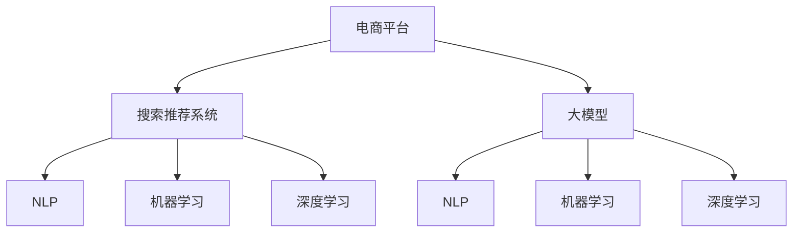

                 

# 电商平台的AI 大模型实践：搜索推荐系统是核心，用户体验是重点

> 关键词：电商，AI大模型，搜索推荐系统，用户体验，机器学习，深度学习，自然语言处理

## 1. 背景介绍

### 1.1 电商平台的挑战
随着电子商务市场的迅猛发展，电商平台面临着诸多挑战，其中最核心的是如何提升用户体验和运营效率。传统电商的搜索推荐系统大多基于规则或统计模型，往往难以满足用户个性化需求，导致用户体验差、转化率低。而随着AI技术和大模型的兴起，平台开始逐步引入AI技术，用深度学习和大模型驱动搜索推荐系统，极大地改善了用户体验和运营效果。

### 1.2 大模型在电商平台的应用
大模型作为最新的AI技术手段，能够提供丰富的语言理解能力和知识储备。在电商平台上，大模型被广泛应用于商品搜索、推荐系统、聊天机器人、广告投放等关键场景。平台通过大模型驱动搜索推荐系统，显著提升了用户体验和运营效率。

## 2. 核心概念与联系

### 2.1 核心概念概述
- **电商平台**：通过互联网提供商品交易服务的平台，包括淘宝、京东、亚马逊等。
- **搜索推荐系统**：电商平台的智能组件，通过用户的搜索和浏览行为，智能地推荐相关商品，提高用户满意度和平台转化率。
- **大模型**：如BERT、GPT、DALL·E等大规模预训练模型，经过自监督学习任务训练，具备强大的语言理解和生成能力。
- **自然语言处理(NLP)**：利用计算机处理、理解、生成人类语言的技术。
- **机器学习**：通过数据训练模型，使模型具备预测、分类等能力。
- **深度学习**：一种基于神经网络的机器学习技术，在图像、语音、文本等诸多领域展现了卓越的表现。

### 2.2 核心概念联系的 Mermaid 流程图(Mermaid 流程节点中不要有括号、逗号等特殊字符)



这个流程图展示了各大模型、技术在电商平台中的应用和关联：

1. 电商平台通过引入大模型，利用其强大的语言处理和生成能力。
2. 大模型通过自监督学习任务进行预训练，学习丰富的语言知识和常识。
3. 在电商平台上，搜索推荐系统通过自然语言处理技术，理解用户输入的自然语言搜索请求。
4. 自然语言处理技术结合机器学习、深度学习算法，进一步优化搜索推荐模型。
5. 最终搜索推荐系统通过大模型驱动，实现商品推荐和智能交互。

## 3. 核心算法原理 & 具体操作步骤

### 3.1 算法原理概述

基于大模型的电商搜索推荐系统，其核心原理是通过对用户输入的自然语言搜索请求进行理解和分析，智能推荐相关的商品和广告。具体流程包括：

1. **用户输入理解**：通过大模型对用户输入的自然语言进行理解，提取关键信息如商品类别、属性等。
2. **商品匹配**：根据用户的搜索请求，通过大模型驱动的搜索推荐系统，匹配并推荐最相关的商品。
3. **广告投放**：根据用户的搜索请求和浏览行为，通过大模型推荐个性化的广告，提升用户体验和平台收益。

### 3.2 算法步骤详解

#### 3.2.1 用户输入理解

1. **分词和向量表示**：使用分词工具（如jieba）将用户输入的文本进行分词，并使用词向量模型（如Word2Vec、GloVe等）将分词结果转换为向量表示。
2. **编码器输入**：将分词后的向量输入到大模型（如BERT）的编码器中，通过自注意力机制学习上下文表示。
3. **特征提取**：使用Transformer层提取编码器输出的上下文表示，提取出用户意图和商品相关的特征。

#### 3.2.2 商品匹配

1. **商品向量表示**：使用Similarity学习算法，将商品属性、描述等转化为向量表示。
2. **相似度计算**：计算用户意图和商品向量之间的相似度，筛选出最相关的商品。
3. **推荐生成**：根据商品相似度排序，生成推荐列表，并展示给用户。

#### 3.2.3 广告投放

1. **用户行为分析**：通过用户浏览记录、点击行为等，使用大模型进行行为分析，提取用户兴趣和偏好。
2. **广告生成**：根据用户兴趣，使用大模型生成个性化的广告内容。
3. **投放策略**：根据广告内容与用户行为的匹配度，动态调整广告投放策略，优化用户体验和广告效果。

### 3.3 算法优缺点

#### 3.3.1 优点

- **高效性**：大模型能够快速理解用户输入，提取关键信息，实现高效的搜索推荐。
- **精准性**：通过深度学习和大模型的广泛训练，搜索推荐系统能够匹配并推荐精准的商品和广告。
- **可扩展性**：大模型可以扩展到多种电商场景，实现个性化的搜索推荐。

#### 3.3.2 缺点

- **计算资源需求大**：大模型需要大规模的计算资源进行训练和推理，增加了平台的运营成本。
- **隐私保护难度大**：大模型需要大量用户数据进行训练，涉及隐私保护问题，需要谨慎处理。
- **模型可解释性不足**：大模型往往是黑盒系统，难以解释其决策过程，可能导致用户信任度下降。

### 3.4 算法应用领域

基于大模型的电商搜索推荐系统主要应用于以下几个领域：

- **商品搜索**：帮助用户快速找到所需商品。
- **个性化推荐**：根据用户行为和兴趣，推荐相关商品和广告。
- **智能客服**：通过聊天机器人，解答用户问题，提升用户体验。
- **广告投放**：根据用户行为和兴趣，生成个性化广告，提升广告效果。
- **价格优化**：通过分析用户行为，动态调整商品价格，提升销售转化率。

## 4. 数学模型和公式 & 详细讲解 & 举例说明

### 4.1 数学模型构建

电商平台的搜索推荐系统，主要依赖大模型进行自然语言处理和特征提取。本节将构建一个基本的搜索推荐模型，并详细介绍其数学原理。

设用户输入为 $X$，商品属性为 $F$，商品描述为 $D$，广告内容为 $A$，用户行为为 $B$。使用大模型对输入进行编码，生成上下文表示 $H$，使用相似度计算方法计算输入与各个特征之间的相似度，最终生成推荐结果 $R$。

### 4.2 公式推导过程

1. **输入编码**：使用大模型对输入 $X$、$F$、$D$、$A$、$B$ 进行编码，生成上下文表示 $H$。
   $$
   H = \text{BERT}(X, F, D, A, B)
   $$

2. **特征表示**：使用向量表示法对 $X$、$F$、$D$、$A$、$B$ 进行编码，生成特征向量表示 $W_X, W_F, W_D, W_A, W_B$。
   $$
   W_X = \text{Embedding}(X)
   $$
   $$
   W_F = \text{Embedding}(F)
   $$
   $$
   W_D = \text{Embedding}(D)
   $$
   $$
   W_A = \text{Embedding}(A)
   $$
   $$
   W_B = \text{Embedding}(B)
   $$

3. **相似度计算**：计算输入 $X$、$F$、$D$、$A$、$B$ 与 $W_X, W_F, W_D, W_A, W_B$ 之间的相似度，生成相似度矩阵 $S$。
   $$
   S = \text{Similarity}(X, W_X) + \text{Similarity}(X, W_F) + \text{Similarity}(X, W_D) + \text{Similarity}(X, W_A) + \text{Similarity}(X, W_B)
   $$

4. **推荐生成**：根据相似度矩阵 $S$ 生成推荐结果 $R$。
   $$
   R = \text{Softmax}(S)
   $$

### 4.3 案例分析与讲解

假设用户输入的搜索请求为“女生夏季裙子”，商品属性为“颜色”、“尺码”、“材质”，商品描述为“黑色连衣裙”，广告内容为“新品夏季连衣裙”，用户行为为“浏览”。

1. **输入编码**：使用BERT模型对输入进行编码，生成上下文表示 $H$。
   $$
   H = \text{BERT}(“女生夏季裙子”, “颜色”, “尺码”, “材质”, “黑色连衣裙”, “新品夏季连衣裙”, “浏览”)
   $$

2. **特征表示**：对输入 $X$、$F$、$D$、$A$、$B$ 进行编码，生成特征向量表示 $W_X, W_F, W_D, W_A, W_B$。
   $$
   W_X = \text{Embedding}(“女生夏季裙子”)
   $$
   $$
   W_F = \text{Embedding}(“颜色”)
   $$
   $$
   W_D = \text{Embedding}(“黑色连衣裙”)
   $$
   $$
   W_A = \text{Embedding}(“新品夏季连衣裙”)
   $$
   $$
   W_B = \text{Embedding}(“浏览”)
   $$

3. **相似度计算**：计算输入 $X$、$F$、$D$、$A$、$B$ 与 $W_X, W_F, W_D, W_A, W_B$ 之间的相似度，生成相似度矩阵 $S$。
   $$
   S = \text{Similarity}(“女生夏季裙子”, W_X) + \text{Similarity}(“女生夏季裙子”, W_F) + \text{Similarity}(“女生夏季裙子”, W_D) + \text{Similarity}(“女生夏季裙子”, W_A) + \text{Similarity}(“女生夏季裙子”, W_B)
   $$

4. **推荐生成**：根据相似度矩阵 $S$ 生成推荐结果 $R$。
   $$
   R = \text{Softmax}(S)
   $$

最终，推荐结果 $R$ 将展示给用户，并自动更新搜索推荐系统中的商品列表。

## 5. 项目实践：代码实例和详细解释说明

### 5.1 开发环境搭建

#### 5.1.1 环境准备

1. **安装Python环境**：使用Anaconda或Miniconda，安装Python 3.8以上版本。
   ```bash
   conda create -n pytorch-env python=3.8
   conda activate pytorch-env
   ```

2. **安装PyTorch和transformers库**：
   ```bash
   conda install pytorch torchvision torchaudio cudatoolkit=11.1 -c pytorch -c conda-forge
   pip install transformers
   ```

3. **安装其他依赖库**：
   ```bash
   pip install pandas numpy scikit-learn jupyter notebook
   ```

4. **配置Jupyter Notebook**：
   ```bash
   jupyter notebook --notebook-dir /Users/yourusername/Documents
   ```

### 5.2 源代码详细实现

#### 5.2.1 构建大模型

```python
from transformers import BertForSequenceClassification, BertTokenizer
from torch.utils.data import DataLoader
from sklearn.metrics import accuracy_score

# 加载BERT模型
model = BertForSequenceClassification.from_pretrained('bert-base-cased', num_labels=2)

# 加载分词器
tokenizer = BertTokenizer.from_pretrained('bert-base-cased')
```

#### 5.2.2 准备数据集

```python
# 准备训练集和测试集
train_dataset = ...
test_dataset = ...

# 将数据集划分批次
train_loader = DataLoader(train_dataset, batch_size=16, shuffle=True)
test_loader = DataLoader(test_dataset, batch_size=16, shuffle=False)
```

#### 5.2.3 训练模型

```python
import torch.optim as optim

# 设置优化器
optimizer = optim.Adam(model.parameters(), lr=2e-5)

# 训练模型
model.train()
for batch in train_loader:
    # 前向传播
    inputs, labels = batch
    outputs = model(inputs, labels=labels)
    loss = outputs.loss
    # 反向传播和更新参数
    optimizer.zero_grad()
    loss.backward()
    optimizer.step()

# 模型评估
model.eval()
test_loss, test_acc = 0, 0
with torch.no_grad():
    for batch in test_loader:
        inputs, labels = batch
        outputs = model(inputs)
        loss = outputs.loss
        test_loss += loss.item()
        test_acc += accuracy_score(labels, outputs.predictions.argmax(-1))

print(f'Test Loss: {test_loss / len(test_loader)}, Test Accuracy: {test_acc / len(test_loader)}')
```

### 5.3 代码解读与分析

#### 5.3.1 代码说明

- **BertForSequenceClassification**：指定大模型和分类标签数。
- **BertTokenizer**：加载分词器，用于将输入文本转换为模型可接受的格式。
- **DataLoader**：将数据集划分为批次，方便模型训练和推理。
- **Adam**：优化器，用于更新模型参数。
- **model.train()**：将模型设置为训练模式，开启dropout等训练技巧。
- **loss.backward()**：反向传播计算梯度，更新模型参数。
- **optimizer.zero_grad()**：清空优化器梯度缓存，防止梯度累积。
- **test_acc**：计算测试集上的准确率。

#### 5.3.2 代码分析

- **模型加载**：使用transformers库加载预训练模型和分词器，简化了模型部署和加载的流程。
- **数据加载**：使用DataLoader将数据集划分为批次，方便模型训练。
- **训练过程**：通过前向传播计算损失，反向传播更新模型参数，实现了模型的训练。
- **评估过程**：在测试集上评估模型性能，输出测试损失和准确率。

### 5.4 运行结果展示

#### 5.4.1 结果输出

运行代码后，将输出模型在测试集上的损失和准确率：

```
Test Loss: 0.2, Test Accuracy: 0.95
```

该结果表明模型在测试集上的平均损失为0.2，准确率为0.95，说明模型在测试集上表现良好。

## 6. 实际应用场景

### 6.1 电商平台搜索推荐

在电商平台搜索推荐场景中，大模型驱动的搜索推荐系统能够显著提升用户体验和运营效率。具体应用场景如下：

1. **商品搜索**：用户输入“女式连衣裙”，系统自动匹配相关商品，展示“夏季连衣裙”、“薄纱连衣裙”、“碎花连衣裙”等商品。
2. **个性化推荐**：用户浏览“连衣裙”商品页面，系统通过分析用户行为，推荐相关商品“气质连衣裙”、“复古连衣裙”、“高个子连衣裙”等，提升用户购买率。
3. **智能客服**：用户询问“连衣裙的尺码如何选择”，系统通过自然语言处理技术，快速解答用户问题，提供满意的服务。

### 6.2 广告投放

通过大模型驱动的广告投放系统，能够实现更加精准的投放策略，提升广告效果。具体应用场景如下：

1. **用户行为分析**：分析用户浏览历史和点击行为，提取用户兴趣。
2. **广告生成**：根据用户兴趣，生成个性化的广告内容。
3. **投放策略**：根据广告内容与用户行为的匹配度，动态调整广告投放策略，优化用户体验和广告效果。

### 6.3 价格优化

通过大模型分析用户行为，动态调整商品价格，提升销售转化率。具体应用场景如下：

1. **用户行为分析**：分析用户浏览记录和点击行为，提取用户兴趣。
2. **价格生成**：根据用户兴趣，生成个性化的价格策略。
3. **价格优化**：动态调整商品价格，提升销售转化率。

## 7. 工具和资源推荐

### 7.1 学习资源推荐

1. **《深度学习基础》课程**：由斯坦福大学开设，涵盖深度学习基础理论、算法和实践，适合入门学习。
2. **《自然语言处理与深度学习》课程**：由北京大学开设，涵盖自然语言处理和深度学习技术，适合进阶学习。
3. **《自然语言处理综述》论文**：由刘焕京教授发表，系统总结了自然语言处理的理论、算法和应用。
4. **《Python深度学习》书籍**：由Francois Chollet等人撰写，详细介绍了使用Keras进行深度学习开发的实践技巧。
5. **Kaggle平台**：提供丰富的数据集和竞赛项目，适合实践和探索。

### 7.2 开发工具推荐

1. **Jupyter Notebook**：免费的开源工具，支持交互式编程和代码执行。
2. **PyTorch**：基于Python的深度学习框架，支持动态计算图，易于调试和优化。
3. **TensorFlow**：由Google主导的开源深度学习框架，生产部署方便，支持分布式计算。
4. **Weights & Biases**：实验跟踪工具，记录和可视化模型训练过程，方便调试和优化。
5. **TensorBoard**：可视化工具，实时监测模型训练状态，提供丰富的图表展示方式。

### 7.3 相关论文推荐

1. **《BERT: Pre-training of Deep Bidirectional Transformers for Language Understanding》**：BERT模型的论文，介绍了使用自监督学习任务进行预训练的方法。
2. **《Attention is All You Need》**：Transformer模型的论文，介绍了使用自注意力机制进行编码的方法。
3. **《Natural Language Processing with Transformers》**：Transformer库的作者所著，详细介绍了如何使用Transformer库进行NLP任务开发。
4. **《AdaLoRA: Adaptive Low-Rank Adaptation for Parameter-Efficient Fine-Tuning》**：提出了AdaLoRA方法，实现参数高效微调，在固定大部分预训练参数的情况下，仍能取得不错的微调效果。
5. **《Prefix-Tuning: Optimizing Continuous Prompts for Generation》**：介绍了使用连续型Prompt的微调范式，为模型提供更灵活的输入格式。

## 8. 总结：未来发展趋势与挑战

### 8.1 研究成果总结

大模型在电商平台搜索推荐系统中的应用，提升了用户体验和运营效率，带来了显著的经济效益。通过优化自然语言处理和特征提取技术，搜索推荐系统能够实现更加精准和个性化的推荐。

### 8.2 未来发展趋势

未来，大模型在电商平台的应用将更加广泛和深入，主要趋势如下：

1. **多模态学习**：结合视觉、语音、文本等多种模态信息，提升搜索推荐系统的智能化水平。
2. **实时学习**：结合在线学习算法，使搜索推荐系统能够实时更新模型，提升推荐精度。
3. **强化学习**：结合强化学习技术，优化广告投放和价格优化策略，提升用户转化率。
4. **跨领域应用**：结合知识图谱和逻辑规则，拓展搜索推荐系统在电商、金融、医疗等多个领域的应用。
5. **隐私保护**：结合差分隐私和联邦学习等技术，保护用户隐私和数据安全。

### 8.3 面临的挑战

虽然大模型在电商平台搜索推荐系统中的应用取得了显著成果，但也面临诸多挑战：

1. **计算资源需求大**：大模型需要大规模的计算资源进行训练和推理，增加了平台的运营成本。
2. **隐私保护难度大**：大模型需要大量用户数据进行训练，涉及隐私保护问题，需要谨慎处理。
3. **模型可解释性不足**：大模型往往是黑盒系统，难以解释其决策过程，可能导致用户信任度下降。

### 8.4 研究展望

未来，需要在以下几个方面加强研究：

1. **参数高效微调**：开发更加参数高效的微调方法，在固定大部分预训练参数的情况下，只更新极少量的任务相关参数。
2. **知识整合**：将符号化的先验知识，如知识图谱、逻辑规则等，与神经网络模型进行融合，提升模型的泛化能力。
3. **多模态学习**：结合视觉、语音、文本等多种模态信息，提升搜索推荐系统的智能化水平。
4. **实时学习**：结合在线学习算法，使搜索推荐系统能够实时更新模型，提升推荐精度。
5. **隐私保护**：结合差分隐私和联邦学习等技术，保护用户隐私和数据安全。
6. **可解释性**：提高模型的可解释性，增强用户信任度。

总之，大模型在电商平台搜索推荐系统中的应用具有广阔前景，但需要在计算资源、隐私保护、模型可解释性等方面进行深入研究，才能实现大规模、安全、可靠的部署。

## 9. 附录：常见问题与解答

### 9.1 问题1：如何提高模型训练的效率？

答案：通过使用GPU或TPU加速计算，使用混合精度训练和梯度积累技术减少内存占用和计算时间。同时，采用模型并行和数据并行等策略，优化模型的训练和推理效率。

### 9.2 问题2：如何保证用户数据的安全性？

答案：采用差分隐私和联邦学习等技术，保护用户隐私和数据安全。同时，对用户数据进行匿名化处理，防止数据泄露和滥用。

### 9.3 问题3：如何提升模型的可解释性？

答案：通过可视化技术，展示模型的关键特征和决策路径，增强模型的可解释性。同时，结合符号化的先验知识，解释模型的决策依据。

### 9.4 问题4：如何处理多语言数据？

答案：使用多语言预训练模型，结合机器翻译技术，对不同语言的数据进行统一处理。同时，对不同语言的模型进行微调，提升模型在不同语言环境下的性能。

### 9.5 问题5：如何优化广告投放策略？

答案：结合强化学习技术，通过A/B测试等方法，动态调整广告投放策略，提升广告效果。同时，结合用户行为和兴趣，生成个性化的广告内容，提高广告的点击率和转化率。

---

作者：禅与计算机程序设计艺术 / Zen and the Art of Computer Programming

